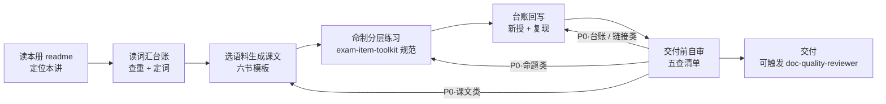

# 课文生成工作台

为 `src/english/general` 三册体系提供「生成 → 自审 → 回写」完整闭环。每讲是一篇 md 笔记，生成时必须同时维护**词汇台账**（精讲唯一 + 自然复现）与**分层练习**（可核验 + 答案分离）。

## 什么时候用

- "写 L02" / "继续下一讲" / "生成第 X 讲"
- "重写本讲" / "按台账补词群"
- "初始化第 X 册词汇台账"

## 速查表

| 使用场景 | 读哪个 reference |
|----------|------------------|
| 生成课文（六节模板、语料要求、命名与链接规范） | [lesson-template.md](reference/lesson-template.md) |
| 词汇台账（入账唯一、自然复现、升级讲、状态流转） | [vocab-ledger.md](reference/vocab-ledger.md) |
| 交付前自审（结构 / 词汇 / 语言 / 练习 / 链接五查 + P0/P1/P2） | [lesson-review.md](reference/lesson-review.md) |
| 练习命题细则（分层、查重基线、设计即核验） | exam-item-toolkit 的 [question-design.md](../exam-item-toolkit/reference/question-design.md) |
| 深度质量审查（六维评分，交付后可选） | doc-quality-reviewer |

## 流程概览

## 两条铁律

1. **词汇入账唯一**：写前必读本册台账；精讲表与词群表**都只收未入账词**，已入账词只允许在课文与例句中自然复现（复现率 ≥ 30%，type 口径，自各册 L02 起算），旧词新义走「升级讲」标注。详见 [vocab-ledger.md](reference/vocab-ledger.md)。
2. **设计即核验**：练习题答案必须有 ≥2 条相互独立的依据链（语法规则 + 改写还原 / 排除法）；课文完成后整体通读 + 逐句语法核查双路径自查。命题细则见 exam-item-toolkit。

## 质量红线

- 课文六节齐全（精读 / 词汇 / 语法 / 输出 / 练习 / 小结）+ 目标头部，**输出环节不可省略**
- 词汇表 10~14 词 = 精讲 6~8 + 高频词群 4~6，且与台账零重复入账
- 客观题题目数 = 答案数一一对应；输出类主观题给「要点覆盖说明 + 自检要点」；答案分离在文末
- 不链接未创建的文件（下一讲未写时用纯文本标注）
- 第一册常规讲课文 ≤ 130 词且落在 4200 高频带内；单元综合实战课（L08 类）≤ 150 词；超纲术语中文注释
- 与已有练习零重复（数字、结构、问法三维度）

## 版本

- **v0.2**（2026-09-08）：自审 review 修复 11 项 — 死链 ×2、首现 ≠ 复现定义与首讲豁免、入账唯一术语收口、主观题答案口径、P0 回流分流、复现率 type 口径与硬门槛统一。
- **v0.1**（2026-09-08）：骨架版。已固化：六节模板、词汇台账规则、五查自审。待实战回填：L02 / L03 生成后迭代语料配比与词群粒度，跑满 3 讲后定稿 v1.0。
