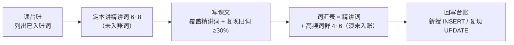

# 词汇台账规则（vocab-ledger）

> 解决一个问题：**入账不重复，复现不缺席**。台账是每册词汇的唯一账本，生成任何一讲前必须先读它。

---

## 0. 术语定义

| 术语 | 定义 |
|------|------|
| **精讲** | 词汇表「课内精讲」部分收词（6~8 词，五列表） |
| **词群入账** | 高频拓展词群表收词（4~6 词，三列表） |
| **入账** | 精讲 + 词群入账的统称；**入账唯一**：任何词只能入账一次 |
| **首现** | 词在其入账讲次课文中的出现；由词汇表「课文例句」列承载，**不进复现记录** |
| **复现** | 入账之后讲次（课文 / 例句 / 练习）的再次出现；**复现记录列只记这个** |
| **复现率** | 按词形去重（type）计算：本讲课文中出现的不同词形里，台账已入账词的占比；**自各册 L02 起统计，L01 标 N/A（首讲）** |

---

## 1. 台账文件

- 路径：`book-0X-xxx/vocab-ledger.md`，每册一份
- 时机：开写该册第一讲前初始化；已有讲次（如第一册 L01）开台账时补录

```markdown
# 第 X 册词汇台账

> 状态流转：新授 → 复现中（复现 ≥ 2 次）→ 已掌握（输出中正确使用 ≥ 1 次）
> 规则见 [english-lesson-crafter/reference/vocab-ledger.md](../../../../.agents/skills/english-lesson-crafter/reference/vocab-ledger.md)

| 词 | 核心释义 | 首次入账 | 词群 | 复现记录 | 状态 |
|----|---------|---------|------|---------|------|
| script | n. 脚本 | U01-L01（精讲） | 技术名词 | — | 新授 |
```

> ⚠️ **链接模板**：台账位于 `src/english/general/book-0X-xxx/`，到本仓库 `.agents/` 固定需要四级回退：`../../../../.agents/skills/english-lesson-crafter/reference/vocab-ledger.md`。
> 「首次入账」列标注入账方式：`（精讲）` 或 `（词群）`。

---

## 2. 三条规则

### 规则一：入账唯一

- 精讲表与词群表**都只收台账中不存在的词**
- 已入账词在后续任何讲次不得再次进入精讲表或词群表

### 规则二：自然复现

- 已入账词**应该**在后续课文、例句、练习中反复出现 — 复现是抗遗忘的核心，不是缺陷
- 复现率 ≥ 30%（type 口径，自各册 L02 起统计；首讲豁免）
- 复现在台账「复现记录」列记一笔（`U0X-LXX 课文复现` / `LXX 练习复现`）；**首现不记入此列**

### 规则三：升级讲

- 已入账词需要深挖（熟词僻义、短语动词、搭配网、语用色彩）时，标注「升级讲」并链接对应讲次
- 升级讲**不算新入账**，不改变「入账唯一」账目

---

## 3. 生成工作流（写一讲的词汇动作）



- **写前 SELECT**：台账 → 本讲精讲词候选 → 课文语料设计（覆盖精讲词 + 自然复现旧词）
- **写后回写**：新授词 `INSERT`；课文 / 练习中复现的旧词 `UPDATE` 复现记录；状态达标的词推进流转

---

## 4. 边界情况

| 情况 | 处理 |
|------|------|
| **词群实战课深挖已入账词**（如 L09 展开 L01 词群动词的搭配网） | 走**规则三升级讲**：可出现在讲次正文作为教学内容；但该讲精讲表 / 词群表仍只收**未入账的搭配块** |
| 练习中用旧词出题 | 允许且鼓励；记练习复现 |
| 超纲词出现在课文 | 不入账；加中文注释即可，第三册「高频超纲词带」单元例外 |
| 同形不同义（熟词僻义） | 第三册深加工单元的内容；第一、二册遇到时加注释，不开新账 |
