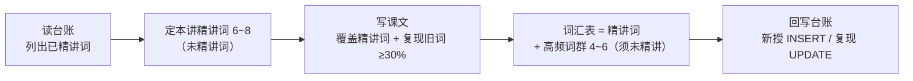

# 词汇台账规则（vocab-ledger）

> 解决一个问题：**精讲不重复，复现不缺席**。台账是每册词汇的唯一账本，生成任何一讲前必须先读它。

---

## 1. 台账文件

- 路径：`book-0X-xxx/vocab-ledger.md`，每册一份
- 时机：开写该册第一讲前初始化；已有讲次（如第一册 L01）开台账时补录

```markdown
# 第 X 册词汇台账

> 状态流转：新授 → 复现中（复现 ≥ 2 次）→ 已掌握（输出中正确使用 ≥ 1 次）

| 词 | 核心释义 | 首次精讲 | 词群 | 复现记录 | 状态 |
|----|---------|---------|------|---------|------|
| script | n. 脚本 | U01-L01 | 技术名词 | U01-L01 课文复现 1 次 | 新授 |
```

---

## 2. 三条规则

### 规则一：精讲唯一

- 词汇表**只收台账中不存在的词**
- 已精讲词在后续任何讲次都不得再次进词汇表

### 规则二：自然复现

- 已学词**应该**在后续课文、例句、练习中反复出现 — 复现是抗遗忘的核心，不是缺陷
- 课文语料的旧词复现率目标 ≥ 30%（课文中出现过的词里，台账旧词占比）
- 每次复现在台账「复现记录」列记一笔（`U0X-LXX 课文复现` / `LXX 练习复现`）

### 规则三：升级讲

- 旧词需要深挖（熟词僻义、短语动词、语用色彩）时，标注「升级讲」并链接对应讲次
- 升级讲**不算新授**，不改变「精讲唯一」账目

---

## 3. 生成工作流（写一讲的词汇动作）



- **写前 SELECT**：台账 → 本讲精讲词候选 → 课文语料设计（覆盖精讲词 + 自然复现旧词）
- **写后回写**：新授词 `INSERT`；课文 / 练习中复现的旧词 `UPDATE` 复现记录；状态达标的词推进流转

---

## 4. 边界情况

| 情况 | 处理 |
|------|------|
| 高频词群课（每单元末） | 讲「搭配网」而非新词义；涉及的旧词全部走复现记录，词群表中只允许出现未精讲词 |
| 练习中用旧词出题 | 允许且鼓励；记练习复现 |
| 超纲词出现在课文 | 不进台账精讲列；加中文注释即可，第三册「高频超纲词带」单元例外 |
| 同形不同义（熟词僻义） | 第三册深加工单元的内容；第一、二册遇到时加注释，不开新账 |
