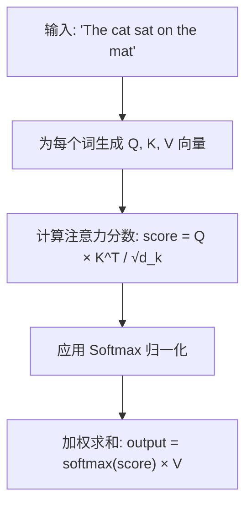
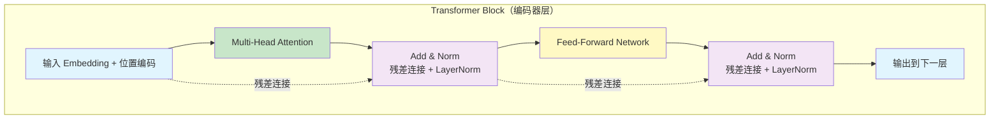

# 1.1 AI/ML 核心概念科普

> 从全栈工程师视角理解 AI/ML 核心概念，为 Agent 开发打下坚实基础

> **模块**：1.1 | **预计时间**：2h | **面试可答**：Transformer 原理、Embedding 选型、Token 成本估算、模型选型策略

## 学习目标

- 理解 Transformer 架构的核心原理
- 掌握 Embedding 向量化的本质
- 了解 Tokenization 与上下文窗口的工作机制
- 熟悉主流大模型的特点与适用场景
- 掌握模型选型与成本优化策略

---

## 1. Transformer 架构原理

### 1.1 什么是 Transformer

Transformer 是 2017 年 Google 在论文《Attention Is All You Need》中提出的神经网络架构，彻底改变了 NLP 领域，成为当今所有大语言模型（LLM）的基础。

**核心创新**：
- **自注意力机制（Self-Attention）**：让模型能够关注输入序列中任意位置的信息
- **并行计算**：相比 RNN/LSTM，Transformer 可以并行处理整个序列
- **位置编码**：通过位置编码保留序列顺序信息

### 1.2 自注意力机制详解



**直观理解**：
- 当模型处理 "cat" 这个词时，它会同时关注 "sat"（动作）和 "mat"（位置）
- 注意力分数决定了每个词对当前词的重要程度
- 这种机制让模型能够理解长距离依赖关系

### 1.3 多头注意力（Multi-Head Attention）

```typescript
// 概念示意代码（非可运行，仅展示多头注意力的结构）
class MultiHeadAttention {
  private heads: AttentionHead[];
  
  constructor(numHeads: number = 8) {
    this.heads = Array.from({ length: numHeads }, () => new AttentionHead());
  }
  
  forward(x: Tensor): Tensor {
    // 每个头独立计算注意力
    const headOutputs = this.heads.map(head => head.forward(x));
    // 拼接所有头的输出
    return concat(headOutputs);
  }
}
```

**为什么需要多头**：
- 不同的头可以关注不同类型的语言关系
- 例如：一个头关注语法结构，另一个头关注语义相似性
- 主流大模型通常使用数十到上百个注意力头（具体数量多数未官方公开），多头机制让模型能同时关注不同位置的不同语义特征

### 1.4 Transformer 的核心组件



**关键组件**：
- **Layer Normalization**：稳定训练过程
- **残差连接**：缓解梯度消失问题
- **Feed-Forward Network**：非线性变换，增加模型容量

---

## 2. Embedding 向量化原理

### 2.1 什么是 Embedding

Embedding 是将离散的符号（如文字、图片）映射到连续向量空间的技术。它是大模型理解世界的"翻译器"。

**核心思想**：
- 语义相似的概念在向量空间中距离更近
- 向量的每一维度代表某种潜在的语义特征
- 通过向量运算可以实现语义推理

### 2.2 文本 Embedding

```
"国王" → [0.2, 0.8, 0.1, ...]  (768维向量)
"王后" → [0.3, 0.7, 0.2, ...]  (768维向量)
"苹果" → [0.9, 0.1, 0.5, ...]  (768维向量)

向量距离:
- 国王 ↔ 王后 = 0.15 (很近，语义相似)
- 国王 ↔ 苹果 = 0.85 (很远，语义不同)
```

### 2.3 主流 Embedding 模型

| 模型 | 维度 | 特点 | 适用场景 |
|------|------|------|----------|
| OpenAI text-embedding-3-large | 3072 | 性能最强，成本较高 | 企业级应用 |
| OpenAI text-embedding-3-small | 1536 | 性价比高 | 通用场景 |
| Cohere embed-v3 | 1024 | 多语言支持好 | 国际化应用 |
| BGE-M3 | 1024 | 开源免费 | 本地部署 |
| GTE-Qwen2 | 1536/3584 | 中文优化 | 中文场景 |

### 2.4 Embedding 的实际应用

**语义搜索**：
```typescript
// 1. 将文档转换为向量
const docEmbeddings = await embedDocuments(documents);

// 2. 将查询转换为向量
const queryEmbedding = await embedQuery("如何学习 TypeScript");

// 3. 计算相似度
const similarities = docEmbeddings.map(doc => 
  cosineSimilarity(queryEmbedding, doc.embedding)
);

// 4. 返回最相关的文档
return documents[argmax(similarities)];
```

**聚类分析**：
```typescript
// 将客户反馈聚类，发现常见问题
const feedbackEmbeddings = await embedBatch(feedbacks);
const clusters = kMeans(feedbackEmbeddings, k=5);
```

---

## 3. Tokenization 与上下文窗口

### 3.1 什么是 Tokenization

Tokenization 是将文本分割成模型能理解的最小单元（Token）的过程。

**分词示例**：
```
输入: "Hello, how are you?"

Token 化结果（GPT 系列）:
["Hello", ",", " how", " are", " you", "?"]

Token 化结果（中文示例）:
输入: "你好，你怎么样？"
分词: ["你好", "，", "你", "怎么样", "？"]

注意：不同模型的中文分词策略差异很大，GPT 系列通常按字或子词切分，实际结果可能不同。
```

### 3.2 主流分词算法

**BPE（Byte Pair Encoding）**：
- GPT 系列使用
- 从字符级别开始，逐步合并高频字符对
- 优点：平衡词汇量和分词粒度

**WordPiece**：
- BERT 使用
- 类似 BPE，但使用似然概率而非频率
- 优点：更适合特定领域

**SentencePiece**：
- 多语言模型使用
- 直接在原始文本上训练，不依赖预分词
- 优点：语言无关，适合多语言场景

### 3.3 上下文窗口

上下文窗口（Context Window）是模型一次能处理的 Token 数量上限。

**2026年9月主流模型上下文窗口**：
| 模型 | 上下文窗口 | 约等于 |
|------|-----------|--------|
| GPT-5.6 系列 | 1.05M tokens | 80万字 |
| Claude Opus 5 | 1M tokens | 75万字 |
| Gemini 3.8 Flash | 1M tokens | 75万字 |
| Qwen3.8 Max | 1M tokens | 75万字 |

**上下文窗口的影响**：
- **短窗口**：成本低，速度快，但无法处理长文档
- **长窗口**：能处理长文档，但成本高，速度慢
- **实际应用**：需要根据任务选择合适的窗口大小

### 3.4 Token 计数与成本估算

```typescript
// 使用 tiktoken 计算 token 数
import { encoding_for_model } from 'tiktoken';

const enc = encoding_for_model('gpt-4');
const tokens = enc.encode("Hello, how are you?");
console.log(tokens.length); // 6

// 成本估算
const inputPrice = 0.01; // $0.01 per 1K tokens
const outputPrice = 0.03; // $0.03 per 1K tokens

const cost = (inputTokens * inputPrice + outputTokens * outputPrice) / 1000;
```

---

## 4. 主流大模型对比（2026年9月）

### 4.1 OpenAI GPT 系列

**GPT-5.6 Sol**（2026-07 发布）：
- 上下文：1.05M tokens
- 特点：OpenAI 当前旗舰，深度思考模式，综合能力最强
- 价格：$5/$30 per 1M tokens（输入/输出）

**GPT-5.6 Terra / Luna**：
- Terra：均衡版，$2.50/$15 per 1M tokens
- Luna：轻量版，适合高并发、成本敏感场景

### 4.2 Anthropic Claude 系列

**Claude Opus 5**（2026-07 发布）：
- 上下文：1M tokens
- 特点：编码能力双榜领先，Agentic 任务第一
- 价格：$5/$25 per 1M tokens

**Claude Sonnet 5**（2026-06 发布）：
- Agent 能力大幅增强，性价比最优，日常与业务开发首选

**Claude Fable 5**：
- 智能指数最高档，写作质量最佳
- 价格：$10/$50 per 1M tokens
- 适合：复杂创作与高难度推理

### 4.3 Google Gemini 系列

**Gemini 3.8 Flash**（2026-09 发布）：
- 上下文：1M tokens
- 特点：原生多模态（视频/图像/音频），速度快、成本低
- 价格：$0.75/$3.75 per 1M tokens
- 适合：多模态、高并发、成本敏感场景

### 4.4 开源模型

**Qwen3.8 Max**（阿里）：
- 当前最强开源权重模型，Agent 能力接近闭源第一梯队
- 上下文：1M tokens
- 适合：私有化部署、中文场景

**GLM-5.3 / GLM-5.3 Flash**（智谱）：
- Flash 版 MIT 开源权重，$0.15/$0.50 per 1M tokens
- 适合：高并发、成本敏感、本地部署

**Kimi K3**（月之暗面）：
- 1M token 无损上下文，前端视觉编程口碑好
- 价格：$3/$15 per 1M tokens

**DeepSeek V4**：
- 推理能力强，V4-Flash 离峰时段成本极低
- 适合：推理任务、批处理场景

---

## 5. 模型选型与成本优化策略

### 5.1 模型选型决策树（2026年9月）

```
任务类型
├── 复杂推理任务
│   ├── 预算充足 → GPT-5.6 Sol（深度思考模式）/ Claude Opus 5
│   └── 预算有限 → GLM-5.3 Flash / DeepSeek V4-Flash
├── 代码生成与 Agent 任务
│   ├── 复杂项目 → Claude Opus 5（编码双榜领先）
│   └── 日常编码 → Claude Sonnet 5（性价比最优）
├── 多模态任务
│   ├── 视频/图像 → GPT-5.6 系列（图文视频）
│   └── 低成本多模态 → Gemini 3.8 Flash（原生多模态）
├── 长文档分析
│   ├── 超长文档 → GPT-5.6（105万token）/ Claude Opus 5（100万token）
│   └── 成本可控 → 检索增强（RAG）+ 摘要压缩
├── 成本敏感场景
│   ├── 高并发 → GLM-5.3 Flash（$0.15/$0.50，MIT 开源）
│   └── 离峰批处理 → DeepSeek V4-Flash
└── 本地/私有化部署
    └── 开源权重 → Qwen3.8 Max / GLM-5.3 / DeepSeek V4
```

### 5.2 成本优化策略

**1. 模型分层策略**：
```typescript
// 根据任务复杂度选择模型
function selectModel(task: Task): Model {
  if (task.complexity === 'high') {
    return 'claude-opus-5';
  } else if (task.complexity === 'medium') {
    return 'claude-sonnet-5';
  } else {
    return 'glm-5.3-flash';
  }
}
```

**2. 缓存策略**：
```typescript
// 缓存常见查询结果
const cache = new Map<string, string>();

async function cachedQuery(query: string): Promise<string> {
  if (cache.has(query)) {
    return cache.get(query)!;
  }
  
  const result = await llm.query(query);
  cache.set(query, result);
  return result;
}
```

**3. 批处理策略**：
```typescript
// 批量处理多个请求
async function batchProcess(queries: string[]): Promise<string[]> {
  const batchedPrompt = queries.map((q, i) => `[${i}] ${q}`).join('\n');
  const result = await llm.query(batchedPrompt);
  return parseBatchResult(result);
}
```

**4. 流式输出策略**：
```typescript
// 使用流式输出减少等待时间
const stream = await llm.streamQuery(query);
for await (const chunk of stream) {
  process.stdout.write(chunk);
}
```

### 5.3 Token 使用监控

```typescript
// 监控 token 使用量
class TokenMonitor {
  private usage: Map<string, number> = new Map();
  
  track(model: string, inputTokens: number, outputTokens: number) {
    const cost = this.calculateCost(model, inputTokens, outputTokens);
    this.usage.set(model, (this.usage.get(model) || 0) + cost);
  }
  
  getUsage(): Map<string, number> {
    return this.usage;
  }
  
  private calculateCost(model: string, input: number, output: number): number {
    const prices = {
      'claude-opus-5': { input: 5, output: 25 },
      'gpt-5.6-sol': { input: 5, output: 30 },
      'glm-5.3-flash': { input: 0.15, output: 0.5 },
      // ... 其他模型
    };
    
    const price = prices[model];
    return (input * price.input + output * price.output) / 1_000_000;
  }
}
```

---

## 技术对比

### Transformer vs RNN/LSTM vs CNN

| 特性 | Transformer | RNN/LSTM | CNN |
|------|-------------|----------|-----|
| **并行计算** | ✅ 支持 | ❌ 顺序计算 | ✅ 支持 |
| **长距离依赖** | ✅ 直接建模 | ⚠️ 梯度消失 | ⚠️ 需要多层 |
| **位置信息** | 需要位置编码 | 天然保留 | 局部窗口 |
| **计算复杂度** | O(n²) | O(n) | O(n) |
| **适用场景** | NLP、多模态 | 序列生成 | 图像处理 |
| **代表模型** | GPT、BERT、Claude | LSTM-Attention | ResNet、ViT |

**选择建议**：
- 需要处理长文本 → Transformer
- 需要实时生成（如语音合成）→ 早期使用 RNN/LSTM，当前主流已转向 Transformer 架构（如 VALL-E、CosyVoice）
- 需要处理图像 → CNN 或 Vision Transformer

### Embedding 模型对比

| 模型 | 维度 | 价格 | 多语言 | 适用场景 |
|------|------|------|--------|----------|
| text-embedding-3-large | 3072 | $0.13/1M | ✅ | 企业级应用 |
| text-embedding-3-small | 1536 | $0.02/1M | ✅ | 通用场景 |
| Cohere embed-v3 | 1024 | $0.10/1M | ✅✅ | 国际化应用 |
| BGE-M3 | 1024 | 免费 | ✅ | 本地部署 |
| GTE-Qwen2 | 1536/3584 | 免费 | ✅ | 中文优化 |

---

## 面试问答

> **问：Transformer 为什么比 RNN 快？**
>
> 答：Transformer 支持**并行计算**，可以同时处理整个序列；而 RNN 是顺序计算，必须逐步处理。具体来说：
> 1. Transformer 的自注意力机制可以并行计算所有位置之间的关系
> 2. RNN 必须按顺序处理，当前时刻的计算依赖前一时刻的结果
> 3. GPU 对矩阵运算优化更好，Transformer 的矩阵运算更适合 GPU 并行

> **问：Embedding 维度如何选择？**
>
> 答：根据**数据量**和**精度要求**选择：
> - 高维度（3072）：表达能力强，适合企业级应用，但存储成本高
> - 中维度（1536）：性价比高，适合通用场景
> - 低维度（768）：存储成本低，适合本地部署和简单任务
>
> 实际经验：如果数据量 < 100 万，1536 维足够；如果 > 100 万且精度要求高，选择 3072 维。

> **问：Tokenization 对模型性能有什么影响？**
>
> 答：Tokenization 影响：
> 1. **词汇量大小**：词汇量太大增加模型参数，太小导致 OOV（未登录词）
> 2. **分词粒度**：太细丢失语义，太粗增加序列长度
> 3. **多语言支持**：不同语言的分词效果差异大
>
> 最佳实践：使用 BPE（Byte Pair Encoding）平衡词汇量和分词粒度。

> **问：如何优化 LLM 调用成本？**
>
> 答：主要策略：
> 1. **模型分层**：简单任务用小模型（Haiku），复杂任务用大模型（Opus）
> 2. **缓存策略**：缓存常见查询结果，避免重复调用
> 3. **批处理**：将多个请求合并为一次调用
> 4. **流式输出**：减少用户等待时间，提高体验
> 5. **Prompt 优化**：减少不必要的 Token 消耗

> **问：什么是上下文窗口？如何处理超长文本？**
>
> 答：上下文窗口是模型一次能处理的 Token 数量上限。处理超长文本的方法：
> 1. **文本分割**：将长文本分割成多个片段，分别处理
> 2. **检索增强（RAG）**：只检索最相关的片段作为上下文
> 3. **摘要压缩**：先生成摘要，再基于摘要回答问题
> 4. **使用长窗口模型**：如 GPT-5.6（105 万 Token）/ Claude Opus 5（100 万 Token）

---

## 实践练习

### 练习 1：Embedding 相似度计算

**要求**：计算三段文本的语义相似度，验证语义相似的文本向量距离更近。

**提示**：
- 使用 `@langchain/openai` 的 `OpenAIEmbeddings`
- 使用余弦相似度计算向量距离
- 需要实现 `cosineSimilarity` 函数

**预期效果**：
- 相似文本（TypeScript 相关）的相似度 > 0.8
- 不相似文本（TypeScript vs 天气）的相似度 < 0.3

```typescript
// 计算两段文本的语义相似度
import { OpenAIEmbeddings } from '@langchain/openai';

const embeddings = new OpenAIEmbeddings();

// 实现余弦相似度函数
function cosineSimilarity(a: number[], b: number[]): number {
  const dotProduct = a.reduce((sum, val, i) => sum + val * b[i], 0);
  const normA = Math.sqrt(a.reduce((sum, val) => sum + val * val, 0));
  const normB = Math.sqrt(b.reduce((sum, val) => sum + val * val, 0));
  return dotProduct / (normA * normB);
}

const text1 = "TypeScript 是 JavaScript 的超集";
const text2 = "TypeScript 添加了静态类型系统";
const text3 = "今天天气真好";

const [vec1, vec2, vec3] = await Promise.all([
  embeddings.embedQuery(text1),
  embeddings.embedQuery(text2),
  embeddings.embedQuery(text3),
]);

console.log("相似度 1-2:", cosineSimilarity(vec1, vec2)); // 预期：0.8+
console.log("相似度 1-3:", cosineSimilarity(vec1, vec3)); // 预期：<0.3
```

---

### 练习 2：Token 计数与成本估算

**要求**：估算一次 API 调用的 Token 数量和成本。

**提示**：
- 使用 `tiktoken` 库计算 Token 数量
- 不同模型的价格不同，参考 OpenAI 官方定价
- 注意区分输入和输出的价格

**预期效果**：
- 能准确计算给定文本的 Token 数量
- 能根据 Token 数量估算成本

```typescript
// 估算一次 API 调用的成本
import { get_encoding } from 'tiktoken';

const enc = get_encoding('cl100k_base');
// 注：cl100k_base 为 GPT-4 时代词表，对 GPT-5.6 系列仅作近似估算，实际以各模型官方 tokenizer 为准

const prompt = "请解释什么是 Transformer 架构";
const tokens = enc.encode(prompt);

console.log(`Token 数量: ${tokens.length}`);

// 假设输出 Token 数量是输入的 2 倍
const inputTokens = tokens.length;
const outputTokens = inputTokens * 2;

// GPT-5.6 Sol 价格：$5/1M 输入，$30/1M 输出
const inputCost = inputTokens * 5 / 1_000_000;
const outputCost = outputTokens * 30 / 1_000_000;
const totalCost = inputCost + outputCost;

console.log(`预估成本: $${totalCost.toFixed(6)}`);
enc.free();
```

---

### 练习 3：模型选型实践

**要求**：根据任务类型、复杂度和预算，选择合适的模型。

**提示**：
- 参考 5.1 的模型选型决策树
- 考虑成本和性能的平衡
- 可以扩展决策矩阵

**预期效果**：
- 能根据任务特征选择合适的模型
- 理解不同模型的适用场景

```typescript
// 根据任务选择合适的模型
interface Task {
  type: 'coding' | 'writing' | 'analysis' | 'multimodal';
  complexity: 'low' | 'medium' | 'high';
  budget: 'low' | 'medium' | 'high';
}

function selectModel(task: Task): string {
  const matrix = {
    coding: {
      low: 'glm-5.3-flash',
      medium: 'claude-sonnet-5',
      high: 'claude-opus-5',
    },
    writing: {
      low: 'glm-5.3-flash',
      medium: 'claude-sonnet-5',
      high: 'claude-fable-5',
    },
    analysis: {
      low: 'glm-5.3-flash',
      medium: 'gpt-5.6-terra',
      high: 'gpt-5.6-sol',
    },
    multimodal: {
      low: 'gemini-3.8-flash',
      medium: 'gpt-5.6-terra',
      high: 'gpt-5.6-sol',
    },
  };
  
  return matrix[task.type][task.complexity];
}

// 测试用例
console.log(selectModel({ type: 'coding', complexity: 'high', budget: 'high' })); // claude-opus-5
console.log(selectModel({ type: 'analysis', complexity: 'low', budget: 'low' })); // glm-5.3-flash
console.log(selectModel({ type: 'multimodal', complexity: 'medium', budget: 'medium' })); // gpt-5.6-terra
```

---

## 总结

**核心要点**：
1. **Transformer** 是所有大模型的基础，自注意力机制是其核心创新
2. **Embedding** 将离散符号映射到连续向量空间，实现语义理解
3. **Tokenization** 将文本分割成模型能理解的最小单元
4. **上下文窗口** 决定了模型一次能处理的信息量
5. **模型选型** 需要根据任务类型、复杂度和预算综合考虑

> 💡 本文与后续章节代码示例中的模型 ID（如 `gpt-5.6-sol`、`claude-opus-5`）以 1.1 选型决策树为准；模型迭代快，生产环境请以各 Provider 官方 model list 为准。

**下一步**：
- 学习 Agent 架构设计范式（1.2）
- 动手实践 Embedding 计算
- 尝试不同模型的 API 调用

---

*参考资料*：
- [Attention Is All You Need](https://arxiv.org/abs/1706.03762)
- [OpenAI Embeddings Guide](https://platform.openai.com/docs/guides/embeddings)
- [Anthropic Claude Documentation](https://docs.anthropic.com/)
- [Google Gemini Documentation](https://ai.google.dev/docs)