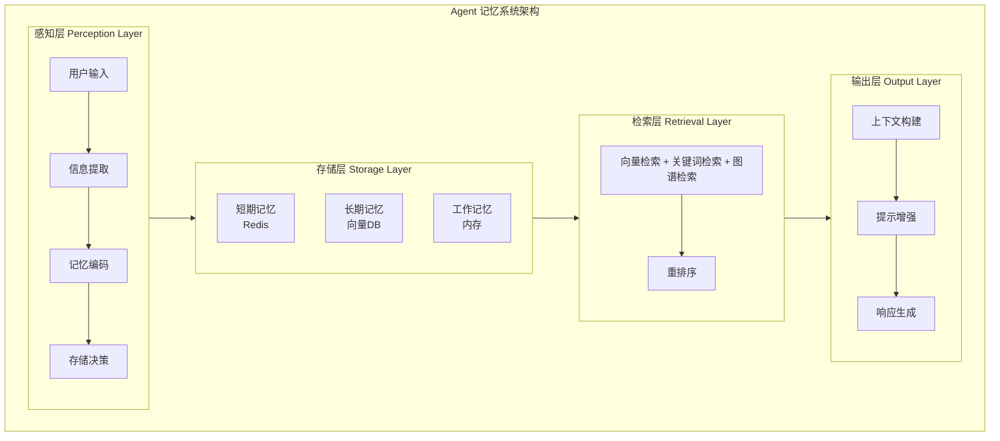
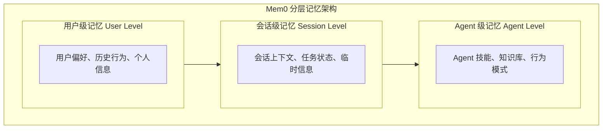

# 1.3 Agent 记忆系统设计

> 构建智能记忆系统，让 Agent 拥有短期记忆、长期记忆和检索能力

## 学习目标

- 理解短期记忆与长期记忆的区别和作用
- 掌握 Mem0 分层记忆架构
- 实现三路召回：向量检索 + 关键词检索 + 图谱检索
- 学习记忆压缩与摘要策略
- 掌握 Redis 短期记忆存储最佳实践

---

## 1. 记忆系统概述

### 1.1 为什么 Agent 需要记忆

**没有记忆的 Agent**：
```
用户: 我叫张三，喜欢编程
Agent: 你好张三！很高兴认识你。

用户: 我叫什么？
Agent: 抱歉，我不知道你的名字。
```

**有记忆的 Agent**：
```
用户: 我叫张三，喜欢编程
Agent: 你好张三！很高兴认识你。

用户: 我叫什么？
Agent: 你叫张三，你喜欢编程。
```

### 1.2 记忆的分类

**按时间分类**：
- **短期记忆（Working Memory）**：当前会话的上下文信息
- **长期记忆（Long-term Memory）**：持久化的用户信息和知识

**按内容分类**：
- **情景记忆（Episodic Memory）**：具体的交互历史
- **语义记忆（Semantic Memory）**：抽象的知识和概念
- **程序性记忆（Procedural Memory）**：技能和操作步骤

### 1.3 记忆系统架构



---

## 2. 短期记忆：会话上下文管理

### 2.1 短期记忆的特点

**特点**：
- 生命周期短（当前会话）
- 容量有限（上下文窗口）
- 访问频率高
- 需要快速读写

**存储内容**：
- 当前对话历史
- 任务执行状态
- 中间计算结果
- 用户临时偏好

### 2.2 短期记忆实现

**基于数组的简单实现**：
```typescript
class ShortTermMemory {
  private messages: Message[] = [];
  private maxTokens: number;
  
  constructor(maxTokens: number = 4000) {
    this.maxTokens = maxTokens;
  }
  
  add(message: Message): void {
    this.messages.push(message);
    this.trim();
  }
  
  getHistory(): Message[] {
    return this.messages;
  }
  
  private trim(): void {
    let totalTokens = 0;
    const trimmed: Message[] = [];
    
    // 从最新的消息开始保留
    for (let i = this.messages.length - 1; i >= 0; i--) {
      const tokens = countTokens(this.messages[i].content);
      if (totalTokens + tokens > this.maxTokens) break;
      totalTokens += tokens;
      trimmed.unshift(this.messages[i]);
    }
    
    this.messages = trimmed;
  }
}
```

**滑动窗口策略**：
```typescript
class SlidingWindowMemory {
  private windowSize: number;
  private messages: Message[] = [];
  
  constructor(windowSize: number = 10) {
    this.windowSize = windowSize;
  }
  
  add(message: Message): void {
    this.messages.push(message);
    if (this.messages.length > this.windowSize) {
      this.messages.shift();
    }
  }
}
```

### 2.3 上下文压缩

**摘要压缩**：
```typescript
class SummarizingMemory {
  private messages: Message[] = [];
  private summary: string = '';
  private llm: LLM;
  
  async add(message: Message): Promise<void> {
    this.messages.push(message);
    
    // 当消息过多时，生成摘要
    if (this.messages.length > 20) {
      await this.summarize();
    }
  }
  
  private async summarize(): Promise<void> {
    const conversation = this.messages.slice(0, -5).map(m => 
      `${m.role}: ${m.content}`
    ).join('\n');
    
    const newSummary = await this.llm.query(`
      请将以下对话总结为简洁的摘要，保留关键信息：
      
      ${conversation}
      
      之前的摘要：${this.summary}
    `);
    
    this.summary = newSummary;
    this.messages = this.messages.slice(-5);
  }
  
  getContext(): string {
    const recentMessages = this.messages.map(m => 
      `${m.role}: ${m.content}`
    ).join('\n');
    
    return `历史摘要：${this.summary}\n\n最近对话：\n${recentMessages}`;
  }
}
```

---

## 3. 长期记忆：Mem0 分层记忆架构

### 3.1 Mem0 概述

Mem0 是一个专门为 AI Agent 设计的长期记忆系统，采用分层架构，支持多种记忆类型。

**核心特性**：
- **分层存储**：支持用户级、会话级、Agent 级记忆
- **自动提取**：自动从对话中提取重要信息
- **智能检索**：基于语义相似度的记忆检索
- **冲突解决**：处理记忆之间的矛盾信息

### 3.2 Mem0 架构



### 3.3 Mem0 实现

**安装 Mem0**：
```bash
npm install mem0ai
```

**基本使用**：
```typescript
import { Memory } from 'mem0ai';

// 初始化记忆系统
const memory = new Memory({
  apiKey: 'your-api-key',
  // 或使用本地模式
  // host: 'localhost',
  // port: 8080
});

// 添加记忆
await memory.add("我喜欢使用 TypeScript 编程", {
  userId: "user-123",
  metadata: { category: "programming_preference" }
});

// 检索记忆
const results = await memory.search("编程语言偏好", {
  userId: "user-123",
  limit: 5
});

// 获取所有记忆
const allMemories = await memory.getAll({
  userId: "user-123"
});

// 更新记忆
await memory.update("memory-id", "我现在更喜欢使用 Rust");

// 删除记忆
await memory.delete("memory-id");
```

### 3.4 自动记忆提取

```typescript
class AutoMemoryExtractor {
  private llm: LLM;
  private memory: Memory;
  
  async extractFromConversation(messages: Message[]): Promise<void> {
    const conversation = messages.map(m => 
      `${m.role}: ${m.content}`
    ).join('\n');
    
    // 使用 LLM 提取关键信息
    const extraction = await this.llm.query(`
      从以下对话中提取用户的重要信息，包括：
      1. 个人偏好
      2. 重要事实
      3. 行为模式
      4. 明确的需求
      
      对话内容：
      ${conversation}
      
      请以 JSON 格式返回提取的信息。
    `);
    
    const memories = JSON.parse(extraction);
    
    // 存储提取的记忆
    for (const memory of memories) {
      await this.memory.add(memory.content, {
        userId: memory.userId,
        category: memory.category,
        confidence: memory.confidence
      });
    }
  }
}
```

---

## 4. 三路召回：向量检索 + 关键词检索 + 图谱检索

### 4.1 三路召回概述

三路召回是结合三种不同检索方式的记忆检索策略，旨在提高检索的准确性和召回率。

**三种检索方式**：
- **向量检索**：基于语义相似度
- **关键词检索**：基于精确匹配
- **图谱检索**：基于关系网络

### 4.2 向量检索

**原理**：
- 将记忆和查询都转换为向量
- 计算向量之间的相似度
- 返回最相似的记忆

**实现**：
```typescript
class VectorRetrieval {
  private embeddings: Embeddings;
  private vectorStore: VectorStore;
  
  async index(memory: Memory): Promise<void> {
    const embedding = await this.embeddings.embed(memory.content);
    await this.vectorStore.add({
      id: memory.id,
      vector: embedding,
      metadata: memory.metadata
    });
  }
  
  async retrieve(query: string, topK: number = 5): Promise<Memory[]> {
    const queryEmbedding = await this.embeddings.embed(query);
    const results = await this.vectorStore.search(queryEmbedding, topK);
    return results.map(r => r.memory);
  }
}
```

### 4.3 关键词检索

**原理**：
- 基于倒排索引
- 支持精确匹配和模糊匹配
- 适合结构化查询

**实现**：
```typescript
class KeywordRetrieval {
  private index: Map<string, Set<string>> = new Map();
  private memories: Map<string, Memory> = new Map();
  
  async index(memory: Memory): Promise<void> {
    const keywords = this.extractKeywords(memory.content);
    
    for (const keyword of keywords) {
      if (!this.index.has(keyword)) {
        this.index.set(keyword, new Set());
      }
      this.index.get(keyword).add(memory.id);
    }
    
    this.memories.set(memory.id, memory);
  }
  
  async retrieve(query: string, topK: number = 5): Promise<Memory[]> {
    const keywords = this.extractKeywords(query);
    const scores: Map<string, number> = new Map();
    
    for (const keyword of keywords) {
      const memoryIds = this.index.get(keyword) || new Set();
      for (const id of memoryIds) {
        scores.set(id, (scores.get(id) || 0) + 1);
      }
    }
    
    const sorted = Array.from(scores.entries())
      .sort((a, b) => b[1] - a[1])
      .slice(0, topK);
    
    return sorted.map(([id]) => this.memories.get(id));
  }
  
  private extractKeywords(text: string): string[] {
    // 简单的关键词提取（实际应用中可以使用更复杂的算法）
    return text.toLowerCase()
      .replace(/[^\w\s]/g, '')
      .split(/\s+/)
      .filter(word => word.length > 2);
  }
}
```

### 4.4 图谱检索

**原理**：
- 将记忆组织成知识图谱
- 基于实体关系进行检索
- 支持多跳推理

**实现**：
```typescript
class GraphRetrieval {
  private graph: KnowledgeGraph;
  
  async index(memory: Memory): Promise<void> {
    // 提取实体和关系
    const entities = await this.extractEntities(memory.content);
    const relations = await this.extractRelations(memory.content);
    
    // 添加到图谱
    for (const entity of entities) {
      await this.graph.addNode(entity);
    }
    
    for (const relation of relations) {
      await this.graph.addEdge(relation);
    }
  }
  
  async retrieve(query: string, topK: number = 5): Promise<Memory[]> {
    // 提取查询中的实体
    const queryEntities = await this.extractEntities(query);
    
    // 从图谱中检索相关节点
    const relatedNodes = new Set<string>();
    for (const entity of queryEntities) {
      const neighbors = await this.graph.getNeighbors(entity.id, 2); // 2跳
      neighbors.forEach(n => relatedNodes.add(n.id));
    }
    
    // 返回相关的记忆
    return Array.from(relatedNodes).slice(0, topK).map(id => 
      this.graph.getNodeMemory(id)
    );
  }
}
```

### 4.5 三路召回融合

```typescript
class HybridRetrieval {
  private vectorRetrieval: VectorRetrieval;
  private keywordRetrieval: KeywordRetrieval;
  private graphRetrieval: GraphRetrieval;
  
  async retrieve(query: string, topK: number = 5): Promise<Memory[]> {
    // 并行执行三路检索
    const [vectorResults, keywordResults, graphResults] = await Promise.all([
      this.vectorRetrieval.retrieve(query, topK * 2),
      this.keywordRetrieval.retrieve(query, topK * 2),
      this.graphRetrieval.retrieve(query, topK * 2)
    ]);
    
    // 融合结果（RRF - Reciprocal Rank Fusion）
    const scores = new Map<string, number>();
    const k = 60; // RRF 参数
    
    const addToScores = (results: Memory[], weight: number) => {
      results.forEach((memory, rank) => {
        const current = scores.get(memory.id) || 0;
        scores.set(memory.id, current + weight / (k + rank + 1));
      });
    };
    
    addToScores(vectorResults, 1.0);
    addToScores(keywordResults, 0.8);
    addToScores(graphResults, 0.6);
    
    // 排序并返回 topK
    const sorted = Array.from(scores.entries())
      .sort((a, b) => b[1] - a[1])
      .slice(0, topK);
    
    return sorted.map(([id]) => this.getMemoryById(id));
  }
}
```

---

## 5. 记忆压缩与摘要策略

### 5.1 为什么需要记忆压缩

**问题**：
- 记忆数量增长无限
- 检索效率下降
- 存储成本增加
- 上下文窗口有限

**解决方案**：
- 定期压缩旧记忆
- 生成记忆摘要
- 合并相似记忆
- 删除过期记忆

### 5.2 记忆压缩策略

**1. 基于时间的压缩**：
```typescript
class TimeBasedCompression {
  async compress(memories: Memory[], threshold: Date): Promise<Memory[]> {
    const old = memories.filter(m => m.createdAt < threshold);
    const recent = memories.filter(m => m.createdAt >= threshold);
    
    // 将旧记忆压缩为摘要
    const summary = await this.summarize(old);
    
    return [summary, ...recent];
  }
  
  private async summarize(memories: Memory[]): Promise<Memory> {
    const content = memories.map(m => m.content).join('\n');
    const summary = await this.llm.query(`请总结以下内容：\n${content}`);
    
    return {
      id: generateId(),
      content: summary,
      type: 'summary',
      sourceIds: memories.map(m => m.id),
      createdAt: new Date()
    };
  }
}
```

**2. 基于重要性的压缩**：
```typescript
class ImportanceBasedCompression {
  async compress(memories: Memory[], targetSize: number): Promise<Memory[]> {
    if (memories.length <= targetSize) return memories;
    
    // 计算每条记忆的重要性分数
    const scored = await Promise.all(memories.map(async m => ({
      memory: m,
      score: await this.calculateImportance(m)
    })));
    
    // 按重要性排序
    scored.sort((a, b) => b.score - a.score);
    
    // 保留最重要的记忆
    return scored.slice(0, targetSize).map(s => s.memory);
  }
  
  private async calculateImportance(memory: Memory): Promise<number> {
    // 考虑因素：访问频率、时间衰减、用户标记
    const accessScore = memory.accessCount / 100;
    const timeScore = 1 / (1 + daysSince(memory.createdAt));
    const userScore = memory.userMarked ? 1 : 0;
    
    return accessScore * 0.4 + timeScore * 0.3 + userScore * 0.3;
  }
}
```

**3. 基于聚类的压缩**：
```typescript
class ClusteringCompression {
  async compress(memories: Memory[], targetSize: number): Promise<Memory[]> {
    // 对记忆进行聚类
    const embeddings = await this.embedBatch(memories.map(m => m.content));
    const clusters = this.kMeans(embeddings, targetSize);
    
    // 为每个聚类生成代表性记忆
    const compressed: Memory[] = [];
    for (const cluster of clusters) {
      const clusterMemories = cluster.map(i => memories[i]);
      const representative = await this.findRepresentative(clusterMemories);
      compressed.push(representative);
    }
    
    return compressed;
  }
}
```

---

## 6. Redis 短期记忆存储最佳实践

### 6.1 为什么选择 Redis

**优势**：
- 高性能：内存存储，读写速度快
- 丰富的数据结构：String、List、Hash、Set、Sorted Set
- 过期时间支持：自动清理过期数据
- 持久化支持：RDB、AOF
- 集群支持：高可用、可扩展

### 6.2 Redis 记忆存储设计

**数据结构设计**：
```typescript
class RedisMemoryStore {
  private redis: Redis;
  
  // 存储会话历史
  async addMessage(sessionId: string, message: Message): Promise<void> {
    const key = `session:${sessionId}:messages`;
    await this.redis.lpush(key, JSON.stringify(message));
    await this.redis.ltrim(key, 0, 99); // 保留最近100条
    await this.redis.expire(key, 86400); // 24小时过期
  }
  
  // 获取会话历史
  async getMessages(sessionId: string, limit: number = 20): Promise<Message[]> {
    const key = `session:${sessionId}:messages`;
    const messages = await this.redis.lrange(key, 0, limit - 1);
    return messages.map(m => JSON.parse(m));
  }
  
  // 存储用户上下文
  async setContext(sessionId: string, context: Context): Promise<void> {
    const key = `session:${sessionId}:context`;
    await this.redis.hset(key, context);
    await this.redis.expire(key, 86400);
  }
  
  // 获取用户上下文
  async getContext(sessionId: string): Promise<Context> {
    const key = `session:${sessionId}:context`;
    return await this.redis.hgetall(key);
  }
}
```

### 6.3 会话管理

```typescript
class SessionManager {
  private redis: Redis;
  
  // 创建会话
  async createSession(userId: string): Promise<string> {
    const sessionId = generateSessionId();
    const key = `session:${sessionId}`;
    
    await this.redis.hset(key, {
      userId,
      createdAt: Date.now(),
      lastActive: Date.now()
    });
    
    // 添加到用户的会话列表
    await this.redis.sadd(`user:${userId}:sessions`, sessionId);
    
    return sessionId;
  }
  
  // 更新会话活跃时间
  async touchSession(sessionId: string): Promise<void> {
    const key = `session:${sessionId}`;
    await this.redis.hset(key, 'lastActive', Date.now());
  }
  
  // 清理过期会话
  async cleanupSessions(maxAge: number = 86400000): Promise<void> {
    const sessions = await this.redis.keys('session:*');
    const now = Date.now();
    
    for (const key of sessions) {
      const lastActive = await this.redis.hget(key, 'lastActive');
      if (now - parseInt(lastActive) > maxAge) {
        await this.deleteSession(key.split(':')[1]);
      }
    }
  }
}
```

### 6.4 记忆缓存

```typescript
class MemoryCache {
  private redis: Redis;
  private ttl: number = 3600; // 1小时
  
  // 缓存检索结果
  async cacheRetrieval(query: string, results: Memory[]): Promise<void> {
    const key = `cache:${this.hashQuery(query)}`;
    await this.redis.setex(key, this.ttl, JSON.stringify(results));
  }
  
  // 获取缓存
  async getCachedRetrieval(query: string): Promise<Memory[] | null> {
    const key = `cache:${this.hashQuery(query)}`;
    const cached = await this.redis.get(key);
    return cached ? JSON.parse(cached) : null;
  }
  
  // 失效缓存
  async invalidateCache(pattern: string): Promise<void> {
    const keys = await this.redis.keys(`cache:${pattern}*`);
    if (keys.length > 0) {
      await this.redis.del(...keys);
    }
  }
  
  private hashQuery(query: string): string {
    return crypto.createHash('md5').update(query).digest('hex');
  }
}
```

### 6.5 分布式锁

```typescript
class RedisLock {
  private redis: Redis;
  
  // 获取锁
  async acquireLock(key: string, ttl: number = 10000): Promise<string | null> {
    const lockId = generateId();
    const result = await this.redis.set(
      `lock:${key}`,
      lockId,
      'PX',
      ttl,
      'NX'
    );
    return result === 'OK' ? lockId : null;
  }
  
  // 释放锁
  async releaseLock(key: string, lockId: string): Promise<boolean> {
    const script = `
      if redis.call("get", KEYS[1]) == ARGV[1] then
        return redis.call("del", KEYS[1])
      else
        return 0
      end
    `;
    
    const result = await this.redis.eval(script, 1, `lock:${key}`, lockId);
    return result === 1;
  }
}
```

---

## 实践练习

### 练习 1：实现简单的记忆系统

```typescript
// 实现一个支持短期和长期记忆的系统
class SimpleMemorySystem {
  private shortTerm: ShortTermMemory;
  private longTerm: LongTermMemory;
  
  constructor() {
    this.shortTerm = new ShortTermMemory(4000);
    this.longTerm = new LongTermMemory();
  }
  
  async addMemory(content: string, type: 'short' | 'long'): Promise<void> {
    if (type === 'short') {
      this.shortTerm.add({ content, timestamp: new Date() });
    } else {
      await this.longTerm.add({ content, timestamp: new Date() });
    }
  }
  
  async recall(query: string): Promise<string[]> {
    // 同时检索短期和长期记忆
    const shortResults = this.shortTerm.search(query);
    const longResults = await this.longTerm.search(query);
    
    return [...shortResults, ...longResults];
  }
}
```

### 练习 2：实现三路召回系统

```typescript
// 实现一个结合向量和关键词检索的系统
class HybridSearchSystem {
  private vectorStore: VectorStore;
  private keywordIndex: KeywordIndex;
  
  async search(query: string, topK: number = 5): Promise<Memory[]> {
    // 向量检索
    const vectorResults = await this.vectorStore.search(query, topK);
    
    // 关键词检索
    const keywordResults = await this.keywordIndex.search(query, topK);
    
    // 融合结果
    return this.mergeResults(vectorResults, keywordResults, topK);
  }
  
  private mergeResults(
    vectorResults: Memory[],
    keywordResults: Memory[],
    topK: number
  ): Memory[] {
    const scores = new Map<string, number>();
    
    vectorResults.forEach((m, i) => {
      scores.set(m.id, (scores.get(m.id) || 0) + 1 / (i + 1));
    });
    
    keywordResults.forEach((m, i) => {
      scores.set(m.id, (scores.get(m.id) || 0) + 0.8 / (i + 1));
    });
    
    return Array.from(scores.entries())
      .sort((a, b) => b[1] - a[1])
      .slice(0, topK)
      .map(([id]) => this.getMemoryById(id));
  }
}
```

---

## 技术对比

### Mem0 vs LangChain Memory vs 自研方案

| 特性 | Mem0 | LangChain Memory | 自研方案 |
|------|------|------------------|----------|
| **记忆分层** | ✅ 用户级/会话级/Agent级 | ⚠️ 会话级为主 | 需自行设计 |
| **自动提取** | ✅ 自动提取关键信息 | ❌ 手动管理 | 需自行实现 |
| **三路召回** | ✅ 向量+关键词+图谱 | ⚠️ 主要向量检索 | 需自行集成 |
| **记忆压缩** | ✅ 自动压缩 | ❌ 不支持 | 需自行实现 |
| **开箱即用** | ✅ 简单易用 | ✅ 集成方便 | ❌ 开发成本高 |
| **定制化** | ⚠️ 有限 | ⚠️ 有限 | ✅ 完全可控 |
| **适用场景** | 企业级应用 | 快速原型 | 特殊需求 |

**选择建议**：
- 需要快速上线 → Mem0
- 已在使用 LangChain → LangChain Memory
- 有特殊需求（如合规要求）→ 自研方案

### 短期记忆存储方案对比

| 特性 | Redis | Memcached | 本地内存 |
|------|-------|-----------|----------|
| **数据结构** | 丰富（String/List/Hash/Set） | 简单（String） | 任意 |
| **持久化** | ✅ RDB/AOF | ❌ 不支持 | ❌ 不支持 |
| **过期时间** | ✅ 支持 | ✅ 支持 | 需自行实现 |
| **集群支持** | ✅ 高可用 | ⚠️ 有限 | ❌ 不支持 |
| **性能** | ✅ 高 | ✅ 高 | ✅ 最高 |
| **适用场景** | 企业级应用 | 简单缓存 | 单机应用 |

**选择建议**：
- 企业级应用 → Redis
- 简单缓存需求 → Memcached
- 单机开发测试 → 本地内存

### 长期记忆存储方案对比

| 特性 | Milvus | Pinecone | Qdrant | Chroma |
|------|--------|----------|--------|--------|
| **部署方式** | 自托管/云 | 全托管 | 自托管/云 | 本地/云 |
| **性能** | ✅ 高 | ✅ 高 | ✅ 高 | ⚠️ 中 |
| **扩展性** | ✅ 强 | ✅ 强 | ✅ 强 | ⚠️ 有限 |
| **价格** | 按量付费 | 按量付费 | 按量付费 | 免费 |
| **适用场景** | 大规模生产 | 快速上线 | 中小规模 | 开发测试 |

**选择建议**：
- 大规模生产环境 → Milvus
- 快速上线、零运维 → Pinecone
- 中小规模、开源优先 → Qdrant
- 开发测试 → Chroma

---

## 面试问答

> **问：如何解决长期记忆的冲突问题？**
>
> 答：记忆冲突是指同一实体有多条相互矛盾的记忆。解决方案：
> 1. **时间戳优先**：保留最新的记忆，标记旧记忆为"已过时"
> 2. **置信度加权**：根据记忆来源和访问频率计算置信度，保留高置信度记忆
> 3. **人工审核**：关键信息冲突时，标记为待审核，由用户确认
> 4. **合并策略**：将多条记忆合并为一条，保留所有版本
>
> 实际经验：大多数冲突可以通过时间戳优先解决，只有涉及关键决策的信息才需要人工审核。

> **问：三路召回如何融合？**
>
> 答：三路召回（向量+关键词+图谱）的融合策略：
> 1. **分数归一化**：将不同检索方式的分数归一化到 0-1 范围
> 2. **加权融合**：根据场景调整权重（如语义搜索重向量，精确匹配重关键词）
> 3. **去重合并**：合并相同记忆，保留最高分数
> 4. **重排序**：使用交叉编码器对融合结果重新排序
>
> 典型权重配置：向量检索 0.5，关键词检索 0.3，图谱检索 0.2

> **问：Mem0 的自动提取原理是什么？**
>
> 答：Mem0 的自动提取流程：
> 1. **对话分析**：分析用户对话，识别关键实体（人物、地点、事件、偏好）
> 2. **信息抽取**：使用 LLM 从对话中抽取结构化信息
> 3. **冲突检测**：检查新记忆是否与现有记忆冲突
> 4. **记忆存储**：将提取的信息存储到向量数据库，生成 Embedding
>
> 关键技术：使用 Function Calling 让 LLM 输出结构化的记忆格式。

> **问：如何评估记忆系统的性能？**
>
> 答：主要评估指标：
> 1. **检索准确率**：返回的记忆是否与查询相关
> 2. **检索召回率**：相关记忆是否被检索到
> 3. **响应时间**：从查询到返回结果的时间
> 4. **存储效率**：单位存储能保存多少有效记忆
> 5. **压缩率**：压缩后记忆数量减少的比例
>
> 实际经验：重点关注检索准确率和响应时间，其他指标作为参考。

> **问：Redis 在记忆系统中如何保证数据一致性？**
>
> 答：Redis 是单线程模型，天然保证原子性。在记忆系统中：
> 1. **单会话操作**：使用 Redis 事务（MULTI/EXEC）保证原子性
> 2. **分布式锁**：使用 Redis 锁（SET NX）避免并发写入冲突
> 3. **发布订阅**：使用 Pub/Sub 通知其他服务记忆更新
> 4. **持久化**：开启 AOF 持久化，避免数据丢失
>
> 最佳实践：对于关键操作，使用分布式锁保证一致性；对于非关键操作，使用异步更新。

---

## 实践练习

### 练习 1：实现简单的记忆系统

**要求**：实现一个支持短期和长期记忆的系统，理解记忆分层设计。

**提示**：
- 短期记忆使用数组存储，支持容量限制
- 长期记忆使用 Map 存储，支持语义检索
- 实现 `addMemory` 和 `recall` 两个核心方法

**预期效果**：
- 能添加短期和长期记忆
- 能根据查询检索相关记忆
- 短期记忆超过容量时自动清理

```typescript
// 实现一个支持短期和长期记忆的系统
interface Memory {
  id: string;
  content: string;
  timestamp: Date;
  type: 'short' | 'long';
}

class SimpleMemorySystem {
  private shortTerm: Memory[] = [];
  private longTerm: Map<string, Memory> = new Map();
  private maxShortTermSize: number;
  
  constructor(maxShortTermSize: number = 100) {
    this.maxShortTermSize = maxShortTermSize;
  }
  
  async addMemory(content: string, type: 'short' | 'long'): Promise<void> {
    const memory: Memory = {
      id: this.generateId(),
      content,
      timestamp: new Date(),
      type
    };
    
    if (type === 'short') {
      this.shortTerm.push(memory);
      // 超过容量时清理最旧的记忆
      if (this.shortTerm.length > this.maxShortTermSize) {
        this.shortTerm.shift();
      }
    } else {
      this.longTerm.set(memory.id, memory);
    }
  }
  
  async recall(query: string): Promise<string[]> {
    const results: string[] = [];
    
    // 检索短期记忆（简单的关键词匹配）
    for (const memory of this.shortTerm) {
      if (memory.content.includes(query)) {
        results.push(memory.content);
      }
    }
    
    // 检索长期记忆（简单的关键词匹配）
    for (const memory of this.longTerm.values()) {
      if (memory.content.includes(query)) {
        results.push(memory.content);
      }
    }
    
    return results;
  }
  
  private generateId(): string {
    return Math.random().toString(36).substr(2, 9);
  }
}

// 使用示例
const memorySystem = new SimpleMemorySystem(50);
await memorySystem.addMemory("用户喜欢 TypeScript", "long");
await memorySystem.addMemory("今天的任务是学习 Agent", "short");
const results = await memorySystem.recall("TypeScript");
console.log(results); // ["用户喜欢 TypeScript"]
```

---

### 练习 2：实现三路召回系统

**要求**：实现一个结合向量和关键词检索的系统，理解混合检索原理。

**提示**：
- 向量检索：计算查询与记忆的余弦相似度
- 关键词检索：使用 TF-IDF 计算关键词匹配度
- 融合策略：加权合并两种检索结果

**预期效果**：
- 语义相似的记忆能被向量检索到
- 包含关键词的记忆能被关键词检索到
- 融合结果优于单一检索方式

```typescript
// 实现一个结合向量和关键词检索的系统
interface Memory {
  id: string;
  content: string;
  embedding?: number[];
  keywords?: string[];
}

class HybridSearchSystem {
  private memories: Memory[] = [];
  
  async addMemory(memory: Memory): Promise<void> {
    // 生成 Embedding（模拟）
    memory.embedding = await this.generateEmbedding(memory.content);
    // 提取关键词（模拟）
    memory.keywords = this.extractKeywords(memory.content);
    this.memories.push(memory);
  }
  
  async search(query: string, topK: number = 5): Promise<Memory[]> {
    // 向量检索
    const vectorResults = await this.vectorSearch(query, topK);
    
    // 关键词检索
    const keywordResults = this.keywordSearch(query, topK);
    
    // 融合结果
    return this.mergeResults(vectorResults, keywordResults, topK);
  }
  
  private async vectorSearch(query: string, topK: number): Promise<Memory[]> {
    const queryEmbedding = await this.generateEmbedding(query);
    
    // 计算余弦相似度
    const scored = this.memories.map(memory => ({
      memory,
      score: this.cosineSimilarity(queryEmbedding, memory.embedding!)
    }));
    
    // 按分数排序
    scored.sort((a, b) => b.score - a.score);
    
    return scored.slice(0, topK).map(s => s.memory);
  }
  
  private keywordSearch(query: string, topK: number): Memory[] {
    const queryKeywords = this.extractKeywords(query);
    
    // 计算关键词匹配度
    const scored = this.memories.map(memory => {
      const matchCount = queryKeywords.filter(k => 
        memory.keywords!.includes(k)
      ).length;
      return {
        memory,
        score: matchCount / queryKeywords.length
      };
    });
    
    // 按分数排序
    scored.sort((a, b) => b.score - a.score);
    
    return scored.slice(0, topK).map(s => s.memory);
  }
  
  private mergeResults(
    vectorResults: Memory[],
    keywordResults: Memory[],
    topK: number
  ): Memory[] {
    const scores = new Map<string, number>();
    
    // 向量检索结果加权
    vectorResults.forEach((m, i) => {
      scores.set(m.id, (scores.get(m.id) || 0) + 0.6 / (i + 1));
    });
    
    // 关键词检索结果加权
    keywordResults.forEach((m, i) => {
      scores.set(m.id, (scores.get(m.id) || 0) + 0.4 / (i + 1));
    });
    
    // 按融合分数排序
    return Array.from(scores.entries())
      .sort((a, b) => b[1] - a[1])
      .slice(0, topK)
      .map(([id]) => this.memories.find(m => m.id === id)!);
  }
  
  private async generateEmbedding(text: string): Promise<number[]> {
    // 模拟生成 Embedding
    return Array.from({ length: 128 }, () => Math.random());
  }
  
  private extractKeywords(text: string): string[] {
    // 模拟提取关键词
    return text.split(/\s+/).filter(word => word.length > 2);
  }
  
  private cosineSimilarity(a: number[], b: number[]): number {
    const dotProduct = a.reduce((sum, val, i) => sum + val * b[i], 0);
    const normA = Math.sqrt(a.reduce((sum, val) => sum + val * val, 0));
    const normB = Math.sqrt(b.reduce((sum, val) => sum + val * val, 0));
    return dotProduct / (normA * normB);
  }
}

// 使用示例
const searchSystem = new HybridSearchSystem();
await searchSystem.addMemory({ id: '1', content: 'TypeScript 是 JavaScript 的超集' });
await searchSystem.addMemory({ id: '2', content: 'Python 是一种解释型语言' });
await searchSystem.addMemory({ id: '3', content: 'TypeScript 添加了静态类型系统' });

const results = await searchSystem.search('TypeScript 类型');
console.log(results.map(m => m.content));
```

---

## 总结

**核心要点**：
1. **短期记忆**：管理当前会话的上下文信息，需要快速读写
2. **长期记忆**：持久化用户信息和知识，支持语义检索
3. **Mem0**：分层记忆架构，支持自动提取和智能检索
4. **三路召回**：结合向量、关键词、图谱三种检索方式
5. **记忆压缩**：定期压缩旧记忆，保持系统高效
6. **Redis 存储**：高性能的短期记忆存储方案

**下一步**：
- 学习 RAG 架构原理与实践（1.4）
- 动手实现简单的记忆系统
- 尝试使用 Mem0 构建长期记忆

---

*参考资料*：
- [Mem0 Documentation](https://docs.mem0.ai/)
- [Redis Documentation](https://redis.io/documentation)
- [LangChain Memory Modules](https://js.langchain.com/docs/modules/memory/)
- [Vector Database Comparison](https://vector-database.com/)