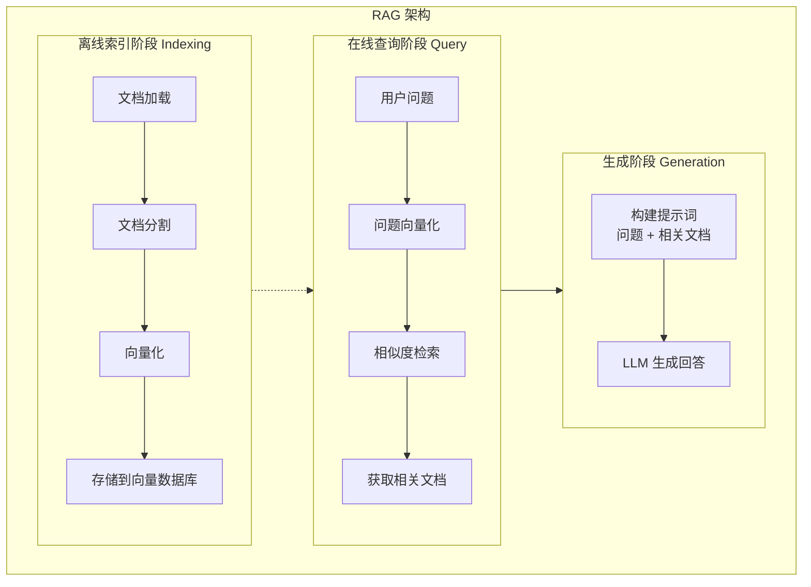

# 1.4 RAG 架构原理与实践

> 掌握 RAG（Retrieval-Augmented Generation）核心原理，构建知识增强的 AI 系统

> **模块**：1.4 | **预计时间**：2.5h | **面试可答**：RAG vs 微调、检索优化策略、幻觉处理、RAG 评估指标

## 学习目标

- 理解 RAG 的核心原理和架构
- 掌握 Indexing → Retrieval → Generation 流程
- 学习文档加载与分割策略
- 了解向量化与 Embedding 选择
- 掌握检索增强与上下文窗口管理
- 学习 RAG 评估指标

---

## 1. RAG 核心原理

### 1.1 什么是 RAG

RAG（Retrieval-Augmented Generation）是一种结合检索和生成的 AI 架构，通过从外部知识库检索相关信息来增强 LLM 的生成能力。

**核心思想**：
- **检索（Retrieval）**：从知识库中找到与问题相关的文档
- **增强（Augmented）**：将检索到的文档作为上下文
- **生成（Generation）**：基于上下文生成回答

### 1.2 为什么需要 RAG

**LLM 的局限性**：
- **知识截止**：训练数据有时间限制
- **幻觉问题**：可能生成不准确的信息
- **领域知识不足**：缺乏特定领域的专业知识
- **无法访问私有数据**：无法获取企业内部数据

**RAG 的优势**：
- **知识实时更新**：可以随时更新知识库
- **减少幻觉**：基于真实文档生成回答
- **领域专业化**：可以针对特定领域构建知识库
- **数据隐私**：可以在本地处理敏感数据

### 1.3 RAG 架构概览



---

## 2. Indexing → Retrieval → Generation 流程

### 2.1 索引阶段（Indexing）

**步骤 1：文档加载**
```typescript
import { DirectoryLoader } from '@langchain/community/document_loaders/fs/directory';
import { PDFLoader } from '@langchain/community/document_loaders/fs/pdf';
import { TextLoader } from '@langchain/community/document_loaders/fs/text';
import { CSVLoader } from '@langchain/community/document_loaders/fs/csv';

// 加载多种格式的文档
const loader = new DirectoryLoader('./knowledge_base', {
  '.pdf': (path) => new PDFLoader(path),
  '.txt': (path) => new TextLoader(path),
  '.csv': (path) => new CSVLoader(path),
});

const docs = await loader.load();
```

**步骤 2：文档分割**
```typescript
import { RecursiveCharacterTextSplitter } from 'langchain/text_splitter';

const splitter = new RecursiveCharacterTextSplitter({
  chunkSize: 1000,      // 每个块的最大字符数
  chunkOverlap: 200,    // 块之间的重叠字符数
  separators: ['\n\n', '\n', '。', '！', '？', '，', ' ']
});

const chunks = await splitter.splitDocuments(docs);
```

**步骤 3：向量化**
```typescript
import { OpenAIEmbeddings } from '@langchain/openai';

const embeddings = new OpenAIEmbeddings({
  modelName: 'text-embedding-3-large',
  dimensions: 3072
});

// 生成向量
const vectors = await embeddings.embedDocuments(
  chunks.map(chunk => chunk.pageContent)
);
```

**步骤 4：存储到向量数据库**
```typescript
import { Milvus } from '@langchain/community/vectorstores/milvus';

const vectorStore = await Milvus.fromDocuments(
  chunks,
  embeddings,
  {
    collectionName: 'knowledge_base',
    url: 'localhost:19530'
  }
);
```

### 2.2 检索阶段（Retrieval）

**基本检索**：
```typescript
// 使用向量存储的检索接口（与 createAgent 兼容）
import { VectorStore } from 'langchain/vectorstores';

// 用户查询
const query = "什么是 TypeScript？";

// 向量检索
const results = await vectorStore.similaritySearch(query, 5);

console.log("检索到的文档：");
results.forEach((doc, i) => {
  console.log(`${i + 1}. ${doc.pageContent.slice(0, 100)}...`);
});
```

**带分数的检索**：
```typescript
// 返回相似度分数
const resultsWithScores = await vectorStore.similaritySearchWithScore(query, 5);

resultsWithScores.forEach(([doc, score], i) => {
  console.log(`${i + 1}. [${score.toFixed(4)}] ${doc.pageContent.slice(0, 100)}...`);
});
```

### 2.3 生成阶段（Generation）

**基本 RAG 链**：
```typescript
import { createReactAgent } from '@langchain/langgraph/prebuilt';
import { ChatOpenAI } from '@langchain/openai';
import { tool } from '@langchain/core/tools';
import * as z from 'zod';

// 检索工具
const retrieveDocs = tool(
  async ({ query }) => {
    const results = await vectorStore.similaritySearch(query, 4);
    return results.map(doc => doc.pageContent).join('\n\n');
  },
  {
    name: 'retrieve_docs',
    description: '从知识库检索相关文档',
    schema: z.object({ query: z.string() }),
  }
);

const model = new ChatOpenAI({ model: 'gpt-5' });

const agent = createReactAgent({
  llm: model,
  tools: [retrieveDocs],
  messageModifier: '你是一个知识库助手。使用 retrieve_docs 工具检索相关信息后回答用户问题。',
});
```

---

## 3. 文档加载与分割策略

### 3.1 文档加载器

**PDF 加载**：
```typescript
import { PDFLoader } from '@langchain/community/document_loaders/fs/pdf';

const loader = new PDFLoader('./document.pdf', {
  splitPages: true,  // 按页分割
  parsedItemSeparator: '\n'  // 行分隔符
});

const docs = await loader.load();
```

**网页加载**：
```typescript
import { CheerioWebBaseLoader } from '@langchain/community/document_loaders/web/cheerio';

const loader = new CheerioWebBaseLoader('https://example.com/article');
const docs = await loader.load();
```

**数据库加载**：
```typescript
import { PrismaLoader } from 'langchain/document_loaders/fs/prisma';

const loader = new PrismaLoader(
  prisma,
  'article',
  {
    select: { id: true, title: true, content: true },
    where: { status: 'published' }
  }
);

const docs = await loader.load();
```

### 3.2 文档分割策略

**1. 固定大小分割**：
```typescript
const splitter = new CharacterTextSplitter({
  chunkSize: 1000,
  chunkOverlap: 200,
  separator: '\n'
});
```

**2. 递归字符分割**：
```typescript
const splitter = new RecursiveCharacterTextSplitter({
  chunkSize: 1000,
  chunkOverlap: 200,
  separators: ['\n\n', '\n', '。', '！', '？', '，', ' ', '']
});
```

**3. 语义分割**：
```typescript
import { SemanticChunker } from '@langchain/experimental/text_splitter';

const splitter = new SemanticChunker(embeddings, {
  breakpointThresholdType: 'percentile',
  breakpointThresholdPercentile: 95
});

const chunks = await splitter.splitDocuments(docs);
```

### 3.3 分割最佳实践

**块大小选择**：
- **太小**：丢失上下文，检索不准确
- **太大**：包含过多无关信息，成本高
- **推荐**：500-1500 字符

**重叠设置**：
- **目的**：确保语义连续性
- **推荐**：10-20% 的块大小

**分隔符选择**：
- 优先使用自然分隔符（段落、句子）
- 避免在句子中间分割

---

## 4. 向量化与 Embedding 选择

### 4.1 Embedding 模型对比

| 模型 | 维度 | 价格 | 特点 |
|------|------|------|------|
| text-embedding-3-large | 3072 | $0.13/1M tokens | 性能最强 |
| text-embedding-3-small | 1536 | $0.02/1M tokens | 性价比高 |
| text-embedding-ada-002 | 1536 | $0.10/1M tokens | 旧版，仍可用 |
| Cohere embed-v3 | 1024 | $0.10/1M tokens | 多语言好 |
| BGE-M3 | 1024 | 免费 | 开源 |

### 4.2 Embedding 选择策略

```typescript
function selectEmbeddingModel(scenario: Scenario): EmbeddingModel {
  const matrix = {
    // 性能优先
    performance: 'text-embedding-3-large',
    
    // 成本优先
    cost: 'text-embedding-3-small',
    
    // 多语言场景
    multilingual: 'Cohere embed-v3',
    
    // 本地部署
    local: 'BGE-M3',
    
    // 中文优化
    chinese: 'GTE-Qwen2'
  };
  
  return matrix[scenario];
}
```

### 4.3 向量维度选择

**高维度（3072）**：
- 优点：表达能力更强，检索更准确
- 缺点：存储成本高，检索速度慢

**低维度（768）**：
- 优点：存储成本低，检索速度快
- 缺点：表达能力较弱

**推荐策略**：
```typescript
// 根据数据量和精度要求选择
function selectDimension(dataSize: number, precision: 'high' | 'medium' | 'low'): number {
  if (precision === 'high' || dataSize > 1000000) {
    return 3072;
  } else if (precision === 'medium') {
    return 1536;
  } else {
    return 768;
  }
}
```

---

## 5. 检索增强与上下文窗口管理

### 5.1 检索增强策略

**1. 查询改写**：
```typescript
class QueryRewriter {
  private llm: ChatOpenAI;
  
  async rewrite(query: string): Promise<string[]> {
    const response = await this.llm.invoke(`
      将以下查询改写为3个不同的版本，每个版本从不同角度表达相同的意思：
      
      原始查询：${query}
      
      改写版本：
    `);
    
    return response.content.split('\n').filter(line => line.trim());
  }
}
```

**2. 查询扩展**：
```typescript
class QueryExpander {
  private llm: ChatOpenAI;
  
  async expand(query: string): Promise<string[]> {
    const response = await this.llm.invoke(`
      基于以下查询，生成5个相关的子查询，用于更全面地检索信息：
      
      原始查询：${query}
      
      相关查询：
    `);
    
    return [query, ...response.content.split('\n').filter(line => line.trim())];
  }
}
```

**3. 混合检索**：
```typescript
class HybridRetriever {
  private vectorStore: VectorStore;
  private keywordIndex: KeywordIndex;
  
  async retrieve(query: string, topK: number = 5): Promise<Document[]> {
    // 向量检索
    const vectorResults = await this.vectorStore.similaritySearch(query, topK * 2);
    
    // 关键词检索
    const keywordResults = await this.keywordIndex.search(query, topK * 2);
    
    // RRF 融合
    return this.rrfFusion(vectorResults, keywordResults, topK);
  }
  
  private rrfFusion(
    vectorResults: Document[],
    keywordResults: Document[],
    topK: number
  ): Document[] {
    const k = 60;
    const scores = new Map<string, number>();
    
    vectorResults.forEach((doc, rank) => {
      const key = doc.pageContent.slice(0, 100);
      scores.set(key, (scores.get(key) || 0) + 1 / (k + rank + 1));
    });
    
    keywordResults.forEach((doc, rank) => {
      const key = doc.pageContent.slice(0, 100);
      scores.set(key, (scores.get(key) || 0) + 1 / (k + rank + 1));
    });
    
    const sorted = Array.from(scores.entries())
      .sort((a, b) => b[1] - a[1])
      .slice(0, topK);
    
    return sorted.map(([key]) => 
      [...vectorResults, ...keywordResults].find(doc => 
        doc.pageContent.slice(0, 100) === key
      )
    );
  }
}
```

### 5.2 上下文窗口管理

**1. 上下文压缩**：
```typescript
class ContextCompressor {
  private llm: ChatOpenAI;
  
  async compress(question: string, documents: Document[]): Promise<string> {
    const response = await this.llm.invoke(`
      从以下文档中提取与问题最相关的信息，删除无关内容：
      
      问题：${question}
      
      文档：
      ${documents.map(doc => doc.pageContent).join('\n\n')}
      
      提取的相关信息：
    `);
    
    return response.content;
  }
}
```

**2. 上下文排序**：
```typescript
class ContextRanker {
  private llm: ChatOpenAI;
  
  async rank(question: string, documents: Document[]): Promise<Document[]> {
    const response = await this.llm.invoke(`
      根据与问题的相关性，对以下文档进行排序（从最相关到最不相关）：
      
      问题：${question}
      
      文档：
      ${documents.map((doc, i) => `[${i}] ${doc.pageContent.slice(0, 200)}`).join('\n')}
      
      请返回排序后的文档编号（用逗号分隔）：
    `);
    
    const indices = response.content.split(',').map(s => parseInt(s.trim()));
    return indices.map(i => documents[i]);
  }
}
```

---

## 6. RAG 评估指标

### 6.1 评估维度

**1. 忠实度（Faithfulness）**：
- 生成的回答是否忠实于检索到的文档
- 是否包含文档中没有的信息

**2. 相关性（Relevancy）**：
- 检索到的文档是否与问题相关
- 生成的回答是否回答了问题

**3. 上下文精度（Context Precision）**：
- 检索到的文档中，有多少是真正有用的
- 排序是否合理

**4. 上下文召回率（Context Recall）**：
- 是否检索到了所有相关的文档
- 是否遗漏了重要信息

### 6.2 Ragas 评估框架

**安装 Ragas**：
```bash
pip install ragas
```

**评估示例**：
```python
from ragas import evaluate
from ragas.metrics import (
    faithfulness,
    answer_relevancy,
    context_precision,
    context_recall
)

# 准备评估数据
eval_data = {
    'question': ['什么是 TypeScript？'],
    'answer': ['TypeScript 是 JavaScript 的超集，添加了静态类型系统...'],
    'contexts': [['TypeScript 是微软开发的编程语言，它是 JavaScript 的超集...']],
    'ground_truth': ['TypeScript 是 JavaScript 的超集，添加了可选的静态类型系统...']
}

# 执行评估
result = evaluate(
    dataset=eval_data,
    metrics=[
        faithfulness,
        answer_relevancy,
        context_precision,
        context_recall
    ]
)

print(result)
```

### 6.3 自定义评估

```typescript
class RAGEvaluator {
  private llm: ChatOpenAI;
  
  async evaluate(params: {
    question: string;
    answer: string;
    contexts: string[];
    groundTruth?: string;
  }): Promise<EvaluationResult> {
    const { question, answer, contexts, groundTruth } = params;
    
    // 评估忠实度
    const faithfulness = await this.evaluateFaithfulness(answer, contexts);
    
    // 评估相关性
    const relevancy = await this.evaluateRelevancy(question, answer);
    
    // 评估上下文精度
    const precision = await this.evaluatePrecision(question, contexts);
    
    return {
      faithfulness,
      relevancy,
      precision,
      overall: (faithfulness + relevancy + precision) / 3
    };
  }
  
  private async evaluateFaithfulness(answer: string, contexts: string[]): Promise<number> {
    const response = await this.llm.invoke(`
      评估以下回答是否忠实于提供的上下文。
      如果回答中的所有信息都能在上下文中找到，返回 1。
      如果回答包含上下文中没有的信息，返回 0。
      如果部分信息在上下文中，返回 0.5。
      
      上下文：${contexts.join('\n')}
      回答：${answer}
      
      评分（0-1）：
    `);
    
    return parseFloat(response.content);
  }
}
```

---

## 技术对比

### RAG vs 微调 vs 纯 LLM

| 特性 | RAG | 微调 | 纯 LLM |
|------|-----|------|--------|
| **知识更新** | ✅ 实时更新 | ❌ 需要重新训练 | ❌ 固定知识 |
| **成本** | ✅ 低（仅检索相关片段，token 消耗可控） | ❌ 高（训练成本） | ⚠️ 视场景而定（少量文本低，大量文档需塞入上下文则极高） |
| **准确性** | ✅ 高（有据可查） | ⚠️ 中（可能过拟合） | ⚠️ 中（可能幻觉） |
| **可解释性** | ✅ 高（可追溯来源） | ❌ 低（黑盒） | ❌ 低（黑盒） |
| **适用场景** | 知识密集型任务 | 特定领域任务 | 通用任务 |
| **开发周期** | ⚠️ 中等 | ❌ 长 | ✅ 短 |

**选择建议**：
- 知识频繁更新 → RAG
- 特定领域、数据充足 → 微调
- 通用任务、快速上线 → 纯 LLM

### 向量数据库对比

| 特性 | Milvus | Pinecone | Qdrant | Weaviate | Chroma |
|------|--------|----------|--------|----------|--------|
| **部署方式** | 自托管/云 | 全托管 | 自托管/云 | 自托管/云 | 本地/云 |
| **性能** | ✅ 高 | ✅ 高 | ✅ 高 | ✅ 高 | ⚠️ 中 |
| **扩展性** | ✅ 强 | ✅ 强 | ✅ 强 | ✅ 强 | ⚠️ 有限 |
| **价格** | 按量付费 | 按量付费 | 按量付费 | 按量付费 | 免费 |
| **适用场景** | 大规模生产 | 快速上线 | 中小规模 | 企业级 | 开发测试 |

**选择建议**：
- 大规模生产环境 → Milvus
- 快速上线、零运维 → Pinecone
- 中小规模、开源优先 → Qdrant
- 开发测试 → Chroma

### 文档分割策略对比

| 策略 | 优点 | 缺点 | 适用场景 |
|------|------|------|----------|
| **固定大小** | 简单、可预测 | 可能切断语义 | 结构化文档 |
| **递归字符** | 保留语义完整性 | 分割大小不均匀 | 通用文档 |
| **语义分割** | 语义最完整 | 计算成本高 | 高质量要求 |
| **Markdown 分割** | 保留文档结构 | 依赖文档格式 | Markdown 文档 |

**选择建议**：
- 通用场景 → 递归字符分割
- 高质量要求 → 语义分割
- Markdown 文档 → Markdown 分割

---

## 面试问答

> **问：RAG 和微调有什么区别？**
>
> 答：RAG 是**检索增强生成**，微调是**模型参数调整**。主要区别：
> 1. **知识存储**：RAG 将知识存储在外部数据库，微调将知识编码到模型参数
> 2. **更新方式**：RAG 更新数据库即可，微调需要重新训练模型
> 3. **成本**：RAG 成本低（只需检索），微调成本高（需要 GPU 训练）
> 4. **可解释性**：RAG 可追溯来源，微调是黑盒
>
> 选择建议：知识频繁更新选 RAG，特定领域数据充足选微调。

> **问：如何优化 RAG 的检索效果？**
>
> 答：主要优化策略：
> 1. **查询改写**：将用户问题改写为更适合检索的形式
> 2. **混合检索**：结合向量检索和关键词检索
> 3. **重排序**：使用交叉编码器对检索结果重新排序
> 4. **分块优化**：调整文档分块大小和重叠度
> 5. **Embedding 优化**：选择合适的 Embedding 模型
>
> 实际经验：查询改写和混合检索通常能带来最大提升。

> **问：如何处理 RAG 中的幻觉问题？**
>
> 答：幻觉是指 LLM 生成与检索内容不符的回答。解决方案：
> 1. **忠实度检查**：使用 LLM 检查回答是否忠实于检索内容
> 2. **引用机制**：要求 LLM 引用检索内容中的具体句子
> 3. **置信度阈值**：如果检索相似度低于阈值，拒绝回答
> 4. **多轮验证**：使用多个 LLM 交叉验证回答
>
> 最佳实践：忠实度检查 + 引用机制是最有效的组合。

> **问：如何评估 RAG 系统的效果？**
>
> 答：主要评估指标：
> 1. **忠实度**：回答是否忠实于检索内容
> 2. **相关性**：回答是否与问题相关
> 3. **上下文精度**：检索内容中有多少是有用的
> 4. **上下文召回率**：是否检索到了所有相关内容
>
> 推荐使用 Ragas 框架进行自动化评估，它支持所有上述指标。

> **问：如何处理超长文档的 RAG？**
>
> 答：超长文档（>100 页）的处理策略：
> 1. **分层索引**：先按章节索引，再按段落索引
> 2. **摘要索引**：为每个章节生成摘要，先检索摘要再检索原文
> 3. **父子关系**：保留文档的父子关系，支持上下文扩展
> 4. **滑动窗口**：使用滑动窗口分割，保留上下文重叠
>
> 实际经验：分层索引 + 摘要索引是最有效的组合。

---

## 实践练习

### 练习 1：构建简单的 RAG 系统

**要求**：构建一个基于文档的问答系统，理解 RAG 的完整流程。

**提示**：
- 使用 LangChain 的 `MemoryVectorStore` 存储文档
- 使用 `OpenAIEmbeddings` 生成向量
- 使用 `similaritySearch` 检索相关文档

**预期效果**：
- 能加载和索引文档
- 能根据问题检索相关文档
- 能基于检索结果生成回答

```typescript
// 构建一个基于文档的问答系统
import { MemoryVectorStore } from 'langchain/vectorstores/memory';
import { OpenAIEmbeddings } from '@langchain/openai';
import { ChatOpenAI } from '@langchain/openai';
import { Document } from '@langchain/core/documents';

class SimpleRAGSystem {
  private vectorStore: MemoryVectorStore | null = null;
  private llm: ChatOpenAI;
  
  constructor() {
    this.llm = new ChatOpenAI({ modelName: 'gpt-4' });
  }
  
  async setup(documents: string[]): Promise<void> {
    // 1. 创建文档对象
    const docs = documents.map(doc => new Document({ pageContent: doc }));
    
    // 2. 创建向量存储
    this.vectorStore = await MemoryVectorStore.fromDocuments(
      docs,
      new OpenAIEmbeddings()
    );
    
    console.log(`已索引 ${documents.length} 个文档`);
  }
  
  async ask(question: string): Promise<string> {
    if (!this.vectorStore) {
      throw new Error('请先调用 setup 方法索引文档');
    }
    
    // 1. 检索相关文档
    const docs = await this.vectorStore.similaritySearch(question, 3);
    console.log(`检索到 ${docs.length} 个相关文档`);
    
    // 2. 构建提示词
    const context = docs.map(doc => doc.pageContent).join('\n\n');
    const prompt = `
      基于以下上下文回答问题。如果上下文中没有相关信息，请说"我无法回答这个问题"。
      
      上下文：${context}
      问题：${question}
      
      回答：
    `;
    
    // 3. 生成回答
    const response = await this.llm.invoke(prompt);
    return response.content;
  }
}

// 使用示例
const rag = new SimpleRAGSystem();
await rag.setup([
  'TypeScript 是 JavaScript 的超集，添加了静态类型系统。',
  'Bun 是一个快速的 JavaScript 运行时，兼容 Node.js。',
  'LangChain 是一个用于构建 LLM 应用的框架。'
]);

const answer = await rag.ask('什么是 TypeScript？');
console.log(answer);
```

---

### 练习 2：实现查询改写

**要求**：实现一个查询改写器，提升检索效果。

**提示**：
- 使用 LLM 将用户问题改写为更适合检索的形式
- 支持生成多个改写版本
- 支持查询扩展（生成相关子查询）

**预期效果**：
- 能将口语化问题改写为正式问题
- 能生成多个改写版本，提高召回率
- 能生成相关子查询，扩展检索范围

```typescript
// 实现一个查询改写器
import { ChatOpenAI } from '@langchain/openai';

class QueryRewriter {
  private llm: ChatOpenAI;
  
  constructor() {
    this.llm = new ChatOpenAI({ modelName: 'gpt-4' });
  }
  
  async rewrite(query: string): Promise<string[]> {
    const response = await this.llm.invoke(`
      将以下查询改写为3个不同的版本，使其更适合搜索引擎检索。
      保持原意，但使用更正式、更精确的表达。
      
      原始查询：${query}
      
      改写版本（每行一个）：
    `);
    
    return response.content.split('\n').filter(line => line.trim());
  }
  
  async expand(query: string): Promise<string[]> {
    const response = await this.llm.invoke(`
      基于以下查询，生成5个相关的子查询，用于扩展检索范围。
      子查询应该覆盖原始查询的不同方面。
      
      原始查询：${query}
      
      相关查询（每行一个）：
    `);
    
    return [query, ...response.content.split('\n').filter(line => line.trim())];
  }
  
  async decompose(query: string): Promise<string[]> {
    const response = await this.llm.invoke(`
      将以下复杂查询分解为多个简单子查询。
      每个子查询应该独立可回答。
      
      复杂查询：${query}
      
      子查询（每行一个）：
    `);
    
    return response.content.split('\n').filter(line => line.trim());
  }
}

// 使用示例
const rewriter = new QueryRewriter();

// 查询改写
const rewrites = await rewriter.rewrite('TypeScript 有啥好的？');
console.log('改写版本：', rewrites);
// 输出：['TypeScript 的优势是什么？', 'TypeScript 有哪些优点？', '为什么选择 TypeScript？']

// 查询扩展
const expanded = await rewriter.expand('什么是 RAG？');
console.log('扩展查询：', expanded);
// 输出：['什么是 RAG？', 'RAG 的原理是什么？', 'RAG 的应用场景有哪些？', ...]

// 查询分解
const decomposed = await rewriter.decompose('比较 TypeScript 和 JavaScript 的优缺点');
console.log('分解查询：', decomposed);
// 输出：['TypeScript 的优点是什么？', 'TypeScript 的缺点是什么？', 'JavaScript 的优点是什么？', ...]
```

---

## 总结

**核心要点**：
1. **RAG 架构**：检索 + 增强 + 生成，结合外部知识提升 LLM 能力
2. **索引流程**：文档加载 → 分割 → 向量化 → 存储
3. **检索策略**：向量检索、关键词检索、混合检索
4. **上下文管理**：压缩、排序、窗口管理
5. **评估指标**：忠实度、相关性、上下文精度、召回率

**下一步**：
- 学习 TypeScript + Bun 在 AI 领域的应用（1.5）
- 动手构建简单的 RAG 系统
- 尝试使用 LangChain 构建 RAG 链

---

*参考资料*：
- [RAG Paper](https://arxiv.org/abs/2005.11401)
- [LangChain RAG Tutorial](https://js.langchain.com/docs/tutorials/rag/)
- [Ragas Documentation](https://docs.ragas.io/)
- [Vector Database Comparison](https://vector-database.com/)