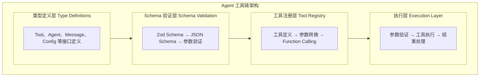

# 1.5 TypeScript + Bun 在 AI 领域的应用

> 掌握 TypeScript + Bun 技术栈，构建高性能的 AI Agent 应用

> **模块**：1.5 | **预计时间**：2h | **面试可答**：Bun vs Node.js、Zod vs TS 类型、类型安全工具链设计、Fastify Schema 验证

## 学习目标

- 了解 Bun 运行时的优势与性能对比
- 掌握 TypeScript 类型系统在 Agent 开发中的优势
- 学习 Zod Schema 与 Agent 参数校验
- 掌握 Fastify 框架快速入门
- 了解类型安全的 Agent 工具链设计

---

## 1. Bun 运行时优势与性能对比

### 1.1 什么是 Bun

Bun 是一个现代化的 JavaScript/TypeScript 运行时，旨在提供极致的性能和开发体验。

**核心特性**：
- **极速启动**：在包管理（`bun install`）场景下可比 npm 快 10-100 倍；运行时性能（HTTP 服务、文件 I/O）通常快 1.5-3 倍；启动速度优势在小脚本和 CLI 工具中尤为明显
- **原生 TypeScript**：无需编译，直接运行 TS
- **内置打包器**：替代 webpack/vite
- **内置测试运行器**：替代 jest/vitest
- **兼容 Node.js**：大部分 Node.js API 兼容

### 1.2 Bun vs Node.js 性能对比

**启动时间**：
```typescript
// hello.ts
console.log("Hello, World!");
```

```bash
# Bun
time bun hello.ts
# 0.03s

# Node.js (with ts-node)
time npx ts-node hello.ts
# 0.85s

# Node.js (编译后)
time node hello.js
# 0.05s
```

**HTTP 服务器性能**：
```typescript
// server.ts
import { serve } from 'bun';

serve({
  port: 3000,
  fetch(request) {
    return new Response("Hello, World!");
  }
});
```

**性能测试结果**：
| 运行时 | 请求/秒 | 延迟 (p99) |
|--------|---------|-----------|
| Bun | 250,000 | 1.2ms |
| Node.js | 80,000 | 3.5ms |
| Deno | 120,000 | 2.1ms |

### 1.3 Bun 安装与配置

**安装**：
```bash
# macOS/Linux
curl -fsSL https://bun.sh/install | bash

# Windows
powershell -c "irm bun.sh/install.ps1 | iex"

# 验证安装
bun --version
```

**项目初始化**：
```bash
# 创建新项目
mkdir my-agent-app
cd my-agent-app
bun init

# 安装依赖
bun add langchain @langchain/openai zod fastify
```

### 1.4 Bun 特性在 AI 开发中的应用

**1. 原生 TypeScript 支持**：
```typescript
// agent.ts - 直接运行，无需编译
interface AgentConfig {
  model: string;
  temperature: number;
  maxTokens: number;
}

const config: AgentConfig = {
  model: 'gpt-5',
  temperature: 0.7,
  maxTokens: 4096
};

console.log(`Using model: ${config.model}`);
```

**2. 内置打包器**：
```bash
# 打包为单个文件
bun build ./src/index.ts --outdir ./dist --target node

# 打包为可执行文件
bun build ./src/index.ts --outdir ./dist --target bun
```

**3. 内置测试运行器**：
```typescript
// agent.test.ts
import { describe, it, expect } from 'bun:test';
import { Agent } from './agent';

describe('Agent', () => {
  it('should initialize correctly', () => {
    const agent = new Agent({ model: 'gpt-5' });
    expect(agent.model).toBe('gpt-5');
  });
  
  it('should handle errors gracefully', async () => {
    const agent = new Agent({ model: 'invalid' });
    await expect(agent.invoke('test')).rejects.toThrow();
  });
});
```

```bash
# 运行测试
bun test
```

### 1.5 Bun 在 AI Agent 场景中的特有优势

**1. 内置 SQLite（`Bun.sqlite`）用于 Embedding 缓存**：
```typescript
import { Database } from 'bun:sqlite';

// 本地 Embedding 缓存，避免重复调用 API
const db = new Database('embedding-cache.db');
db.run(`
  CREATE TABLE IF NOT EXISTS embeddings (
    text_hash TEXT PRIMARY KEY,
    embedding BLOB,
    created_at DATETIME DEFAULT CURRENT_TIMESTAMP
  )
`);

function getCachedEmbedding(text: string): number[] | null {
  const hash = Bun.hash(text).toString();
  const row = db.query('SELECT embedding FROM embeddings WHERE text_hash = ?').get(hash) as any;
  if (!row) return null;
  // SQLite BLOB 读取为 Buffer，需正确转换
  return new Float32Array(
    row.embedding.buffer,
    row.embedding.byteOffset,
    row.embedding.byteLength / 4
  );
}

function cacheEmbedding(text: string, embedding: number[]): void {
  const hash = Bun.hash(text).toString();
  db.run('INSERT OR REPLACE INTO embeddings (text_hash, embedding) VALUES (?, ?)', 
    hash, new Float32Array(embedding));
}
```

**2. `Bun.file()` 用于文档加载（RAG 场景）**：
```typescript
// 加载本地文档内容，替代文件解析中间件
async function loadDocument(path: string): Promise<string> {
  const file = Bun.file(path);
  const content = await file.text();
  return content;
}

// 批量加载目录下所有文档
import { Glob } from 'bun';

async function loadDocuments(dir: string): Promise<string[]> {
  const results: string[] = [];
  
  const glob = new Glob('*.{txt,md}');
  for await (const file of glob.scan(dir)) {
    const content = await loadDocument(`${dir}/${file}`);
    results.push(content);
  }
  
  return results;
}
```

**3. `Bun.write()` 用于 Agent 文件输出**：
```typescript
// Agent 运行结果持久化
async function saveAgentOutput(agentId: string, content: string): Promise<void> {
  const path = `outputs/${agentId}/${Date.now()}.json`;
  
  // 自动创建目录（Bun 自动处理）
  await Bun.write(path, JSON.stringify({
    agentId,
    timestamp: new Date().toISOString(),
    content
  }, null, 2));
  
  console.log(`Output saved to ${path}`);
}
```

**4. 内置环境变量加载（`.env`）**：
```typescript
// Bun 自动加载 .env 文件，无需 dotenv 依赖
const apiKey = process.env.OPENAI_API_KEY;
const modelName = process.env.MODEL_NAME || 'gpt-5';

// 无需 import 'dotenv/config' 或 dotenv.config()
```

**性能对比总结**：
| 场景 | Bun | Node.js | 备注 |
|------|-----|---------|------|
| 冷启动时间 | ~0.03s | ~0.85s (ts-node) | 适合 FaaS/Serverless 部署 |
| SQLite 操作 | 内置，零依赖 | 需 `better-sqlite3` 编译 | Embedding 缓存场景 |
| 文件 I/O | 原生高性能 | 需额外包装 | 文档加载场景 |
| 环境变量 | 内置 .env 加载 | 需 `dotenv` 包 | 减少依赖项 |
| HTTP 服务器 | 250k req/s | 80k req/s | Agent 服务部署 |

---

## 2. TypeScript 类型系统在 Agent 开发中的优势

### 2.1 类型安全的重要性

**没有类型安全**：
```javascript
// 容易出错
function createAgent(config) {
  return {
    model: config.model || 'gpt-5',  // 可能是 undefined
    temperature: config.temp,         // 拼写错误
    maxTokens: config.max             // 类型错误
  };
}

// 运行时才发现错误
const agent = createAgent({ model: 123, temp: 'hot' });
```

**有类型安全**：
```typescript
// 编译时就能发现错误
interface AgentConfig {
  model: string;
  temperature: number;
  maxTokens: number;
}

function createAgent(config: AgentConfig) {
  return {
    model: config.model,
    temperature: config.temperature,
    maxTokens: config.maxTokens
  };
}

// 编译时报错
const agent = createAgent({ model: 123, temp: 'hot' }); // Error!
```

### 2.2 类型定义最佳实践

**1. 接口定义**：
```typescript
// 工具定义
interface Tool {
  name: string;
  description: string;
  parameters: JSONSchema;
  execute: (params: any) => Promise<ToolResult>;
}

// Agent 定义
interface Agent {
  id: string;
  name: string;
  model: string;
  tools: Tool[];
  invoke: (input: string) => Promise<string>;
}

// 消息定义
interface Message {
  role: 'system' | 'user' | 'assistant' | 'tool';
  content: string;
  toolCalls?: ToolCall[];
  toolCallId?: string;
}
```

**2. 泛型使用**：
```typescript
// 通用检索器接口
interface Retriever<T> {
  retrieve(query: string, topK: number): Promise<T[]>;
}

// 向量检索器
class VectorRetriever implements Retriever<Document> {
  async retrieve(query: string, topK: number): Promise<Document[]> {
    // 实现...
  }
}

// 关键词检索器
class KeywordRetriever implements Retriever<Document> {
  async retrieve(query: string, topK: number): Promise<Document[]> {
    // 实现...
  }
}
```

**3. 联合类型**：
```typescript
// 模型类型
type ModelType = 'gpt-5' | 'claude-opus-4.6' | 'gemini-3.1-pro';

// 任务状态
type TaskStatus = 'pending' | 'running' | 'completed' | 'failed';

// 工具结果
type ToolResult = 
  | { success: true; data: any }
  | { success: false; error: string };
```

### 2.3 类型推断

```typescript
// TypeScript 可以自动推断类型
const agent = {
  model: 'gpt-5',
  temperature: 0.7
};
// TypeScript 推断 agent 的类型为 { model: string; temperature: number }

// 泛型推断
function createTool<T extends Tool>(tool: T): T {
  return tool;
}

const weatherTool = createTool({
  name: 'get_weather',
  description: '获取天气',
  parameters: { city: { type: 'string' } },
  execute: async (params) => ({ temp: 25 })
});
// TypeScript 推断 weatherTool 的完整类型
```

---

## 3. Zod Schema 与 Agent 参数校验

### 3.1 什么是 Zod

Zod 是一个 TypeScript-first 的 schema 声明和验证库，特别适合用于 API 参数校验和 LLM 工具定义。

**核心特性**：
- **类型推断**：从 schema 自动推断 TypeScript 类型
- **运行时验证**：在运行时验证数据
- **错误处理**：详细的错误信息
- **与 LLM 集成**：可以转换为 JSON Schema

### 3.2 Zod 基础用法

**安装**：
```bash
bun add zod
```

**基本 schema**：
```typescript
import { z } from 'zod';

// 字符串
const stringSchema = z.string();
stringSchema.parse('hello');  // ✅
stringSchema.parse(123);      // ❌ Error

// 数字
const numberSchema = z.number();
numberSchema.parse(123);      // ✅
numberSchema.parse('123');    // ❌ Error

// 对象
const userSchema = z.object({
  name: z.string(),
  age: z.number().min(0).max(150),
  email: z.string().email()
});

// 推断类型
type User = z.infer<typeof userSchema>;
// { name: string; age: number; email: string }
```

### 3.3 Zod 在 Agent 开发中的应用

**1. 工具参数校验**：
```typescript
import { z } from 'zod';

// 定义工具参数 schema
const weatherParamsSchema = z.object({
  city: z.string().describe('城市名称'),
  unit: z.enum(['celsius', 'fahrenheit']).default('celsius').describe('温度单位')
});

// 从 schema 推断类型
type WeatherParams = z.infer<typeof weatherParamsSchema>;

// 工具定义
const weatherTool: Tool = {
  name: 'get_weather',
  description: '获取指定城市的天气信息',
  parameters: weatherParamsSchema,
  execute: async (params: WeatherParams) => {
    // params 已经是类型安全的
    const weather = await fetchWeather(params.city, params.unit);
    return weather;
  }
};

// 参数验证
const result = weatherParamsSchema.safeParse({ city: '北京' });
if (result.success) {
  console.log(result.data); // { city: '北京', unit: 'celsius' }
} else {
  console.error(result.error);
}
```

**2. API 请求验证**：
```typescript
import { z } from 'zod';
import { FastifyRequest } from 'fastify';

// 定义请求 schema
const chatRequestSchema = z.object({
  message: z.string().min(1).max(10000),
  sessionId: z.string().uuid(),
  model: z.enum(['gpt-5', 'claude-opus-4.6']).optional()
});

// Fastify 路由
fastify.post('/chat', async (request: FastifyRequest, reply) => {
  const result = chatRequestSchema.safeParse(request.body);
  
  if (!result.success) {
    return reply.status(400).send({
      error: 'Invalid request',
      details: result.error.errors
    });
  }
  
  const { message, sessionId, model } = result.data;
  // 处理请求...
});
```

**3. 配置验证**：
```typescript
import { z } from 'zod';

const configSchema = z.object({
  port: z.number().min(1000).max(65535).default(3000),
  database: z.object({
    host: z.string(),
    port: z.number().default(5432),
    name: z.string()
  }),
  redis: z.object({
    host: z.string(),
    port: z.number().default(6379)
  }),
  llm: z.object({
    provider: z.enum(['openai', 'anthropic', 'google']),
    apiKey: z.string().min(1),
    model: z.string()
  })
});

// 验证配置
function loadConfig(): Config {
  const rawConfig = JSON.parse(process.env.CONFIG || '{}');
  const result = configSchema.safeParse(rawConfig);
  
  if (!result.success) {
    console.error('Invalid configuration:', result.error.errors);
    process.exit(1);
  }
  
  return result.data;
}
```

### 3.4 Zod 转换为 JSON Schema

```typescript
import { z } from 'zod';
import { zodToJsonSchema } from 'zod-to-json-schema';

// 定义 Zod schema
const paramsSchema = z.object({
  city: z.string().describe('城市名称'),
  unit: z.enum(['celsius', 'fahrenheit']).describe('温度单位')
});

// 转换为 JSON Schema
const jsonSchema = zodToJsonSchema(paramsSchema);

console.log(jsonSchema);
// {
//   type: 'object',
//   properties: {
//     city: { type: 'string', description: '城市名称' },
//     unit: { type: 'string', enum: ['celsius', 'fahrenheit'], description: '温度单位' }
//   },
//   required: ['city', 'unit']
// }
```

---

## 4. Fastify 框架快速入门

### 4.1 为什么选择 Fastify

**优势**：
- **高性能**：比 Express 快 2-3 倍
- **类型安全**：原生 TypeScript 支持
- **插件系统**：强大的插件生态
- **Schema 验证**：内置 JSON Schema 验证
- **自动文档**：自动生成 Swagger 文档

### 4.2 Fastify 安装与配置

**安装**：
```bash
bun add fastify @fastify/cors @fastify/swagger
```

**基本配置**：
```typescript
import Fastify from 'fastify';
import cors from '@fastify/cors';
import swagger from '@fastify/swagger';

const fastify = Fastify({
  logger: true
});

// 注册插件
await fastify.register(cors);
await fastify.register(swagger, {
  routePrefix: '/documentation',
  swagger: {
    info: {
      title: 'AI Agent API',
      description: 'AI Agent 服务 API 文档',
      version: '1.0.0'
    }
  }
});

// 启动服务器
await fastify.listen({ port: 3000 });
```

### 4.3 Fastify 路由定义

**基本路由**：
```typescript
// GET 请求
fastify.get('/health', async (request, reply) => {
  return { status: 'ok' };
});

// POST 请求
fastify.post('/chat', async (request, reply) => {
  const { message } = request.body as { message: string };
  const response = await agent.invoke(message);
  return { response };
});

// 带参数的路由
fastify.get('/sessions/:sessionId', async (request, reply) => {
  const { sessionId } = request.params as { sessionId: string };
  const session = await sessionManager.getSession(sessionId);
  return session;
});
```

**带 Schema 验证的路由**：
```typescript
fastify.post('/chat', {
  schema: {
    body: {
      type: 'object',
      required: ['message'],
      properties: {
        message: { type: 'string', minLength: 1, maxLength: 10000 },
        sessionId: { type: 'string' },
        model: { type: 'string', enum: ['gpt-5', 'claude-opus-4.6'] }
      }
    },
    response: {
      200: {
        type: 'object',
        properties: {
          response: { type: 'string' },
          sessionId: { type: 'string' }
        }
      }
    }
  }
}, async (request, reply) => {
  const { message, sessionId, model } = request.body as any;
  const response = await agent.invoke(message, { sessionId, model });
  return { response, sessionId };
});
```

### 4.4 Fastify 中间件

**认证中间件**：
```typescript
fastify.addHook('onRequest', async (request, reply) => {
  const token = request.headers.authorization?.replace('Bearer ', '');
  
  if (!token) {
    return reply.status(401).send({ error: 'Unauthorized' });
  }
  
  try {
    const user = await verifyToken(token);
    request.user = user;
  } catch (error) {
    return reply.status(401).send({ error: 'Invalid token' });
  }
});
```

**错误处理**：
```typescript
fastify.setErrorHandler((error, request, reply) => {
  fastify.log.error(error);
  
  if (error.validation) {
    return reply.status(400).send({
      error: 'Validation Error',
      details: error.validation
    });
  }
  
  return reply.status(500).send({
    error: 'Internal Server Error',
    message: error.message
  });
});
```

---

## 5. 类型安全的 Agent 工具链设计

### 5.1 工具链架构



### 5.2 类型安全的工具定义

```typescript
import { z } from 'zod';

// 工具参数类型
interface ToolDefinition<T extends z.ZodType> {
  name: string;
  description: string;
  parameters: T;
  execute: (params: z.infer<T>) => Promise<any>;
}

// 创建类型安全的工具
function createTool<T extends z.ZodType>(definition: ToolDefinition<T>): ToolDefinition<T> {
  return definition;
}

// 使用示例
const weatherTool = createTool({
  name: 'get_weather',
  description: '获取指定城市的天气信息',
  parameters: z.object({
    city: z.string().describe('城市名称'),
    unit: z.enum(['celsius', 'fahrenheit']).default('celsius')
  }),
  execute: async (params) => {
    // params 已经是类型安全的
    return { temperature: 25, unit: params.unit };
  }
});
```

### 5.3 工具注册表

```typescript
class ToolRegistry {
  private tools: Map<string, ToolDefinition<any>> = new Map();
  
  register<T extends z.ZodType>(tool: ToolDefinition<T>): void {
    this.tools.set(tool.name, tool);
  }
  
  get(name: string): ToolDefinition<any> | undefined {
    return this.tools.get(name);
  }
  
  // 转换为 OpenAI Function Calling 格式
  toOpenAIFunctions(): any[] {
    return Array.from(this.tools.values()).map(tool => ({
      type: 'function',
      function: {
        name: tool.name,
        description: tool.description,
        parameters: zodToJsonSchema(tool.parameters)
      }
    }));
  }
  
  // 执行工具
  async execute(name: string, params: any): Promise<any> {
    const tool = this.tools.get(name);
    if (!tool) {
      throw new Error(`Tool ${name} not found`);
    }
    
    // 验证参数
    const result = tool.parameters.safeParse(params);
    if (!result.success) {
      throw new Error(`Invalid parameters: ${result.error.message}`);
    }
    
    // 执行工具
    return tool.execute(result.data);
  }
}

// 使用示例
const registry = new ToolRegistry();
registry.register(weatherTool);
registry.register(timeTool);

// 转换为 Function Calling 格式
const functions = registry.toOpenAIFunctions();

// 执行工具
const result = await registry.execute('get_weather', { city: '北京' });
```

### 5.4 类型安全的 Agent 类

```typescript
import { z } from 'zod';

interface AgentConfig {
  model: string;
  temperature: number;
  maxTokens: number;
  tools: ToolDefinition<any>[];
}

class TypeSafeAgent {
  private config: AgentConfig;
  private toolRegistry: ToolRegistry;
  
  constructor(config: AgentConfig) {
    this.config = config;
    this.toolRegistry = new ToolRegistry();
    
    // 注册工具
    config.tools.forEach(tool => this.toolRegistry.register(tool));
  }
  
  async invoke(input: string): Promise<string> {
    const messages: Message[] = [
      { role: 'user', content: input }
    ];
    
    while (true) {
      const response = await this.callLLM(messages);
      
      if (response.toolCalls) {
        // 执行工具调用
        for (const toolCall of response.toolCalls) {
          const result = await this.toolRegistry.execute(
            toolCall.name,
            toolCall.arguments
          );
          
          messages.push({
            role: 'tool',
            toolCallId: toolCall.id,
            content: JSON.stringify(result)
          });
        }
      } else {
        // 返回最终响应
        return response.content;
      }
    }
  }
  
  private async callLLM(messages: Message[]): Promise<any> {
    // 调用 LLM...
  }
}

// 使用示例
const agent = new TypeSafeAgent({
  model: 'gpt-5',
  temperature: 0.7,
  maxTokens: 4096,
  tools: [weatherTool, timeTool]
});

const response = await agent.invoke('北京今天天气怎么样？');
console.log(response);
```

---

## 技术对比

### Bun vs Node.js vs Deno

| 特性 | Bun | Node.js | Deno |
|------|-----|---------|------|
| **启动速度** | ✅ 极快 | ⚠️ 中等 | ✅ 快 |
| **TypeScript 支持** | ✅ 原生 | ❌ 需要编译 | ✅ 原生 |
| **包管理器** | ✅ 内置 bun install | npm/yarn/pnpm | URL 导入 |
| **API 兼容性** | ✅ 兼容 Node.js | ✅ 标准 | ⚠️ 部分兼容 |
| **生态系统** | ⚠️ 增长中 | ✅ 成熟 | ⚠️ 较小 |
| **生产环境** | ⚠️ 逐步成熟 | ✅ 广泛使用 | ⚠️ 有限 |

**选择建议**：
- 新项目、追求性能 → Bun
- 生产环境、生态依赖 → Node.js
- 安全优先、URL 导入 → Deno

### Fastify vs Express vs Koa

| 特性 | Fastify | Express | Koa |
|------|---------|---------|-----|
| **性能** | ✅ 高 | ⚠️ 中 | ⚠️ 中 |
| **TypeScript 支持** | ✅ 原生 | ⚠️ 需要 @types | ⚠️ 需要 @types |
| **Schema 验证** | ✅ 内置 | ❌ 需要中间件 | ❌ 需要中间件 |
| **插件系统** | ✅ 强大 | ⚠️ 中间件 | ⚠️ 中间件 |
| **学习曲线** | ⚠️ 中等 | ✅ 低 | ✅ 低 |
| **适用场景** | 高性能 API | 通用 Web 应用 | 轻量级应用 |

**选择建议**：
- 高性能 API、需要 Schema 验证 → Fastify
- 通用 Web 应用、快速开发 → Express
- 轻量级、async/await 优先 → Koa

### Zod vs Yup vs Joi

| 特性 | Zod | Yup | Joi |
|------|-----|-----|-----|
| **TypeScript 支持** | ✅ 原生 | ⚠️ 需要推断 | ✅ 内置（v17+） |
| **包大小** | ✅ 小 | ⚠️ 中 | ❌ 大 |
| **运行时验证** | ✅ 支持 | ✅ 支持 | ✅ 支持 |
| **JSON Schema 转换** | ✅ 支持 | ❌ 不支持 | ❌ 不支持 |
| **学习曲线** | ✅ 低 | ✅ 低 | ⚠️ 中 |
| **适用场景** | TypeScript 项目 | JavaScript 项目 | Node.js 项目 |

**选择建议**：
- TypeScript 项目 → Zod
- JavaScript 项目 → Yup
- Node.js 项目 → Joi

---

## 面试问答

> **问：为什么选择 Bun 而不是 Node.js？**
>
> 答：Bun 的主要优势：
> 1. **启动速度**：Bun 启动速度比 Node.js 快 10-100 倍
> 2. **原生 TypeScript**：无需编译，直接运行 TypeScript
> 3. **内置工具链**：包管理器、测试运行器、打包器都内置
> 4. **性能**：在某些场景下比 Node.js 快 2-3 倍
>
> 选择建议：新项目推荐 Bun，生产环境需要稳定性可以先用 Node.js。

> **问：TypeScript 泛型如何优化 Agent 开发？**
>
> 答：泛型在 Agent 开发中的应用：
> 1. **工具定义**：使用泛型约束工具参数类型
> 2. **消息类型**：使用泛型定义不同类型的消息
> 3. **配置类型**：使用泛型定义可配置的 Agent
> 4. **返回类型**：使用泛型约束工具返回值
>
> 示例：`function createTool<T extends z.ZodType>(config: ToolConfig<T>)`

> **问：Zod 和 TypeScript 类型有什么区别？**
>
> 答：主要区别：
> 1. **编译时 vs 运行时**：TypeScript 类型在编译时检查，Zod 在运行时验证
> 2. **外部数据**：TypeScript 无法验证外部数据（如 API 响应），Zod 可以
> 3. **类型推断**：Zod 可以从验证规则推断 TypeScript 类型
> 4. **JSON Schema**：Zod 可以转换为 JSON Schema，TypeScript 不行
>
> 最佳实践：使用 Zod 定义验证规则，同时推断 TypeScript 类型。

> **问：Fastify 的 Schema 验证有什么优势？**
>
> 答：Fastify 的 Schema 验证优势：
> 1. **性能**：使用 Ajv 进行验证，性能比手动验证快 10-100 倍
> 2. **自动文档**：Schema 可以自动生成 Swagger/OpenAPI 文档
> 3. **类型安全**：Schema 可以推断 TypeScript 类型
> 4. **序列化**：可以自动序列化响应，提高性能
>
> 最佳实践：使用 Zod 定义 Schema，然后转换为 JSON Schema 给 Fastify。

> **问：如何设计类型安全的 Agent 工具链？**
>
> 答：关键设计原则：
> 1. **使用 Zod 定义参数**：同时提供验证和类型推断
> 2. **工具注册表**：集中管理所有工具，支持 Function Calling 格式转换
> 3. **执行层**：统一的参数验证和错误处理
> 4. **类型推断**：从工具定义推断参数和返回值类型
>
> 示例代码：
> ```typescript
> const tool = createTool({
>   name: 'get_weather',
>   parameters: z.object({ city: z.string() }),
>   execute: async (params) => { /* params 已类型安全 */ }
> });
> ```

---

## 实践练习

### 练习 1：使用 Bun 创建 HTTP 服务器

**要求**：使用 Bun 创建一个简单的 HTTP 服务器，支持健康检查和聊天接口。

**提示**：
- 使用 `Bun.serve()` 创建服务器
- 实现 `/health` 和 `/chat` 两个路由
- 处理 POST 请求的 body 解析

**预期效果**：
- 访问 `/health` 返回 `{ status: 'ok' }`
- POST `/chat` 返回 `{ response: 'Echo: message' }`
- 服务器启动速度 < 100ms

```typescript
// 使用 Bun 创建一个简单的 HTTP 服务器
import { serve } from 'bun';

interface ChatRequest {
  message: string;
}

serve({
  port: 3000,
  async fetch(request) {
    const url = new URL(request.url);
    
    // 健康检查
    if (url.pathname === '/health') {
      return Response.json({ status: 'ok', timestamp: new Date().toISOString() });
    }
    
    // 聊天接口
    if (url.pathname === '/chat' && request.method === 'POST') {
      try {
        const body = await request.json() as ChatRequest;
        
        if (!body.message || typeof body.message !== 'string') {
          return Response.json(
            { error: 'Invalid request: message is required' },
            { status: 400 }
          );
        }
        
        return Response.json({
          response: `Echo: ${body.message}`,
          timestamp: new Date().toISOString()
        });
      } catch (error) {
        return Response.json(
          { error: 'Invalid JSON' },
          { status: 400 }
        );
      }
    }
    
    return Response.json({ error: 'Not Found' }, { status: 404 });
  }
});

console.log('Server running on http://localhost:3000');
```

---

### 练习 2：使用 Zod 验证 API 参数

**要求**：创建一个带参数验证的 API，使用 Zod 进行运行时验证。

**提示**：
- 使用 `z.object()` 定义请求参数
- 使用 `safeParse()` 进行验证
- 处理验证错误

**预期效果**：
- 合法请求返回验证后的数据
- 非法请求返回详细的错误信息
- 支持可选参数和默认值

```typescript
// 创建一个带参数验证的 API
import { z } from 'zod';

// 定义请求 Schema
const chatSchema = z.object({
  message: z.string().min(1, '消息不能为空').max(10000, '消息太长'),
  model: z.enum(['gpt-5', 'claude-opus-4.6']).optional().default('gpt-5'),
  temperature: z.number().min(0).max(2).optional().default(0.7)
});

// 推断 TypeScript 类型
type ChatRequest = z.infer<typeof chatSchema>;

// 验证函数
function validateChatRequest(data: unknown): ChatRequest {
  const result = chatSchema.safeParse(data);
  
  if (!result.success) {
    const errors = result.error.errors.map(e => `${e.path.join('.')}: ${e.message}`);
    throw new Error(`Validation failed: ${errors.join(', ')}`);
  }
  
  return result.data;
}

// 使用示例
try {
  // 合法请求
  const request1 = validateChatRequest({ message: 'Hello' });
  console.log('Valid request:', request1);
  // 输出: { message: 'Hello', model: 'gpt-5', temperature: 0.7 }
  
  // 非法请求
  const request2 = validateChatRequest({ message: '' });
} catch (error) {
  console.error('Validation error:', error.message);
  // 输出: Validation failed: message: 消息不能为空
}
```

---

### 练习 3：创建类型安全的工具

**要求**：创建一个类型安全的工具定义系统，支持参数验证和类型推断。

**提示**：
- 使用泛型约束工具参数类型
- 使用 Zod 进行运行时验证
- 支持工具注册和执行

**预期效果**：
- 工具参数有完整的类型提示
- 运行时自动验证参数
- 支持 Function Calling 格式转换

```typescript
// 创建一个类型安全的工具定义系统
import { z } from 'zod';

// 工具定义接口
interface ToolDefinition<T extends z.ZodType> {
  name: string;
  description: string;
  parameters: T;
  execute: (params: z.infer<T>) => Promise<any>;
}

// 创建工具的工厂函数
function createTool<T extends z.ZodType>(definition: ToolDefinition<T>): ToolDefinition<T> {
  return definition;
}

// 工具注册表
class ToolRegistry {
  private tools: Map<string, ToolDefinition<any>> = new Map();
  
  register<T extends z.ZodType>(tool: ToolDefinition<T>): void {
    this.tools.set(tool.name, tool);
    console.log(`Registered tool: ${tool.name}`);
  }
  
  get(name: string): ToolDefinition<any> | undefined {
    return this.tools.get(name);
  }
  
  // 转换为 OpenAI Function Calling 格式
  toOpenAIFunctions(): any[] {
    return Array.from(this.tools.values()).map(tool => ({
      type: 'function',
      function: {
        name: tool.name,
        description: tool.description,
        parameters: zodToJsonSchema(tool.parameters)
      }
    }));
  }
  
  // 执行工具
  async execute(name: string, params: any): Promise<any> {
    const tool = this.tools.get(name);
    if (!tool) {
      throw new Error(`Tool ${name} not found`);
    }
    
    // 验证参数
    const result = tool.parameters.safeParse(params);
    if (!result.success) {
      throw new Error(`Invalid parameters: ${result.error.message}`);
    }
    
    // 执行工具
    return tool.execute(result.data);
  }
}

// 定义工具
const weatherTool = createTool({
  name: 'get_weather',
  description: '获取指定城市的天气信息',
  parameters: z.object({
    city: z.string().describe('城市名称'),
    unit: z.enum(['celsius', 'fahrenheit']).default('celsius')
  }),
  execute: async (params) => {
    // params 已经是类型安全的
    console.log(`Getting weather for ${params.city} in ${params.unit}`);
    return { temperature: 25, unit: params.unit, city: params.city };
  }
});

const timeTool = createTool({
  name: 'get_time',
  description: '获取当前时间',
  parameters: z.object({
    timezone: z.string().default('Asia/Shanghai')
  }),
  execute: async (params) => {
    return { time: new Date().toISOString(), timezone: params.timezone };
  }
});

// 使用示例
const registry = new ToolRegistry();
registry.register(weatherTool);
registry.register(timeTool);

// 执行工具
const weather = await registry.execute('get_weather', { city: '北京' });
console.log(weather);
// 输出: { temperature: 25, unit: 'celsius', city: '北京' }

const time = await registry.execute('get_time', {});
console.log(time);
// 输出: { time: '2026-06-19T...', timezone: 'Asia/Shanghai' }
```

---

## 总结

**核心要点**：
1. **Bun 运行时**：极速启动、原生 TypeScript、内置工具链
2. **TypeScript 类型系统**：编译时类型检查、接口定义、泛型使用
3. **Zod Schema**：运行时验证、类型推断、JSON Schema 转换
4. **Fastify 框架**：高性能、类型安全、插件系统
5. **工具链设计**：类型安全的工具定义、注册、执行

**下一步**：
- 学习 Prompt Engineering 系统讲解（1.6）
- 动手使用 Bun + TypeScript 创建 Agent 服务
- 尝试使用 Fastify 构建 Agent API

---

*参考资料*：
- [Bun Documentation](https://bun.sh/docs)
- [TypeScript Handbook](https://www.typescriptlang.org/docs/handbook/)
- [Zod Documentation](https://zod.dev/)
- [Fastify Documentation](https://www.fastify.io/docs/latest/)