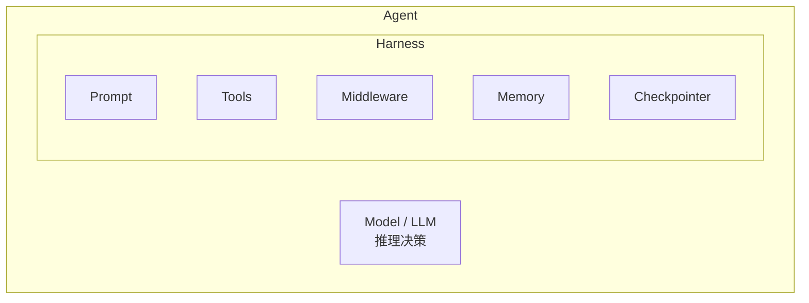

# 2.1 LangChain.js 架构概览

> 从全栈工程师视角理解 LangChain.js 的架构设计与生态全景图

## 学习目标

- 理解 LangChain.js v1.0+ 的 "Model + Harness" 设计哲学
- 掌握 LangChain 包生态全景图与各包职责
- 了解 LangChain.js 与 Python 版的关键区别
- 能够完成项目初始化并运行第一个 Agent
- 快速集成 LangSmith 链路追踪

---

## 1. LangChain.js v1.0+ 设计哲学：Model + Harness

### 1.1 核心概念

LangChain.js v1.0+ 围绕一个简洁的核心理念构建：**Agent = Model + Harness**。

- **Model（模型）**：负责推理和决策的大语言模型
- **Harness（框架）**：围绕模型的一切——Prompt、Tools、Middleware、Memory、Checkpointer



**设计目标**：
- **极简 API**：`createAgent()` 一行代码创建 Agent
- **可组合性**：Middleware 机制让功能按需叠加
- **Provider 无关**：统一接口，模型切换只需改字符串

### 1.2 Agent 工作流程

Agent 的核心是一个循环（Loop）：

```typescript
// 伪代码：Agent 循环
async function agentLoop(input: string) {
  const messages = [new HumanMessage(input)];

  while (true) {
    // 1. 模型生成响应（可能包含工具调用）
    const response = await model.invoke(messages);

    // 2. 如果没有工具调用，返回结果
    if (!response.tool_calls?.length) {
      return response.content;
    }

    // 3. 执行工具调用
    for (const toolCall of response.tool_calls) {
      const result = await executeTool(toolCall);
      messages.push(result);
    }
    // 4. 继续循环
  }
}
```

---

## 2. 包生态全景图

LangChain.js 采用模块化包设计，核心包和集成包分工明确：

| 包名 | 职责 | 安装 |
|------|------|------|
| `langchain` | 核心 API：`createAgent`、`tool`、`initChatModel`、Middleware | `bun add langchain` |
| `@langchain/core` | 基础类型：消息、工具接口、运行时 | `bun add @langchain/core` |
| `@langchain/langgraph` | 图状态管理：`MemorySaver`、`StateSchema`、`Command` | `bun add @langchain/langgraph` |
| `deepagents` | DeepAgents 框架：`createDeepAgent`、文件系统、子Agent | `bun add deepagents` |
| `@langchain/openai` | OpenAI 集成 | `bun add @langchain/openai` |
| `@langchain/anthropic` | Anthropic/Claude 集成 | `bun add @langchain/anthropic` |
| `@langchain/google-genai` | Google Gemini 集成 | `bun add @langchain/google-genai` |
| `@langchain/aws` | AWS Bedrock 集成 | `bun add @langchain/aws` |

**依赖关系**：

```mermaid
graph LR
    langchain[langchain]
    langchain --> core[@langchain/core<br/>基础类型和接口]
    langchain --> langgraph[@langchain/langgraph<br/>状态管理和持久化]
    langchain --> provider[@langchain/{provider}<br/>模型提供商集成<br/>按需]
```

### 2.1 包职责详解

**`langchain`** — 核心包，提供所有高层 API：
- `createAgent()` — 创建 Agent
- `initChatModel()` — 初始化模型
- `tool()` — 定义工具
- `createMiddleware()` — 创建中间件
- 内置 Middleware：`todoListMiddleware`、`modelRetryMiddleware`、`piiMiddleware` 等

**`@langchain/core`** — 基础类型包：
- 消息类型：`SystemMessage`、`HumanMessage`、`AIMessage`、`ToolMessage`
- 内容块类型：`ContentBlock.Text`、`ContentBlock.Reasoning` 等
- 运行时类型：`ToolRuntime`

**`@langchain/langgraph`** — 图引擎：
- `MemorySaver` — 内存级 Checkpointer
- `StateSchema` — 自定义状态定义
- `Command` — 从工具中更新状态
- `PostgresSaver` — 生产级数据库 Checkpointer

### 2.2 集成包模式

每个模型提供商对应一个 `@langchain/{provider}` 包，所有包遵循同一接口：

```typescript
// 所有集成包都支持这些统一方法
const response = await model.invoke(messages);     // 调用
const stream = await model.stream(messages);        // 流式
const responses = await model.batch([...inputs]);   // 批处理
const structured = model.withStructuredOutput(schema); // 结构化输出
```

---

## 3. 与 Python 版的关键区别

| 维度 | LangChain.js | LangChain Python |
|------|-------------|-----------------|
| 运行时 | Node.js 22+ / Bun 1.0+ | Python 3.9+ |
| 核心创建方式 | `createAgent()` 函数式 | `create_agent()` 函数式 |
| 工具定义 | `tool()` + Zod Schema | `@tool` 装饰器 |
| Middleware | `createMiddleware()` 一等公民 | 无原生 Middleware |
| 类型安全 | TypeScript + Zod | Pydantic |
| DeepAgents | `createDeepAgent()` 独立函数 | 同上 |
| 包管理 | npm/yarn/pnpm/bun | pip/poetry |

**关键差异**：
1. **类型系统**：JS 版利用 TypeScript + Zod 提供编译时类型安全，Python 版用 Pydantic
2. **Middleware**：JS 版是内置一等特性，Python 版需要手动构建
3. **工具签名**：JS 版用 `tool(fn, { name, description, schema })`，Python 版用 `@tool` 装饰器

---

## 4. 安装与项目初始化

### 4.1 环境要求

- **Node.js 22+** 或 **Bun v1.0.0+**
- TypeScript 5.0+

### 4.2 项目初始化

```bash
# 创建项目目录
mkdir my-agent && cd my-agent

# 使用 Bun 初始化
bun init -y

# 安装核心包
bun add langchain @langchain/core

# 安装模型提供商集成包
bun add @langchain/openai        # OpenAI
# 或
bun add @langchain/anthropic     # Anthropic/Claude
# 或
bun add @langchain/google-genai  # Google Gemini
```

### 4.3 TypeScript 配置

```json
{
  "compilerOptions": {
    "target": "ES2022",
    "module": "ESNext",
    "moduleResolution": "bundler",
    "strict": true,
    "esModuleInterop": true,
    "skipLibCheck": true
  }
}
```

### 4.4 环境变量配置

```bash
# 选择你的模型提供商，设置对应的 API Key
export OPENAI_API_KEY="sk-..."
# 或
export ANTHROPIC_API_KEY="sk-ant-..."
# 或
export GOOGLE_API_KEY="AIza..."
```

---

## 5. `createAgent` 快速体验

### 5.1 最小的 Agent 示例

```typescript
import { createAgent, tool } from "langchain";
import * as z from "zod";

// 1. 定义一个工具
const getWeather = tool(
  ({ city }) => `It's always sunny in ${city}!`,
  {
    name: "get_weather",
    description: "Get the weather for a given city",
    schema: z.object({
      city: z.string().describe("The city to get the weather for"),
    }),
  }
);

// 2. 创建 Agent
const agent = createAgent({
  model: "openai:gpt-5.5",
  tools: [getWeather],
});

// 3. 调用 Agent
const result = await agent.invoke({
  messages: [
    { role: "user", content: "What's the weather in San Francisco?" },
  ],
});

console.log(result.messages.at(-1)?.content);
```

### 5.2 不同模型提供商的写法

```typescript
import { initChatModel } from "langchain";

// 方式一：字符串方式（推荐）
const agent = createAgent({
  model: "anthropic:claude-sonnet-4-6",  // provider:model 格式
  tools: [getWeather],
});

// 方式二：预先初始化模型实例
const model = await initChatModel("google-genai:gemini-3.1-pro-preview", {
  temperature: 0.5,
  timeout: 600_000,
  maxTokens: 25000,
});

const agent = createAgent({
  model,
  tools: [getWeather],
});
```

**支持的 Provider 示例**：

| Provider | 字符串格式 | 包 |
|----------|-----------|-----|
| OpenAI | `openai:gpt-5.5` | `@langchain/openai` |
| Anthropic | `anthropic:claude-sonnet-4-6` | `@langchain/anthropic` |
| Google Gemini | `google-genai:gemini-3.1-pro-preview` | `@langchain/google-genai` |
| Azure OpenAI | `azure_openai:gpt-5.5` | `@langchain/openai` |
| AWS Bedrock | `bedrock:gpt-5.5` | `@langchain/aws` |
| Ollama（本地） | `ollama:qwen3` | 内置支持 |
| OpenRouter | `openrouter:anthropic/claude-sonnet-4-6` | `@langchain/openrouter` |

### 5.3 流式输出

```typescript
const stream = await agent.streamEvents(
  {
    messages: [
      { role: "user", content: "Search for AI news and summarize" },
    ],
  },
  { version: "v3" }
);

for await (const snapshot of stream.values) {
  const latestMessage = snapshot.messages.at(-1);
  if (latestMessage?.content) {
    process.stdout.write(String(latestMessage.content));
  }
}
```

---

## 6. LangSmith 链路追踪快速集成

LangSmith 是 LangChain 的全链路观测平台，提供 Trace 查看、调试和评估能力。

### 6.1 快速集成

```bash
export LANGSMITH_TRACING="true"
export LANGSMITH_API_KEY="lsv2_..."
```

配置后，所有 Agent 调用自动记录 Trace。可在 [LangSmith](https://smith.langchain.com) 上查看每次调用的详细信息。

### 6.2 Trace 内容

每次 Agent 调用会记录：
- **模型调用**：输入/输出、Token 消耗、延迟
- **工具调用**：调用的工具名、参数、返回值
- **中间步骤**：Agent 循环中的每一步
- **错误信息**：调用失败时的异常详情

---

## 总结

**核心要点**：
1. **Agent = Model + Harness**，LangChain.js 提供 `createAgent()` 作为核心入口
2. **包生态**分层清晰：`langchain`（核心）→ `@langchain/core`（类型）→ `@langchain/{provider}`（集成）
3. **安装简单**：bun install langchain，一行代码创建 Agent
4. **LangSmith** 零配置集成，提供全链路可观测性

**下一步**：
- 学习 [2.2 模型与消息系统](02-模型与消息系统.md)，深入模型调用和消息体系
- 了解 [2.3 工具系统](03-工具系统.md)，为 Agent 赋予外部能力
- 深入 [2.4 Agent 构建与配置](04-Agent构建与配置.md)

---

*参考资料*：
- [LangChain.js 安装文档](https://docs.langchain.com/oss/javascript/langchain/install)
- [LangChain.js Quickstart](https://docs.langchain.com/oss/javascript/langchain/quickstart)
- [LangChain Agent 文档](https://docs.langchain.com/oss/javascript/langchain/agents)
- [LangSmith 快速开始](https://docs.langchain.com/langsmith/trace-with-langchain)
- [LangChain 参考文档](https://reference.langchain.com/javascript/)
