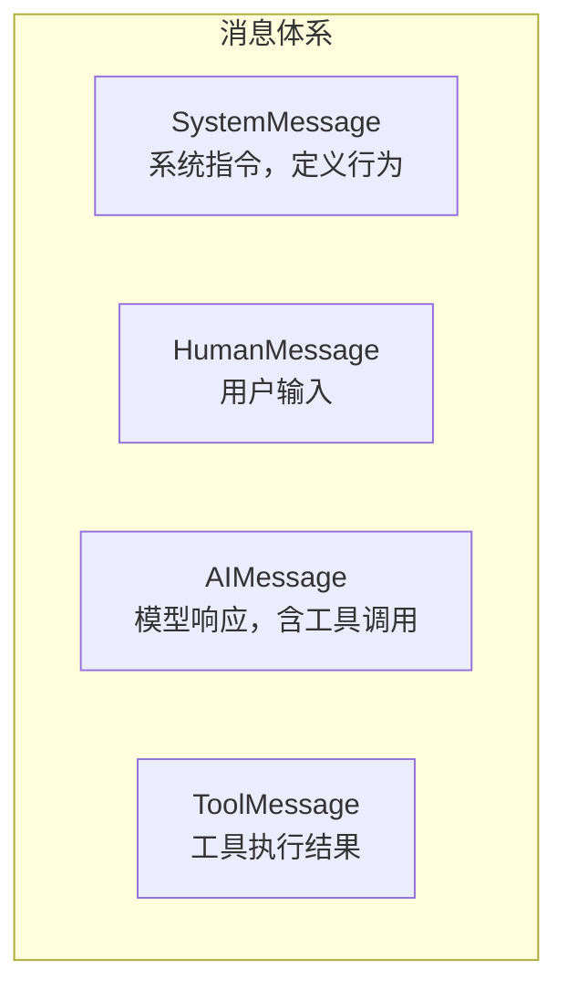
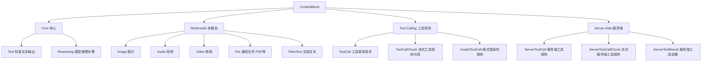

# 2.2 模型与消息系统

> 深入理解 LangChain.js 的模型调用方式和消息体系，掌握与 LLM 通信的核心机制

## 学习目标

- 掌握 `initChatModel` 模型初始化与多 Provider 切换
- 理解消息类型体系：SystemMessage / HumanMessage / AIMessage / ToolMessage
- 熟悉 `content_blocks` 响应结构与标准内容块
- 掌握流式输出与实时响应处理
- 学会配置模型参数（temperature / maxTokens / timeout）

---

## 1. `initChatModel` 模型初始化

### 1.1 多 Provider 支持

LangChain.js 通过 `initChatModel` 提供统一的模型初始化接口，支持主流模型提供商：

```typescript
import { initChatModel } from "langchain";

// OpenAI
const openaiModel = await initChatModel("gpt-5.5", {
  temperature: 0.7,
  timeout: 300,
  maxTokens: 1000,
});

// Anthropic Claude
const claudeModel = await initChatModel("claude-sonnet-4-6", {
  temperature: 0.5,
  timeout: 300,
});

// Google Gemini
const geminiModel = await initChatModel("google-genai:gemini-3.1-pro-preview", {
  temperature: 0.3,
  timeout: 600_000,
});
```

### 1.2 两种初始化方式

```typescript
// 方式一：initChatModel（推荐，统一接口）
import { initChatModel } from "langchain";
const model = await initChatModel("openai:gpt-5.4", {
  temperature: 0.7,
  timeout: 300,
});

// 方式二：直接实例化 Provider 类（需特定包）
import { ChatOpenAI } from "@langchain/openai";
const model = new ChatOpenAI({
  model: "gpt-5.5",
  temperature: 0.7,
  timeout: 300,
});
```

**Provider 字符串格式**：`{provider}:{model_name}`

| 字符串 | 对应包 |
|--------|--------|
| `openai:gpt-5.4` | `@langchain/openai` |
| `anthropic:claude-sonnet-4-6` | `@langchain/anthropic` |
| `google-genai:gemini-3.1-pro-preview` | `@langchain/google-genai` |
| `azure_openai:gpt-5.4` | `@langchain/openai` |
| `bedrock:gpt-5.5` | `@langchain/aws` |
| `ollama:qwen3` | 内置支持 |
| `fireworks:accounts/fireworks/models/...` | `@langchain/openai` |
| `baseten:zai-org/GLM-5.2` | `@langchain/openai` |

### 1.3 模型参数详解

```typescript
const model = await initChatModel("claude-sonnet-4-6", {
  temperature: 0.5,      // 控制随机性（0-1，越低越确定）
  maxTokens: 25000,       // 最大输出 Token 数
  timeout: 300,           // 超时时间（秒）
  maxRetries: 6,          // 最大重试次数（默认 6）
});

// 模型配置文件（model profile）
console.log(model.profile);
// {
//   maxInputTokens: 400000,
//   imageInputs: true,
//   reasoningOutput: true,
//   toolCalling: true,
//   ...
// }
```

**参数说明**：

| 参数 | 类型 | 默认值 | 说明 |
|------|------|--------|------|
| `temperature` | number | 0.7 | 输出随机性，越低越确定 |
| `maxTokens` | number | 无限制 | 最大输出 Token 数 |
| `timeout` | number | 无限制 | API 超时时间（秒） |
| `maxRetries` | number | 6 | 自动重试次数（指数退避） |

自动重试的触发条件：
- 网络错误（Network Error）
- 速率限制（HTTP 429）
- 服务端错误（HTTP 5xx）
- **不会重试**：认证错误（401）、未找到（404）

---

## 2. 消息类型体系

### 2.1 四种核心消息类型

消息是 LangChain 中模型交互的基本单元，LangChain 提供统一的消息类型，跨越所有 Provider：



#### SystemMessage（系统消息）

定义模型的角色、行为和约束：

```typescript
import { SystemMessage } from "langchain";

// 简洁写法
const sysMsg = new SystemMessage("You are a helpful coding assistant.");

// 详细定义
const sysMsg = new SystemMessage(`
You are a senior TypeScript developer.
- Always provide code examples
- Explain your reasoning
- Be concise but thorough
`);
```

#### HumanMessage（用户消息）

表示用户的输入，可包含文本和多媒体内容：

```typescript
import { HumanMessage } from "langchain";

// 纯文本
const msg = new HumanMessage("What is machine learning?");

// 带元数据
const msg = new HumanMessage({
  content: "Hello!",
  name: "alice",
  id: "msg_123",
});
```

#### AIMessage（模型响应）

模型生成的响应，包含文本内容和工具调用：

```typescript
import { AIMessage } from "langchain";

const response = await model.invoke("Explain AI");
console.log(response);
// AIMessage {
//   content: "Artificial Intelligence is...",
//   tool_calls: [],          // 工具调用列表
//   usage_metadata: {        // Token 使用量
//     input_tokens: 8,
//     output_tokens: 304,
//     total_tokens: 312,
//   },
//   response_metadata: { ... }  // Provider 元数据
// }
```

#### ToolMessage（工具消息）

工具执行结果，需匹配对应的工具调用 ID：

```typescript
import { ToolMessage } from "langchain";

const toolMsg = new ToolMessage({
  content: "Sunny, 72°F",
  tool_call_id: "call_123",    // 必须匹配 AIMessage 中的 tool_call.id
  name: "get_weather",
});
```

### 2.2 消息传递示例

```typescript
const conversation = [
  new SystemMessage("You are a helpful assistant that translates English to French."),
  new HumanMessage("Translate: I love programming."),
  new AIMessage("J'adore la programmation."),
  new HumanMessage("Translate: I love building applications."),
];

const response = await model.invoke(conversation);
// AIMessage("J'adore créer des applications.")
```

**两种格式等效**：

```typescript
// 格式一：字典格式（类似 OpenAI）
const msgs = [
  { role: "system", content: "You are a helpful assistant." },
  { role: "user", content: "Hello!" },
  { role: "assistant", content: "Hi there!" },
];

// 格式二：消息对象格式
const msgs = [
  new SystemMessage("You are a helpful assistant."),
  new HumanMessage("Hello!"),
  new AIMessage("Hi there!"),
];
```

### 2.3 Token 用量追踪

```typescript
const response = await model.invoke("Hello!");
console.log(response.usage_metadata);
// {
//   output_tokens: 304,
//   input_tokens: 8,
//   total_tokens: 312,
//   input_token_details: { cache_read: 0 },
//   output_token_details: { reasoning: 256 }
// }
```

---

## 3. `content_blocks` 响应结构

### 3.1 什么是 content_blocks

LangChain 提供标准化的内容块（content_blocks）表示，将不同 Provider 的响应格式统一为类型安全的接口：

```typescript
const response = await model.invoke("Describe this image");
console.log(response.contentBlocks);
// [
//   { type: "text", text: "Here's a picture of a cat" },
//   { type: "image", data: "...", mimeType: "image/jpeg" },
// ]
```

### 3.2 标准内容块类型



### 3.3 使用示例

```typescript
import { ContentBlock } from "langchain";

// 文本块
const textBlock: ContentBlock.Text = {
  type: "text",
  text: "Hello world",
};

// 推理块（模型思考过程）
const reasoningBlock: ContentBlock.Reasoning = {
  type: "reasoning",
  reasoning: "The user is asking about...",
};

// 工具调用块
const toolCallBlock: ContentBlock.Tools.ToolCall = {
  type: "tool_call",
  name: "search",
  args: { query: "weather" },
  id: "call_123",
};
```

### 3.4 多模态输入

LangChain 支持向模型传递多模态数据（图片、音频、视频、PDF）：

```typescript
// 图片输入
const msg = new HumanMessage({
  content: [
    { type: "text", text: "Describe the content of this image." },
    {
      type: "image",
      source_type: "url",
      url: "https://example.com/image.jpg",
    },
  ],
});

// PDF 输入
const pdfMsg = new HumanMessage({
  content: [
    { type: "text", text: "Summarize this document." },
    {
      type: "file",
      source_type: "url",
      url: "https://example.com/doc.pdf",
      mime_type: "application/pdf",
    },
  ],
});
```

---

## 4. 流式输出与实时响应

### 4.1 model.stream()

流式输出让模型逐块生成内容，显著提升用户体验：

```typescript
// 基础文本流式
const stream = await model.stream("Why do parrots talk?");
for await (const chunk of stream) {
  process.stdout.write(chunk.text);
}

// 流式内容块（含推理、工具调用等）
const stream = await model.stream("What color is the sky?");
for await (const chunk of stream) {
  for (const block of chunk.contentBlocks) {
    if (block.type === "reasoning") {
      console.log(`Reasoning: ${block.reasoning}`);
    } else if (block.type === "tool_call_chunk") {
      console.log(`Tool call chunk: ${block}`);
    } else if (block.type === "text") {
      process.stdout.write(block.text);
    }
  }
}
```

### 4.2 拼接流式块

流式返回的是 `AIMessageChunk`，可拼接成完整的 `AIMessage`：

```typescript
import { AIMessageChunk } from "langchain";

let full: AIMessageChunk | null = null;
for await (const chunk of stream) {
  full = full ? full.concat(chunk) : chunk;
  console.log(full.text);
  // "The"
  // "The sky"
  // "The sky is"
  // "The sky is typically"
  // "The sky is typically blue"
}
```

### 4.3 streamEvents（Agent 级流式）

当 Agent 组合多个工具调用和模型调用时，使用 `streamEvents` 获取完整状态快照：

```typescript
const stream = await agent.streamEvents(
  {
    messages: [
      { role: "user", content: "Search for AI news and summarize" },
    ],
  },
  { version: "v3" }
);

for await (const snapshot of stream.values) {
  const latestMessage = snapshot.messages.at(-1);
  if (latestMessage?.type === "human") {
    console.log(`User: ${latestMessage.content}`);
  } else if (latestMessage?.type === "ai") {
    console.log(`Agent: ${latestMessage.content}`);
  } else if (latestMessage?.tool_calls?.length) {
    const toolNames = latestMessage.tool_calls.map(tc => tc.name);
    console.log(`Calling tools: ${toolNames.join(", ")}`);
  }
}
```

---

## 5. 模型调用模式

### 5.1 invoke（单次调用）

```typescript
// 文本 prompt
const response = await model.invoke("Write a haiku about spring");

// 消息列表
const response = await model.invoke([
  new SystemMessage("You are a poetry expert"),
  new HumanMessage("Write a haiku about spring"),
]);
```

### 5.2 batch（批处理）

```typescript
const responses = await model.batch([
  "Why do parrots have colorful feathers?",
  "How do airplanes fly?",
  "What is quantum computing?",
]);

// 控制并行度
const responses = await model.batch(listOfInputs, {
  maxConcurrency: 5,  // 最多 5 个并行请求
});
```

### 5.3 结构化输出（withStructuredOutput）

```typescript
import * as z from "zod";

const Movie = z.object({
  title: z.string().describe("The title of the movie"),
  year: z.number().describe("The year the movie was released"),
  director: z.string().describe("The director of the movie"),
  rating: z.number().describe("The movie's rating out of 10"),
});

const modelWithStructure = model.withStructuredOutput(Movie);

const result = await modelWithStructure.invoke(
  "Provide details about the movie Inception"
);
// {
//   title: "Inception",
//   year: 2010,
//   director: "Christopher Nolan",
//   rating: 8.8,
// }
```

> **💡 跨文档提示**：这是**模型级别**的结构化输出。在 **Agent 级别**，通过 `createAgent` 的 `responseFormat` 参数实现，用法类似但结果可通过 `result.structuredResponse` 获取，详见 [2.4 Agent 构建与配置](04-Agent构建与配置.md#4-structured-output结构化输出)。

---

## 面试问答

**Q: initChatModel("anthropic:claude-sonnet-4-6") 这种字符串格式是如何实现多 Provider 切换的？底层依赖什么机制？**
A: initChatModel 内部维护一个 Provider 注册表，解析字符串的 {provider}:{model_name} 格式后，动态加载对应的 Provider 包（通过 lazy import）并实例化。底层依赖 Provider 包统一实现 BaseChatModel 接口，确保 initChatModel 返回的对象都支持 invoke/stream/batch/withStructuredOutput 等方法。切换模型只需改字符串，无需改动调用代码。

**Q: content_blocks 解决了什么问题？为什么说它是 LangChain 多模态支持的关键抽象？**
A: 不同 Provider 的响应格式各异（OpenAI 用 tool_calls 数组，Anthropic 用 content 数组含 type 字段），content_blocks 将这些差异统一为类型安全的接口。它将文本、推理步骤、工具调用、图片、音频等统一表示为 ContentBlock 类型，让上层代码用同一套逻辑处理所有 Provider 的响应，无需关心底层差异。这是跨 Provider 多模态支持的基础。

**Q: 四种消息类型（System/Human/AI/Tool）的设计是如何支撑 Agent 循环的？如果缺少 ToolMessage 会怎样？**
A: SystemMessage 定义角色行为（全局不变），HumanMessage 传递用户输入，AIMessage 承载模型响应和 tool_calls，ToolMessage 回传工具执行结果。Agent 循环的"模型推理→工具执行→结果回传→继续推理"流程依赖这四者的闭环。缺少 ToolMessage 时，工具结果无法与调用请求对应（tool_call_id 匹配机制失效），Agent 无法区分工具结果和用户输入，循环就会断裂。

**Q: Structured Output（withStructuredOutput）的实现原理是什么？在什么场景下应该用模型级结构化输出 vs Agent 级 responseFormat？**
A: 模型级 withStructuredOutput 通过给模型附加 JSON Schema 约束（Provider 原生支持的 response_format 参数或函数调用模式），让模型直接输出符合 Schema 的 JSON。Agent 级 responseFormat 在此基础上封装，结果通过 result.structuredResponse 获取，同时保留完整的消息历史。区别：简单的数据提取用模型级更直接；需要结合工具调用、多轮交互的场景用 Agent 级，因为 responseFormat 在 Agent 循环结束后才会结构化输出最终结果，中间步骤不受影响。

**Q: 多模态输入中，HumanMessage 的 content 支持数组结构（text + image + file），但有些 Provider 不支持图片输入。LangChain 如何处理这种 Provider 能力差异？**
A: 每个 Provider 的 model.profile 字段暴露了能力声明（如 imageInputs、toolCalling、reasoningOutput）。在运行时，LangChain 会在消息送入模型前校验 content_blocks 是否匹配 Provider 能力。如果不支持，会抛出明确的错误提示。开发者应通过 profile 做能力检测或配置 fallback 模型。此外，在不支持多模态的模型上，可以编写 Middleware 将图片描述替换为文本摘要后再调用模型。

---

## 6. 实战练习

> 目标：熟练使用 `initChatModel` 和 `withStructuredOutput`，并观察 Token 消耗。

**要求**：
1. 使用 `initChatModel("openai:gpt-5.4")` 初始化一个模型（也可换成你可用的 Provider）。
2. 用 `model.withStructuredOutput(MovieSchema)` 从一段电影描述中提取 `title`、`year`、`director`、`rating`。
3. 打印 `response.usage_metadata`，观察 input / output / total tokens。
4. 尝试用 `model.stream("Write a haiku about spring")` 流式输出，逐字打印到终端。

**提示**：
- `MovieSchema` 可直接复用文档中的 Zod 定义。
- 若 Provider 不可用，把字符串改为本地 `ollama:llama3.1` 等可运行的模型。

**预期效果**：
- 结构化输出严格符合 Schema，无多余字段。
- 流式输出逐字出现，`usage_metadata` 中 Token 数合理。

---

## 7. 对比：LangChain 消息格式 vs 原生 OpenAI SDK

| 特性 | 原生 OpenAI SDK | LangChain.js |
|------|-----------------|--------------|
| 消息格式 | `{ role: "system" / "user" / "assistant", content: "..." }` | `SystemMessage` / `HumanMessage` / `AIMessage` / `ToolMessage` |
| 多 Provider 兼容 | 只支持 OpenAI | 同一套消息对象可跨 Provider 复用 |
| 工具结果回传 | 手动构造 `tool` role 消息 | `ToolMessage` 自动匹配 `tool_call_id` |
| Token 统计 | 响应中 `usage` 字段 | 统一为 `usage_metadata` |
| 多模态输入 | 各 SDK 格式不同 | `content_blocks` 统一抽象 |

**一句话总结**：LangChain 的消息体系是跨 Provider 的标准化层，切换模型时业务代码几乎不变。

---

## 总结

**核心要点**：
1. `initChatModel` 统一接口管理多 Provider，切换模型只需改字符串
2. 四种消息类型（System/Human/AI/Tool）覆盖完整对话周期
3. `content_blocks` 标准化多模态和工具调用响应
4. 流式输出（stream/streamEvents）提供实时用户体验
5. 模型调用支持 invoke/stream/batch 三种模式

**下一步**：
- 学习 [2.3 工具系统](03-工具系统.md)，为 Agent 赋予外部能力
- 深入 [2.4 Agent 构建与配置](04-Agent构建与配置.md)，将模型、工具组合成完整 Agent

---

*参考资料*：
- [LangChain.js Models 文档](https://docs.langchain.com/oss/javascript/langchain/models)
- [LangChain.js Messages 文档](https://docs.langchain.com/oss/javascript/langchain/messages)
- [LangChain.js Structured Output](https://docs.langchain.com/oss/javascript/langchain/structured-output)
- [initChatModel 参考](https://reference.langchain.com/javascript/langchain/chat_models/universal/initChatModel)
- [ContentBlock 类型定义](https://reference.langchain.com/javascript/langchain-core/messages/ContentBlock)
