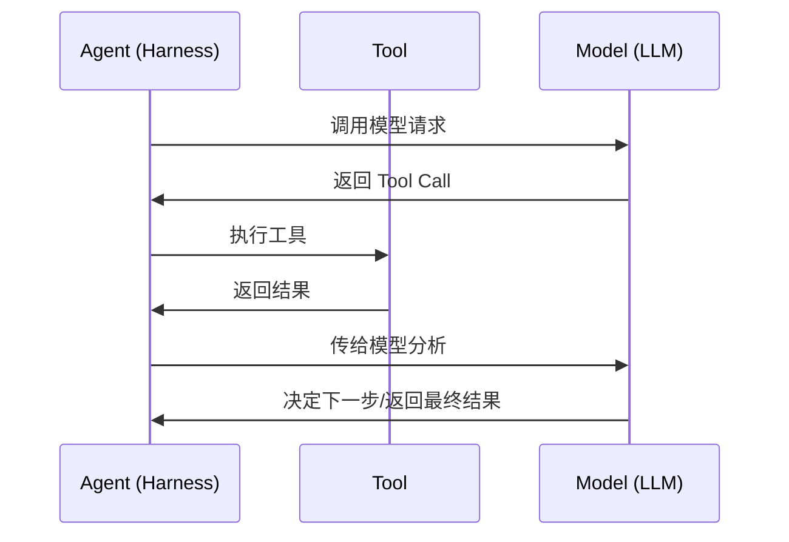
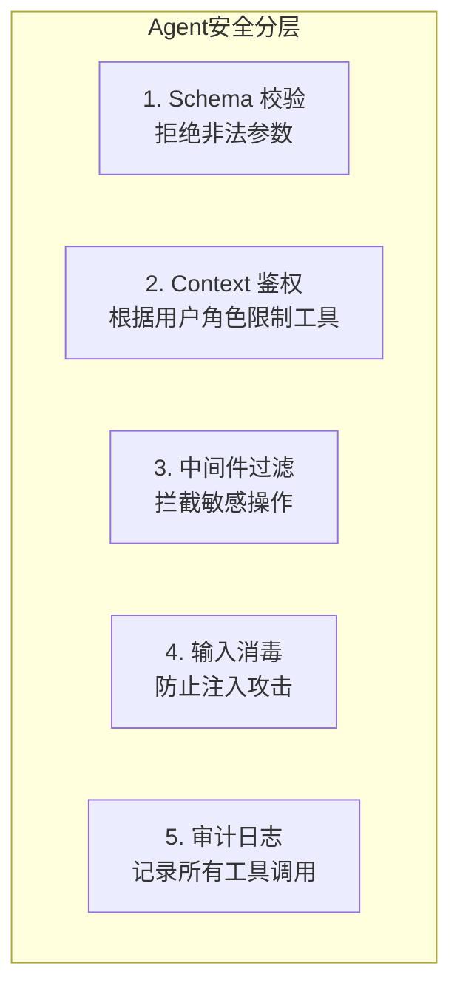

# 2.3 工具系统

> 掌握 LangChain.js 工具系统，为 Agent 赋予与外部世界交互的能力

## 学习目标

- 掌握使用 `tool()` 函数定义工具的方法
- 理解 Zod Schema 在工具入参校验中的作用
- 学会工具组合与编排策略
- 掌握 Runtime Context 在工具中的使用
- 了解工具安全性与权限控制机制

---

## 1. 工具系统概述

### 1.1 什么是工具

工具（Tool）是 Agent 与外部世界交互的桥梁。Agent 通过工具获取实时数据、执行代码、查询数据库、调用 API。



**工具的三要素**：
- **name**：工具名，供模型识别
- **description**：描述，告诉模型何时使用这个工具
- **schema**：入参 Schema，定义工具需要什么参数

### 1.2 工具定义基础

```typescript
import { tool } from "langchain";
import * as z from "zod";

const searchDatabase = tool(
  // 执行函数
  ({ query, limit }) => `Found ${limit} results for '${query}'`,
  {
    // 元数据
    name: "search_database",
    description: "Search the customer database for records matching the query.",
    schema: z.object({
      query: z.string().describe("Search terms to look for"),
      limit: z.number().describe("Maximum number of results to return"),
    }),
  }
);
```

---

## 2. 自定义工具开发

### 2.1 基本工具

```typescript
// 简单工具：返回字符串
const getWeather = tool(
  ({ city }) => `It is currently sunny in ${city}.`,
  {
    name: "get_weather",
    description: "Get weather for a city.",
    schema: z.object({
      city: z.string().describe("The city to get weather for"),
    }),
  }
);
```

### 2.2 异步工具

```typescript
const fetchAPI = tool(
  async ({ url }) => {
    const response = await fetch(url);
    return response.ok ? await response.text() : `Error: ${response.status}`;
  },
  {
    name: "fetch_api",
    description: "Fetch data from a URL.",
    schema: z.object({
      url: z.string().url().describe("URL to fetch"),
    }),
  }
);
```

### 2.3 返回值类型

工具可以返回不同类型的数据，Agent 会根据类型做出不同反应：

**返回字符串** — 工具返回纯文本给模型阅读：

```typescript
const getWeather = tool(
  ({ city }) => `It is currently sunny in ${city}.`,
  { name: "get_weather", description: "...", schema: z.object({ city: z.string() }) }
);
```

**返回对象** — 结构化数据供模型分析：

```typescript
const getWeatherData = tool(
  ({ city }) => ({
    city,
    temperature_c: 22,
    conditions: "sunny",
    humidity: 45,
  }),
  { name: "get_weather_data", description: "...", schema: z.object({ city: z.string() }) }
);
```

**返回多模态内容** — 图片、文本等混合返回：

```typescript
const captureScreenshot = tool(
  async () => [
    { type: "text", text: "Screenshot of the current page:" },
    { type: "image", url: "https://example.com/page.png" },
  ],
  { name: "capture_screenshot", description: "...", schema: z.object({}) }
);
```

**返回 Command** — 更新 Agent 状态（高级用法）：

```typescript
import { Command } from "@langchain/langgraph";
import { ToolMessage } from "langchain";

const setLanguage = tool(
  async ({ language }, config) => {
    return new Command({
      update: {
        preferredLanguage: language,
        messages: [
          new ToolMessage({
            content: `Language set to ${language}.`,
            tool_call_id: config.toolCallId,
          }),
        ],
      },
    });
  },
  { name: "set_language", description: "...", schema: z.object({ language: z.string() }) }
);
```

### 2.4 工具命名规范

```typescript
// ✅ 推荐：snake_case
const toolA = tool(fn, { name: "search_database", ... });

// ✅ 推荐：字母、下划线、连字符
const toolB = tool(fn, { name: "get-weather", ... });

// ❌ 避免：空格和特殊字符（某些 Provider 会拒绝）
const toolC = tool(fn, { name: "Search Database", ... });  // 不推荐
```

---

## 3. Zod Schema 与入参校验

### 3.1 Schema 定义

Zod 是 TypeScript 生态最流行的 Schema 校验库，LangChain 将其作为工具入参校验的一等方案：

```typescript
import * as z from "zod";

// 基本类型
const simpleSchema = z.object({
  query: z.string(),
  limit: z.number().optional(),
});

// 带描述（帮助模型理解参数用途）
const describedSchema = z.object({
  query: z.string().describe("搜索关键词，如 'weather in Beijing'"),
  limit: z.number().default(10).describe("最大结果数，默认 10"),
  filter: z.string().optional().describe("可选过滤条件"),
});

// 复杂嵌套
const complexSchema = z.object({
  userId: z.string(),
  action: z.enum(["create", "update", "delete"]),
  data: z.object({
    name: z.string(),
    age: z.number().min(0).max(150),
    email: z.string().email(),
  }),
});
```

### 3.2 Schema 的作用

```typescript
// Schema 做了三件事：
// 1. 告诉模型需要什么参数（通过描述）
// 2. 运行时校验输入（防止错误参数导致崩溃）
// 3. 提供类型安全（TypeScript 自动推导类型）

const getUser = tool(
  ({ userId, includeEmail }) => {
    // userId 类型自动推导为 string
    // includeEmail 类型自动推导为 boolean | undefined
    return `User info for ${userId}`;
  },
  {
    name: "get_user",
    description: "Get user information.",
    schema: z.object({
      userId: z.string().describe("User ID to look up"),
      includeEmail: z.boolean().optional().describe("Whether to include email"),
    }),
  }
);
```

### 3.3 常见 Zod 模式

```typescript
// 枚举值
z.enum(["read", "write", "admin"])

// 可选字段
z.string().optional()

// 默认值
z.number().default(10)

// 字符串约束
z.string().min(1).max(100)
z.string().email()
z.string().url()

// 数字约束
z.number().min(0).max(100)
z.number().int()

// 数组
z.array(z.string())
z.array(z.object({ id: z.string(), name: z.string() }))
```

---

## 4. Runtime Context

### 4.1 访问运行时上下文

工具可以通过 `config` 参数访问 Agent 的运行时上下文：

```typescript
import { createAgent, tool, type ToolRuntime } from "langchain";

const getUserName = tool(
  (_, config: ToolRuntime) => {
    // 通过 config.context 访问运行时传入的数据
    return config.context.user_name;
  },
  {
    name: "get_user_name",
    description: "Get the user's name.",
    schema: z.object({}),
  }
);

// 定义上下文 Schema
const contextSchema = z.object({
  user_name: z.string(),
});

const agent = createAgent({
  model: "openai:gpt-5.4",
  tools: [getUserName],
  contextSchema,
});

// 在 invoke 时传入上下文
const result = await agent.invoke(
  { messages: [{ role: "user", content: "What is my name?" }] },
  {
    configurable: { thread_id: "thread-123" },
    context: { user_name: "John Smith" },
  }
);
```

**关键概念**：
- `thread_id` — 作用域为整个对话（消息历史和 Checkpoint）
- `context` — 每次调用时传入的运行时数据（用户 ID、Feature Flag 等）
- 两者通常一起使用

### 4.2 流式写入器（Stream Writer）

在长时间运行的工具中向用户推送进度信息：

```typescript
import { tool, type ToolRuntime } from "langchain";

const getWeather = tool(
  ({ city }, config: ToolRuntime) => {
    const writer = config.writer;

    // 发送进度更新
    if (writer) {
      writer(`Looking up data for city: ${city}`);
      writer(`Acquired data for city: ${city}`);
    }

    return `It's always sunny in ${city}!`;
  },
  {
    name: "get_weather",
    description: "Get weather for a given city.",
    schema: z.object({ city: z.string() }),
  }
);
```

### 4.3 执行信息

访问线程 ID、运行 ID 和重试状态：

```typescript
const logContext = tool(
  async (_input, runtime: ToolRuntime) => {
    const info = runtime.executionInfo;
    console.log(`Thread: ${info.threadId}, Run: ${info.runId}`);
    console.log(`Attempt: ${info.nodeAttempt}`);
    return "done";
  },
  { name: "log_context", description: "...", schema: z.object({}) }
);
```

### 4.4 长期记忆（Store）

跨对话持久存储数据：

```typescript
import { InMemoryStore } from "@langchain/langgraph";

const store = new InMemoryStore();

const saveUserInfo = tool(
  async ({ userId, name }) => {
    await store.put(["users"], userId, { name, updatedAt: Date.now() });
    return "Successfully saved user info.";
  },
  {
    name: "save_user_info",
    description: "Save user info for future reference.",
    schema: z.object({
      userId: z.string(),
      name: z.string(),
    }),
  }
);

const agent = createAgent({
  model: "openai:gpt-5.4",
  tools: [saveUserInfo],
  store,  // 注入 Store
});
```

---

## 5. 工具组合与编排

### 5.1 多工具 Agent

```typescript
const agent = createAgent({
  model: "openai:gpt-5.4",
  tools: [getWeather, searchDatabase, sendEmail, calculatePrice],
});
```

Agent 会根据用户输入智能选择工具，甚至并行调用多个独立工具：

```typescript
// 用户输入："What's the weather in Boston and Tokyo?"
// Agent 可能同时调用 getWeather("Boston") 和 getWeather("Tokyo")
```

### 5.2 returnDirect：短路返回

当工具的结果已经是用户需要的最终答案时，使用 `returnDirect: true` 跳过模型的二次处理：

```typescript
const fetchOrderStatus = tool(
  ({ order_id }) => `Order ${order_id} is shipped and will arrive in 2 days.`,
  {
    name: "fetch_order_status",
    description: "Fetch the current status of a customer order.",
    schema: z.object({ order_id: z.string() }),
    returnDirect: true,  // 直接返回，不再调用模型
  }
);
```

**适用场景**：
- 查询结果已经是用户可读的完整答案
- 确定性操作（如查询订单状态）
- 需要保持输出不经过模型改写

### 5.3 动态工具选择

根据运行状态动态过滤可用工具：

```typescript
import { createMiddleware } from "langchain";

const contextBasedTools = createMiddleware({
  name: "ContextBasedTools",
  wrapModelCall: (request, handler) => {
    const userRole = request.runtime.context.userRole;

    let filteredTools = request.tools;

    if (userRole === "admin") {
      // 管理员有所有工具权限
    } else if (userRole === "editor") {
      filteredTools = request.tools.filter(t => t.name !== "delete_data");
    } else {
      filteredTools = request.tools.filter(t =>
        (t.name as string).startsWith("read_")
      );
    }

    return handler({ ...request, tools: filteredTools });
  },
});
```

---

## 6. 工具安全性与权限控制

### 6.1 安全设计原则



### 6.2 基于角色的权限控制

```typescript
const contextSchema = z.object({
  userRole: z.enum(["admin", "editor", "viewer"]),
  userId: z.string(),
});

const deleteRecord = tool(
  async ({ recordId }, config: ToolRuntime) => {
    // 运行时检查权限
    if (config.context.userRole !== "admin") {
      throw new Error("Permission denied: only admins can delete records");
    }
    // 执行删除操作...
    return `Record ${recordId} deleted.`;
  },
  {
    name: "delete_record",
    description: "Delete a record (admin only).",
    schema: z.object({ recordId: z.string() }),
  }
);
```

### 6.3 错误处理

```typescript
import { createMiddleware, ToolMessage } from "langchain";

const handleToolErrors = createMiddleware({
  name: "HandleToolErrors",
  wrapToolCall: async (request, handler) => {
    try {
      return await handler(request);
    } catch (error) {
      return new ToolMessage({
        content: `Tool error: Please check your input and try again. (${error})`,
        tool_call_id: request.toolCall.id,
      });
    }
  },
});
```

> **💡 跨文档提示**：LangChain 内置了专用的重试 Middleware（`toolRetryMiddleware` / `modelRetryMiddleware`），支持指数退避自动重试。详见 [2.6 中间件系统](06-中间件系统.md)。

### 6.4 工具审计

```typescript
const auditMiddleware = createMiddleware({
  name: "AuditTools",
  wrapToolCall: async (request, handler) => {
    console.log(`[AUDIT] Tool called: ${request.toolCall.name}`);
    console.log(`[AUDIT] Args: ${JSON.stringify(request.toolCall.args)}`);
    console.log(`[AUDIT] User: ${request.runtime.context.userId}`);

    const result = await handler(request);

    console.log(`[AUDIT] Result: ${result}`);
    return result;
  },
});
```

---

## 7. 工具来源与选择

LangChain.js 本身不内置“万能工具”，但可以通过以下三种方式获得工具能力：

| 来源 | 说明 | 示例 |
|------|------|------|
| **自定义工具** | 用 `tool()` 自己实现，适合业务逻辑 | 查询订单、创建工单、查知识库 |
| **Provider 原生能力** | 部分模型自带特殊功能，不是 LangChain 工具 | OpenAI 的 `web_search`、Claude 的 `computer_use` |
| **@langchain/community 等集成包** | 社区维护的现成工具 | Tavily 搜索、SQLDatabase 工具、API 请求工具 |

> 参见 [Tools and Toolkits 集成页](https://docs.langchain.com/oss/javascript/integrations/tools) 获取完整列表。

**关键认知**：不要把“Provider 原生能力”误当成 LangChain 工具。例如 OpenAI 的 `web_search` 是模型层能力，不需要也不能通过 `tool()` 注册；而 Tavily 搜索才是真正的 LangChain 工具。

---

## 面试问答

**Q: tool() 工厂函数的设计为什么采用 (fn, config) 两个参数，而不是一个配置对象包含 fn？这种设计有什么考量？**
A: 这是"关注点分离"的设计：第一个参数是**执行逻辑**（what to do），第二个参数是**元数据声明**（how to describe）。好处：1）执行函数可以被独立测试，不依赖元数据；2）元数据（name/description/schema）是给模型看的，与执行逻辑解耦；3）类型推导时 TypeScript 能自动从 Zod Schema 推断入参类型，如果合并成一个对象会导致类型复杂度增加；4）运行时可通过 Middleware 动态过滤可用工具，无需反射性增减工具。

**Q: Zod Schema 在工具系统中承担了"三重角色"，具体是哪三重？如果不使用 Zod 会有什么问题？**
A: 1）**模型提示**：Schema 的 describe() 注释和字段结构被编译为 JSON Schema 传给模型，指导模型正确生成参数；2）**运行时校验**：模型生成的参数可能格式错误（如字段名不对），Zod 在工具执行前拦截并给出清晰错误；3）**TypeScript 类型推导**：工具函数的参数类型从 Schema 自动推断，消除类型声明不一致。不使用 Zod 需要手动维护类型接口 + 运行时校验 + 模型提示字符串，三者的不一致是常见 bug 来源。

**Q: returnDirect: true 在 Agent 循环中是如何"短路"的？适用场景和不适用场景分别是什么？**
A: returnDirect 标记的工具执行后，Agent 循环不会将结果回传给模型做二次处理，而是直接将工具输出作为最终响应返回给用户。适用场景：确定性查询（订单状态、数据库查记录），结果已经是用户可读的完整答案；需要保持输出不被模型改写。不适用场景：工具结果是中间数据需要模型进一步分析；需要模型结合多个工具结果做综合回答。

**Q: throw Error vs 返回 ToolMessage 的错误处理方式，在实际项目中应该如何选择？**
A: throw Error 会中断 Agent 执行，由 wrapToolCall 或全局错误中间件捕获，适合**不可恢复的错误**（如权限拒绝、配置错误），错误信息会以异常形式上报。返回 ToolMessage 的内容会**回传给模型**，适合**可恢复的错误**（如参数无效、API 限流），模型可以据此重新生成正确的参数或给出用户友好的提示。最佳实践：用 toolRetryMiddleware 处理临时故障，用 ToolMessage 处理业务逻辑错误。

---

## 总结

**核心要点**：
1. **工具定义**：`tool(fn, { name, description, schema })` 三个要素缺一不可
2. **Zod Schema**：同时提供类型安全、运行时校验和模型提示三重功能
3. **Runtime Context**：工具通过 `config` 访问上下文、Store、Stream Writer
4. **安全分层**：Schema 校验 + Context 鉴权 + Middleware 过滤
5. **returnDirect** 短路模式适用于确定性查询场景

**下一步**：
- 学习 [2.4 Agent 构建与配置](04-Agent构建与配置.md)，将模型和工具组合成完整 Agent
- 学习 [2.5 记忆与状态管理](05-记忆与状态管理.md)，为工具添加持久化能力
- 学习 [2.6 中间件系统](06-中间件系统.md)，掌握高级错误处理（`toolRetryMiddleware`）和动态工具选择

---

*参考资料*：
- [LangChain.js Tools 文档](https://docs.langchain.com/oss/javascript/langchain/tools)
- [Tool 执行与返回值](https://docs.langchain.com/oss/javascript/langchain/tools#tool-execution)
- [Runtime Context](https://docs.langchain.com/oss/javascript/langchain/tools#context)
- [工具与 Toolkits 集成](https://docs.langchain.com/oss/javascript/integrations/tools)
- [Zod 官方文档](https://zod.dev/)
