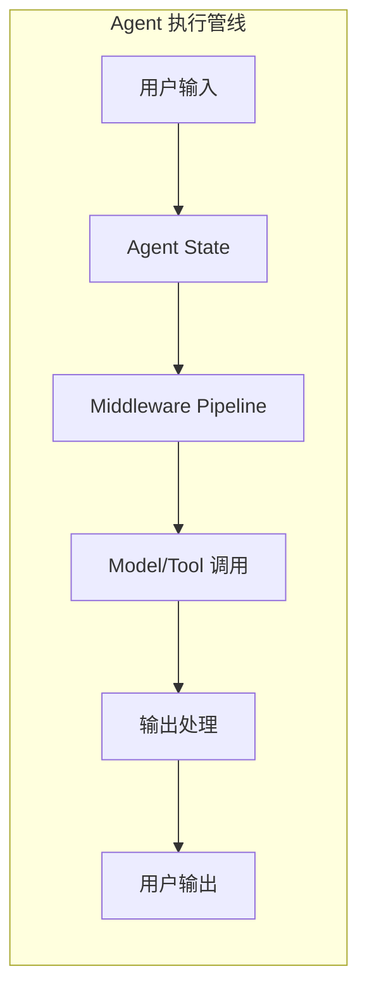

# 2.6 中间件系统

> 掌握 LangChain.js 的 Middleware 架构，学会使用内置中间件和自定义中间件来增强 Agent 能力

## 学习目标

- 理解 Middleware 架构设计（Hooks、State 传递、错误处理）
- 掌握所有内置 Middleware 的用法与配置
- 学会开发自定义中间件
- 掌握并发控制与速率限制策略

---

## 1. Middleware 架构设计

中间件是一种灵活的 Hook 系统，允许你在 Agent 执行流程的关键节点注入自定义逻辑。

### 1.1 执行流程



### 1.2 Hooks 类型

| Hook | 触发时机 | 用途 |
|------|---------|------|
| `beforeAgent` | Agent 执行前 | 初始化、鉴权 |
| `beforeModel` | 模型调用前 | 修改 State（注入系统消息、裁剪上下文） |
| `afterModel` | 模型调用后 | 检查输出、过滤敏感信息 |
| `afterAgent` | Agent 执行后 | 清理、统计 |
| `wrapModelCall` | 模型请求/响应 | 日志、监控、修改 Prompt |
| `wrapToolCall` | 工具请求/响应 | 审计、缓存、重试 |

### 1.3 基础中间件工厂

```typescript
import { createMiddleware } from "langchain";

const myMiddleware = createMiddleware({
  name: "LogMessages",
  beforeModel: (state) => {
    console.log("Model input:", state.messages);
  },
  afterModel: (state) => {
    console.log("Model output:", state.messages);
  },
});
```

**Hook 返回值说明**：

```typescript
// 不返回 → 不修改 State（只做副操作如日志）
beforeModel: (state) => {
  console.log("message count:", state.messages.length);
}

// 返回 Partial<State> → 合并到当前 State
beforeModel: (state) => {
  return { messages: [systemMsg, ...state.messages] };
}

// 返回 null → 阻塞 Agent 执行（用此方式快速返回）
beforeModel: (state) => {
  return null;  // 阻止模型调用
}
```

---

## 2. 内置 Middleware

LangChain.js 提供多个开箱即用的内置中间件：

### 2.1 summarizationMiddleware

自动管理上下文窗口，超过 Token 阈值时触发摘要压缩：

```typescript
import { createAgent, summarizationMiddleware } from "langchain";

const agent = createAgent({
  model: "openai:gpt-5.4",
  tools: [weatherTool],
  middleware: [
    summarizationMiddleware({
      model: "gpt-5.4-mini",         // 摘要模型
      trigger: { tokens: 6000 },     // 触发条件
      keep: { messages: 20 },        // 保留最新消息数
    }),
  ],
});
```

详细配置见 [2.5 记忆与状态管理](05-记忆与状态管理.md#43-策略二摘要压缩summarization)。

### 2.2 humanInTheLoopMiddleware

在关键决策点暂停执行，等待人工审批（适合审批场景如订单、转账）：

```typescript
import { humanInTheLoopMiddleware } from "langchain";

const agent = createAgent({
  model: "openai:gpt-5.4",
  tools: [transferTool, orderTool],
  middleware: [
    humanInTheLoopMiddleware({
      interruptOn: {
        transferTool: {
          allowedDecisions: ["approve", "edit", "reject"],
        },
        orderTool: false,  // 不审批
      },
    }),
  ],
});

// Agent 执行到 transfer 时会暂停，等待人工决策
const result = await agent.invoke({
  messages: [{ role: "user", content: "Transfer $500 to account 123" }],
});
```

### 2.3 modelRetryMiddleware

模型调用失败时自动重试：

```typescript
import { modelRetryMiddleware } from "langchain";

const agent = createAgent({
  model: "openai:gpt-5.4",
  tools: [],
  middleware: [
    modelRetryMiddleware(),
  ],
});
```

### 2.4 toolRetryMiddleware

工具执行失败时自动重试：

```typescript
import { toolRetryMiddleware } from "langchain";

const agent = createAgent({
  model: "openai:gpt-5.4",
  tools: [apiTool, dbTool],
  middleware: [
    toolRetryMiddleware({
      maxRetries: 2,
      retryDelay: 1000,     // 重试间隔（ms）
    }),
  ],
});
```

### 2.5 piiRedactionMiddleware

自动检测和脱敏个人身份信息（PII）：

```typescript
import { piiRedactionMiddleware } from "langchain";

const agent = createAgent({
  model: "openai:gpt-5.4",
  tools: [],
  middleware: [
    piiRedactionMiddleware([
      { name: "email", strategy: "redact", applyToInput: true },
      { name: "phone", strategy: "mask", applyToInput: true },
      { name: "credit_card", strategy: "redact", applyToInput: true },
      { name: "ssn", strategy: "hash", applyToInput: true },
    ]),
  ],
});
```

| strategy | 行为 |
|----------|------|
| `redact` | 替换为 `[REDACTED]`（默认） |
| `mask` | 部分遮蔽（如保留后 4 位） |
| `hash` | 替换为不可逆哈希值 |

### 2.6 todoListMiddleware

为 Agent 添加内部待办列表能力，帮助 Agent 管理复杂任务：

```typescript
import { todoListMiddleware } from "langchain";

const agent = createAgent({
  model: "openai:gpt-5.4",
  tools: [],
  middleware: [
    todoListMiddleware(),
  ],
});

// Todo 列表会出现在模型调用上下文中，Agent 可以动态更新和管理任务
```

### 2.7 modelCallLimitMiddleware

限制单次 Agent 调用中的模型请求次数（防止死循环）：

```typescript
import { modelCallLimitMiddleware } from "langchain";

const agent = createAgent({
  model: "openai:gpt-5.4",
  tools: [searchTool, apiTool],
  middleware: [
    modelCallLimitMiddleware({
      threadLimit: 10,         // 单线程最大调用次数
      runLimit: 5,             // 单次运行最大调用次数
      exitBehavior: "end",     // "end" | "error"
    }),
  ],
});
```

### 2.8 toolCallLimitMiddleware

控制工具执行次数（全局或按工具名限制）：

```typescript
import { createAgent, toolCallLimitMiddleware } from "langchain";

const agent = createAgent({
  model: "gpt-5.5",
  tools: [searchTool, databaseTool],
  middleware: [
    // 全局限制
    toolCallLimitMiddleware({ threadLimit: 20, runLimit: 10 }),
    // 特定工具限制
    toolCallLimitMiddleware({ toolName: "search", threadLimit: 5, runLimit: 3 }),
  ],
});
```

| 参数 | 说明 |
|------|------|
| `toolName?` | 指定工具名（不填则全局限制） |
| `threadLimit` | 单线程最大调用次数 |
| `runLimit` | 单次运行最大调用次数 |
| `exitBehavior` | 超限行为：`"continue"` \| `"error"` \| `"end"` |

### 2.9 modelFallbackMiddleware

主模型调用失败时自动降级到备选模型：

```typescript
import { createAgent, modelFallbackMiddleware } from "langchain";

const agent = createAgent({
  model: "gpt-5.5",
  tools: [],
  middleware: [
    modelFallbackMiddleware("gpt-5.4-mini", "claude-sonnet-4-6"),
  ],
});
```

接受可变数量的备选模型字符串，按顺序依次尝试。适用场景：生产环境模型容错、成本优化（降级到更便宜的模型）、跨 Provider 冗余。

### 2.10 llmToolEmulatorMiddleware

使用 LLM 模拟工具执行，用于测试目的：

```typescript
import { createAgent, llmToolEmulatorMiddleware } from "langchain";

const agent = createAgent({
  model: "gpt-5.5",
  tools: [weatherTool, searchTool],
  middleware: [
    llmToolEmulatorMiddleware({ model: "gpt-5.4-mini" }),
  ],
});
// 工具调用将由 LLM 模拟执行，无需真实 API 调用
```

适用场景：测试 Agent 行为而无需真实工具调用、CI/CD 中的集成测试、降低测试成本。

### 2.11 内置 Middleware 完整清单

| Middleware | 功能 | 配置参数 |
|-----------|------|---------|
| `summarizationMiddleware` | 自动摘要压缩 | `model`, `trigger`, `keep` |
| `humanInTheLoopMiddleware` | 人工审批 | `interruptOn`（工具名 → 决策列表映射） |
| `modelRetryMiddleware` | 模型重试 | 无参数 |
| `toolRetryMiddleware` | 工具重试 | `maxRetries`, `retryDelay` |
| `piiRedactionMiddleware` | PII 脱敏 | `{ name, strategy, applyToInput }[]` |
| `todoListMiddleware` | 待办列表 | 无需配置 |
| `modelCallLimitMiddleware` | 模型调用限流 | `threadLimit`, `runLimit`, `exitBehavior` |
| `toolCallLimitMiddleware` | 工具调用限流 | `toolName?`, `threadLimit`, `runLimit`, `exitBehavior` |
| `modelFallbackMiddleware` | 模型降级容错 | 可变数量的备选模型字符串 |
| `llmToolEmulatorMiddleware` | LLM 模拟工具执行 | `model` |

---

## 3. 自定义 Middleware 开发

### 3.1 基本模式

```typescript
import { createMiddleware } from "langchain";

const loggingMiddleware = createMiddleware({
  name: "Logging",

  // 模型调用前
  beforeModel: (state) => {
    console.info(`[Model] Input messages: ${state.messages.length}`);
    console.info(`[Model] Token estimate: ${estimateTokens(state.messages)}`);
  },

  // 模型调用后
  afterModel: (state) => {
    const lastMsg = state.messages[state.messages.length - 1];
    if (lastMsg?.role === "assistant") {
      console.info(`[Model] Response: ${lastMsg.content?.slice(0, 100)}...`);
    }
  },

  // 工具调用拦截
  wrapToolCall: async (request, handler) => {
    console.info(`[Tool] Calling: ${request.name}`, request.args);
    const result = await handler(request);
    console.info(`[Tool] Result: ${JSON.stringify(result).slice(0, 200)}`);
    return result;
  },
});
```

### 3.2 上下文注入

在模型调用前注入系统消息：

```typescript
const injectContext = createMiddleware({
  name: "InjectContext",
  beforeModel: (state) => {
    const userContext = state.context?.userInfo;
    if (!userContext) return;

    return {
      messages: [
        {
          role: "system",
          content: `User info: Name=${userContext.name}, Role=${userContext.role}`,
        },
        ...state.messages,
      ],
    };
  },
});
```

> 💡 **跨文档提示**：Middleware 的 `beforeModel` Hook 是实现动态系统提示的推荐方式。详见 [2.2 模型与消息系统](02-模型与消息系统.md) 中的系统消息管理部分。

### 3.3 审计与日志中间件

```typescript
const auditMiddleware = createMiddleware({
  name: "Audit",
  beforeModel: (state) => {
    // 记录每次模型请求的完整上下文
    auditLog.info({
      type: "model_request",
      userId: state.context?.userId,
      messages: state.messages.map((m) => ({
        role: m.role,
        length: m.content?.length,
      })),
    });
  },
  wrapToolCall: async (request, handler) => {
    // 记录所有工具调用
    auditLog.info({
      type: "tool_call",
      userId: state.context?.userId,
      tool: request.name,
      args: request.args,
    });
    const result = await handler(request);
    auditLog.info({
      type: "tool_call_result",
      resultPreview: JSON.stringify(result).slice(0, 500),
    });
    return result;
  },
});
```

---

## 4. Middleware 组合与执行顺序

多个 Middleware 按注册顺序依次执行：

```typescript
createAgent({
  model: "openai:gpt-5.4",
  tools: [searchTool],
  middleware: [
    auditMiddleware,         // 第 1 个执行
    injectContext,           // 第 2 个执行
    modelRetryMiddleware,    // 第 3 个执行
    piiRedactionMiddleware,           // 第 4 个执行
  ],
});
```

**执行顺序示意**：

```
beforeModel: audit → injectContext → modelRetry → pii
    ↓
[模型调用]
    ↓
afterModel: pii → modelRetry → injectContext → audit
```

Hook 的"后执行"顺序与"前执行"相反（类似 Koa 的洋葱模型）。

---

## 5. 并发控制与速率限制

### 5.1 工具级别限流

```typescript
const rateLimitMiddleware = createMiddleware({
  name: "RateLimit",
  wrapToolCall: async (request, handler) => {
    const rateLimiter = rateLimitMap.get(request.name);
    if (rateLimiter && !rateLimiter.allow()) {
      return `Rate limit exceeded for tool: ${request.name}`;
    }
    return handler(request);
  },
});
```

### 5.2 全局 Token 预算

```typescript
const tokenBudgetMiddleware = createMiddleware({
  name: "TokenBudget",
  beforeModel: (state) => {
    const budget = getTokenBudget(state.context?.userId);
    const estimate = estimateTokens(state.messages);
    if (estimate > budget.remaining) {
      return {
        messages: [new AIMessage({ content: "Token budget exceeded. Please start a new conversation." })],
      };
    }
  },
});
```

---

## 面试问答

**Q: LangChain.js 的 Middleware 设计借鉴了洋葱模型（Onion Model），具体是如何体现在 Hook 执行顺序上的？与 Express/Koa 的中间件有什么异同？**
A: beforeModel 按注册顺序正向执行，afterModel 反向执行（类似 Koa 的 next 调用栈）。但不同于 Koa 的是，LangChain Middleware 不需要手动调用 next()，框架自动编排。具体：middleware A → B → C 的 beforeModel 顺序执行，到达模型调用，然后 afterModel 按 C → B → A 逆序执行。这种设计确保"进入时做的操作在退出时有对应的清理"，比如 A 注入上下文 → B 校验 → C 记录日志，退出时 C 先记录结果 → B 校验结果 → A 清理上下文。

**Q: piiRedactionMiddleware 的 redact/mask/hash 三种策略在实际业务中如何选择？在合规审计场景下哪种策略最合适？**
A: redact（替换为 [REDACTED]）适合不需要原始数据的场景，简单明了；mask（如 "138****1234"）适合需要保留部分信息用于确认的场景，但不适合严格合规；hash（替换为不可逆哈希）适合需要唯一标识但不能反推原文的场景（如日志关联）。如果需要绝对阻止调用，应额外写一个自定义 Middleware 抛出错误。合规审计推荐 redact + 审计日志记录原始数据的访问时间、访问者、原因，这样既保护了用户隐私，又保留了追溯能力。

**Q: humanInTheLoopMiddleware 的实现原理是什么？在分布式系统中，人工审批的暂停和恢复是如何处理的？**
A: 原理是 LangGraph 的 dynamic interrupt 机制：当 Agent 执行到标记需要审批的工具时，Middleware 触发 Node.interrupt()，Agent 状态被 Checkpointer 保存后暂停执行。恢复时，外部系统（如审批页面）调用 agent.invoke() 带相同的 thread_id 和审批决策（approve/reject），Checkpointer 恢复暂停时的状态，根据决策继续或阻断执行。在分布式系统中，暂停状态由 Checkpointer 持久化到数据库，确保审批后任意服务器节点都能恢复执行。

**Q: wrapModelCall 和 wrapToolCall 与 beforeModel/beforeAgent 有什么区别？什么时候应该用 wrap* 而不是 before*？**
A: beforeModel 只能修改 Agent State（messages 等），不能拦截或修改模型调用的**请求参数**（如 tools、temperature）。wrapModelCall 包裹了整个模型调用过程，可以修改请求参数、添加重试逻辑、修改响应。类似地，wrapToolCall 包裹工具调用，beforeModel 在模型调用前执行。规则：只需要读/写 Agent State → 用 beforeModel/afterModel；需要修改模型调用的请求/响应 → 用 wrapModelCall/wrapToolCall。

**Q: 自定义 Middleware 中，如果 afterModel 返回 null 会阻塞模型调用的结果。这个机制在实际中有什么用途？需要注意什么？**
A: 返回 null 会阻止模型调用的结果进入 Agent State，相当于废弃这次模型输出。用途：1）安全检查不通过时丢弃有害输出；2）检测到输出格式错误时触发重试而不是继续；3）在 A/B 测试中丢弃对照组的结果。注意事项：返回 null 后 Agent 循环不会自动重试模型调用，需要结合 modelRetryMiddleware 或 wrapModelCall 实现。如果只是不想修改 State，应该不返回任何值而不是返回 null。

---

## 6. 实战练习

> 目标：写一个自定义 Middleware，为 Agent 调用添加请求 ID 和耗时日志。

**要求**：
1. 创建 `requestIdMiddleware`，在 `beforeAgent` 中生成 `requestId` 并放入 `state.context`。
2. 在 `wrapModelCall` 中记录模型调用开始和结束时间，打印 `[requestId] model call took Xms`。
3. 在 `wrapToolCall` 中打印 `[requestId] tool <name> called`。
4. 把该 Middleware 注册到 Agent，运行一次多工具对话，观察日志输出顺序。

**提示**：
- 使用 `Date.now()` 计算耗时。
- 注意洋葱模型：afterModel 是逆序执行，日志中能看到 Middleware 的包裹关系。

**预期效果**：
- 每次 Agent 调用都有唯一 requestId。
- 模型调用和工具调用都有明确耗时和顺序。

---

## 7. 对比：LangChain Middleware vs Express/Koa 中间件

| 特性 | Express 中间件 | Koa 中间件 | LangChain.js Middleware |
|------|---------------|-----------|------------------------|
| 执行顺序 | 线性 | 洋葱模型 | 洋葱模型（before 正序，after 逆序） |
| 是否需要 next() | 需要 | 需要 | 不需要，框架自动编排 |
| 主要操作对象 | req/res | ctx | Agent State / Model Call / Tool Call |
| 常见用途 | HTTP 鉴权、路由 | 异步流控制 | Agent 日志、审批、脱敏、限流 |

**一句话总结**：LangChain Middleware 借鉴了 Koa 的洋葱模型，但操作对象是 Agent 调用链路，而不是 HTTP 请求。

---

## 总结

**核心要点**：
1. **Middleware** 是 Hook 系统，支持 `beforeAgent`/`beforeModel`/`afterModel`/`afterAgent`/`wrapModelCall`/`wrapToolCall`
2. **内置 Middleware** 覆盖摘要、审批、重试、PII、限流等常见场景
3. **自定义 Middleware** 可注入上下文、审计日志、鉴权、缓存
4. **组合顺序**：`beforeModel` 正序执行，`afterModel` 逆序执行（洋葱模型）
5. 使用 `summarizationMiddleware` 解决上下文窗口溢出（详见 2.5）

**下一步**：
- 学习 [2.7 LangSmith 链路追踪](07-LangSmith链路追踪.md)，监控生产环境 Agent 行为
- 在 [实战项目 02：智能客服系统] 中综合运用 Middleware

---

*参考资料*：
- [LangChain.js Middleware Overview](https://docs.langchain.com/oss/javascript/langchain/middleware)
- [LangChain.js Built-in Middleware](https://docs.langchain.com/oss/javascript/langchain/middleware/built-in)
