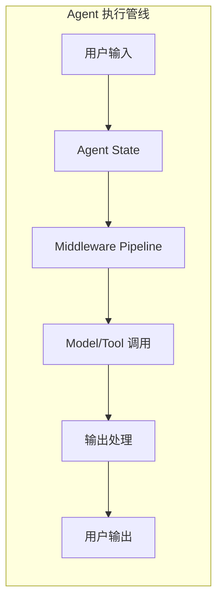

# 2.6 中间件系统

> 掌握 LangChain.js 的 Middleware 架构，学会使用内置中间件和自定义中间件来增强 Agent 能力

## 学习目标

- 理解 Middleware 架构设计（Hooks、State 传递、错误处理）
- 掌握所有内置 Middleware 的用法与配置
- 学会开发自定义中间件
- 掌握并发控制与速率限制策略

---

## 1. Middleware 架构设计

中间件是一种灵活的 Hook 系统，允许你在 Agent 执行流程的关键节点注入自定义逻辑。

### 1.1 执行流程



### 1.2 Hooks 类型

| Hook | 触发时机 | 用途 |
|------|---------|------|
| `beforeAgent` | Agent 执行前 | 初始化、鉴权 |
| `beforeModel` | 模型调用前 | 修改 State（注入系统消息、裁剪上下文） |
| `afterModel` | 模型调用后 | 检查输出、过滤敏感信息 |
| `afterAgent` | Agent 执行后 | 清理、统计 |
| `wrapModelCall` | 模型请求/响应 | 日志、监控、修改 Prompt |
| `wrapToolCall` | 工具请求/响应 | 审计、缓存、重试 |

### 1.3 基础中间件工厂

```typescript
import { createMiddleware } from "langchain";

const myMiddleware = createMiddleware({
  name: "LogMessages",
  beforeModel: (state) => {
    console.log("Model input:", state.messages);
  },
  afterModel: (state) => {
    console.log("Model output:", state.messages);
  },
});
```

**Hook 返回值说明**：

```typescript
// 不返回 → 不修改 State（只做副操作如日志）
beforeModel: (state) => {
  console.log("message count:", state.messages.length);
}

// 返回 Partial<State> → 合并到当前 State
beforeModel: (state) => {
  return { messages: [systemMsg, ...state.messages] };
}

// 返回 null → 阻塞 Agent 执行（用此方式快速返回）
beforeModel: (state) => {
  return null;  // 阻止模型调用
}
```

---

## 2. 内置 Middleware

LangChain.js 提供多个开箱即用的内置中间件：

### 2.1 summarizationMiddleware

自动管理上下文窗口，超过 Token 阈值时触发摘要压缩：

```typescript
import { createAgent, summarizationMiddleware } from "langchain";

const agent = createAgent({
  model: "openai:gpt-5.5",
  tools: [weatherTool],
  middleware: [
    summarizationMiddleware({
      model: "gpt-5.4-mini",         // 摘要模型
      trigger: { tokens: 6000 },     // 触发条件
      keep: { messages: 20 },        // 保留最新消息数
    }),
  ],
});
```

详细配置见 [2.5 记忆与状态管理](05-记忆与状态管理.md#43-策略二摘要压缩summarization)。

### 2.2 humanInTheLoopMiddleware

在关键决策点暂停执行，等待人工审批（适合审批场景如订单、转账）：

```typescript
import { humanInTheLoopMiddleware } from "langchain";

const agent = createAgent({
  model: "openai:gpt-5.5",
  tools: [transferTool, orderTool],
  middleware: [
    humanInTheLoopMiddleware({
      interruptOn: {
        transferTool: {
          allowedDecisions: ["approve", "edit", "reject"],
        },
        orderTool: false,  // 不审批
      },
    }),
  ],
});

// Agent 执行到 transfer 时会暂停，等待人工决策
const result = await agent.invoke({
  messages: [{ role: "user", content: "Transfer $500 to account 123" }],
});
```

### 2.3 modelRetryMiddleware

模型调用失败时自动重试：

```typescript
import { modelRetryMiddleware } from "langchain";

const agent = createAgent({
  model: "openai:gpt-5.5",
  tools: [],
  middleware: [
    modelRetryMiddleware(),
  ],
});
```

### 2.4 toolRetryMiddleware

工具执行失败时自动重试：

```typescript
import { toolRetryMiddleware } from "langchain";

const agent = createAgent({
  model: "openai:gpt-5.5",
  tools: [apiTool, dbTool],
  middleware: [
    toolRetryMiddleware({
      maxRetries: 2,
      retryDelay: 1000,     // 重试间隔（ms）
    }),
  ],
});
```

### 2.5 piiMiddleware

自动检测和脱敏个人身份信息（PII）：

```typescript
import { piiMiddleware } from "langchain";

const agent = createAgent({
  model: "openai:gpt-5.5",
  tools: [],
  middleware: [
    piiMiddleware([
      { name: "email", strategy: "redact", applyToInput: true },
      { name: "phone", strategy: "mask", applyToInput: true },
      { name: "credit_card", strategy: "redact", applyToInput: true },
      { name: "ssn", strategy: "block", applyToInput: true },
    ]),
  ],
});
```

| strategy | 行为 |
|----------|------|
| `redact` | 替换为 `[REDACTED]`（默认） |
| `mask` | 替换为 `***` |
| `block` | 返回错误阻止调用 |

### 2.6 todoListMiddleware

为 Agent 添加内部待办列表能力，帮助 Agent 管理复杂任务：

```typescript
import { todoListMiddleware } from "langchain";

const agent = createAgent({
  model: "openai:gpt-5.5",
  tools: [],
  middleware: [
    todoListMiddleware(),
  ],
});

// Todo 列表会出现在模型调用上下文中，Agent 可以动态更新和管理任务
```

### 2.7 modelCallLimitMiddleware

限制单次 Agent 调用中的模型请求次数（防止死循环）：

```typescript
import { modelCallLimitMiddleware } from "langchain";

const agent = createAgent({
  model: "openai:gpt-5.5",
  tools: [searchTool, apiTool],
  middleware: [
    modelCallLimitMiddleware({
      threadLimit: 10,         // 单线程最大调用次数
      runLimit: 5,             // 单次运行最大调用次数
      exitBehavior: "end",     // "end" | "error"
    }),
  ],
});
```

### 2.8 内置 Middleware 完整清单

| Middleware | 功能 | 配置参数 |
|-----------|------|---------|
| `summarizationMiddleware` | 自动摘要压缩 | `model`, `trigger`, `keep` |
| `humanInTheLoopMiddleware` | 人工审批 | `interruptOn`（工具名 → 决策列表映射） |
| `modelRetryMiddleware` | 模型重试 | 无参数 |
| `toolRetryMiddleware` | 工具重试 | `maxRetries`, `retryDelay` |
| `piiMiddleware` | PII 脱敏 | `{ name, strategy, applyToInput }[]` |
| `todoListMiddleware` | 待办列表 | 无需配置 |
| `modelCallLimitMiddleware` | 限流 | `threadLimit`, `runLimit`, `exitBehavior` |

---

## 3. 自定义 Middleware 开发

### 3.1 基本模式

```typescript
import { createMiddleware } from "langchain";

const loggingMiddleware = createMiddleware({
  name: "Logging",

  // 模型调用前
  beforeModel: (state) => {
    console.info(`[Model] Input messages: ${state.messages.length}`);
    console.info(`[Model] Token estimate: ${estimateTokens(state.messages)}`);
  },

  // 模型调用后
  afterModel: (state) => {
    const lastMsg = state.messages[state.messages.length - 1];
    if (lastMsg?.role === "assistant") {
      console.info(`[Model] Response: ${lastMsg.content?.slice(0, 100)}...`);
    }
  },

  // 工具调用拦截
  wrapToolCall: async (toolCall) => {
    console.info(`[Tool] Calling: ${toolCall.name}`, toolCall.args);
    const result = await toolCall();
    console.info(`[Tool] Result: ${JSON.stringify(result).slice(0, 200)}`);
    return result;
  },
});
```

### 3.2 上下文注入

在模型调用前注入系统消息：

```typescript
const injectContext = createMiddleware({
  name: "InjectContext",
  beforeModel: (state) => {
    const userContext = state.context?.userInfo;
    if (!userContext) return;

    return {
      messages: [
        {
          role: "system",
          content: `User info: Name=${userContext.name}, Role=${userContext.role}`,
        },
        ...state.messages,
      ],
    };
  },
});
```

> 💡 **跨文档提示**：Middleware 的 `beforeModel` Hook 是实现动态系统提示的推荐方式。详见 [2.2 模型与消息系统](02-模型与消息系统.md) 中的系统消息管理部分。

### 3.3 审计与日志中间件

```typescript
const auditMiddleware = createMiddleware({
  name: "Audit",
  beforeModel: (state) => {
    // 记录每次模型请求的完整上下文
    auditLog.info({
      type: "model_request",
      userId: state.context?.userId,
      messages: state.messages.map((m) => ({
        role: m.role,
        length: m.content?.length,
      })),
    });
  },
  wrapToolCall: async (toolCall) => {
    // 记录所有工具调用
    auditLog.info({
      type: "tool_call",
      userId: state.context?.userId,
      tool: toolCall.name,
      args: toolCall.args,
    });
    const result = await toolCall();
    auditLog.info({
      type: "tool_call_result",
      resultPreview: JSON.stringify(result).slice(0, 500),
    });
    return result;
  },
});
```

---

## 4. Middleware 组合与执行顺序

多个 Middleware 按注册顺序依次执行：

```typescript
createAgent({
  model: "openai:gpt-5.5",
  tools: [searchTool],
  middleware: [
    auditMiddleware,         // 第 1 个执行
    injectContext,           // 第 2 个执行
    modelRetryMiddleware,    // 第 3 个执行
    piiMiddleware,           // 第 4 个执行
  ],
});
```

**执行顺序示意**：

```
beforeModel: audit → injectContext → modelRetry → pii
    ↓
[模型调用]
    ↓
afterModel: pii → modelRetry → injectContext → audit
```

Hook 的"后执行"顺序与"前执行"相反（类似 Koa 的洋葱模型）。

---

## 5. 并发控制与速率限制

### 5.1 工具级别限流

```typescript
const rateLimitMiddleware = createMiddleware({
  name: "RateLimit",
  wrapToolCall: async (toolCall) => {
    const rateLimiter = rateLimitMap.get(toolCall.name);
    if (rateLimiter && !rateLimiter.allow()) {
      return `Rate limit exceeded for tool: ${toolCall.name}`;
    }
    return toolCall();
  },
});
```

### 5.2 全局 Token 预算

```typescript
const tokenBudgetMiddleware = createMiddleware({
  name: "TokenBudget",
  beforeModel: (state) => {
    const budget = getTokenBudget(state.context?.userId);
    const estimate = estimateTokens(state.messages);
    if (estimate > budget.remaining) {
      return `Token budget exceeded. Please try again later.`;
    }
  },
});
```

---

## 总结

**核心要点**：
1. **Middleware** 是 Hook 系统，支持 `beforeAgent`/`beforeModel`/`afterModel`/`afterAgent`/`wrapModelCall`/`wrapToolCall`
2. **内置 Middleware** 覆盖摘要、审批、重试、PII、限流等常见场景
3. **自定义 Middleware** 可注入上下文、审计日志、鉴权、缓存
4. **组合顺序**：`beforeModel` 正序执行，`afterModel` 逆序执行（洋葱模型）
5. 使用 `summarizationMiddleware` 解决上下文窗口溢出（详见 2.5）

**下一步**：
- 学习 [2.7 LangSmith 链路追踪](07-LangSmith链路追踪.md)，监控生产环境 Agent 行为
- 在 [实战项目 02：智能客服系统] 中综合运用 Middleware

---

*参考资料*：
- [LangChain.js Middleware Overview](https://docs.langchain.com/oss/javascript/langchain/middleware)
- [LangChain.js Built-in Middleware](https://docs.langchain.com/oss/javascript/langchain/middleware/built-in)
