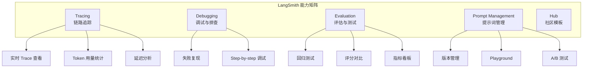
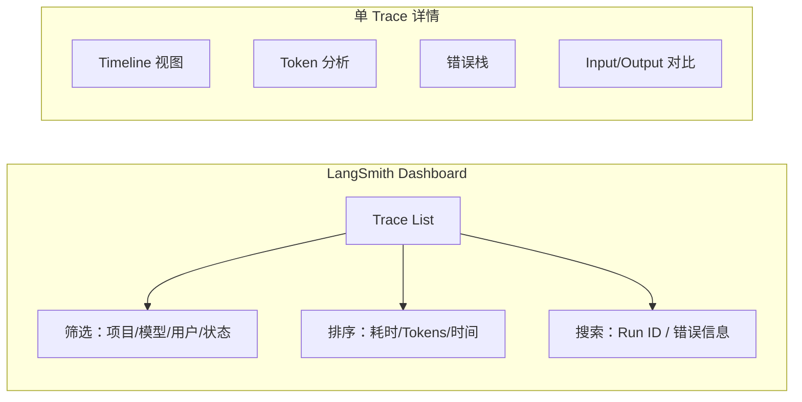
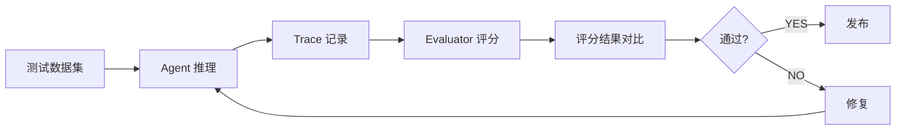

# 2.7 LangSmith 链路追踪

> 掌握 LangSmith 在生产环境中的可观测性能力：Tracing、Debugging、Evaluation、Prompt 管理

> **模块**：2.7 | **预计时间**：2h | **面试可答**：Tracing 零配置原理、Trace 结构分析、评估工作流、Prompt 版本管理、采样策略

## 学习目标

- 掌握 LangSmith Tracing 的快速集成与配置
- 学会通过 Trace 分析 Agent 执行链路
- 掌握基于 Trace 的调试与失败定位
- 了解 Evaluation 与回归测试工作流
- 理解 Prompt 版本管理与 Playground 使用

---

## 1. Tracing 概述

### 1.1 什么是 LangSmith

LangSmith 是 LangChain 官方的可观测性平台，提供：



### 1.2 快速集成

```bash
# 安装（Tracing 只需 langchain）
bun add langchain
# 如果需要程序化创建数据集/运行评估，再安装 langsmith
bun add langsmith

# 设置环境变量
export LANGSMITH_TRACING=true
export LANGSMITH_API_KEY=lsv2_sk_xxxx
export LANGSMITH_ENDPOINT=https://api.smith.langchain.com
```

环境变量说明：

| 变量 | 说明 | 是否必须 |
|------|------|---------|
| `LANGSMITH_TRACING` | 启用 Tracing（`true` / `false`） | 是 |
| `LANGSMITH_API_KEY` | LangSmith API Key | 是 |
| `LANGSMITH_PROJECT` | 项目名称，区分不同 Agent 项目 | 否（默认 `default`） |
| `LANGSMITH_ENDPOINT` | API 端点，自部署时需要 | 否 |

### 1.3 代码中的 Tracing

```typescript
import { createAgent, tool } from "langchain";

// Tracing 自动生效（环境变量已配）
// 项目名通过 LANGSMITH_PROJECT 环境变量设置
const agent = createAgent({
  model: "openai:gpt-5.4",
  tools: [weatherTool, searchTool],
  name: "customer-support",  // Agent 名称（调试标识，非 LangSmith 项目名）
});

// 每个 invoke 生成一个 Trace
const result = await agent.invoke({
  messages: [{ role: "user", content: "What's the weather in Tokyo?" }],
});
```

> **无需额外代码**：Tracing 在 `createAgent` 内部自动集成，只要设置了环境变量即可。

---

## 2. Trace 分析

### 2.1 Trace 结构

每次 `invoke()` 或 `stream()` 调用生成一条 Trace，结构如下：

```
Trace: customer-support [2026-06-29T10:30:00Z]
├── Run #1: ChatOpenAI (gpt-5.4)
│   ├── Input: "What's the weather in Tokyo?"
│   ├── Output: "I'll check the weather for you."
│   └── Token: 45 / 120 / 165 (prompt / completion / total)
├── Run #2: weatherTool
│   ├── Input: { city: "Tokyo" }
│   ├── Output: { temp: 28, humidity: 60% }
│   └── Duration: 320ms
├── Run #3: ChatOpenAI (gpt-5.4)
│   ├── Input: (message history + tool result)
│   ├── Output: "The weather in Tokyo is 28°C..."
│   └── Token: 210 / 85 / 295
└── Summary
    ├── Total duration: 1.2s
    ├── Total tokens: 460
    └── Total cost: $0.0032
```

### 2.2 关键指标看板



### 2.3 标记与搜索

```typescript
// 给 Trace 附加标签和元数据，方便后续检索
const result = await agent.invoke(
  {
    messages: [{ role: "user", content: "Book a flight to Paris" }],
  },
  {
    context: { userId: "user_123" },
    tags: ["booking", "production"],        // 标签
    metadata: {                              // 元数据
      userId: "user_123",
      sessionId: "session_456",
      env: "production",
    },
  }
);
```

在 LangSmith UI 中可按 `tags` 和 `metadata` 快速过滤 Trace。

---

## 3. 调试与失败定位

### 3.1 常见问题排查

| 问题 | Trace 中表现 | 排查方法 |
|------|-------------|---------|
| Model 输出格式错误 | Tool Call 解析失败 | 查看 Run 的 Raw Output |
| Tool 超时/崩溃 | Tool Run 标红 + Duration 极高 | 查看 Tool Error 信息 |
| Token 超出限制 | 返回 `400` 错误 | 查看 Prompt Tokens 是否超标 |
| Agent 死循环 | 模型调用次数异常多 | 查看 Timeline，模型重复调用同样工具 |
| PII 被阻断 | `piiMiddleware`（block 策略）拦截 | 查看 Middleware Run 的判定结果 |

### 3.2 失败 Trace 的复现与修复

```typescript
// 手动复现失败 Trace：
// 1. 打开失败的 Trace
// 2. 复制 Input Messages
// 3. 本地运行同样的 invoke
const result = await agent.invoke({
  messages: traceInputMessages,  // 从 Trace 复制
  tags: ["debug"],
});
```

> 注：LangSmith 没有一键 "Replay" 功能；如果需要基于历史输入批量重跑，可以使用评估（`evaluate`）或 Backtesting 能力，把 Trace 中的输入沉淀为数据集后重放。

### 3.3 基于 Trace 的调试工作流

```
1. LangSmith 发现失败 Trace
2. 查看错误信息（红色高亮 Run）
3. 进入该 Run 查看 Input/Output/Error Stack
4. 复制 Input，在本地用同样的输入复现
5. 本地修复代码
6. 发布后确认 Trace 变为绿色
```

---

## 4. 评估与回归测试

### 4.1 Evaluation Workflow



### 4.2 创建测试数据集

```typescript
import { Client } from "langsmith";

const client = new Client();

await client.createDataset("customer-support-test", {
  description: "Customer support evaluation dataset",
});

// JS SDK 的批量创建为「平行数组 + datasetId」形状（与 Python SDK 的对象数组 + dataset_name 写法不同）
await client.createExamples({
  inputs: [
    { messages: [{ role: "user", content: "What's my account balance?" }] },
    { messages: [{ role: "user", content: "Cancel my order #5678" }] },
  ],
  outputs: [
    { answer: "Your current balance is $1,234.56" },
    { answer: "I've canceled order #5678. The refund will be processed..." },
  ],
  datasetId: dataset.id,
});
```

> 你也可以直接在 [LangSmith UI](https://smith.langchain.com) 中创建数据集并手动添加示例。

数据集格式：

| Input | Reference Output |
|-------|-----------------|
| "What's my account balance?" | "Your current balance is $1,234.56" |
| "Cancel my order #5678" | "I've canceled order #5678. The refund will be processed..." |
| "What's the weather?" | "I'm sorry, I can only help with account-related questions." |

### 4.3 运行评估

```typescript
import { evaluate } from "langsmith/evaluation";

// evaluate(target, { data, evaluators, maxConcurrency })
const result = await evaluate(agent, {
  data: "customer-support-test",   // 数据集名称
  maxConcurrency: 5,
});

console.log(result.results);
// 包含每条 input 的输出、Trace 链接和 Evaluator 分数
```

> `evaluate` 的签名可能随 `langsmith` 包版本变化，请参考 [LangSmith JS SDK 文档](https://docs.smith.langchain.com/)。

### 4.4 内置 Evaluator

LangSmith 提供多种评估器：

| Evaluator | 测量内容 | 说明 |
|-----------|---------|------|
| Correctness | 正确性 | 与 Reference 精确对比 |
| Toxicity | 有害内容 | 检测输出是否含毒性 |
| Helpfulness | 有用性 | 基于 LLM 评分 |
| Conciseness | 简洁性 | 输出长度评分 |
| Custom | 自定义 | 用代码编写评分逻辑 |

```typescript
// 自定义 Evaluator：接收 (run, example)，run 是本次执行的 Trace 运行记录
const myEvaluator = async (run, example) => {
  const output = String(run.outputs?.answer ?? "");
  const reference = String(example?.outputs?.answer ?? "");
  const score = output.includes(reference) ? 1 : 0;
  return {
    key: "keyword_match",
    score,
    comment: score === 1
      ? "Reference keyword present"
      : "Missing reference keyword",
  };
};

// 传入 evaluate
await evaluate(agent, {
  data: "customer-support-test",
  evaluators: [myEvaluator],
  maxConcurrency: 5,
});
```

### 4.5 回归测试看板

在 LangSmith UI 中：
- **对比不同版本**的评估结果
- **设置阈值告警**（如 Pass Rate < 80% 自动通知）
- **历史趋势**：查看评分随版本的变化曲线

---

## 5. Prompt 版本管理

### 5.1 LangSmith Hub

LangSmith Hub 是 Prompt 模板的云端仓库，支持版本管理。在 LangSmith UI（Prompts 页面）中可以创建、编辑、查看 Prompt 的各个版本及 commit hash。

### 5.2 在代码中使用 Hub Prompt

```typescript
// Hub 的 pull API 位于 langchain 包的 hub 子路径导出（不存在独立的 @langchain/hub 包）
import { pull } from "langchain/hub";

// 拉取最新版
const systemPrompt = await pull("your-org/customer-support-prompt");

// 拉取指定版本（owner/repo:commitHash）
const v1 = await pull("your-org/customer-support-prompt:3a2f1b");

const agent = createAgent({
  model: "openai:gpt-5.4",
  systemPrompt,
  tools: [],
});
```

### 5.3 Prompt 版本化工作流

```
1. 在 LangSmith Playground 中编辑 Prompt
2. 测试后保存为新版本
3. 代码中引用 latest 或指定版本
4. 版本回滚：只需改为旧版本的 commit hash
5. A/B 测试：同时使用两个版本，对比评估结果
```

### 5.4 Playground

Playground 提供在线测试环境：

- 实时编辑 Prompt 并测试
- 对比不同模型/配置的结果
- 查看 Token 用量和响应时间
- 一键保存为 Hub 新版本

---

## 6. LangSmith 部署选项

| 模式 | 说明 | 适用场景 |
|------|------|---------|
| LangSmith Cloud | 托管 SaaS | 快速上手、小团队 |
| LangSmith Self-hosted | Docker 部署 | 数据合规、企业内网 |

自部署参考：[LangSmith Self-hosting Guide](https://docs.smith.langchain.com/self-hosting)

---

## 面试问答

> **问：LangSmith 的 Tracing 为什么能做到"零配置集成"？环境变量驱动的设计带来了哪些优势和局限？**
>
> 答：原理是 createAgent 内部在初始化时检查 process.env.LANGSMITH_TRACING 是否为 "true"，如果是则自动注册 Tracing 回调到 LangChain 的 Run Tree 体系中。所有模型调用、工具调用、中间件执行都被封装为 Run 节点，自动上报。优势：代码无侵入，只需设置环境变量即可启停，适合不同环境（开发/测试/生产）的切换。局限：环境变量是全局的；要对单个调用禁用 Tracing，可用 `traceable(fn, { tracingEnabled: false })` 包装函数来关闭该函数内的追踪（invoke config 上没有 tracingEnabled 选项）。

> **问：Trace 分析能发现哪些在测试环境中难以复现的生产问题？能否举一个具体的排查案例？**
>
> 答：典型问题：1）**Token 突发增长** — 生产流量下某类用户输入导致模型输出超长 Token，Trace 中能发现 output_tokens 异常高的具体输入模式；2）**工具超时毛刺** — 某个第三方 API 偶发超时，Trace 显示 Duration 从 200ms 跳到 30s；3）**Agent 死循环** — Trace 的模型调用次数异常多（正常 2-3 次，死循环 20+ 次），但每个调用看起来都正常，只有 Trace Timeline 能揭示循环模式。案例：生产中发现某些用户的 Trace 耗时从 2s 变为 60s，分析 Timeline 发现 Agent 连续调用了同一个搜索工具 15 次 — 原来是搜索结果不够精确导致模型反复尝试，通过调整工具 description 解决。

> **问：Evaluation 流程中，evaluate() 是如何将测试数据集映射到 Trace 的？如果 Agent 包含工具调用，评估数据集应该如何设计？**
>
> 答：`evaluate(agent, { data, evaluators })` 遍历数据集的每一行（inputs + reference outputs），用每个 input 调用 target（Agent）生成 Trace，然后运行注册的 Evaluator 比较输出和参考值。对于有工具调用的 Agent，数据集的设计应包含：1）inputs 是用户的自然语言请求；2）参考值不仅包括最终答案，还可包含中间步骤的预期工具调用（如预期调用的工具名和参数）。自定义 Evaluator 接收 (run, example)，可以通过解析 run 的输出和中间步骤（包含 messages 和 tool_calls）来验证工具调用是否符合预期。

> **问：LangSmith Hub 的 Prompt 版本化工作流中，如何在代码中安全地引用 Prompt 版本？"latest" 标签有什么风险？**
>
> 答：安全做法是使用**具体的 commit hash**（如 pull("org/prompt:3a2f1b")），确保部署的代码引用的是经过测试的特定版本。"latest" 标签始终指向最新版，如果有人在 Playground 中不慎修改了 Prompt，使用 latest 的部署会在下次重启时自动拉取新版本，可能导致生产行为意外变化。推荐工作流：开发环境用 latest，测试验证后锁定到特定 hash 再部署到生产，生产引用固定的 hash。

> **问：LangSmith 的 Trace 数据量在生产环境中往往很大，如何控制成本和保证关键 Trace 的覆盖率？有哪些采样策略？**
>
> 答：LangSmith 支持按比例采样：JS SDK 在 Client 配置中设置 `new Client({ tracingSamplingRate: 0.05 })`（0~1，如 0.05 表示 5%，采样在客户端发送前完成，可同时降低网络与存储成本）；对应环境变量名以官方 SDK 配置文档为准。常见策略：1）**按用户采样** — 核心用户 100% Tracing（单独实例/进程不设置采样率），普通用户 1%；2）**按错误采样** — 错误 Trace 100% 捕获（通过 afterAgent hook 或 fallback 机制单独上报）；3）**按标签采样** — 标记为 "debug" 或 "audit" 的调用 100% Tracing；4）**自适应采样** — 正常流量 1%，异常流量自动提升比例。关键原则：错误 Trace 必须 100% 捕获（成本低廉），正常 Trace 按业务重要性设定采样率，不要对所有流量做全量 Tracing。

---

## 7. 实战练习

> 目标：为 Agent 启用 LangSmith Tracing，并在 UI 中查看一次完整调用链路。

**要求**：
1. 在 `.env` 中配置 `LANGSMITH_TRACING=true`、`LANGSMITH_API_KEY` 和 `LANGSMITH_PROJECT=your-project`。
2. 创建一个带 `weatherTool` 的 Agent，模型用 `openai:gpt-5.4`。
3. 运行一次 `agent.invoke({ messages: [{ role: "user", content: "What's the weather in Tokyo?" }] })`。
4. 打开 LangSmith UI，找到对应 Trace，观察：模型调用 → 工具调用 → 最终回答的 Timeline。
5. 给 invoke 加上 `tags: ["weather"]` 和 `metadata: { city: "Tokyo" }`，再运行一次，验证 UI 中可按这些字段过滤。

**提示**：
- 若没看到 Trace，检查环境变量是否在进程启动前已加载。
- `tags` 和 `metadata` 放在 `agent.invoke` 的第二个参数（config）中，不是 input 对象。

**预期效果**：
- LangSmith UI 中能看到两条 Trace。
- 点击 Trace 后，Timeline 展示模型调用、工具调用、token 用量和耗时。
- 通过 `weather` tag 或 `city: Tokyo` metadata 能过滤出对应 Trace。

---

## 8. 对比：LangSmith vs 自建日志系统

| 特性 | 自建日志（ELK/ Grafana） | LangSmith |
|------|------------------------|-----------|
| Agent 语义理解 | 弱（纯文本日志） | 强（按 Run/Tool/Message 结构化） |
| Trace 可视化 | 需手动构建 | 开箱即用 Timeline |
| Prompt 版本管理 | 无 | Hub + Playground |
| 评估数据集 | 需自建 | 内置数据集 + Evaluator |
| 成本 | 基础设施成本 | 按 Trace 量计费 |

**一句话总结**：自建日志适合通用系统监控，LangSmith 专为 LLM Agent 设计，能直接回答“模型为什么这样回答”。

---

## 总结

**核心要点**：
1. **Tracing** 零配置集成（环境变量驱动），自动追踪每次 Agent 调用
2. **Trace 分析**：Timeline、Token 用量、耗时、错误定位
3. **调试**：失败 Trace 复制 Input 在本地复现（或沉淀为数据集用 evaluate 重放）
4. **评估**：使用数据集 + Evaluator 做回归测试（`evaluate(agent, { data, evaluators })`）
5. **Prompt 管理**：Hub + Playground 实现版本化、可追溯

**下一步**：
- 进入 [实战项目 02：智能客服系统]，综合运用 Phase 2 所有能力
- 回顾 [2.5 记忆与状态管理](05-记忆与状态管理.md) 和 [2.6 中间件系统](06-中间件系统.md)

---

*参考资料*：
- [LangChain.js Tracing](https://docs.langchain.com/oss/javascript/langchain/tracing)
- [LangSmith 文档](https://docs.smith.langchain.com/)
