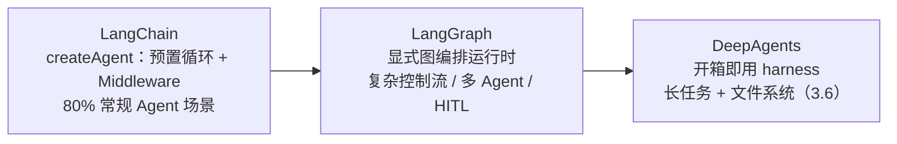

# 3.1 LangGraph 核心概念

> 把 Agent 拆成显式的节点、边与状态，获得完全可控的复杂工作流编排能力

> **模块**：3.1 | **预计时间**：3h | **面试可答**：State 与 reducer 原理、条件边 vs Command 两种路由、recursionLimit 防死循环、LangGraph 与 createAgent 的分工

## 学习目标

- 理解 LangGraph 的定位：为什么 `createAgent` 之外还需要显式图编排
- 掌握 `StateSchema` 定义状态与 reducer 归并机制
- 掌握节点（Node）设计原则与返回值约定
- 掌握条件路由的两种写法：`addConditionalEdges` 与 `Command`
- 掌握循环/递归结构与 `recursionLimit` 防失控

---

## 1. 为什么需要 LangGraph

第二阶段的 `createAgent` 是一条**预置的循环**（模型 → 工具 → 模型……），适合标准 Agent 任务。但它有三类做不到的事：

| 需求 | createAgent 的局限 | LangGraph 的答案 |
|------|------------------|----------------|
| 固定业务流程（先审核再执行，不能跳步） | 循环内只有 LLM 自己决定下一步 | 显式节点 + 显式边，控制流写在代码里 |
| 多角色协作（SQL Agent + 可视化 Agent + 报告 Agent） | 单一工具循环 | 多 Agent 编排（3.4） |
| 中途暂停等人审批、失败后从断点恢复 | 有限支持（Middleware） | `interrupt` + Checkpointer（3.2） |

三者的关系（对应 2.1 的 Model + Harness 分层）：



**选型一句话**：能用 `createAgent` + Middleware 解决就别上 LangGraph；一旦控制流需要「代码说了算」，就用 LangGraph 画图。

### 安装

`@langchain/langgraph` 当前为 **v1.x**，要求 Node.js ≥ 22（Bun 运行时直接支持；具体以 npm 页 [engines 字段](https://www.npmjs.com/package/@langchain/langgraph)为准）：

```bash
bun add @langchain/langgraph @langchain/core
```

> 💡 **示例模型字符串说明**：本章所有 `openai:gpt-5.4`、`anthropic:claude-sonnet-4-6` 等字符串仅示范 `provider:model` 格式，**不代表当期推荐模型**；实际选型以 [1.1 模型选型决策树](../01-AI-Agent基础与认知升级/01-AI-ML核心概念科普.md) 为准。
>
> 💡 **示例代码风格说明**：教学片段以可读性优先（双引号 + 分号），未套用本仓库的 oxfmt 工程风格（单引号、无分号）——不要把示例当成项目风格模板。

---

## 2. 第一个图：最小可运行示例

```typescript
// 最小自包含示例：两节点顺序图（依赖：bun add @langchain/langgraph）
import { StateGraph, StateSchema, START, END } from "@langchain/langgraph";
import * as z from "zod";

// 1. 定义状态 schema（详见第 3 节）
const State = new StateSchema({
  topic: z.string(),
  outline: z.string().optional(),
  draft: z.string().optional(),
});

// 2. 定义节点：入参是当前状态，返回「部分状态更新」
const genOutline = async (state: typeof State.State) => ({
  outline: `《${state.topic}》的三段式大纲`,
});

const genDraft = async (state: typeof State.State) => ({
  draft: `根据大纲「${state.outline}」写出的正文……`,
});

// 3. 组装图：节点 + 边
const graph = new StateGraph(State)
  .addNode("genOutline", genOutline)
  .addNode("genDraft", genDraft)
  .addEdge(START, "genOutline")
  .addEdge("genOutline", "genDraft")
  .addEdge("genDraft", END)
  .compile(); // StateGraph 只是蓝图，compile 后才能 invoke

// 4. 运行
const result = await graph.invoke({ topic: "LangGraph 入门" });
console.log(result.draft);
// "根据大纲《LangGraph 入门》的三段式大纲写出的正文……"
```

四个核心概念已经在这一例中出场：

| 概念 | 本例对应 | 职责 |
|------|---------|------|
| **State** | `StateSchema` | 所有节点共享的数据总线 |
| **Node** | `genOutline` / `genDraft` | 单一职责的处理函数 |
| **Edge** | `addEdge` | 固定跳转关系 |
| **Graph** | `new StateGraph(...).compile()` | 组装 + 编译成可运行实例 |

---

## 3. 状态（State）管理机制

State 是图的心脏：节点之间不直接调用，全部通过「读状态 → 返回更新」通信。

### 3.1 StateSchema 与 reducer

v1.1+ 推荐用 `StateSchema`（基于 Standard Schema，支持 Zod v4 / Valibot / ArkType）。**每个字段可以指定 reducer**——决定「节点返回的更新」如何与「已存的旧值」合并：

```typescript
import { StateSchema, ReducedValue, MessagesValue, UntrackedValue } from "@langchain/langgraph";
import * as z from "zod";

const AgentState = new StateSchema({
  // ① 无 reducer → last-value 语义：新值直接覆盖旧值
  currentStep: z.string(),

  // ② 内置消息字段：自带 append reducer（对话历史只会追加）
  messages: MessagesValue,

  // ③ 自定义 reducer：显式声明合并方式
  //    reducer(left, right)：left = 已存值，right = 本次节点更新
  allSteps: new ReducedValue(
    z.array(z.string()).default(() => []),
    { inputSchema: z.string(), reducer: (current, next) => [...current, next] }
  ),

  // ④ UntrackedValue：不写入 Checkpoint 的临时字段（适合缓存类数据）
  tempCache: new UntrackedValue(z.record(z.string(), z.unknown())),
});

type AgentStateType = typeof AgentState.State;   // 完整状态类型
type AgentUpdateType = typeof AgentState.Update; // 部分更新类型
```

reducer 的合并语义用伪代码表达就是：

```
const newValue = reducer(currentState[key], nodeUpdate[key])
```

- 不写 reducer：`newValue = nodeUpdate[key]`（覆盖）
- `allSteps` 的 reducer：`[...current, next]`（追加，多节点并行写也不会互相吞掉）

> ⚠️ **并行写入必须配 reducer**：多个节点在同一个 superstep 并行执行、同时更新同一个字段时，没有 reducer 会直接报 `InvalidUpdateError`。这是后面 3.2 并行执行（Send API）的前置条件。

### 3.2 旧写法：Annotation.Root（仍然兼容）

老教程大量使用 `Annotation.Root`，v1.x 中**继续可用**，reducer 语义一致：

```typescript
import { Annotation } from "@langchain/langgraph";

const LegacyState = Annotation.Root({
  messages: Annotation<BaseMessage[]>({
    reducer: (left, right) => left.concat(right),
    default: () => [],
  }),
  topic: Annotation<string>, // 无 reducer = 覆盖
});
```

新项目统一用 `StateSchema`；读第三方代码时能认出 `Annotation` 即可。

此外**纯 Zod 对象也可以直接传给 `new StateGraph(zodObject)`**——消息字段需挂 `@langchain/langgraph/zod` 的 `MessagesZodMeta` 元数据，让框架识别「这是带 append reducer 的消息列表」：

```typescript
import { MessagesZodMeta, registry } from "@langchain/langgraph/zod";
import { BaseMessage } from "@langchain/core/messages";

const ZodState = z.object({
  messages: z
    .array(z.custom<BaseMessage>())
    .register(registry, MessagesZodMeta), // 等价于 MessagesValue 的追加语义
  topic: z.string(), // 无元数据 = last-value 覆盖
});
```

本文统一用 `StateSchema` 讲解；三种写法（StateSchema / Annotation / 纯 Zod）的取舍见[官方 Graph API 文档](https://docs.langchain.com/oss/javascript/langgraph/use-graph-api)。

### 3.3 状态设计原则

官方方法论（Thinking in LangGraph）给出两条硬原则：

1. **状态存原始数据，prompt 在节点内按需拼装**——同一份原始数据可以被不同节点格式化成不同 prompt，改 prompt 模板不动 schema。
2. **能推导出来的不入状态**——避免派生数据不一致。

```typescript
// ✅ 状态存原始数据
const ReportState = new StateSchema({
  sqlResult: z.string().optional(),   // 原始查询结果
  chartConfig: z.string().optional(), // 原始图表配置
});

// ❌ 状态存格式化产物
const BadState = new StateSchema({
  formattedPrompt: z.string().optional(), // prompt 模板混进状态，无法复用
});
```

---

## 4. 节点（Node）设计

### 4.1 节点签名与返回值

```typescript
// 节点两种合法返回：
// A. Partial<State> —— 只更新状态，走普通边
const nodeA = async (state: typeof State.State) => ({
  currentStep: "done-A",
});

// B. Command —— 同时更新状态 + 决定路由（见第 6 节）
```

节点是普通函数（同步/异步均可），第二个参数是 `LangGraphRunnableConfig`，可拿 `thread_id`、向流式管道写自定义事件等（进阶用法见 3.2 / 3.7）。

### 4.2 设计原则

| 原则 | 理由 |
|------|------|
| **单一职责** | 一个节点做一件事，失败可独立重试、独立重放 |
| **无状态** | 所有数据经 State 传递，节点本身不存可变全局量 |
| **幂等** | 节点可能被重试/恢复后重跑（3.2 的 interrupt 恢复机制），副作用必须幂等 |
| **可测试** | 纯函数式签名 `(state) => update`，单测只需构造 state |

**节点粒度权衡**：Checkpointer 在**节点边界**做快照（3.2）。节点越大，失败重跑的代价越高；节点越细，可观测性与重试粒度越好。外部 API 调用（查库、发邮件）建议独立成节点，便于单独配重试策略（3.7）。

---

## 5. 条件路由与分支逻辑

固定边 `addEdge` 只能走死路线；分支靠两种机制。

### 5.1 写法 A：条件边 addConditionalEdges

router 函数读状态，返回**下一个节点名**（或 `END`）：

```typescript
import { StateGraph, START, END } from "@langchain/langgraph";

// router：返回值就是要去的节点名
const routeAfterAgent = (state: typeof State.State) => {
  const lastMsg = state.messages.at(-1);
  return lastMsg?.tool_calls?.length ? "tools" : END;
};

const graph = new StateGraph(AgentState)
  .addNode("agent", callModel)
  .addNode("tools", toolNode)
  .addEdge(START, "agent")
  .addConditionalEdges("agent", routeAfterAgent, ["tools", END]) // 第三参可省略
  .addEdge("tools", "agent") // 工具结果回流给模型 → 形成循环
  .compile();
```

这就是经典的 ReAct 循环：`agent → (条件边) → tools → agent → … → END`。

### 5.2 写法 B：节点内返回 Command

路由决策和状态更新写在**同一个节点里**，适合「决策本身就是节点业务」的场景：

```typescript
import { Command } from "@langchain/langgraph";

// 示意片段：此处 State 需含 emailContent 与 intent 字段
// （如 const State = new StateSchema({ emailContent: z.string(), intent: z.string().optional() })）
const classifyIntent = async (state: typeof State.State) => {
  const intent = await classify(state.emailContent); // LLM 结构化分类
  return new Command({
    update: { intent },               // 更新状态
    goto: intent === "bug" ? "bugTrack" : "draftReply", // 决定路由
  });
};

// 用 Command 的节点必须声明所有可能的出口（ends）
const graph = new StateGraph(State)
  .addNode("classifyIntent", classifyIntent, { ends: ["bugTrack", "draftReply"] })
  .compile();
```

### 5.3 两种写法怎么选

| 维度 | addConditionalEdges | Command |
|------|--------------------|---------|
| 路由与更新分离 | 分离：router 只读状态 | 合一：节点内一起做 |
| 典型场景 | 通用分支（如「有 tool_calls 吗」） | 决策逻辑复杂、需要先更新再跳转 |
| 声明出口 | 第三参（可省略） | 必须传 `ends` |
| 与 1.2 的 ReAct 对应 | 经典写法 | 工具内 handoff（3.4） |

一个图可以混用两种写法：简单分支用条件边，业务决策点用 `Command`。

---

## 6. 循环与递归控制

### 6.1 环（Cycle）

LangGraph 允许边构成环（5.1 的 ReAct 就是一个环）。环 + 状态 = 迭代优化能力（3.3 的 Agentic RAG、自我反思都靠它）。

### 6.2 recursionLimit：必须给环上保险

无界环会跑飞。LangGraph 以 **superstep**（一轮并行节点执行）为单位计数，默认上限 25：

```typescript
import { GraphRecursionError } from "@langchain/langgraph";

try {
  await graph.invoke(input, { recursionLimit: 50 }); // 按需调大
} catch (e) {
  if (e instanceof GraphRecursionError) {
    // 达到步数上限：降级输出或人工介入
  }
  throw e;
}
```

实践约定：

1. 任何含环的图，**要么有自然终止条件**（模型不再发 tool_calls），**要么在状态里放计数器**（如 `retryCount` 配合 reducer 自增），达到阈值强制 `goto` 降级节点。
2. `recursionLimit` 是最后防线，不是业务逻辑——别靠它来「正常结束」。

### 6.3 递归结构：子图

图可以嵌套图（子图作为节点），这是模块化复杂业务的标准手段，完整机制（状态共享、`Command.PARENT`、独立 checkpointer）见 3.2。

---

## 7. 运行方式：invoke 与 stream

```typescript
// 一次性运行：返回最终状态
const final = await graph.invoke({ topic: "LangGraph 入门" });

// 流式运行：streamMode: "updates" 每个节点执行完吐一次增量
for await (const chunk of await graph.stream(input, { streamMode: "updates" })) {
  for (const [nodeName, update] of Object.entries(chunk)) {
    console.log(`节点 ${nodeName} 更新:`, update);
  }
}
```

常用 streamMode 一览（完整清单与 `streamEvents` 新 API 见 3.2）：

| 模式 | 吐什么 | 典型用途 |
|------|--------|---------|
| `values` | 每步之后的**全量**状态 | 调试、快照 |
| `updates` | 每步的**增量**更新 | 进度展示（按节点） |
| `messages` | LLM 的 token 块（`[messageChunk, metadata]` 二元组） | 打字机效果 |

---

## 面试问答

> **问：LangGraph 中 State 的 reducer 是什么？没有 reducer 的字段和有 reducer 的字段在多节点并行写入时分别会发生什么？**
>
> 答：reducer 是字段的归并函数，签名 `reducer(left, right)`，left 是状态里已存的旧值，right 是节点本次返回的更新，返回值作为新的字段值。没有 reducer 的字段是 last-value 语义，直接用新值覆盖旧值；多个节点在同一个 superstep 并行更新同一字段时，没有 reducer 会抛 `InvalidUpdateError`，有 reducer（如数组 concat、MessagesValue 的追加）则按归并顺序合并成功。所以「会被并行写入的字段必须声明 reducer」是设计状态 schema 的硬规则。

> **问：addConditionalEdges 和 Command 两种路由方式如何选择？各有什么约束？**
>
> 答：条件边把路由抽成独立的 router 函数，只读状态返回下一节点名（或 END），适合通用分支判断（如判断消息里有没有 tool_calls），节点声明处可以省略可能出口。Command 把状态更新和路由合并进节点返回值（`new Command({ update, goto })`），适合「先拿到决策结果、写入状态、再决定去哪」的业务决策点，约束是 addNode 时必须用 `ends` 声明全部可能出口，否则运行时报错。两者可以在同一张图混用：简单分支用条件边，复杂决策点用 Command。

> **问：LangGraph 里「循环」怎么实现？如何防止 Agent 陷入死循环？**
>
> 答：把后继节点指回前置节点就形成环，比如 ReAct 循环 agent → tools → agent。防失控有三层：第一层是自然终止条件（模型不再产生工具调用时条件边走向 END）；第二层是业务计数器，在状态里放 retryCount 之类的字段配合 reducer 自增，超过阈值用 Command goto 到降级节点；第三层是运行时兜底 recursionLimit（默认 25 个 superstep），超出抛 `GraphRecursionError`，可以在 catch 里降级处理。原则是第三层只是保险丝，不能当正常退出逻辑用。

> **问：createAgent（LangChain v1）和直接写 StateGraph 各适合什么场景？**
>
> 答：createAgent 是预置的「模型-工具」循环加 Middleware 扩展点，适合单角色、标准工具调用的 Agent，开发成本最低。StateGraph 适合三类场景：一是控制流需要代码说了算（固定审批流、多阶段流水线）；二是多角色协作（Supervisor 编排多个子 Agent）；三是需要 interrupt 人工介入、断点恢复等 LangGraph 原语。官方建议的升级路径是：能用 createAgent + Middleware 就不写图；图的复杂度失控时再考虑 DeepAgents 这类 harness（提供文件系统、子代理等开箱能力）。

> **问：为什么 LangGraph 的节点要求幂等？什么场景下节点会被重复执行？**
>
> 答：两个场景会重跑节点：一是配了 retryPolicy 的节点在瞬时失败后自动重试；二是 interrupt 恢复机制——恢复时该节点从头重新执行，interrupt() 之前的代码会再跑一遍。所以副作用（发邮件、写库、调外部 API）要么放在 interrupt 之后的代码段，要么用幂等键（如业务 ID 去重）保证重复执行不产生重复效果。「interrupt 前代码必须无副作用或幂等」是 HITL 开发最常见的坑。

---

## 8. 实战练习

> 目标：亲手组装一个带分支与环的最小工作流，验证 reducer 与 recursionLimit 行为。

**要求**：
1. 用 `StateSchema` 定义一个包含 `messages: MessagesValue` 和 `revisions`（自定义 reducer 追加数字）的图。
2. 实现三个节点：`draft`（产出草稿，把修订次数写入 `revisions`）、`critique`（检查草稿是否包含「总结」二字）、`polish`（修订草稿）。`critique` 后用条件边路由：不合格回 `polish` 再回 `critique`，合格走 `END`。
3. 把「总结」从草稿里去掉，故意让它循环：验证 `GraphRecursionError` 触发；再给 `revisions` 加阈值逻辑，超过 3 次强制走 `END`。

**提示**：
- `critique` 返回的更新里记得用 reducer 自增 `revisions`；判断阈值时直接读 `state.revisions.length`。
- `recursionLimit` 也可以用 `{ recursionLimit: 5 }` 传给 invoke 来快速触发。

**预期效果**：
- 合格路径一次通过；不合格路径循环后要么被业务阈值截断、要么抛 `GraphRecursionError`。
- `streamMode: "updates"` 下能清楚看到每个节点每次的增量。

---

## 9. 对比：LangGraph vs createAgent vs 手写循环

| 维度 | LangGraph StateGraph | createAgent（LangChain v1） | 手写 while 循环 |
|------|---------------------|----------------------------|----------------|
| 控制流 | 显式图，代码可审 | 预置循环，LLM 主导 | 完全自由但要自己管所有细节 |
| 状态管理 | reducer + channel，框架管并发归并 | messages 为主 | 自己维护任意结构 |
| 断点恢复 | Checkpointer 原生支持 | 传 checkpointer 即得（2.5） | 自己实现 |
| 人工介入 | `interrupt()` 原语 | humanInTheLoopMiddleware | 自己造轮子 |
| 并行 | superstep + Send | 无 | Promise.all 自己管 |
| 适用 | 复杂工作流 / 多 Agent | 常规单 Agent | 极端定制、学习原理 |

**一句话总结**：手写循环是「自由但重复造轮子」，createAgent 是「省事但控制流交给模型」，LangGraph 用适度的图结构约束换来可靠性、可恢复性与可观测性——复杂业务工作流的正确抽象层级。

---

## 总结

**核心要点**：
1. **State 是图的心脏**：`StateSchema` 定义字段与 reducer；并行写入的字段必须有 reducer；状态存原始数据，prompt 在节点内现拼
2. **节点是纯函数**：`(state) => Partial<State> | Command`；单一职责、无状态、幂等
3. **路由两种写法**：条件边（router 只读）与 `Command`（更新+路由合一，需声明 `ends`）
4. **环要上双保险**：业务计数器 + `recursionLimit` 兜底
5. **运行**：`compile()` 后才能 `invoke` / `stream`；`updates` 模式按节点吐增量

**下一步**：
- 学习 [3.2 LangGraph 高级模式](02-LangGraph高级模式.md)：interrupt 人机协作、子图嵌套、Send 并行、检查点持久化
- 学完后跑 [3.3 Agentic RAG](03-AgenticRAG实现.md)，把环用在做自我纠错的检索系统上

---

*参考资料*：
- [LangGraph.js 概念总览](https://docs.langchain.com/oss/javascript/langgraph/overview)
- [Graph API：状态、节点与边](https://docs.langchain.com/oss/javascript/langgraph/use-graph-api)
- [Thinking in LangGraph（官方方法论）](https://docs.langchain.com/oss/javascript/langgraph/thinking-in-langgraph)
- [LangGraph.js 发布日志（StateSchema 等新 API）](https://docs.langchain.com/oss/javascript/releases/changelog)
- [API 参考：StateGraph / Command](https://reference.langchain.com/javascript/langchain-langgraph)
