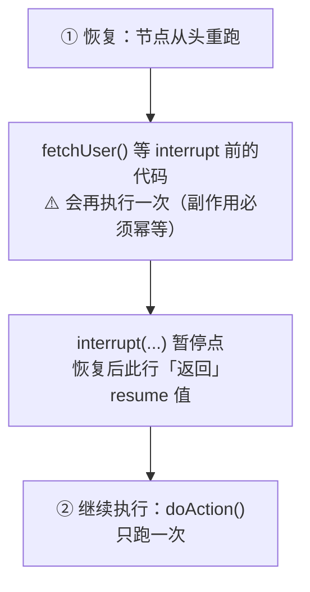

# 3.2 LangGraph 高级模式

> 人机协作、子图模块化、并行执行与状态持久化——把图从「能跑」带到「生产可用」

> **模块**：3.2 | **预计时间**：3.5h | **面试可答**：interrupt 恢复机制与重跑规则、子图状态共享与 checkpointer 三模式、Send map-reduce、durability 模式

## 学习目标

- 掌握 `interrupt()` 人机协作模式与 `Command({ resume })` 恢复流程
- 掌握子图嵌套的两种接法与持久化选项
- 掌握 Send API 的 map-reduce 并行模式
- 理解 Checkpointer 在原生图中的语义与 durability 配置
- 掌握进阶流式：多 streamMode 与 `streamEvents`

---

## 1. 人机协作（Human-in-the-Loop）

### 1.1 核心机制：interrupt + Command resume

`interrupt()` 让图**当场暂停**：状态存入 Checkpointer、进程可以退出，人工处理后再从断点恢复。这是 LangGraph 层的原语，与 2.6 的 `humanInTheLoopMiddleware`（createAgent 层的封装）是同一个底层机制的两层暴露。

```typescript
// 伪代码强度说明：工具执行为示意，approve 流程完整可跑
// 依赖：bun add @langchain/langgraph @langchain/anthropic
import { StateGraph, StateSchema, START, END, MemorySaver,
         interrupt, Command } from "@langchain/langgraph";
import * as z from "zod";

const State = new StateSchema({
  action: z.string(),
  approved: z.boolean().optional(),
});

const sensitiveAction = async (state: typeof State.State) => {
  // interrupt 之前的代码在恢复后会【重新执行】→ 这之前不要放副作用
  const decision = interrupt({
    question: "即将执行敏感操作，请审批",
    action: state.action,
  });
  // 恢复后，interrupt() 的返回值就是人工提交的 resume 数据
  return { approved: decision.approved };
};

const execute = async (state: typeof State.State) => {
  if (!state.approved) return { action: `${state.action}（已拒绝）` };
  return { action: `${state.action}（已执行）` };
};

const graph = new StateGraph(State)
  .addNode("sensitiveAction", sensitiveAction)
  .addNode("execute", execute)
  .addEdge(START, "sensitiveAction")
  .addEdge("sensitiveAction", "execute")
  .addEdge("execute", END)
  .compile({ checkpointer: new MemorySaver() }); // interrupt 的硬性前提

const config = { configurable: { thread_id: "ops-1" } };

// 第一次 invoke：跑到 interrupt 暂停
const r1 = await graph.invoke({ action: "删除生产表 test_users" }, config);
console.log(r1.__interrupt__[0].value);
// { question: "即将执行敏感操作，请审批", action: "删除生产表 test_users" }

// 人工审批后：同一 thread_id 用 Command({ resume }) 恢复
const r2 = await graph.invoke(new Command({ resume: { approved: true } }), config);
console.log(r2.action); // "删除生产表 test_users（已执行）"
```

**三个硬性前提**：

1. `compile({ checkpointer })`——暂停/恢复全靠 Checkpointer 存状态
2. invoke 时传 `configurable.thread_id`
3. interrupt 的 payload 必须可 JSON 序列化（要给前端/审批系统展示）

### 1.2 恢复语义：节点从头重跑

恢复时，**包含 interrupt 的节点会整体重新执行**，interrupt() 之前的代码会再跑一遍：



由此推出两条纪律：

1. **interrupt() 尽量放节点第一行**；其前只能放幂等操作
2. **不要 try/catch 包住 interrupt()**（它靠抛特殊错误实现暂停，catch 会吞掉）；同一节点内多个 interrupt 的顺序不要动态变化

### 1.3 与 2.6 humanInTheLoopMiddleware 的关系

| 层级 | API | 适合 |
|------|-----|------|
| createAgent 层 | `humanInTheLoopMiddleware({ interruptOn: {...} })` | 标准「工具调用审批」，声明式配置 |
| LangGraph 层 | `interrupt()` + `Command({ resume })` | 自定义审批 UI、业务级暂停点（如「草稿确认」） |

用 `createAgent` 就优先 Middleware；自己画图才用裸 `interrupt()`。二者最终都落到 Checkpointer + thread_id。

---

## 2. 子图嵌套与模块化

子图 = 把一张编译好的图当作父图的一个节点，是「分而治之」复杂流程的标准手段（例如数据分析助手里把「NL2SQL」整体封装成子图）。

### 2.1 模式 A：父子共享同名 state key

子图与父图有**同名状态字段**（最典型是 `messages`）时，编译后的子图直接 `addNode`，状态自动对接：

```typescript
// 子图与父图共享 messages 字段（StateSchema 各自定义，但 key 同名）
const subgraph = subBuilder.compile();
const parent = new StateGraph(ParentState)
  .addNode("researchTeam", subgraph) // 共享 key 直接挂载
  .compile();
```

父图调用该节点时，同名 channel 的值流入子图，子图产出的更新按 reducer 合并回父图。

### 2.2 模式 B：schema 不同 → 节点内手动转换

字段对不上时，用普通节点函数包一层转换：

```typescript
const parent = new StateGraph(ParentState)
  .addNode("runSub", async (state) => {
    const out = await subgraph.invoke({ query: state.question }); // 父 → 子
    return { answer: out.result };                                // 子 → 父
  })
  .compile();
```

这种写法同时是「上下文隔离」工具：子图只拿到你显式传的字段（3.4 会再用到）。

### 2.3 子图的 checkpointer 三模式

| 配置 | 语义 | 何时用 |
|------|------|--------|
| 省略（默认） | per-invocation：继承父 checkpointer，本次运行内持久，支持 interrupt | 绝大多数场景 |
| `checkpointer: true` | per-thread：跨调用累积自己的状态 | 子图需要独立记忆 |
| `checkpointer: false` | stateless：每次全新运行 | 纯函数式子任务 |

前提：父图必须已配置 checkpointer。**经验法则**：先都用默认；只在子图需要跨调用记忆或彻底无状态时才显式设置。

### 2.4 从子图跳到父图：Command.PARENT

子图节点里可以跨层路由——跳到父图的某个节点：

```typescript
import { Command } from "@langchain/langgraph";

// 子图节点内
return new Command({
  goto: "humanReview",     // 父图节点名
  graph: Command.PARENT,   // 声明跳转目标在父图
  update: { escalations: 1 },
});
```

这是 3.4 多 Agent handoff（swarm 切换 Agent）的底层机制。

### 2.5 观察子图：subgraphs 流式

```typescript
// chunk 变为 [namespace 数组, 更新] 二元组
for await (const [namespace, update] of await graph.stream(input, {
  streamMode: "updates",
  subgraphs: true,
})) {
  console.log(namespace.join(" > "), update); // 如 ["researchTeam", {...}]
}
```

---

## 3. 并行执行与异步处理

### 3.1 静态并行分支

同一个 superstep 内，多个节点可同时执行：只要一个节点之后「分叉」出多条边，它们在下一 superstep 并行跑，全部完成后再汇合：

```typescript
const graph = new StateGraph(State)
  .addNode("genSql", genSql)
  .addNode("genChart", genChart)   // ┐
  .addNode("genSummary", genSummary) // ├─ 二者并行
  .addEdge("genSql", "genChart")
  .addEdge("genSql", "genSummary")
  .addEdge("genChart", "merge")
  .addEdge("genSummary", "merge")
  .compile();
// genChart 与 genSummary 并行；共同写 chart/summary 之外的字段需 reducer（3.1）
```

### 3.2 动态并行：Send API（map-reduce）

分支数量**运行时才知道**（比如「给每个数据列生成一段描述」）时，用 `Send` 在条件边里动态 fan-out，每个 Send 携带独立的子状态：

```typescript
import { Send } from "@langchain/langgraph";

const State = new StateSchema({
  columns: z.array(z.string()),
  descriptions: new ReducedValue(
    z.array(z.object({ column: z.string(), text: z.string() })).default(() => []),
    { inputSchema: z.object({ column: z.string(), text: z.string() }),
      reducer: (cur, next) => [...cur, next] } // 并行结果靠 reducer 汇总
  ),
});

// 条件边 router 返回 Send 数组 → 每个 Send 独立调用一次目标节点
const fanOut = (state: typeof State.State) =>
  state.columns.map((column) => new Send("describeColumn", { column }));

const graph = new StateGraph(State)
  .addNode("describeColumn", async ({ column }) => ({
    descriptions: [{ column, text: `${column} 列的统计描述……` }],
  }))
  .addEdge(START, "split")
  .addConditionalEdges("split", fanOut) // fan-out
  .addEdge("describeColumn", "merge")   // 全部完成后汇合（reduce）
  .addNode("merge", ({ descriptions }) => {
    console.log(`共汇总 ${descriptions.length} 段描述`);
    return {};
  })
  .compile();
```

要点：

- **Send 的子状态可以与主图 schema 不同**——目标节点只拿到 Send 传入的对象
- **汇总必须靠 reducer**（3.1 的并行写入规则在这里成为主战场）
- Send 可带第三个参数覆盖目标节点超时（配合 3.7 的容错；⚠️ 动态超时需 `@langchain/langgraph >= 1.4.0`）

### 3.3 异步节点

节点函数直接写 `async` 即可，同一 superstep 内多个异步节点并发执行，LangGraph 不阻塞事件循环。I/O 密集节点（检索、查库、调 LLM）一律 async；CPU 密集任务建议扔给 Worker/沙箱，别堵住图的主线程。

---

## 4. 检查点与状态持久化

2.5 已讲过 Checkpointer 的选型（MemorySaver/PostgresSaver）、thread 隔离与时间旅行——**本节只补原生图视角的差异点**，选型细节见 [2.5 记忆与状态管理](../02-LangChain.js生态深度掌握/05-记忆与状态管理.md)。

### 4.1 原生图的接法

```typescript
import { MemorySaver } from "@langchain/langgraph";

const graph = builder.compile({
  checkpointer: new MemorySaver(), // 生产换 PostgresSaver（见 2.5）
  // store: myStore,              // 跨 thread 长期记忆（2.5 的 Store）
});

const config = { configurable: { thread_id: "analysis-42" } };
await graph.invoke(input, config);   // 每个节点边界自动落一个 checkpoint
```

与 2.5 的 createAgent 用法唯一区别：createAgent 传参 `checkpointer`，这里是 `compile({ checkpointer })`，语义完全一致——`thread_id` 是状态主键，同 thread 自动恢复。

### 4.2 状态快照 API

调试与恢复的三大件：

```typescript
// ① 读当前快照：values / next（待执行节点）/ tasks / createdAt
const snap = await graph.getState(config);
console.log(snap.values, snap.next);

// ② 读全部历史 checkpoint（时间旅行的坐标表）
for await (const cp of graph.getStateHistory(config)) {
  console.log(cp.config.configurable?.checkpoint_id, cp.metadata?.step);
}

// ③ 手动改状态（asNode 指定以哪个节点的名义写入）
await graph.updateState(config, { approved: true }, "sensitiveAction");
```

### 4.3 durability：checkpoint 写入时机

| 模式 | 行为 | 取舍 |
|------|------|------|
| `"async"`（默认） | 后台写，不阻塞执行 | 性能最好；崩溃时可能丢最后几步 |
| `"sync"` | 每步写完才继续 | 最稳，吞吐下降 |
| `"exit"` | 只在整次运行结束时写 | 最快；中断后只能从头跑 |

```typescript
const graph = builder.compile({
  checkpointer,
  // durability: "sync",
});
// 也可在单次调用时覆盖：graph.invoke(input, { durability: "exit" })
```

> 💡 **生产建议**：默认 `async` 已覆盖绝大多数场景；金融级流程（每一步都不能丢）用 `sync`；纯只读分析图用 `exit`。

---

## 5. 流式进阶

### 5.1 多模式并行订阅

`streamMode` 可以传数组，chunk 变成 `[mode, data]`：

```typescript
for await (const [mode, data] of await graph.stream(input, {
  streamMode: ["updates", "messages"],
})) {
  if (mode === "updates") renderNodeProgress(data);
  if (mode === "messages") renderToken(data[0]); // [messageChunk, metadata]
}
```

常用模式：`values` / `updates` / `messages` / `custom`（节点内 `config.writer({...})` 自定义事件）/ `tools`（工具生命周期）；另有 `checkpoints` / `tasks` / `debug` 等运行时观测模式，用于快照与任务调度级调试。

### 5.2 streamEvents：v1.2+ 推荐的事件流

新应用官方推荐 event streaming——一次订阅拿到消息、状态、中断的结构化投影：

```typescript
const stream = await graph.streamEvents(input, { version: "v3" });

for await (const event of stream.messages) renderToken(event);
if (stream.interrupted) {
  // 命中 interrupt：取 stream.interrupts 展示审批 UI，
  // 人工决策后 new Command({ resume }) 重入
}
const finalOutput = await stream.output;
```

HITL 循环（「流式展示 → 暂停 → 审批 → 恢复」）用这一套写最顺。

---

## 面试问答

> **问：interrupt 恢复后为什么会「重跑节点」？这个语义对写节点代码有什么要求？**
>
> 答：interrupt 通过抛出一个特殊的暂停信号实现，框架捕获后把当前状态存进 Checkpointer 并停止执行；恢复时框架从最近的 checkpoint 重新进入该节点，节点内 interrupt() 之前的代码会再执行一遍，interrupt() 这一行返回 resume 时提交的数据后继续往下跑。因此要求：interrupt() 尽量放节点开头，之前的代码只能有幂等副作用（或没有副作用）；不能用 try/catch 包 interrupt（会吞掉暂停信号）；同一节点内多个 interrupt 的相对顺序必须固定。常见反例是把「调用支付接口」写在 interrupt 之前，恢复后造成重复扣款。

> **问：子图和父图如何共享状态？如果我想隔离子图上下文应该怎么做？**
>
> 答：共享靠同名 state key——子图和父图 schema 里有相同字段（典型如 messages）时，编译后的子图可以直接 addNode 挂载，同名 channel 自动对接，子图的更新按父图 reducer 合并。隔离有两种做法：一是用普通节点函数包一层，invoke 子图时只显式传需要的字段、返回时只取需要的字段（schema 转换）；二是给子图设计不同的 state key（如子图私有 xxx_messages）再在包装函数里转换。多 Agent 系统里「子 Agent 只看自己该看的上下文」靠的就是这层转换（详见 3.4 上下文隔离策略）。

> **问：Send API 解决什么问题？它和静态并行分支的区别是什么？**
>
> 答：静态并行分支是编译期固定的分叉（一个节点后接多条边），适合并行任务数量固定的场景；Send 是运行时动态 fan-out——条件边 router 读状态后返回 `Send[]`，每个 Send 指定目标节点和独立子状态，并行实例数量由数据决定（如按查询结果的每一行各跑一次）。Send 返回的结果通过 reducer 汇总回主图状态。注意两点：每个 Send 携带的子状态可以和主图 schema 不同；汇合字段的 reducer 是并行汇总能成立的前提。

> **问：LangGraph 的 durability 三种模式如何权衡？默认模式是什么，为什么这么设计？**
>
> 答：async（默认）后台异步写 checkpoint，不阻塞图执行，性能最好，代价是进程崩溃时可能丢失最后若干步的 checkpoint；sync 每个节点边界写完 checkpoint 才继续，最可靠但吞吐下降；exit 只在整次运行结束时写一次，最快但中断后无法从中间恢复。默认 async 是因为绝大多数场景（对话、分析）丢最后几步可接受，而 checkpoint 频率对可观测性和恢复粒度的收益已经足够大；只有资金操作类强一致流程才需要升到 sync。

> **问：为什么 swarm/handoff 多 Agent 系统必须配 checkpointer 才能多轮对话？**
>
> 答：swarm 模式下「当前活跃 Agent」是图状态的一部分（activeAgent 字段），每轮对话结束后由 checkpoint 保存；下一轮用户消息进来时要先从 checkpoint 恢复状态才知道该把消息交给谁。没有 checkpointer 时每次 invoke 都从 defaultActiveAgent 重新开始，上一轮的对话历史和活跃 Agent 全部丢失，表现为「Agent 失忆、总是回到初始 Agent」。这也是所有多 Agent 系统的通用规律：跨调用的任何「记忆」都要落在 checkpointer/store 上。

---

## 6. 实战练习

> 目标：组合 interrupt、子图与 Send 三个原语，做一个「报表发布审批」工作流。

**要求**：
1. **子图** `chartTeam`：输入报表主题，内部用 Send 给 3 个图表节点（`table` / `bar` / `line`）并行生成配置，经 reducer 汇总到 `charts` 数组。
2. **父图**：`runChartTeam`（挂载子图）→ `review`（用 `interrupt` 把 charts 交给「审批人」）→ `publish` / `revise`。
3. 用 `MemorySaver` + 固定 `thread_id` 跑通：第一次 invoke 停在 review；用 `Command({ resume: { approved: false, feedback: "柱状图配色改一下" } })` 恢复走 `revise`；再 resume 一次 `approved: true` 走 `publish`。
4. 用 `streamMode: ["updates"]` + `subgraphs: true` 观察子图内部的并行节点事件。

**提示**：
- `charts` 字段必须配 reducer（Send 并行汇合），否则会 `InvalidUpdateError`。
- `review` 节点里 `interrupt()` 放第一行；恢复重跑时注意不要在它前面打印重复日志以外的副作用。

**预期效果**：
- 三张图表配置并行生成并完整汇总；两次 resume 分别走 `revise` 和 `publish`；
- 流式输出里能看到子图 namespace（如 `["runChartTeam", "bar"]`）的事件。

---

## 7. 对比：interrupt vs humanInTheLoopMiddleware vs 自建审批

| 维度 | `interrupt()`（图原语） | `humanInTheLoopMiddleware`（2.6） | 自建审批（消息队列 + 轮询） |
|------|------------------------|----------------------------------|---------------------------|
| 接入成本 | 低：一行暂停 + resume | 最低：声明式配置 interruptOn | 高：自管任务表、回调、超时 |
| 暂停粒度 | 任意业务节点 | 工具调用级别 | 任意 |
| 状态恢复 | Checkpointer 自动 | Checkpointer 自动 | 自己持久化 |
| 适用 | 自定义审批 UI / 业务暂停点 | createAgent 标准工具审批 | 需要跨系统审批流（对接 OA） |
| 反模式风险 | interrupt 前副作用需幂等 | 仅限工具级干预 | 忘记持久化中间状态 |

**一句话总结**：能在 createAgent 层解决就用 Middleware；自己画图用 `interrupt()`；只有审批流要跨进企业 OA/工单系统时才值得自建——且大概率仍应配合 Checkpointer 而不是另起炉灶存状态。

---

## 总结

**核心要点**：
1. **HITL**：`interrupt()` 暂停 + `Command({ resume })` 恢复；三前提（checkpointer、thread_id、可序列化 payload）；恢复会重跑节点，interrupt 前代码必须幂等
2. **子图**：同名 key 直接挂载，schema 不同靠节点内转换；`Command.PARENT` 跨层跳转；checkpointer 三模式按需选
3. **并行**：静态分叉 + 动态 `Send` fan-out；汇合字段必须有 reducer；I/O 节点一律 async
4. **持久化**：`compile({ checkpointer })`；`getState` / `getStateHistory` / `updateState` 三大调试件；durability 默认 async
5. **流式**：`streamMode` 可多选；新项目优先 `streamEvents`（v3），HITL 循环有 `stream.interrupted` 现成钩子

**下一步**：
- 学习 [3.3 Agentic RAG 实现](03-AgenticRAG实现.md)：用「环 + 条件路由 + 结构化打分」做自我纠错的检索系统
- 学习 [3.4 多 Agent 编排](04-多Agent编排.md)：子图与 `Command.PARENT` 将成为 Agent 间协作的底层通道

---

*参考资料*：
- [LangGraph.js Interrupts（Human-in-the-loop）](https://docs.langchain.com/oss/javascript/langgraph/interrupts)
- [LangGraph.js 子图](https://docs.langchain.com/oss/javascript/langgraph/use-subgraphs)
- [LangGraph.js Graph API：Send 与并行](https://docs.langchain.com/oss/javascript/langgraph/use-graph-api)
- [LangGraph.js 持久化与 durability](https://docs.langchain.com/oss/javascript/langgraph/persistence)
- [LangGraph.js 流式与事件流](https://docs.langchain.com/oss/javascript/langgraph/streaming)
