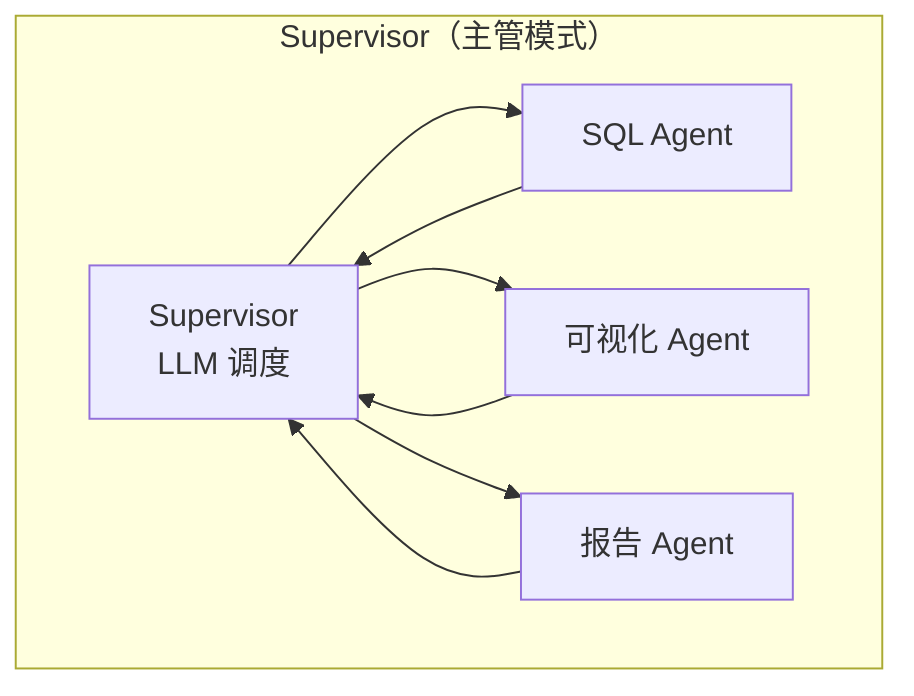
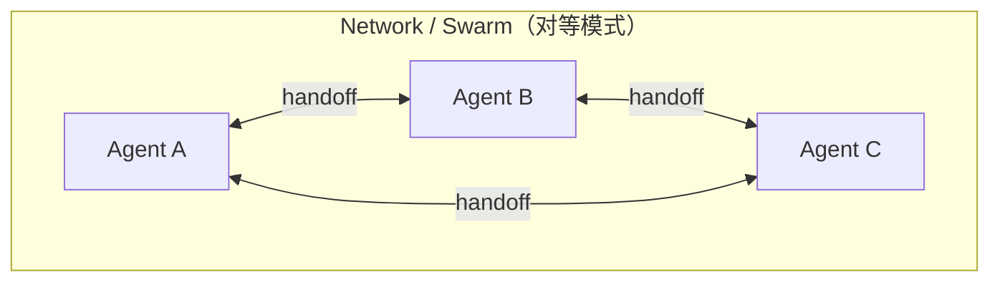
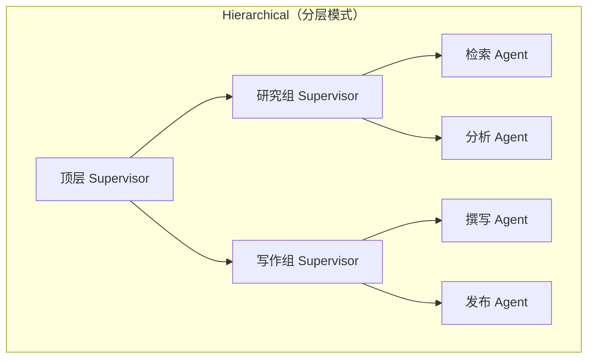

# 3.4 多 Agent 编排

> Supervisor、Hierarchical、Peer-to-Peer 三种协作模式，以及上下文传递、结果聚合与调试的完整工程实践

> **模块**：3.4 | **预计时间**：4h | **面试可答**：三种协作模式的适用边界、handoff 的 Command 实现与消息配对、共享历史 vs 只传结果、为什么 swarm 必须配 checkpointer

## 学习目标

- 掌握多 Agent 三种协作模式与术语对应关系（Peer-to-Peer ≈ 官方 Network/Swarm）
- 掌握 `createSupervisor` / `createSwarm` 的准确用法与约束
- 理解 handoff 的底层机制：工具返回 `Command` + ToolMessage 配对
- 掌握任务委派、上下文隔离、结果聚合的工程策略
- 掌握多 Agent 系统的调试与追踪手段

---

## 1. 多 Agent 协作模式

### 1.1 术语对照

大纲中的 Peer-to-Peer 在 LangChain 官方文档中称 **Network**（其 npm 实现叫 **Swarm**），三种模式是同一套图原语（3.1-3.2）的不同拓扑：







| 模式 | 控制流 | 适合 | 不适合 |
|------|--------|------|--------|
| **Supervisor** | 单点 LLM 调度，星型拓扑 | 任务可清晰分解（数据分析、客服分派） | 角色间需要直接协作 |
| **Network / Swarm** | Agent 互相移交控制权 | 无清晰层级、对话式流转（售后 ↔ 退款 ↔ 物流） | 任务复杂到需要全局规划 |
| **Hierarchical** | Supervisor 的 Supervisor | 团队规模大（10+ Agent）、需分组管理 | 小任务（杀鸡用牛刀） |

### 1.2 单 Agent 优先原则

官方在多 Agent 文档中给出的 **Tip**：多数场景首选「**单 Agent + 动态 prompt/tools**」（middleware 切换），只有当某个角色需要**定制子图**（如内嵌 RAG/反思循环，见 3.3）时才值得拆成多 Agent。多 Agent 是组织复杂度的手段，不是能力加成——每多一个 Agent 就多一份 LLM 调用、上下文同步与调试成本。

---

## 2. Supervisor 模式：createSupervisor

### 2.1 完整示例（实战项目 03 的雏形）

```typescript
// 依赖：bun add @langchain/langgraph @langchain/langgraph-supervisor @langchain/openai langchain
import { createSupervisor } from "@langchain/langgraph-supervisor";
import { createReactAgent } from "@langchain/langgraph/prebuilt";
import { tool } from "langchain";
import { ChatOpenAI } from "@langchain/openai";
import * as z from "zod";

const model = new ChatOpenAI({ model: "openai:gpt-5.4" });

// mock 工具（tool() 用法见 2.3；生产替换为真实实现）
const runSqlQuery = tool(
  async ({ sql }) => JSON.stringify([{ month: "8月", sales: 120000 }]),
  { name: "run_sql_query", description: "执行只读 SQL，返回表格 JSON",
    schema: z.object({ sql: z.string() }) }
);
const renderChart = tool(
  async ({ data, type }) => `chart://${type}-1`,
  { name: "render_chart", description: "把表格数据渲染成图表，返回图表引用",
    schema: z.object({ data: z.string(), type: z.enum(["bar", "line", "pie"]) }) }
);
const saveReport = tool(
  async ({ content }) => "saved: report.md",
  { name: "save_report", description: "保存报告文本",
    schema: z.object({ content: z.string() }) }
);

// 三个子 Agent：prebuilt createReactAgent，name/prompt 必填
const sqlAgent = createReactAgent({
  llm: model,
  name: "sql-expert",
  prompt: "你负责把分析需求转成只读 SQL 并执行，返回表格数据。不要做可视化。",
  tools: [runSqlQuery],
});

const chartAgent = createReactAgent({
  llm: model,
  name: "chart-expert",
  prompt: "你负责把表格数据转成图表配置（JSON）。",
  tools: [renderChart],
});

const reportAgent = createReactAgent({
  llm: model,
  name: "report-writer",
  prompt: "你负责把数据与图表整理成一份结论清晰的中文报告。",
  tools: [saveReport],
});

// 注意：JS 版参数名是 llm（不是 model！），返回值是【未编译】的 StateGraph
const workflow = createSupervisor({
  agents: [sqlAgent, chartAgent, reportAgent],
  llm: model,
  prompt: "你是数据分析团队主管。先派 sql-expert 取数，再派 chart-expert 画图，最后派 report-writer 出报告，然后结束。",
  outputMode: "full_history", // 消息历史策略，见第 4 节
  responseFormat: z.object({  // 结构化最终产出（可选）
    summary: z.string(),
    chartCount: z.number(),
  }),
});

const app = workflow.compile({ checkpointer: new MemorySaver() });
const result = await app.invoke(
  { messages: [{ role: "user", content: "分析上月销售额趋势并出报告" }] },
  { configurable: { thread_id: "analysis-42" } }
);
console.log(result.summary);
```

**两个高频踩坑点**：

1. **参数名是 `llm` 不是 `model`**（JS 版特有；Python 版才叫 `model`）——照抄 Python 教程会静默失败
2. **返回值是未编译的 `StateGraph`**，必须自己 `.compile()`，需要 checkpointer 时在 compile 时传

### 2.2 关键配置项

| 参数 | 作用 | 建议 |
|------|------|------|
| `prompt` | Supervisor 的调度规则（谁先谁后、何时结束） | 把**工作流顺序写明确**，别指望调度模型自己悟 |
| `outputMode` | 子 Agent 结果如何进共享历史：`full_history` / `last_message` | 调试期 full；生产按第 4 节策略 |
| `responseFormat` | 结构化最终输出（Zod） | 需要机器可读结论时必开 |
| `addHandoffBackMessages` | 交还控制权时是否补 (AI, Tool) 消息对 | 保持默认，保证历史完整 |

> 📌 上表仅为常用参数；`createSupervisor` 的完整签名（含 `responseFormat` 的 `{ prompt, schema }` 形态、`preModelHook` / `postModelHook` / `stateSchema` 等）以 [官方 API 参考](https://reference.langchain.com/javascript/functions/_langchain_langgraph-supervisor.createSupervisor.html) 为准。

### 2.3 任务分解与子 Agent 委派

委派质量 = Supervisor 的 prompt 写法。三条经验：

1. **委派以工具调用形式发生**——Supervisor 通过 handoff 工具（如 `transfer_to_chart_expert`）把控制权交给子 Agent，子 Agent 的 `name` 就是工具参数，其 `description` 来自你写的 prompt。所以**子 Agent 的 name/prompt 就是 Supervisor 的「委派接口」**，要像写工具 description 一样认真
2. **一次只派一个**——Supervisor 循环「派活 → 收结果 → 再派活」，把并行性留给 3.2 的 Send，而不是让 Supervisor 想象中的「并行派发」
3. **委派要带验收标准**——prompt 里写清「报告必须包含环比数字」，子 Agent 返回不合格时 Supervisor 有依据重派

---

## 3. Handoff 机制：Agent 间通信的底层

无论 Supervisor 还是 Swarm，控制权移交都靠**工具返回 `Command`**（3.2 的 `Command.PARENT`）：

```typescript
// 手写一个 handoff 工具（swarm 包的 createHandoffTool 内部就是这套）
import { Command } from "@langchain/langgraph";
import { ToolMessage } from "@langchain/core/messages";

const transferToSales = tool(
  async (_, runtime) => {
    const lastAiMessage = runtime.state.messages.at(-1);
    const transferMessage = new ToolMessage({
      content: "Transferred to sales agent",
      tool_call_id: runtime.toolCallId,
    });
    return new Command({
      goto: "sales_agent",          // 目标 Agent 节点名
      update: {
        activeAgent: "sales_agent",
        messages: [lastAiMessage, transferMessage], // 见下方配对规则
      },
      graph: Command.PARENT,        // 从子图跳到父图节点
    });
  },
  { name: "transfer_to_sales", description: "转接给销售 Agent", schema: z.object({}) }
);
```

**硬规则：AIMessage（含 tool_call）与 ToolMessage（`tool_call_id` 配对）必须一起写入消息历史**。缺了 ToolMessage，历史里悬空一个未被响应的工具调用，下一轮模型请求直接报错。这也是 swarm 包反复强调 handoff 工具必须补配对消息的原因。

---

## 4. 上下文传递与隔离策略

多 Agent 最大的工程难题不是「怎么协作」，而是「互相看多少」。

### 4.1 共享消息列表的两种策略

默认所有 Agent 通过共享的 `messages` channel 通信，两种共享口径：

| 策略 | 做法 | 优点 | 缺点 |
|------|------|------|------|
| **共享完整历史**（full history） | 全部思考过程进共享 scratchpad | 上下文最全，推理连贯 | 上下文膨胀快，Token 成本高 |
| **只共享最终结果**（final result） | 各 Agent 私有 scratchpad，只把结论发进共享层 | 省 Token、职责干净 | 需要不同 state schema，信息有损 |

`createSupervisor` 的 `outputMode` 就是在切这两种口径：`full_history` vs `last_message`。

### 4.2 隔离手段

1. **私有 state**：节点（Agent）函数可以声明私有输入 schema，只接收指定字段（3.1 多 schema 机制）
2. **子图转换**（3.2 模式 B）：把 Agent 封成子图，`invoke` 时显式传字段——「只给它该看的」
3. **换 key**：swarm 里把某 Agent 的消息写到独立 key（如 `analysis_messages`）再在包装层转换，避免污染共享 `messages`

### 4.3 决策口诀

> 默认共享历史（简单、可调试）；发现 Token 成本失控或子 Agent 互相「带偏」时，改为只传结果 + 显式字段传递。**上下文是设计出来的，不是默认出来的。**

---

## 5. Agent 间通信与结果聚合

- **消息流**（对话型协作）：`messages` 配 append reducer，自然累积
- **数据流**（产出型协作）：独立字段 + reducer。例如多个分析 Agent 并行产出，用 `ReducedValue` 追加聚合（3.2 Send 的规则完全适用）：

```typescript
const State = new StateSchema({
  messages: MessagesValue,
  findings: new ReducedValue(
    z.array(z.object({ agent: z.string(), conclusion: z.string() })).default(() => []),
    { inputSchema: z.object({ agent: z.string(), conclusion: z.string() }),
      reducer: (cur, next) => [...cur, next] }
  ),
});
```

- **最终交付**：`responseFormat`（Supervisor）或一个专门的「报告 Agent」收口，保证对外输出结构稳定

## 6. 冲突解决与一致性保证

多个 Agent 对同一问题给出矛盾结论（如 sql-expert 与 web-search 的数字不一致）时，工程上四板斧：

1. **仲裁者显式化**：不要指望 Agent 自发辩论分胜负，让 Supervisor 的 prompt 承担仲裁职责（「数据冲突时以 sql-expert 为准」），或追加一个裁决节点
2. **结构化收口**：最终结论走 `responseFormat` schema 校验，字段间约束（如 `total = sum(items)`）在 schema 层或后处理校验
3. **确定性优先**：能用代码算的（汇总、去重、排序）不要让 LLM 做——聚合逻辑写进节点函数，LLM 只做语义部分
4. **幂等与重放**：所有子 Agent 副作用幂等（3.1 原则），冲突重派时不会产生重复工单

---

## 7. Hierarchical 模式

把子 Supervisor 编译后的图当作顶层 Supervisor 的 agent 传入：

```typescript
const researchTeam = createSupervisor({
  agents: [retrievalAgent, analysisAgent],
  llm: model,
  prompt: "你管理研究组：先检索后分析。",
}).compile({ name: "research_team" });

const writingTeam = createSupervisor({
  agents: [writerAgent, publisherAgent],
  llm: model,
  prompt: "你管理写作组：先撰写后发布。",
}).compile({ name: "writing_team" });

const topSupervisor = createSupervisor({
  agents: [researchTeam, writingTeam], // 编译后的子图就是「Agent」
  llm: model,
  prompt: "你是总监：先派 research_team 出研究结论，再派 writing_team 产出发布稿。",
}).compile({ checkpointer: new MemorySaver() });
```

对顶层而言，「团队图」与「单 Agent」没有区别——这就是 3.2 子图机制的自然延伸。分组边界 = 上下文隔离边界：research_team 内部的全部中间消息不会流入 writing_team 的决策视野（顶层只看到团队「汇报」的最后结论）。

---

## 8. Peer-to-Peer（Swarm）模式

```typescript
// 依赖：bun add @langchain/langgraph-swarm
import { createSwarm, createHandoffTool } from "@langchain/langgraph-swarm";
import { createReactAgent } from "@langchain/langgraph/prebuilt";
import { MemorySaver } from "@langchain/langgraph";

const alice = createReactAgent({
  llm: model,
  name: "Alice",
  prompt: "你是售后接待，判断问题类型后转给对应专家。",
  tools: [createHandoffTool({ agentName: "Bob", description: "退款专家" })],
});

const bob = createReactAgent({
  llm: model,
  name: "Bob",
  prompt: "你是退款专家，处理完转回 Alice 继续接待。",
  tools: [createHandoffTool({ agentName: "Alice", description: "接待与分派" })],
});

const app = createSwarm({
  agents: [alice, bob],
  defaultActiveAgent: "Alice",
}).compile({
  // 官方强调：多轮对话必须配 checkpointer，否则 swarm 会「忘记」上一个活跃 Agent
  checkpointer: new MemorySaver(),
});
```

**约束与注意**：

- swarm 包目前**只支持 prebuilt `createReactAgent`**，未适配新的 `createAgent`；需要 `createAgent`/自定义子图能力时用 Supervisor 或手写 handoff 工具（第 3 节）
- `activeAgent` 是图状态的一部分 → 跨轮恢复依赖 checkpoint（面试高频：为什么 swarm 必须配 checkpointer）
- 每个可被移交的目标都要以 `createHandoffTool` 形式出现在当前 Agent 的工具表里，拓扑是「图里画的」也是「prompt 里教的」

---

## 9. 多 Agent 调试与追踪

| 手段 | 用法 | 看什么 |
|------|------|--------|
| 子图流式 | `stream(input, { streamMode: "updates", subgraphs: true })` | 每个团队/Agent 内部的节点切换与状态增量（3.2） |
| LangSmith | 环境变量接入（2.7） | Agent 间消息传递树、每个 Agent 的 token/延迟、handoff 链路 |
| 快照检查 | `graph.getState(config)` | 卡住时看 `next` 指向谁、共享消息是否被污染 |
| Langfuse | 开源自托管替代（2.7），OpenTelemetry 接入 | 团队内外的成本归因（按 Agent 打 tag） |
| Studio | `langgraph dev` 本地可视化 | 拓扑与执行路径肉眼验证 |

**调试多 Agent 的第一原则**：先确认「控制流」（谁在什么时候被调用），再查「数据流」（它看到了什么消息）——两者的排障手段不同，混在一起查会迷路。

---

## 面试问答

> **问：Supervisor、Network(Swarm)、Hierarchical 三种多 Agent 模式如何选型？**
>
> 答：按控制流需求选。Supervisor 是星型拓扑，单点 LLM 决定任务派给谁、何时结束，适合任务可分解、流程可预期的场景（数据分析流水线、客服工单分派）；Swarm 是对等拓扑，Agent 之间用 handoff 工具互相移交控制权，适合无明确层级、按对话内容流转的场景（多专家轮转接待）；Hierarchical 是 Supervisor 的递归组合（子团队 Supervisor 编译成图后当作顶层 Agent 传入），适合 10+ 角色需要分组管理和上下文隔离的大系统。选择的原则是从「控制流该谁说了算」出发：集中调度选 Supervisor，去中心流转选 Swarm，规模大到需要分层才用 Hierarchical。同时记住官方的单 Agent 优先原则——很多「需要多 Agent」的场景其实是单 Agent 换 prompt/tools 就够。

> **问：手写 handoff 工具时最容易犯什么错误？**
>
> 答：忘了消息配对。handoff 工具作为一个 tool call 被执行，历史里已经有一条带 tool_calls 的 AIMessage，工具返回时必须同时写入配对的 ToolMessage（携带 tool_call_id），然后返回 `Command({ goto, graph: Command.PARENT })` 跳到目标 Agent。只写 Command 不补 ToolMessage，消息历史里就悬着一个没被响应的工具调用，下一轮发给模型会直接报错。此外还要注意 goto 的目标节点必须真实存在（父图节点名），以及 swarm 模式要在 update 里同步 activeAgent 字段，否则 checkpoint 恢复后控制权错乱。

> **问：子 Agent 之间应该共享完整对话历史还是只传最终结果？怎么权衡？**
>
> 答：默认共享完整历史（full_history）：上下文最全、推理连贯、调试直观，是 createSupervisor 的默认输出模式。三个信号出现时切换到「只传结果」：Token 成本失控（每个 Agent 都背着全部历史跑）；上下文互相污染（前一个 Agent 的中间推理把后一个带偏，比如把探索性猜测当结论）；职责边界要求隔离（合规要求某 Agent 不能看用户敏感数据）。实现上用 outputMode: "last_message" 或子图模式显式转换字段。核心认知：上下文传递是显式设计决策，切换的依据是「下游 Agent 做决策到底需要什么」，而不是「多总比少好」。

> **问：为什么 swarm 模式必须配 checkpointer 才能多轮对话？**
>
> 答：swarm 的「当前活跃 Agent」存在图状态里（activeAgent），这一轮由 Alice 处理、下一轮该回 Bob 还是继续 Alice，这个信息只在状态里有，没有落在持久层就会丢。checkpointer 按 thread_id 在每轮结束时保存全部状态（包括 activeAgent 和消息历史），下一轮 invoke 先恢复再路由到正确的 Agent。不配 checkpointer 的症状是：每轮都从 defaultActiveAgent 重新开始，Agent「失忆」。这本质上是 3.2 持久化机制在多 Agent 场景的必然要求——任何跨调用的「记忆」都必须有 checkpointer 或 store 承载。

> **问：多 Agent 系统里两个 Agent 给出矛盾的结论怎么办？**
>
> 答：四层防线。第一，架构上不要让矛盾自由发生：让 Supervisor 的 prompt 显式声明仲裁规则（数据冲突以哪个 Agent 为准），或追加专职裁决节点。第二，收口结构化：最终结论走 responseFormat 的 Zod schema，字段间一致性约束（合计等于分项之和）在 schema 校验或后处理里做，不让 LLM 做算术。第三，职责分离：确定性计算（汇总、去重、排序）写在普通节点代码里，LLM 只处理语义层。第四，可观测：给每个 Agent 的产出打 tag 上报（LangSmith/Langfuse），矛盾率高通常是 prompt 边界不清或工具描述含糊，回到设计层修而不是在运行层兜。

---

## 10. 实战练习

> 目标：搭一个三 Agent 的 Supervisor 数据分析流水线（实战项目 03 的核心骨架）。

**要求**：
1. 用 `createReactAgent` 实现三个子 Agent：`sql-expert`（mock 查询工具返回固定表格）、`chart-expert`（mock 渲染工具）、`report-writer`（mock 保存工具）。
2. `createSupervisor` 串起三者，prompt 写明派活顺序；`responseFormat` 约束 `{ summary: string, dataPoints: number }`。
3. 分别用 `outputMode: "full_history"` 和 `"last_message"` 各跑一次，对比 LangSmith trace 中每个子 Agent 收到的消息长度。
4. 给 `report-writer` 的工具加一次人为失败（第一次抛错），验证 Supervisor 能否依据失败信息重派或收尾。

**提示**：
- 参数名是 `llm` 不是 `model`；返回值记得 `.compile()`。
- 第 4 步若 Supervisor 卡死，检查它的 prompt 是否写了「失败时如何处理」——没有就补上。

**预期效果**：
- 两次运行最终结论一致，但 `last_message` 模式下子 Agent 输入 token 明显更少；
- 工具失败时 Supervisor 要么重派要么出降级报告，不会无限循环（可叠加 `recursionLimit` 观察）。

---

## 11. 对比：Supervisor vs Swarm vs 单 Agent + Middleware

| 维度 | Supervisor | Swarm（Peer-to-Peer） | 单 Agent + Middleware |
|------|-----------|----------------------|----------------------|
| 控制流 | 中心化 LLM 调度 | 去中心化 handoff | 单循环，无移交 |
| 上下文成本 | 高（全员共享历史） | 中（activeAgent 串行） | 最低 |
| 定制子图角色 | 天然支持（agent 传图） | 不支持（仅 createReactAgent） | 需要时得升级架构 |
| 调试难度 | 中（一切经过 Supervisor） | 高（流转路径不固定） | 低 |
| 适用规模 | 2-10 个固定角色 | 2-5 个对等专家 | 绝大多数业务 Agent |

**一句话总结**：从单 Agent 出发，控制流真的需要「分派」才上 Supervisor，需要「专家间自由流转」才上 Swarm，团队规模失控才上 Hierarchical——多 Agent 的复杂度预算永远优先留给上下文设计与调试基建。

---

## 总结

**核心要点**：
1. **三种拓扑**：Supervisor 集中派活（`createSupervisor`，参数是 `llm`、返回要 `compile`）；Swarm 对等移交（`createSwarm` + `createHandoffTool`，仅支持 `createReactAgent`）；Hierarchical = 子团队图当 Agent
2. **handoff 底层**：工具返回 `Command({ goto, graph: Command.PARENT })`，AIMessage/ToolMessage 必须配对
3. **上下文是设计出来的**：full_history 与 last_message（只传结果）之间切换；私有 schema 与子图转换做隔离
4. **一致性问题**：仲裁显式化 + `responseFormat` 结构化收口 + 确定性计算不交给 LLM
5. **调试**：先控制流（stream subgraphs / Studio）后数据流（LangSmith / getState）

**下一步**：
- 学习 [3.5 MCP 开发](05-MCP开发.md)：把子 Agent 的工具从「进程内函数」升级为「跨进程、可复用的标准服务」
- 用本章骨架完成 [实战项目 03：数据分析助手（多 Agent 协作版）](../../readme.md)

---

*参考资料*：
- [LangChain.js 官方文档：Multi-Agent](https://docs.langchain.com/oss/javascript/langchain/multi-agent)
- [LangChain.js 官方文档：Handoffs](https://docs.langchain.com/oss/javascript/langchain/multi-agent/handoffs)
- [@langchain/langgraph-supervisor（npm）](https://www.npmjs.com/package/@langchain/langgraph-supervisor)
- [@langchain/langgraph-swarm（npm）](https://www.npmjs.com/package/@langchain/langgraph-swarm)
- [createSupervisor API 参考](https://reference.langchain.com/javascript/functions/_langchain_langgraph-supervisor.createSupervisor.html)
