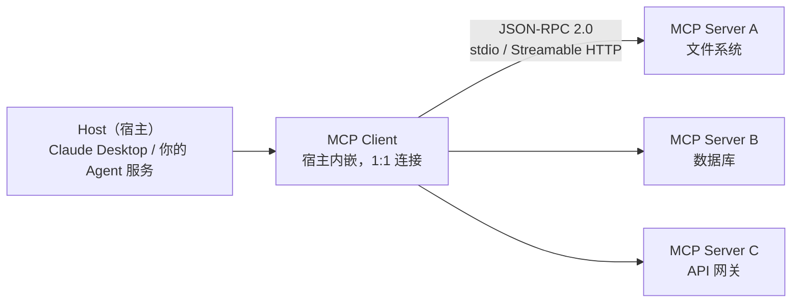

# 3.5 MCP（Model Context Protocol）开发

> 用开放协议把工具从「进程内函数」升级为「跨进程、跨语言、可复用的标准服务」

> **模块**：3.5 | **预计时间**：3.5h | **面试可答**：MCP 三层架构与 Transport 选型、MCP 与 Function Calling 的关系、Streamable HTTP 为何取代 HTTP+SSE、mcp-adapters 接入链路

## 学习目标

- 理解 MCP 协议架构：Server / Client / Transport 与三大能力原语
- 掌握 TypeScript SDK 开发 MCP Server（stdio 与 Streamable HTTP 两种 transport）
- 掌握 MCP Client 集成与 `@langchain/mcp-adapters` 工具桥接
- 完成 filesystem / 数据库 / API 网关三类自定义 Server 实战
- 了解 MCP 生态与社区工具

---

## 1. 协议核心概念与架构

### 1.1 为什么需要 MCP

2.3 的自定义工具解决了「我的 Agent 用我的函数」。但工具一旦要**跨进程、跨团队、跨语言复用**——同一个数据库查询能力，A 团队的 LangChain Agent、B 团队的 Claude Desktop、C 团队的自研 Agent 都要用——每个调用方重写一遍 `tool()` 就成了灾难。MCP 把「工具的定义与执行」从调用方剥离，成为独立的**标准服务**：



三个角色：

| 角色 | 职责 | 类比 |
|------|------|------|
| **Host** | 跑 LLM 应用的宿主（Agent 服务、IDE、桌面客户端） | 浏览器 |
| **Client** | 宿主内嵌的连接器，与每个 Server 保持 1:1 会话 | 各协议的 HTTP client |
| **Server** | 暴露能力的服务：工具（tools）、资源（resources）、提示（prompts） | Web 服务 |

### 1.2 三大能力原语

| 原语 | 方向 | 内容 | Agent 场景 |
|------|------|------|-----------|
| **Tools** | Server → 模型可调用 | 函数（含 JSON Schema 入参） | 查库、发邮件、跑代码（本章主角） |
| **Resources** | 应用 → 模型上下文 | 文件、数据（URI 标识，只读） | 挂载文档、配置 |
| **Prompts** | 用户主导 | 预置提示模板 | 斜杠命令、模板库 |

协议本体是 **JSON-RPC 2.0**（`initialize` 能力协商 → `tools/list` → `tools/call`…），SDK 把这些都封装掉了，但排查问题时看得到。

### 1.3 Transport：stdio 与 Streamable HTTP

规范演进时间线（写文档/选型时必看）：

- **2024-11-05**：首版规范，远程 transport 为 HTTP+SSE
- **2025-03-26**：引入 **Streamable HTTP**，弃用 HTTP+SSE
- **2025-06-18**：明确 Streamable HTTP 取代 HTTP+SSE，标准 transport 只剩 stdio + Streamable HTTP
- **2026-07-28**：最新规范（下文 v2 SDK 所实现的版本）

| Transport | 通信方式 | 适用 |
|-----------|---------|------|
| **stdio** | 标准输入输出（子进程） | 本地工具：宿主把 Server 当子进程拉起 |
| **Streamable HTTP** | 单个 HTTP 端点，响应可流式（SSE 仅作为响应流载体） | 远程共享服务；旧 HTTP+SSE 已弃用，仅兼容保留 |

> ⚠️ 看到 2024 年老教程里的 `SSEServerTransport` / 两端点（SSE + POST）写法一律按过时处理；Streamable HTTP 只需要一个 `/mcp` 端点。
> Streamable HTTP 服务端必须校验 `Origin` 头（防 DNS rebinding）、本地调试绑 127.0.0.1、生产必须做认证。

---

## 2. MCP Server 开发（TypeScript SDK）

### 2.1 SDK 双线现状（2026-09）

| 线 | 包名 | 当前版本 | Schema 体系 | 规范版本 |
|----|------|---------|------------|---------|
| **v1（生态最广）** | `@modelcontextprotocol/sdk` | 1.30.x | peer 依赖 Zod（入参用「字段 → ZodType」Record 风格） | ≤ 2025-06-18 |
| **v2（当前稳定线）** | `@modelcontextprotocol/server`（client 为 `@modelcontextprotocol/client`） | 2.0.x | **Standard Schema**（入参传整体 `z.object`，可换 Valibot/ArkType） | 2026-07-28 |

v1 在 v2 发布后继续维护（bug/安全修复）；新项目**建议直接 v2**，存量生态示例多为 v1，两套入参写法都要认识。

### 2.2 Server 实战一：文件系统工具（stdio）

```typescript
// v1 写法：bun add @modelcontextprotocol/sdk zod
import { McpServer } from "@modelcontextprotocol/sdk/server/mcp.js";
import { StdioServerTransport } from "@modelcontextprotocol/sdk/server/stdio.js";
import * as z from "zod";

const server = new McpServer({ name: "fs-tools", version: "1.0.0" });

// registerTool 是当前推荐的注册方式（server.tool(...) 为旧式 API）
server.registerTool(
  "read_file",
  {
    description: "读取指定路径的文本文件内容",
    inputSchema: { path: z.string().describe("文件绝对路径") }, // v1：Record 风格
  },
  async ({ path }) => {
    const content = await Bun.file(path).text();
    return { content: [{ type: "text", text: content }] };
  }
);

server.registerTool("write_file", {
  description: "把文本写入指定路径（覆盖）",
  inputSchema: { path: z.string(), text: z.string() },
}, async ({ path, text }) => {
  await Bun.write(path, text);
  return { content: [{ type: "text", text: `已写入 ${path}` }] };
});

await server.connect(new StdioServerTransport()); // stdio：宿主以子进程方式拉起本脚本
```

```typescript
// v2 写法差异（bun add @modelcontextprotocol/server）：
import { McpServer } from "@modelcontextprotocol/server";
import { StdioServerTransport } from "@modelcontextprotocol/server/stdio";

server.registerTool("read_file", {
  description: "读取指定路径的文本文件内容",
  inputSchema: z.object({ path: z.string() }), // v2：整体 z.object（Standard Schema）
}, async ({ path }) => ({ content: [{ type: "text", text: await Bun.file(path).text() }] }));
```

要点：

- 工具返回统一为 `{ content: [{ type: "text", text }] }`；可附 `structuredContent`；失败时置 `isError: true` 返回错误说明（而不是抛异常裸崩）
- `inputSchema` 的 Zod 定义会原样转成 JSON Schema 告知调用方——**description 写得越清楚，Agent 用得越准**（与 2.3 同理）
- 文件系统 Server 生产必须加路径白名单（`permissions` 概念，参考 3.6 的声明式权限），本例为教学最小化

### 2.3 Server 实战二：API 网关（Streamable HTTP）

```typescript
// v1 + Hono 集成：bun add @modelcontextprotocol/sdk hono
import { McpServer } from "@modelcontextprotocol/sdk/server/mcp.js";
import { StreamableHTTPServerTransport } from "@modelcontextprotocol/sdk/server/streamableHttp.js";
import { Hono } from "hono";
import * as z from "zod";

const server = new McpServer({ name: "orders-gateway", version: "1.0.0" });

server.registerTool("get_order", {
  description: "按订单号查询内部订单系统",
  inputSchema: { orderId: z.string().regex(/^ORD-\d+$/) },
}, async ({ orderId }) => {
  const res = await fetch(`https://orders.internal/api/${orderId}`, {
    headers: { Authorization: `Bearer ${process.env.ORDERS_TOKEN}` },
  });
  return { content: [{ type: "text", text: JSON.stringify(await res.json()) }] };
});

const app = new Hono();

// 伪代码：Streamable HTTP 端点骨架，请求/响应衔接按所用 SDK 版本的
// handleRequest 签名适配（v2 也可直接用 @modelcontextprotocol/hono 适配包）
app.all("/mcp", async (c) => {
  // ① 鉴权中间件应在此之前完成（API Key / OAuth）
  // ② 会话管理：按 Mcp-Session-Id 复用 transport；多副本部署需会话粘性或外置存储
  const transport = new StreamableHTTPServerTransport({
    sessionIdGenerator: undefined, // 教学用无状态模式
  });
  await server.connect(transport);
  await transport.handleRequest(c.req.raw); // 把 HTTP 请求交给 transport 处理
  // transport.handleRequest 返回 Response 并自行写入流式响应（按版本适配）
  return c.newResponse(null); // 示意：实际响应由 transport 产出
});

export default { fetch: app.fetch }; // Bun 标准 serve 入口
```

> 📌 **会话与鉴权是生产化的两大主题**：单进程教学示例用无状态（`sessionIdGenerator: undefined`）配置；多副本部署时要按 `Mcp-Session-Id` 路由到同副本或外置会话存储。鉴权在网关层做（Key/OAuth），SDK 不替你管。适配包 `@modelcontextprotocol/hono`（v2 线）提供更省事的集成，原理与本例一致。

### 2.4 Server 实战三：数据库工具（设计要点）

数据库 Server 不再贴完整代码，给设计清单（骨架同 2.2）：

1. **只读账号 + 参数化查询**：入参 schema 用 Zod 白名单校验（`table` 用 `z.enum(["orders", "users"])`），SQL 一律参数绑定，杜绝拼接
2. **结果瘦身**：`SELECT` 指定列 + `LIMIT` 上限，返回紧凑 JSON——检索结果直接进 LLM 上下文，列多了烧 Token（呼应 1.3 上下文窗口管理）
3. **危险操作隔离**：`UPDATE/DELETE` 类工具单独成 Server 或加确认开关，配合 3.2 的 interrupt 做人工审批

---

## 3. MCP Client 与 LangChain 集成

### 3.1 裸 Client：直连 Server

```typescript
// 依赖：@modelcontextprotocol/sdk（v1）
import { Client } from "@modelcontextprotocol/sdk/client/index.js";
import { StdioClientTransport } from "@modelcontextprotocol/sdk/client/stdio.js";

const client = new Client({ name: "my-agent-host", version: "1.0.0" });
await client.connect(new StdioClientTransport({
  command: "bun", args: ["run", "fs-tools.ts"], // 把 2.2 的 Server 作为子进程拉起
}));

const { tools } = await client.listTools();      // 协议层工具清单
const result = await client.callTool({           // 协议层直接调用
  name: "read_file", arguments: { path: "/tmp/demo.txt" },
});
await client.close();
```

远程 Server 把 transport 换成 `StreamableHTTPClientTransport(new URL("https://…/mcp"))`。

### 3.2 桥接 LangChain：@langchain/mcp-adapters

裸 Client 拿到的是 MCP 格式的工具，Agent 需要的是 LangChain `StructuredTool[]`。官方桥接包 `@langchain/mcp-adapters`（当前 1.1.x）负责转换：

```typescript
// 依赖：bun add @langchain/mcp-adapters langchain @langchain/openai
import { createAgent } from "langchain";
import { MultiServerMCPClient } from "@langchain/mcp-adapters";
import { ChatOpenAI } from "@langchain/openai";

const mcpClient = new MultiServerMCPClient({
  throwOnLoadError: true,
  prefixToolNameWithServerName: false, // 多 Server 同名工具冲突时改为 true
  additionalToolNamePrefix: "",
  useStandardContentBlocks: true,      // 新项目官方建议开启
  mcpServers: {
    fs: { transport: "stdio", command: "bun", args: ["run", "fs-tools.ts"] },
    orders: { url: "https://gateway.example.com/mcp", automaticSSEFallback: false },
  },
});

const tools = await mcpClient.getTools(); // MCP 工具 → LangChain StructuredTool[]

const agent = createAgent({
  model: new ChatOpenAI({ model: "openai:gpt-5.4" }),
  tools, // 之后照常使用（2.4 Agent 构建的一切配置都适用）
});
```

要点：

- 一个 `MultiServerMCPClient` 管多条连接：stdio 给 `command/args`，Streamable HTTP 给 `url`（可带 `headers`、`authProvider` 做 OAuth）
- 自管裸 Client 的场景用 `loadMcpTools(serverName, client)` 拉取工具，不必换适配器
- 用完 `await mcpClient.close()` 释放连接（进程常驻的服务里放在 shutdown 钩子）

### 3.3 MCP 与 LangChain 工具系统的关系

| 维度 | LangChain `tool()`（2.3） | MCP 工具 |
|------|--------------------------|---------|
| 运行位置 | Agent 进程内 | 独立进程/服务 |
| 复用范围 | 本项目 | 任何 MCP 宿主（跨语言、跨团队） |
| Schema | Zod → JSON Schema | JSON Schema（SDK 转换） |
| 版本/部署 | 随代码发布 | 独立部署、独立升级 |
| 开销 | 函数调用 | 一次 IPC/HTTP 往返 |

**选型**：进程内逻辑、强类型耦合 → `tool()`；跨应用复用、非 TS 实现、独立演进 → MCP。二者不是替代关系：mcp-adapters 把 MCP 工具转换后，在 LangChain 侧的使用体验与原生工具完全一致。

---

## 4. MCP 生态与社区工具

- **官方参考 Server**：modelcontextprotocol/servers 仓库（filesystem、fetch、git、memory、postgres 等开箱即用，多为一行 `npx` 接入）
- **Registry**：MCP Registry（官方服务发现），第三方目录站可查社区 Server
- **宿主生态**：Claude Desktop / Cursor / VS Code 等均已内嵌 MCP Client——你写的 Server 天然可以被这些工具调用
- **评估视角**：接社区 Server 先看三件事——传输是否已迁移 Streamable HTTP、权限模型是否可配、维护活跃度。老教程里 HTTP+SSE 的 Server 优先找替代品

---

## 面试问答

> **问：MCP 和 Function Calling 是什么关系？有了 Function Calling 为什么还要 MCP？**
>
> 答：Function Calling 是模型厂商提供的「模型输出结构化调用意图」的能力，是模型与单次请求之间的机制；MCP 是应用层的开放协议，解决「工具定义与执行放在哪个进程、如何被发现与复用」。两层是互补关系：Function Calling 回答「模型怎么表达要调工具」，MCP 回答「工具从哪来、在谁那执行」。没有 MCP 时每个 Agent 项目用 LangChain tool() 把函数写死在进程里；有 MCP 后工具成为独立服务，任何宿主（Claude Desktop、Cursor、你的 Agent）都能通过标准握手发现并调用同一份工具服务，跨语言跨团队复用。mcp-adapters 这类桥接层的存在正是为了让 MCP 工具在 LangChain 里像原生工具一样被 Function Calling 消费。

> **问：Streamable HTTP 为什么取代 HTTP+SSE？它解决了什么问题？**
>
> 答：旧 HTTP+SSE 需要两个端点协作——一个 SSE 长连接承载服务端推送，一个 POST 端点承载客户端请求，要求服务维护会话与连接映射，对无状态基础设施（Serverless、负载均衡、断线重连）非常不友好。Streamable HTTP 把所有通信收敛到单个 /mcp 端点：客户端 POST 请求，服务端按需返回普通 JSON 或升级为 SSE 流（SSE 降级为「响应流载体」而不是独立通道），会话用 Mcp-Session-Id 标识，天然适配水平扩展。2025-03-26 规范引入并弃用 HTTP+SSE，2025-06-18 起标准 transport 只剩 stdio 与 Streamable HTTP。

> **问：把内部数据库暴露成 MCP Server，安全上要做哪些事？**
>
> 答：五件事：一、专用只读数据库账号，权限最小化，UPDATE/DELETE 类工具单独隔离或直接不暴露；二、所有入参过 Zod 白名单校验（表名用 enum，SQL 参数绑定），杜绝拼接注入；三、结果瘦身，指定列 + LIMIT，既省 LLM 上下文也防全表脱库；四、传输与鉴权：远程 Server 走 Streamable HTTP 时校验 Origin 头、网关层做 API Key/OAuth，本地 stdio Server 注意子进程以最小权限运行；五、审计日志：每次 tools/call 记录调用方、参数与结果摘要，出问题可回溯。更进一步可配合 LangGraph 的 interrupt 做敏感查询的人工审批（3.2）。

> **问：MultiServerMCPClient 的 getTools() 把 MCP 工具转成 LangChain 工具，这个桥接层实际做了什么转换？**
>
> 答：三件事。第一，Schema 转换：MCP 的 JSON Schema 入参转成 LangChain StructuredTool 的 Zod schema，让 createAgent/bindTools 能直接把工具喂给模型，模型产生的 tool_calls 再映射回 MCP 的 arguments。第二，执行转换：LangChain 侧的工具执行体变成一次 callTool 的 JSON-RPC 请求，拿到 content 数组后按 useStandardContentBlocks 等配置规范化成 LangChain 消息内容块。第三，生命周期管理：管理多条连接的建立、重连（stdio 可配 restart）、超时（defaultToolTimeout）与关闭。理解这三件事就能定位常见故障：schema 转换失败看入参定义，执行报错看 Server 日志与 transport 配置，工具名冲突用 prefixToolNameWithServerName。

---

## 5. 实战练习

> 目标：从零写一个「库存查询 MCP Server」，并用 Agent 消费它。

**要求**：
1. 用 v1 SDK 写 stdio Server，注册两个工具：`query_stock(sku: string)`（返回 mock 库存 JSON）、`list_low_stock(threshold: number)`（返回低于阈值的 SKU 列表）；入参 Zod 校验 + 描述完整。
2. 写裸 Client 脚本：连接 Server、`listTools()` 打印工具清单、`callTool` 调用一次 `query_stock`。
3. 用 `MultiServerMCPClient` 挂载该 Server，`createAgent` 配上工具后问「SKU-A001 还有货吗？哪些商品快缺货了？」，验证模型自主选择正确工具。
4.（进阶）把同一个 Server 改造成 Streamable HTTP 版本挂到 Hono `/mcp` 端点，客户端只用改 transport。

**提示**：
- stdio Server 用 `bun run server.ts` 方式由 Client 拉起，调试期可先在前台跑通工具逻辑再接 transport。
- 工具返回记得包 `{ content: [{ type: "text", text: JSON.stringify(data) }] }`。

**预期效果**：
- 裸 Client 能列出两个工具并成功调用；
- Agent 对两个不同问题分别选中 `query_stock` 与 `list_low_stock`；
- HTTP 版无需改工具代码，只换传输层。

---

## 6. 对比：MCP vs 进程内 Function Calling vs A2A

| 维度 | MCP | 进程内 `tool()` | A2A（Agent-to-Agent） |
|------|-----|----------------|----------------------|
| 解决的问题 | Agent ↔ 工具服务的标准化连接 | 单应用内的工具定义 | Agent ↔ Agent 的任务协作 |
| 通信 | JSON-RPC（stdio/HTTP） | 进程内函数调用 | HTTP + JSON-RPC（Agent Card 发现） |
| 粒度 | 工具/资源/提示 | 函数 | 任务（可能内部跑很久） |
| 复用方 | 任意 MCP 宿主 | 本项目 | 其他 Agent 系统 |
| 与本课栈的关系 | 3.5 本章 + 3.6 DeepAgents 直接支持 | 2.3 的基础 | 第四阶段后多 Agent 跨系统协作（大纲 9.4） |

**一句话总结**：MCP 管「Agent 连工具」，A2A 管「Agent 连 Agent」，进程内 tool() 管「今天就要跑通」——三者按复用半径选用，MCP 与 A2A 在项目中的组合形态见大纲 9.4。

---

## 总结

**核心要点**：
1. **架构三角色**：Host / Client / Server，JSON-RPC 2.0 通信；三大原语中 Tools 是 Agent 场景主角
2. **Transport 只记两个**：stdio（本地子进程）与 Streamable HTTP（远程单端点）；HTTP+SSE 已废弃，老代码按过时处理
3. **SDK 双线**：v1 `@modelcontextprotocol/sdk`（Zod Record 入参）与 v2 `@modelcontextprotocol/server`（Standard Schema）；`registerTool` 是推荐注册方式
4. **桥接链路**：`MultiServerMCPClient.getTools()` → LangChain 工具 → `createAgent`，工具名冲突与内容块规范化靠配置解决
5. **数据库/网关 Server 纪律**：只读账号、参数绑定、结果瘦身、网关鉴权、调用审计

**下一步**：
- 学习 [3.6 DeepAgents 框架实践](06-DeepAgents框架.md)：harness 级框架原生支持「自定义函数 + MCP 工具」混合注入
- 实战中把本章的库存 Server 接进 [实战项目 03](../../readme.md) 的数据源层

---

*参考资料*：
- [MCP 规范：Transports（2025-06-18）](https://modelcontextprotocol.io/specification/2025-06-18/basic/transports)
- [MCP 规范（2026-07-28）](https://modelcontextprotocol.io/specification/2026-07-28)
- [TypeScript SDK（v1 线）README 与 Server 文档](https://github.com/modelcontextprotocol/typescript-sdk)
- [v2 SDK 文档与迁移指南](https://ts.sdk.modelcontextprotocol.io/v2/)
- [@langchain/mcp-adapters（npm）](https://www.npmjs.com/package/@langchain/mcp-adapters)
- [LangChain.js MCP 集成文档](https://docs.langchain.com/oss/javascript/langchain/mcp)
