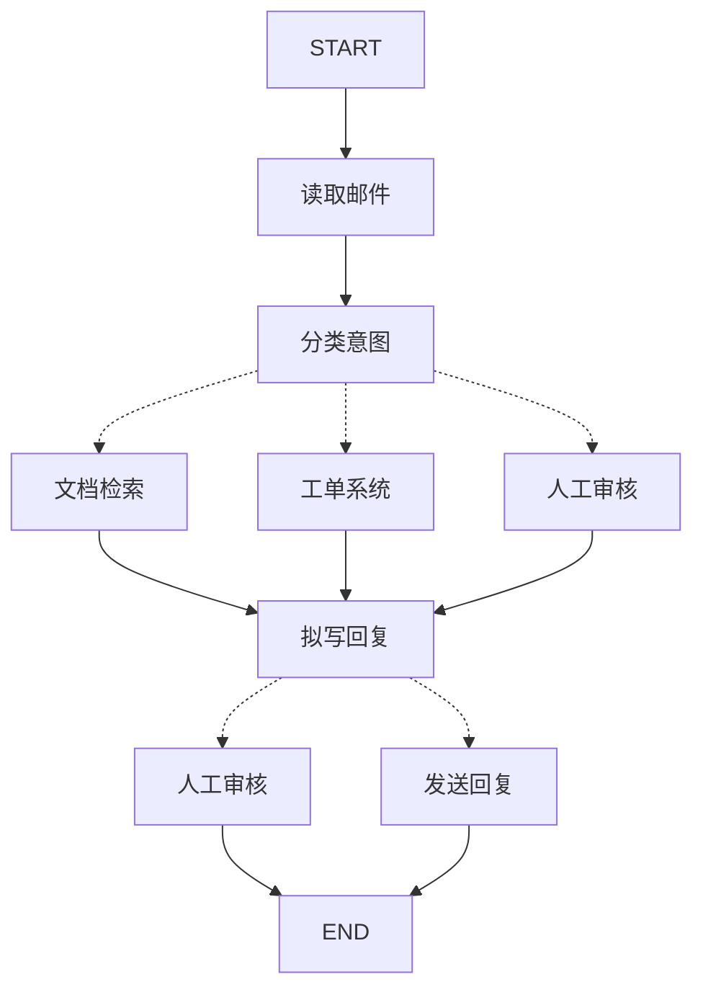

# 3.7 LangGraph 企业级实践

> 把前六节的能力装进生产护栏：流程建模、容错恢复、降级链路、监控调试与多 Agent 最佳实践

> **模块**：3.7 | **预计时间**：3h | **面试可答**：错误四分类与对应处理机制、retryPolicy 参数与时机、LLM 调用降级链设计、节点粒度对可恢复性的影响

## 学习目标

- 掌握复杂业务流程的建模方法与状态设计纪律
- 掌握 LangGraph 原生容错三件套：Retries / Timeouts / Error Handling
- 掌握 LLM 调用容错：重试、限流与 Fallback 模型链的分层设计
- 掌握企业级调试与监控的实操手段
- 沉淀多 Agent 编排的生产 checklist

---

## 1. 复杂业务流程建模

### 1.1 五步建模法

官方方法论（Thinking in LangGraph）给出一套可复用的流程拆解步骤，以「客服邮件处理」为例：

1. **画流程**：把业务写成离散步骤（读邮件 → 分类 → 查文档/建工单/转人工 → 拟回复 → 审核 → 发送）
2. **定性每步**：LLM 步骤（分类、拟稿）/ 数据步骤（查库、检索）/ 动作步骤（发送、建单）/ 人工步骤（审核）——类型决定容错策略（第 2 节）
3. **设计状态**：原始数据进状态，prompt 现拼（3.1 的两条硬原则）；「能推导的不入状态」
4. **实现节点**：每节点单一职责，按步骤 2 的类型预埋容错
5. **连线**：能收敛的收敛——显式边管固定段，`Command`/条件边管决策点



### 1.2 节点粒度 = 恢复粒度

Checkpointer 在**节点边界**做快照（3.2），恢复时从失败节点**开头**重跑。这把「节点怎么切」从代码风格问题升级为**可用性设计**：

| 切分方式 | 故障重跑代价 | 建议 |
|---------|------------|------|
| 大节点（读邮件+分类+查库一体） | 全部重跑，外部调用重复计费 | 避免把多个外部调用塞一个节点 |
| 按外部交互切边 | 只重跑失败的那个外部调用 | **外部 API 调用独立成节点** |
| 过细（每个表达式一个节点） | 快照开销上升 | 无必要；LangGraph 默认异步写 checkpoint，粒度本身不拖慢执行 |

> 💡 默认 durability `"async"`（3.2）下，更细的节点几乎不增加延迟，却换来更细的恢复粒度与可观测性——企业级流程倾向于「按外部交互与决策点切」。

### 1.3 复杂 schema：多 schema 与私有状态

多阶段流程（如数据分析：取数 → 分析 → 报告）各阶段关心的字段不同，用输入/输出 schema 收窄可见面：

```typescript
// 父图三套 schema：全量 state / 输入可见 / 输出可见（3.1 多 schema 机制）
const graph = new StateGraph({
  state: AnalysisState,
  input: z.object({ question: z.string() }),
  output: z.object({ report: z.string() }),
});
// 节点可声明私有 state：只在相邻节点间流转，不进主状态（如原始 SQL 结果）
```

收益：对外接口稳定（output schema 即 API 契约）、中间态不泄漏、节点耦合度可审计。

---

## 2. 错误处理与恢复机制

> ⚠️ **版本门槛**：本节的节点级 `timeout`、`errorHandler` 与 `setNodeDefaults`（以及 3.2 提及的 Send 第三参动态超时）需要 `@langchain/langgraph >= 1.4.0`；1.0~1.3 环境调用会报 `unknown option` 类错误。`retryPolicy` 本身在更早版本即可用。

### 2.1 错误四分类：先定性，再选机制

企业级容错的第一性原理是**分类处理**，官方给出一张决策表：

| 错误类型 | 谁来修 | 机制 | 典型例子 |
|---------|--------|------|---------|
| 瞬时错误 | 系统（自动） | `retryPolicy` 重试 | 网络抖动、限流 429 |
| LLM 可恢复错误 | LLM | 错误写进状态，路由回模型 | 工具报错、解析失败 |
| 用户可修复错误 | 人 | `interrupt()` 暂停收集信息 | 缺少订单号、意图不明 |
| 重试耗尽后的可恢复失败 | 开发者 | error handler（补偿/降级分支） | 检索服务整体不可用 |
| 意外错误 | 开发者 | **让它抛**（bubble up） | 未知的代码缺陷 |

> ⚠️ 反模式：全节点包 try/catch 吞错误转「失败也算成功」。意外错误被吞后，可观测性归零——该抛就抛（呼应个人错误处理纪律：永不静默吞错）。

### 2.2 Retries：retryPolicy

```typescript
const graph = new StateGraph(State)
  .addNode("searchDocs", searchDocs, {
    retryPolicy: { maxAttempts: 3, initialInterval: 1000 }, // 毫秒单位（JS）
  })
  .compile();
```

参数表（`RetryPolicy`）：

| 参数 | 默认 | 说明 |
|------|------|------|
| `maxAttempts` | 3 | 最大尝试次数（含首次） |
| `initialInterval` | 500 | 首次重试前等待毫秒数 |
| `backoffFactor` | 2.0 | 每次重试的间隔倍率（指数退避） |
| `maxInterval` | 128000 | 重试间隔上限（毫秒） |
| `jitter` | true | 随机抖动，防惊群 |
| `retryOn` | 内置判定 | 自定义「哪些错误可重试」的谓词；默认会跳过 4xx 类客户端错误（400/401/403/404/409 等），408/5xx 可重试 |
| `logWarning` | true | 重试时是否打告警日志 |

全图统一默认值用 `setNodeDefaults`（避免逐节点重复配置）：

```typescript
const graph = new StateGraph(State)
  .setNodeDefaults({ retryPolicy: { maxAttempts: 3 } })
  .addNode("searchDocs", searchDocs) // 自动继承默认重试
  .compile();
```

### 2.3 Timeouts：别让一个节点拖死整条流程

```typescript
.addNode("callExternalApi", callExternalApi, {
  timeout: 30_000, // 节点级超时，超时抛 NodeTimeoutError → 可被 retryPolicy 重试
})
```

- **run timeout / idle timeout**：编译或 invoke 层面限制整次运行/空闲时长
- **动态超时**：3.2 的 `Send` 支持第三个参数按实例覆盖超时——并行任务长短不一时按数据给时
- 超时与重试的组合顺序：节点抛错（含 `NodeTimeoutError`）→ 重试策略决定是否重试 → **重试耗尽才进 error handler**

### 2.4 Error Handling：重试耗尽后的补偿分支

```typescript
.addNode("searchDocs", searchDocs, {
  retryPolicy: { maxAttempts: 3 },
  // 重试耗尽后执行：可更新状态、路由到补偿分支（参数顺序：state 在前，error 在后）
  errorHandler: (state, error: NodeError) => {
    // 返回 Command / 状态更新：如 goto 降级节点、标记降级原因
    return new Command({
      update: { degraded: true, searchError: error.error.message },
      goto: "fallbackAnswer",
    });
  },
})
```

配套设计：`fallbackAnswer` 节点负责体面降级（缓存答案、告知稍后重试、转人工），而不是抛 500。子图内未捕获的异常会冒泡给**包装它的父节点**，父节点的 errorHandler 会带着子图异常（`error.error`）触发。

### 2.5 恢复语义的边界

- 节点失败恢复 = 从该节点**开头**重跑（与 interrupt 恢复同语义）→ 节点内副作用必须幂等（3.1 原则，全章最重的纪律）
- `interrupt()` 的暂停走 `GraphBubbleUp` 机制，**不经过重试与 errorHandler**（它不是错误，是暂停信号）；但节点内的普通异常照常触发重试，重跑时 interrupt 前代码会再次执行
- **优雅停机**：进程收到 SIGTERM 时在 superstep 边界排空（drain）后停止，状态已在 checkpoint 里，重启后从断点续跑——部署滚动更新时零任务丢失

---

## 3. LLM 调用容错：限流、降级、Fallback 模型链

LangGraph 层的 retryPolicy 管的是「节点级」；LLM 调用自身的容错在 **LangChain 中间件层**（2.6 已详细讲解，本节给出组合姿势）。两层各司其职：

| 层 | 机制 | 管什么 |
|----|------|--------|
| LangChain 中间件 | `modelRetryMiddleware` / `toolRetryMiddleware` | 单次模型/工具调用的瞬时错误重试 |
| LangChain 中间件 | `modelFallbackMiddleware` | 模型级故障切换（限流/宕机换模型） |
| LangChain 中间件 | 并发控制 / rate limit | 全局 RPM、并发上限 |
| LangGraph | `retryPolicy` / `timeout` / `errorHandler` | 节点级组合容错与补偿 |

### 3.1 Fallback 模型链

```typescript
import { createAgent, modelFallbackMiddleware } from "langchain";

const agent = createAgent({
  model: "openai:gpt-5.4", // 主力模型
  tools: [],
  middleware: [
    modelFallbackMiddleware(
      "openai:gpt-5.4-mini",          // 第一降级：同厂低成本模型
      "anthropic:claude-sonnet-4-6"   // 第二降级：跨厂商备份
    ),
  ],
});
```

**降级链设计三原则**：

1. **能力降序 + 成本感知**：主力 → 同厂便宜 → 跨厂备份；降级会静默改变输出质量，responseFormat/结构化输出场景必须验证降级模型也支持
2. **错误要分型**：429/5xx 才值得降级换模型；400（参数错）换多少个模型都一样，应该修调用方
3. **可观测**：降级事件必须上报（LangSmith tag / Langfuse 事件），降级率持续走高是容量或配额问题，要修容量而不是永远靠备份模型兜

### 3.2 限流与配额

- 请求侧：中间件并发控制（2.6）+ 客户端令牌桶；多副本部署用 Redis 集中限流（生产用 SCAN 做键扫描，不用 KEYS）
- 响应侧：识别 429 的 `retry-after` 头，交给 retryPolicy 的指数退避
- 状态压力：LLM 限流触发时**节点级**重试（retryPolicy）会叠加**调用级**重试（modelRetryMiddleware）——层数多了放大延迟，配好 `maxInterval`/`maxAttempts` 上限并只在一层激进

---

## 4. 性能监控与调试技巧

### 4.1 调试工具箱

| 手段 | 场景 | 用法 |
|------|------|------|
| `streamMode: "debug"` | 本地排查执行细节 | 输出任务调度、checkpoint 等内部事件 |
| `getState` / `getStateHistory` | 卡住/怀疑状态污染 | 看快照与历史（3.2） |
| `updateState` | 修复脏数据后续跑 | 以指定节点名义写入修正值 |
| Studio（`langgraph dev`） | 拓扑与执行路径 | 可视化单步执行、时间旅行 |
| 时间旅行 | 复现 bug | 带 `checkpoint_id` 从历史点重放（2.5） |

### 4.2 监控与可观测

- **Tracing**：LangSmith（2.7 快速集成）或开源自托管的 **Langfuse**；链路追踪走 **OpenTelemetry** 规范接入，Agent trace 与 Hono/数据库 span 串成一条链
- **指标**：节点成功率、重试率、降级率、每节点延迟 P95、token 消耗按 tag（Agent 名/业务线）拆分——Prometheus + Grafana 的完整建设在第七阶段展开
- **告警**：优先盯三个复合信号——重试率突增（外部依赖劣化）、giveUp/降级率走高（能力边界被击穿）、checkpoint 写入延迟（存储压力）

### 4.3 性能要点

1. **并行优先**：可独立的 LLM 调用用 3.2 的并行分支/Send 扇出，而不是串行环
2. **checkpoint 异步**：默认 durability `"async"` 保持不动，除非强一致要求
3. **上下文瘦身**：状态存原始数据（3.1）、大结果 offload（3.6）、Token 管理（2.5）——延迟和成本的大头永远在输入 token
4. **缓存**：确定性节点（固定入参 → 固定结果）在应用层做 KV 缓存，LLM 调用缓存用平台能力（Prompt caching）

---

## 5. 多 Agent 编排最佳实践

结合 3.4 与生产经验，交付前过一遍这份 checklist：

**架构层**
- [ ] 单 Agent + Middleware 真的解决不了才拆多 Agent（官方原则）
- [ ] 协作模式与控制流匹配：集中派活 Supervisor / 自由流转 Swarm / 规模大分层
- [ ] 每个 Agent 的 name/prompt 按「委派接口」标准写（3.4）

**上下文层**
- [ ] 明确 full_history vs 只传结果的决策与理由
- [ ] 中间产物落盘（3.6 文件系统）或独立 state 字段，不堆在 messages 里
- [ ] 私有 schema/子图转换做隔离，敏感数据不跨 Agent 泄漏

**可靠性层**
- [ ] 所有外部调用节点配 retryPolicy + timeout；幂等键落实
- [ ] LLM 调用配 Fallback 链 + 降级上报
- [ ] 一切环有业务计数器 + recursionLimit 兜底 + giveUp 降级（3.1/3.3）

**一致性层**
- [ ] 确定性计算（汇总/去重/排序）不交给 LLM
- [ ] 最终产出过 `responseFormat`/Zod 校验
- [ ] 冲突仲裁规则写进 Supervisor prompt（3.4）

**可观测层**
- [ ] 每个 Agent 打 tag，成本/延迟可归因
- [ ] 先查控制流（stream subgraphs/Studio）再查数据流（trace/快照）的排障 SOP
- [ ] 降级率、重试率、giveUp 率进告警

---

## 面试问答

> **问：LangGraph 节点失败时会发生什么？Retry、Timeout、Error Handler 三者的执行顺序是怎样的？**
>
> 答：节点抛出异常（包括超时抛出的 NodeTimeoutError）后，框架先交给重试策略判断：错误类型匹配且未到 maxAttempts 就按指数退避（initialInterval × backoffFactor，带 jitter）重跑该节点；重试耗尽或错误不匹配时，执行节点级 errorHandler——它可以更新状态并用 Command 路由到补偿/降级分支；如果连 errorHandler 都没配或又抛错，异常向上冒泡（子图冒到父图，最终到调用方）。顺序总结：重试在前，error handler 只在重试耗尽后跑一次，超时只是「产生异常的一种方式」。设计时按错误四分类选机制：瞬时错误重试、LLM 可恢复错误写回状态循环、用户可修复错误 interrupt、重试耗尽走补偿、意外错误干脆抛出。

> **问：为什么「节点粒度」在企业级流程里是个可用性问题而不是代码风格问题？**
>
> 答：因为 Checkpointer 在节点边界做快照，失败恢复从失败节点的开头重跑。粒度太粗（多个外部调用挤在一个节点）时，最后一个调用失败会导致前面的调用全部重做——外部 API 重复计费、副作用重复执行；粒度按外部交互和决策点切分后，重跑范围最小化，还能对脆弱的外部节点单独配 retryPolicy 和 timeout。另一个常被忽略的点：默认 durability 是 async（后台写 checkpoint），更细的粒度几乎不增加执行延迟，所以「细粒度」的成本主要是工程组织而非运行时性能。配套纪律是节点副作用幂等——因为重试、interrupt 恢复、失败恢复三种场景都会重跑节点。

> **问：设计一条 LLM 调用的 Fallback 模型链，你会考虑哪些问题？**
>
> 答：五个问题。一、顺序与选型：主力 → 同厂低成本 → 跨厂备份，能力降序排列，并确认结构化输出等关键能力在降级模型上同样可用。二、错误分型：429/5xx/超时才触发降级，400 类参数错误换模型无意义，应快速失败修调用方。三、层级控制：调用级重试（modelRetryMiddleware）与节点级重试（retryPolicy）叠加时上限要收敛，否则退避时间相乘、延迟爆炸。四、可观测：每次降级打点上报，降级率持续走高说明主力模型配额或稳定性有问题，要扩容而不是靠备份硬撑。五、一致性：降级后输出质量与风格会漂移，重要流程应在降级节点的状态里标记 degraded，让下游节点（和用户提示）感知。

> **问：生产环境中如何快速定位「多 Agent 流水线卡在某一步」的问题？给出你的排障顺序。**
>
> 答：三步。第一步看控制流：graph.getState 读当前快照的 next 字段确认图停在哪（或等在哪个 interrupt），配合 Studio 的执行路径图确认「该到的节点有没有到」——80% 的「卡住」其实是正常暂停在 HITL 或在等一个超时很长的外部调用。第二步看数据流：LangSmith/Langfuse trace 里检查卡住节点收到的输入，常见根因是上下文污染（上一环的输出格式漂移导致下一环反复重试）或工具参数不合法。第三步看资源面：该节点依赖的外部服务指标（限流、延迟、错误率）与线程的 checkpoint 历史（getStateHistory 看是否反复重试）。分离「控制流/数据流/资源面」三层排查，比在整条链上从头打日志快得多。

> **问：把 LangGraph 用到企业级生产，相比自建「队列 + 状态表 + 重试」方案，买到了什么、付出了什么？**
>
> 答：买到的是一整套久经打磨的原语：superstep 并行模型、节点边界 checkpoint 与断点恢复、interrupt 人工介入、Send 动态扇出、子图隔离，加上 Studio 可视化与 LangSmith 生态——自建方案里这些每一项都是数周到数月的工程，且边界情况（部分失败、幂等、优雅停机）极难做对。付出的是抽象学习成本（channel/reducer/superstep 心智模型）、对运行时的依赖与升级跟随，以及调试时多一层框架语义（比如恢复重跑节点、并行更新的 reducer 要求）。判断标准：流程有「暂停-恢复」「失败续跑」「并行汇合」任一硬需求就值得上；纯单发 LLM 调用链不值得，那是 LangChain 单链或 createAgent 的地盘。

---

## 6. 实战练习

> 目标：给 3.3 的 Agentic RAG 图加装企业级护栏，验证容错与可观测。

**要求**：
1. `retrieve` 节点配 `retryPolicy: { maxAttempts: 3 }` + `timeout: 10_000`，并在 mock 检索函数里加计数器模拟「前两次抛错」。
2. `retrieve` 加 `errorHandler`：重试耗尽后 `goto` 到 `fallbackAnswer`（返回「知识库暂时不可用」并标记 `degraded: true`）。
3. `generate` 节点配置 Fallback 中间件链（主力 + mini 降级），模拟主力模型 429 验证切换。
4. 打开 `streamMode: "debug"` 跑一次，对照 LangSmith trace 找到重试与降级事件；检查最终输出里 `degraded` 标记的传递。

**提示**：
- errorHandler 里返回 `Command` 前先确认该节点在图中的 `ends` 已声明 fallback 目标。
- 429 模拟可在模型调用处按调用计数抛错，观察 modelRetryMiddleware 与 Fallback 的分工。

**预期效果**：
- 前两次失败自动重试，第三次成功则正常出答案；持续失败则走 fallbackAnswer 且 `degraded` 全链可见；
- trace 中能清晰区分「节点重试」与「模型降级」两类事件。

---

## 7. 对比：LangGraph vs 工作流引擎（Temporal/Inngest） vs 自建队列重试

| 维度 | LangGraph | Temporal / Inngest 等工作流引擎 | 自建（消息队列 + 状态表 + 重试） |
|------|-----------|-------------------------------|-------------------------------|
| 核心抽象 | 状态图 + LLM 原语（Send/interrupt） | Durable Function / 事件工作流 | 完全自定义 |
| LLM 原生能力 | 流式、HITL、token 级观测一等公民 | 需自行封装 | 需自行封装 |
| 断点恢复 | Checkpointer 内置 | 引擎核心卖点 | 自己实现（最难做对） |
| 适用负载 | Agent/LLM 工作流 | 通用后端长事务（订单、审批流） | 特殊约束下的极简场景 |
| 学习/运维成本 | 中（一套框架语义） | 中高（独立集群或 SaaS） | 低起步、高维护 |
| 组合姿势 | LangGraph 管图内执行 | 外围长事务交给引擎，Agent 步骤回调 LangGraph | 不建议 |

**一句话总结**：LLM 密集的「智能工作流」用 LangGraph；传统长事务（天级审批、资金流）交给成熟工作流引擎——企业系统常见形态是两者并存，边界画在「步骤是否需要 LLM 原语」上。

---

## 总结

**核心要点**：
1. **建模**：五步法拆流程；节点按外部交互与决策点切分（粒度 = 恢复粒度）；多 schema 收窄可见面
2. **容错**：错误四分类（瞬时→重试 / LLM 可恢复→状态循环 / 人修→interrupt / 耗尽→errorHandler / 意外→抛出）；`retryPolicy` + `timeout` + `errorHandler` 顺序执行；副作用一律幂等
3. **LLM 容错分层**：中间件管调用级（重试/限流/`modelFallbackMiddleware` 降级链），LangGraph 管节点级；降级必须可观测
4. **观测**：debug 流 + 快照三件套 + Studio 定位控制流；LangSmith/Langfuse（OTel）定位数据流；盯重试率/降级率/giveUp 率
5. **多 Agent 上线**：架构/上下文/可靠性/一致性/可观测五层 checklist 逐项过

**下一步**：
- 完成 [实战项目 03：数据分析助手（多 Agent 协作版）](../../readme.md)，把本章护栏全部落进项目
- 进入 [第四阶段：向量数据库与检索系统](../../readme.md#第四阶段向量数据库与检索系统)，把 mock 检索换成 Milvus/Qdrant 生产检索

---

*参考资料*：
- [LangGraph.js 容错（Retries / Timeouts / Error Handling）](https://docs.langchain.com/oss/javascript/langgraph/fault-tolerance)
- [LangGraph.js Graph API（重试、超时、Command 错误路由）](https://docs.langchain.com/oss/javascript/langgraph/use-graph-api)
- [Thinking in LangGraph（官方建模方法论）](https://docs.langchain.com/oss/javascript/langgraph/thinking-in-langgraph)
- [LangChain.js Middleware（重试/降级中间件）](https://docs.langchain.com/oss/javascript/langchain/middleware)
- [LangSmith 可观测](https://docs.langchain.com/oss/javascript/langchain/observability)
