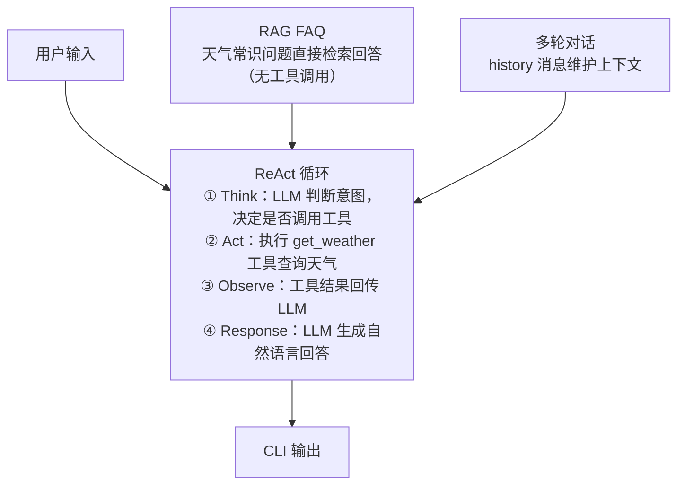

# Weather Agent — AI 天气助手

基于 **ReAct (Reasoning + Acting)** 模式的 AI 天气助手，通过 Function Calling 调用工具查询天气，集成 RAG FAQ 回答天气常识问题。

## 架构概览



## 项目结构

```
src/
├── index.ts                  # 入口
├── cli.ts                    # CLI 交互界面（多轮对话）
├── config.ts                 # 应用配置（环境变量 + Zod 校验）
│
├── prompts/
│   ├── type.ts               # Message / ToolCall 类型定义
│   └── system.ts             # System Prompt + Few-shot 示例 + 消息构建
│
├── agent/
│   ├── type.ts               # Tool / StepEvent 类型定义
│   │
│   ├── re-act/
│   │   └── re-act.ts         # ReAct 循环核心实现
│   │
│   ├── tools/
│   │   ├── weather-tool.ts   # get_weather 工具定义 + 参数校验
│   │   └── weather-tool.test.ts
│   │
│   └── rag/
│       ├── faq.ts            # FAQ 检索（关键词匹配）
│       ├── faq.test.ts
│       └── faq-data.json     # FAQ 知识库
│
└── services/
    ├── const.ts              # 城市别名映射 + 支持城市列表
    ├── type.ts               # WeatherData 类型定义
    ├── weather.ts            # 天气服务（Mock 伪随机数据）
    ├── weather.test.ts
    └── ...
```

## 核心设计

### 1. ReAct 模式

标准的 ReAct 循环（Think → Act → Observe → Response），通过 OpenAI 兼容 API 的 Function Calling 能力实现：

- **Think**：LLM 接收消息 + 工具定义，决定是否调用工具
- **Act**：Agent 执行工具函数，捕获返回结果
- **Observe**：工具执行结果回传给 LLM
- **Response**：LLM 根据观察结果生成最终回答

支持两种分支路径：

- **工具调用路径**（查天气）→ 走完整的 Think → Act → Observe → Response
- **直接回答路径**（闲聊、常识）→ LLM 直接生成回复，无工具调用

### 2. RAG FAQ 检索

当用户问天气相关常识（如"台风天注意什么？"）时，先通过关键词匹配 FAQ 知识库，匹配到的内容作为上下文注入 System Prompt，让 LLM 据此生成回答。

FAQ 检索逻辑（[faq.ts](src/agent/rag/faq.ts)）：

- 提取用户问题的中文关键词（2-4 字滑动窗口）
- 与 FAQ 问题关键词计算重叠比例
- 超过 0.35 阈值则命中，否则走 LLM 自行回答

> 如果用户问题包含城市名（如"北京台风天注意什么"），自动跳过 FAQ，让 LLM 用工具查完天气后自行判断。

### 3. 工具系统

通过统一的 `Tool` 接口定义工具：

```typescript
interface Tool {
  name: string
  description: string
  parameters: Record<string, unknown> // JSON Schema
  execute: (args: Record<string, unknown>) => Promise<string> | string
}
```

- 工具参数使用 **Zod Schema** 定义，支持类型安全校验与自动生成 JSON Schema
- LLM 通过 Function Calling 调用工具，Agent 负责路由和执行

### 4. 天气服务

内置 **Mock 天气服务**（[weather.ts](src/services/weather.ts)）：

- 使用城市名哈希作为种子，**确定性伪随机**生成天气数据（相同城市每次启动结果一致）
- 北京/上海的天气数据固定，与 Few-shot 示例保持一致（北京 25°C 晴 / 上海 22°C 多云）
- 支持 32 个中国城市，包含中文名、英文名、别名（如帝都→北京、魔都→上海）

### 5. Few-shot 示例

System Prompt 中内置 5 组 Few-shot 示例（[system.ts](src/prompts/system.ts)），涵盖：

- 单城市查天气
- 上下文推断城市（"那上海呢？"）
- 多工具并行调用（"北京和上海哪个更暖?"）
- 闲聊回复
- 天气常识回答

> 首轮对话注入 Few-shot，后续轮次不重复注入以避免 Token 浪费。

### 6. 多轮对话

CLI 支持持续多轮对话，维护 `history` 消息列表。上下文推理示例：

```
用户: 北京今天天气怎么样？
助手: 北京今天...（调用工具查北京天气）

用户: 那上海呢？
助手: 上海今天...（根据上文推断城市）
```

### 7. CLI 交互

终端交互式对话（[cli.ts](src/cli.ts)），实时展示 ReAct 各阶段进度：

```
> 北京今天天气怎么样？
  🔧 调用工具: get_weather({"city":"北京"})
  📡 观察结果: get_weather → {"city":"北京","temperature":25...}
  ✅ 回答完成
助手: 北京今天天气晴朗，气温 25°C...
```

## 快速开始

### 环境要求

- [Bun](https://bun.sh) ≥ 1.0
- 一个 OpenAI 兼容的 API Key

### 启动步骤

```bash
# 1. 环境变量
cp .env.example .env
# 编辑 .env 填入你的 API Key

# 2. 安装依赖
bun install

# 3. 启动对话
bun src/index.ts

# 或直接
bun run .
```

### 运行测试

```bash
bun test
```

## 技术栈

| 技术                                                | 用途                             |
| --------------------------------------------------- | -------------------------------- |
| [Bun](https://bun.sh)                               | JavaScript 运行时 + 测试框架     |
| [OpenAI SDK](https://github.com/openai/openai-node) | LLM Function Calling             |
| [Zod](https://zod.dev)                              | 配置校验 + 工具参数校验          |
| [Ora](https://github.com/sindresorhus/ora)          | CLI 加载动画                     |
| [DeepSeek](https://deepseek.com)                    | 默认 LLM 后端（兼容 OpenAI API） |
| [oxlint](https://oxc.rs)                            | Linter                           |
| [oxfmt](https://oxc.rs)                             | 代码格式化                       |

## 学习要点

> 📖 **配套导学**：[doc/01-项目导学.md](doc/01-项目导学.md) —— 结合第一章知识点逐模块精读本项目，含教程↔代码对照与进阶练习

这个项目适合学习以下 AI Agent 模式：

1. **ReAct 循环**：理解 Agent 如何"思考→行动→观察→响应"
2. **Function Calling**：LLM 如何通过工具定义调用外部能力
3. **RAG 集成**：在 Agent 流程中嵌入知识检索
4. **Prompt Engineering**：System Prompt + Few-shot 示例的设计
5. **工具抽象**：统一的 Tool 接口设计与参数校验
6. **多轮对话管理**：维护历史消息实现上下文推理
