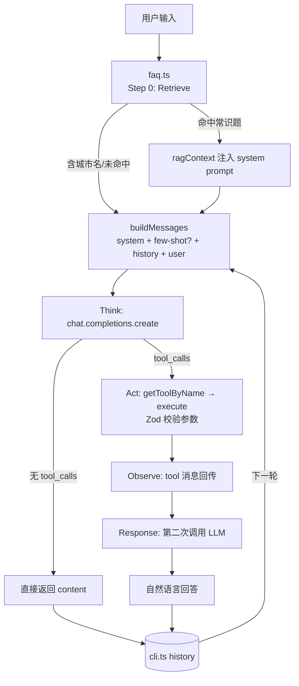

# 01-weather-agent 项目导学

> 用第一章的知识点完整读懂这个项目：ReAct 循环、Function Calling、RAG、记忆、类型安全工具链、Prompt Engineering 在这里全部有落点

> **前置**：完成第一章 1.1～1.6 | **预计时间**：1.5h | **面试可答**：ReAct 循环实现、Tool 接口设计、RAG 注入方式、Few-shot 注入时机

---

## 1. 项目是什么

一个运行在终端里的**多轮对话天气助手**（纯 CLI，无后端框架）：

- 查天气 → 走 **ReAct 循环**，LLM 通过 **Function Calling** 调用 `get_weather` 工具
- 问天气常识（"台风天注意什么"）→ 走 **RAG FAQ 检索**，命中则把知识注入 system prompt
- 闲聊 → LLM 直接回答，零工具调用

代码量约 600 行 + 90 行测试，是第一章所有概念的"最小可运行集成"。

## 2. 知识点 → 代码映射总表

| 教程 | 知识点               | 项目落点                                              | 读什么                                                |
| ---- | -------------------- | ----------------------------------------------------- | ----------------------------------------------------- |
| 1.1  | Token 成本           | Few-shot 仅首轮注入                                   | [system.ts](../src/prompts/system.ts) `buildMessages` |
| 1.2  | ReAct 循环           | Retrieve → Think → Act → Observe → Response           | [re-act.ts](../src/agent/re-act/re-act.ts)            |
| 1.2  | Function Calling     | `Tool` 接口 + `toOpenAiTools` + `tool_choice: 'auto'` | [weather-tool.ts](../src/agent/tools/weather-tool.ts) |
| 1.3  | 短期记忆             | `history` 数组由 CLI 持有、传入 Agent                 | [cli.ts](../src/cli.ts)                               |
| 1.4  | RAG 三阶段           | FAQ 预计算索引 → 关键词检索 → 注入 system prompt      | [faq.ts](../src/agent/rag/faq.ts)                     |
| 1.5  | 配置校验             | `z.object` 校验环境变量，fail-fast                    | [config.ts](../src/config.ts)                         |
| 1.5  | 类型安全工具链       | Zod Schema + `z.toJSONSchema()` + 参数校验            | [weather-tool.ts](../src/agent/tools/weather-tool.ts) |
| 1.6  | Prompt 结构          | 4 条职责指令的 System Prompt + 5 组 Few-shot          | [system.ts](../src/prompts/system.ts)                 |
| 1.6  | 注入防护（指令分离） | RAG 上下文用 `---` 分隔符包裹                         | [system.ts](../src/prompts/system.ts) `buildMessages` |

## 3. 推荐阅读顺序

不要从 `index.ts` 开始（它只有一行 `import './cli'`）。按数据流方向读：

```
1. config.ts          —— 入口最小：环境变量如何被 Zod 拦截（30 行）
2. prompts/type.ts    —— Message / ToolCall 协议，整个系统的"通用语言"
3. services/const.ts  —— 城市别名表，理解"领域数据"长什么样（可跳读）
4. services/weather.ts —— Mock 服务：确定性伪随机是什么意思
5. agent/tools/weather-tool.ts —— Tool 三要素：description + JSON Schema + execute
6. prompts/system.ts  —— System Prompt 与 Few-shot 的组装逻辑
7. agent/rag/faq.ts   —— 微缩 RAG
8. agent/re-act/re-act.ts —— 主线：把前面所有零件串成循环
9. cli.ts             —— 最后一层：UI 如何用 StepEvent 渲染进度
```

详细的数据流推演（一次对话从 JSON 请求到最终回答的 10 步全程）见 [re-act/README.md](../src/agent/re-act/README.md)，本文不重复，只讲"教程概念怎么落进代码"。

## 4. 主线：一次对话的模块协作



---

## 5. 逐个知识点：教程 ↔ 代码对照

### 5.1 ReAct 循环（教程 1.2）

教程 1.2 给的是**抽象基类**写法（`abstract class ReActAgent`，固定主循环 + 三个抽象方法）；项目用的是**函数式**写法：

```ts
// 教程 1.2：类约束"必须实现 thought/action/execute"
abstract class ReActAgent {
  abstract thought(context: string): Promise<string>
  abstract action(thought: string): Promise<Action>
  abstract execute(action: Action): Promise<string>
  async run(task: string): Promise<string> {
    /* 固定循环 */
  }
}

// 项目：直接一个函数，流程硬编码在函数体里
export async function runAgent(
  userMessage: string,
  history: Message[],
  onStep?: (step: StepEvent) => void,
  client: OpenAI = openai // 可注入 LLM 客户端，测试时传 mock
): Promise<string>
```

**两种写法的取舍**：

|          | 教程（抽象类）              | 项目（函数）                                                                                      |
| -------- | --------------------------- | ------------------------------------------------------------------------------------------------- |
| 扩展方式 | 继承、override 单个阶段     | 改函数体 / 拆函数                                                                                 |
| 适用场景 | 多种 Agent 共享同一循环骨架 | 单一 Agent，流程即逻辑                                                                            |
| 可测试性 | 便于 mock 子类              | 依赖注入已预留（`client` 参数，mock 用法见 [re-act.test.ts](../src/agent/re-act/re-act.test.ts)） |

**面试常问：项目的 ReAct 和教程的有什么差异？** 项目在教程的 Think → Act → Observe → Response 之前多了一步 **Retrieve**（FAQ 检索），这是 1.4 RAG 与 1.2 ReAct 的组合形态——检索不是独立环节而是"前置增强"。另外项目的 Observe 只做一轮：拿到工具结果回传后直接生成回答，**没有检查 LLM 是否还想继续调工具**（多轮 ReAct，README「扩展思路」留了练习）。

### 5.2 Function Calling 与 Tool 接口（教程 1.2 / 1.5）

项目 `Tool` 接口（[agent/type.ts](../src/agent/type.ts)）：

```ts
export interface Tool {
  name: string
  description: string
  parameters: Record<string, unknown> // JSON Schema
  execute: (args: Record<string, unknown>) => Promise<string> | string
}
```

与教程 1.2 的 `Tool` 接口几乎一致，两处刻意的差异要读懂：

1. **`execute` 返回 `string` 而不是对象**。`getWeather` 明明返回 `WeatherData`，工具层做了 `JSON.stringify`。原因：工具结果最终要作为 `role: 'tool'` 消息的 `content` 回传给 LLM，字符串是通用格式；文件内容、API 原文等非 JSON 工具也能复用同一接口。教程 1.2 的示例返回对象，是因为那一刻还没走到"回传 LLM"这一层。
2. **`parameters` 是 JSON Schema 而非 Zod Schema**。因为 OpenAI Function Calling 协议只认 JSON Schema。项目用 Zod 定义、再转 JSON Schema，两头都要：

```ts
export const getWeatherSchema = z.object({
  city: z
    .string()
    .min(1, '城市名不能为空')
    .describe('城市名称（支持中文名、英文名或别名...）')
})

// Zod v4 内置 toJSONSchema（教程 05 用的是 zod-to-json-schema 包，v3 时代的方案）
parameters: z.toJSONSchema(getWeatherSchema)
```

`.describe()` 里的文字会进 JSON Schema 的 `description` 字段——**这就是 LLM 看到的参数说明**。参数怎么填全靠这段话教，呼应教程 1.6 "接口描述比示例更有效"的经验。

**执行链上的三层防线**（对照教程 1.2「错误处理」最佳实践）：

```
LLM 给错参数 → Zod safeParse 拒绝（参数校验失败：city: 城市名不能为空）
LLM 给对参数但城市不支持 → InvalidCityError（含支持城市列表，LLM 能据此引导用户）
JSON.parse 失败 → catch 兜底，错误信息写进 tool 消息回传 LLM 致歉
```

注意：任何一层失败都**不会中断循环**，错误被序列化成 tool 消息交给 LLM——这是"让 LLM 看到失败并自行恢复"的设计，而不是 fail-fast 崩掉整个 Agent。

### 5.3 RAG：教程 1.4 三阶段的微缩实现（教程 1.4 / 1.3）

对照教程 1.4 的 `Indexing → Retrieval → Generation`：

| 教程阶段                     | 项目实现                                                     | 位置                                                  |
| ---------------------------- | ------------------------------------------------------------ | ----------------------------------------------------- |
| Indexing（分割+向量化+入库） | **预计算关键词索引**：启动时对每个 FAQ 问题提取 2-4 字关键词 | [faq.ts](../src/agent/rag/faq.ts) `faqIndex`          |
| Retrieval（相似度检索）      | 关键词重叠占比打分，阈值 0.35                                | `retrieveFaq`                                         |
| Generation（上下文增强生成） | 检索结果拼进 system prompt 的 `---` 分隔区                   | [system.ts](../src/prompts/system.ts) `buildMessages` |

这就是教程 1.3「三路召回」里**关键词检索**那条路的独立实现（教程用 bigram，项目用 2-4 字滑动窗口 + 停用词表，思想同源）。项目没有向量检索——FAQ 只有 6 条，关键词匹配零依赖够用，这正是教程 1.4 说的"按数据规模选方案"。

**两个容易忽略的设计细节**：

1. **查天气的问题跳过 FAQ**：`isWeatherQuery` 检测到城市名直接 `return null`。如果"北京台风天注意什么"命中了台风 FAQ，LLM 会拿泛泛的安全建议搪塞，而不是先查北京的实际天气再回答。检索路由也是 Agent 设计的一部分。
2. **Generation 阶段的注入方式**：检索结果拼在 system prompt 末尾、用 `---` 包裹——这正是教程 1.6「指令分离/特殊分隔符」策略的落地，把"参考知识"和"系统指令"在文本上隔开。

**扩展方向**（教程 1.4 的完整版怎么接进来）：把 `retrieveFaq` 换成语义检索（教程 1.4 练习 1 的 `MemoryVectorStore` + `OpenAIEmbeddings`），接口不变，`re-act.ts` 一行不用改——这就是 retrieval 层抽象干净的好处。

### 5.4 短期记忆：history 所有权在调用方（教程 1.3）

```ts
// cli.ts：Agent 不管历史，调用方管
history.push({ role: 'user', content: input })
history.push({ role: 'assistant', content: reply })
```

对应教程 1.3 的**短期记忆（会话上下文管理）**，但做了一个教程里没有强调的架构决策：**history 的读写权分离**。`runAgent` 只读 history，`cli.ts` 负责写。为什么？

- CLI 想存完整对话，Web 端可能要裁剪（对应教程 1.3 滑动窗口/摘要压缩）
- `runAgent` 保持"单次问答"的单一职责，不携带状态

**多轮的上下文推断**（"那上海呢？"）不靠任何特殊代码——第二轮 `buildMessages` 把 history 拼进消息列表，LLM 自己从上文推断城市。Few-shot 场景 2 教会了它这个模式。

**练习**：把教程 1.3 的 `SlidingWindowMemory`（窗口 = 10 条消息）搬进 `cli.ts`，history 超限时丢最旧的 user/assistant 对——防止长会话 token 爆炸（教程 1.1 成本意识的落地）。

### 5.5 类型安全工具链（教程 1.5）

项目是教程 1.5 的"验收现场"：

| 教程 1.5 知识点                   | 项目落点                                                                                |
| --------------------------------- | --------------------------------------------------------------------------------------- |
| Zod 配置验证（3.3 配置验证）      | [config.ts](../src/config.ts)：`safeParse` 失败抛出逐条 issue 的错误信息，fail-fast     |
| 工具参数校验（3.3 工具参数校验）  | [weather-tool.ts](../src/agent/tools/weather-tool.ts) `safeParse` → 抛错 → 进 tool 消息 |
| Bun 内置测试（1.4）               | `bun:test` + `bun test`，34 个用例（含主循环 mock 测试 re-act.test.ts）                 |
| Bun 自动加载 .env（1.5 特有优势） | [config.ts](../src/config.ts) 里 `import 'dotenv/config'` 兜底，Bun 下其实可省略        |
| `z.infer` 类型推断                | `export type AppConfig = z.infer<typeof configSchema>`                                  |

**一个版本演进点**：教程 05 用 `zod-to-json-schema` 包做转换（v3 时代做法），项目用的是 **Zod v4 内置的 `z.toJSONSchema()`**，少一个依赖。两套写法都对，新项目直接用内置版。

**诚实的权衡**：教程 1.5 强调类型安全，项目却在 [re-act.ts](../src/agent/re-act/re-act.ts) 里用了两处 `messages as any`——因为 OpenAI SDK 的 `ChatCompletionMessageParam` 是按 role 区分的复杂联合类型，动态拼装消息时严格类型检查成本很高。README「设计决策」坦白承认了这个权衡。这本身就是教学素材：**类型安全不是教条，在系统边界（第三方 SDK 类型不匹配处）允许局部断言，但要集中在最小范围**。

### 5.6 Prompt Engineering（教程 1.6）

[system.ts](../src/prompts/system.ts) 是教程 1.6 的浓缩案例：

**System Prompt 的职责清单**（对应教程 1.6「明确任务目标」）：

```
1. 查天气 → 调 get_weather        （何时用工具）
2. 省略城市 → 根据上下文推断        （多轮记忆的提示面）
3. 天气常识 → 直接回答不调工具      （何时不用工具）
4. 闲聊 → 直接回复                （分支兜底）
```

**Few-shot 五个场景的选择**（对照教程 1.6「示例选择策略」）：

| 场景                 | 教了 LLM 什么         | 策略                   |
| -------------------- | --------------------- | ---------------------- |
| 北京查天气           | 标准工具调用闭环      | 代表性                 |
| "那上海呢？"         | 上下文省略补全        | 多样性                 |
| "北京和上海哪个暖？" | **并行多 tool_calls** | 多样性（易漏掉的边界） |
| "你好！"             | 闲聊不调工具          | 边界案例               |
| "台风天注意什么？"   | 常识直答不调工具      | 边界案例               |

覆盖了"调/不调、单工具/多工具、有城市/无城市"的正反两面——正是教程说的"覆盖不同类型的边界案例"。

**Token 成本设计**（教程 1.1 的落地）：

```ts
// 多轮对话中，只有 history 为空（首轮）时才带 few-shot 示例
if (history.length === 0) {
  messages.push(...FEWSHOT_EXAMPLES)
}
```

5 组示例约 800 token，若每轮都注入，10 轮对话就多花 8000 token。只注入首轮即可——模式已通过 few-shot 传输完毕，后续轮次靠 history 维持。这是教程 1.1「Prompt 优化：减少不必要的 Token 消耗」最直观的例子。

**Few-shot 与 Mock 数据的一致性锁定**：[weather.ts](../src/services/weather.ts) 里北京 25°C 晴 / 上海 22°C 多云是硬编码 override，和 few-shot 示例里的 tool 消息完全一致，且有测试锁定（`weather.test.ts` 的 `should keep few-shot overrides`）。为什么？few-shot 教了 LLM "北京 25°C"，若真实工具返回 30°C，LLM 可能困惑甚至沿用示例数据——**示例与运行时数据漂移是 Agent 常见坑**，这个测试就是防漂移的。

---

## 6. 面试问答

> **问：这个项目的 RAG 和真正的 RAG 差在哪？**
>
> 答：差在 Retrieval 的实现。完整 RAG 的 Indexing 阶段要 Embedding + 向量入库，Retrieval 用语义相似度。项目只有 6 条 FAQ，用"预计算关键词索引 + 重叠占比打分"就够了，零外部依赖。但架构位置完全一样：都是"先检索、把结果增强进 prompt、再生成"。换掉 `retrieveFaq` 的实现，上层代码零改动。

> **问：为什么工具的 execute 返回字符串而不是结构化对象？**
>
> 答：工具结果最终要作为 `role: 'tool'` 消息回传给 LLM，`content` 就是字符串。统一成字符串让 Tool 接口能容纳天气 JSON、文件内容、API 原文等任意工具；结构化信息通过 JSON 字符串承载，LLM 侧自己解析。

> **问：Few-shot 为什么要限定首轮注入？**
>
> 答：两个原因。一是省 token：示例约 800 token，多轮重复注入是纯浪费；二是防冲突：示例里硬编码的 `tool_call_id`（call_example_1 等）如果反复出现，LLM 可能把"示例里的调用"和"实际的调用"搞混。首轮注入后模式已被学习，后续靠 history 维持。

> **问：工具执行失败，Agent 为什么不崩溃？**
>
> 答：三层防线（Zod 参数校验 → 领域错误 InvalidCityError → JSON.parse 兜底）的失败信息都被序列化成 `role: 'tool'` 消息回传 LLM。LLM 看到错误后通常会致歉并引导用户换城市。这比 fail-fast 更适合 Agent 场景：单工具失败不应终止整个会话。

---

## 7. 动手练习（进阶）

### 练习 1：多轮 ReAct

**要求**：Observe 后检查 `finalResponse.choices[0].message.tool_calls`，若非空则递归执行 Act → Observe，最多 3 轮（防死循环，呼应教程 1.2「Agent 死循环处理」）。

**提示**：把 Step 2/3 的逻辑抽成 `executeToolCalls(messages, tools)` 递归函数；用 `re-act.ts` 现有的 `onStep` 透传事件。测试基座：[re-act.test.ts](../src/agent/re-act/re-act.test.ts) 已演示如何用注入的 mock client 驱动主循环，直接扩展它。

**预期效果**：构造"查完北京天气后 LLM 又想查上海"的场景，CLI 能连续打印多组 🔧 📡。

### 练习 2：history 裁剪（短期记忆压缩）

**要求**：给 `cli.ts` 的 history 加滑动窗口（超过 10 条消息时丢弃最旧的 user/assistant 对），并解释为什么 tool 中间消息不应进 history。

**提示**：教程 1.3 的 `SlidingWindowMemory`；tool 消息依赖 `tool_call_id` 配对的 assistant 消息，裁剪时若拆散配对，LLM 收到的消息序列非法。

**预期效果**：长会话不再无限增长 token，且上下文推断（"那天津呢？"）在窗口内仍然正常。

### 练习 3：用 Promise.all 并行执行工具

**要求**：把 Step 2 的 `for...of` 顺序执行改为 `Promise.all` 并行（保持 toolResults 顺序与 tool_calls 一致），对比两种写法在真实 HTTP 工具下的耗时差异。

**提示**：`Promise.all` 的结果数组天然保序；先 `map` 出 Promise 数组再 `all`。

**预期效果**：并行版多城市查询延迟 = 最慢一次，而不是累加。

### 练习 4：FAQ 升级为向量检索

**要求**：用教程 1.4 练习 1 的 `MemoryVectorStore + OpenAIEmbeddings` 替换 `retrieveFaq` 内部实现，保持函数签名不变（`(query: string) => FaqItem | null`），阈值改为相似度 0.5。

**预期效果**："天气热了怎么办"（无关键词重叠）也能命中 high-temp FAQ——语义检索优于关键词检索的实证。

### 练习 5（选做）：用 LangChain `createAgent` 重写

**要求**：用第二阶段 `createAgent` + `tool()` + Zod 重写同等功能，对比手写 ReAct 的代码量。

**预期收获**：理解框架帮你做了什么（循环、消息拼装、重试），以及手写版的价值（每一步都可见可控）。

---

## 8. 已知简化点（教学取舍，非缺陷）

| 简化点           | 现状                 | 完整做法                               |
| ---------------- | -------------------- | -------------------------------------- |
| Observe 只做一轮 | LLM 二次调工具未处理 | 递归 ReAct（练习 1）                   |
| 无流式输出       | 等完整回复           | `stream: true` + 逐字打印              |
| 工具串行执行     | `for...of`           | `Promise.all`（练习 3）                |
| Mock 天气数据    | 城市哈希伪随机       | 接真实天气 API（工具层替换）           |
| `as any` ×2      | 消息类型断言         | 收敛到 SDK 联合类型（见 5.5 权衡说明） |

---

_参考资料_：

- [ReAct README（数据流推演）](../src/agent/re-act/README.md)
- 教程：doc/01-AI-Agent基础与认知升级/（1.2 ReAct、1.4 RAG、1.5 工具链、1.6 Prompt）
