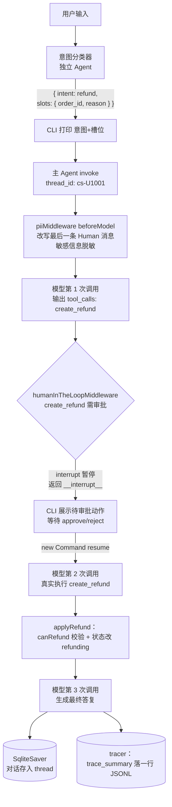

# 02-customer-service 项目导学

> 用第二章的知识点完整读懂这个项目：createAgent、工具系统、双记忆、中间件栈、HITL、自建 Trace、本地评估在这里全部有落点

> **前置**：完成第二章 [2.1～2.7](../../../doc/02-LangChain.js生态深度掌握/01-LangChain.js架构概览.md) | **预计时间**：2h | **面试可答**：意图分类与槽位填充、短期/长期记忆分工、中间件洋葱模型、HITL 恢复机制、自建 Trace 与 Run Tree、Evaluator 设计

---

## 1. 项目是什么

一个运行在终端里的**智能电商客服**（CLI 交互，LangChain v1 全家桶）：

- 每轮输入先经**意图分类器**（独立 Agent）识别 6 种意图 + 抽取槽位
- 主 Agent 按意图路由：查订单 / 退款 / 投诉 / FAQ / 转人工 / 打招呼，背后是 **6 个 Zod 校验的工具**
- **5 层中间件栈**：PII 脱敏 → 模型容错 → 工具限流 → 上下文压缩 → 人工审批（HITL）
- **双记忆**：SqliteSaver 短期对话记忆（跨轮）+ Store 长期用户偏好（跨线程）
- **自建链路追踪**：`BaseCallbackHandler` 把每次调用写成 JSONL Run Tree（LangSmith 的本地替代）
- **本地评估**：意图 / 槽位 / 工具三维 Evaluator 跑 8 条用例数据集

代码量约 1500 行 + 8 套 57 个测试用例，是第二章所有概念的"全栈集成"。

## 2. 知识点 → 代码映射总表

| 教程 | 知识点 | 项目落点 | 读什么 |
| ---- | ------ | -------- | ------ |
| [2.1 架构概览](../../../doc/02-LangChain.js生态深度掌握/01-LangChain.js架构概览.md) | `Command` 恢复中断 | HITL approve/reject 后 resume | [cli.ts](../src/cli.ts) |
| [2.2 模型与消息](../../../doc/02-LangChain.js生态深度掌握/02-模型与消息系统.md) | 模型字符串简写 + 多模型 | `openai:deepseek-v4-flash` 兼容模式 + fallback 链 | [agent.ts](../src/agent/agent.ts) |
| [2.3 工具系统](../../../doc/02-LangChain.js生态深度掌握/03-工具系统.md) | `tool()` 工厂 + Zod + runtime.context | 6 个业务工具（snake_case） | [tools/](../src/agent/tools/index.ts) |
| [2.4 Agent 构建与配置](../../../doc/02-LangChain.js生态深度掌握/04-Agent构建与配置.md) | `createAgent` 全配置项 + 结构化输出 | 主 Agent + 意图分类器双 Agent 架构 | [agent.ts](../src/agent/agent.ts) / [classifier.ts](../src/agent/classifier.ts) |
| [2.5 记忆与状态](../../../doc/02-LangChain.js生态深度掌握/05-记忆与状态管理.md) | Checkpointer / Store / Summarization | SqliteSaver（bun:sqlite 适配）+ InMemoryStore + 上下文压缩 | [memory/](../src/memory/checkpointer.ts) |
| [2.6 中间件系统](../../../doc/02-LangChain.js生态深度掌握/06-中间件系统.md) | PII / Fallback / 限流 / 摘要 / HITL | 5 层中间件栈（洋葱模型） | [agent.ts](../src/agent/agent.ts) |
| [2.7 LangSmith 链路追踪](../../../doc/02-LangChain.js生态深度掌握/07-LangSmith链路追踪.md) | Trace 结构 / Run Tree / 评估工作流 | **自建** JSONL Tracer + 本地 Evaluator（SaaS 替代） | [tracer.ts](../src/observability/tracer.ts) / [evaluator.ts](../src/evaluation/evaluator.ts) |

## 3. 核心名词解释（概念 → 项目落点）

按"是什么 → 在本项目里对应什么"组织，教程链接给原理细节。

### 3.1 Agent 相关

| 名词 | 一句话定义 | 项目落点 |
| ---- | ---------- | -------- |
| **Agent** | 让 LLM 在"模型调用 → 工具执行"循环里自主决策直到给出答案的运行时 | `createAgent` 组装的主 Agent（[agent.ts](../src/agent/agent.ts)） |
| **意图分类器**（Intent Classifier） | 独立的小 Agent，只负责把用户输入归到预定义意图集合并抽取参数，不执行业务 | [classifier.ts](../src/agent/classifier.ts)，6 意图：order_query / refund / complaint / faq_query / handoff / greeting |
| **槽位填充**（Slot Filling） | 从自然语言里抽取结构化参数（订单号、金额、原因），是意图的配套产物 | 分类器输出 `{ intent, slots }`，slots 含 order_id / amount / reason 等 |
| **Tool / Function Calling** | LLM 输出结构化"调用请求"（工具名 + JSON 参数），由运行时真实执行后回传结果 | 6 个工具：query_order / create_refund / search_knowledge / create_ticket / save_preference / get_preferences |
| **ToolRuntime** | 工具执行时注入的运行时上下文，携带 context（身份）与 store（记忆） | [preference.ts](../src/agent/tools/preference.ts) 通过 `runtime.context.userId` 定位用户、`runtime.store` 读写偏好 |
| **结构化输出**（Structured Output） | 用 Schema 约束模型输出为可校验的对象 | 分类器本想用 `responseFormat`，因 DeepSeek 推理模式不支持而降级为"提示词要求 JSON + 手工解析 + `safeParse` 兜底"（见 §6 实测偏差） |

### 3.2 记忆相关

| 名词 | 一句话定义 | 项目落点 |
| ---- | ---------- | -------- |
| **Checkpointer（短期记忆）** | 按 thread 持久化对话状态，让同一会话跨调用记住上下文 | [checkpointer.ts](../src/memory/checkpointer.ts)，thread_id 由用户派生（`cs-U1001`），重启 CLI 能接上 |
| **Thread / thread_id** | 一段对话的隔离单位，同 id 同状态、不同 id 互不可见 | CLI 每用户一条线程；评估时每条用例加随机后缀防串历史 |
| **Store（长期记忆）** | 跨对话、按命名空间组织的键值记忆 | [store.ts](../src/memory/store.ts)，工具里读写 `["users", userId]` 命名空间的 `preferences`，**同 userId 跨线程可读** |
| **Summarization（上下文压缩）** | token 超阈值时把旧消息摘要成一条，保留最近 N 条 | `summarizationMiddleware({ trigger: { tokens: 4000 }, keep: { messages: 20 } })` |

**Checkpointer vs Store 一句话辨析**：Checkpointer 记"这段对话说了什么"（会话维度），Store 记"这个用户是谁、有什么偏好"（用户维度）。

### 3.3 中间件相关

| 名词 | 一句话定义 | 项目落点 |
| ---- | ---------- | -------- |
| **Middleware** | 在 Agent 循环的固定钩子（beforeModel / afterModel / wrapToolCall…）插入逻辑的插件机制 | 5 层栈，见 [agent.ts](../src/agent/agent.ts) |
| **洋葱模型** | beforeModel 按数组顺序执行、afterModel 逆序执行，请求穿过每层像洋葱 | PII 放最外层保证所有模型都拿到脱敏输入 |
| **PII Middleware** | 用正则/检测器识别敏感信息并按策略改写（redact / mask / hash / block） | email redact、phone mask（`13812345678` → `*******5678`）；**只改写发给模型的最后一条用户消息，图状态里仍是原文**（属预期） |
| **Model Fallback** | 主模型失败时按序降级到备选模型 | `modelFallbackMiddleware(...FALLBACK_MODELS)` |
| **Tool Call Limit** | 限制单次运行工具调用次数，防 Agent 死循环 | `toolCallLimitMiddleware({ runLimit: 10, exitBehavior: 'end' })` |
| **HITL（Human-in-the-Loop）** | 高危工具执行前暂停（interrupt），等人工决策（approve/reject/edit）再恢复 | create_refund / create_ticket 触发中断；CLI 用 while 循环处理连续多轮中断（[cli.ts](../src/cli.ts)） |
| **Command / resume** | 恢复被中断运行的机制：同 thread_id 用 `new Command({ resume })` 重入 | CLI 收集 approve/reject 后 resume，decisions 按 actionRequests 数量映射 |

### 3.4 可观测与评估相关

| 名词 | 一句话定义 | 项目落点 |
| ---- | ---------- | -------- |
| **Trace（链路）** | 一次 Agent 调用的完整执行记录，含每步模型/工具调用的输入输出、耗时、token | [tracer.ts](../src/observability/tracer.ts) 输出 `data/traces.jsonl` |
| **Run Tree（运行树）** | Trace 的树形结构：每个 run（llm/tool/chain）有 runId，parentRunId 指向父级 | 回调的 `runId` / `parentRunId` 参数；顶层 chain 结束时输出 `trace_summary` 汇总 |
| **Callback Handler** | LangChain 在执行各阶段回调的监听器（`handleLLMStart/End`、`handleToolStart/End`…） | `JsonlTraceHandler` 继承 `BaseCallbackHandler`，通过 invoke config 的 `callbacks` 注入 |
| **Dataset / Evaluator** | 评估数据集 + 打分函数（返回 `{ key, score, comment }`），构成回归测试 | [test-data.json](../src/evaluation/test-data.json) 8 条用例；三维 Evaluator：意图正确性 / 槽位完整性 / 工具调用是否符合预期 |
| **LangSmith** | LangChain 官方 SaaS 可观测平台（免费档 5k traces/月） | 本项目选择自建替代（零外部依赖、学习价值高），概念与 2.7 文档同构 |

## 4. 融会贯通：一次退款对话的全流程

把上面所有名词串成一条线——用户输入"我要退 ORD-2601，不想要了"后发生了什么：

**这条线里每个知识点各司其职**：

1. **分类器**只做路由与抽参，不碰业务——所以它没有工具、可以换小模型
2. **中间件是洋葱**：PII 在最外层先处理，HITL 在最内层拦截——所以模型从第 1 次调用起看到的就是脱敏后的消息
3. **HITL 本质是"带闸门的工具"**：工具不直接执行，先 interrupt；人类决策通过 `Command({ resume })` 把控制权交回图
4. **SqliteSaver 是 HITL 的前提**：中断时状态落盘，resume 才能从断点继续——没有 Checkpointer 的 HITL 是空中楼阁
5. **Trace 是旁观者**：整条链路的每次模型/工具调用都被 CallbackHandler 记下来，出问题先看 `data/traces.jsonl`

## 5. 三方对比：自建 Trace vs LangSmith vs Langfuse

| 维度 | 自建 CallbackHandler（本项目） | LangSmith（教程 2.7 主题） | Langfuse（开源替代） |
| ---- | ----------------------------- | -------------------------- | -------------------- |
| 接入成本 | 一个类 + invoke 传 `callbacks`，零外部依赖 | 环境变量零代码侵入，需注册 API Key | 云版改 2 行；自托管 5~6 个容器 |
| Trace 可视化 | 无 UI，jq / DuckDB 分析 JSONL | 开箱即用 Timeline / 看板 | 开源 Web UI |
| Run Tree 语义 | **自己实现**（学习价值：彻底理解结构） | 自动 | 自动 |
| 评估（Dataset + Evaluator） | 本地 JSON + 纯函数，自己写 runner | 内置 `evaluate` + 云端数据集 | 自有 dataset/eval SDK |
| 数据主权 / 合规 | 完全本地 | 云端（企业版可自托管） | 可完全自托管 |
| 成本 | 免费 | 免费档 5k traces/月，超出计费 | 免费档 5 万 events/月 |

**一句话总结**：生产看板选 LangSmith/Langfuse，理解原理选自建——本项目两者兼顾：自建实现 + 文档 2.7 的平台概念。

## 6. 实测偏差与踩坑（版本相关，必看）

这些是教程概念落到当前版本（langchain 1.x / zod 4 / Bun 1.x / DeepSeek）时的真实偏差，教程文档没有、面试可以讲：

| 偏差点 | 教程写法 | 实际情况与解法 |
| ------ | -------- | -------------- |
| SqliteSaver 初始化 | `SqliteSaver.fromConnString(path)` | 内部用 better-sqlite3，Bun 下 ABI 崩溃。解法：`bun:sqlite` 包一层兼容适配器（`pragma()` / `get()` 空行语义 / `exec`→`run`）再 `new SqliteSaver(adapter)` |
| zod 4 枚举兜底 | `z.enum([...]).catch('unknown')` | TS 报错（catch 值必须枚举成员）。解法：`z.union([z.enum([...]), z.literal('unknown')]).catch('unknown')` |
| DeepSeek 推理模式结构化输出 | `responseFormat: Schema` | 既不支持 toolStrategy 也不支持 json_schema。解法：提示词要求 JSON + 手工解析 + `safeParse` 兜底回退 unknown |
| PII 改写范围 | "脱敏用户输入" | `beforeModel` 只改写**最后一条 Human 消息**后发模型；Checkpointer 状态里仍是原文（预期，但排查 trace 时别误判为失效） |
| HITL 中断读取 | `streamEvents` + `getState` | 本版本 getState/getInterrupts 类型为 never（内部 API）。解法：`invoke` 返回值直接带 `__interrupt__` |
| 回调签名 | 统一的第 4 参 parentRunId | 各不相同：`handleLLMStart` 是第 4 参、`handleChainStart` 是**第 8 参**，位置错会 TS override 报错 |
| CLI 脚本化输入 | `rl.question()` 直接循环 | 等待 LLM 期间管道缓冲的行会被 readline 当事件吞掉。解法：`line` 事件入队 + 按需取的 `readLine()` |

## 7. 面试问答

> **问：为什么用两个 Agent（分类器 + 主 Agent），而不是一个大 Agent 全包？**

> 答：职责分离。分类器是无工具的小模型调用，输出 `{ intent, slots }` 供日志展示与 greeting 短路，成本可控且失败可降级（回退 unknown 不阻断）；主 Agent 持有全部工具与中间件栈，专注业务执行。这样分类器可以独立换模型/改提示词，互不影响。权衡：每轮多一次 LLM 调用；unknown 意图不拦截，靠主 Agent 的 system prompt 自行路由兜底。

> **问：Checkpointer 和 Store 都是"记忆"，什么场景用哪个？能互相替代吗？**

> 答：不能。Checkpointer 按 thread_id 存完整对话状态（消息、待恢复的中断），生命周期是会话；Store 按命名空间存结构化事实（用户偏好），生命周期是用户。本项目验证过：线程 A 保存的称呼，线程 B（同 userId、全新 thread）能通过 Store 读出——这是 Checkpointer 做不到的。反过来"上句说了什么"也只有 Checkpointer 能答。生产中 Checkpointer 换 PostgresSaver、Store 换 PostgresStore 即可，接口不变。

> **问：HITL 的实现原理是什么？如果一轮同时触发两个高危工具怎么办？**

> 答：humanInTheLoopMiddleware 在工具执行前检查 interruptOn 配置，命中则向图外抛 interrupt 并持久化状态；调用方从 invoke 返回值的 `__interrupt__` 读到待审批动作，收集决策后用 `new Command({ resume: { decisions } })` 同 thread_id 重入，图从断点继续。并行多工具会聚成一次多 actionRequest 的中断；本项目 CLI 用 while 循环处理——resume 后仍可能再次中断，循环直至无中断，decisions 按 actionRequests 数量一一映射。

> **问：不用 LangSmith，怎么给自己的 Agent 做链路追踪？**

> 答：继承 `BaseCallbackHandler`，实现 handleLLMStart/End、handleToolStart/End、handleChainStart/End 等钩子；回调参数里的 runId / parentRunId 构成 Run Tree，每个 run 结束时把名称、耗时、token（`llmOutput.tokenUsage` 或 `usage_metadata`）、输入输出摘要写成 JSONL；子 run 的 token 向上聚合，顶层 chain 结束输出 trace_summary。通过 invoke config 的 `callbacks` 注入，零侵入。局限：没有可视化与采样，生产可平移到 Langfuse/OTel——因为概念同构，迁移成本只是换 handler。

> **问：你的评估体系怎么设计的？和单元测试有什么区别？**

> 答：数据集是 8 条 `{ input, expected_intent, expected_slots?, expected_tool? }` 用例，覆盖 6 种意图；Evaluator 是 `(case, run) → { key, score, comment }` 的纯函数，三个维度：意图正确性、槽位完整性（String 化比较兼容数字金额）、工具调用符合预期（从 ToolMessage.name 提取实际调用）。与单测的区别：单测断言确定性代码路径（fakeModel 驱动），评估断言 LLM 行为是否符合预期（可跑真实模型），用于回归对比 Prompt/模型版本——换模型重跑一次，看通过率变化。HITL 类工具（create_refund/create_ticket）会中断等待人工，所以相关用例只评估意图与槽位，不设 expected_tool。

## 8. 自检清单

读完本文，你应该能不看代码回答：

- [ ] 一次退款对话从输入到落盘经过哪几层中间件？顺序为何重要？
- [ ] Checkpointer 和 Store 分别解决什么问题？各自的 key 是什么？
- [ ] `__interrupt__` 从哪来、`Command({ resume })` 到哪去？
- [ ] JSONL 里一行 trace 和 LangSmith UI 里一条 Trace 的结构对应关系？
- [ ] 三个 Evaluator 各自校验什么？为什么槽位比较要用 String 化？

---

## 参考链接

- [LangChain.js Agents 官方文档](https://docs.langchain.com/oss/javascript/langchain/agents)
- [Middleware 内置中间件](https://docs.langchain.com/oss/javascript/langchain/middleware/built-in.md)
- [Tracing 官方文档](https://docs.langchain.com/oss/javascript/langchain/tracing)
- 本仓库教程：[第二章 2.1～2.7](../../../doc/02-LangChain.js生态深度掌握/01-LangChain.js架构概览.md)
- 项目实现细节：[todo.md](../todo.md)（含各 Phase 实测偏差记录）
