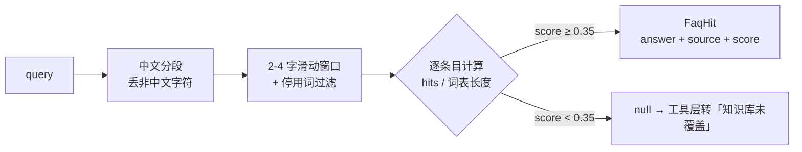

# 03-1 FAQ 关键词检索：滑动窗口 + 重叠比阈值

> 对应 todo §3.1 `src/services/faq-search.ts`。这是 `search_policy` 工具的后端——
> 本步写完，下一步（03-2）才把它包成 Agent 可调用的工具。
> 前置阅读：01 项目 [faq.ts](../../01-weather-agent/src/agent/rag/faq.ts)（同款手法），本项目 README「政策 FAQ 检索」节。

## 1. 定位：一段「没有 LLM」的检索

整份 faq-search.ts 里没有一个模型调用——它是**纯函数**：

```text
输入  query: string（模型构造的政策问题或用户原话）
输出  FaqHit | null（命中条目 + 得分 / 未命中）
```

为什么第一章都学过向量检索了还用关键词匹配？回看 README 亮点 2：

> **检索即工具**：对 Agent 而言 `search_policy` 与 `query_order` 没有本质区别——第四章把后端整体替换为向量检索时，Agent 与工具接口零改动。

本步的教学重心是**工具与检索的解耦形态**，不是检索算法本身。01 已会的技术直接复用，第四章换成「切块 → Embedding → Qdrant」时只动这一个文件。

## 2. 数据契约：kb/policy-faq.json

```json
{
  "id": "faq-refund-7day",
  "keywords": ["七天无理由", "退货", "退款", "政策"],
  "answer": "签收后 7 天内支持无理由退货退款……",
  "source": "《售后服务政策》v3.2 §1.1"
}
```

| 字段       | 作用     | 备注                               |
| ---------- | -------- | ---------------------------------- |
| `keywords` | 命中词表 | **手工维护**，是检索唯一的「索引」 |
| `answer`   | 标准答案 | 命中后原样返回给模型组织话术       |
| `source`   | 出处     | 迫使模型回答可溯源，抑制编造       |
| `id`       | 条目标识 | trace / eval 报告里定位用          |

**与 01 的关键差异**：01 的关键词从 `question` 字段自动抽取（`extractKeywords(question)` 预计算）；本项目**手工写词表**。原因：政策条目的命中行为必须可控——Few-shot、评估用例、FAQ 答案三者要共用同一套事实（01 项目的 Mock 确定性思想），自动抽取的碎片词不可审计。

## 3. 算法走读：三段式

### 3.1 中文分段 + 停用词

```typescript
const segments = text.split(/[^\u4e00-\u9fff]+/).filter(Boolean)
```

按非中文字符切段：`"USB-C 扩展坞怎么退"` → `["扩展坞怎么退"]`（英文/数字/标点全部丢弃）。政策问答里品牌型号不影响命中，丢掉是可接受的粗糙。

### 3.2 2-4 字滑动窗口

```typescript
for (let i = 0; i < seg.length; i++) {
  for (let j = i + 2; j <= Math.min(i + 4, seg.length); j++) {
    const word = seg.slice(i, j) // 长度 2~4 的所有子串
    if (!STOP_WORDS.has(word)) keywords.push(word)
  }
}
```

以「退款政策」为例，产出 5 个窗口碎片：

```text
退款  款政  政策  退款政  款政策
```

窗口下限 2：单字区分度太低（「退」「货」单独出现会疯狂误命中）；上限 4：中文词绝大多数 ≤ 4 字，5+ 字的「长词」可以靠双向包含兜住（见 3.3）。`STOP_WORDS` 过滤「怎么」「什么」这类每个问题都有的碎片，否则所有 query 都会互相命中。

### 3.3 双向包含匹配

```typescript
const hits = entry.keywords.filter((kw) =>
  queryKeywords.some((qk) => qk.includes(kw) || kw.includes(qk))
).length
```

双向（`kw ⊆ qk` 或 `qk ⊆ kw`）各救一个方向：

- `kw = '没发货'`，query 窗口只有 `'发货'` → `kw.includes(qk)` ✓
- `kw = '七天无理由'`（5 字，窗口最多 4 字抽不到整词），query 有碎片 `'无理由'` → `kw.includes(qk)` ✓

### 3.4 重叠比与阈值

```typescript
const score = hits / entry.keywords.length // 分母是【条目词表长度】
return best.score >= MATCH_THRESHOLD ? hit : null // 阈值 0.35
```

**分母选择是 01 手法的灵魂**：衡量的是「条目的词表被 query 覆盖了多少」，而不是 query 被条目覆盖了多少。query 动辄产出几十个碎片，分母若是 query 词数，得分会普遍偏高、失去区分度。

## 4. 阈值数学：0.35 意味着什么

| 词表长度 | 1 词命中 | 2 词命中 | 3 词命中 |
| -------- | -------- | -------- | -------- |
| 2        | 0.50 ✓   | 1.00 ✓   | —        |
| 3        | 0.33 ✗   | 0.67 ✓   | 1.00 ✓   |
| 4        | 0.25 ✗   | 0.50 ✓   | 0.75 ✓   |
| 5        | 0.20 ✗   | 0.40 ✓   | 0.60 ✓   |

**词表长度就是灵敏度旋钮**：3 词表要求至少 2 词命中，4 词表允许 2/4。这不是玄学——是第一步就设计好的分母。

### 4.1 实测复盘（本步真实冒烟数据）

16 条典型 query 的首轮结果：14 命中，3 条 miss 全部是**词表灵敏度**问题，靠调词表修复：

| query          | 首轮   | 根因               | 修复                                   |
| -------------- | ------ | ------------------ | -------------------------------------- |
| 退款政策是什么 | 未命中 | 「退款」1/4 = 0.25 | 词表加「政策」→ 2/4 = 0.50 ✓           |
| 怎么免邮       | 未命中 | 「免邮」1/4 = 0.25 | 词表缩到 `[免邮, 运费]` → 1/2 = 0.50 ✓ |
| 怎么开发票     | 未命中 | 「发票」1/3 = 0.33 | 词表缩到 `[发票, 开票]` → 1/2 = 0.50 ✓ |

三条修复对应三种调参方向：**加高价值词**（政策）、**删词换灵敏度**（免邮）、**删低频词**（抬头）。

调参后的完整命中表（score 为真实运行值）：

| query                 | 命中条目               | score |
| --------------------- | ---------------------- | ----- |
| 退款政策是什么        | faq-refund-7day        | 0.50  |
| 七天无理由退货        | faq-refund-7day        | 0.50  |
| 商品质量有问题        | faq-refund-quality     | 0.40  |
| 退款多久到账          | faq-refund-timeline    | 0.40  |
| 已经发货了想退货      | faq-refund-ship        | 0.50  |
| 还没发货想取消订单    | faq-order-cancel       | 0.67  |
| 物流多久能送到        | faq-logistics-time     | 0.60  |
| 查不到物流单号        | faq-logistics-tracking | 0.75  |
| 会员积分怎么算        | faq-member-points      | 0.50  |
| 怎么免邮              | faq-member-shipping    | 0.50  |
| 怎么换绑手机号        | faq-account-phone      | 0.50  |
| 注销账号              | faq-account-cancel     | 0.67  |
| 怎么开发票            | faq-invoice-issue      | 0.50  |
| 换开发票              | faq-invoice-red        | 0.67  |
| 你好呀 / 今天天气不错 | （正确未命中）         | —     |

> 💡 「你好呀」为什么未命中：抽出的碎片（好呀/你好呀）与所有政策词表零重叠。停用词表负责滤掉「什么/怎么」这类万能碎片，防止所有 query 互相命中——去噪靠它，闲聊防误命中靠「重叠为零」。
>
> ⚠️ 关键词检索的天花板也要心里有数：「运费谁出」「发票丢了」这类同义改写全靠词表覆盖，覆盖不住就 miss。这正是第四章向量检索（语义相似度）要解决的问题——**现在如实 miss 比瞎命中好**，工具层会转「知识库未覆盖」。

## 5. API 设计的两个决策

1. **未命中返回 `null`，文案常量放这里但不掺进返回值**：`FAQ_MISS = '知识库未覆盖'` 由 03-2 的工具层拼进返回内容。检索层保持纯数据（FaqHit | null），话术是工具的职责——分层才可测。
2. **FaqHit 带 `score`**：调用方（工具 → trace → eval）能看到「为什么命中」，调词表时有据可依。检索可观测性从返回值开始。

## 6. 流程图



## 7. 自测

下一步 `test/faq.test.ts` 将覆盖三路径：命中 / 阈值边界（0.34 vs 0.35 的分数差）/ 未命中。本步的手工冒烟方式（项目根目录）：

```bash
bun -e 'import("./src/services/faq-search.ts").then(m => console.log(m.searchPolicyFaq("退款政策是什么")))'
```

## 8. 下一步

- 03-2：`test/faq.test.ts` 三路径单测（命中 / 阈值边界 / 未命中）
- 03-3：把 `searchPolicyFaq` 包成 `search_policy` 工具（描述注明「仅限政策/规则类问题」）
