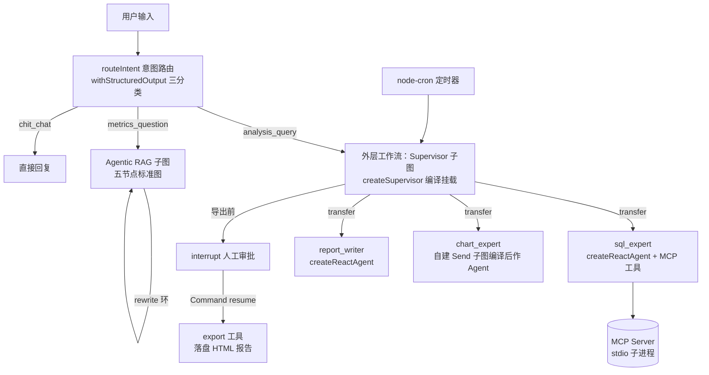
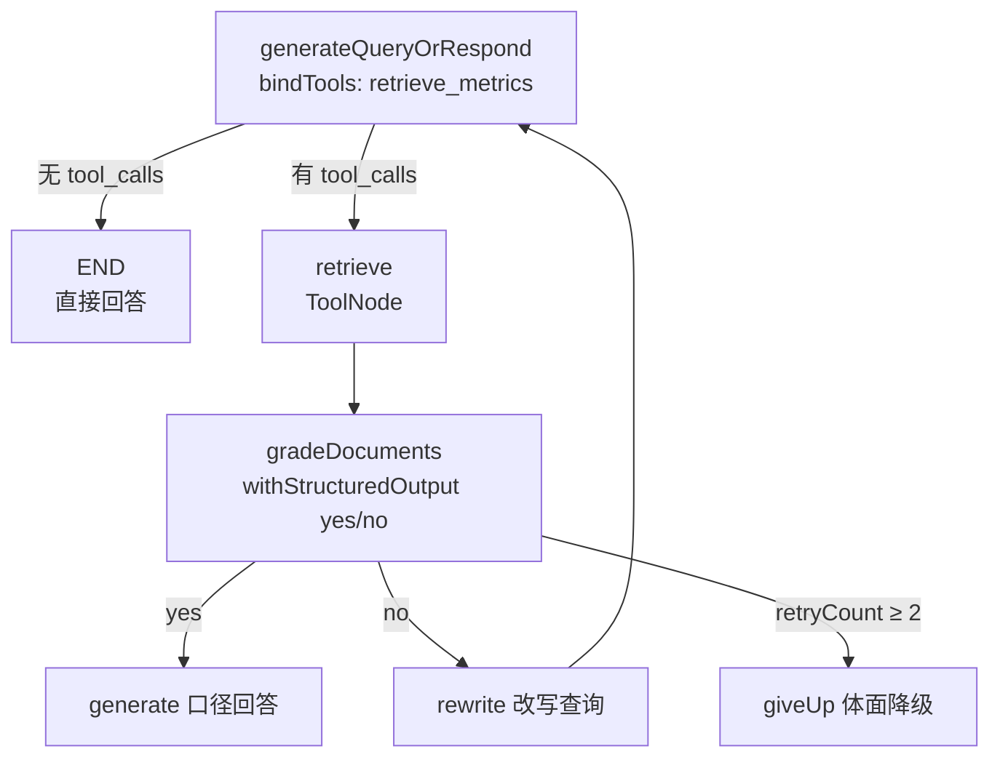

# 实战项目 03：数据分析助手（多 Agent 协作版）

## 项目概述

构建一个基于 **LangGraph.js** 的**命令行多 Agent 数据分析助手**。用户用自然语言提出分析问题（"上个月华南区的销售额趋势如何"），系统由 **Supervisor 调度三个专家 Agent**（SQL 查询 → 图表生成 → 报告撰写）协作完成分析，产出含图表的 HTML 报告。全程覆盖第三阶段核心能力：**多 Agent 编排、Agentic RAG 指标口径问答、MCP 工具服务、并行扇出、Human-in-the-Loop 审批、容错降级、定时报表**。

> 本项目为第三阶段收官项目，是前两个项目的能力跃迁：02 用的是 `createAgent` 预置循环，03 下沉到 **LangGraph 显式图编排**——Supervisor 多 Agent、子图、Send 并行、interrupt 原语全部亲手组装。业务数据为本地 SQLite 销售数据集（seed 脚本生成），零外部服务依赖。
>
> **范围声明**：本项目的「多数据源」指业务 SQLite 库 + 指标口径知识库两个源；接入真实向量库（Milvus/Qdrant）与 ES 后升级为生产级检索，留待第四章（与 3.3 的 mock 检索替换同批）；「数据安全」本期落地为 SQL 只读白名单 + 参数化查询的初级形态，完整认证/角色权限体系在第八阶段（对齐大纲安排）。

## 知识点映射

### Phase 3 核心知识点（本题主线）

| 文档 | 应用点 |
| ----------------------------- | -------------------------------------------------------------------------------------------------------------------------- |
| **3.1 LangGraph 核心概念** | `StateSchema` + reducer 定义工作流状态；条件边路由（SQL 白名单判断、giveUp 降级）；`recursionLimit` 防多 Agent 循环失控 |
| **3.2 LangGraph 高级模式** | `interrupt()` + `Command({ resume })` 实现报告导出审批；Agentic RAG 封装为**子图**挂载；`Send` 并行扇出多维度图表；`SqliteSaver` + durability |
| **3.3 Agentic RAG** | 指标口径知识库：`generateQueryOrRespond → retrieve → gradeDocuments → generate / rewrite` 标准五节点图，retryCount 上限 + giveUp 体面降级 |
| **3.4 多 Agent 编排** | `createSupervisor` 编排三专家（⚠️ JS 参数是 `llm`、返回值需 `.compile()`）；`outputMode` 上下文策略；`responseFormat` 结构化收口 |
| **3.5 MCP 开发** | 自写 **stdio MCP Server**（`get_schema` / `query_sales` / `search_metrics`），`@langchain/mcp-adapters` 桥接为 SQL Agent 的工具 |
| **3.6 DeepAgents 框架** | 高级选装：报告 Agent 换 `createDeepAgent`（虚拟文件系统落盘报告草稿 + `todoListMiddleware` 任务规划） |
| **3.7 企业级实践** | 节点级 `retryPolicy` + `timeout` + `errorHandler` 降级链；`modelFallbackMiddleware`；五层上线 checklist 落地 |

### 前置知识点（Phase 1 / 2）

| 文档 | 应用点 |
| ------------------- | -------------------------------------------------------------------------------------- |
| **1.4 RAG 架构** | 口径知识库的检索与打分基础（Agentic RAG 是其升级版） |
| **1.5 TS + Bun + Hono** | Bun + TypeScript 全程；高级选装用 Hono 起 `/reports` 查看端点 |
| **1.6 Prompt Engineering** | 三专家的 systemPrompt 设计（SQL 专家的 schema 注入、报告专家的格式约束） |
| **2.3 工具系统** | 本地工具 `tool()` + Zod（导出报告、预警判定）；工具描述即路由规则 |
| **2.4 结构化输出** | 图表配置 `responseFormat`（ECharts option Zod Schema）、Supervisor `responseFormat` 收口 |
| **2.5 记忆管理** | `SqliteSaver` 会话持久化；多轮分析对话的上下文延续 |
| **2.6 中间件** | `modelFallbackMiddleware` 降级链；`summarizationMiddleware` 管理长分析会话 |
| **2.7 LangSmith** | 多 Agent 调用链追踪（每 Agent 打 name 区分），与 3.4 的调试手段互相印证 |

## 项目亮点

1. **Supervisor 多 Agent 编排**：不手写调度逻辑，用 `createSupervisor` 让调度模型按任务派活，理解「委派接口 = 子 Agent 的 name/prompt」
2. **工具服务化（MCP）**：SQL 查询能力做成独立 MCP Server 进程——同一份能力可被任何 MCP 宿主复用，体会「Agent 连工具」的协议化
3. **Agentic RAG 子图**：指标口径问答不是固定管道——模型决定「要不要查口径库」，检索结果过结构化打分闸门，不合格改写重试、超限 giveUp
4. **动态并行**：多维度图表用 `Send` 运行时扇出，结果经 reducer 汇合——对比 02 的串行工具循环，体验图的并行表达力
5. **原生 interrupt 审批**：报告导出前暂停等人工确认，掌握 3.2 的恢复语义（节点重跑、幂等）
6. **容错分层**：节点级 retry/timeout/errorHandler（LangGraph）+ 调用级降级链（Middleware），降级可观测（degraded 标记）
7. **定时任务**：node-cron 每日自动产出昨日日报 + 阈值预警，体验「Agent 作为常驻服务」

## 技术栈

```
Runtime:     Bun 1.2+ / Node.js 22+
Language:    TypeScript 5.x
Framework:   langchain v1 + @langchain/langgraph v1（显式图编排）
Multi-Agent: @langchain/langgraph-supervisor
MCP:         @modelcontextprotocol/sdk（自写 stdio Server）+ @langchain/mcp-adapters
Interface:   CLI（交互分析）+ 常驻进程（定时报表）
Validation:  Zod
Database:    better-sqlite3（业务销售数据集，只读查询）
Persistence: @langchain/langgraph-checkpoint-sqlite（SqliteSaver Checkpointer）
Scheduler:   node-cron（轻量定时的；BullMQ/Redis 留待第六阶段）
Charts:      ECharts option JSON → 静态 HTML 报告
Tracing:     LangSmith（环境变量；Langfuse 留待第七阶段深入）
```

## 数据集设计（seed 脚本生成）

`bun run db:seed` 生成 `data/analytics.db`，三张表 + 刻意准备的「坑」：

| 表 | 字段 | 数据特点 |
| -- | ---- | -------- |
| `orders` | id, order_date, region, category, product_name, amount, status | 12 个月 × 4 大区 × 5 品类，约 2000 行；**混入少量脏数据**（负金额、未来日期、NULL region） |
| `products` | id, name, category, unit_price | 与 orders 的 product_name 关联 |
| `sales_target` | month, region, target_amount | 各月各大区目标值（供达标率分析） |

脏数据的作用：SQL Agent 必须在 prompt 中学会 `WHERE amount > 0 AND region IS NOT NULL` 等防御性过滤——「数据清洗意识」是 NL2SQL 的真实难点。

## 架构设计

### 总体流程



### 三个专家 Agent 的分工

| Agent | 职责 | 工具 | 模型建议 |
| ----- | ---- | ---- | -------- |
| `sql_expert` | 把分析需求转成只读 SQL 并执行，返回表格数据 | MCP：`get_schema` / `query_sales` / `search_metrics` | 主力模型 |
| `chart_expert` | 把表格数据按维度转成 ECharts option JSON（一图一 option） | 无（**自建 Send 子图**，编译后作 Agent 传入，见下节） | mini 模型可胜任 |
| `report_writer` | 汇总数据与图表结论，产出 Markdown 报告正文 | 无 | 主力模型 |

**为什么这样拆**（对应 3.4 面试题）：三个角色的工具面完全不重叠，委派边界清晰；`chart_expert` 是纯结构化生成，用 mini 模型省钱；Supervisor 的价值在「决定派活顺序与是否返工」，而不是自己干活。

### chart_expert：自建 Send 子图（关键设计）

`chart_expert` **不能**用 `createReactAgent`——预置的 model→tools 循环里塞不进 `Send` 条件边。正确做法是把并行出图做成**自建子图**，编译后作为 agent 传给 `createSupervisor`（这正是 3.4 Hierarchical 验证过的官方模式：编译图可当 Agent）：

```typescript
// chart 子图：Send fan-out → reducer 汇合 → 结构化校验
import { StateGraph, StateSchema, ReducedValue, START, END, Send } from '@langchain/langgraph'
import { chartOptionSchema } from '../prompts/chart-schema.ts' // ECharts option Zod

const ChartState = new StateSchema({
  dimensions: z.array(z.object({ name: z.string(), data: z.string() })), // Supervisor 传入的维度清单
  charts: new ReducedValue(
    z.array(chartOptionSchema).default(() => []),
    { inputSchema: chartOptionSchema, reducer: (cur, next) => [...cur, next] } // 并行结果汇合
  )
})

const renderChart = async ({ dimension }: { dimension: { name: string; data: string } }) => {
  const option = await chartModel.withStructuredOutput(chartOptionSchema).invoke(/* 按维度生成 */)
  return { charts: [option] } // reducer 自动追加汇合
}

const chartSubgraph = new StateGraph(ChartState)
  .addNode('render_chart', renderChart)
  .addEdge(START, 'split')
  .addNode('split', async () => ({}))
  .addConditionalEdges('split', (s) => s.dimensions.map((d) => new Send('render_chart', { dimension: d })))
  .addEdge('render_chart', END)
  .compile({ name: 'chart_expert' }) // 编译后作为 createSupervisor 的 agent 传入

// createSupervisor({ agents: [sqlExpert, chartSubgraph, reportWriter], ... })
```

**这个设计的双重教学价值**：一是 3.2 的 Send 并行 + reducer 汇合有了真实落点；二是 3.4 的「编译图当 Agent」（Hierarchical 的底层手法）从概念变成必需——如果用 `createReactAgent` 反而做不出动态并行。

> ⚠️ Send 子图的入参约定：Supervisor 是通过 handoff 工具调用子 Agent 的，`dimensions` 清单要作为 handoff 调用参数传入——sql_expert 产出的表格数据需由 Supervisor 在派活时结构化传递。若实现时发现消息形态传递不稳，可给 chart 子图加一个轻量输入转换节点（3.2 模式 B）。

### 意图路由：谁来分流「分析 vs 口径 vs 闲聊」

架构图里 Supervisor 与 RAG 子图走不同分支，分流由外层工作流的**第一个节点** `routeIntent` 完成（02 项目意图分类器的经验直接复用，这里是 3.1 条件边的实战练习）：

```typescript
const routeIntent = async (state: typeof WorkflowState.State) => {
  const classifier = routeModel.withStructuredOutput(RouteSchema) // mini 模型
  const { intent, reply } = await classifier.invoke({ question: state.messages.at(-1)?.content })
  return { intent, reply } // chit_chat 时 reply 直接可用
}

const workflow = new StateGraph(WorkflowState)
  .addNode('routeIntent', routeIntent)
  .addNode('analysis', analysisNode)   // 内部 invoke supervisor 子图（见下节）
  .addNode('metricsQa', ragSubgraph)   // 口径问答子图直接挂载（共享 messages）
  .addNode('directReply', directReply)
  .addEdge(START, 'routeIntent')
  .addConditionalEdges('routeIntent', (s) =>
    s.intent === 'analysis_query' ? 'analysis'
    : s.intent === 'metrics_question' ? 'metricsQa'
    : 'directReply')
  // ...
```

`RouteSchema`：`z.object({ intent: z.enum(['analysis_query', 'metrics_question', 'chit_chat']), reply: z.string().optional() })`。判定规则写进 classifier prompt：涉及取数/趋势/对比/图表 → analysis；问指标定义/口径/计算方式 → metrics_question；问候与无关闲聊 → chit_chat。

### 子图接线：responseFormat 结果怎么流回外层（本项目核心接线题）

`createSupervisor` 的 `responseFormat` 产物写在**子图内部 state** 的 `structuredResponse` key 上——外层 `WorkflowState` 若没有对应 key 就拿不到。两种接法（3.2 §2.1/2.2 的选型题）：

| 方案 | 做法 | 取舍 |
| ---- | ---- | ---- |
| **A. 共享 key 挂载（本项目选型）** | `WorkflowState` 与 supervisor 共享 `messages` **和** `structuredResponse` 两个同名 key（reducer 用 last-value 覆盖）；supervisor 编译图直接 `addNode` 挂载 | 同名 channel 自动对接，外层每轮结束后直接读 `state.structuredResponse`；supervisor 的对话历史与派活状态由外层 checkpointer 统一持久化，interrupt 审批语义最干净 |
| B. 包装节点转换 | 外层节点内 `await supervisor.invoke({ messages: state.messages })`，手工取 `out.structuredResponse` 回填 | 上下文隔离更彻底，但 supervisor 需要独立持久化才能多轮延续（与 P1 原则冲突），或退化为每轮全量重放 |

**选 A 的理由**：三个专家本来就共享对话历史（3.4 的 full_history 策略），没有隔离诉求；模式 A 让「多轮分析对话」的恢复语义收敛到外层单一 checkpointer。若后续要做「专家上下文隔离」实验（高级功能），再引入模式 B 对比——两种写法都留在代码里就是最好的面试素材。

### MCP Server（SQL 能力服务化）

独立进程 `mcp-server/index.ts`，stdio transport，三个工具：

| 工具 | 入参 | 行为 |
| ---- | ---- | ---- |
| `get_schema` | `{}` | 返回三张表的建表语句 + 字段注释（SQL Agent 每轮先调它） |
| `query_sales` | `{ sql }` | **只读白名单校验**（仅允许单条 SELECT，拒绝 `;` 拼接与 PRAGMA），参数化执行，强制 `LIMIT 500` |
| `search_metrics` | `{ keyword }` | 检索指标口径表（GMV、退款率等 15+ 条定义），供 SQL 专家对齐口径 |

SQL Agent 通过 `MultiServerMCPClient.getTools()` 拿到这三个工具——**与本地 `tool()` 工具的使用体验完全一致**，这就是 3.5 要验证的桥接层。

### Agentic RAG 子图（指标口径问答）

用户问「上个月 GMV 是多少」时，GMV 的口径（是否含退款）必须先对齐。标准五节点图（文档 3.3）作为**子图**挂进外层工作流：



要点：`gradeDocuments` 用 `withStructuredOutput` + `temperature: 0` + mini 模型；prompt 含防注入指令；`retryCount` 配 reducer 自增、上限 2 次；`recursionLimit` 只做兜底。

> 💡 **双入口说明（易混淆点）**：MCP 工具 `search_metrics` 与 RAG 子图的 `retrieve_metrics` 查的是**同一个口径库**，但服务对象不同——前者是 MCP 工具，服务 SQL 专家对齐口径（3.5 的「Agent 连工具」）；后者是 RAG 图内检索工具，服务最终用户的口径问答（3.3 的 Agentic RAG）。同一知识资产的两种暴露形态，本身就是个好教学点。

### 并行图表生成（Send）使用要点

实现见上文「chart_expert：自建 Send 子图」。补两个 Send 使用细节（3.2）：

- 每个 Send 携带**独立子状态**（dimension + data），目标节点只拿到该对象——子状态可以与主图 schema 不同
- 个别慢维度可给 Send 第三参覆盖超时：`new Send('render_chart', {...}, { timeout: 15_000 })`（需 `@langchain/langgraph >= 1.4.0`，与 3.7 容错联动）

### Human-in-the-Loop：导出审批

报告导出是唯一有副作用（写文件）的动作，外层工作流在导出节点前用**原生 `interrupt()`**（3.2）暂停：

- interrupt payload：报告摘要 + 图表数量 + 目标路径（供 CLI 渲染审批 UI）
- 恢复：`Command({ resume: { approved, targetPath? } })`，同 `thread_id`
- ⚠️ 恢复后节点从头重跑——`interrupt()` 放节点第一行，其前不得有写文件等副作用

### 定时任务与预警

`src/scheduler.ts` 用 node-cron 每日 08:00 执行：

1. 组装固定问题「生成昨日销售日报」→ 复用同一工作流（幂等：报告文件名带日期，已存在则跳过）
2. 日报数据过**预警规则**（纯代码判定，不让 LLM 做数值比较）：日销售额 < 周均 70%、退款率 > 8% → 报告打 `warning` 标记
3. 预警信息同时写入 `data/alerts.jsonl`

> 定时任务选 node-cron 是刻意取舍：BullMQ + Redis 属第六阶段内容，此处验证的是「工作流可被程序化触发」这一形态。

## 功能清单

### 核心功能（MVP 必做）

- [ ] seed 脚本生成 SQLite 销售数据集（含脏数据行）
- [ ] MCP stdio Server 三工具（`get_schema` / `query_sales` / `search_metrics`），只读白名单校验
- [ ] `mcp-adapters` 桥接，SQL Agent 工具全部来自 MCP
- [ ] 意图路由节点 `routeIntent`（analysis_query / metrics_question / chit_chat 三分类条件边）
- [ ] `createSupervisor` 编排三专家（chart_expert 为自建 Send 子图编译挂载）+ `responseFormat` 结构化收口（`{ summary, chartCount, dataPoints }`）
- [ ] 子图接线：`structuredResponse` 经共享同名 key 流回外层 WorkflowState
- [ ] NL2SQL：`get_schema` 注入 + 只读白名单 + 脏数据防御性过滤
- [ ] 指标口径 Agentic RAG 子图（五节点 + retryCount 上限 + giveUp）
- [ ] `Send` 并行多维度图表 + reducer 汇合（charts 数组）
- [ ] 报告导出前 `interrupt()` 审批 + `Command({ resume })` 恢复
- [ ] `SqliteSaver` 会话持久化：重启 CLI 后同一 `thread_id` 能延续上下文
- [ ] CLI：`--stream` 模式用 `streamMode: 'updates'` + `subgraphs: true` 观察多 Agent 派活过程

### 高级功能（尽量完成）

- [ ] 容错三件套：查询节点 `retryPolicy`（maxAttempts 3）+ `timeout`（10s）+ `errorHandler` 降级到 `fallback_answer`（`degraded` 标记全链可见）
- [ ] `modelFallbackMiddleware`（主力 → mini → 跨厂备份），模拟主模型 429 验证切换
- [ ] `recursionLimit` 兜底 + 捕获 `GraphRecursionError` 统一降级话术
- [ ] node-cron 定时日报 + 预警规则（纯代码判定）+ `alerts.jsonl`
- [ ] 报告导出为自包含 HTML（ECharts option 内嵌，离线可打开）
- [ ] DeepAgents 选装：`report_writer` 换 `createDeepAgent`（虚拟文件系统写报告草稿 + `todoListMiddleware` 规划），对比两种实现的差异
- [ ] `outputMode: 'full_history'` vs `'last_message'` 对比实验（记录两种模式下各 Agent 的输入 token 差异）
- [ ] Hono 选装：`GET /reports` 列出已生成报告，`GET /reports/:id` 返回 HTML

## 设计预览

### Supervisor 组装（两个高频坑：参数是 `llm`、返回值要 compile）

```typescript
import { createSupervisor } from '@langchain/langgraph-supervisor'
import { createReactAgent } from '@langchain/langgraph/prebuilt'
import * as z from 'zod'

const sqlExpert = createReactAgent({
  llm: model,
  name: 'sql_expert',
  prompt: `你负责把分析需求转成只读 SQL 并执行。规则：先调 get_schema 了解表结构；
涉及指标先调 search_metrics 对齐口径；只写 SELECT；对脏数据（负金额/NULL region）
加防御性过滤；不要做可视化。`,
  tools: mcpTools // 来自 MultiServerMCPClient.getTools()
})

const workflow = createSupervisor({
  agents: [sqlExpert, chartExpert, reportWriter],
  llm: model, // ⚠️ JS 版参数名是 llm 不是 model
  prompt: `你是数据分析团队主管。标准流程：先派 sql_expert 取数并核对口径，
再派 chart_expert 出图，最后派 report_writer 写报告。数据不足或查询连续失败时
如实告知用户，不要编造数据。`,
  outputMode: 'full_history',
  responseFormat: z.object({
    summary: z.string(),
    chartCount: z.number(),
    dataPoints: z.number()
  })
})

// 返回值是未编译的 StateGraph，必须手动 compile
// ⚠️ 此处【不要】传 checkpointer：supervisor 将作为子图挂进外层工作流，
// 按 3.2 三模式默认省略 → 继承外层的 SqliteSaver，避免双 checkpointer 破坏
// 「同 thread_id 恢复整条链 + interrupt 审批」的语义。
// 仅独立调试 supervisor 时才临时 compile({ checkpointer: new MemorySaver() })
const supervisor = workflow.compile()
```

### 外层工作流：interrupt 审批（3.2 原语）

```typescript
const exportReport = async (state: typeof WorkflowState.State) => {
  // interrupt 放第一行：恢复后节点重跑，其前不得有副作用
  const decision = interrupt({
    action: 'export_report',
    summary: state.report.summary,
    chartCount: state.report.charts.length,
    targetPath: `data/reports/report-${dateId}.html`
  })
  if (!decision.approved) return { status: 'export_rejected' }
  await writeReportHtml(state.report, decision.targetPath) // 副作用在 interrupt 之后
  return { status: 'exported', reportPath: decision.targetPath }
}

// CLI 侧恢复（同 thread_id）
const resumed = await workflow.invoke(
  new Command({ resume: { approved: true } }),
  config
)
```

### 容错三件套（3.7）

```typescript
.addNode('queryDatabase', queryDatabase, {
  retryPolicy: { maxAttempts: 3, initialInterval: 500 }, // 瞬时错误自动重试
  timeout: 10_000,
  errorHandler: (state, error) =>
    new Command({
      update: { degraded: true, lastError: error.error.message },
      goto: 'fallbackAnswer' // 重试耗尽 → 体面降级而非 500
    })
})
```

### CLI 交互示例

```bash
$ bun run cli --stream

> 上个月华南区卖得怎么样？

[派活] sql_expert
[调用] get_schema({})
[调用] search_metrics({ keyword: "销售额" })
[调用] query_sales({ sql: "SELECT ..." })
[派活] chart_expert
[并行] render_chart × 2（按月趋势 / 按品类占比）
[派活] report_writer
[汇总] summary: 华南区上月销售额 128.6 万，环比 +12%……

[审批] 报告已生成（2 张图表），是否导出？ approve / reject
> approve
[导出] data/reports/report-2026-09-18.html 已生成

> GMV 和销售额有什么区别？
[口径] 走 Agentic RAG 子图：检索口径库 → 打分 yes → 直接回答
```

## 目录结构

```
03-data-analysis/
├── README.md                     # 本文件（项目需求与设计文档）
├── package.json / tsconfig.json / .env.example / .oxlintrc.json / .oxfmtrc.jsonc
├── db/
│   └── seed.ts                   # 销售数据集生成脚本（bun run db:seed）
├── mcp-server/
│   └── index.ts                  # stdio MCP Server（get_schema/query_sales/search_metrics）
├── src/
│   ├── cli.ts                    # CLI 入口：对话循环 + 审批输入 + --stream 观察
│   ├── scheduler.ts              # node-cron 定时日报 + 预警（bun run schedule）
│   ├── config.ts                 # 环境变量集中读取
│   ├── agents/
│   │   ├── sql-agent.ts          # SQL 专家（MCP 工具）
│   │   ├── chart-agent.ts        # 图表专家（结构化输出）
│   │   ├── report-agent.ts       # 报告专家
│   │   └── supervisor.ts         # createSupervisor 组装
│   ├── graph/
│   │   ├── state.ts              # WorkflowState / ChartState（StateSchema + reducer）
│   │   ├── workflow.ts           # 外层工作流：supervisor 子图 + RAG 子图 + interrupt + 容错
│   │   └── rag-subgraph.ts       # Agentic RAG 五节点子图
│   ├── prompts/                  # 各 Agent systemPrompt + Few-shot
│   ├── memory/
│   │   └── checkpointer.ts       # SqliteSaver（⚠️ Bun 下自行 spike 验证：官方包有 better-sqlite3 ABI 兼容风险，备选解法是 bun:sqlite 适配器）
│   ├── services/
│   │   ├── db.ts                 # SQLite 只读查询（供 MCP server 调用）
│   │   ├── metrics-kb.ts         # 指标口径知识库（15+ 条）
│   │   ├── export.ts             # 报告 HTML 渲染与落盘
│   │   └── alert.ts              # 预警规则（纯代码判定）
│   └── observability/            # LangSmith/Langfuse 环境变量说明（选装）
└── test/
    ├── mcp-server.test.ts        # 白名单校验：只放行 SELECT、LIMIT 注入、脏 SQL 拒绝
    ├── rag-subgraph.test.ts      # 口径问答：命中/改写重试/giveUp 路径（fake 检索）
    ├── workflow.test.ts          # Send 并行汇合、interrupt 审批恢复、degraded 降级链
    └── supervisor.test.ts        # 派活顺序与 responseFormat 收口（fake 模型驱动）
```

## 错误处理策略（对齐 3.7 错误四分类）

| 错误类型 | 场景 | 处理机制 |
| -------- | ---- | -------- |
| 瞬时错误 | SQLite 锁、MCP 子进程抖动 | 节点 `retryPolicy`（maxAttempts 3，指数退避） |
| LLM 可恢复 | 模型生成的 SQL 被白名单拒绝 | 拒绝原因写入状态，路由回 sql_expert 重新生成（不重试） |
| 用户可修复 | 问题模糊缺时间范围 | `interrupt()` 暂停询问（或 Supervisor prompt 引导澄清后重派） |
| 重试耗尽 | MCP Server 连接失败 | `errorHandler` → `fallback_answer`，`degraded: true` 全链可见 |
| 意外错误 | 代码缺陷 | 让它抛（bubble up），LangSmith trace 定位 |
| 死循环 | Supervisor 反复重派 | 业务计数器（重派 ≥ 3 次强制收口）+ `recursionLimit` 兜底 |

## 测试覆盖

| 测试文件 | 覆盖范围 | 关键手法 |
| -------- | -------- | -------- |
| `mcp-server.test.ts` | SQL 白名单：放行 SELECT、拒绝多语句/PRAGMA/写操作、LIMIT 强制 | 直接调 MCP server 函数层 |
| `rag-subgraph.test.ts` | 口径命中 / 改写重试 / giveUp 三路径 | fake 检索工具 + fake 打分模型 |
| `workflow.test.ts` | Send 并行汇合数量、interrupt 暂停与 resume 恢复、errorHandler 降级链 | fake 模型 + 临时 checkpointer |
| `supervisor.test.ts` | 三专家派活顺序、responseFormat 收口结构 | fake 模型驱动（`fakeModel` 以官方 unit-testing 文档为据；02 落地验证后可复用其经验） |

> 💡 多 Agent 端到端测试不必真实 LLM：用 `fakeModel().respondWithTools([...])`（官方 unit-testing 指南推荐自 `langchain` 导入）预置派活与工具调用序列（02 落地验证后可复用其经验）。

## 验收标准

### 核心功能（必过）

- [ ] `bun run db:seed` 一键生成数据集；MCP Server 可被 CLI 独立连通（`listTools` 可见三工具）
- [ ] 意图路由：「上个月华南区销售额趋势」→ analysis；「GMV 和销售额的区别」→ metrics_question；「你好」→ chit_chat 直接回复，三分支互不误入
- [ ] 「上个月华南区销售额趋势」端到端跑通：取数 → 2+ 张图 → 报告 → 审批 → HTML 落盘，外层能读到 `structuredResponse`
- [ ] SQL 白名单：让模型尝试 `DELETE` / 多语句，被拒绝且 Agent 能根据拒绝原因自我修正
- [ ] 口径问答：触发 RAG 子图命中口径库；不相关问题不检索直接回答
- [ ] RAG 重试：mock 检索恒返回无关内容时，最多 rewrite 2 次后 giveUp，用户收到体面降级话术
- [ ] 导出审批：`reject` 后不写文件；`approve` 后文件生成；同 `thread_id` 重启 CLI 上下文延续
- [ ] `--stream` 模式能看到 supervisor 子图内部的节点切换事件（subgraphs: true）

### 高级功能（尽量完成）

- [ ] 降级链：mock MCP 工具持续抛错 → 重试 3 次 → fallback_answer，输出中 `degraded` 为 true
- [ ] 模型降级：改错主模型 Key，自动切换到备选模型完成同一任务（LangSmith 可见两次模型调用）
- [ ] 定时任务：把 cron 表达式调到每分钟，验证日报生成、幂等跳过、预警写入 alerts.jsonl
- [ ] 上下文策略实验：`last_message` 模式下子 Agent 输入 token 明显少于 `full_history`（记录数字）
- [ ] DeepAgents 选装：报告 Agent 换 `createDeepAgent` 后，报告草稿出现在虚拟文件系统且 `write_todos` 有规划痕迹

## 实现步骤

### 第一步：数据与 MCP 底座

1. 初始化工程（package.json / tsconfig / oxlint / oxfmt / .env.example，参考 02 项目配置）
2. ⚠️ **先做 SqliteSaver 最小验证**：官方包在 Bun 下有 better-sqlite3 ABI 兼容风险（02 已改走 PostgreSQL + PostgresSaver 规避此坑；本项目仍用 SQLite，需自行 spike：跑通「写入 checkpoint → 重启进程 → 恢复」再继续，备选解法是 bun:sqlite 适配器）
3. `db/seed.ts` 生成数据集（含脏数据）；`services/db.ts` 只读查询封装
4. `mcp-server/index.ts` 三个工具 + 白名单校验；`test/mcp-server.test.ts` 全绿
5. `mcp-adapters` 连通性验证（临时脚本 listTools + callTool）

### 第二步：三个专家 Agent

6. `prompts/` 三专家 systemPrompt（SQL 专家的 schema 注入与防御性过滤规则是重点）
7. `chart-agent.ts` 自建 Send 子图（StateSchema + reducer + fan-out）+ ECharts option Zod Schema；`report-agent.ts`
8. `supervisor.ts` 组装（**不传 checkpointer**）+ `test/supervisor.test.ts`（fake 模型驱动）

### 第三步：外层工作流（LangGraph 主场）

9. `graph/state.ts`（WorkflowState：与 supervisor 共享 `messages` + `structuredResponse` 同名 key；`charts` Send 汇合 reducer；`retryCount`、`degraded`）
10. `rag-subgraph.ts` 五节点子图 + `test/rag-subgraph.test.ts`
11. `graph/workflow.ts`：routeIntent 意图路由、挂载 supervisor 子图与 RAG 子图、Send 并行、interrupt 导出审批、容错三件套
12. `test/workflow.test.ts` 全绿（路由三分支、Send 汇合、interrupt 恢复、降级链）

### 第四步：交互与定时

13. `cli.ts`（对话循环、审批输入、`--stream` 观察模式）
14. `scheduler.ts` 定时日报 + 预警；报告 HTML 导出
15. 高级功能按清单选做；人工走查全部验收标准

## 本地运行

```bash
cd projects/03-data-analysis

bun install
cp .env.example .env          # 填入 LLM API Key

bun run db:seed               # 生成数据集（首次）

# 终端 1：分析对话
bun run cli --stream

# 终端 2（可选）：定时日报常驻
bun run schedule

bun test                      # 全量测试
```

## .env.example 示例

```env
# LLM 配置（字符串需带 provider 前缀；示例仅示范格式，选型以 1.1 决策树为准）
DEFAULT_MODEL=openai:gpt-5.4
CHART_MODEL=openai:gpt-5.4-mini          # 图表专家/打分模型用低成本档
GRADE_MODEL=openai:gpt-5.4-mini          # RAG 相关性打分
SUMMARY_MODEL=openai:gpt-5.4-mini
FALLBACK_MODEL_1=openai:gpt-5.4-mini
FALLBACK_MODEL_2=anthropic:claude-sonnet-4-6

# 数据与持久化
ANALYTICS_DB_PATH=./data/analytics.db
CHECKPOINTER_PATH=./data/checkpoints.db
REPORTS_DIR=./data/reports
ALERTS_PATH=./data/alerts.jsonl

# MCP Server
MCP_SERVER_ENTRY=./mcp-server/index.ts   # stdio 子进程入口
SQL_MAX_ROWS=500

# 定时任务
DAILY_REPORT_CRON=0 8 * * *              # 每日 08:00
DAILY_ALERT_DROP_RATIO=0.7               # 日销低于周均 70% 预警
DAILY_ALERT_REFUND_RATIO=0.08            # 退款率超 8% 预警

# LangSmith（选装）
LANGSMITH_TRACING=true
LANGSMITH_API_KEY=lsv2_sk_xxxx
LANGSMITH_PROJECT=data-analysis
```

## 参考文档

### 教程文档（本项目知识点出处）

- 第三章全部：[doc/03-LangGraph.js复杂工作流编排/](../../doc/03-LangGraph.js复杂工作流编排/)（3.1 核心概念 ~ 3.7 企业级实践）
- 前置：[2.3 工具系统](../../doc/02-LangChain.js生态深度掌握/03-工具系统.md)、[2.4 结构化输出](../../doc/02-LangChain.js生态深度掌握/04-Agent构建与配置.md)、[2.5 记忆管理](../../doc/02-LangChain.js生态深度掌握/05-记忆与状态管理.md)、[2.6 中间件](../../doc/02-LangChain.js生态深度掌握/06-中间件系统.md)、[1.4 RAG](../../doc/01-AI-Agent基础与认知升级/04-RAG架构原理与实践.md)、[1.5 Hono](../../doc/01-AI-Agent基础与认知升级/05-TypeScript-Bun在AI领域的应用.md)

### 官方文档

- [createSupervisor API 参考（注意 llm 参数名）](https://reference.langchain.com/javascript/functions/_langchain_langgraph-supervisor.createSupervisor.html)
- [@langchain/langgraph-supervisor（npm）](https://www.npmjs.com/package/@langchain/langgraph-supervisor)
- [LangGraph.js Interrupts](https://docs.langchain.com/oss/javascript/langgraph/interrupts)
- [LangGraph.js 子图](https://docs.langchain.com/oss/javascript/langgraph/use-subgraphs)
- [LangGraph.js 容错（retryPolicy/timeout/errorHandler）](https://docs.langchain.com/oss/javascript/langgraph/fault-tolerance)
- [官方 Agentic RAG 教程](https://docs.langchain.com/oss/javascript/langgraph/agentic-rag)
- [MCP TypeScript SDK](https://github.com/modelcontextprotocol/typescript-sdk)
- [@langchain/mcp-adapters](https://www.npmjs.com/package/@langchain/mcp-adapters)
- [DeepAgents JS 概览](https://docs.langchain.com/oss/javascript/deepagents/overview)
- [node-cron](https://www.npmjs.com/package/node-cron)

---

> 完成本项目后，你将具备用 LangGraph 编排生产级多 Agent 系统的完整能力：显式控制流、多 Agent 协作、工具服务化、并行扇出、人工介入与容错降级——这正是第四章（向量数据库检索升级）之前的全部底盘。
