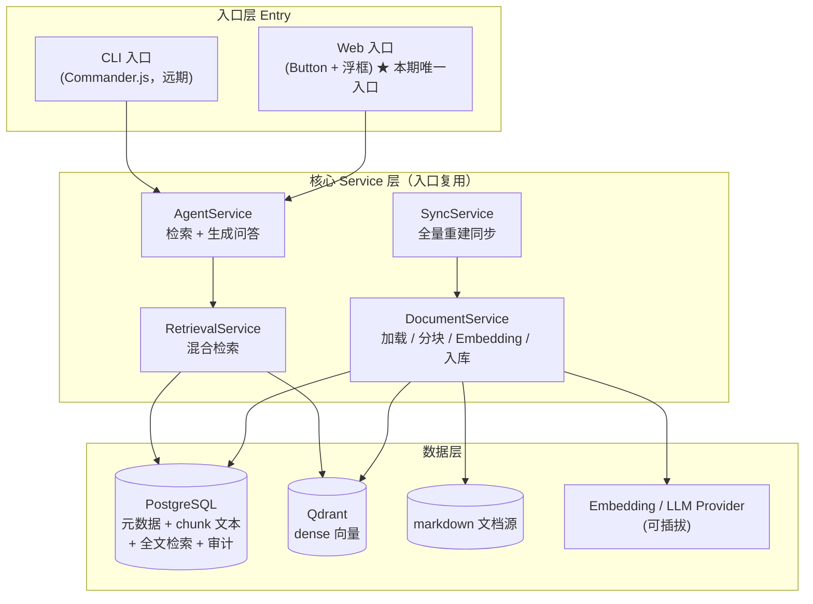
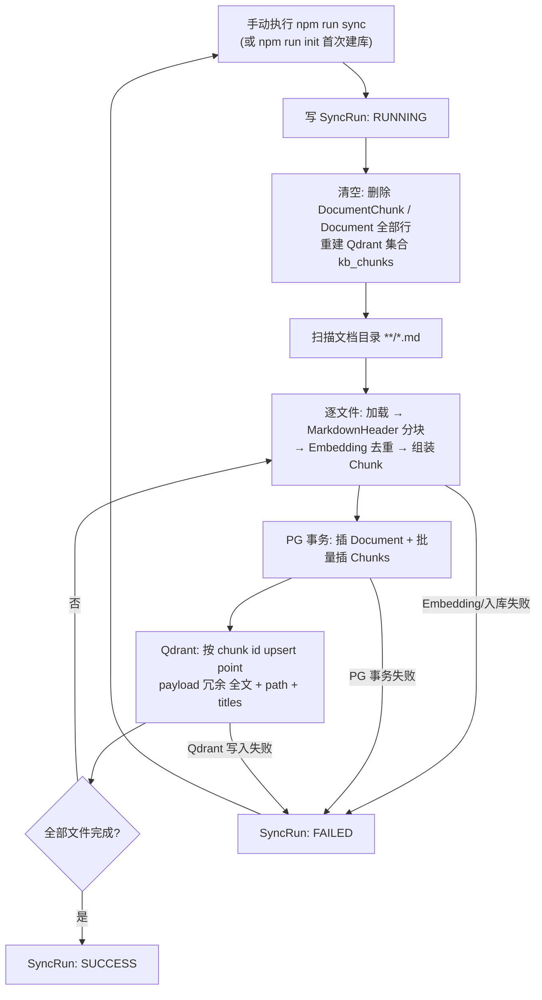
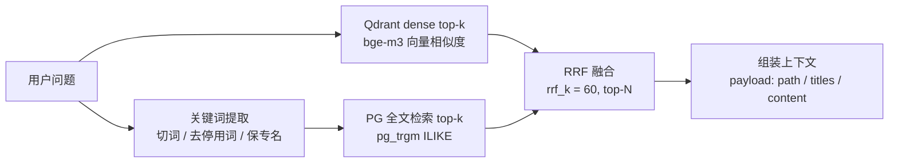
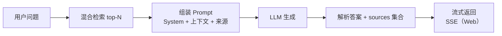

# 知识库 Agent 系统技术方案（Kb-Agent）

> 内部知识库 Agent 核心骨架的落地技术方案。目标文档源为 SAST 系统的**产品文档 / CLI 使用文档 / API 文档**（全 markdown），提供 RAG 问答能力。
> 本期**问答入口为 Web 浮框（唯一入口）**，核心 RAG 逻辑抽离为独立 Service 层复用；**CLI 裁剪为远期设计**（见 8.1 / 十 决策 8）。
>
> 💡 **同步模型（v2 简化版）**：不做增量比对，不做版本历史——**每次版本迭代发布后，手动执行一次全量重建**（清空 → 重新分块嵌入 → 入库），幂等、可重跑。
>
> 📌 **项目定位（04 双项目）**：本目录对应大纲「实战项目 04：企业级知识库系统」，以**当前公司真实项目**练手，技术栈与大纲存在差异（Qdrant 替 Milvus、PG FTS 替 ES、Hono 替 Fastify、Web Components 替 AI SDK、暂不引入 LangGraph），取舍逻辑见 1.2 / 六。**大纲视角的技术栈补全（Milvus / ES / Fastify / AI SDK 等）将在 04 编号下另立一个项目**（跟随大纲技术栈、共享 RAG 架构学习目标），两者互补，不混入本设计。

---

## 一、需求概述

### 1.1 需求要点

| 模块 | 要求 |
| --- | --- |
| 入口层 | **本期 Web 单入口**：Web 前端（Button 浮框问答）+ Hono 服务；CLI（Commander.js）为远期设计；核心逻辑 Service 层复用 |
| 同步模型 | **发布后全量重建**：清空 PG 业务表 + Qdrant 集合 → 从文档源重新分块嵌入入库 |
| 数据层 | PostgreSQL（文档元数据 + chunk 文本 + 同步审计 + 全文检索）+ Qdrant（dense 向量检索） |
| 问答链路 | 混合检索（Qdrant dense top-k + PG 全文 top-k → RRF 融合）→ LLM 生成答案（附来源）→ 流式输出 |

### 1.2 简化决策：砍掉了什么、为什么

> 上一版方案包含 hash 增量比对、git diff 发布触发、version 历史版本、软删除、LangGraph 评估-改写循环等机制。对照真实需求「版本迭代更新后重新建一次向量库」，这些均为过度设计，全部移除。

| # | 原方案机制 | 本方案 | 简化理由 |
| --- | --- | --- | --- |
| 1 | hash 比对增量同步（删旧插新） | 全量重建 | 文档 ≤1000 个 md，全量重建分钟级；消除比对/部分更新复杂度 |
| 2 | git diff / GitLab Compare 发布触发 | 发布后手动 `npm run sync` | 文档发布频率低，一条脚本即可 |
| 3 | version 版本号 / 历史版本可回滚 | 无版本概念 | 无历史回溯诉求，同一路径唯一即可 |
| 4 | 软删除 `status=DELETED` + 定期清理 | 不需要 | 重建即对齐真实文件状态，"已删文件残留检索"问题天然消失 |
| 5 | LangGraph 检索-生成-评估-改写循环 | 一轮检索 + 生成 | 文档问答一轮命中率足够，评估循环每轮 3 次 LLM 调用性价比低；**保留为未来可选增强（见 6.3 备注）** |
| 6 | 两库一致性编排（先 PG 后 Qdrant + 失败重跑恢复） | 同轮清空重建 | 每轮从空开始、失败整轮重跑，不存在"部分更新遗留"，一致性天然成立 |
| 7 | **问答 CLI**（Commander.js + @inquirer/prompts） | **本期不做 CLI**，运维触发改 `scripts/` 脚本（`npm run init / sync / status`） | 问答入口本期仅 Web；CLI（`kb ask/chat`）保留为远期设计（见 8.1 / 十 决策 8），不装 commander 依赖 |

---

## 二、总体架构



**分层职责**

- **入口层**：只做输入适配（Web：HTTP + SSE），不含任何 RAG 逻辑
- **Service 层**：全部核心能力，入口（Web / 远期 CLI）通过调用同一 Service 实例/接口复用
- **数据层**：PostgreSQL 存文档元数据、chunk 文本与同步审计（兼做全文检索），Qdrant 存 dense 向量；文档源为本地 markdown 目录

---

## 三、技术栈选型

| 分层 | 选型 | 版本 | 说明 |
| --- | --- | --- | --- |
| 运行时 | Bun + TypeScript | Bun 1.x / TS ^5.6 | 内置 TS 执行/测试/包管理，启动快；Node ≥ 20 兜底 |
| CLI（远期） | Commander.js / @inquirer/prompts | — | ⚠️ **本期裁剪不装**：问答入口仅 Web，运维触发走 `scripts/` 脚本（见 1.2 / 十 决策 8） |
| Web 入口 | Web Components（原生 TS + Shadow DOM） | 零框架依赖 | 独立 widget，esbuild/vite 编译为单文件 ESM，可嵌入任意前端框架，避免样式/依赖污染宿主 |
| Web CORS | @hono/cors | ^4.0 | 跨域白名单：`CORS_ORIGIN`（env）放行宿主 origin，allowHeaders 含 Authorization（配鉴权预留） |
| Web 服务 | Hono | ^4.7 | 轻量、原生 SSE、跨运行时 |
| RAG 框架 | LangChain.js | @langchain/core ^1.2 / langchain ^1.5 | v1 统一 Runnable 接口；加载 / 分块 / Embedding / 问答管道 |
| 文本分块 | @langchain/textsplitters | ^1.0 | MarkdownHeaderTextSplitter 主 + RecursiveCharacterTextSplitter 兜底 |
| ORM | Prisma | ^7.9 | Rust-free 客户端 + driver adapter，官方支持 Bun |
| 业务数据库 | PostgreSQL | PG 16 | 元数据 + chunk 文本 + 同步审计；**全文检索（pg_trgm + ILIKE）承担混合检索的 keyword 部分** |
| 向量检索 | Qdrant | 1.13+ | dense 向量集合，独立部署（Docker / 单二进制） |
| Embedding | bge-m3（Ollama 部署） | 1024 维 | 开源易部署、中英文友好；备选 Qwen3-Embedding / M3E |
| LLM | DeepSeek v4 flash | — | 经 @langchain/deepseek ^1.1 或 OpenAI 兼容接口接入 |
| 校验 | zod | ^3.23 | 配置与环境变量校验 |

**选型说明**

- **不引入 LangGraph**：一轮「检索 → 生成」用 Runnable pipeline 即可编排；未来启用评估-改写循环时再加回 `@langchain/langgraph`（v1 要求 Node ≥ 22）
- **keyword 检索走 PG 而非 Qdrant sparse**：bge-m3 经 Ollama 的 OpenAI 兼容 `/v1/embeddings` 只返回 dense 向量，sparse 需独立编码器（SPLADE 等）；而 chunk 文本已存 PG，全文检索零额外依赖、零额外成本

---

## 四、目录结构

```
kb-agent/
├── package.json
├── tsconfig.json
├── .env.example                 # DATABASE_URL / QDRANT_URL / LLM_API_KEY / EMBEDDING_BASE_URL / CORS_ORIGIN / AUTH_ENABLED 等
├── prisma.config.ts             # Prisma 7 配置（datasource url 移出 schema）
├── prisma/
│   ├── schema.prisma
│   └── migrations/
├── src/
│   ├── entry/                   # ── 入口层（薄适配，无业务逻辑）
│   │   └── web/                 # Web 入口（本期唯一问答入口）
│   │       ├── server.ts        #   Hono + SSE
│   │       └── ui/              #   浮框组件（Web Components，独立 widget）
│   ├── service/                 # ── ★ 核心 Service 层（入口复用）
│   │   ├── document/            #   文档管线：加载 / 分块 / Embedding / 入库
│   │   ├── sync/                #   全量重建同步
│   │   ├── retrieval/           #   Qdrant dense + PG 全文混合检索
│   │   └── agent/               #   检索 + 生成问答（Runnable pipeline）
│   ├── repository/              # Prisma 数据访问 + Qdrant 客户端
│   ├── embedding/               # Embedding Provider 封装（可插拔）
│   ├── config/                  # 配置加载（zod 校验）
│   └── types/                   # 共享类型定义
├── docs/
└── scripts/                 # 运维脚本（属源码）：init / sync / status（`npm run *` 触发）
```

> 目录设计原则：**入口层依赖 Service 层，Service 层不依赖入口层**，保证复用与单向依赖。

---

## 五、数据模型设计（Prisma 7.x + PostgreSQL + Qdrant）

```prisma
generator client {
  provider = "prisma-client"     // Prisma 7：Rust-free 客户端，output 必填
  output   = "../src/generated/prisma"
}

datasource db {
  provider = "postgresql"        // v7 中 url 移入 prisma.config.ts
}

/// 文档元数据表（path 唯一，无版本概念）
model Document {
  id         String           @id @default(cuid())
  path       String           @unique          // 相对路径（唯一标识）
  fileName   String                             // 文件名
  chunkCount Int              @default(0)
  createdAt  DateTime         @default(now())
  updatedAt  DateTime         @updatedAt
  chunks     DocumentChunk[]

  @@index([path])
}

/// 分块表（文本 + 元数据 + 全文检索；向量存 Qdrant）
/// id 必须用 UUID：Qdrant point id = chunk id，而 Qdrant 只接受 uint64 或标准 UUID（cuid 不合法）
model DocumentChunk {
  id          String   @id @default(uuid())
  documentId  String
  document    Document @relation(fields: [documentId], references: [id], onDelete: Cascade)
  path        String             // 冗余来源路径（与 Qdrant payload 对齐，检索无需回查）
  chunkIndex  Int                // 块序号
  content     String             // 分块文本
  contentHash String             // 块内容指纹（Embedding 去重复用）
  tokenCount  Int      @default(0)
  metadata    Json?              // 标题路径等（用于上下文与溯源）
  createdAt   DateTime @default(now())

  @@unique([documentId, chunkIndex])
  @@index([contentHash])
  @@index([path])
  @@index([content])              // 全文检索（pg_trgm GIN，见 6.2；Prisma 需手写 migration）
}

/// 同步任务记录（审计：每轮重建一行）
model SyncRun {
  id         String   @id @default(cuid())
  startedAt  DateTime @default(now())
  finishedAt DateTime?
  status     String   // RUNNING / SUCCESS / FAILED
  fileCount  Int      @default(0)
  chunkCount Int      @default(0)
  error      String?
}
```

**关键说明**

1. **两库各司其职**：PostgreSQL 管「文档事实」（元数据 + chunk 文本 + 审计，兼做全文检索），Qdrant 管「语义检索」（dense 向量，**point id = chunk id**，因此 chunk id 用 UUID 以符合 Qdrant 的 point id 约束；`Document.id` 仅 PG 内部使用，可保持 cuid）
2. **`path` 双向冗余**：`DocumentChunk.path` 与 Qdrant payload 冗余同源，混合检索两条通道的结果都自带来源路径，无需回查 / join
3. **无版本 / 无软删除**：path 唯一；全量重建时旧数据整轮清空重写，文件真实状态即库内状态
4. **Prisma 7 适配 Bun**：Rust-free 客户端 + driver adapter（`@prisma/adapter-pg`），`bunx --bun prisma`；url 配置在 `prisma.config.ts`

### 5.1 实例：一份文档如何落到两层存储

以 `docs/command-line.md` 为例，分块后写入 PG 与 Qdrant。

**① PostgreSQL → `Document` 表（每文件一行）**

| 字段 | 值 | 说明 |
| --- | --- | --- |
| id | `doc_1` | 主键 |
| path | `docs/command-line.md` | 唯一标识 |
| fileName | `command-line.md` | 文件名 |
| chunkCount | `3` | 分块数 |

**② PostgreSQL → `DocumentChunk` 表（每个分块一行，文本 + 元数据 + 全文索引，不存向量）**

| id | documentId | path | chunkIndex | content | metadata.titles |
| --- | --- | --- | --- | --- | --- |
| `chunk_1` | `doc_1` | `docs/command-line.md` | 0 | 「命令行工具」 | `["命令行工具"]` |
| `chunk_2` | `doc_1` | `docs/command-line.md` | 1 | 「`cleancode scan <project>` 对项目执行 SAST 扫描…」 | `["命令行工具","scan 命令"]` |
| `chunk_3` | `doc_1` | `docs/command-line.md` | 2 | 「参数列表…」 | `["命令行工具","scan 命令","参数"]` |

**③ Qdrant → collection `kb_chunks`（每个 chunk 一个 point，dense 向量 + 冗余 payload）**

```json
{
  "id": "chunk_2",
  "vector": "[0.012, … 共 1024 维]",
  "payload": {
    "documentId": "doc_1",
    "path": "docs/command-line.md",
    "titles": ["命令行工具", "scan 命令"],
    "content": "cleancode scan <project> 对项目执行 SAST 扫描…"
  }
}
```

> 注：上例中的 `doc_1` / `chunk_1` 为简化演示用；生产环境 `Document.id` 为 cuid、`DocumentChunk.id` 为标准 UUID（Qdrant point id 约束），含义不变。

**问答链路**：用户问「cleancode scan 怎么用？」→ Qdrant dense 检索命中 `chunk_2` + PG 全文检索命中同名文本 → RRF 融合 → 直接读 payload 的 `path / titles / content` 组装上下文 → LLM 生成答案并附来源「docs/command-line.md」。

> 💡 一句话总结：**PostgreSQL 管「文档事实 + 审计 + 全文检索」，Qdrant 管「语义检索」，SyncRun 管「同步审计」；每次发布全量重建，两库同源对齐。**

---

## 六、核心设计

### 6.1 全量重建同步机制（SyncService）★

> 每次版本迭代发布后，手动执行一次 `npm run sync`。流程为「清空 → 重建」，幂等、可重跑、无部分更新遗留。**重建期间（分钟级）问答短暂不可用，内部工具场景可接受。**



核心伪代码：

```
async function rebuildSync(rootDir):
  run = SyncRun.create({ status: RUNNING })
  try:
    // ① 清空（幂等起点；先 PG 后 Qdrant，顺序无关，任一侧失败整轮重跑）
    documentRepo.clearAll()                 // 删 DocumentChunk / Document
    qdrant.recreateCollection("kb_chunks")  // 重建集合（维度与 bge-m3 一致 = 1024）

    // ② 逐文件重建（每文件：PG 事务内写 Document + Chunks，再写 Qdrant）
    for path of scanMarkdown(rootDir):
      $transaction:
        doc = createDocument(path)            // PG
        chunks = loadAndChunk(path)           // MarkdownHeader 分块 + Embedding
        createManyChunks(doc.id, chunks)      // 同事务批量插入
      qdrant.upsert(chunkPoints(chunks))      // point id = chunk id，幂等

    // ③ 收尾
    run.update({ status: SUCCESS, fileCount, chunkCount })
  catch (err):
    run.update({ status: FAILED, error: err.message })   // 整轮失败，重跑从 ① 重新开始
```

**幂等性与一致性**

- 每轮从「清空」开始，重跑 = 重新清空 + 重新写入，**天然幂等**，无需 hash 比对 / 版本号 / 删旧插新
- 失败仅影响当次运行：重跑从清空重新开始，**不存在跨轮脏数据**（增量方案的"PG 已提交但 Qdrant 未写"类问题在此结构下不可能发生）
- PG 与 Qdrant 同轮重建、数据同源，无需对齐/回滚逻辑

**触发形态（scripts/，本期）**

```bash
npm run init      # 首次初始化：建表 + 建集合 + 全量索引
npm run sync      # 发布后全量重建（等价于清空重来）
npm run status    # 查看最近一次同步状态与统计
```

### 6.2 混合检索（RetrievalService）

> dense + keyword 双通道 → RRF 融合，兼顾语义相似与专有名词（API 名 / CLI 命令 / 参数名）精确命中。



- **dense 通道**：问题向量化 → Qdrant 检索 top-k（如 10）
- **keyword 通道**：**先做关键词提取，再做 PG 检索**，而非拿整句话去 `ILIKE`（整句命中率约等于 0）。流程：
  1. **切词**：中文按 2 字滑动窗口切 n-gram + 英文/数字按空白与标点切词；保留专名（`cleancode`、`scan`、`<project>` 参数等，可走「收集过的专名白名单」）。注意**英文 2 字符词（如 `kb`、`CLI`）会被 pg_trgm 的 `%词%` 匹配，但中文 2 字词命中率与索引利用率都低**（见下方限制）
  2. **去停用词**：过滤「的 / 怎么 / 用 / 是」等高频无义词
  3. **检索**：逐个关键词（或合并 OR 子句）`ILIKE '%kw%'` top-k（如 10）
  - 中文场景选 pg_trgm：开箱即用无需分词器；`tsvector` 中文需 zhparser / jieba 等第三方分词，不采用
- **融合**：RRF（Reciprocal Rank Fusion）合并两路结果 → 取 top-N（如 5）作为上下文
- **溯源**：两通道结果均自带 `path`（`DocumentChunk.path` 与 Qdrant payload 冗余同源），无需回查

> 💡 keyword 走 PG 的原因：bge-m3 经 Ollama 的 OpenAI 兼容接口只返回 dense 向量，Qdrant sparse 需要额外 sparse 编码器；PG 已存 chunk 文本，FTS 零新依赖，且规避了「sparse 向量来源缺失」的坑。
>
> ⚙️ **pg_trgm 中文限制（实测结论）**：GIN 索引只对 ≥3 字符（含中文 3 字）的查询生效；**2 字符中文词（如「扫描」单独切出）`ILIKE '%词%'` 不走索引，退化为全表扫描**。chunk 量万级以下可接受，量级再大需升级：切 3 字以上关键词 / 引入 ES（大纲 4.2 技术栈）或专职分词组件。
>
> ⚙️ pg_trgm 索引需在迁移中手写（Prisma 不支持扩展 / GIN 索引）：
>
> ```sql
> CREATE EXTENSION IF NOT EXISTS pg_trgm;
> CREATE INDEX idx_chunk_content_trgm ON "DocumentChunk" USING gin (content gin_trgm_ops);
> ```

### 6.3 问答流程（AgentService）



- **节点职责**：`retrieve` 混合检索；`generate` 注入 System Prompt + 上下文生成答案并收集来源 `sources`（Qdrant payload.path）
- **编排**：一轮 Runnable pipeline（`retrieve → prompt → model → parseSources`），不引入 LangGraph
- **流式**：Web 入口流式输出答案（SSE）；`sources` 在流结束随答案尾部返回

```typescript
const chain = RunnableSequence.from([
  {
    context: (q) => retrievalService.hybridTopK(q, { topK: 5 }),
    question: (q) => q,
  },
  SYSTEM_PROMPT,          // 约束：只依据上下文回答，引用来源
  chatModel,
  parseAnswerAndSources,  // 解析答案 + sources[]
]);
```

> 🔧 **未来可选增强（本期不做，此处留档）**：**评估-改写循环**。当一轮命中质量不足时，引入 LangGraph `StateGraph` 编排 `retrieve → generate → evaluate → rewrite`：
>
> - `evaluate`：LLM 结构化评估 `{ score: 0-10, missingPoints: string[] }`，阈值 ≥7 达标即结束
> - `rewrite`：未达标（score < 7 且 attempt < 3）时，注入 `missingPoints` 改写问题，回到 `retrieve`
> - 引入成本：每轮多次 LLM 调用（成本 ×3）、LangGraph 依赖（Node ≥ 22）、attempt/score 状态维护
> - 启用时机：待一轮命中率数据支撑（如首轮 score < 7 占比 > 30%）后再启用
>
> ```typescript
> // 启用时仅需：新增 evaluate/rewrite 节点 + 引入 @langchain/langgraph
> const graph = new StateGraph<AgentState>({})
>   .addNode("retrieve", retrieveNode)
>   .addNode("generate", generateNode)
>   .addNode("evaluate", evaluateNode)
>   .addNode("rewrite", rewriteNode)
>   .addEdge("retrieve", "generate")
>   .addEdge("generate", "evaluate")
>   .addConditionalEdges("evaluate", (s) =>
>     s.score >= PASS_SCORE || s.attempt >= MAX_RETRY ? "__end__" : "rewrite")
>   .addEdge("rewrite", "retrieve")
>   .compile();
> ```

**分块策略**

- 加载：`TextLoader` / `DirectoryLoader` 按 glob（`**/*.md`）遍历
- 主分块：`MarkdownHeaderTextSplitter` 按标题层级分块，标题路径写入 `metadata`（上下文完整 + 可溯源）
- 兜底：`RecursiveCharacterTextSplitter`（chunkSize ≈ 800 字符，overlap ≈ 80）
- Embedding：`embedding/` 层 Provider 抽象，可插拔（bge-m3 经 Ollama 的 OpenAI 兼容接口 `/v1/embeddings`）；**同轮内按 `contentHash` 去重，相同 chunk 复用向量，省 API 调用**

---

## 七、核心依赖（package.json）

```json
{
  "name": "kb-agent",
  "private": true,
  "type": "module",
  "engines": { "bun": ">=1.1" },
  "scripts": {
    "init": "bun run scripts/init.ts",
    "sync": "bun run scripts/sync.ts",
    "status": "bun run scripts/status.ts",
    "dev:web": "bun run src/entry/web/server.ts",
    "db:migrate": "bunx prisma migrate dev",
    "type-check": "tsc --noEmit"
  },
  "dependencies": {
    "@langchain/core": "^1.2.0",
    "langchain": "^1.5.0",
    "@langchain/textsplitters": "^1.0.0",
    "@langchain/openai": "^1.5.0",
    "@langchain/deepseek": "^1.1.0",
    "@prisma/client": "^7.9.0",
    "@prisma/adapter-pg": "^7.9.0",
    "@qdrant/js-client-rest": "^1.13.0",
    "@inquirer/prompts": "^7.0.0",   // 远期 CLI 交互（本期不装，见 8.1 / 十 决策 8）
    "commander": "^12.1.0",          // 远期 CLI（本期不装，见 8.1 / 十 决策 8）
    "dotenv": "^16.4.5",
    "@hono/cors": "^4.0.0",
    "hono": "^4.7.0",
    "zod": "^3.25.0"
  },
  "devDependencies": {
    "prisma": "^7.9.0",
    "@types/bun": "^1.1.0",
    "typescript": "^5.6.0",
    "vitest": "^2.1.0"
  }
}
```

> 相比上一版移除了 `@langchain/langgraph`（待评估-改写循环启用时再加回）；`commander` / `@inquirer/prompts` 为远期 CLI 依赖（本期不装，见 8.1 / 十 决策 8）。

---

## 八、入口设计

### 8.1 CLI（远期设计，本期裁剪）

> ⚠️ **本期不做问答类 CLI**（不装 Commander.js / @inquirer/prompts），裁剪理由见 1.2 / 十 决策 8。当前运维触发由 `scripts/` 承担：`npm run init`（建表 + 建集合 + 全量索引）、`npm run sync`（发布后全量重建）、`npm run status`（同步状态与统计）。CLI 以下形态保留为远期设计：

```bash
kb init            # 首次初始化：建表 + 建集合 + 全量索引（远期，当前 scripts/init.ts）
kb sync            # 发布后全量重建向量库（清空重来，幂等）（远期，当前 scripts/sync.ts）
kb status          # 查看最近一次同步状态与统计（远期，当前 scripts/status.ts）
kb ask "<问题>"     # 一次性问答（打印带来源的答案，流式）
kb chat            # 交互式问答（@inquirer/prompts，流式）
```

### 8.2 Web 入口（Button + 浮框，本期唯一问答入口）

- **组件形态**：原生 Web Components（FloatButton + 浮框，Shadow DOM 隔离样式），**编译为单文件 ESM 产物 `dist/kb-chat-widget.js`（不做 npm 包）**，宿主 `<script type="module" src="...">` 引入即用（Vue / React / 原生均可），或 iframe 沙箱嵌入隔离宿主
- **交互链路**：浮框输入问题 → `POST /api/chat` → 后端仅做 HTTP 适配，调用 `AgentService` → **SSE 流式**返回答案与引用
- **后端**：Hono 轻服务（Bun 运行），不含业务逻辑，仅路由 + SSE 流式转发
- **跨域（CORS）**：widget 与宿主页面必然不同源，后端挂官方 `@hono/cors`：`CORS_ORIGIN`（env，逗号分隔）白名单放行宿主 origin，`allowMethods: POST/OPTIONS`，`allowHeaders: Content-Type, Authorization`（配合鉴权预留）；白名单比 `*` 安全，同时天然收紧外部暴露面
- **后端地址可配置**：widget 暴露 `server` 属性（`<kb-chat-widget server="https://kb-agent.internal.example.com">`），构建产物与具体环境解耦，换环境无需重新编译

**为何不用 Vercel AI SDK**（决策记录，对应 十 决策 8）

- **嵌入方式**：AI SDK 的 `useChat` 是 React / Vue / Svelte 的框架 hook，必须改宿主组件代码接入；而 Web Components 是自包含 widget（编译为单文件 ESM，`<script type="module">` 引入即用、Shadow DOM 隔离样式），对任意宿主零侵入
- **框架绑定**：宿主（Vue / React）项目都有，但刻意摆脱框架绑定——自研 widget 与框架完全解耦，未来换宿主零迁移成本
- **体积**：AI SDK 实际打包约 45KB gzip（核心 12-15 + provider ~19），并不算大，但非决策点；自研 widget 约 5-10KB gzip
- **学习路径**：AI SDK 前端集成属大纲第五阶段，留到 04 后续项目（大纲技术栈）练手，不混入本项目

---

## 九、落地阶段建议

| 阶段 | 内容 | 验收标准 |
| --- | --- | --- |
| P0 骨架 | 目录结构、配置、Prisma schema、迁移、`scripts/` 骨架 | `npm run init` 建表成功 |
| P1 文档管线 | 加载 → 分块 → Embedding → 入库（含清空重建） | 指定目录全量索引成功；改文件后 `npm run sync` 结果与文件系统一致 |
| P2 问答 | 混合检索 + LLM 生成 + 溯源 | 专有名词问题（如 API 名）经 keyword 通道命中；答案带来源 |
| P3 Web 入口 | Web 浮框 + Hono SSE（本期唯一问答入口；CLI 为远期） | Web 走同一 Service 可用、流式输出正常 |

---

## 十、关键决策（已确认）

| # | 决策项 | 结论 | 对实现的影响 |
| --- | --- | --- | --- |
| 1 | 同步模型 | **发布后全量重建**（清空重来，不做增量/版本/软删除） | 无 hash 比对、无 git diff、无 version、无软删除逻辑；SyncService 只有「清空 + 重建」一条路径 |
| 2 | 数据层 | PostgreSQL（元数据 + chunk 文本 + 审计 + 全文检索）+ Qdrant（dense 向量） | keyword 检索走 PG FTS，规避 sparse 编码器缺失；两库同轮重建天然一致 |
| 3 | Agent 编排 | 一轮检索 + 生成（Runnable pipeline）；评估-改写循环留档为未来增强 | 不引入 LangGraph 依赖；未来按 6.3 备注启用 |
| 4 | Embedding / LLM | Embedding：bge-m3（Ollama 本地）；LLM：DeepSeek v4 flash 第三方 API | config 区分 `EMBEDDING_BASE_URL`（本机 Ollama）与 `LLM_API_KEY`（第三方密钥） |
| 5 | Web 入口宿主 | 编译为单文件 ESM 产物（`dist/kb-chat-widget.js`），宿主 `<script type="module">` 引入即可；**不做 npm 包** | widget 零框架依赖（Web Components + Shadow DOM），custom element 注册走 import 副作用 |
| 6 | 流式输出 | Web 浮框流式回答（SSE） | Hono SSE 转发 pipeline 流、前端增量渲染；服务层返回 `Promise<Stream>`，CLI（远期）同样消费 |
| 7 | 溯源要求 | 答案附带来源文档集合（可能查阅多个文档） | `generate` 收集 `sources: string[]`（Qdrant payload.path），随答案一并输出 |
| 8 | 问答入口（本期裁剪 CLI） | **本期仅 Web**（Hono + SSE + 浮框 widget）为问答入口；运维触发用 `scripts/` 脚本（`npm run init / sync / status`）；Commander.js / @inquirer/prompts 不安装 | 去掉全部问答类 CLI 任务；Service 层流式接口面向 Web 消费；CLI（`kb ask/chat`）保留为远期设计（见 8.1） |
| 9 | 跨域（widget 独立部署） | 后端 CORS 白名单：`@hono/cors` 中间件 + `CORS_ORIGIN`（env，逗号分隔），`allowHeaders` 含 `Authorization` | 独立部署、不改主前端网关；白名单比 `*` 安全且收紧暴露面；widget 暴露 `server` 属性配置后端地址。同域网关代理列为将来需要 zero-CORS 时的备选（见 8.2） |

### 鉴权预留设计

- 入口层（Hono）预留中间件链：`app.use("/api/*", authMiddleware)`，当前注入 no-op（`AUTH_ENABLED=false`）
- **与 CORS 联动**：鉴权开启后，前端经 `Authorization` 头传 token，CORS 中间件 `allowHeaders` 已包含该头（见 8.2）；preflight（OPTIONS）由 CORS 中间件统一应答，不进入鉴权逻辑
- 预留 `AuthContext`（userId / token）随请求透传 Service 层，当前为空对象；未来接入 LDAP / Token 只需实现该中间件，Service 层签名不变

### 扩展预留（本期不做）

| 场景 | 触发条件 | 启用方案 |
| --- | --- | --- |
| 增量同步 | 文档规模增长使全量重建过慢（如 >5000 文件） | 恢复 hash 比对增量：仅对变化文件重建，且需引入"两库一致性"标记（如 chunk 级 `vectorSynced`） |
| 评估-改写循环 | 一轮问答首轮命中率偏低（如首轮 score < 7 占比 > 30%） | 按 6.3 备注引入 LangGraph StateGraph |
| Qdrant sparse 检索 | 引入 sparse 编码器（SPLADE / bge-m3 sparse 专用通道） | Qdrant 集合加 sparse 向量，keyword 通道从 PG FTS 迁到 Qdrant |
