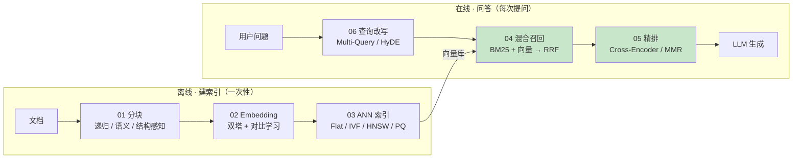
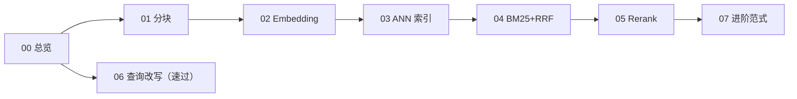

# RAG 检索算法 — 面向 Agent 工程师的算法专题册

> 把 RAG 流水线上的每个算法讲透：**是什么、怎么工作（直觉）、怎么调参、什么时候不用**。不卷训练、不推公式、不重复造轮子——本册是原理册 04/06 模块的算法深化专题。

---

## 1. 定位

| 项目 | 内容 |
|------|------|
| 目标读者 | 前端 Leader / 全栈工程师 / Agent 开发工程师（作者本人） |
| 前置要求 | agent-fullstack 阶段 1 已完成（会用框架搭 RAG）；原理册 04（Embedding 与相似度）、06-1（检索质量四件套）已读；TS/Bun 主场 |
| 学习目标 | 能为 RAG 系统做检索侧选型、调参、排查——「检索不准」时能按环节归因并给出优化动作 |
| 面试目标 | RAG 检索类面试题全覆盖：chunk 怎么切、HNSW 为什么快、为什么还要 BM25、为什么要 rerank |

### 1.1 与既有三册的关系（不重复造轮子）

| 册 | 已覆盖 | 本册的处理 |
|----|--------|-----------|
| agent-fullstack（阶段 1） | 会用 LangChain/pgvector 搭 RAG 链路 | 只在练习里回头改造它的项目（02-customer-service） |
| agent-fullstack（阶段 3-3） | Agentic RAG 决策闭环已实现：检索前决策 / 打分改写重试 / Self-RAG 双闸门 / 多源路由 / retryCount 防失控 | 07 篇 Agentic 范式不重讲实现，交叉引用 3-3 |
| machine-learning 原理册 | Embedding/相似度原理、检索失败模式、模型选型格局（06-3） | **引用不重讲**；本册把原理册 §9 明确划出边界的「HNSW/IVF 细节」定向补齐 |
| handcrafted 手写册 03 | 手写了 BM25 / 余弦 top-k / RRF（对照表形式） | 作为**走读靶子**：04 篇拿它当「原理直觉已验证」的实现参照 |

> 💡 一句话锚定：原理册让你懂「语义检索为什么有效」，手写册让你验「BM25/RRF 怎么实现」，本册让你会「每个环节怎么选、怎么调、怎么排查」。

## 2. 主题定级与规格声明（大纲即契约）

| 定级项 | 判定 | 说明 |
|--------|------|------|
| 主题类型 | **专题册，按工具类规格执行** | 围绕选型/调参/排查，不需要框架级心智模型体系（那是原理册的活）；总篇数 8 篇，卡工具类 5~8 篇上限 |
| 深度档分配 | 精讲 ×5（01-05）/ 速过 ×2（00、06）/ 引子 ×1（07） | 精讲集中在检索核心链路：分块 → 表示 → 索引 → 召回 → 重排 |
| 面试问答 | 全系列 **4 组**（01 / 03 / 04 / 05） | 02 的「双塔 vs Cross-Encoder」由 05 覆盖；embedding 选型已在原理册 06-3 |
| 对比板块 | 全系列 **2 处**（03、04） | 03：ANN 索引选型四方对比；04：稀疏 vs 稠密 vs 混合 |
| 最小学习路径 | **赶时间只读 3 篇：00 → 04 → 05** | 混合检索 + RRF + rerank 是工程里 ROI 最高的两环；标准路径按序号顺读 |
| 写作规范 | 沿用仓库规范 | Mermaid 绘图；LaTeX 公式（CJK 与 `$` 之间加空格）；demo 用 Bun + TS strict；面试问答用 `> **问/答：**` 模板 |

## 3. 边界声明

| 学到什么程度 ✅ | 不学什么 ❌ |
|----------------|------------|
| HNSW/IVF 的结构直觉、参数含义、选型判断、召回率-耗时实测 | 图索引的构建代码实现、论文级证明 |
| BM25 公式每一项的直觉（k1/b 调参） | SPLADE/深度稀疏模型的训练 |
| 双塔 vs Cross-Encoder 的结构差异与成本权衡 | 对比学习的训练细节、reranker 微调 |
| RRF 为什么用排名不用分数、k 怎么取 | 学习排序（LTR）模型原理 |
| chunking 策略选择与效果评测方法 | 文档解析（PDF/OCR）工程细节 |
| Self-RAG/CRAG/GraphRAG 一句话定位与适用场景 | 论文复现、社区发现算法实现 |

## 4. 算法地图（流水线视角）

> 🎯 绿色两格（混合召回 + 精排）是工程 ROI 最高的环节，也是最小学习路径的重点。

## 5. 阅读路径（依赖链）

- 主线严格沿依赖链：不先懂 Embedding 就没法懂 ANN，不先懂两路召回就没法懂 rerank
- 06 速过篇在 00 之后随时可读，建议 04 之后（改写效果要靠检索结果对比才能体会）
- 07 引子篇收尾，只做「知道存在 + 知道去哪查」

## 6. 篇目规划总览

| 序号 | 篇名 | 层 | 深度档 | 一句话定位 | 前置 |
|------|------|----|--------|-----------|------|
| 00 | RAG 流水线与算法地图 | 认知层 | 速过 | 建立「离线三步 + 在线四步」全景与算法三档分级，检索不准的四环节归因框架 | 无 |
| 01 | 分块策略 | 基础层 | 精讲 | 检索质量的第一刀：怎么切、切多大、切错会怎样 | 00 |
| 02 | Embedding 与向量表示 | 核心层 | 精讲 | 语义检索的地基：双塔为什么能把「意思相近」变成「距离相近」 | 01 |
| 03 | ANN 索引：Flat、IVF、HNSW、PQ | 核心层 | 精讲 | 百万向量毫秒出 top-k 的原理与代价，HNSW 为主 | 02 |
| 04 | BM25 与混合检索、RRF | 核心层 | 精讲 | 关键词召回为什么没死：稀疏 + 稠密双路并行与排名融合 | 02（03 可并行） |
| 05 | Rerank：Cross-Encoder 与 MMR | 核心层 | 精讲 | 两阶段检索的第二级：为什么「先快召回、再精排」是标配 | 02、04 |
| 06 | 查询改写与上下文压缩 | 应用层 | 速过 | 检索前后各一道「提质」工序，速查即用 | 00、04 |
| 07 | 进阶范式与评估指路 | 工程层 | 引子 | Self-RAG / CRAG / GraphRAG 一句话定位；相邻空白一句话档（多模态 / text-to-SQL / 长上下文决策 / 间接注入）；评估指标去哪学 | 05 |

**落盘约定**：`doc/XX-篇名.md`（本系列一篇一文件，不设模块子目录）；交互演示放 `demos/`。

## 7. 各篇要素详解

### 00-RAG 流水线与算法地图（速过）

| 要素 | 内容 |
|------|------|
| 一句话定位 | 一次会话建立全景，后续每篇对号入座 |
| 核心知识点 | 离线三步（分块→编码→建索引）+ 在线四步（改写→召回→重排→生成）；算法三档分级表（精通 / 懂直觉 / 知道存在）；「检索不准」按 chunking / embedding / 检索策略 / 生成四环节归因的排查框架 |
| 代码 | 无（全景 + 地图篇） |
| 练习 | 要求：拿阶段 1 项目的检索链路，标出八环节各自用了什么算法、哪环节最可疑。预期：能画出自己项目的算法地图 |
| 验收产出 | 一页算法地图（含三档分级标注），作为后续各篇的目录锚点 |

### 01-分块策略（精讲）

| 要素 | 内容 |
|------|------|
| 一句话定位 | 检索质量的第一刀：粒度太粗稀释语义、太细截断上下文，把「怎么切」讲透 |
| 预计时间 | 1-2 天 |
| 核心知识点 | 固定窗口 + overlap；递归字符分割（`\n\n → \n → 句号 → 空格` 优先级）；语义分块（相邻句 embedding 相似度找断点）；结构感知分块（Markdown 标题 / 代码块）；父子分块（small-to-big：小块检索、大块喂 LLM）；chunk size 经验起点（256~512 token + 10%~20% overlap）与扫参评测法 |
| 靶子 | LangChain Text Splitters 官方文档；自写三种切法对同一篇 Markdown 的对照 |
| 最小案例 | 同一篇文档 × 3 种切法 → chunk 数量 / 平均长度 / 语义完整性对比表 |
| 练习 | 要求：对同一篇文档用固定窗口、递归分割、结构感知各切一遍，人工评 10 条 query 的召回命中情况。提示：挑「答案跨段落」和「答案就是一行代码」两类 query，分别暴露切太细 / 切太粗的问题。预期：能说清「没有最优切法，只有匹配文档结构和 query 类型的切法」 |
| 面试问答 | 示范：问：chunk 切多大合适？答：没有普适值——256~512 token + 10%~20% overlap 是常用起点，但正确做法是用评测集扫参：太粗一条 chunk 混多个主题稀释向量语义，太细语义被截断；父子分块（小块检索、大块喂 LLM）常能兼顾两者 |
| 参考链接 | [LangChain Text Splitters 官方文档](https://python.langchain.com/docs/concepts/text_splitters/) |
| 验收产出 | 「切法 × query 类型」匹配表 + 本项目文档的切法结论 |

### 02-Embedding 与向量表示（精讲）

| 要素 | 内容 |
|------|------|
| 一句话定位 | 双塔为什么能把「意思相近」变成「距离相近」，以及精确 kNN 为什么不可行（引出 ANN） |
| 预计时间 | 1 天 |
| 核心知识点 | 双塔 / 双编码器结构（doc 可离线预计算）；对比学习直觉（正例拉近、负例推远，不展开训练）；instruction-aware（query/doc 各自加指令前缀）；MRL / Matryoshka 可裁剪维度；cosine vs 点积 vs 欧氏（何时等价）；ANN 问题定义：精确 kNN 的 O(N·d) 为什么扛不住在线查询 |
| 靶子 | Qwen3-Embedding 官方博客（双塔 + 指令）；BGE-M3 模型卡（三合一表示） |
| 最小案例 | embedding API 十行验证：同义对 vs 反义对的 cosine 区分度；有/无 instruction 前缀的排序差异 |
| 练习 | 要求：固定同一批句对与度量，对比两个 embedding 模型的区分度（同义均分 − 反义均分）。提示：区分度差可能来自语料域不匹配，不只是模型强弱。预期：能把「检索不准」的第一嫌疑指向 embedding 与语料域的匹配度 |
| 参考链接 | [Qwen3-Embedding 官方博客](https://qwenlm.github.io/blog/qwen3-embedding/)；[BGE-M3 模型卡](https://huggingface.co/BAAI/bge-m3)；[MTEB 榜单](https://huggingface.co/spaces/mteb/leaderboard) |
| 验收产出 | 能画出双塔结构图并标注「哪一侧可以离线、为什么」 |

### 03-ANN 索引：Flat、IVF、HNSW、PQ（精讲）

| 要素 | 内容 |
|------|------|
| 一句话定位 | 用近似换速度：百万向量毫秒出 top-k 的原理、参数与代价，HNSW 为主 |
| 预计时间 | 1-2 天 |
| 核心知识点 | Flat 精确基线；IVF（k-means 聚类倒排 + nprobe 控制搜几个簇）；HNSW（多层图 + 贪心下潜 + M / ef_construction / ef_search 三参数直觉）；PQ / SQ 量化（内存换精度）；召回率-延迟-内存三角 |
| 靶子 | hnswlib 官方仓库与参数文档；pgvector 的 HNSW/IVFFlat 索引文档 |
| 最小案例 | 同一批向量：Flat 精确结果 vs HNSW 结果的召回率对照（十行内） |
| 练习 | 要求：固定查询集，扫 HNSW 的 ef_search（如 16/64/256），记录召回率@10 与耗时。提示：ef_search 越大召回越高、延迟越高；M 影响的是图的内存与质量。预期：能画出「ef_search-召回率-延迟」曲线并解释拐点 |
| 面试问答 | 示范：问：HNSW 为什么快？答：向量组织成多层图——顶层稀疏长边负责跳跃、底层稠密短边负责精细，查询从顶层贪心走向目标邻域再逐层下潜，复杂度近似 O(log N)；代价是建索引时间和存图的额外内存，M/ef 参数在精度与速度间权衡 |
| 对比板块 | **Flat vs IVF vs HNSW vs PQ 四方对比**：精度 / 内存 / 延迟 / 建索引成本 / 适用规模，附选型决策（百万级以内 Flat 也够、内存紧上 PQ、通用默认 HNSW） |
| 参考链接 | [hnswlib](https://github.com/nmslib/hnswlib)；[Faiss Wiki（IVF/PQ）](https://github.com/facebookresearch/faiss/wiki)；[pgvector](https://github.com/pgvector/pgvector) |
| 验收产出 | 选型决策树 + 本项目向量库的索引参数结论（索引类型 + ef/M 取值理由） |
| 交互演示 | `demos/hnsw-layers.html`：分层图贪心下潜动画（§11） |

### 04-BM25 与混合检索、RRF（精讲）

| 要素 | 内容 |
|------|------|
| 一句话定位 | 语义检索时代关键词召回为什么没死：双路并行、排名融合 |
| 预计时间 | 1 天 |
| 核心知识点 | TF-IDF → BM25 演进（词频饱和 + 文档长度归一化，k1/b 直觉，公式逐项拆）；SPLADE 一句话（学习型稀疏）；混合检索双路架构；RRF 公式 `1/(k+rank)` 与 k=60 的来历（排名融合、规避量纲不可比）；加权分数融合 vs RRF 的取舍 |
| 靶子 | **handcrafted 模块 03 手写的 BM25 / 余弦 top-k / RRF 实现**（走读对照，验证原理册式直觉） |
| 最小案例 | 十行实现 RRF，对两路手工排名做融合，手算验证 |
| 练习 | 要求：同一查询集分别用 BM25 / 向量 / BM25+向量+RRF 三种策略跑，对比命中情况。提示：重点观察「型号 / 错误码 / 人名」类查询——向量会语义平滑掉精确词，BM25 恰好补上。预期：能举出「必须混合检索」的真实 query 例子 |
| 面试问答 | 示范：问：有了向量检索为什么还要 BM25？答：向量擅长语义泛化（同义改写），但对精确词不敏感——错误码、型号、人名可能被语义平滑掉，BM25 恰好相反；双路并行 + RRF 用排名（而非分数）融合，天然规避两路分数量纲不可比的问题，通常比任一单路稳 |
| 对比板块 | **稀疏（BM25 / SPLADE）vs 稠密 vs 混合**：各自擅长的 query 类型与失败模式；含 2026 一体化模型格局（BGE-M3 单模型出三路表示）引用原理册 06-3 |
| 参考链接 | [RRF 原论文（Cormack et al. 2009）](https://dl.acm.org/doi/10.1145/1571941.1572114)；[Elasticsearch RRF 官方文档](https://www.elastic.co/guide/en/elasticsearch/reference/current/rrf.html)；仓库内 `handcrafted` 模块 03 对照表 |
| 验收产出 | 「query 类型 × 检索策略」匹配表 + 本项目是否上混合检索的结论 |
| 交互演示 | `demos/rrf-fusion.html`（可选）：两路排名 → RRF 融合过程可视化 |

### 05-Rerank：Cross-Encoder 与 MMR（精讲）

| 要素 | 内容 |
|------|------|
| 一句话定位 | 两阶段检索的第二级：双塔换精度，Cross-Encoder 补回来 |
| 预计时间 | 1 天 |
| 核心知识点 | 双塔 vs Cross-Encoder 结构差异（独立编码 vs 拼接交叉注意力）与成本权衡；两阶段检索标配（ANN 粗召 top-100 → 精排取 top-5~10）；主流 reranker 一览（bge-reranker-v2-m3、Qwen3-Reranker、Cohere Rerank 3.5）；MMR 最大边际相关性（相关 + 不重复）；LLM listwise rerank 一句话 |
| 靶子 | sentence-transformers Cross-Encoder 官方文档；bge-reranker-v2-m3 模型卡 |
| 最小案例 | 同一查询 top-10 候选：rerank 前后排序对比（十行 API 调用） |
| 练习 | 要求：对召回 top-50 做 rerank，对比 top-5 的命中变化与额外耗时。提示：rerank 收益最大的是「召回边界模糊」的查询；耗时 ≈ 候选数 × 单对推理成本，所以候选只取 50~100。预期：能回答「什么时候该上 rerank、候选给多少」 |
| 面试问答 | 示范：问：召回之后为什么还要 rerank？答：召回级用双塔换取速度——query 和 doc 独立编码，交互信息丢失、精度有限；Cross-Encoder 把 (query, doc) 拼一起过模型做交叉注意力，准但每对都要跑一次推理，只负担得起几十条。所以标配两阶段：粗召 top-100 快筛，精排取 top-5~10 喂 LLM |
| 参考链接 | [sentence-transformers Cross-Encoder](https://www.sbert.net/docs/cross_encoder/usage/usage.html)；[bge-reranker-v2-m3 模型卡](https://huggingface.co/BAAI/bge-reranker-v2-m3)；[Cohere Rerank 官方文档](https://docs.cohere.com/docs/rerank-overview) |
| 验收产出 | 本项目 reranker 选型结论（模型 + 候选数 + 延迟预算） |

### 06-查询改写与上下文压缩（速过）

| 要素 | 内容 |
|------|------|
| 一句话定位 | 检索前把 query 变好、检索后把上下文变精——速查即用 |
| 预计时间 | 0.5 天 |
| 核心知识点 | 指代消解 / 多轮改写；Multi-Query 多变体扩展；HyDE（先编假设答案、拿答案的向量去搜）；Step-Back 抽象上位问题；查询路由（要不要走 RAG / 走哪个库）；上下文压缩（LLMLingua 删冗余 token、抽取式压缩）；lost-in-the-middle 摆放（最相关的放开头结尾） |
| 代码 | 速查形态：改写前后检索结果对比的最小脚本 |
| 练习 | 一段式：挑 5 条多轮对话 query，对比「原句直搜 vs 改写后搜」的命中差异，体会改写收益最大的场景（指代、口语化） |
| 参考链接 | [HyDE 论文](https://arxiv.org/abs/2212.10496)；[Lost in the Middle](https://arxiv.org/abs/2307.03172)；[LLMLingua](https://github.com/microsoft/LLMLingua) |
| 验收产出 | 「症状 → 手段」速查表：召回差用改写 / 上下文贵用压缩 / 多轮乱用指代消解 |

### 07-进阶范式与评估指路（引子）

| 要素 | 内容 |
|------|------|
| 一句话定位 | 知道这些范式存在、解决什么问题、什么时候再回来深挖 |
| 核心知识点 | Self-RAG（生成反思 token 决定是否检索）；CRAG（检索质量差触发重搜 / 网搜）；Adaptive RAG（按问题难度选检索深度）；GraphRAG（知识图谱 + Louvain 社区发现 + 社区摘要，一句话）；Agentic RAG（交叉引用 agent-fullstack 3-3 实现专篇，不重讲）；相邻空白一句话档：多模态检索（ColPali）、text-to-SQL、长上下文 vs RAG 入口判断、间接 prompt injection；评估指标 recall@k / MRR / NDCG@10 / faithfulness → 指路原理册 06-2 |
| 练习 | 一句动手建议：把 02-customer-service 的一条 bad case 按「哪一环的锅」归因，判断需要哪类范式 |
| 参考链接（本档核心产物） | [Self-RAG](https://arxiv.org/abs/2310.11511)；[CRAG](https://arxiv.org/abs/2401.15884)；[Adaptive RAG](https://arxiv.org/abs/2403.14403)；[Microsoft GraphRAG](https://microsoft.github.io/graphrag/)；[ColPali](https://arxiv.org/abs/2407.01449)（相邻空白档） |

## 8. 练习递进线

| 层级 | 覆盖篇 | 能力 | 样例 |
|------|--------|------|------|
| L1 验证 | 01-02 | 最小代码/人工对照验证一个直觉 | 3 种切法对照；embedding 区分度实测 |
| L2 实验 | 03-05 | 扫参数、做对照实验、画取舍曲线 | ef_search 扫参曲线；RRF vs 加权融合；rerank 前后对照 |
| L3 收口 | 06-07 | 回到真实项目做组合优化并给结论 | 在 02-customer-service 上做「改写 + 混合 + rerank」组合实验，产出优化清单 |

## 9. 面试覆盖图

| 高频面试点 | 覆盖篇 |
|-----------|--------|
| chunk 怎么切、多大合适、怎么评测 | 01 |
| HNSW 为什么快；Flat/IVF/HNSW/PQ 怎么选 | 03 |
| 为什么还要 BM25；RRF 为什么用排名融合 | 04 |
| 为什么召回后还要 rerank；双塔 vs Cross-Encoder | 02、05 |
| 检索不准怎么归因排查 | 00、06 |
| Self-RAG / CRAG / GraphRAG 是什么 | 07 |

> 写作期规范：正式文档中面试问答统一用 `> **问：**` / `> **答：**` 模板展开，含追问（陷阱 / 对比 / 原理）。

## 10. 预估周期（每天 1-2 小时）

| 篇 | 预估 |
|----|------|
| 00 总览 | 0.5 天 |
| 01 分块 | 1-2 天 |
| 02 Embedding | 1 天 |
| 03 ANN 索引 | 1-2 天 |
| 04 BM25+RRF | 1 天 |
| 05 Rerank | 1 天 |
| 06 改写与压缩 | 0.5 天 |
| 07 进阶范式 | 0.5 天 |

合计约 7-9 个专注会话（≈2 周）；最小学习路径（00→04→05）1 天可通。

## 11. 交互演示规划（demos/）

| 文件 | 演示内容 | 服务篇目 | 优先级 |
|------|---------|---------|--------|
| `demos/hnsw-layers.html` | HNSW 多层图结构 + 贪心下潜逐步动画（可拖动查询点、ef 束宽扫参） | 03 | 必做 ✅ 已产出 |
| `demos/rrf-fusion.html` | 两路检索排名 → RRF 逐步融合可视化 | 04 | 可选 |

规范：单文件 HTML（原生 JS，无构建），与 `doc/` 同级；正文用 Mermaid 静态图，动画留给直觉难以文字传达的 HNSW 下潜过程。

## 12. 参考链接（一级来源）

- [LangChain Text Splitters 官方文档](https://python.langchain.com/docs/concepts/text_splitters/)
- [Qwen3-Embedding 官方博客](https://qwenlm.github.io/blog/qwen3-embedding/)（双塔 + Cross-Encoder 架构与训练范式，2025-06 发布）
- [BGE-M3 模型卡](https://huggingface.co/BAAI/bge-m3)（dense + sparse + multi-vector 三合一）
- [MTEB 榜单](https://huggingface.co/spaces/mteb/leaderboard)（Embedding 评测，分数逐月更新，以官方为准）
- [hnswlib](https://github.com/nmslib/hnswlib) / [Faiss Wiki](https://github.com/facebookresearch/faiss/wiki) / [pgvector](https://github.com/pgvector/pgvector)
- [RRF 原论文（Cormack et al. 2009）](https://dl.acm.org/doi/10.1145/1571941.1572114) / [Elasticsearch RRF 官方文档](https://www.elastic.co/guide/en/elasticsearch/reference/current/rrf.html)
- [sentence-transformers Cross-Encoder](https://www.sbert.net/docs/cross_encoder/usage/usage.html) / [bge-reranker-v2-m3](https://huggingface.co/BAAI/bge-reranker-v2-m3) / [Cohere Rerank](https://docs.cohere.com/docs/rerank-overview)
- [HyDE（arXiv 2212.10496）](https://arxiv.org/abs/2212.10496) / [Lost in the Middle（arXiv 2307.03172）](https://arxiv.org/abs/2307.03172) / [LLMLingua](https://github.com/microsoft/LLMLingua)
- [Self-RAG](https://arxiv.org/abs/2310.11511) / [CRAG](https://arxiv.org/abs/2401.15884) / [Adaptive RAG](https://arxiv.org/abs/2403.14403) / [Microsoft GraphRAG](https://microsoft.github.io/graphrag/) / [ColPali](https://arxiv.org/abs/2407.01449)（相邻空白档）

---

**下一步**：按本大纲逐篇写作（00 → 07），每篇完成后可用 `doc-quality-reviewer` 对照本规格验收。
