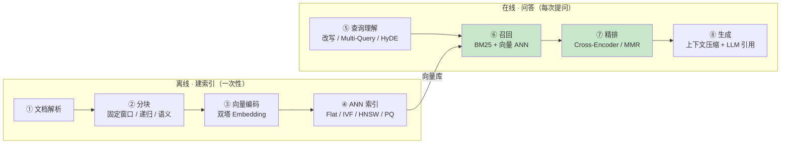

# 00 RAG 流水线与算法地图

| 元信息 | 内容 |
|------|------|
| 所属模块 | RAG 检索算法专题（认知层） |
| 篇目 | 00（速过） |
| 预计时间 | 30-45 分钟 |
| 前置 | 无 |
| 面试可答一句话摘要 | 能一句话讲清 RAG 的「离线三步 + 在线四步」，指出混合召回与精排是 ROI 最高的两环，并给出「检索不准 → 四环节归因」的排查框架 |

> 本篇是全系列地图：后续每篇都落在流水线的某一格上。不写代码，只回答三个问题——**整条链路上有哪些算法、各解决什么问题、学不到什么程度为止**。

## 1. 全景：一条流水线，八个环节

RAG 没有一个统一的「RAG 算法」，它是流水线，每个环节挂着各自的算法族：

| 环节 | 一句话职责 | 挂着的算法 | 本册篇目 |
|------|-----------|-----------|---------|
| ① 文档解析 | 把 PDF/HTML 变成干净文本 | 解析器、OCR | ❌ 不覆盖（工程杂活，用现成的） |
| ② 分块 | 切成语义完整的片段 | 固定窗口、递归分割、语义分块、结构感知 | 01（精讲） |
| ③ 向量编码 | 把「意思」变成「距离」 | 双塔 Embedding、对比学习（直觉层） | 02（精讲） |
| ④ ANN 索引 | 百万向量毫秒出 top-k | Flat、IVF、HNSW、PQ | 03（精讲） |
| ⑤ 查询理解 | 把 query 变得更好搜 | 改写、Multi-Query、HyDE、路由 | 06（速过） |
| ⑥ 召回 | 双路并行、宁多勿漏 | BM25、向量 ANN、RRF 融合 | 04（精讲） |
| ⑦ 精排 | 把「大概相关」排成「真的相关」 | Cross-Encoder、MMR | 05（精讲） |
| ⑧ 生成 | 带着引用回答，不胡说 | 上下文压缩（LLMLingua）、摆放策略 | 06（速过，压缩部分） |
| 进阶范式 | 让系统自己纠错 | Self-RAG、CRAG、GraphRAG | 07（引子） |
| 评估 | 知道优化有没有用 | recall@k、MRR、NDCG@10、faithfulness | 指路原理册 06-2 |

> 🎯 绿色两格（⑥ 召回 + ⑦ 精排）是工程 ROI 最高的环节——「先快召回、再精排」的两阶段结构是 2026 年的标配。

## 2. 三档分级：学到什么程度为止

Agent 工程师不卷算法研究。每个算法先问自己它落在哪一档：

| 档位 | 标准 | 覆盖算法 | 学习动作 |
|------|------|---------|---------|
| 一档 · 精通 | 直接写进你的代码，影响选型/调参/排查 | 分块策略、embedding 选型、BM25、混合 + RRF、Cross-Encoder rerank、MMR、HNSW 调参 | 精讲：原理直觉 + 最小案例 + 扫参实验 |
| 二档 · 懂直觉 | 能解释黑盒边界，面试能画图讲清 | 双塔/对比学习、IVF/HNSW 为什么快、HyDE/Multi-Query 适用场景、PQ | 精讲篇内「原理直觉」小节 + 一句话复述 |
| 三档 · 知道存在 | 会调包即可，几乎不自己实现 | SPLADE、ColBERT、DiskANN、RankGPT、Self-RAG/CRAG/GraphRAG、Louvain | 引子：一段话 + 链接索引 |

> 💡 判断标准一句话：**影响你选型、调参、排查质量问题的 → 学透；只影响你「造轮子」的 → 知道即可。** Transformer 内部、训练细节是算法岗主线，不在本册。

## 3. 归因框架：「检索不准」先问哪一环

RAG 效果差时，最忌讳无头苍蝇式换模型。先按环节归因：

| 症状 | 第一嫌疑 | 病理 | 去哪篇 |
|------|---------|------|--------|
| RAG 建完才起疑：语料其实全文塞得进窗口、要求行级权限、或数据频繁变动 | ⓪ 入口判断 | RAG 不是默认架构——先过「该不该上 RAG」（成本 / 时效 / 权限 / 可引用性）再谈环节归因 | 07（相邻空白档） |
| 答案所在的段落被拦腰切断 / 一条 chunk 混多个主题 | ② 分块 | 粒度与 query 类型不匹配 | 01 |
| 同义改写的 query 搜不到，但换原文关键词能搜到 | ③ 编码 | embedding 与语料域不匹配、没加 instruction | 02 |
| 搜得到但太慢 / 向量一大内存爆炸 | ④ 索引 | 索引类型或参数不对 | 03 |
| 涉及型号、错误码、人名的 query 搜不到 | ⑥ 召回 | 缺 BM25 路，精确词被语义平滑掉 | 04 |
| 召回了一堆「大概相关」，真答案排在第 8 位 | ⑦ 精排 | 没上 rerank，或候选数/模型不对 | 05 |
| 多轮对话里「它怎么部署」搜不到东西 | ⑤ 查询理解 | 指代没消解 | 06 |
| 检索结果都对，回答还是胡说 | ⑧ 生成 | 上下文摆放/压缩问题，或该用进阶范式兜底 | 06、07 |

> ⚠️ 归因要有数据支撑：20-30 条真实查询 + bad case 采样，评估指标（recall@k / MRR / faithfulness）的完整流程见原理册 06-2。本册的练习全部建立在这个习惯上——**先量化，再动手**。

## 4. 篇目导航

| 篇 | 深度档 | 内容 |
|----|--------|------|
| [01-分块策略](./01-分块策略.md) | 精讲 | 固定窗口 / 递归 / 语义 / 结构感知 / 父子分块 |
| [02-Embedding与向量表示](./02-Embedding与向量表示.md) | 精讲 | 双塔、对比学习直觉、度量选择、ANN 问题定义 |
| [03-ANN索引](./03-ANN索引-Flat-IVF-HNSW-PQ.md) | 精讲 | Flat / IVF / HNSW / PQ + 选型对比 |
| [04-BM25与混合检索RRF](./04-BM25与混合检索RRF.md) | 精讲 | BM25 公式逐项、混合检索、RRF |
| [05-Rerank](./05-Rerank-CrossEncoder与MMR.md) | 精讲 | 双塔 vs Cross-Encoder、两阶段检索、MMR |
| [06-查询改写与上下文压缩](./06-查询改写与上下文压缩.md) | 速过 | 症状 → 手段速查表 |
| [07-进阶范式与评估指路](./07-进阶范式与评估指路.md) | 引子 | 范式一句话 + 相邻空白档（多模态 / text-to-SQL / 长上下文决策 / 间接注入）+ 评估指路 |

**总大纲与规格声明**见 [README](../README.md)。

## 5. 练习：画出自己项目的算法地图

**要求**：拿 agent-fullstack 阶段 1 的任一项目（推荐 02-customer-service），逐环节填一张表——每个环节「用了什么算法 / 没用什么算法 / 哪个环节最可疑」，并按 §3 的归因表给它做一次预判。

**预期效果**：后续每学完一篇，回到这张地图上更新一格；全系列结束时，它就是你的「RAG 检索选型备忘录」。

---

**下一篇**：[01-分块策略](./01-分块策略.md)——检索质量的第一刀。
