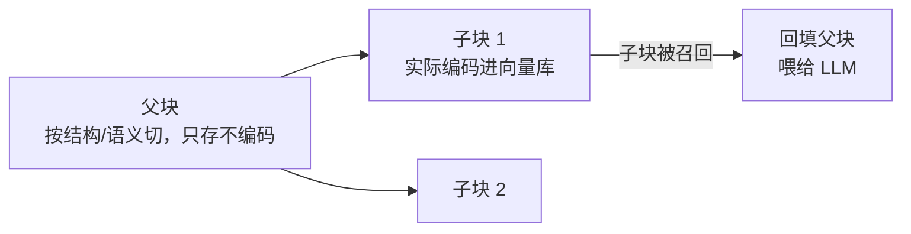

# 01 分块策略

| 元信息 | 内容 |
|------|------|
| 所属模块 | RAG 检索算法专题（基础层） |
| 篇目 | 01（精讲） |
| 预计时间 | 1-2 天 |
| 前置 | [00-流水线与算法地图](./00-RAG流水线与算法地图.md) |
| 面试可答一句话摘要 | chunk 切多大没有普适值——256~512 token + 10%~20% overlap 是起点，正确做法是按文档结构与 query 类型选切法、用评测集扫参；父子分块（小块检索、大块喂 LLM）常能兼顾粒度矛盾 |

## 学习目标

- 说清分块为什么是检索质量的第一刀：太粗稀释语义、太细截断上下文
- 手写并区分三种切法的行为差异：固定窗口、递归字符分割、结构感知（附实测输出）
- 知道语义分块与父子分块各自的适用场景与代价
- 建立「切法 × query 类型」评测习惯，不再拍脑袋定 chunk size

---

## 1. 为什么分块是第一刀

Embedding 模型把**一段文本**压缩成**一个向量**。分块决定了「一段」有多大，也就决定了向量里装了什么：

| 粒度 | 病理 | 症状 |
|------|------|------|
| 太粗 | 一条 chunk 混多个主题，单向量语义被稀释 | 检索回来的内容一半无关；答案所在片段排不进 top-k |
| 太细 | 语义被拦腰切断，chunk 缺上下文 | 搜「怎么部署」命中的是半句话；LLM 拿到碎片无法作答 |

> 💡 这两个失败方向天然互斥，所以**没有最优切法，只有匹配文档结构和 query 类型的切法**——这是全篇的结论句。

## 2. 五种切法

### 2.1 固定窗口 + overlap

滑窗硬切：每 `size` 字符一块、相邻块重叠 `overlap`。overlap 的作用是让跨块边界的句子至少完整出现在一块里。

- 优点：实现五行、行为完全可预测
- 失败模式：**在字符中间下刀**——实测里把「BM25」切成了「M25」，把句子切成残句

### 2.2 递归字符分割（LangChain 默认）

按分隔符优先级 `\n\n → \n → 。→ 空格 → 字符` 递归切：先用大分隔符，切不动的块再换下一级分隔符。目标是「尽量在自然边界下刀」。

- 优点：句子基本完整，通用性最好
- 失败模式：**不理解结构**——实测出现三种病灶：标题孤儿（标题独占一块）、标题粘尾（下一节标题粘在上一块末尾）、标题丢失（正文块没有自己的标题）

### 2.3 语义分块

先用 embedding 算相邻句子的相似度，在相似度骤降处（语义断点）下刀。思路来自 Greg Kamradt 的语义分块实验。

- 优点：边界由语义决定，主题最完整
- 失败模式：**离线成本高**（每个句子都要过一次 embedding）；对格式规整的文档（Markdown/代码）不如结构感知

### 2.4 结构感知分块

按文档已有结构切：Markdown 标题、代码块、表格、条目。每个 chunk 携带**标题面包屑**（`RAG 入门 > 检索原理`），把丢失的层级上下文补回来。

- 优点：尊重作者划好的语义边界；面包屑让孤立段落可被「按主题」搜到
- 失败模式：依赖文档结构质量；结构混乱的老文档（纯文本导出、扫描件）没有结构可感知

### 2.5 父子分块（small-to-big）

检索和生成对粒度的要求相反：**检索要小块**（语义聚焦、向量准），**生成要大块**（上下文完整）。父子分块把两件事拆开：



- 优点：同时兼顾两个矛盾目标，是「细检索 + 粗生成」的标准解法
- 失败模式：存储翻倍；父块太大时 LLM 上下文又装不下——父块也要设上限

## 3. 实测对照：三种切法

完整代码（strict TS，零依赖，`bun run` 即跑）：

```ts
// chunks.ts —— 三种切法对照
type Chunk = { text: string; meta: string }

const DOC = `# RAG 入门
RAG 是检索增强生成，用检索到的知识约束 LLM 生成。它解决两个问题：知识时效性与私有知识。核心思路是把回答依据放进上下文，而不是指望模型记住一切。
## 检索原理
向量检索把文本编码成高维向量，用相似度衡量语义距离。查询与文档在同一表示空间中比较，意思相近的文本距离更近。
BM25 是关键词检索的代表，它统计词频与逆文档频率，擅长精确匹配。
## 生成原理
LLM 基于检索到的上下文回答问题。上下文的质量决定回答的上限，因此检索与排序至关重要。`

// 切法一：固定窗口 + overlap（无脑滑窗）
const fixedSplit = (text: string, size: number, overlap: number): string[] => {
  const step = size - overlap
  const out: string[] = []
  for (let i = 0; i < text.length; i += step) {
    out.push(text.slice(i, i + size))
    if (i + size >= text.length) break
  }
  return out
}

// 切法二：递归字符分割（LangChain 默认思路：按分隔符优先级递归切）
const SEPARATORS = ['\n\n', '\n', '。', ' ', '']
const recursiveSplit = (text: string, maxLen: number, seps: string[] = SEPARATORS): string[] => {
  if (text.length <= maxLen) return text.trim() ? [text.trim()] : []
  const [sep, ...rest] = seps
  const parts = sep ? text.split(sep) : Array.from(text)
  const out: string[] = []
  let buf = ''
  for (const p of parts) {
    const piece = sep ? p + sep : p
    if (piece.length > maxLen) {
      if (buf.trim()) out.push(buf.trim())
      buf = ''
      out.push(...recursiveSplit(piece, maxLen, rest))
    } else if ((buf + piece).length > maxLen) {
      if (buf.trim()) out.push(buf.trim())
      buf = piece
    } else buf += piece
  }
  if (buf.trim()) out.push(buf.trim())
  return out
}

// 切法三：结构感知（按 Markdown 标题切，chunk 携带标题面包屑）
const mdSplit = (text: string, maxLen: number): Chunk[] => {
  const out: Chunk[] = []
  const stack: { level: number; title: string }[] = []
  let buf: string[] = []
  const breadcrumb = () => stack.map((s) => s.title).join(' > ')
  const flush = () => {
    const body = buf.join('\n').trim()
    if (body) out.push({ text: body, meta: breadcrumb() || '（根）' })
    buf = []
  }
  for (const line of text.split('\n')) {
    const m = /^(#{1,6})\s+(.+)$/.exec(line)
    if (m) {
      flush()
      const level = m[1].length
      while (stack.length && stack[stack.length - 1].level >= level) stack.pop()
      stack.push({ level, title: m[2] })
    } else if (buf.join('\n').length + line.length + 1 > maxLen) {
      flush()
      buf.push(line)
    } else buf.push(line)
  }
  flush()
  return out
}

const preview = (s: string) => s.slice(0, 22).replaceAll('\n', '⏎') + '…'

console.log('== 切法一：固定窗口 size=60 overlap=10 ==')
fixedSplit(DOC, 60, 10).forEach((c, i) => console.log(`#${i} (${c.length}字) ${preview(c)}`))

console.log('\n== 切法二：递归分割 maxLen=60 ==')
recursiveSplit(DOC, 60).forEach((c, i) => console.log(`#${i} (${c.length}字) ${preview(c)}`))

console.log('\n== 切法三：结构感知 maxLen=80（带标题面包屑）==')
mdSplit(DOC, 80).forEach((c, i) => console.log(`#${i} [${c.meta}] (${c.text.length}字)`))
```

实测输出（本机 macOS，Bun v1.1.38，2026-09）：

```text
== 切法一：固定窗口 size=60 overlap=10 ==
#0 (60字) # RAG 入门⏎RAG 是检索增强生成，用…
#1 (60字) 性与私有知识。核心思路是把回答依据放进上下文…
#2 (60字) 本编码成高维向量，用相似度衡量语义距离。查询…
#3 (60字) M25 是关键词检索的代表，它统计词频与逆文…
#4 (36字) 到的上下文回答问题。上下文的质量决定回答的上…

== 切法二：递归分割 maxLen=60 ==
#0 (8字) # RAG 入门…
#1 (48字) RAG 是检索增强生成，用检索到的知识约束 …
#2 (30字) 核心思路是把回答依据放进上下文，而不是指望模…
#3 (7字) ## 检索原理…
#4 (54字) 向量检索把文本编码成高维向量，用相似度衡量语…
#5 (42字) BM25 是关键词检索的代表，它统计词频与逆…
#6 (44字) LLM 基于检索到的上下文回答问题。上下文的…

== 切法三：结构感知 maxLen=80（带标题面包屑）==
#0 [RAG 入门] (76字)
#1 [RAG 入门 > 检索原理] (54字)
#2 [RAG 入门 > 检索原理] (34字)
#3 [RAG 入门 > 生成原理] (44字)
```

**逐条解读**（病灶就是学习点）：

| 观察 | 出处 | 说明 |
|------|------|------|
| 「BM25」被切成「M25」 | 切法一 #3 | 字符级下刀的直接恶果：这个词的两个路都搜不到 |
| 标题孤儿 | 切法二 #0 | 「# RAG 入门」独占 8 字一块，向量里只有标题没有内容 |
| 标题粘尾 | 切法二 #5 | BM25 段落（34 字）后面粘着「## 生成原理」——下一节标题进了上一块的向量 |
| 标题丢失 | 切法二 #6 | LLM 段落没有自己的标题，被问到「生成原理」时缺一层语义信号 |
| 面包屑修复 | 切法三 #1-#3 | 每个 chunk 自带 `RAG 入门 > 检索原理`，正文 + 层级上下文一起进向量 |

> 💡 长度单位说明：教学代码按字符数切（中文 1 字 ≈ 0.6~0.8 token，视 tokenizer 而定）；生产实现请按 tokenizer 计数，并注意中英混排时「同 token 数的中文信息量 ≈ 英文的 1.5~2 倍」。

## 4. 调参与评测：别拍脑袋定 size

| 参数 | 经验起点 | 调法 |
|------|---------|------|
| chunk size | 256~512 token（中文约 350~700 字） | 从起点上下各扫一档（如 128 / 256 / 512 / 1024） |
| overlap | size 的 10%~20% | 只在固定窗口/递归切法下需要；结构感知通常不需要 |
| 嵌入上限 | 看模型（BGE-M3 8K、Qwen3-Embedding 32K） | 上限大 ≠ 该切大：单向量语义稀释问题不随模型上下文变长而消失 |

**评测流程**（约 20 条就够起步）：

1. 构造评测集：`query → 应命中的 gold chunk`（从真实用户问题里挑，别自己编）
2. 固定 embedding 模型与检索策略，只扫分块参数
3. 量 recall@k：gold chunk 进没进 top-k
4. 结论落到「切法 × query 类型」表上，而不是一个孤零零的最优数字

## 5. 踩坑与边界

| 坑 | 现象 | 规避 |
|----|------|------|
| 表格/代码块被切碎 | 结构信息散架，检索回来的是半张表 | 结构感知切法把表格/代码块当不可分原子 |
| 只看 chunk 数量调参 | 切得又碎又多，看似省 token 实则召回崩 | 永远用 recall@k 验收，不用肉眼看 chunk |
| overlap 当万能药 | overlap 补的是「边界句子」，补不了「主题稀释」 | 跨主题问题换切法，不是加 overlap |
| 文档解析质量背锅给分块 | PDF 双栏解析错乱 → 再好的切法也白搭 | 解析是 00 篇环节①的活，先保证文本干净 |
| 父块无上限 | 父块塞满上下文窗口，成本爆炸且稀释关键信息 | 父块也设上限（如 2~4 个子块合成） |

## 6. 练习：切法 × query 类型对照（约 60-90 分钟）

**要求**：①复用 §3 代码（或换成你的项目语言），对一篇真实的 Markdown 文档（500+ 字、至少两级标题）跑三种切法；②挑 8~10 条真实 query（一半「找概念解释」、一半「找具体操作/代码」），人工判断每种切法下答案落在哪条 chunk、是否完整；③填出「切法 × query 类型」对照表并给出你这篇文档的切法结论。

**提示**：「找概念解释」类 query 偏好粗粒度（概念 + 解释在同一块），「找具体操作」类偏好细粒度 + 面包屑（步骤本身短，靠标题定位）；固定窗口基本只在「文档毫无结构」时才值得考虑。

**预期效果**：能对着自己的实测表说出「这篇文档该用 XX 切法 + size YY」并给出 recall 依据；面对「chunk 切多大」的追问，答案从「经验值」升级为「起点值 + 评测方法」。

## 7. 面试问答

> **问：chunk 切多大合适？**
>
> **答：** 没有普适值。256~512 token 加 10%~20% overlap 是常见起点，但正确的做法是：先看文档结构（Markdown/代码用结构感知，纯文本用递归分割），再构造 20 条真实 query 的评测集扫参，用 recall@k 验收。粒度太粗，一条 chunk 混多个主题稀释向量语义；太细，语义被截断、上下文不完整。两个目标冲突时用父子分块——小块负责检索、大块负责生成。

> **追问（陷阱）：上下文窗口都 128K 了，为什么不干脆整篇文档一条 chunk？**
>
> **答：** 模型吃得下 ≠ 向量表达得好。Embedding 把整段压成单向量，文档越长、主题越多，向量越「平均」，和具体 query 的相似度区分度越差；而且整篇返回会塞满上下文、稀释 LLM 注意力（lost in the middle，见 06 篇）。长上下文模型解决的是「喂多少」，分块解决的是「向量装什么」——两个问题。

## 参考链接

- [LangChain Text Splitters 官方文档](https://python.langchain.com/docs/concepts/text_splitters/) —— 递归分割的分隔符优先级与 SemanticChunker 的权威说明（语义分块思路源自 Greg Kamradt 的切分实验，工具化实现以官方文档为准）
- 仓库内走读靶子：`src/artificial-intelligence/handcrafted/doc/03-手写检索三件套/`（内嵌 BM25 / 余弦 top-k / RRF 的手写实现与测试，04 篇将对照使用）

---

**下一篇**：[02-Embedding与向量表示](./02-Embedding与向量表示.md)——chunk 切好了，怎么把「意思」变成「距离」。
