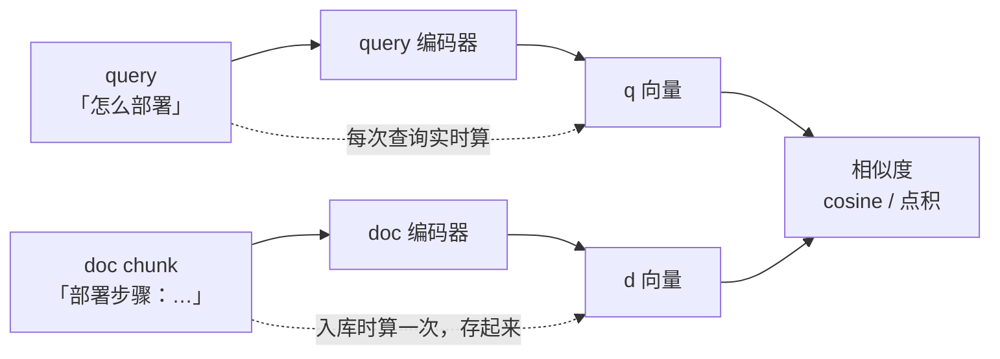

# 02 Embedding 与向量表示

| 元信息 | 内容 |
|------|------|
| 所属模块 | RAG 检索算法专题（核心层） |
| 篇目 | 02（精讲） |
| 预计时间 | 1 天 |
| 前置 | [01-分块策略](./01-分块策略.md)；原理册 04-2（Embedding 与相似度）已读 |
| 面试可答一句话摘要 | 双塔把 query 和 doc 独立编码到同一空间、doc 侧可离线预计算；语义检索本质是度量学习——训练让「意思相近」变成「距离相近」；精确 kNN 的 O(N·d) 在线扛不住，这就是 ANN 要解决的问题 |

## 学习目标

- 画出双塔结构图，并指出哪一侧可以离线预计算、为什么
- 用「正例拉近、负例推远」一句话讲清对比学习在做什么（不展开训练细节）
- 会选相似度度量：cosine / 点积 / 欧氏什么时候等价、什么时候不等价
- 说清精确 kNN 的复杂度问题——它是 03 篇 ANN 索引的引子

---

## 1. 双塔结构：为什么 doc 侧可以离线

Embedding 模型是一对编码器（双塔）：query 和 doc 各自过**同一个**（或对称的）编码器，输出到同一向量空间，再用相似度比较。



| 塔侧 | 何时编码 | 工程含义 |
|------|---------|---------|
| doc 塔 | 离线，入库时算一次 | 1000 万 chunk 只编码 1000 万次，之后只存向量 |
| query 塔 | 在线，每次查询实时算 | 查询延迟里多一次编码（~几十 ms），通常可接受 |

这个不对称性是语义检索能做大的前提：**在线成本只与「一次编码 + 一次 ANN 查询」相关，与库大小无关**（库大小只影响 ANN 那步，见 03 篇）。

## 2. 对比学习直觉：训练在做什么

双塔凭什么把「意思相近」变成「距离相近」？训练目标一句话：**正例拉近、负例推远**。

- 正例：同一句话的两种说法、问题与它的答案段落——在向量空间里把它们的距离压小
- 负例：batch 内其他不相关句子——推远
- 反复几百万次后，空间形状就变成「语义相近的区域挤在一起」

这就是原理册 01 篇说的「检索属于度量学习，不是分类」的落点：模型不学「这个文本属于哪类」，只学「谁和谁相近」。

> ⚠️ 边界：本册只需要这个直觉。对比学习的温度系数、难负例挖掘、训练数据构造，属于训练侧知识，不展开（原理册 §9 同款边界）。

## 3. instruction-aware：别裸调模型

2026 主流 embedding 模型（Qwen3-Embedding、BGE 系、E5 系）普遍是**指令感知**的：给 query 侧（有时 doc 侧也）加一段任务指令前缀，能显著提升检索质量。

```text
// Qwen3-Embedding 官方推荐的 query 指令（示意）
Instruct: Given a web search query, retrieve relevant passages that answer the query
Query: 如何配置 HNSW 索引参数
```

要点：

- query 和 doc 的指令**可以不同**——query 侧说「我要找答案段落」，doc 侧说「这是一段文档」
- 指令是模型训练时就见过的模式，官方模型卡会给出推荐写法——**照抄官方，不要自己编**
- 忘加指令不是错误，但在中低资源模型上常见 1~5 个点的召回差距（实测见练习）

## 4. 度量选择：cosine / 点积 / 欧氏

三个度量的关系（$\vec{a}$ 、$\vec{b}$ 为向量）：

$$\text{cosine}(a,b) = \frac{a \cdot b}{\lVert a \rVert \, \lVert b \rVert}$$

- **向量归一化后（长度 = 1）三者排序等价**：点积 = cosine，欧氏距离单调递减于 cosine
- 所以向量库默认归一化存储 + 内积检索，一石三鸟
- 不归一化时：点积会偏向长向量（高频词多的 chunk），欧氏受长度影响同理——**文本检索默认 cosine 的原因就是对向量长度不敏感**

实测一组 2D 手算向量（方向承载语义的缩小版，输出可手算验证）：

```ts
// cosine.ts —— 方向承载语义的最小示意（bun run cosine.ts）
const cos = (a: number[], b: number[]) =>
  a.reduce((s, v, i) => s + v * b[i], 0) / (Math.hypot(...a) * Math.hypot(...b))

const q = [3, 4]
console.log('语义相近  :', cos(q, [4, 3]).toFixed(2)) // 0.96 夹角小 → 分高
console.log('语义无关  :', cos(q, [-4, 3]).toFixed(2)) // 0.00 正交 → 无信号
console.log('语义相反  :', cos(q, [-3, -4]).toFixed(2)) // -1.00 反向 → 最低
```

```text
语义相近  : 0.96
语义无关  : 0.00
语义相反  : -1.00
```

真实 embedding 是 768~4096 维，直觉相同：**夹角（方向）承载语义，长度被归一化抹掉**。

## 5. 选型一句话：2026 主流格局

只记锚点（详细对比与决策树在原理册 06-3，不重复）：

| 模型 | 一句话定位 | 上下文 |
|------|-----------|--------|
| Qwen3-Embedding（0.6B/4B/8B） | 开源第一梯队、32K 长上下文、MRL 可裁剪维度 | 32K |
| BGE-M3 | 中文 + 混合检索三合一（dense/sparse/multi-vector），本册 04 篇会回收这个伏笔 | 8K |
| OpenAI text-embedding-3 / Cohere Embed v4 | 闭源 API 代表，省运维 | 8K/128K |

- **MRL / Matryoshka** 一句话：训练时让向量的前 256 维也能用——存储紧张时可截断维度、按 4~16 倍省空间，召回损失可控
- 选型铁律：**看 MTEB 榜单 + 用自己语料实测区分度**（榜单是通用品类，你的语料是你的品类）

## 6. 精确 kNN 为什么扛不住（引出 03 篇）

查询时最朴素的做法：库里每条向量都算一次相似度，取 top-k（精确 kNN / Flat）。

$$\text{cost} = O(N \cdot d)$$

代入真实规模：$N = 10^7$ 条、$d = 1024$ 维 → 一次查询约 $10^{10}$ 次乘加。即使 SIMD 加持，也在百毫秒到秒级——而 QPS 稍高的产品连 10ms 都嫌多。

| 方案 | 复杂度 | 精度 | 结论 |
|------|--------|------|------|
| 精确 kNN（Flat） | $O(N \cdot d)$ | 100% | 库小（<10 万）够用；大了扛不住 |
| ANN 近似最近邻 | ≈$O(\log N)$ 或 $O(\sqrt{N})$ 量级 | 95%~99%+ | 用一点点召回换几十倍延迟 → 03 篇主角 |

> 💡 ANN 的本质是「**允许漏掉 1%~5% 的真邻居，换几十上百倍的查询加速**」。怎么换、换多少，03 篇拆 Flat / IVF / HNSW / PQ 四个实现。

## 7. 调 embedding API 的最小骨架

OpenAI 兼容 API（含大多数国产模型）的十行调用，供练习使用：

```ts
// embed.ts —— 需填入 API key；对 OpenAI 兼容端点均可用
const embed = async (texts: string[], model: string): Promise<number[][]> => {
  const res = await fetch(`${process.env.EMBED_BASE_URL}/embeddings`, {
    method: 'POST',
    headers: { 'Content-Type': 'application/json', Authorization: `Bearer ${process.env.EMBED_API_KEY}` },
    body: JSON.stringify({ model, input: texts }),
  })
  const json = await res.json()
  return json.data.sort((a: { index: number }, b: { index: number }) => a.index - b.index).map((d: { embedding: number[] }) => d.embedding)
}
```

> ⚠️ 返回顺序按 `index` 重排——部分网关不保证 `data` 数组顺序与输入一致，这是真实踩过的坑。

## 8. 练习：模型区分度对照（约 45-60 分钟）

**要求**：①准备 4 组句对：2 组同义（如「怎么切分文档」vs「文档切块方法」）、2 组反义（如「增加召回」vs「降低召回」）；②用 §7 骨架分别请求 2 个不同 embedding 模型，算每组 cosine；③算每个模型的「区分度 = 同义对均分 − 反义对均分」，对比；④同模型下，给 query 加/不加 instruction 再测一遍。

**提示**：区分度低可能不是模型弱，而是语料域不匹配（通用模型 × 领域黑话）；instruction 用官方模型卡推荐的写法，不要自己编。

**预期效果**：能说出「我的语料上哪个模型区分度更高、instruction 带来多少分差」，并把结论写进自己项目的 embedding 选型备注——选型从此有实测数据，不再只看榜单。

## 参考链接

- [Qwen3-Embedding 官方博客](https://qwenlm.github.io/blog/qwen3-embedding/) —— 双塔/指令感知/MRL 的官方说明（§3、§5 依据）
- [BGE-M3 模型卡](https://huggingface.co/BAAI/bge-m3) —— 三合一表示官方文档
- [MTEB 榜单](https://huggingface.co/spaces/mteb/leaderboard) —— 分数逐月更新，以官方为准

---

**下一篇**：[03-ANN索引](./03-ANN索引-Flat-IVF-HNSW-PQ.md)——精确检索扛不住，近似怎么个近似法。
