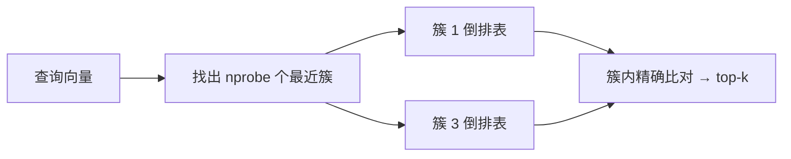
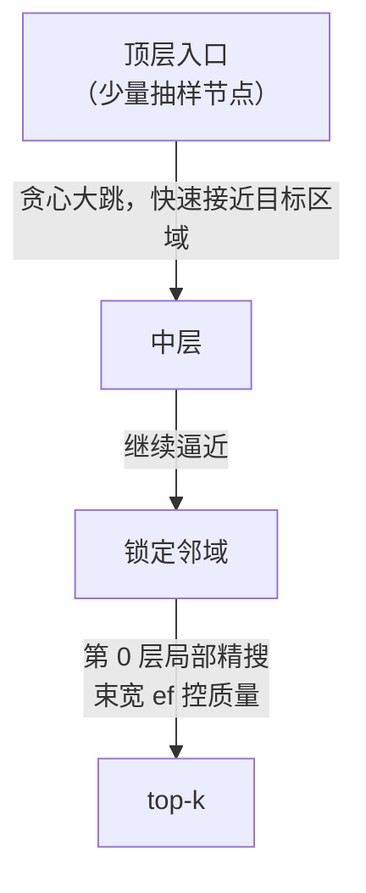
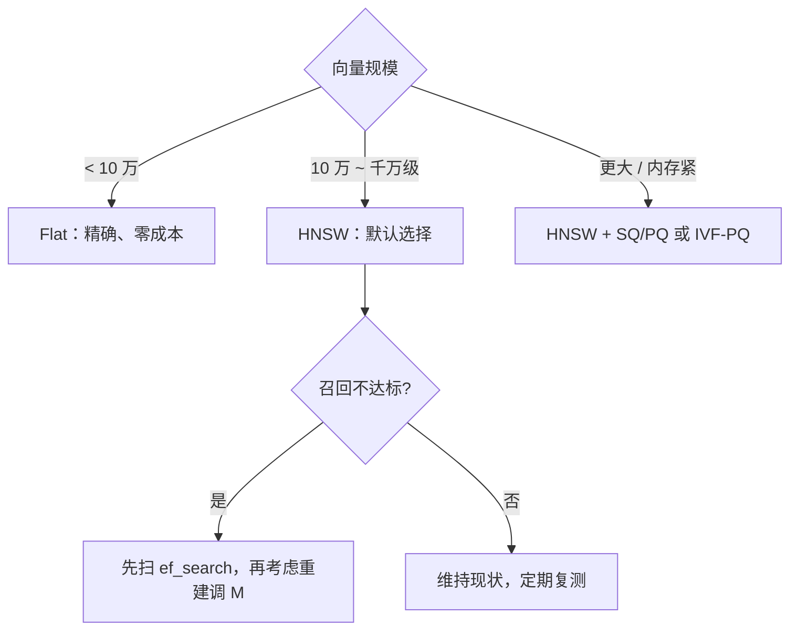

# 03 ANN 索引：Flat、IVF、HNSW、PQ

| 元信息 | 内容 |
|------|------|
| 所属模块 | RAG 检索算法专题（核心层） |
| 篇目 | 03（精讲） |
| 预计时间 | 1-2 天 |
| 前置 | [02-Embedding与向量表示](./02-Embedding与向量表示.md)（精确 kNN 复杂度问题） |
| 面试可答一句话摘要 | HNSW 把向量组织成多层图，查询从顶层稀疏长边贪心下潜到底层局部精搜，复杂度近似 O(log N)；代价是建索引时间和存图的内存，M/ef 参数在精度与速度间权衡——小库 Flat 反而最优，通用默认 HNSW，内存极端紧张上量化 |

## 学习目标

- 说清四个索引各自「拿什么换了速度」：IVF 拿簇内漏检、HNSW 拿图上近似走、PQ 拿量化误差
- 跑通「图搜索 vs 暴力检索」的召回率-成本对照实验（本篇实测）
- 会用 pgvector 建索引、调 ef_search，并知道哪些参数改动要重建索引
- 面对选型题能按「规模 / 内存 / 精度要求」给出决策

---

## 1. 共同思想：用「近似」换「速度」

02 篇算过账：千万级库做精确 kNN，一次查询 $10^{10}$ 量级乘加。所有 ANN 算法都做同一笔交换——**允许漏掉少量真邻居，换几十上百倍延迟**。区别只在「漏」的手法：

| 索引 | 漏检的手法 | 一句话 |
|------|-----------|--------|
| Flat | 不漏 | 精确基线，一切召回率的对照组 |
| IVF | 只搜最近的几个簇 | 簇外的一定漏——nprobe 是旋钮 |
| HNSW | 图上贪心走，不保证最优 | 束宽 ef 是旋钮 |
| PQ | 向量本身被压缩了 | 距离算得糙——量化误差 |

## 2. Flat：精确基线

没有索引，逐条比对，100% 召回。**别急着笑它慢**：10 万条以下、延迟预算宽松时，Flat 是零成本零风险的最优解，也是评估其他索引召回率的 ground truth 来源。

## 3. IVF：先聚类，只搜最近的几个簇



- 建索引：k-means 把全库聚成 `lists` 个簇，每条向量挂到最近簇的**倒排表**上
- 查询：先算 query 与各簇心的距离，挑 `nprobe` 个最近的簇，**只在这些簇内**精确比对
- 复杂度从 $O(N)$ 降到约 $O(\sqrt{N})$ 量级（`nprobe` 控制搜几个簇）

失败模式：query 落在簇边界时，真邻居可能在对面的簇里——`nprobe=1` 的召回率可以很差。pgvector 官方建议 `probes ≈ √lists` 起步（如 lists=100 → probes=10），再按召回-延迟扫参。

## 4. HNSW：分层图 + 贪心下潜（默认主角）

把全库组织成**多层图**：底层（第 0 层）包含全部向量、边短而密；往上层节点抽样变稀疏、边变长。查询从顶层入口开始：



直觉像「先走高速、再走省道、最后走小巷」：顶层长边负责跨越大半个空间，底层短边负责精搜。贪心走局部最优路线，复杂度近似 $O(\log N)$——**这是它成为默认选择的原因**。

| 参数 | 含义 | 建议起点 | 关键性质 |
|------|------|---------|---------|
| M | 每个点连多少条边 | 16~32 | 图质量与内存的共同来源；**改它要重建索引** |
| ef_construction | 建图时的候选宽度 | 64~128 | 只影响建索引质量与耗时；**改它也要重建** |
| ef_search | 查询时的束宽 | 32~128，且 ≥ k | 召回/延迟的**运行时旋钮，改它不用重建** |

> 💡 调参顺序：先扫 `ef_search`（零成本），不满意再动 `M / ef_construction`（重建索引）。

## 5. PQ：把向量本身压小

乘积量化（PQ）把 d 维向量切成 m 段，每段用聚类出的码本量化成一个 id——1024 维 float32（4KB）能压到 64 个 id（64B），**内存降 10~100 倍**，代价是距离有量化误差、召回掉几个点。SQ（标量量化）是更轻的变体（float32 → int8，4 倍压缩）。PQ 通常与 IVF/HNSW 组合使用（IVF-PQ、HNSW+SQ），单独讲清楚一个事实即可：**它压缩的是向量存储，不改变「搜哪」的逻辑**。

## 6. 实测：图搜索 vs 暴力检索

用单层 kNN 图 + HNSW 式搜索（论文 Algorithm 2 思路，不含多层与选边启发式）演示 ef 的权衡。300 条 8 维向量、每点连 6 条边：

```ts
// ann-demo.ts —— 图搜索 vs 暴力（bun run ann-demo.ts；完整版见本文末参考）
const lcg = (seed: number) => () => (seed = (seed * 1664525 + 1013904223) % 4294967296) / 4294967296
const rnd = lcg(42)
const N = 300, DIM = 8, K = 6
const pts = Array.from({ length: N }, () => Array.from({ length: DIM }, () => rnd() * 2 - 1))
const dist = (a: number[], b: number[]) => Math.sqrt(a.reduce((s, v, i) => s + (v - b[i]) ** 2, 0))
const graph = pts.map((p, i) =>
  pts.map((_, j) => j).filter((j) => j !== i)
    .sort((a, b) => dist(p, pts[a]) - dist(p, pts[b])).slice(0, K))

// HNSW 式搜索：best 是 top-ef 结果，cand 是待扩展候选；
// 最近候选比 best 里最差的还远 → 继续走也捞不到新东西，停
const search = (q: number[], entry: number, ef: number) => {
  const visited = new Set<number>([entry])
  const cand = [entry], best = [entry]
  while (cand.length) {
    cand.sort((a, b) => dist(q, pts[a]) - dist(q, pts[b]))
    const c = cand.shift()!
    if (best.length >= ef && dist(q, pts[c]) > dist(q, pts[best[best.length - 1]])) break
    for (const nb of graph[c]) {
      if (visited.has(nb)) continue
      visited.add(nb)
      cand.push(nb)
      best.push(nb)
      best.sort((a, b) => dist(q, pts[a]) - dist(q, pts[b]))
      if (best.length > ef) best.pop()
    }
  }
  return { top: best, visited: visited.size }
}

const bruteTop = (q: number[], k: number) =>
  pts.map((_, j) => j).sort((a, b) => dist(q, pts[a]) - dist(q, pts[b])).slice(0, k)

console.log(`库规模 N=${N}，暴力检索每次必须访问全部 ${N} 条\n`)
console.log('ef 束宽  recall@10   平均访问节点（成本代理）')
for (const ef of [10, 24, 64]) {
  let recall = 0, visitedSum = 0
  const Q = 50
  for (let t = 0; t < Q; t++) {
    const q = Array.from({ length: DIM }, () => rnd() * 2 - 1)
    const truth = new Set(bruteTop(q, 10))
    const { top, visited } = search(q, Math.floor(rnd() * N), ef)
    recall += top.filter((i) => truth.has(i)).length / 10
    visitedSum += visited
  }
  console.log(`${String(ef).padStart(4)}      ${(recall / Q).toFixed(2)}        ${(visitedSum / Q).toFixed(0)} / ${N}`)
}
```

实测输出（本机 macOS，Bun v1.1.38，2026-09）：

```text
库规模 N=300，暴力检索每次必须访问全部 300 条

ef 束宽  recall@10   平均访问节点（成本代理）
  10      0.82        52 / 300
  24      0.93        83 / 300
  64      0.99        149 / 300
```

**解读**：

- `ef` 就是那个「用访问换召回」的旋钮：ef=10 只访问 17% 的库，召回 0.82；ef=64 访问一半，召回 0.99
- 真实 HNSW 的多层结构让同样的召回只需访问更少节点（长边跳跃省掉了本演示中的中途绕路）
- 真实系统的 ef 默认值与向量库有关：pgvector 默认 `ef_search=40`，Milvus/qdrant 有各自基线——**不管默认多少，用你自己的 ground truth 扫一遍才算数**

## 7. pgvector 实操

```sql
-- HNSW 索引（pgvector ≥ 0.5）：度量算子类必须与模型一致（cosine 模型用 cosine_ops）
CREATE INDEX ON chunks
  USING hnsw (embedding vector_cosine_ops)
  WITH (m = 16, ef_construction = 64);

-- 运行时调束宽：会话级生效，不用重建索引
SET hnsw.ef_search = 64;
SELECT id, text FROM chunks ORDER BY embedding <=> $1 LIMIT 10;
```

IVFFlat 变体（注意：**要先导数据再建索引**，空表聚类不出有效簇）：

```sql
CREATE INDEX ON chunks USING ivfflat (embedding vector_cosine_ops) WITH (lists = 100);
SET ivfflat.probes = 10;  -- 官方起点：probes ≈ √lists（100 → 10）
```

## 8. 对比板块：四方选型

| 维度 | Flat | IVF | HNSW | PQ（配合上游） |
|------|------|-----|------|---------------|
| 精度 | 100% | nprobe 决定 | ef 决定 | 额外量化损失 |
| 查询延迟 | $O(N \cdot d)$ | $O(\sqrt{N})$ 量级 | $O(\log N)$ 量级 | 取决于上游 |
| 内存 | 原始向量 | 原始 + 簇心 | 原始 + 图边（约 5%~15%） | 压缩 10~100 倍 |
| 建索引 | 无 | 快 | 慢 | 需训练码本 |
| 动态更新 | 即时 | 一般 | 支持增量 | 常需重训 |
| 适用 | <10 万 / 精度敏感 | 超大规模、内存敏感 | **通用默认** | 内存极端紧张 |

> 📌 内存账细算：图边每个节点约 $2M \times 4B$（M=16 → 128B），而 768 维 fp32 向量一个就 3KB——图边只占原始向量的约 5%~15%（M=16~32、768~1536 维 fp32 量级）。**向量被 PQ/SQ 压小之后，图边占比才显著放大**——所以省内存的大头是量化向量本身，不是省图边。



## 9. 踩坑与边界

| 坑 | 现象 | 规避 |
|----|------|------|
| 算子类选错 | cosine 模型配了 l2_ops，召回莫名差 | 度量与训练一致：cosine 模型 → `vector_cosine_ops` |
| 只建索引不调 ef | 召回卡在 0.85 不知道能救 | `SET hnsw.ef_search` 先扫 16/64/128 |
| 重建参数误当运行参数 | 改 M 停机重建半天才发现没用 | M/ef_construction 才需重建；ef_search 是 SET 一下 |
| 召回率没有对照组 | 「感觉检索还行」 | 抽 100 条 query 用 Flat 跑 ground truth 再对照 |
| 量化后不测召回 | 内存省 10 倍，召回掉 8 个点没人发现 | 量化前后必跑同一组 recall@k |

## 10. 练习：ef_search 扫参（约 60-90 分钟）

**要求**：①用 pgvector（或任意向量库）灌 1 万+ 条真实 chunk 向量；②抽 50 条 query，用 Flat 索引跑出 ground truth top-10；③切到 HNSW，扫 `ef_search = 16 / 40 / 64 / 128`，记录 recall@10 与查询耗时；④画出「ef-召回-延迟」关系并给出你库里的推荐值。

**提示**：recall@10 = 图搜索结果与 Flat 结果的交集占比；耗时取 p95 而不是均值；若 ef=128 还到不了 0.95，先查 embedding 归一化与算子类，再考虑重建调 M。

**预期效果**：能对着自己的曲线说出「库 X 万条、M=16、ef_search=YY 时召回 0.9x、p95 延迟 Z ms」——索引参数从此是实测决策而非文档默认值。

## 11. 面试问答

> **问：HNSW 为什么快？**
>
> **答：** 它把向量组织成多层图：顶层节点稀疏、边长，负责跨越大半个空间；底层包含全部向量、边短，负责精搜。查询从顶层入口贪心走向目标邻域，逐层下潜，每层的候选范围指数缩小，复杂度近似 O(log N)。代价是建索引时间和存图的额外内存；M 控制图的密度、ef_search 控制查询束宽，两者都在精度与速度之间权衡。

> **追问（陷阱）：既然 HNSW 这么好，为什么不全都用它？**
>
> **答：** 两个反例：一是小库——10 万条以内 Flat 的精确检索也就毫秒级，HNSW 反而白付内存和建索引成本，还引入不必要的漏检；二是内存极度紧张的场景——HNSW 要为图边多付约 5%~15% 的内存（M=16、千维 fp32 时），但省内存的真正大头是把向量本身量化（PQ/SQ 压 4~100 倍），IVF-PQ / HNSW+SQ 这类组合才是主力方案。索引选型是规模、内存、精度的三角，HNSW 只是大多数情况下的默认，不是万金油。

## 参考链接

- [hnswlib 官方仓库](https://github.com/nmslib/hnswlib) —— HNSW 参数语义的权威说明（M/ef_construction/ef_search）
- [Faiss Wiki](https://github.com/facebookresearch/faiss/wiki) —— IVF/PQ 原理与参数（Faiss 官方）
- [pgvector 官方仓库](https://github.com/pgvector/pgvector) —— §7 SQL 语法与默认值依据
- 交互演示：`demos/hnsw-layers.html`（随本篇产出，见 [README §11](../README.md)）

---

**下一篇**：[04-BM25与混合检索RRF](./04-BM25与混合检索RRF.md)——向量路修好了，另一条路为什么不能拆。
