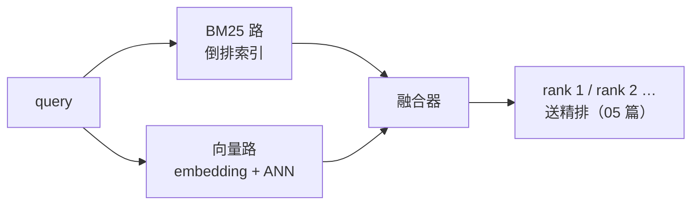

# 04 BM25 与混合检索、RRF

| 元信息 | 内容 |
|------|------|
| 所属模块 | RAG 检索算法专题（核心层） |
| 篇目 | 04（精讲） |
| 预计时间 | 1 天 |
| 前置 | [02-Embedding与向量表示](./02-Embedding与向量表示.md)（03 篇可并行） |
| 面试可答一句话摘要 | 向量检索擅长语义泛化但对精确词不敏感，BM25 恰好相反——双路并行 + RRF 用排名（而非分数）融合，天然规避两路分数量纲不可比的问题，通常比任一单路稳 |

## 学习目标

- 把 BM25 公式每一项讲出直觉：IDF、词频饱和（k1）、长度归一化（b），并手算验证一遍
- 说清「语义平滑」坑：哪些 query 只有 BM25 能救
- 会用 RRF 融合两路排名，能解释为什么用排名不用分数、k=60 是什么
- 能判断自己的项目要不要上混合检索（对比板块 + 练习）

---

## 1. 为什么语义检索时代 BM25 没死

向量检索把语义泛化当卖点，但泛化是双刃剑——它会把**不该平滑的词也平滑掉**：

| query | 向量路的表现 | BM25 的表现 |
|-------|-------------|------------|
| 「ERR_CONN_RESET 怎么处理」 | 错误码被语义平滑，可能召回泛泛的「网络问题处理」 | 精确命中含该错误码的文档 |
| 「BGE-M3 的上下文长度」 | 型号名模糊匹配到一切 embedding 文档 | 精确锁定含「BGE-M3」的段落 |
| 「文档怎么切块」 | ✅ 语义泛化的主场（同义改写也能中） | 搜「切块」漏掉写「分片/chunking」的文档 |

**结论：两路各有主场，谁也替代不了谁——所以工程标配是混合检索。**

## 2. TF-IDF → BM25：公式逐项拆

BM25 是 TF-IDF 的工程化改进，先看完整式（query $q$、文档 $d$、词 $t$）：

$$\text{score}(q,d)=\sum_{t \in q}\text{IDF}(t) \cdot \frac{f(t,d) \cdot (k_1+1)}{f(t,d)+k_1 \cdot \left(1-b+b \cdot \frac{\lvert d \rvert}{\text{avgdl}}\right)}$$

$$\text{IDF}(t)=\ln\frac{N-n_t+0.5}{n_t+0.5}$$

| 组件 | 直觉 | 比 TF-IDF 改进了什么 |
|------|------|---------------------|
| IDF | 越稀有的词信号越强（出现在 1/4 文档 vs 999/1000 文档） | 保留 TF-IDF 的核心 |
| 词频饱和 | $f$ 出现 3 次比 1 次强，但 30 次不该比 3 次强 10 倍 | TF-IDF 的词频是线性增长的，会偏向复读机文档；$k_1$（常用 1.2~2.0）控制饱和快慢 |
| 长度归一化 | 长文档天然词多，不该因此占便宜；但也别全罚——$b$（常用 0.75）在「全归一」与「不归一」之间取折中 | TF-IDF 完全不管文档长度 |

> 📌 公式变体：上式 IDF 在 $n_t = N$ 时会变负——Lucene 实现与 §4 代码都在对数内加 1（$\ln\left(\frac{N-n_t+0.5}{n_t+0.5}+1\right)$）防负数，两式只差一个常数项，不影响排序直觉。

> 💡 调参口径：$k_1$ 越大饱和越慢、越偏词频；$b=1$ 全按长度归一、$b=0$ 完全不管长度。两者极少需要调离默认（k1=1.5、b=0.75 是安全起点），**先怀疑分词，再怀疑参数**。

## 3. SPLADE 一句话

学习型稀疏检索：用模型预测每个词的「重要性权重」，生成带权稀疏向量——兼具稀疏的可解释精确匹配与一部分语义扩展。知道它存在、是 BM25 的升级方向之一即可，不展开。

## 4. 实测：BM25 打分手算对照

小语料（空格预分词，聚焦算法本身；生产中分词交给 tokenizer）：

```ts
// bm25.ts —— BM25 + RRF 手算对照（bun run bm25.ts）
type Doc = { id: string; terms: string[] }
const docs: Doc[] = [
  { id: 'd1', terms: ['向量', '索引', '原理'] },
  { id: 'd2', terms: ['向量', '检索', '原理'] },
  { id: 'd3', terms: ['BM25', '稀疏', '检索'] },
  { id: 'd4', terms: ['索引', '结构'] },
]

const k1 = 1.5
const b = 0.75
const N = docs.length
const avgdl = docs.reduce((s, d) => s + d.terms.length, 0) / N

const idf = (t: string) => {
  const n = docs.filter((d) => d.terms.includes(t)).length
  return Math.log((N - n + 0.5) / (n + 0.5) + 1) // +1 防负数（Lucene 变体）
}

const bm25 = (query: string[], d: Doc) =>
  query.reduce((score, t) => {
    const f = d.terms.filter((x) => x === t).length
    if (!f) return score
    const norm = 1 - b + (b * d.terms.length) / avgdl // 长度归一化
    return score + idf(t) * ((f * (k1 + 1)) / (f + k1 * norm)) // 词频饱和
  }, 0)

const query = ['向量', '索引']
const bm25Rank = [...docs].sort((a, c) => bm25(query, c) - bm25(query, a))
console.log(`N=${N}  avgdl=${avgdl}  IDF(向量)=IDF(索引)=${idf('向量').toFixed(4)}`)
console.log('\nBM25 打分（query=向量+索引）:')
bm25Rank.forEach((d) => console.log(`  ${d.id}  score=${bm25(query, d).toFixed(4)}  terms=${d.terms.join('/')}`))

// 模拟向量检索的结果排序（语义模型把「检索原理」类文档排前）
const vectorRank = ['d2', 'd1', 'd3', 'd4']

const rrf = (rankings: string[][], k = 60) => {
  const scores = new Map<string, number>()
  for (const rank of rankings)
    rank.forEach((id, i) => scores.set(id, (scores.get(id) ?? 0) + 1 / (k + i + 1)))
  return [...scores.entries()].sort((a, c) => c[1] - a[1])
}

console.log('\nRRF 融合（k=60，BM25 路 + 向量路）:')
rrf([bm25Rank.map((d) => d.id), vectorRank]).forEach(([id, s]) => console.log(`  ${id}  score=${s.toFixed(6)}`))
```

实测输出（本机 macOS，Bun v1.1.38，2026-09）：

```text
N=4  avgdl=2.75  IDF(向量)=IDF(索引)=0.6931

BM25 打分（query=向量+索引）:
  d1  score=1.3318  terms=向量/索引/原理
  d4  score=0.7901  terms=索引/结构
  d2  score=0.6659  terms=向量/检索/原理
  d3  score=0.0000  terms=BM25/稀疏/检索

RRF 融合（k=60，BM25 路 + 向量路）:
  d1  score=0.032522
  d2  score=0.032266
  d4  score=0.031754
  d3  score=0.031498
```

**手算走一遍 d1**（数字对得上才算真懂）：

- IDF：$\ln\left(\frac{4-2+0.5}{2+0.5}+1\right) = \ln 2 \approx 0.6931$（「向量」「索引」各出现在 2/4 篇）
- 长度项：$1-0.75+0.75 \times \frac{3}{2.75} \approx 1.0682$，词频项 $\frac{1 \times 2.5}{1 + 1.5 \times 1.0682} \approx 0.9607$
- 两个 query 词各贡献一次：$0.6931 \times 0.9607 \times 2 \approx 1.3318$ ✅ 与程序一致

**两个关键观察**：

1. **d4（只含「索引」的 2 词短文档）逆袭了 d2（含「向量」的 3 词长文档）**——这就是 $b$ 长度归一化在起作用：短文档命中 query 词的单位权重更高
2. d3 得 0 分：BM25 完全无视「没用 query 词的文档」——它没有语义扩展能力，这正是它和向量路的互补点

## 5. 混合检索与 RRF：两路怎么合



融合最朴素的思路是「两路分数归一化后加权求和」，但它有个工程坑：**BM25 分数无上界、cosine 有界 [-1,1]，归一化方案对分布极其敏感**，换个语料就漂。

RRF（Reciprocal Rank Fusion）绕开分数、只用排名：

$$\text{RRF}(d)=\sum_{r \in R} \frac{1}{k+\text{rank}_r(d)}$$

- 每路只贡献「你排第几名」：排名越靠前加得越多，且**天然有界**，两路量纲彻底解耦
- $k=60$ 出自 RRF 原论文的实验值，作用是压制 top 名次与次名次的分差、给尾部留权重——**不需要调，它是经验常数不是超参数**
- 实测输出里的融合：d1 两路都靠前稳居第一；**d2 被向量路从 BM25 第 3 拉回总第 2**——这正是混合检索的价值：单路的排名缺陷被另一路修正

> 💡 何时用加权分数融合而不是 RRF：两路分数有明确业务含义、需要按 query 类型动态调权时（如「错误码类 query 让 BM25 权重更高」）。否则 RRF 是零调参的默认答案。

## 6. 对比板块：稀疏 vs 稠密 vs 混合

| 维度 | 稀疏（BM25/SPLADE） | 稠密（embedding+ANN） | 混合（+RRF） |
|------|--------------------|-----------------------|--------------|
| 强项 | 精确词：型号、错误码、人名、API 名 | 语义泛化：同义改写、跨语言 | 两边主场都覆盖 |
| 弱项 | 零语义扩展，换词就漏 | 语义平滑掉精确词；域外泛化差 | 工程复杂度 ×1.5 |
| 索引 | 倒排表（省内存） | 向量库 | 两套都要 |
| 失败 query | 「文档切块」搜不到「chunking」 | 「ERR_CONN_RESET」搜不到错误码 | 单路缺陷互为补丁 |

2026 格局补充（详见原理册 06-3）：**BGE-M3 这类三合一模型**能对同一段文本同时输出 dense / sparse / multi-vector 三路表示——稀疏与稠密的边界在模型侧融合，但「双路互补 + 排名融合」的检索逻辑不变。

## 7. 走读靶子：手写实现对照

仓库内手写册模块 03 已把本篇三件套手写并对照过（含 `rrf_k=60` 断言）：

- `src/artificial-intelligence/handcrafted/doc/03-手写检索三件套/01-BM25与词法检索.md`
- `src/artificial-intelligence/handcrafted/doc/03-手写检索三件套/02-向量通道与RRF融合.md`

走读建议：对照《对照表》看「手写 vs 框架」差异列，重点看 BM25 分词边界与 RRF 并列排名（同分同名次）的处理——这是手写最容易漏、框架都处理了的边界。

## 8. 踩坑与边界

| 坑 | 现象 | 规避 |
|----|------|------|
| 中文分词背锅 | BM25 效果差先调 k1/b | 中文先确认分词质量（jieba/ES IK 或模型 tokenizer），分词错则全错 |
| 两路只取 top-5 就融合 | 融合器无米下锅，互补性失效 | 每路取 50~100 再融合，融合后取 top-k 进精排 |
| RRF 的 k 乱调 | 把 k=60 当超参扫了半天 | k 是论文实验定的经验常数，融合质量问题先查两路的 top-k 与排名质量 |
| 并列排名 | 同分文档 rank 抖动 | 同分同名次（1,2,2,4），手写实现最常漏的边界 |
| 只测混合单路赢家 | 混合检索在某些 query 上反而输给单路 | 用归因框架（00 篇 §3）分 query 类型看，别只看总均值 |

## 9. 练习：三种策略对照（约 45-60 分钟）

**要求**：①用自己的项目语料（或 §4 语料扩到 50+ 条），构造 15 条 query：5 条精确词类（型号/错误码/函数名）、5 条语义改写类、5 条混合类；②分别用 BM25、向量、BM25+向量+RRF 跑，记录每类 query 的命中情况；③找出「混合赢了单路」和「单路赢了混合」的具体例子各一个并解释。

**提示**：RRF 融合前每路先取 top-50；「单路赢混合」的例子通常出在一路明显噪声大时——这提示你可以考虑加权融合或查询路由（06 篇）。

**预期效果**：能举出自己语料上的真实例子回答「为什么还要 BM25」，并给出你的项目「是否上混合检索 + 两路 top-k 取多少」的结论。

## 10. 面试问答

> **问：有了向量检索为什么还要 BM25？**
>
> **答：** 向量检索擅长语义泛化——同义改写、跨语言都能中；但它会把不该平滑的也平滑掉，型号、错误码、人名这类精确词常被语义信号淹没。BM25 恰好相反：精确匹配强、零语义扩展。所以生产标配是双路并行，用 RRF 融合——它只用排名不用分数，天然规避两路分数量纲不可比的问题，通常比任一单路都稳。2026 年像 BGE-M3 这样的模型能一次输出 dense+sparse 两路表示，但「双路互补、排名融合」的逻辑不变。

> **追问（陷阱）：RRF 的 k=60 需要按语料调吗？**
>
> **答：** 基本不用。k=60 是 RRF 原论文实验给出的经验值，作用是平滑名次间的分差——它不是超参数，扫描它的收益远小于把两路各自的 top-k 取够（50~100）、把排名本身做对（比如后面加 rerank）。调参精力花在排名质量上，不花在融合公式上。

## 参考链接

- [RRF 原论文（Cormack et al. 2009）](https://dl.acm.org/doi/10.1145/1571941.1572114) —— k=60 与排名融合的出处
- [Elasticsearch RRF 官方文档](https://www.elastic.co/guide/en/elasticsearch/reference/current/rrf.html) —— 工程实现参考
- [BM25 论文（Robertson & Zaragoza, The Probabilistic Relevance Framework: BM25 and Beyond）](https://doi.org/10.1561/1500000019) —— 公式与参数的原始出处
- 仓库内走读靶子：`handcrafted/doc/03-手写检索三件套/`（§7）

---

**下一篇**：[05-Rerank](./05-Rerank-CrossEncoder与MMR.md)——两路排名融合了，为什么还差最后一级精排。
