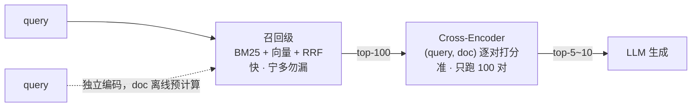

# 05 Rerank：Cross-Encoder 与 MMR

| 元信息 | 内容 |
|------|------|
| 所属模块 | RAG 检索算法专题（核心层） |
| 篇目 | 05（精讲） |
| 预计时间 | 1 天 |
| 前置 | [02-Embedding与向量表示](./02-Embedding与向量表示.md)、[04-BM25与混合检索RRF](./04-BM25与混合检索RRF.md) |
| 面试可答一句话摘要 | 召回级用双塔换取速度但丢失 query-doc 交互信息，Cross-Encoder 把 (query, doc) 拼一起做交叉注意力、准但每对都要跑一次推理——所以标配两阶段：ANN/BM25 粗召 top-100，精排取 top-5~10 喂 LLM；MMR 在此基础上惩罚冗余 |

## 学习目标

- 画出两阶段检索结构，说清「为什么快与准不能在一级里同时拿到」
- 用结构与成本账对比双塔与 Cross-Encoder
- 手写 MMR 并解释冗余惩罚对排序的实际影响（本篇实测）
- 会算 rerank 的延迟账：候选数 × 单对推理成本，判断自己项目该不该上、候选给多少

---

## 1. 两阶段检索：快与准的分工

召回级（03/04 篇）的共同点：**query 和 doc 不见面**——BM25 只比分词命中，双塔只比两个独立向量的距离。不见面就快（doc 侧全部离线），但精度有天花板。Cross-Encoder 把两段文本拼在一起过模型，让每个 token 互相看见：



| | 双塔（召回） | Cross-Encoder（精排） |
|--|-------------|----------------------|
| 交互 | 无：独立编码 + 距离 | 全程交叉注意力：query 的每个词看得见 doc 的每个词 |
| doc 侧 | 可离线预计算 | 不能——拼接结果依赖 query |
| 成本 | 库规模无关（ANN 后），查询 ≈ 一次编码 | **每对一次前向**：100 对 = 100 次推理 |
| 精度 | 排名质量一般（够进前 100 就行） | 明显更高（决定 top-5 的顺序） |

> 💡 一句话记结构：**召回管「别漏」，精排管「排对」。** 两级各干一件事，合起来才既有召回率又有排序质量。

## 2. 主流 reranker 一览

| 模型 | 规模 | 特点 | 适用 |
|------|------|------|------|
| bge-reranker-v2-m3 | 0.6B | 中文强、多语言、Apache 2.0、生态最普及 | 自托管默认 |
| Qwen3-Reranker（0.6B/4B/8B） | 0.6B~8B | 指令感知（可按任务下发指令）、MTEB-R 领先 | 质量优先、能吃 GPU |
| Cohere Rerank 3.5 | 闭源 API | 免运维、按量付费 | 不想自托管 |
| LLM listwise（RankGPT 式） | 任意 LLM | 让 LLM 直接读列表输出排序；最慢最贵 | 离线评测、小规模精挑 |

> ⚠️ 部署边界：Qwen3-Reranker 属**生成式** reranker（causal-LM 结构），TEI 托管不了，需走 vLLM；TEI 只服务 BERT 系 cross-encoder（如 bge-reranker）。选型时先确认部署栈再选模型。

> 💡 选型口径与 embedding 一致：用自己语料测。reranker 换起来零迁移成本（不动索引），是**检索质量优化的最后一站，也是试错成本最低的一站**。

## 3. MMR：相关之外，还要不重复

检索回来的 top-50 常有大量近重复块（同一段落的相邻切法、被 04 篇两路同时召回）。直接按相关分取 top-10 喂 LLM = 花一半上下文看同一句话的变体。MMR（Maximal Marginal Relevance）在选入每一条时同时惩罚它与已选集合的冗余：

$$\text{MMR}=\arg\max_{d \in R \setminus S}\left[\lambda \cdot \text{sim}(q,d)-(1-\lambda) \cdot \max_{d' \in S}\text{sim}(d,d')\right]$$

$\lambda=1$ 退化为纯相关排序，$\lambda=0$ 纯粹追求多样性；常用 0.5~0.8。实测一组手工相似度（重复块冗余 0.98）：

```ts
// mmr.ts —— 相关且不重复（bun run mmr.ts）
const ids = ['A 错误码401定义', 'A 错误码401定义(重复块)', 'B 部署步骤', 'C 性能调优']
const simQ = [0.92, 0.9, 0.71, 0.55] // 查询-文档相关分
const simD = [                        // 文档间相似度矩阵（生产中由 embedding 算出）
  [0, 0.98, 0.3, 0.2],
  [0.98, 0, 0.28, 0.18],
  [0.3, 0.28, 0, 0.35],
  [0.2, 0.18, 0.35, 0],
]

const lambda = 0.7
const mmr = (k: number) => {
  const picked: number[] = []
  const rest = ids.map((_, i) => i)
  while (picked.length < k && rest.length) {
    let bestI = -1, bestScore = -Infinity
    for (const i of rest) {
      const red = picked.length ? Math.max(...picked.map((p) => simD[i][p])) : 0
      const s = lambda * simQ[i] - (1 - lambda) * red
      if (s > bestScore) { bestScore = s; bestI = i }
    }
    picked.push(bestI)
    rest.splice(rest.indexOf(bestI), 1)
  }
  return picked
}

console.log('纯相关分 top-3:', [0, 1, 2].map((i) => ids[i]).join(' | '))
console.log(`MMR（λ=${lambda}）top-3:`, mmr(3).map((i) => ids[i]).join(' | '))
```

实测输出（本机 macOS，Bun v1.1.38，2026-09）：

```text
纯相关分 top-3: A 错误码401定义 | A 错误码401定义(重复块) | B 部署步骤
MMR（λ=0.7）top-3: A 错误码401定义 | B 部署步骤 | A 错误码401定义(重复块)
```

逐步算：第 1 轮 A 直接入选（冗余 0，分 0.644）；第 2 轮重复块的 $0.7 \times 0.90 - 0.3 \times 0.98 = 0.336$，被 B 的 $0.7 \times 0.71 - 0.3 \times 0.30 = 0.407$ 反超——**重复块从「第 2 名」跌到「第 3 名」，若只要 top-2 它直接出局**。信息覆盖翻倍，相关分只让了一点点。

## 4. 工程账：该不该上、候选给多少

| 问题 | 口径 |
|------|------|
| 候选给多少 | 每路 top-50~100 → RRF → 取 50~100 进 rerank → 取 5~10 给 LLM。候选太少（<20）rerank 无米下锅；太多纯烧钱 |
| 延迟预算 | rerank 耗时 ≈ 候选数 × 单对推理成本；0.6B 模型 GPU 上百对在几十 ms 量级，CPU 上会到秒级——**CPU 部署要么减候选、要么换小模型** |
| 什么时候可以不上 | 库很小（Flat 直出已够准）；延迟极敏感且召回质量已验证；纯关键词场景 BM25 排序本身可信 |
| 什么时候必上 | 混合检索的 RRF 只是「融合」不是「理解」——top-100 里谁排第 3 谁排第 8，只有见过 query-doc 交互的模型说了算 |

## 5. 调用示例（TEI 自托管）

```bash
# HuggingFace Text Embeddings Inference 一条命令起 reranker 服务（BERT 系 cross-encoder）
docker run --gpus all -p 8080:80 ghcr.io/huggingface/text-embeddings-inference:cuda-1.9 \
  --model-id BAAI/bge-reranker-v2-m3
# ⚠️ tag 按 GPU 架构区分：通用 CUDA 用 cuda-1.9、30/40 系消费卡用 86-1.9 / 89-1.9、H100 用 hopper-1.9、CPU 用 cpu-1.9，以官方 README 为准
```

```ts
// rerank.ts —— TEI /rerank 端点（需先起上方服务）
const rerank = async (query: string, texts: string[]) => {
  const res = await fetch('http://localhost:8080/rerank', {
    method: 'POST',
    headers: { 'Content-Type': 'application/json' },
    body: JSON.stringify({ query, texts, truncate: true }),
  })
  return (await res.json()).results as { index: number; score: number }[]
}
// 返回按 score 降序的 {index, score}，取前 5~10 条回填正文喂 LLM
```

> ⚠️ rerank 分数是**模型自己的相关分**，跨模型不可比、也没有「0.5 以上算相关」的通用阈值——要卡阈值（如过滤低质召回）就用自己的评测集校准。

## 6. 踩坑与边界

| 坑 | 现象 | 规避 |
|----|------|------|
| 召回侧先剪太狠 | top-5 进 rerank，天花板被焊死 | 先保证进 rerank 的候选 ≥ 50，再谈精排 |
| 候选拉满 1000 | 延迟爆炸，边际收益为零 | 50~100 起步，扫参看收益曲线 |
| MMR 惩罚了该留的 | 同一段落的两个互补切法被当成冗余踢掉 | 冗余用「内容相似度」而非「来源相邻」；λ 别低于 0.5 |
| rerank 域不匹配 | 代码库检索用通用 reranker，排序反而变差 | 换代码域模型（如 Qwen3-Reranker + 代码指令）或退回不用 |
| 只看 top-1 有没有对 | 忽略 top-5 内部顺序 | 用 NDCG@10 评排序质量（指标见原理册 06-2） |

## 7. 练习：rerank 前后对照（约 45-60 分钟）

**要求**：①用 04 篇的召回结果（top-50）接入一个 reranker（TEI 自托管或 Cohere API）；②对 10 条 query 对比 rerank 前后的 top-5；③记录每条 query 的 rerank 耗时，算「每对推理成本」；④挑一条「rerank 救回来的」和一条「rerank 没救回来的」query，各解释原因。

**提示**：rerank 救回来的，通常是「召回边界模糊」（第 8 名才是金标准）；救不回来的，先查召回侧——**rerank 只能重排候选，变不出没被召回的答案**，这正是两级分工的边界。

**预期效果**：能给出「你的项目 rerank 候选数 = X、延迟 + Y ms、top-5 命中从 A 提升到 B」的实测结论，并用「召回管别漏、精排管排对」解释优化该打在哪一级。

## 8. 面试问答

> **问：召回之后为什么还要 rerank？**
>
> **答：** 召回级为了快，query 和 doc 是不见面的：BM25 只比分词命中，双塔只比两个独立向量的距离，交互信息全部丢失，精度有天花板。Cross-Encoder 把 (query, doc) 拼一起过模型，每个 token 互相看见，排序质量明显更高——但每对都要跑一次前向，只负担得起几十条。所以标配两阶段：召回管「别漏」（top-100 宁多勿漏），精排管「排对」（top-5~10 喂 LLM）。

> **追问（陷阱）：双塔不能也训得像 Cross-Encoder 一样准吗？**
>
> **答：** 训练能缩差距，消不掉结构差。双塔的精度上限受「独立编码」约束——query 里「它」指代什么、doc 里哪半句在回答问题，这些交互只有拼在一起才能建模。工程上真正的选择是：接受双塔的精度、把 rerank 当可选优化；或者付两级的成本换排序质量。同一份训练数据下 Cross-Encoder 更准不是训练不充分，是它能看见的信息更多。

## 参考链接

- [sentence-transformers Cross-Encoder 官方文档](https://www.sbert.net/docs/cross_encoder/usage/usage.html) —— Cross-Encoder 结构与用法权威说明
- [bge-reranker-v2-m3 模型卡](https://huggingface.co/BAAI/bge-reranker-v2-m3) —— §2 选型依据
- [Cohere Rerank 官方文档](https://docs.cohere.com/docs/rerank-overview) —— 闭源 API 参考
- [Text Embeddings Inference（TEI）](https://github.com/huggingface/text-embeddings-inference) —— §5 自托管部署依据

---

**下一篇**：[06-查询改写与上下文压缩](./06-查询改写与上下文压缩.md)——检索前的最后一道提质工序。
