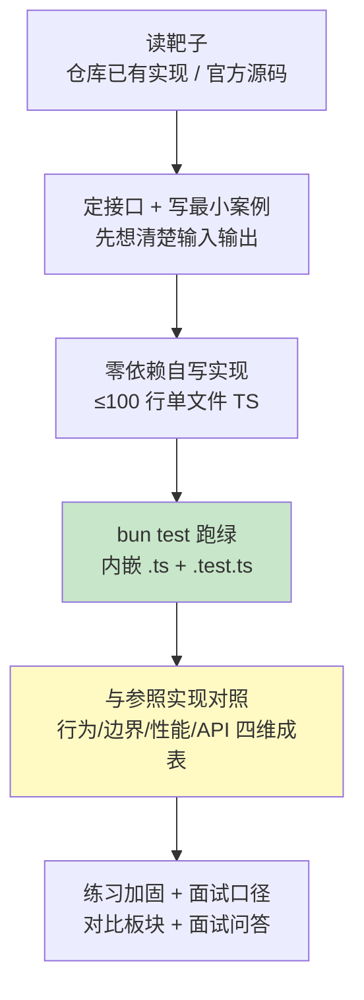
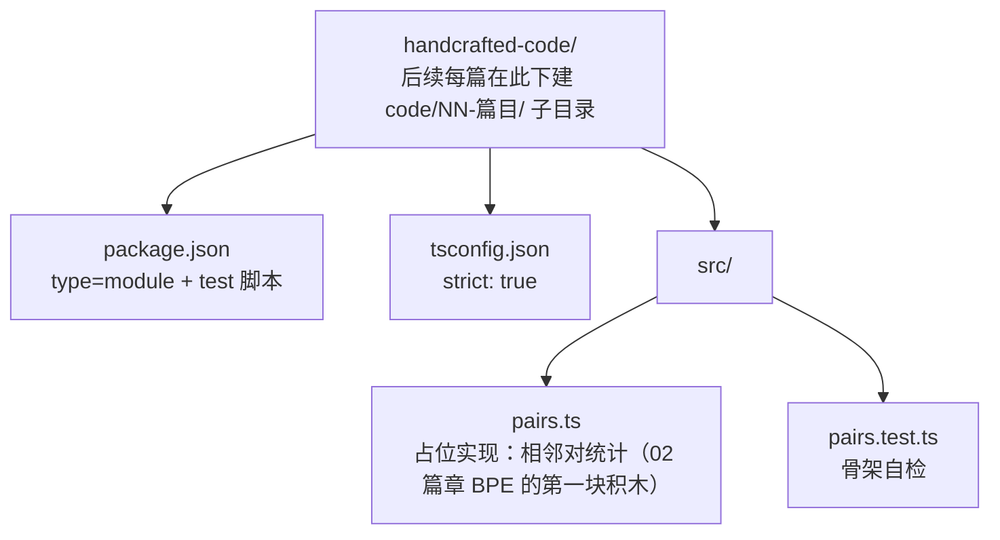

# 01 手写入门与《对照表》模板

| 元信息 | 内容 |
|------|------|
| 所属模块 | 01-手写入门与工程约定（认知层） |
| 篇目 | 01-1 |
| 预计时间 | 1-2 天 |
| 前置 | 无（agent-fullstack 阶段 1-2 已完成） |
| 面试可答一句话摘要 | 一句话讲清手写系列——「每个应用层机制配一个 <100 行 TS 靶子：零依赖自写、`bun test` 跑绿、再与官方实现对照成表」，以及为什么「对照表」比「写对」更重要 |

> 本篇是手写系列的第一篇，不写业务代码，只回答三个问题：**这是什么、怎么写、怎么算过关**。产出物只有两样：一套能跑 `bun test` 的工程骨架 + 一页可贯穿一整册的《对照表》模板。走读靶子是仓库内已有实现 `01-weather-agent` 的 `re-act.ts`（先读后写，这是铁律 3）。前置：agent-fullstack 阶段 1-2 已完成（仓库内已有 01-weather-agent / 04-kb-agent 等项目）。

## 学习目标

- 用三句话讲清手写系列的定位与四条铁律，能对「直接读框架源码」的区别现场开口
- 说清「实现侧零依赖 / 对照测试侧允许 SDK」的依赖边界，能当场举出破戒例子
- 在本机搭好 `bun test` + strict TS 骨架，跑通一个真实断言（本文已附实测输出）
- 建好四维《对照表》模板，并把模块 02 的 BPE 往返作为首行占位（骨架此刻无 BPE 实现，实测数字待 02 篇回填）
- 走读 `re-act.ts`，能指着其中一行说「这里就是模块 04 对照的起点」

---

## 1. 全景：一篇靶子的生命周期

手写系列的每一篇都走同一条流水线，验收标准只有一个：**对照表成文、`bun test` 变绿**。



| 模块 | 层 | 一句话定位 | 验收产出（就是这篇的「靶子」） |
|------|----|-----------|------------------------------|
| 01 手写入门与工程约定 | 认知层 | 约定靶子长什么样、怎么对照、验收标准 | `bun test` 骨架 + 空《对照表》模板（本篇） |
| 02 手写 Tokenizer | 领域层 | 字符级 → BPE，让「分词」变透明 | 自写 BPE 训练 + 编解码通过用例 |
| 03 手写检索三件套 | 检索层 | BM25 / 余弦 top-k / RRF 融合 | 三件套各 ≤100 行，RRF 对齐 `rrf_k=60` |
| 04 手写 ReAct Agent | Agent 层 | JSON 工具调用循环 + 结构化输出约束 | 带 2 个工具的可运行循环，对照 `re-act.ts` |
| 05 手写 MCP Server | 协议层 | initialize → tools/list → tools/call 三跳 | 手写 stdio server 被官方 Client 连上 |
| 06 单头注意力与 KV Cache（可选） | 进阶层 | prefill + decode 两阶段与对比 | 手写前向 + 两阶段耗时对照表 |

> 🎯 本篇之后的每一篇，都在本页流程上「循环」一次：读靶子 → 手写 → 跑绿 → 对照 → 成表。

---

## 2. 核心概念

### 2.1 靶子三要素：最小案例 / 参照实现 / 对照表

| 要素 | 是什么 | 例子（模块 02） |
|------|--------|----------------|
| 最小案例 | 能放进一个文件的演示，跑得通就行 | `aaabdaaabac` 3 轮合并成 `XdXac` |
| 参照实现 | 手写的「参考答案」，不抄、用来对 | minbpe / tiktoken（官方） |
| 对照表 | 手写 vs 参照的行为差异，落成表格 | 行为/边界/性能/API 四维（§4 模板） |

顺序是**先定接口再实现**：先写最小案例把输入输出钉死，再动手写内部逻辑，最后对照官方。手写和官方行为不一致的地方，就是最大的学习点。

### 2.2 零依赖纪律与依赖边界

本册实现侧**零第三方 AI 依赖**（工具函数自写，`JSON.parse` 等语言内置除外）；对照/测试侧**允许**官方 SDK 作 devDependency，只用于对照与验收，成果不混入手写实现：

| 侧 | 允许 ✅ | 禁止 ❌ |
|----|--------|--------|
| 实现侧 | 语言内置（`TextEncoder`、结构体、数学函数）、自写工具函数 | 官方/第三方 SDK、一切 npm 依赖 |
| 对照/测试侧 | 官方 SDK 作 devDependency（tiktoken、MCP Client、langchain……） | 把对照成果混进手写实现、假装是自写 |

破戒的典型症状：「写着写着卡住了，先 `npm i` 拉个库顶上」——这等于放弃手写。

### 2.3 `bun test` 环境

- bun 内置测试 runner + 内置 TS 支持：零配置跑 `.test.ts`，`bun test` 一条命令
- strict TS：`tsconfig.json` 开 `strict: true`（参考 §3.3）
- 铁律 4：每篇**内嵌一个 `.ts` + 一个 `.test.ts`** 的完整代码，`bun test` 绿了才算过
- 断言用 bun 的 `expect`（API 对齐 Jest，无第三方依赖）

### 2.4 《对照表》四维：填什么才算「照过了」

| 维度 | 关注点 | 自查问题 |
|------|--------|---------|
| 行为 | 同一输入，输出是否一致 | 相同语料/相同用例，结果字节级相同吗？ |
| 边界 | 异常与未见输入怎么处理 | 未见文本、空输入、非法 id 会不会崩？ |
| 性能 | 复杂度与实测量级 | 时间/空间复杂度差多少？数据量放大后呢？ |
| API 差异 | 接口形态与抽象粒度 | 官方是类+方法，你是平铺函数，差在哪？ |

四维模板 §4 直接给，每篇写完对照表才算完——**手写不是目的，对照 + 讲清取舍才是**。

---

## 3. 手写实现：`bun test` 最小骨架

### 3.1 目录结构（对应 readme §6 的 `code/` 归位约定）



### 3.2 `package.json`

```json
{
  "name": "handcrafted",
  "type": "module",
  "scripts": {
    "test": "bun test"
  }
}
```

零依赖跑测试的秘诀在 bun 本身：**runner 内置、TS 内置**，所以 `package.json` 里没有 `devDependencies`，也不需要 `jest.config` / `ts-node`。

### 3.3 `tsconfig.json`

```json
{
  "compilerOptions": {
    "strict": true,
    "target": "ESNext",
    "module": "ESNext",
    "moduleResolution": "bundler",
    "noEmit": true,
    "skipLibCheck": true,
    "lib": ["ESNext"]
  }
}
```

`strict: true` 一步到位；`noEmit` 表示 bun 只是借用 tsconfig 的编译选项，产出直接内存执行。

### 3.4 占位实现 `src/pairs.ts`

```ts
// pairs.ts —— 模块 01 的占位实现：相邻对统计（02 模块 BPE 的第一块积木）
// 铁律 4：每篇内嵌一个 .ts + 一个 .test.ts，bun test 绿了才算过
export function pairs(ids: number[]): Map<string, number> {
  const stats = new Map<string, number>()
  for (let i = 0; i < ids.length - 1; i++) {
    const key = `${ids[i]},${ids[i + 1]}`
    stats.set(key, (stats.get(key) ?? 0) + 1)
  }
  return stats
}
```

**逐段解读**：

- 输入输出先钉死：输入 `number[]`，输出「相邻对 → 频次」的 `Map`。key 用 `"左,右"` 字符串而非二元组，是刻意为之——`Map<[number,number],…>` 没法直接 `get`（数组按引用比较），字符串 key 才是零依赖又能查的写法。模块 02 会沿用这个约定。
- `i < ids.length - 1` 保证只统计**相邻**对；`(stats.get(key) ?? 0) + 1` 是零依赖的计数惯用式，等价于 Python 的 `counts.get(pair, 0) + 1`（原理册 04-1 的 `get_stats` 同款）。

### 3.5 骨架自检 `src/pairs.test.ts`

```ts
// pairs.test.ts —— 骨架自检：跑通一个「真实」断言，证明 bun test 环境就绪
import { describe, expect, test } from 'bun:test'
import { pairs } from './pairs'

describe('骨架自检：相邻对统计', () => {
  test('「aaab」的相邻对 (a,a) 频次为 2', () => {
    expect(pairs([97, 97, 97, 98]).get('97,97')).toBe(2)
  })

  test('环境就绪：保底断言', () => {
    expect(1 + 1).toBe(2)
  })
})
```

用 `expect(pairs([…]).get('97,97')).toBe(2)` 这个**真实断言**（而不是只 `expect(true)`）验收：它同时验证了三件事——TS 编译正常、模块解析正常、`bun:test` 导入正常。

### 3.6 实测输出（本机 macOS，`bun test` v1.1.38，2026-08）

```text
src/pairs.test.ts:
(pass) 骨架自检：相邻对统计 > 「aaab」的相邻对 (a,a) 频次为 2
(pass) 骨架自检：相邻对统计 > 环境就绪：保底断言

 2 pass
 0 fail
 2 expect() calls
Ran 2 tests across 1 files. [5.00ms]
```

跑法：`cd handcrafted-code && bun test`。绿就代表骨架可用——从下一篇起，`bun test` 的绿/红就是「是否过关」的唯一信号。

---

## 4. 《对照表》模板

### 4.1 空模板（可直接复制，每篇新建一份）

```markdown
| 维度 | 手写实现（§ 引用） | 参照实现（官方/框架） | 差异与原因 |
|------|------------------|---------------------|-----------|
| 行为（同一输入→输出） |  |  |  |
| 边界（异常/未见输入） |  |  |  |
| 性能（复杂度/实测） |  |  |  |
| API 差异（接口/粒度） |  |  |  |
```

### 4.2 使用约定

- 「手写实现」列填本篇 §3 的代码行为（含测试用例）；「参照实现」列填官方实际行为（写清版本）。
- 两列行为**一致**时，差异列写「一致（原因：……）」；不一致时写「此处为学习点：……」，并回到 §3 代码定位到具体行。
- 四维走完后，把差异合并成一句「本文结论」，正好是面试问答的素材。

### 4.3 首行示例（用模块 02 的 BPE 往返占位）

模块 01 的练习要求「案例先用 §2 的 BPE 往返当首行实测数据」——即把 02 篇的首条断言（`decode(encode(x)) === x`）预填进来，等 02 篇写完后回填实测数字：

```markdown
| 行为（同一输入→输出） | 自写 BPE：encode 后 decode 往返一致，含未见文本（02-1 篇断言） | minbpe BasicTokenizer：往返一致 | 一致；对称性来自「encode 正用规则 / decode 反向展开」 |
```

模板不自证清白：**每填一行都要能指向一条可运行的断言或一次实测**，填不出就去补测试。

---

## 5. 踩坑与边界

| 坑 | 现象 | 规避 |
|----|------|------|
| 测试文件命名不对 | `bun test` 输出 `No tests found`，看着像过了其实是空的 | bun 默认只匹配 `*.test.{ts,js}`；别用 `tests.ts` / `spec.ts` 等变体命名 | 
| 假绿 | 断言没写 / 只 `expect(true)` | 每个测试至少一个**带输入**的真实断言（§3.5 示范） |
| strict 放开 | 图省事把 `strict` 关掉，类型退化成 `any` 牧场 | 骨架里就开 `strict: true`，后面每篇沿用 |
| 依赖破戒 | 「卡住先 `npm i`」，手写变拼装 | 对照 §2.2 边界表；先想「这函数我能不能 10 行写出来」 |
| 对照表只抄结论 | 差异列抄官方文档原话，没回到自己的代码 | 每条差异定位到 §3 的**行号** + 可运行断言 |

另外注意 `bun test` 会在**当前目录递归**找 `*.test.ts`：骨架里混入不相关测试文件时，用 `bun test src/` 或 `bun test <file>` 限定范围，别让别处的失败污染你的绿。

---

## 6. 练习：搭骨架 + 建模板（约 60-90 分钟）

**要求**：①在本机按 §3 搭好 `handcrafted-code/` 骨架，`bun test` 跑绿；②复制 §4.1 空模板建一份自己的《对照表》md；③用「手写 vs 框架版」两栏把表头预填完整，「行为」行先用 §4.3 示例的 BPE 往返断言占位（骨架此刻只有 `pairs`，无 BPE 实现，标注「待 02 篇回填」即可）；④走读 `re-act.ts`（路径见 §8 参考链接），在注释里标出 3 个你预判「模块 04 会用手写重做」的点。

**提示**：断言先选「你能手算答案」的：`pairs([97, 97, 97, 98])` 的 `(a,a)` 频次手算就是 2，这样红了能立刻判断是代码错还是测试错；`re-act.ts` 走读按「入口函数 → 循环 → 工具执行」三段读，别逐行盯 SDK 调用；模板「差异与原因」列留空也没关系，先让四维框架立起来。

**预期效果**：①`bun test` 绿（能和 §3.6 实测对得上）；②当你做模块 02 时，能直接复用这套骨架与模板——骨架里 `pairs` 函数就是 BPE 的 `getStats` 原型；③面对「手写系列怎么过关」的问题能给出面试口径：**不是写对，是写对 + 对照成表**。

---

## 7. 对比板块：本册 vs 原理册 vs 应用册

| 维度 | 本册（手写 + 对照） | 原理册 machine-learning（读源码 + 原理） | 应用册 agent-fullstack（直接用框架） |
|------|--------------------|---------------------------------------|-------------------------------------|
| 方法 | 先定接口自写，再对照官方 | 读源码解释原理，以 minbpe/micrograd 为靶子 | 用框架做产品，能上线 |
| 输出 | 对照表 + 可跑单文件 | 原理理解 | 完整可运行项目 |
| 关系 | **当前位置** | **前置**（04/05 已读） | 阶段 1-2 已完成 |
| 面试价值 | 讲清「机制在做什么 + 取舍」 | 讲清「为什么这样设计」 | 讲清「怎么落地」 |

三角的配合关系：原理册让你懂（能解释），本册让你验（能重写），应用册让你用（能交付）。同一知识点三层都过一遍，才叫真掌握——这正是指南第六条「API 名称、参数、行为细节对照官方核实，不凭记忆书写」的实践形态。

---

## 8. 面试问答

> **问：手写一遍和读框架源码有什么区别？**
>
> **答：** 读源码是被动跟随作者的取舍，看的是「他这么写了」；手写是先定接口再实现、最后和官方对照，看的是「如果是我会怎么写、差异在哪」。你写出来的行为和官方不一致的地方，才是最大的学习点——比如我手写 ReAct 时发现官方对非法 JSON 会重试、而我第一版直接抛错，这个差异就值得写进对照表。

> **问：手写系列怎么算「过关」？**
>
> **答：** 两个硬标准：`bun test` 绿 + 对照表成文。绿证明行为对，对照表证明「知道和官方差在哪、为什么差」。只有绿没有表，是抄作业；只有表没有绿，是空谈。两者齐了才算一次完整的手写循环。

> **追问（陷阱）：既然最后要和官方对照，为什么不直接用官方？**
>
> **答：** 用官方解决的是「功能」问题，手写解决的是「理解」问题。直接读或直接用，学到的往往是 API 怎么调；手写一遍后，框架替你做的每层工作（解析、重试、循环控制）都会变成你脑子里的因果链。**实现是对照的前提**——没手写过的人，对照表里根本没有「我的实现」这一列。

---

## 参考链接（官方一级来源）

- [Bun Test Runner 官方文档](https://bun.sh/docs/cli/test) —— `bun test` 的匹配规则、断言 API 与运行行为的权威说明（§3/§5 依据）
- [Bun TypeScript 支持官方文档](https://bun.sh/docs/runtime/typescript) —— bun 内置 TS 执行与 tsconfig 的生效方式（§3.3 依据）
- [handcrafted/readme.md](../../readme.md) —— 本册总纲：四条铁律、模块规划、验收标准（本文所有「验收产出」列的出处）
- 仓库内走读靶子：`src/artificial-intelligence/agent/agent-fullstack/projects/01-weather-agent/src/agent/re-act/re-act.ts`（已有实现，模块 04 的对照起点）

---

**下一篇**：[01-字符级到 BPE](../02-手写Tokenizer/01-字符级到BPE.md)——骨架与模板就绪，02 模块第一站：字符级 → BPE 训练 + 编解码全流程 ≤100 行，用 `aaabdaaabac` 与中英混合语料验证往返，把《对照表》第一行真正填满。