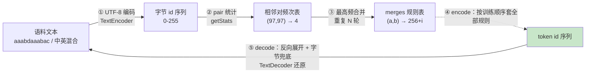

# 02 字符级到 BPE：训练 + 编解码

| 元信息 | 内容 |
|------|------|
| 所属模块 | 02-手写Tokenizer（领域层） |
| 篇目 | 02-1 |
| 预计时间 | 3-4 天 |
| 前置 | 01-1 手写入门与《对照表》模板 |
| 面试可答一句话摘要 | 一句话讲清 BPE 全流程——「UTF-8 字节 → pair 统计 → 逐轮合并最高频相邻对 → encode/decode 对称」，以及为什么「字节兜底无 OOV，频率驱动定粒度」 |

> 原理册 04-1 已经带你看过 minbpe 的教学循环；本篇用 TS 把它**重装一遍**：78 行、零依赖、`bun test` 跑绿。做完这篇，「分词」不再是黑盒——你能亲手训练出一个 tokenizer，并解释它所有行为（怎么切的、为什么这样切、未见文本为什么不崩）。前置：01-1 的骨架与《对照表》模板已就绪（本文所有测试就在那套骨架上跑）；参照实现：minbpe（karpathy）/ tiktoken（OpenAI 官方）。

## 学习目标

- 不看资料手写 `getStats + applyMerge` 主循环，跑通「`aaabdaaabac` 3 轮合并 = `[258, 100, 258, 97, 99]`」
- 讲清编码方向「按训练顺序套全部规则」与解码方向「反向展开成字节」互为逆运算（对称 = 可逆）
- 用中英混合语料训练 200 轮，能解释「为什么实际只产生 54 条规则」和「中文 3 字节如何两步变成整 token」
- 用「字节兜底 + 频率驱动」两句话回答 BPE 无 OOV，并指出残留的「OOV 感」来自碎片化（未见文本 token 数 = 字节数）
- 完成《对照表》第一行实测数据：手写 vs minbpe vs tiktoken 四维成文

---

## 1. 全景：文本到 token id 的五步



| 步 | 输入 → 输出 | 解决什么问题 | 本篇对应 |
|----|------------|--------------|---------|
| ① 字节编码 | 字符串 → 0-255 整数序列 | 任意语言（含中文、emoji）都能进系统 | `TextEncoder` |
| ② pair 统计 | 序列 → 相邻对频次 | 量化「哪两个字节经常一起出现」 | `getStats` |
| ③ 最高频合并 | 频次表 → 合并规则 | 把高频相邻子串「焊」成一个 token，压缩序列 | `train` 主循环 |
| ④ 编码查规则 | 新文本字节 → token id | 让任意文本都能变成模型吃得到的整数 | `encode` |
| ⑤ 解码展开 | token id → 原文本 | 与 ④ 对称，保证可逆 | `decode` |

> 💡 ①③ 是纯机械映射（无学习），③ 才是 tokenizer 的「参数」——**merges 规则表**。它决定了一个模型「怎么切文本」，而它完全由训练语料统计出来。

---

## 2. 核心概念

### 2.1 为什么从「字符级」起步，落脚在「字节」

字符级切分（每字符一个 token）直观但有两个问题：标点/空格/变体会制造出巨大词表，且**字符不是语言的稳定单元**。所以手写 BPE 的起点更底层：**把字符串编码成 UTF-8 字节**，每个字节一个 id（0-255）。

- `"a".encode("utf-8")` → `97`（1 字节）
- `"猫".encode("utf-8")` → `[231, 140, 171]`（**3 字节**）——这是「中文 token 贵」的根源：同样的语义，中文先占 3 个字节位
- 合并得到的**新 token 从 256 起编号**，给 0-255 的字节永久留位——这是 §5 无 OOV 的结构性基础

### 2.2 BPE 训练 = 两个动作的循环

基于字节序列，重复 $N$ 轮（ $N \approx$ 词表大小 $- 256$，GPT-2 是 50,000）：

1. **统计**：数出当前序列所有相邻对的频次（`getStats`）
2. **合并**：把频次最高的相邻对全部替换成一个新 id（`applyMerge`），并记录规则 `(a,b) → 256+i`

频率越高 → 越早被合并 → 越像一个「词」。注意**一轮合并会消除该对的所有出现**，所以序列长度每轮缩减 $\geq 1$（缩减量 = 该对出现次数）。

### 2.3 合并是嵌套的

子词是递归结构：`a a a b` 先由 `(a,a) → 256` 合成 `256 a b`，再 `(256,a) → 257` 合成 `257 b`，再 `(257,b) → 258`——一个 token 对应**多层合并历史**。decode 时必须沿这条历史反向展开，这正是「可逆」的来源。

### 2.4 编解码对称 = 可逆

- encode：把新文本转成字节后，**按训练顺序逐条套用全部规则**（先学的规则先套）
- decode：对每个 id，≥ 256 的查反向表展开成两个子 id，递归到字节；然后按 UTF-8 还原字符串

两者互为逆运算：encode 是「规则的正用」，decode 是「规则的逆用」，加上 0-255 字节兜底——**任何字符串 encode 后 decode 必还原**。这就是本文测试的核心断言 `decode(encode(x)) === x`。

### 2.5 无 OOV：字节层是闭合的

词级字典是有限集合，遇到生词就 `<unk>`。BPE 的基石是：任何 UTF-8 文本都能拆成 0-255 的字节，而 256 个字节**永远是 token**。所以不存在「编码不了」的输入，只有「切得粗还是碎」的区别——**OOV 从「无解」变成「可量化的碎片化」**。

---

## 3. 手写实现：78 行零依赖 TS

### 3.1 `bpe.ts`（完整源码，实测可跑）

```ts
// bpe.ts —— 字符级到 BPE：训练 + 编解码，<100 行，零依赖，bun 直接跑
// 设计对齐 minbpe 的 BasicTokenizer：0-255 是 UTF-8 字节，新 token 从 256 起

/** 统计相邻对频率：输入整数序列，返回 "左,右" -> 频次 */
function getStats(ids: number[]): Map<string, number> {
  const stats = new Map<string, number>()
  for (let i = 0; i < ids.length - 1; i++) {
    const key = `${ids[i]},${ids[i + 1]}`
    stats.set(key, (stats.get(key) ?? 0) + 1)
  }
  return stats
}

/** 合并：把序列中所有等于 pair 的相邻对替换成 idx（返回新序列，不改入参） */
function applyMerge(ids: number[], pair: [number, number], idx: number): number[] {
  const out: number[] = []
  for (let i = 0; i < ids.length; i++) {
    if (i < ids.length - 1 && ids[i] === pair[0] && ids[i + 1] === pair[1]) {
      out.push(idx)
      i++
    } else {
      out.push(ids[i])
    }
  }
  return out
}

/** 训练：多段语料拼成一个字节流，做 numMerges 轮「合并最高频相邻对」 */
function train(texts: string[], numMerges: number): { merges: Map<string, number>; log: string[] } {
  let ids = texts.flatMap((t) => Array.from(new TextEncoder().encode(t)))
  const merges = new Map<string, number>()
  const log: string[] = []
  for (let i = 0; i < numMerges; i++) {
    const stats = getStats(ids)
    // 取频次最高的相邻对；数组 sort 稳定，同频时先出现者胜出 => 确定性
    const top = [...stats.entries()].sort((a, b) => b[1] - a[1])[0]
    if (!top) break // 序列已缩到 1 个 token，无相邻对可合并
    const [key, count] = top
    const [a, b] = key.split(',').map(Number) as [number, number]
    const idx = 256 + i
    log.push(`第${i + 1}轮: pair=(${key}) 频次 ${count} -> id=${idx}`)
    merges.set(key, idx)
    ids = applyMerge(ids, [a, b], idx)
  }
  return { merges, log }
}

/** 编码：字节流按训练顺序逐条套用全部合并规则（规则按学习先后排列 => 确定性） */
function encode(text: string, merges: Map<string, number>): number[] {
  let ids = Array.from(new TextEncoder().encode(text))
  for (const [key, idx] of merges) {
    const [a, b] = key.split(',').map(Number) as [number, number]
    ids = applyMerge(ids, [a, b], idx)
  }
  return ids
}

/** 解码：>=256 的 id 查反向表递归展开成字节，最后按 UTF-8 还原字符串 */
function decode(ids: number[], merges: Map<string, number>): string {
  const reverse = new Map<number, [number, number]>()
  for (const [key, idx] of merges) {
    const [a, b] = key.split(',').map(Number) as [number, number]
    reverse.set(idx, [a, b])
  }
  const bytes: number[] = []
  const expand = (id: number): void => {
    const pair = reverse.get(id)
    if (pair) {
      expand(pair[0])
      expand(pair[1])
    } else {
      bytes.push(id) // 0-255 的字节兜底，任何未见文本都能还原
    }
  }
  for (const id of ids) expand(id)
  return new TextDecoder().decode(Uint8Array.from(bytes))
}

export { getStats, applyMerge, train, encode, decode }
```

### 3.2 逐段解读

**`getStats`（pair 统计）**——BPE 的「耳朵」：滑过整个序列，把每个相邻对 `(ids[i], ids[i+1])` 的频次记进 `Map`。key 用模板字符串 `"97,97"` 而非二元组，是刻意取舍：`Map<[number, number], ...>` 无法按值 `get`（数组引用比较），字符串 key 才零依赖可查——这个约定 01 篇骨架里的 `pairs` 已经用过，这里直接复用（铁律 3：复用仓库靶子）。

**`applyMerge`（原地重建）**——BPE 的「手」：从头扫描，命中 `pair` 就压入 `idx` 并跳过两个位置，否则原样压入。**不改入参、返回新数组**，纯函数风格让训练与测试都好推理。注意它合并的是**所有**出现（`i++` 跳位），不是只合并第一处。

**`train`（主循环）**——把多段语料 `flatMap` 拼成**一条字节流**，然后重复「统计 → 取最高频 → 记录规则 → 合并」。两个细节值得记住：

- `sort((a,b) => b[1]-a[1])[0]` 取频次最高者；JS 的 `Array.prototype.sort` **稳定**（ES2019 起），同频对的先后由 Map 插入序决定——确定性由此而来。换实现时换 tie-break 规则，会得到**另一套合单词表**。
- `if (!top) break`：当序列被合并到只剩 1 个 token 时，没有相邻对可统计，主动收工——这是「合并数不可能超过语料信息量」的内建保护。

**`encode`（规则正用）**——新文本转字节后，**按训练顺序**把每条规则套到整个序列上。为什么顺序很重要？因为规则是按「学习先后」排列的：先学的规则对应的字节组合，是后学规则的前身；倒序使用会让后学规则（新 token）去匹配还没形成的结构，结果不一致。

**`decode`（规则逆用）**——先建一张反向表 `新id → [左, 右]`，再对每个 id 递归展开：≥ 256 就拆成两个子 id 继续，< 256 就是真字节。最后 `TextDecoder` 把字节数组还原成 UTF-8 字符串。**递归深度 ≤ 合并轮数**（本例 54 层以内），教学规模安全。

### 3.3 验收测试 `bpe.test.ts`

```ts
// bpe.test.ts —— 02-1 篇验收：bun test 跑绿
import { describe, expect, test } from 'bun:test'
import { train, encode, decode } from './bpe'

const corpus = ['aaabdaaabac', 'abracadabra', '猫和狗打架 猫咪大战狗狗 狗和猫关系好']

describe('字符级 -> BPE', () => {
  test('aaabdaaabac 3 轮合并 = [258, 100, 258, 97, 99]（即 XdXac）', () => {
    const { merges } = train(['aaabdaaabac'], 3)
    expect(encode('aaabdaaabac', merges)).toEqual([258, 100, 258, 97, 99])
  })

  test('往返一致：encode -> decode 还原原文，含训练语料外的未见文本（无 OOV）', () => {
    const { merges } = train(corpus, 200)
    const samples = [
      'aaabdaaabac',
      'abracadabra',
      '猫和狗打架',
      '猫咪大战狗',
      '量子计算领域的新突破',
      'hello, world! 你好，世界！😀',
    ]
    for (const s of samples) {
      expect(decode(encode(s, merges), merges)).toBe(s)
    }
  })

  test('未见文本 encode 不抛错且有 id（字节兜底）', () => {
    const { merges } = train(corpus, 200)
    const ids = encode('量子计算领域的新突破 🚀 2026', merges)
    expect(ids.length).toBeGreaterThan(0)
  })
})
```

三个测试分别钉住三件事：① 合并循环的正确性（与 minbpe README 的 `XdXac` 经典例一致）；② **对称性**（含未见文本的往返还原）；③ 字节兜底（未见文本不抛错）。`corpus` 里特意混入中文——验证「中英混合」场景。

### 3.4 复现实测输出 `demo.ts`

```ts
// demo.ts —— 打印文档中的实测数据：bun demo.ts
import { train, encode, decode } from './bpe'

// ① 经典最小案例：aaabdaaabac 3 轮合并
const text = 'aaabdaaabac'
console.log('训练文本:', text)
console.log('初始字节:', Array.from(new TextEncoder().encode(text)))
const { merges, log } = train([text], 3)
console.log(log.join('\n'))
const ids = encode(text, merges)
console.log('encode 结果:', ids, '（即 XdXac：X = (257,98) 复合）')
console.log('往返一致:', decode(ids, merges) === text)

// ② 中英混合语料训练 200 轮 + 往返验证
const corpus = ['aaabdaaabac', 'abracadabra', '猫和狗打架 猫咪大战狗狗 狗和猫关系好']
console.log('\n=== 中英混合语料训练 200 轮 ===')
const big = train(corpus, 200)
console.log('合并规则条数:', big.merges.size)
console.log('前 8 条合并规则:')
for (const [k, v] of [...big.merges.entries()].slice(0, 8)) console.log(`  (${k}) -> id ${v}`)

const samples = ['aaabdaaabac', '量子计算领域的新突破', 'hello, world! 你好，世界！😀']
for (const s of samples) {
  const enc = encode(s, big.merges)
  const ok = decode(enc, big.merges) === s
  console.log(`往返[${ok ? 'OK' : 'FAIL'}] ${JSON.stringify(s)} -> ${enc.length} 个 token`)
}
```

### 3.5 实测输出（本机 macOS，`bun test` v1.1.38，2026-08 —— 与本文代码完全同源，非编造）

测试结果：

```text
bpe.test.ts:
(pass) 字符级 -> BPE > aaabdaaabac 3 轮合并 = [258, 100, 258, 97, 99]（即 XdXac） [2.43ms]
(pass) 字符级 -> BPE > 往返一致：encode -> decode 还原原文，含训练语料外的未见文本（无 OOV） [8.38ms]
(pass) 字符级 -> BPE > 未见文本 encode 不抛错且有 id（字节兜底） [4.54ms]

 3 pass
 0 fail
 8 expect() calls
Ran 3 tests across 1 files. [105.00ms]
```

训练过程与编解码实测（`bun demo.ts`）：

```text
训练文本: aaabdaaabac
初始字节: [97, 97, 97, 98, 100, 97, 97, 97, 98, 97, 99]
第1轮: pair=(97,97) 频次 4 -> id=256
第2轮: pair=(256,97) 频次 2 -> id=257
第3轮: pair=(257,98) 频次 2 -> id=258
encode 结果: [ 258, 100, 258, 97, 99 ] （即 XdXac：X = (257,98) 复合）
往返一致: true

=== 中英混合语料训练 200 轮 ===
合并规则条数: 54
前 8 条合并规则:
  (97,97) -> id 256
  (97,98) -> id 257
  (231,139) -> id 258
  (258,151) -> id 259
  (231,140) -> id 260
  (260,171) -> id 261
  (261,229) -> id 262
  (256,257) -> id 263
往返[OK] "aaabdaaabac" -> 1 个 token
往返[OK] "量子计算领域的新突破" -> 30 个 token
往返[OK] "hello, world! 你好，世界！😀" -> 36 个 token
```

### 3.6 对实测的解读（这才是收获）

1. **3 轮合并嵌套演示**：`(97,97)` 频次 4 最高 → 256；新 token 256 **参与下一轮统计**，`(256,97)` 出现 2 次 → 257；`(257,98)` 再合并 → 258。最后 `[258, 100, 258, 97, 99]` 即 `XdXac`——与 Wikipedia / minbpe README 的经典例完全一致。
2. **200 轮只产生 54 条规则**：不是 bug。语料字节流（79 字节）被合并到只剩 1 个 token 后，`getStats` 返回空、`break` 提前收工。**合并数的上限由语料信息量决定**——这也是「词表大小」和「语料」必须匹配的直观证据。
3. **前 8 条合并的看点**：`(231,139) → 258`、`(258,151) → 259` 正是汉字「狗」（E7 8B 97）的先两字节、后整字——**中文常用字 = 3 字节 → 两步合并成 1 个 token**；`(261,229) → 262` 是「猫」与「和」首字节的跨字合并，说明无空格语言里 tokenizer 只能按字节团簇行事。
4. **未见文本的 token 数 = 纯字节数**：「量子计算领域的新突破」10 字 × 3 字节 = 30，「hello, world! 你好，世界！😀」14 + 18 + 4 = 36——整句没有命中任何训练学到的合并规则，全部落在字节层。**不报错，但变贵**：这就是「未见文本碎片化」的量化形态。

---

## 4. 对照表：手写 vs minbpe vs tiktoken

| 维度 | 手写（本实现，78 行） | minbpe `BasicTokenizer`（参照实现） | tiktoken / `gpt2` 编码（官方生产） |
|------|---------------------|-----------------------------------|-----------------------------------|
| 行为 | 多段语料拼成字节流后**全局合并**；encode 按训练顺序套全部规则 | 同左（BasicTokenizer 也不做预分词，字节级全局合并，无空格 trick） | **正则预分词后再段内 BPE**，词表带空格 trick（`" cat"`），合并不跨类型 |
| 边界 | 未见文本走字节兜底（实测 token 数 = 字节数）；语料太小提前 break（实测 200 轮 → 54 条） | 同左；支持 `save/load` 落盘规则表 | 同左 + special token **白名单**（默认不解析，防注入） |
| 性能 | 最坏 $O(\text{合并轮数} \times \text{序列长})$；本语料毫秒级 | 同量级；encode 用 chunk 分治优化长序列 | Rust 内核 + 合并 rank 表查优，短文本微秒级 |
| API 差异 | 平铺函数 `getStats/applyMerge/train/encode/decode`，每篇一个文件 | 类 + `train/encode/decode/register_special_tokens` | 按编码名（`cl100k_base` 等）取固定 vocab，**不可自训** |

> 填写口径（对照 01 篇 §4 约定）：行为差异最大的一条是 **tiktoken 的预分词**——官方 GPT 系先按正则把文本切成字母/数字/标点/空格片段，合并只在片段内部发生，避免「跨类型乱焊」；minbpe `BasicTokenizer` 与本文一样不做这步（`RegexTokenizer` 才做）。这条正是 02 篇「边界 B」的学习点，已落进上表「行为」行。

---

## 5. 踩坑与边界

| 坑 | 现象 / 根因 | 规避 |
|----|-----------|------|
| merge 规则倒序使用 | encode 结果与训练不一致（后学规则去匹配未形成的结构） | encode **必须按训练顺序**套规则（§3.2） |
| decode 按字符猜测 | 3 字节中间值可能是可打印字符（如 `E4 B8 AD` 里的 `B8`），按 `chr()` 拼会得到乱码 | decode 只信反向表展开，不信字符猜（§3.2 `expand`） |
| 新 id 与字节冲突 | 新 token 从 0 起编号会覆盖字节 id，decode 全乱 | 从 256 起编号，0-255 永久保留（§2.1） |
| 语料太小还超额申请词表 | 想要 200 轮合并、实际只有 54 条（实测） | 理解 `break`：合并上限 = 语料信息量；加语料才是正道 |
| 多段语料跨段合并 | 训练把多段拼成一条流，合并可跨段落边界（本文与 minbpe BasicTokenizer 同此） | 需要段边界时，显式插入分隔 token 再训练 |
| 高频平局 | 同频 pair 的取舍决定整张词表（稳定排序 → 先出现者胜） | 不接受「不稳定」：明确 tie-break 规则，测试才能复现 |
| 在骨架目录混跑其他测试 | `bun test` 递归匹配 `*.test.ts`，别处失败污染你的绿 | `bun test <file>` 限定范围（01 篇 §5 同款） |

另有个**理论边界**值得记下：`decode` 的递归深度 ≤ 合并轮数。教学规模（几十轮）无感；生产级 vocab（几万到几十万轮合并）必须改成**迭代展开**，否则会栈溢出——这就是「手写懂了、上生产另有工程事」的照实例证。

---

## 6. 练习：把 BPE 改出花样（约 2-3 小时）

**要求**：在 §3 的 `bpe.ts` 上做三组对照实验，每组把**实测输出**记进自己的《对照表》：

1. **换语料**：分别只用纯中文长文本、纯英文长文本训练 200 轮，对比前 5 条合并规则（中文大概率合并出整字/整词字节组，英文是常见字母组合），并对比同一句中文的 token 数。
2. **改词表大小**：同一语料分别训练 `numMerges = 50` 与 `numMerges = 500`，对同一句话 encode，对比 token 数——体会「切细 vs 切粗」（注：语料小时 500 轮会被 break 截断，这本身也是观察点）。
3. **未见文本攻击**：encode 一句训练时**完全没出现**的中文（如「量子计算领域的新突破」），确认不抛错，再 decode 回去验证可逆；对照训练语料里出现过的「猫和狗打架」，比较两者 token 数。

**提示**：「猫」「狗」的 UTF-8 分别是 `E7 8C AB`、`E7 8B 97`（3 字节），前几轮合并大概率发生在高频字/词上——观察合并顺序就能理解「常用词先成型」；实验 3 中未见文本 token 数 = 字节数属于正常现象（§3.6 解读 4），「不 OOV 但变贵」正是 04-NLP 原理册里「领域语料不匹配 → 碎片化」的直接演示；所有实验先跑 `bun test` 确认基线绿，再改代码。

**预期效果**：①往返永远一致，能顺口解释「为什么对称就能无损」；②能用「字节兜底 + 频率驱动」两句话讲清 BPE 的无 OOV 原理；③能解释「中文 token 为什么贵」与「token 数与字节数的差 = 合并效率」；④《对照表》行为/边界/性能三行有了真实数据。

---

## 7. 对比板块：手写 BPE vs 参照实现 vs 基线

| 维度 | 本技术：手写 BPE（78 行 TS） | 参照实现：minbpe / tiktoken | 基线：字符级与词级切分 |
|------|----------------------------|---------------------------|-----------------------|
| 切分原理 | 逐轮合并最高频相邻对（纯字节，无预分词） | 同为 BPE；minbpe 另有 `RegexTokenizer`，tiktoken 预分词 + 空格 trick | 字符级：每字符 1 token；词级：静态词典查词 |
| OOV 行为 | 字节兜底，任意文本可编码（实测） | 同（tiktoken 由正则保证片段内合并，不跨类型乱焊） | 字符级无 OOV 但序列爆炸；词级 `<unk>` 频繁 |
| 成本表现 | token 数 = 字节数 − 合并命中（实测未见文本 30/36） | 生产级：常用字/词整 token，中文 token 成本与预训练语料强相关 | 字符级序列放大 4-10 倍；词级词表巨大且生词无解 |
| 工程定位 | 教学靶子：讲清机制、对照成表 | 经验证的实现（minbpe）/ 模型自带编码（tiktoken） | 老式 N-gram IR / 教学对照对象 |

> 选型结论：**工程上别自训 tokenizer**——用模型自带的（tiktoken / tokenizer.json 词表）既省钱又对齐上下文预算；手写的价值在「讲清机制」：当你面试说出「BPE 的合并循环 + 字节兜底 + 预分词动机」三层结构时，参照实现与基线各自为什么存在，就都串起来了。

---

## 8. 面试问答

> **问：BPE 是怎么消除 OOV（未登录词）问题的？**
>
> **答：** 两层机制。第一层，词表以 256 个 UTF-8 字节打底，任何文本（含生词、表情、小语种）都能被拆成字节，所以不存在「编码不了」的输入，只有「切得粗/碎」的区别；实测里训练时没见过的「量子计算领域的新突破」也能 encode（10 字 → 30 个字节级 token），不报错。第二层，高频相邻子串被逐轮合并成整 token，训练语料里常见的词能整词命中；真正低频的词才碎片化。结论：OOV 从「无解」变成「可量化的碎片化」。

> **问：为什么 token 切分会影响模型成本与幻觉表现？**
>
> **答：** 成本上，token 数直接决定训练/推理的浮点运算与上下文预算——同样语义，中英 token 数相差明显（中文先按 3 字节入场，常用字合并成整 token、冷僻字落在字节层，字节碎片越多 token 越贵）。幻觉上，token 化改变了模型看到的「语言原子」：整词命中保留完整语义信息，碎片化会把含义里最要看重的高频信息切散，模型不得不从碎片里重建语义，错误空间变大。

> **追问（陷阱）：你说 encode 是「按训练顺序套全部规则」、decode 是「反向展开」，为什么这对逆运算一定能无损还原？**
>
> **答：** 因为每一条合并规则做的是「把确定的两个相邻字节组合换成一个新 id」，是可逆替换：encode 正向一步步替换，decode 沿反向表一步步拆回。任何时刻全局状态都是同一份字节序列的等价表示，中间从不丢弃信息；再加上 0-255 字节兜底闭环，所以对任意文本都能还原——对称性和字节闭合各负责一半：前者保证「规则内部无损」，后者保证「规则覆盖不到的地方也不丢」。

> **追问（陷阱）：训练时「合并顺序」为什么如此重要？如果两条相邻对频次并列，先合并哪条会不会影响结果？**
>
> **答：** 会，而且影响是**结构性的**。BPE 的合并规则是**嵌套**的（§2.3）：先合并的 pair 会成为更大 pair 的组成部件——`a`、`b` 先并成 `ab`，之后才可能并成 `abc`。若两条规则顺序互换，生成的词表形状完全不同（比如 `bc` 先并成 `bc`，再想拼 `abc` 就得走 `a|bc` 而不是 `ab|c`），对新文本的切分也完全不同。所以：① 训练时**必须严格按「每轮取频次最高的 pair」的贪心顺序**，只在平局时可用「按 token 序取先出现的」打破（如 minbpe 的 `token` 作为 tie-breaker，`get_stats` 用 dict 保持插入序）；② 推理时 encode **必须复用训练时的同一套顺序**，否则编解码不对称、无法还原。这也是「tokenizer 版本必须锁定词表」的底层原因——换了训练顺序就等于换了个 tokenizer。

---

## 参考链接（官方一级来源）

- [minbpe（karpathy，本模块参照实现）](https://github.com/karpathy/minbpe) —— `minbpe/basic.py`（纯 BPE 主循环，本文 `getStats/applyMerge/train` 的 TS 对齐对象）、`minbpe/regex.py`（预分词与 special token）；README 的 quick start ± `aaabdaaabac` 例即本文测试 1 的出处
- [tiktoken（OpenAI 官方 tokenizer）](https://github.com/openai/tiktoken) —— `gpt2` / `cl100k_base` / `o200k_base` 编码的权威实现；预分词 pattern 与 special token 白名单设计的官方出处
- [Neural Machine Translation of Rare Words with Subword Units（Sennrich et al., 2015）](https://arxiv.org/abs/1508.07909) —— BPE 用于 NLP 的原始论文（minbpe README 亦引此）
- [Language Models are Unsupervised Multitask Learners（GPT-2 论文）](https://d4mucfpksywv.cloudfront.net/better-language-models/language_models_are_unsupervised_multitask_learners.pdf) —— 正则预分词 + BPE 的 GPT 化出处
- [karpathy：Let's build the GPT Tokenizer（授课录像）](https://www.youtube.com/watch?v=zduSFxRajkE) —— minbpe 配套 lecture，与本文 §2/§3 同源
- [Bun Test Runner 官方文档](https://bun.sh/docs/cli/test) —— 本文所有测试的运行环境权威说明

---

**下一篇**：03-1 BM25 与词法检索（03 手写检索三件套第一站，规划见 [readme](../../readme.md) §5）——tokenizer 造好了，下一步是「字面命中」通道：倒排索引 + BM25 打分 ≤100 行，理解关键词检索为什么管用、在哪儿失效。