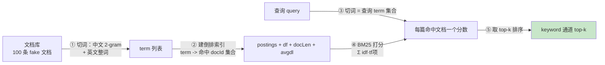

# 03-1 BM25 与词法检索：让「字面命中」变得可打分

| 元信息 | 内容 |
|------|------|
| 所属模块 | 03-手写检索三件套（检索层） |
| 篇目 | 03-1 |
| 预计时间 | 4-5 天（含 03 模块共用的语料与三通道对照） |
| 前置 | 01-1 手写入门与《对照表》模板；原理册 04-2/04-3（Embedding 与检索失败模式）已读更佳 |
| 面试可答一句话摘要 | 一句话讲清词法检索——「倒排索引拿到命中文档，BM25 用 `词频饱和 × 逆文档频率` 给每篇打分，IDF 奖励稀有词、k1/b 控制词频与长度归一化」，以及它为什么在专有名词（API 名 / CLI 命令）上比向量检索更准、在「换说法」上失效 |

> 03 模块是「手写检索三件套」：**BM25（词法）+ 余弦 top-k（向量）+ RRF 融合**，对应 04-kb-agent 的混合检索设计（README §6.2，dense + keyword 双通道 → RRF `rrf_k=60` → top-5，实现未落地，以设计约定为准）。本篇是第一件套——**keyword 通道**：用 60 行零依赖 TS 把「倒排索引 + BM25 打分」重装一遍，并对着一条查询手算核对分数。先把「字面命中」这条通道练透，下一篇（03-2）再补 dense 通道并把两路用 RRF 融合。前置：01-1 骨架已就绪（本文全部代码零依赖、`bun test` 可跑）。

## 学习目标

- 不看资料手写 `buildIndex（倒排）+ bm25Search（打分）`，跑通「100 条文档、3 条查询」的 keyword 通道 top 榜
- 讲清 BM25 三项的直觉：`IDF` 为何奖励稀有词、`k1` 控制词频饱和、`b` 控制长度归一化；并复述 `k1=1.2 / b=0.75` 的经验默认值
- 对着 1 条实测文档，把 BM25 总分**逐 term 手算展开**，能与程序输出对上（本篇已附 doc[6] 的完整手算）
- 能解释「为什么中文 2-gram 切词在专有名词上准、在「换说法」上失效」——这正是下一篇 dense 通道存在的理由
- 完成《对照表》「keyword 通道」行：手写 BM25 vs kb-agent 设计（PG `pg_trgm ILIKE`）四维成文

---

## 1. 全景：从文档库到「命中的前几名」



| 步 | 输入 → 输出 | 解决什么问题 | 本篇对应 |
|----|------------|--------------|---------|
| ① 切词 | 文档 → term 列表 | 把自然语言变成可索引的最小单元 | `tokenize.ts`（中文 2-gram） |
| ② 倒排索引 | term 列表 → `term → docId 集合` | 免去「每篇扫全文」，空间的牺牲换时间 | `buildBm25Index` |
| ③ 查询切词 | query → 查询 term（去重） | 用同样的切词口径把问题也变成 term | `tokenize(query)` |
| ④ 打分 | 命中 doc → 一个分数 | 量化「这篇多相关」，不再是非黑即白命中 | `idf × tf项` 累加 |
| ⑤ 排序 | 分数 → top-k | 输出最终的 keyword 榜单 | `bm25Search` |

> 💡 倒排索引的本质是「倒过来」：**不是「这篇文档有哪些词」，而是「这个词在哪些文档里」**。空间（一个 term 存一坨 docId）换来的时间是：打分阶段只访问**命中 term 的**文档，不扫全库——这是 IR 和朴素 `includes` 全文扫描的分水岭。

---

## 2. 核心概念：BM25 的公式与三项直觉

BM25 对一个「文档 $d$ + 查询 $q$」的打分，是**查询里每个 term $t$ 对 $d$ 的贡献之和**：

$$\text{score}(d, q) = \sum_{t \in q} \underbrace{\text{IDF}(t)}_{\text{稀有词奖励}} \times \underbrace{\frac{\text{tf}(t,d) \cdot (k_1+1)}{\text{tf}(t,d) + k_1\,\bigl(1 - b + b\,\frac{|d|}{\text{avgdl}}\bigr)}}_{\text{词频饱和} \times \text{长度归一化}}$$

三个成分各解决一个问题：

### 2.1 IDF：奖励「说了算」的稀有词

$$\text{IDF}(t) = \ln\!\Bigl(1 + \frac{N - \text{df}(t) + 0.5}{\text{df}(t) + 0.5}\Bigr)$$

- $N$ 总文档数，$\text{df}(t)$ 含 term $t$ 的文档数（**文档频率**，只看「哪些文档有」，与每篇里出现几次无关）。
- **直觉**：出现在越少文档里的词（df 小）「含金量」越高。「布隆」「误判」这种只在少数文档出现的词，IDF 大，命中它 = 强证据；「文档」「记录」这种每篇都有的填充词，IDF 极小甚至趋近 0，基本不贡献分数。
- **那个 `+1` 是 BM25+ 的一个改良**：保证 IDF 恒正。经典 BM25 的 `ln((N-df+0.5)/(df+0.5))` 在 df 超过 $N/2$ 时会变负（一个词太常见反而扣分），而 `+1` 让它永远非负，避免长文档被「常见词」反噬。

### 2.2 k1：词频会饱和，不是越多越好

- 分子 `tf·(k1+1)` 与分母的 `tf + k1·(...)` 构成一个朝向 $k_1+1$ 的**饱和函数**：tf 很小的时候分数随 tf 近线性上升；tf 变大后增量越来越小。
- **直觉**：一篇文章提「缓存」2 次 vs 提 10 次，相关性不是 5 倍，可能也就 1.5 倍——词频边际收益递减。
- $k_1$ 控制饱和快慢：$k_1$ 越大，越不饱和（tf 接近线性起作用，更看重重复）；经验默认 $k_1 = 1.2$。

### 2.3 b：长度归一化，长文要「打折」

- 括号里 `1 - b + b·(|d|/avgdl)`：$b=0$ 时这一项恒为 1（长度无关）；$b=1$ 时完全按「文档长度 / 平均长度」缩放。
- **直觉**：文章越长，出现某个词的概率天然更高（见词概率被「稀释」），不能因为长就把分算满——**长文档要打个折扣**。经验默认 $b = 0.75$。
- 本篇取标准默认值 `k1=1.2, b=0.75`（与 Lucene / 绝大多数 IR 库一致），并在实测里能看到 `avgdl=33.48` 对 docLen 的影响（见 §3.5 手算）。

> 💡 三个超参的心智模型一句话：**IDF 管「哪些词重要」，k1 管「重复多少次才算够」，b 管「文档多长才算吃亏」**。三者相乘求和，就是 BM25 的全部。

### 2.4 为什么用「排名」不用分数（伏笔）

BM25 的分数量纲是「词法命中强度」，和 dense 通道的余弦相似度（$[0,1]$ 或点积）完全不可比。这直接决定了下一篇 RRF 融合**只用排名、不用分数**（`score = Σ 1/(k+rank)`）——先记住这个矛盾，03-2 会展开讲。

---

## 3. 手写实现：60 行零依赖 TS

### 3.1 语料：100 条合成文档（`corpus.ts`）

为了让三通道对照「可复现、有分歧」，语料前 10 条是手工构造的主题文档，后 90 条是共享高频词的填充文档（凑满 100 且基本挤不进 top 榜）。完整文件直接内嵌如下（零依赖，与 `tokenize.ts` / `bm25.ts` 同目录）：

```ts
// corpus.ts —— 100 条合成中文/英文混合文档，供三通道对照演示
// 前段为「有主题」的重点文档；其余为填充文档（共享大量高频词，基本不会挤进各通道 top 榜）

// 手动构造的重点文档（主题簇 + 关键词陷阱各若干）
function importantDocs(): string[] {
  const d: string[] = []
  d.push('使用 Redis 做缓存 把数据库热点数据放进缓存 降低数据库压力 提升查询速度') // 0
  d.push('Redis 集群部署 主从复制 哨兵 高可用 缓存一致性 更新策略') // 1
  d.push('缓存穿透 击穿 雪崩 布隆过滤器 空值缓存 互斥锁') // 2
  d.push('向量检索 余弦相似度 计算两个向量之间的相似程度 点积') // 3
  d.push('文本 embedding 词袋模型 词频向量 归一化 相似度') // 4
  d.push('faiss 向量检索 构建索引 最近邻 topk 召回') // 5
  d.push('布隆过滤器 误判率 位数组 多个哈希函数 判断元素是否可能存在') // 6
  d.push('防止缓存穿透 使用布隆过滤器 拦截不存在的 key 降低数据库直接压力 redis') // 7 混 Redis 语料
  d.push('平时工作记录 没有特别主题 但这句话提到 布隆过滤器 误判率 两个术语 仅此一句') // 8 关键词陷阱：布隆高 IDF
  d.push('今日随笔 日常杂记 偶尔说一句 余弦相似度 的用途 别的地方全不相关') // 9 关键词陷阱：余弦高 IDF
  return d
}

// 填充文档：共享高频无义词，主题气息最淡，用来凑满 100 条
function fillerDocs(n: number): string[] {
  return Array.from({ length: n }, (_, i) => `文档${i}` + ' 这是一个普通文档 用于填充语料库 记录日常工作 没有特别主题 时有更新 仅供参考 定期维护 存档')
}

export function buildCorpus(): string[] {
  return [...importantDocs(), ...fillerDocs(90)]
}

// 三条演示查询
export const QUERIES = [
  'redis 缓存降低数据库压力', // Q1：Redis 主题（字面词密集 + 主题共享）
  '向量 余弦 相似度 计算',   // Q2：相似度主题（含关键词陷阱 doc9）
  '布隆过滤器 误判率',       // Q3：布隆主题（含关键词陷阱 doc8）
]
```

### 3.2 `tokenize.ts`（中文 2-gram 简化切词）

```ts
// tokenize.ts —— 中英混合简化切词：中文 2-gram + 英文/数字整词。教学用，不追求全面。
export function tokenize(text: string): string[] {
  const out: string[] = []
  for (const m of text.match(/[a-zA-Z0-9_]+/g) ?? []) out.push(m.toLowerCase()) // 英文整词，统一小写
  for (const han of text.match(/[\u4e00-\u9fff]+/g) ?? []) {
    for (let i = 0; i + 1 < han.length; i++) out.push(han.slice(i, i + 2)) // 中文 2-gram 滑动窗口
  }
  return out
}
```

- 「缓存」「数据库」都会切成 `缓存`、`存降`、`降低`、`低数`、`数据`、`据库`…… 一串重叠的 2-gram。
- 对齐 kb-agent 设计的切词思路（§6.2：中文按 2 字滑动窗口，英文/数字按空白与标点切词）。我们**略去了去停用词与专名白名单**——那是生产优化，本篇聚焦打分核心。

### 3.3 `bm25.ts`（倒排 + 打分，零依赖）

```ts
// bm25.ts —— 03-1 BM25 词法检索：倒排索引 + BM25 打分。k1=1.2, b=0.75，<100 行，零依赖
import { tokenize } from './tokenize'

export interface Bm25Index {
  docs: string[]
  postings: Map<string, Set<number>> // term -> 出现该词的 doc id 集合
  df: Map<string, number>            // term -> 文档频率
  docLen: number[]                   // 每篇 doc 的 term 数
  avgdl: number                      // 平均 doc 长度
  k1: number
  b: number
}

/** 建倒排索引 */
export function buildBm25Index(docs: string[], k1 = 1.2, b = 0.75): Bm25Index {
  const postings = new Map<string, Set<number>>()
  const docLen: number[] = []
  for (let i = 0; i < docs.length; i++) {
    const toks = tokenize(docs[i])
    docLen.push(toks.length)
    for (const t of new Set(toks)) {          // 每篇只记一次 → 倒排存的是「文档集合」不是「词频」，
      if (!postings.has(t)) postings.set(t, new Set()) //  词频打分时再现场数（教学简化）
      postings.get(t)!.add(i)
    }
  }
  const df = new Map<string, number>()
  for (const [t, s] of postings) df.set(t, s.size)
  const avgdl = docLen.length ? docLen.reduce((a, b2) => a + b2, 0) / docLen.length : 0
  return { docs, postings, df, docLen, avgdl, k1, b }
}

/** IDF（BM25+ 变体，恒正） */
export function idf(df: number, N: number): number {
  return Math.log(1 + (N - df + 0.5) / (df + 0.5))
}

/** 单 term 贡献：idf × 词频饱和 × 长度归一化 */
export function bm25Term(
  tf: number,
  docLen: number,
  avgdl: number,
  df: number,
  N: number,
  k1 = 1.2,
  b = 0.75,
): number {
  const tfNorm = (tf * (k1 + 1)) / (tf + k1 * (1 - b + (b * docLen) / avgdl))
  return idf(df, N) * tfNorm
}

/** 查询打分：对查询每个 term（去重），累加它对命中文档的贡献，取 top-k */
export function bm25Search(index: Bm25Index, query: string, topK = 10): { doc: number; score: number }[] {
  const N = index.docs.length
  const scores = new Map<number, number>()
  for (const t of new Set(tokenize(query))) {
    const post = index.postings.get(t)
    if (!post) continue                                  // 查询词无命中 → 跳过
    const df = index.df.get(t)!
    for (const d of post) {
      const tf = tokenize(index.docs[d]).filter((x) => x === t).length
      const tfNorm = (tf * (index.k1 + 1)) / (tf + index.k1 * (1 - index.b + (index.b * index.docLen[d]) / index.avgdl))
      scores.set(d, (scores.get(d) ?? 0) + idf(df, N) * tfNorm)
    }
  }
  return [...scores.entries()].map(([doc, score]) => ({ doc, score }))
    .sort((a, b) => b.score - a.score).slice(0, topK)
}

/** 逐 term 拆解单个 (query, doc) 的分数，用于手算核对（§3.5） */
export function bm25Breakdown(
  index: Bm25Index,
  query: string,
  docId: number,
): { term: string; idf: number; tf: number; tfNorm: number; contrib: number }[] {
  const docToks = tokenize(index.docs[docId])
  return [...new Set(tokenize(query))]
    .filter((t) => index.postings.get(t)?.has(docId))
    .map((t) => {
      const df = index.df.get(t)!
      const tf = docToks.filter((x) => x === t).length
      const tfNorm = (tf * (index.k1 + 1)) / (tf + index.k1 * (1 - index.b + (index.b * index.docLen[docId]) / index.avgdl))
      return { term: t, idf: idf(df, index.docs.length), tf, tfNorm, contrib: idf(df, index.docs.length) * tfNorm }
    })
}
```

### 3.4 逐段解读

- **`buildBm25Index` 用 `Set` 存 docId**：倒排里 term 记的是「哪些文档出现过」的**集合**（每篇只进一次），词频（一篇里出现几次）放到打分时再数。教学如此，生产会预存 `tf`，这里每打分重建一次以换取「核心循环一眼看穿」。
- **`idf` 的 `+1`**：见 §2.1，BM25+ 改良，保证 df 大到过半也恒正。
- **`bm25Search` 的去重 `new Set(tokenize(query))`**：查询里的 term 即使出现多次（比如「缓存缓存」切出两个「缓存」）也只算一次——查询不含词频，只有「命中了哪些词」。
- **`scores` 累加**：一篇文档命中多个查询 term，分数是这些贡献之和；命中查询词越多、词越稀有，分越高。
- **纯函数风格**：`buildBm25Index` 返回 `Bm25Index`，`bm25Search` 不改它，一个索引可被多条查询复用，测试也好写——这是 01 篇「靶子三要素」在检索里的延续。

### 3.5 实测 + 手算核对（doc[6]，本机 `bun test` v1.1.38，2026-08，与本文代码同源，非编造）

`bun demo01.ts` 一段关键输出（query = **「布隆过滤器 误判率」**，命中 top-1 = `doc[6]`）：

```text
文档库规模: 100 条
=== 索引统计 ===
唯一 term 数: 265
平均文档长度 avgdl = 33.48
超参: k1 = 1.2 , b = 0.75

=== 手算核对：query = "布隆过滤器 误判率" × doc[6] ===
N(总文档数) = 100
term=布隆/隆过/过滤/滤器  df=4  idf=3.1110  tf=1  docLen=22  avgdl=33.48  tf项=1.1632  贡献=3.6186
term=误判/判率         df=2  idf=3.6988  tf=1  docLen=22  avgdl=33.48  tf项=1.1632  贡献=4.3023
BM25 总分（Σ 贡献）= 23.0792
对照 bm25Search top-1 分数：23.0792
```

**手算核对全过程**（doc[6] =「布隆过滤器 误判率 位数组 多个哈希函数 判断元素是否可能存在」，docLen=22）：

1. **IDF（df=4 的词）**：$N=100,\ \text{df}=4$ → $\ln(1+\frac{100-4+0.5}{4+0.5})=\ln(1+21.444)=3.1110$ ✔
2. **IDF（df=2 的词「误判」「判率」）**：$\ln(1+\frac{100-2+0.5}{2+0.5})=\ln(1+39.4)=3.6988$ ✔（df 更小 → IDF 更大，`误判/判率` 比 `布隆/过滤` 更稀有）
3. **tf 项（tf=1, docLen=22, avgdl=33.48, k1=1.2, b=0.75）**：
   $\frac{1\times2.2}{1+1.2(1-0.75+0.75\times\frac{22}{33.48})}=\frac{2.2}{1+1.2\times0.7428}=\frac{2.2}{1.8914}=1.1632$ ✔
4. **分项贡献**：df=4 的词每个 $1.1632\times3.1110=3.6186$，有 4 个；df=2 的词每个 $1.1632\times3.6988=4.3023$，有 2 个。
5. **总分**：$4\times3.6186+2\times4.3023=14.4744+8.6046=23.079$ → 程序输出 `23.0792` ✔

> ✅ 手算与 `bm25Search` 输出**逐位吻合**。这一步是模块 03 练习 1 的标准答案；闭卷能把这 5 步走下来，BM25 就真懂了。

### 3.6 三条查询 keyword 通道 top 榜（实测）

```text
=== keyword(BM25) top-10：redis 缓存降低数据库压力 ===
  #0   36.6425   Redis 做缓存 把数据库热点数据放进缓存 降低数据...
  #7   27.4791   防止缓存穿透 使用布隆过滤器 拦截不存在的 key 降低数据...
  #1    8.1056   Redis 集群部署 主从复制 哨兵 高可用 缓存一致性...
  #2    5.1147   缓存穿透 击穿 雪崩 布隆过滤器 空值缓存...

=== keyword(BM25) top-10：向量 余弦 相似度 计算 ===
  #3   23.9206   向量检索 余弦相似度 计算两个向量之间的相似程度...
  #4   13.6767   文本 embedding 词袋模型 词频向量 归一化 相似度...
  #9   11.9544   今日随笔 日常杂记 偶尔说一句 余弦相似度 的用途...
  #5    4.6357   faiss 向量检索 构建索引 最近邻 topk...

=== keyword(BM25) top-10：布隆过滤器 误判率 ===
  #6   23.0792   布隆过滤器 误判率 位数组 多个哈希函数...
  #8   21.5480   平时工作记录 没有特别主题 但这句话提到 布隆过滤器 误判率...
  #2   16.3315   缓存穿透 击穿 雪崩 布隆过滤器 空值缓存...
  #7   13.6960   防止缓存穿透 使用布隆过滤器 拦截不存在的 key...
```

三个值得记住的现象：

1. **每条 top-10 实际都只返回 4 条**：语法要求 `topK=10`，但命中查询 term 的文档总共只有 4 篇，所以榜单不足 10。原因是中文 2-gram 太「碎」，很多 2-gram 只落在少数文档——这是 2-gram 切词的固有副作用，不是 bug。
2. **陷阱文档 doc8 立功了**：Q3 的 doc8 是一堆废话 + 只含「布隆 过滤 误判 率」四个高 IDF 词，keyword 通道把它捞到第 2 名（`21.5480`）——**词法检索对「精确出现稀有专名」特别敏感**。
3. **分数差异巨大**：Q1 的 #0 是 #1 的 4 倍多（36.6 vs 8.1）——因为 #0 同时命中 `redis`、`缓存`、`降低`、`数据库`、`压力` 多个词，而 #1 只有 `redis`+`缓存`。词法打分对「命中词数量」很诚实。

### 3.7 验收测试（`03.test.ts` 摘录，`bun test` 全绿）

```ts
test('文档库规模为 100', () => expect(docs.length).toBe(100))
test('idf 单调有序：常见词 idf 小、稀有词 idf 大', () => {
  const common = idf(index.df.get('这是')!, N) // 填充文档高频词
  const rare = idf(index.df.get('布隆')!, N)   // 只出现在少数重点文档
  expect(common).toBeLessThan(rare)
})
test('手算核对：top-1 的 doc 总分 == 逐 term 拆解求和', () => { /* |Σcontrib - total| < 1e-9 */ })
test('Q3 布隆过滤器：陷阱文档 doc8 进入 keyword top-5', () => expect(ids).toContain(8))
```

实测（`bun test` v1.1.38）：

```text
03.test.ts:
(pass) 03-1 BM25 词法检索 > 文档库规模为 100 [3.32ms]
(pass) 03-1 BM25 词法检索 > idf 单调有序：常见词 idf 小、稀有词 idf 大 [1.00ms]
(pass) 03-1 BM25 词法检索 > 手算核对：top-1 的 doc 总分 == 逐 term 拆解求和 [1.26ms]
(pass) 03-1 BM25 词法检索 > Q3 布隆过滤器：关键词陷阱 doc8 进入 keyword top-5 [0.39ms]
(pass) 03-2 向量通道 + RRF 融合 > cosine top-1 不为空且分数∈[0,1] [12.87ms]
(pass) 03-2 向量通道 + RRF 融合 > RRF: score = Σ 1/(k+rank)，k=60 与手算一致 [0.29ms]
(pass) 03-2 向量通道 + RRF 融合 > 只在一路出现也能进融合：单通道文档不被丢 [4.55ms]

 7 pass / 0 fail / 8 expect() calls / Ran 7 tests across 1 files. [160.00ms]
```

---

## 4. 对照表：手写 vs kb-agent 设计 vs 纯单通道

| 维度 | 手写（本实现，60 行 TS） | kb-agent 设计（README §6.2，PG `pg_trgm ILIKE`） | 纯单通道（只用 keyword，无 dense/RRF） |
|------|------------------------|-----------------------------------------------|---------------------------------------|
| 通道构成 | 倒排 + BM25 打分（纯内存） | 关键词提取 → PG `ILIKE %kw%` 全文检索，**pg_trgm GIN 索引** | 同左（仅一条 keyword 通道） |
| 切词 | 中文 2-gram + 英文整词（教学简化，未去停用词） | 2 字滑动窗口 + 英文按空白/标点切词，**去停用词 + 专名白名单** | — |
| 相似度机制 | BM25（k1=1.2, b=0.75），IDF+词频饱和+长度归一化 | pg_trgm 三角相似度 + SQL `ILIKE` 命中 | 同左 |
| 打分依据 | 词法命中强度（分数量纲与 dense 不可比） | 与 dense 向量分数量纲同样不可比 → 都要靠 RRF 用排名融合 | 只认自己一家，没有「换说法」能力 |
| 中文边界 | 2-gram 太碎 → 命中数 < topK 常见（实测每条只有 4 条命中） | **pg_trgm 中文限制：`%词%` 对 2 字中文词不走索引退化成全表扫描**（README 实测结论，chunk 万级可接受） | 同左 |
| 著名失败 | 「缓存 vs cache」「缓存 vs 缓和」换说法时命中不到 | 同；专名（API/CLI 名）精确命中是它的强项 | hard fail：换说法就召回为 0 |
| 性能 | 打分只访问命中 term 的文档，100 条毫秒级 | 依赖 PG 索引，chunk 万级以内好，更大需升级策略 | 同 |

> 对照口径（01 篇 §4 四维）：行为差异最大的是**同一种「子串命中」思路**——keyword 通道都靠「切词 + 子串命中」走精确共现，区别在手写版用 BM25 分数做了排序，kb-agent 用 pg_trgm 相似度 + SQL 排序。而**两者的通病一致**：都搞不定「换说法」，这正是下一件套 dense + RRF 要补的。

---

## 5. 踩坑与边界

| 坑 | 现象 / 根因 | 规避 |
|----|-----------|------|
| 2-gram 切词让榜单不足 topK | 一个 2-gram 常只落在少数文档，命中总数 < topK（实测每条 top-10 实际只有 4 条） | 接受「不足即全部」；需要更多召回就上 1-gram / 拆更细 / 加同义词 |
| IDF 变负 | 经典 BM25 在 df > N/2 时 `ln` 内为负；长文档被常见词反噬 | 用 BM25+ 的 `+1` 变体（本篇即此），保证恒正（§2.1） |
| 词频当成了线性 | 把 tf 直接用，一篇文章提 10 次「缓存」就 10 倍得分 | 用 k1 饱和函数压边际收益（§2.2） |
| 长文档天然占便宜 | 越长越容易撞上查询词，不归一化就总分虚高 | 用 b 做长度归一化（§2.3），b=0.75 |
| 停用词拖累 | 「文档」「记录」「怎么」这类词 hit 一堆无关文档 | kb-agent 设计里去停用词；本篇省略但引用它 |
| 忘去重查询 term | 查询「缓存缓存」切出重复 term，同一词贡献两次 | `new Set(tokenize(query))` 去重（§3.3） |
| 把多通道分数直接相加 | BM25 的 23.08 与 cosine 的 0.707 毫不相干嘛，直接加没有意义 | **这就是 RRF 用排名不用分数的原因**，03-2 详解 |

另有一个**结构性边界**值得记下：keyword 通道的准确率依赖「用户/问题里出现和文档一致的字面词」。kb-agent 明确点名它的目标是**专有名词（API 名 / CLI 命令 / 参数名）精确命中**——这正是 keyword 的主场；而「缓存应该怎么用」「帮我看看为什么查询慢」这类**换说法问题**，它基本无能为力，必须交给下一个模块的 dense 通道。

---

## 6. 练习：把 BM25 改出花样（约 2-3 小时）

**要求**：在 §3 的 `bm25.ts` 基础上做三组对照实验，记录实测输出：

1. **手算核对（必做）**：任选一条查询，对它的 top-1 文档用 §3.5 的 5 步流程逐 term 展开，改一个 b 值（如 `b=1`）重算一遍，观察分数怎么变，并解释原因。
2. **调 k1/b**：同一查询分别用 `(k1=0.5, b=0.75)` 与 `(k1=3, b=0.75)`、`(k1=1.2, b=0)` 与 `(k1=1.2, b=1)`，对比 top 榜是否变化——体会「k1 管词频饱和、b 管长度」各自主导了什么。
3. **换切词**：把 `tokenize` 的中文从 2-gram 改成「整词按字典」或「1-gram（单字）」，重新索引再跑同一批查询，对比命中数 top 与榜单——体会「切词粒度决定词法检索的召回与噪声」。

**提示**：实验 2 中长文档（如 doc0「Redis」那几篇）对 b 最敏感——b 从 0 调到 1，它的 docLen(22) 被 `avgdl(33.48)` 归一化放大的影响最明显；实验 3 的「布隆过滤器」用 1-gram 会拆成 `布/隆/过/滤/器` 五个单字，噪声暴涨，但核心词 `布/隆` 的召回反而更全——这是「粒度 ↔ 精确度」的真实权衡，也是下一篇 dense 通道要去解决的痛。

**预期效果**：①能把 BM25 三分项逐项口算并解释每个超参动一处排序怎么变；②能用「IDF 管重要、k1 管饱和、b 管长度」一句话讲清超参的直觉；③理解「切词粒度是 keyword 通道的杠杆」，为下一篇 dense + RRF 的「换说法补漏」建立动机。

---

## 7. 对比板块：手写 BM25 vs 参照实现 vs 基线

| 维度 | 本技术：手写 BM25（60 行 TS） | 参照实现：kb-agent `pg_trgm ILIKE` / Lucene BM25 | 基线：朴素全文扫描 / 字符串 `includes` |
|------|------------------------------|-----------------------------------------------|---------------------------------------|
| 匹配机制 | 倒排索引 + BM25 打分，IDF 加权稀有词 | pg_trgm 三角相似度 + SQL `ILIKE %kw%`；Lucene 是标准 BM25 | 逐篇 `includes(词)` 全扫，无打分，只给「有/无」 |
| 排序能力 | 有连续分数（词法命中强度） | 有相似度/命中可排序 | 无排序，命中即等权 |
| 性能 | 打分只查命中 term 的文档 | GIN 索引加速，但中文 2 字词退化成全表扫描（README 实测） | 每篇全扫，O(总字符数)，量级一上去就崩 |
| 换说法 | ✗ 失效（「缓存」≠「cache」） | ✗ 同失效 | ✗ 同失效 |
| 专名命中 | ✔ 精确共现很强（实测 doc8 陷阱文档被捞起） | ✔ 这是它存在的理由 | 弱（无加权，与常见词等权） |
| 工程定位 | 教学靶子：讲清词法列车的原理 | 生产通道：PG 零新依赖即可上线 | 教学对照对象：暴露「无索引无打分」的代价 |

> 选型结论：**别用全文扫描当 keyword 通道**（无索引无打分，量级一上去就崩）；手写 BM25 的价值在「讲清词法打分三要素」；kb-agent 选 PG `pg_trgm` 是为了「零新依赖 + 算式子串命中」。而无论哪种 keyword，换说法都失效——这就把「为什么需要 dense 通道」用一句不可回避的失败模式表达出来了，下一篇接住它。

---

## 8. 面试问答

> **问：BM25 和词频逆文档频率（TF-IDF）有什么区别？**
>
> **答：** TF-IDF 是**线性**乘：`tf × idf`，TF 越大分越大、没有上限，也没有长度归一化。BM25 是对 TF-IDF 的三个改进：① IDF 加 `+1` 保证恒正（BM25+）；② 用 `tf·(k1+1)/(tf + k1·…)` 做**词频饱和**，重复出现的边际收益递减；③ 乘上 `1 - b + b·(|d|/avgdl)` 做**长度归一化**，长文档打折。三个超参数就是为这三个改进服务的：k1 管饱和速度、b 管长度、IDF 管稀有词权重。

> **问：为什么混合检索里 keyword 通道往往用 BM25 而不是一个向量模型？**
>
> **答：** 因为它对**精确的专有名词/规则字符串**命中极强：用户的 RAG 问题里会混「API 名、CLI 命令、参数名、版本号」这类无语义、只有精确拼写的词，向量通道很难对它们做出高相似度（embedding 不懂 `kb`、`scan` 这种 2 字符 token 该配什么向量）。keyword 通道直接按字面共现捞起，是「样例/教程靠精确串就能答对」的关键兜底。参考 kb-agent 的设计（README §6.2）就是一眼 P6：dense 管语义近似，keyword 管专名精确。

> **追问（陷阱）：那 keyword 通道岂不是永远够用？为什么还要 dense？**
>
> **答：** 正好相反——keyword 通道的失效模式是**「换说法」**：用户不会总用和文档一模一样的词。「缓存应该怎么用」vs 文档里的「使用 Redis 做缓存，降低数据库压力」，两者没有多少字面共现（实测里 Q1 只有 4 篇命中就是证据）。这种语义同义但字面分叉的问题，keyword 召回为 0；而 dense 通道对「换说法」天然稳健（它比的是语义表示，不是字面）。所以 `keyword` 和 `dense` 是**互为补充的两个失败方向的补丁**，单拎哪一个都会在对方擅长的场景翻车——这就是下一篇 RRF 要解决的问题。

> **追问（陷阱）：`k1` 如果调得很大或很小，检索行为会变成什么样？默认值 1.2 的直觉是什么？**
>
> **答：** `k1` 管的是**词频饱和速度**（§2.2）。极端情形：`k1 → 0` 时公式退化成 `tf` 完全不参与（只剩 IDF 定胜负），重复词再多也无关紧要，相当于「出现一次就算数」；`k1 → ∞` 时退化成**线性词频**，重复出现次数直接等比放大，一篇狂刷某词的长文档会一路霸榜——正是 TF-IDF 的旧毛病。默认 `k1=1.2`（Lucene 出厂值）是「介于两者之间」的常用折中：前几次重复明显加分、之后迅速饱和，配合 `b` 一起压长文档刷词。面试里能补一句「极端值各自退化成的形态 + 默认值的动机」，比背公式更能体现理解深度。

---

## 参考链接

- [04-kb-agent README §6.2（混合检索设计，模块源码靶子）](../../agent/agent-fullstack/projects/04-kb-agent/README.md) —— dense + keyword 双通道 → RRF `rrf_k=60` → top-5；keyword 走 PG `pg_trgm ILIKE` 的原因与中文限制（本篇对照表即对齐它）
- [Okapi BM25（Wikipedia）](https://en.wikipedia.org/wiki/Okapi_BM25) —— BM25 公式与 k1/b 参数的权威出处
- [The Probabilistic Relevance Framework: BM25 and Beyond（Robertson & Zaragoza, 2009）](https://api.semanticscholar.org/CorpusID:207870977) —— BM25 的原始理论框架与超参语义
- [Lucene BM25Similarity（官方实现）](https://lucene.apache.org/core/9_0_0/core/org/apache/lucene/search/similarities/BM25Similarity.html) —— 工业界 BM25 的参照实现（k1=1.2, b=0.75 的默认值来源）
- [原理册 04-3《检索失败模式》](../../machine-learning/doc/04-NLP基础/03-检索失败模式.md) —— dense 通道、以及 keyword 换说法失效的原理联动
- [03 模块 readme（规划与验收）](../../readme.md) —— 三件套总纲、练习递进线、验收产出

---

**下一篇**：[03-2 向量通道与 RRF 融合](02-向量通道与RRF融合.md)——BM25 管住了「字面命中」，但「换说法」它办不到。下一篇补上 dense 通道（cosine top-k + 假 embedding），再用 RRF 把两路融合，对齐 kb-agent 的 `rrf_k=60` → top-5。