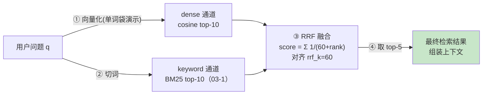

# 03-2 向量通道与 RRF 融合：补上「换说法」，再把两路捏起来

| 元信息 | 内容 |
|------|------|
| 所属模块 | 03-手写检索三件套（检索层） |
| 篇目 | 03-2 |
| 预计时间 | 4-5 天（承接 03-1 的 100 条语料与 keyword 通道） |
| 前置 | 03-1（BM25 词法通道已跑通）；原理册 04-2/04-3（Embedding 与检索失败模式）已读更佳 |
| 面试可答一句话摘要 | 一句话讲清混合检索闭环——「dense 余弦 top-k 管语义近似，keyword BM25 top-k 管专名精确，RRF 用 `score=Σ1/(k+rank)` 只认排名地把两路排名融合成最终 top-5」，以及为什么「用排名不用分数」能绕开两路分数量纲不可比 |

> 03-1 手写了 **keyword 通道**（BM25），它擅专名精确、栽在「换说法」。本篇补上第二件套 **dense 通道**（余弦 top-k，用词袋→归一化向量当「假 embedding」演示链路），再用第三件套 **RRF 融合**把两路捏成最终结果——**对齐 kb-agent 设计（README §6.2）：dense top-10 + keyword top-10 → RRF `rrf_k=60` → top-5**。在上一篇同一套 100 条语料、同 3 条查询上跑出 dense / keyword / RRF 三通道对照表。前置：03-1 已经跑通（本篇直接复用 `bm25.ts` 与 `corpus.ts`）。

## 学习目标

- 不看资料手写 `cosineTopK（词袋→L2 归一化→点积）+ rrfFuse（Σ1/(k+rank)）`，跑通 100 文档 × 3 查询的三通道对照表
- 讲清「余弦相似度为什么能被简化成点积」——只要两边都做了 L2 归一化
- 在 1 条实测样例上口算 RRF 融合分数（`1/(k+rank)` 累加），并能解释 `k=60` 在排序里的作用
- 讲清三句话结论：为什么混合比单通道稳、RRF 为什么用排名不用分数、改 `k` 为什么会/不会影响 top-5
- 完成《对照表》「dense / 融合」行：手写 vs kb-agent 设计（Qdrant dense + PG FTS + RRF）四维成文

---

## 1. 全景：三通道怎么接成一条检索链路



| 步 | 输入 → 输出 | 解决什么问题 | 本篇对应 |
|----|------------|--------------|---------|
| ① dense 打分 | 查询 + 文档的向量 → 余弦相似度 top-10 | 语义近似（「换说法」也命中） | `cosineTopK`（假 embedding） |
| ② keyword 打分 | 查询切词 → BM25 top-10 | 专名/规则字符串精确命中（03-1） | 复用 `bm25Search` |
| ③ RRF 融合 | 两路 top-10 的**排名** → 每篇一个融合分 | 两路分数量纲不可比 → 只用排名 | `rrfFuse(k=60)` |
| ④ 截断 | 融合分降序 → top-5 | 对齐 kb-agent 的「top-N(5) 作上下文」 | `slice(0,5)` |

> 💡 链条的关键词是 **top-10 + top-10 → top-5**：每路各取 10 篇「各自的强项」，交给 RRF 用排名两两互抬，最后只留 5 篇作为上下文。这也是 04-kb-agent 设计里 `retrieve` 节点（README §6.2）的完整形态。

---

## 2. 核心概念

### 2.1 余弦相似度与「归一化退化」

两个向量 $a,b$ 的余弦相似度是夹角的度量：

$$\cos(\theta) = \frac{a \cdot b}{\lVert a \rVert \,\lVert b \rVert} = \sum_i \,\frac{a_i}{\lVert a \rVert}\cdot\frac{b_i}{\lVert b \rVert}$$

- **直觉**：关心「方向」不关心「长度」。同样一段意思，写成短句和长句，embedding 的模长不同，但方向该一致——余弦恰好消掉模长。
- **关键简化**：如果我们提前把每个向量都做 **L2 归一化**（`v / |v|`，得到单位向量），那么 `|a|=|b|=1`，公式退化成 $\cos= a\cdot b$（纯点积）。**所以「归一化后余弦 = 点积」**——代码里只做一次归一化，打分就只需算内积，这就是 `l2norm` 存在的全部理由。
- **向量哪来的**：真实 dense 用模型 embedding（bge-m3 等，kb-agent 就是 Qdrant 里存 bge-m3 的向量）。本篇为了「零依赖 + 讲链路」，把每篇文档的**词袋计数**归一化成向量当「假 embedding」——**它只能捕捉字面词重叠，不含真语义**。记住这个免责声明：本篇演示的是「向量相似度 → top-k → 融合」的**机械链路**，不是 embedding 本身。

### 2.2 RRF：只认排名、不认分数

RRF（Reciprocal Rank Fusion）把一篇文档在各路结果里的**排名**折算成一个融合分：

$$\text{RRFscore}(d) = \sum_{\text{通道}} \frac{1}{k + \text{rank}(d)}$$

- **rank 从 1 开始**。dense 第 1 名、keyword 第 1 名 → $1/(60+1)+1/(60+1)=2/61≈0.0328$；只在 dense 第 5 名 → $1/65≈0.0154$。
- **为什么用排名不用分数**：BM25 的 23.08 和余弦的 0.707 分数量纲毫不相干，硬相加没有意义（谁是权重？谁多大算大？）；而「第几名」在任何通道里都是 $[1,k]$ 的有序位置，天然可比。这直接回答面试高频「RRF 为什么不用分数」。
- **天然免疫「分数归一化」这道工序**：如果改用「加权求和」融合（如 $\lambda \cdot s_{dense} + (1-\lambda) \cdot s_{keyword}$），必须先解决两路分数量纲/分布不同的问题——常见做法是 min-max 或 z-score 归一化，而归一化参数又要按语料重新拟合，是工程里最脆的一环。RRF 干脆不碰分数、只用 $[1,k]$ 的排名，从根上绕开了「归一化 → 调参 → 再归一化」这个循环——这也是「为什么不用分数」的第二层答案（面试升级版）。
- **`k`（rrf_k）是什么**：一个**平滑常数**，决定「第几名开始权重明显衰减」。看活值：第 1 名贡献 $1/(k+1)$，第 k 名贡献 $1/(2k)$ 只有第一名的一半。$k$ 越小，第 1 名越「一票顶过后面一堆」；$k$ 越大，各名次的权重越接近（更钝感）。kb-agent 约定 `rrf_k=60`（本篇对齐）。
- **只在单路出现也能入围**：一篇只在 dense 是第 5、keyword 没出现的文档，照样拿到 $1/65$ 的分、可能挤进融合 top-5——这正是混合检索想干的：**别让某一通道没捞到的文档被整体忽略**（§4/§6 有实测例）。

---

## 3. 手写实现：两件零依赖 TS

### 3.1 `cosine.ts`（dense 通道：cosine top-k）

```ts
// cosine.ts —— dense 通道：假 embedding（词袋 → L2 归一化）+ 余弦 top-k
import { tokenize } from './tokenize'

/** 对一组文档建全局词表，返回每篇的词袋（未归一化）计数向量 */
export function buildBagOfWords(docs: string[]): { vocab: string[]; vecs: number[][] } {
  const vocabSet = new Set<string>()
  const counts: Map<string, number>[] = docs.map((d) => {
    const m = new Map<string, number>()
    for (const t of tokenize(d)) m.set(t, (m.get(t) ?? 0) + 1)
    for (const t of m.keys()) vocabSet.add(t)
    return m
  })
  const vocab = [...vocabSet].sort()
  const vecs = counts.map((m) => vocab.map((t) => m.get(t) ?? 0))
  return { vocab, vecs }
}

/** L2 归一化：除模长得单位向量；余弦退化为点积 */
export function l2norm(v: number[]): number[] {
  const len = Math.sqrt(v.reduce((a, b) => a + b * b, 0))
  return len === 0 ? v : v.map((x) => x / len)
}

/** 余弦 top-k：查询也当词袋向量，归一化后逐篇点积 */
export function cosineTopK(
  docs: string[],
  query: string,
  topK = 10,
): { vocab: string[]; result: { doc: number; score: number }[] } {
  const { vocab, vecs } = buildBagOfWords(docs)
  const qCount = new Map<string, number>()
  for (const t of tokenize(query)) qCount.set(t, (qCount.get(t) ?? 0) + 1)
  const qVec = l2norm(vocab.map((t) => qCount.get(t) ?? 0))
  const nVecs = vecs.map(l2norm)
  const scored: { doc: number; score: number }[] = []
  for (let i = 0; i < docs.length; i++) {
    let dot = 0
    for (let j = 0; j < vocab.length; j++) dot += nVecs[i][j] * qVec[j]
    scored.push({ doc: i, score: dot })
  }
  scored.sort((a, b) => b.score - a.score)
  return { vocab, result: scored.slice(0, topK) }
}
```

**逐段解读**：

- **`buildBagOfWords`**：把每篇文档的词频计数塞进一个「全局词表维度」的向量——这就是 **one-hot / 词袋向量的稠密化**（词表 265 维）。**它不含语义**（「缓存」和「缓存」只在一维上撞，`cache` 和小写 `cache` 是同一个 token 但和缓存不同维）。真实工程这一步换成模型 embedding 即可，后面 cosine 逻辑一字不改。
- **`l2norm` 顶多各做一次**：`qVec` 和每个 `nVecs[i]` 都归一化，于是打分处只需 `dot += nVecs[i][j]*qVec[j]` 一个内积，就是 §2.1 的「归一化后余弦 = 点积」落地。
- **`for…sorted…slice`**：无索引的暴力 top-k——100 篇全量算一遍内积，`O(文档数 × 词表) ≈ 100×265`，毫秒级。这正是本模块与 ANN（HNSW/IVF，本模块**明确不学**）的分界线：暴力对教学、ANN 对生产。

### 3.2 `rrf.ts`（RRF 融合，k=60）

```ts
// rrf.ts —— RRF 融合：score = Σ 1/(k+rank)，对齐 kb-agent 的 rrf_k=60
/** 把多个通道的有序 docId 列表融合成按 RRF 分数降序的结果 */
export function rrfFuse(
  channelLists: number[][],
  k = 60,
): { doc: number; score: number; ranks: (number | null)[] }[] {
  const acc = new Map<number, { score: number; ranks: (number | null)[] }>()
  channelLists.forEach((list, ch) => {
    for (let r = 0; r < list.length; r++) {
      const doc = list[r]
      const entry = acc.get(doc) ?? { score: 0, ranks: channelLists.map(() => null) }
      entry.score += 1 / (k + (r + 1))      // rank 从 1 起：第 r+1 名
      entry.ranks[ch] = r + 1
      acc.set(doc, entry)
    }
  })
  return [...acc.entries()]
    .map(([doc, v]) => ({ doc, score: v.score, ranks: v.ranks }))
    .sort((a, b) => b.score - a.score)
}
```

**逐段解读**：

- **`(r + 1)` 就是 rank**：`rank = 名次`，从 1 开始（第 1 名 $r=0$ → $1/(k+1)$）。
- **`acc.set` 累加**：同一篇 doc 在两路都出现时，两边贡献相加；只在一路出现的，另一路的 rank 记 `null`（可读性好，印证「单通道也能入围」）。
- **`ranks` 字段**：实例里记录每篇在各通道的名次，正好喂给 §4 的三通道对照表。
- 全篇**没有读任何通道的分数**——接口只收「有序 docId 列表」，这就是「RRF 只用排名」在 API 结构上的一等公民体现。

### 3.3 装配：dense + keyword → RRF → top-5（demo02）

```ts
const TOP_PER_CHANNEL = 10  // 对齐 kb-agent：两通道各取 top-10
const FUSED_TOP = 5         // 对齐 kb-agent：融合后取 top-5
const RRF_K = 60            // 对齐 kb-agent
for (const q of QUERIES) {
  const dense   = cosineTopK(docs, q, TOP_PER_CHANNEL).result
  const keyword = bm25Search(index, q, TOP_PER_CHANNEL)
  const fused   = rrfFuse(
    [dense.map((r) => r.doc), keyword.map((r) => r.doc)],
    RRF_K,
  ).slice(0, FUSED_TOP)
  // …打印 dense / keyword / RRF 三通道对照表…
}
```

### 3.4 三通道对照表（100 文档 × 3 查询，实测 `bun demo02.ts`）

> 以下三张表是 `demo02.ts` 的**真实输出**（本机 macOS，`bun v1.1.38`），`dense排名 / keyword排名` 为「融合后还活着的文档」在三通道各自的名次，`—` 表示不在该通道 top 内。

**Q1 = `redis 缓存降低数据库压力`**（Redis 主题，字面词密集）

```text
dense(cosine)  top-10: #0(0.707) #7(0.485) #2(0.177) #1(0.171) #3(0.000) #4(0.000) ...
keyword(BM25)  top-10: #0(36.643) #7(27.479) #1(8.106) #2(5.115)
  doc  来源片段                     dense排名  keyword排名  融合后名次(score)
  #0   使用 Redis 做缓存 把数据库热点…   #1          #1            第1名(0.033)
  #7   防止缓存穿透 使用布隆过滤器 拦截…    #2          #2            第2名(0.032)
  #2   缓存穿透 击穿 雪崩 布隆过滤器 空值…  #3          #4            第3名(0.031)
  #1   Redis 集群部署 主从复制 哨兵 …    #4          #3            第4名(0.031)
  #3   向量检索 余弦相似度 计算两个向量…    #5          —             第5名(0.015)
RRF 融合 top-5（顺序）: #0(0.033) -> #7(0.032) -> #2(0.031) -> #1(0.031) -> #3(0.015)
```

**Q2 = `向量 余弦 相似度 计算`**（相似度主题，语义近似）

```text
dense(cosine)  top-10: #3(0.639) #4(0.387) #9(0.280) #5(0.135) #0(0.000) ...
keyword(BM25)  top-10: #3(23.921) #4(13.677) #9(11.954) #5(4.636)
RRF 融合 top-5: #3(0.033) -> #4(0.032) -> #9(0.032) -> #5(0.031) -> #0(0.015)
  （并集三通道：dense/keyword 前四名完全一致 #3 #4 #9 #5；#0 只在 dense 第 5 名，但凭 1/65 ≈ 0.015 仍挤进融合第 5）
```

**Q3 = `布隆过滤器 误判率`**（布隆主题，含陷阱文档）

```text
dense(cosine)  top-10: #6(0.522) #8(0.471) #2(0.408) #7(0.320) #0(0.000) ...
keyword(BM25)  top-10: #6(23.079) #8(21.548) #2(16.331) #7(13.696)
RRF 融合 top-5: #6(0.033) -> #8(0.032) -> #2(0.032) -> #7(0.031) -> #0(0.015)
```

### 3.5 实测解读（这才是收获）

1. **两条通道大部分名次一致**：因为「假 embedding = 词袋」本质上还是在量词重叠，所以 dense 与 keyword 的 top 高度趋同（都认 #0 / #3 / #6）。真 embedding 会带来更多「语义分叉」——但链路逻辑一模一样，这正是本演示的意义：**先把融合机制跑透，再换真 embedding**。
2. **`#3`（Q1）是「只在一路」入围的活例**：dense 第 5、keyword 没进 top → 直接 `1/65≈0.015` 当融合分，排第 5。混合检索想保留的就是这种「某一路认为还行」的文档，不被另一路埋掉。
3. **分数完全可手算**（练习 1 的标答，拿 Q1 的融合表）：
   - doc[0] = dense#1 + keyword#1 → $1/(60+1)+1/(60+1)=2/61=0.0328$ → 程序显示 `0.033` ✔
   - doc[3] = dense#5 仅一次 → $1/(60+5)=1/65=0.0154$ → `0.015` ✔
   RRF 没有任何「隐藏公式」，就是这句 `Σ1/(k+rank)`。
4. **k 敏感性实验**：对这 3 条查询，`k = {5,10,60,100,500}` top-5 **一成不变**（Q3 实测）：

```text
k=5    top-5: #6 #8 #2 #7 #0
k=10   top-5: #6 #8 #2 #7 #0
k=60   top-5: #6 #8 #2 #7 #0
k=100  top-5: #6 #8 #2 #7 #0
k=500  top-5: #6 #8 #2 #7 #0
```

   **为什么排序没变**？因为这里五篇文档的名次结构是「两路都排前几名」的强重叠结构，改 k 只改变前三名的权重差，不改它们的**相对先后**。k 真正「显灵」的场景是：第 1 名 vs 第 4 名全靠同一路互抬、另一路名次穿插——那时 k 小则第 1 名一锤定音、k 大则几路名次抹平。所以「改 k 有时不改变结果」本身就是 RRF 对 `k` 钝感的证据。

### 3.6 验收测试（`bun test` 全绿摘录）

```ts
test('cosine top-1 分数∈[0,1]（归一化后点积即为夹角余弦）', ...)
test('RRF: score = Σ 1/(k+rank)，k=60 与手算一致', () => {
  const fused = rrfFuse([[3, 6], [6, 8]], 60)
  // doc6 两路分别为 rank2(dense)、rank1(keyword) => 1/62 + 1/61（与 §3.5 手算同法）
  expect(Math.abs(d6.score - (1 / 62 + 1 / 61))).toBeLessThan(1e-9)
})
test('只在一路出现也能进融合：单通道文档不被丢', () => { /* doc8 只在 keyword 也应在 fused */ })
```

实测：`7 pass / 0 fail / 8 expect() calls [160.00ms]`（03-1 + 03-2 共 7 条断言一起绿，详见 03-1 §3.7）。

---

## 4. 对照表：手写 vs kb-agent 设计 vs 纯单通道

| 维度 | 手写（本实现，cosine.ts 与 rrf.ts 各 <50 行） | kb-agent 设计（README §6.2：Qdrant dense + PG FTS + RRF） | 纯单通道（只用 dense 或只用 keyword） |
|------|-----------------------------------|----------------------------------------------------------|-------------------------------------|
| dense 来源 | **词袋→归一化**（假 embedding，仅量词重叠） | Qdrant 存 **bge-m3 的真 embedding**（LLM 语义向量） | 只跑 dense：不管字面、专名可能丢 |
| dense top-k | 暴力全量内积 `O(100×265)`（教学尺度毫秒级） | Qdrant HNSW ANN 索引（生产尺度） | — |
| keyword 来源 | 复用 03-1 的 BM25 倒排打分 | PG `pg_trgm ILIKE`（去停用词 + 专名白名单） | 只跑 keyword：换说法失效（03-1 已证） |
| 融合 | RRF `score=Σ1/(60+rank)`，只用排名（实测可手算） | RRF `rrf_k=60` → top-N(5)，完全对齐 | 无融合，一条通道定乾坤 |
| 融合后截断 | `slice(0,5)` → 5 篇上下文 | top-N(5) → 组装 context | — |
| 单路遗漏 | 融合保留「只在一路入围」的文档（实测 #3→5 / #0→5） | 同：RRF 保证两路都「有话语权」 | 另一路的好结果被永久埋没 |
| 失败模式 | 假 embedding 不认语义，融合收益被低估 | 真 embedding + RRF，专名/换说法两样都兜 | 各在自己短板场景 hard fail |

> 对照口径（01 篇 §4 四维）：手写版 dense 是「假 embedding」，这是与 kb-agent 的**最大行为差异**——kb-agent 的 dense 有真语义（bge-m3），本演示只有词重叠，因此融合收益偏保守（实测两路名次高度一致）。**全程对齐的点**是链路本身：`top-10 + top-10 → rrf_k=60 → top-5`，一分不差。

---

## 5. 踩坑与边界

| 坑 | 现象 / 根因 | 规避 |
|----|-----------|------|
| cosine 分数出现负 / 超范围 | 没归一化就点积，模长参差导致结果不可解释 | 两边都 `l2norm`，归一化后余弦 = 点积、天然 ∈[-1,1]（词袋计数恒 ≥0 则 ∈[0,1]） |
| 假 embedding 带来的 0 分平局 | 词袋向量对完全无重叠的文档给 0.0，且多条并列 0.0，`sort` 稳定 →「第几名」是插入序锤定的（实测 Q2 里 redis 文档 #0 以 dense 第 5 混入融合） | 真 embedding 几乎不给精确 0，资源上「分数=0 的文档本来就不该进 top-k」；可加分数阈值 / 用真模型 |
| 把两路分数直接相加 | `23.08 + 0.707` 分数量纲不可比，相加没意义 | 交给 RRF 只用排名：`Σ1/(k+rank)` |
| rank 从 0 起 | 若 `1/(k+r)` 从 r=0 算，第 1 名会拿 $1/k$ 被过度放大 | rank 必须从 1 起：第 1 名 $1/(k+1)$（§3.2 `(r+1)`） |
| 改 k 期待排序大变 | 实测 k=5~500 top-5 不变 | k 只在「名次穿插」场景才显灵；两点间还是直线就无所谓（§3.5 解读 4） |
| 只给 k=60 就当参数最优 | `rrf_k` 是超参，需按数据调（Notebook 的 RRF 缺省常给 60、NovelAI 给 60） | 记住「k 越小排名越尖锐」，按召回/精度实验调 |

**理论边界**：本模块**明确不学** ANN 索引（HNSW/IVF）——`cosineTopK` 是暴力全量，文档上万后不可用；生产 dense 必须走 Qdrant/faiss 的近似最近邻。手写知道了「余弦 top-k 是什么感觉」，上生产才能读懂那些索引在替你做什么。

---

## 6. 练习：把 RRF 融合改出花样（约 2-3 小时）

**要求**：在 §3 的 `cosine.ts` / `rrf.ts` 上做三组实验，各有实测输出：

1. **手算核对（必做）**：挑 Q1 的融合表，用手算验证 doc[0]（= $2/61$）与 doc[3]（= $1/65$）两个分数，再改 `k=10` 重算一遍融合分，解释涨/跌方向。
2. **故意制造「两路分叉」**：给 `cosineTopK` 的查询传入一个「换说法」词（比如把 Q1 的 `redis` 换成 `缓存存储`，`数据库` 换成 `数据仓库`），观察 dense 仍命中、keyword 却大规模 miss——把这组两路对照表记下来，验证「dense 补换说法」这条叙事。
3. **调 `rrf_k`（60 → 10 → 100）**：在同一查询上对比 top-5 排序，解释「为什么当前语料下排序不变 / 哪类名次结构下 k 才明显」（参考 §3.5 解读 4）。

**提示**：实验 2 的「换说法」是理解整个 03 模块的关键——如果切词后旧词还在而新词文档里有，keyword 就 miss、dense（假 embedding）也未必抓得住，这说明「**假 embedding 补不了语义，真 embedding 才行**」；这恰恰是你要向面试官讲清的分层——链路 vs 表示能力。实验 3 改 k 时，若某些文档只在 keyword 或只在 dense 出现，k 的变化才会松动名次；两路都排前的强重叠文档，`k` 你再怎么改都不动它们（§3.5 实测正是如此）。

**预期效果**：①能口算、代码手写 `Σ1/(k+rank)` 并解释 `k` 的直觉；②能用「dense 补换说法、keyword 补专名、RRF 只认排名」三句话完整回答混合检索；③明白手写版用的是假 embedding、只是链路演示，换成真模型后同一套融合代码一字不改即可上生产。

---

## 7. 对比板块：手写 cosine+RRF vs 参照实现 vs 基线

| 维度 | 本技术：手写 dense + RRF（~50 行 TS） | 参照实现：kb-agent（Qdrant + PG FTS + RRF） | 基线：纯 dense / 纯 keyword |
|------|--------------------------------------|---------------------------------------------|---------------------------|
| dense 表示 | 词袋（假 embedding，词重叠） | bge-m3 真语义 embedding（Qdrant 存） | 纯 dense：专名易丢 |
| 相似度 | 暴力全量余弦（归一化后点积） | Qdrant HNSW ANN（生产索引） | 纯 keyword：换说法易丢 |
| 融合 | RRF `Σ1/(60+rank)`，实测可手算 | RRF `rrf_k=60` → top-5，完全对齐 | 无融合 |
| 单通道遗漏 | 保留「只在单路入围」文档（实测可见） | 同 | 埋没另一路的成果 |
| 专名能力 | 靠 keyword 通道（03-1 的 BM25） | PG FTS + 专名白名单 | 纯 dense 弱 |
| 换说法能力 | 演示版仅词重叠；真版需真 embedding | bge-m3 真语义，天然稳健 | 纯 keyword hard fail |
| 工程定位 | 教学靶子：讲清「top-k + RRF + top-N」链路 | 生产混合检索通道 | 教学对照对象：暴露单通道失败模式 |

> 选型结论：**hybrid 永远优于单通道**，但 hybrid 的收益取决于**两路各自有真实能力**——这里的「真实」主要指 dense 得是真语义 embedding，而不是本演示的词袋。手写这套（假 embedding + 暴力 + 简易 RRF）最大的价值，是让你毫发无伤地把「top-10 + top-10 → rrf_k=60 → top-5」这条链路背下来、并能对着 kb-agent 设计逐字对齐，而不是在真模型和 ANN 的工程细节里迷失。

---

## 8. 面试问答

> **问：为什么混合检索比单一通道更稳？**
>
> **答：** dense 管「换说法也能命中」的**语义近似**，keyword 管「API 名 / CLI 命令 / 参数名」这种**规则字符串的精确命中**。单一通道各占一格失败模式：纯 dense 遇到专名（`kb`、`cleancode scan`）拿不到高相似度，纯 keyword 遇到「缓存应该怎么用 vs 文档里『降低数据库压力』」这种换说法直接召回为 0（实测里 Q1 只有 4 篇字面命中就是证据）。两路分别把对方的短板兜住，再用 RRF 融合成一路，稳定性和召回都上去了。

> **问：RRF 为什么用排名而不是分数？**
>
> **答：** 因为两路分数的量纲和范围**不可比**——BM25 的分可以是 23.08，余弦相似度是 0.707，硬相加没有意义（谁该占多少权重、多大算大，完全说不清）。而「第几名」在所有通道里都是有序位置 $[1,k]$，天然可比。RRF 就是 `score(d) = Σ 1/(k + rank(d))`，我只关心某文档在每路排第几，不关心它的原始分——这也是它能融合「根本不是一个打分体系」的 dense 和 keyword 而不需要做任何刻度对齐的原因，简单、零参数校准、实测可手算。

> **追问（陷阱）：`rrf_k` 这个 60 是怎么来的？改成 10 或 100 会怎样？**
>
> **答：** 它是**平滑常数，不是数据学出来的**——kb-agent 按社区惯例取 60（Notebook 缺省 60、NovelAI 也用 60），作用是控制「第几名开始权重明显衰减」：k 越小第 1 名越一锤定音（$1/(k+1)$ 相对 $1/(2k)$ 优势大），k 越大名次越钝感。实测改 k=10/60/100/500 时我们的 top-5 排序没变——因为文档是「两路都排前」的强重叠结构，改 k 只调权重差、不调先后；只有在名次穿插（一篇 dense#1 但 keyword#7，另一篇反之）时才明显看到 k 的杠杆。所以正确姿势是**把 k 当成超参去调，而不是指望它修复结构问题**。

---

## 参考链接

- [04-kb-agent README §6.2（混合检索设计，模块源码靶子）](../../agent/agent-fullstack/projects/04-kb-agent/README.md) —— dense top-10 + keyword top-10 → RRF `rrf_k=60` → top-N(5)；keyword 走 PG FTS 的原因与中文限制（本篇完全对齐）
- [Reciprocal Rank Fusion outperforms Condorcet and individual Rank Learning Methods（Cormack et al., 2009）](https://plg.uwaterloo.ca/~gvcormac/cormacksigir09-rrf.pdf) —— RRF 的原始论文（用排名融合的出处）
- [Qdrant：混合检索 + RRF 官方实践](https://qdrant.tech/articles/hybrid-search/) —— 生产级 dense/sparse/RRF 的工程化写法（kb-agent 的技术栈同源）
- [余弦相似度 | Wikipedia](https://en.wikipedia.org/wiki/Cosine_similarity) —— 归一化退化成点积的数学依据
- [原理册 04-2《Embedding 与相似度》](../../machine-learning/doc/04-NLP基础/02-Embedding与相似度.md) —— 真 embedding 与「余弦 vs 欧氏」的原理前置
- [03 模块 readme（三件套规划与验收）](../../readme.md) —— 三件套总纲、练习递进线、验收产出

---

**下一篇**：[04-1 ReAct 循环与工具系统](../04-手写ReAct-Agent/01-ReAct循环与工具系统.md)——检索三件套齐了（BM25 + cosine + RRF），它产出「该拿哪些上下文」。下一步把手写系列的第三大块补上：用「LLM 输出 JSON 工具调用」实现一个 ReAct 循环，看清 agent 框架替你做了什么。