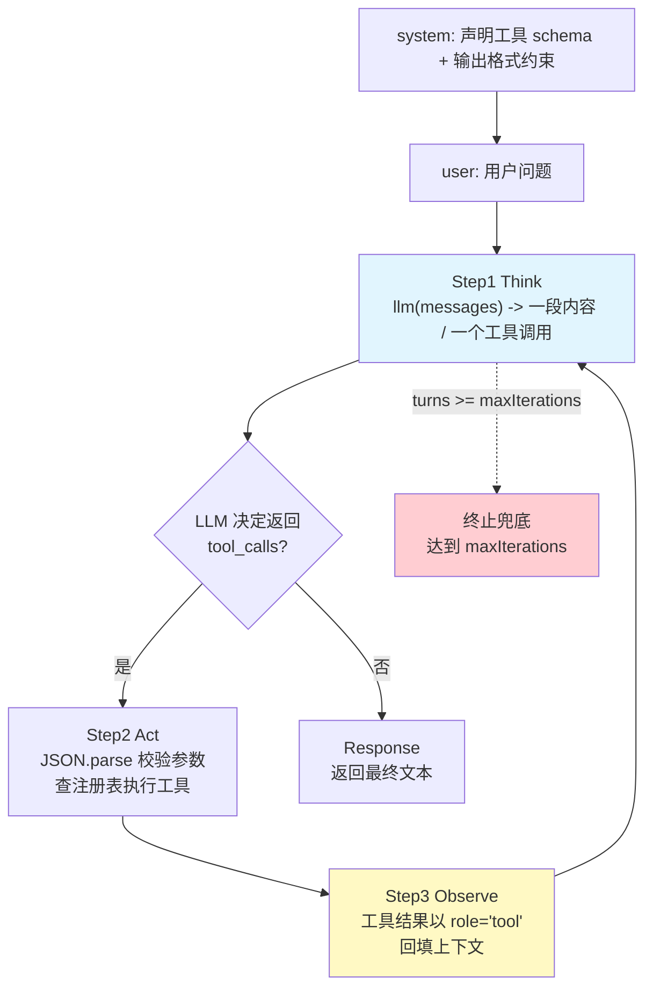

# 04 ReAct 循环与工具系统：让 LLM 学会「调用工具」

| 元信息 | 内容 |
|------|------|
| 所属模块 | 04-手写ReAct-Agent（Agent 层） |
| 篇目 | 04-1 ReAct 循环与工具系统 |
| 预计时间 | 90-120 分钟 |
| 前置 | 手写系列 01-1（工程约定 +《对照表》模板）、03-2（向量检索与 RRF）；agent-fullstack 阶段 1-2 完成；已读 01-weather-agent `src/agent/re-act/re-act.ts` |
| 面试可答一句话摘要 | 一句讲清 function calling——「LLM 按约定 schema 输出 JSON 工具调用」+ 宿主循环（解析、执行、回填、再让模型生成），框架替你做了 schema 注入、消息编排、错误重试与循环控制，手写一遍就知道每层发生了什么 |

> 本篇是 04 模块「ReAct Agent」的第一环：**把「LLM 只会输出文字」变成「LLM 会调用你的工具」**。以仓库已有靶子 [01-weather-agent 的 `re-act.ts`](../../../agent/agent-fullstack/projects/01-weather-agent/src/agent/re-act/re-act.ts) 为参照，用**零依赖 TS**把「Think → Act → Observe → Response」循环拆开重装（核心循环 ≤100 行；含两个演示工具与极简求值器，整文件约 210 行），然后与 LangChain `createAgent` 对照行为差异。前置：手写系列 01-1（对照表模板）、03-2（检索三件套），并已通读 weather-agent 的 ReAct 实现。

## 学习目标

- 画得出「prompt → JSON 输出 → JSON.parse → 工具执行 → 结果回填 → 再次生成」的闭环，讲清每一环为什么存在
- 不借助框架，手写 `llm(messages) -> Msg` 的可注入接口与一个 `maxIterations` 循环 runAgent，跑通 1 查询 + 1 计算的多步任务
- 让 mock LLM 故意输出一次**非法 JSON**，验证「校验 + 重试 1 次」后恢复而不是崩溃，并解释重试计数器为什么能防死循环
- 用一张对照表讲清手写版 vs `re-act.ts` vs LangChain `createAgent` 的核心差异（工具调用协议 / 错误处理 / 多轮循环）

---

## 1. 全景：一轮循环里发生了什么

ReAct（Reasoning + Acting）的核心不是魔法，而是一个**被 LLM 一次次填充的 while 循环**：



| 环节 | 谁来做 | 关键动作 | 本技术为什么这么做 |
|------|--------|----------|-------------------|
| Think | LLM | 读完整上下文，决定「直接答」还是「调用工具」 | LLM 不写代码，只用文本表达意图 |
| Act | 宿主（你） | 解析 JSON、查注册表、执行工具 | 宿主执行有确定性的工具逻辑 |
| Observe | 宿主（你） | 把工具结果以 `tool` 消息回填 | 让下一次 Think 能看到结果继续推理 |
| Response | LLM | 基于回填的结果生成最终中文回答 | 收敛点之一 |
| 终止 | 宿主（你） | 无 tool_calls、或 turns 达到上限 | 防「永远调用工具」的死循环 |

> 💡 记住：**循环是宿主写的，工具是宿主写的，只有「下一步做什么」这个判断是 LLM 做的。** 框架（LangChain / OpenAI SDK）替你省的，正是这段循环 + 消息编排 + 错误重试。

---

## 2. 核心概念

### 2.1 工具 schema 与注册表

工具要被 LLM 理解并正确调用，需要**两个视图**：

- **schema（给 LLM 看）**：一段 JSON Schema，描述「工具叫什么、做什么、参数有哪些」。LLM 读它才知道该传什么参数。
- **实现（给宿主跑）**：一个 `execute(args)` 函数，宿主解析出参数后直接调用。

注册表 = 一个 `name -> Tool` 的可查 `Map`，负责把「LLM 想调的工具名」翻译成「宿主能执行的函数」：

```ts
interface Tool {
  name: string
  description: string
  parameters: Record<string, unknown> // JSON Schema，供 LLM 理解参数格式
  execute: (args: Record<string, unknown>) => string // 宿主执行
}
```

> ⚠️ schema 里 `description` 不是摆设——LLM 靠它决定「该不该用、怎么用」。weather-agent 的 `weather-tool.ts` 甚至给每个参数写 `.describe("...")`，这钱花得值。

### 2.2 prompt → JSON → 解析 → 执行 → 回填 的循环

手写版的通信协议是 **JSON 字符串**（OpenAI 原生协议是 `tools` + `tool_calls`，见 §4 对照）。每一轮：

```text
messages += [assistant(tool_calls)]        # Think 的决定落盘
for tc in tool_calls:
    args  = JSON.parse(tc.arguments)        # 解析（可能失败）
    result= registry.get(tc.name).execute(args)  # 执行
    toolResults.push(tool(tool_call_id, result))
messages += toolResults                     # Observe 回填
# 回到 while 顶部，再 Think
```

**为什么一定要回填？** 因为 LLM 是无状态函数，唯一的"记忆"就是上下文。不把工具结果写回 `messages`，下一轮它根本不知道查询返回了什么，就无法继续推理出最终答案。

### 2.3 max_iterations 与终止条件

循环可以永远不收敛（LLM 可能反复调工具）。所以必须显式终止。手写版有两个终止条件：

| 终止条件 | 含义 | 触发 |
|---------|------|------|
| A. 收敛 | LLM 无 `tool_calls`，直接给出回答 | 正常完成任务 |
| B. 兜底 | `turns >= maxIterations`（默认 3） | 防死循环 |

### 2.4 结构化输出约束与重试 1 次

JSON 是文本，LLM 生成的 JSON **可能非法**（漏引号、裸花括号、多逗号）。结构化输出约束分两层：

| 层次 | 手段 | 角色 |
|------|------|------|
| 软约束（引导） | system 提示「必须输出严格 JSON，形如 `{"tool_calls":[...]}`」 | 提高合法率，但**不保证** |
| 硬约束（兜底） | 宿主 `JSON.parse` 失败 → 回填错误信息 → **重试 1 次** | 保证不崩溃 |

> 🔑 重试要防死循环：用**本轮内一个布尔开关**限制「解析失败最多重新生成一次」。重试后仍非法，就放弃本次调用、回填「两次解析失败」让 LLM 兜底，而不是无限循环。

---

## 3. 手写实现：一个可跑的 ReAct 循环

先把 LLM 收口成一个可注入函数：**真实侧传 OpenAI SDK，测试侧注入 mock**。这是整篇的支点——正因为 `llm(messages)` 与框架解耦，测试才能预置 JSON、故意制造非法 JSON。

演示用两个工具（对应模块要求「1 查询 + 1 计算」）：
- `get_stock`：查询某股票实时价格（查询类）
- `calc_expression`：计算算术表达式（计算类）

> 完整可运行、零第三方依赖。核心循环 ≤100 行（含两个演示工具与求值器，整文件约 210 行），`bun test` 直接跑绿。

### `re-act.ts`（循环 + 工具注册表 + 两个工具）

```ts
/**
 * 手写 ReAct 循环（零依赖，bun 可跑）
 * 思想：把 LLM 收口成 llm(messages) -> Msg 的可注入函数，
 *      核心循环只做四件事：Think(让LLM输出) -> Act(解析JSON执行工具) -> Observe(回填) -> Response。
 *      maxIterations 兜底防死循环；工具参数 JSON 解析失败时重试 1 次。
 */

export interface Tool {
  name: string
  description: string
  parameters: Record<string, unknown> // JSON Schema，供 LLM 理解参数格式
  execute: (args: Record<string, unknown>) => string
}

export interface ToolCall {
  id: string
  name: string
  arguments: string // LLM 返回的原始 JSON 字符串，需自行解析
}

export interface Msg {
  role: 'system' | 'user' | 'assistant' | 'tool'
  content: string
  tool_calls?: ToolCall[]
  tool_call_id?: string
}

/** LLM 收口成函数：给完整 message 历史，返回下一句/下一个工具调用。真实侧传 OpenAI SDK，测试侧注入 mock。 */
export type LLM = (messages: Msg[]) => Msg

/** 系统提示：约定「工具调用用 JSON 表达」的结构化输出约束 */
export const SYSTEM_PROMPT = `你是股票助手。当需要价格或计算时，必须调用工具，输出严格 JSON：
{"tool_calls":[{"id":"call_1","name":"工具名","arguments":"{\\"symbol\\":\\"AAPL\\"}"}]}
得到工具结果后，直接给出简洁的中文最终回答，不再调用工具。`

export interface StepEvent {
  type: 'think' | 'act' | 'observe'
  detail: string
}

export interface RunResult {
  final: string
  turns: number
  parsedJsonRetries: number
  steps: StepEvent[]
}

/** 工具注册表：由一个 name -> Tool 的可查 Map 实现 */
export function createRegistry(tools: Tool[]): Map<string, Tool> {
  return new Map(tools.map((t) => [t.name, t]))
}

function tryParse(s: string): { ok: true; value: Record<string, unknown> } | { ok: false } {
  try {
    return { ok: true, value: JSON.parse(s) as Record<string, unknown> }
  } catch {
    return { ok: false }
  }
}

/**
 * 手写 ReAct 主循环
 * @param maxIterations 最大轮数，终止条件之一（防死循环）
 */
export function runReAct(
  llm: LLM,
  registry: Map<string, Tool>,
  userMessage: string,
  maxIterations = 3
): RunResult {
  const messages: Msg[] = [
    { role: 'system', content: SYSTEM_PROMPT },
    { role: 'user', content: userMessage }
  ]
  const steps: StepEvent[] = []
  let turns = 0
  let parsedJsonRetries = 0

  while (turns < maxIterations) {
    turns++
    let asst = llm(messages) // Step 1: Think
    steps.push({ type: 'think', detail: asst.content })

    // 终止条件 A：LLM 决定不用工具，直接作答
    if (!asst.tool_calls || asst.tool_calls.length === 0) {
      return { final: asst.content, turns, parsedJsonRetries, steps }
    }

    messages.push({ role: 'assistant', content: asst.content, tool_calls: asst.tool_calls })
    let retriedThisTurn = false

    // Step 2: Act + Observe（内层：允许对整组工具调用重新生成最多 1 次）
    while (true) {
      const toolResults: Msg[] = []
      let hadBadJson = false

      for (const tc of asst.tool_calls) {
        const tool = registry.get(tc.name)
        const content =
          !tool // 未知工具：不崩溃，回填错误让 LLM 自行处理
            ? `未知工具「${tc.name}」`
            : (() => {
                const parsed = tryParse(tc.arguments)
                if (!parsed.ok) {
                  hadBadJson = true
                  return `工具参数不是合法 JSON，请检查双引号与引号转义后重新调用。`
                }
                const result = tool.execute(parsed.value)
                steps.push({ type: 'act', detail: `${tc.name}(${tc.arguments})` })
                steps.push({ type: 'observe', detail: result })
                return result
              })()
        toolResults.push({ role: 'tool', tool_call_id: tc.id, content })
      }

      // 结构化输出约束重试：本轮内解析失败且未重试过 → 把错误回填，再问 1 次 LLM
      if (hadBadJson && !retriedThisTurn) {
        retriedThisTurn = true
        parsedJsonRetries++
        asst = llm([...messages, ...toolResults])
        steps.push({ type: 'think', detail: `[重试#${parsedJsonRetries}] ${asst.content}` })
        if (!asst.tool_calls || asst.tool_calls.length === 0) {
          return { final: asst.content, turns, parsedJsonRetries, steps }
        }
        messages.push({ role: 'assistant', content: asst.content, tool_calls: asst.tool_calls })
        continue
      }

      messages.push(...toolResults) // Step 3: Observe —— 工具结果回填上下文
      break
    }
  }

  // 终止条件 B：达到 maxIterations 仍未得出最终结论
  return { final: '(达到最大迭代次数，未得出最终结论)', turns, parsedJsonRetries, steps }
}

/* ---------------- 两个演示工具：1 查询 + 1 计算 ---------------- */

/** 极简算术表达式求值器（递归下降，支持 + - * / 与括号；不用 eval，安全） */
function evaluate(input: string): number {
  const s = input.replace(/\s+/g, '')
  let i = 0
  const peek = (): string | undefined => s[i]

  function expr(): number {
    let v = term()
    while (peek() === '+' || peek() === '-') {
      const op = peek()
      i++
      const r = term()
      v = op === '+' ? v + r : v - r
    }
    return v
  }
  function term(): number {
    let v = factor()
    while (peek() === '*' || peek() === '/') {
      const op = peek()
      i++
      const r = factor()
      v = op === '*' ? v * r : v / r
    }
    return v
  }
  function factor(): number {
    if (peek() === '(') {
      i++
      const v = expr()
      i++
      return v
    }
    let str = ''
    while (peek() !== undefined && /[0-9.]/.test(peek() as string)) {
      str += peek()
      i++
    }
    return parseFloat(str)
  }
  return expr()
}

export const tools: Tool[] = [
  {
    name: 'get_stock',
    description: '查询指定股票代码的当前价格（美元）。',
    parameters: {
      type: 'object',
      properties: {
        symbol: { type: 'string', description: '股票代码，如 AAPL / TSLA / MSFT' }
      },
      required: ['symbol']
    },
    execute: (args) => {
      const prices: Record<string, number> = { AAPL: 233.3, TSLA: 777.7, MSFT: 415.2 }
      const price = prices[String(args.symbol)]
      if (price === undefined) return `未知股票代码 ${args.symbol}`
      return JSON.stringify({ symbol: args.symbol, price })
    }
  },
  {
    name: 'calc_expression',
    description: '计算一个含 + - * / 和括号的算术表达式，返回数值；用于金额/总数汇总。',
    parameters: {
      type: 'object',
      properties: {
        expression: { type: 'string', description: '算术表达式，如 "3*233.3+2*777.7"' }
      },
      required: ['expression']
    },
    execute: (args) => String(evaluate(String(args.expression)))
  }
]
```

### `re-act.test.ts`（mock LLM 预置 JSON + 非法 JSON 重试验证）

```ts
import { describe, expect, test } from 'bun:test'
import { createRegistry, runReAct, tools, type Msg } from './re-act'

const registry = createRegistry(tools)

/** 组装一个工具调用消息（可多个并行调用） */
const tc = (id: string, name: string, args: unknown): Msg => ({
  role: 'assistant',
  content: '',
  tool_calls: [
    { id, name, arguments: typeof args === 'string' ? args : JSON.stringify(args) }
  ]
})
/** 组装含多个并行 tool_calls 的消息 */
const tcAll = (calls: Array<[string, string, unknown]>): Msg => ({
  role: 'assistant',
  content: '',
  tool_calls: calls.map(([id, name, args]) => ({
    id,
    name,
    arguments: typeof args === 'string' ? args : JSON.stringify(args)
  }))
})

describe('手写 ReAct 循环', () => {
  test('多步任务：2 次查询 + 1 次计算，3 轮内给出总价', () => {
    // mock LLM 预置 JSON：按调用顺序依次返回（每调用一次 n 自增，取下一个脚本）
    let n = 0
    const scripts: Array<(m: Msg[]) => Msg> = [
      // turn1: 并行查 2 只股票（batch 多个 tool_calls）
      (m) =>
        tcAll([
          ['c1', 'get_stock', { symbol: 'AAPL' }],
          ['c2', 'get_stock', { symbol: 'TSLA' }]
        ]),
      // turn2: 计算总价
      (m) => tc('c3', 'calc_expression', { expression: '3*233.3+2*777.7' }),
      // turn3: 直接作答
      (m) => ({
        role: 'assistant',
        content: '总价约 2255.3 美元：3 股 AAPL（233.3）加上 2 股 TSLA（777.7）。'
      })
    ]
    const mockLlm: LLM = (m: Msg[]) =>
      scripts[Math.min(n++, scripts.length - 1)](m)

    const res = runReAct(mockLlm, registry, '我想买 3 股 AAPL 和 2 股 TSLA，帮我算总价')

    expect(res.turns).toBe(3)
    expect(res.parsedJsonRetries).toBe(0)
    expect(res.final).toContain('2255.3')
    // 多步链路：记录到 2 次查询 + 1 次计算
    expect(res.steps.filter((s) => s.type === 'act').length).toBe(3)
  })

  test('非法 JSON：首轮输出坏参数，重试 1 次后恢复并成功', () => {
    let n = 0
    const scripts: Array<(m: Msg[]) => Msg> = [
      (m) => tc('bad', 'get_stock', '{invalid json'), // turn1: 输出非法 JSON
      (m) => tc('ok', 'get_stock', { symbol: 'MSFT' }), // 重试：给出合法 JSON
      (m) => ({ role: 'assistant', content: 'MSFT 当前价格是 415.2 美元。' })
    ]
    const mockLlm: LLM = (m: Msg[]) => scripts[Math.min(n++, scripts.length - 1)](m)

    const res = runReAct(mockLlm, registry, '查一下 MSFT 股价')

    expect(res.parsedJsonRetries).toBe(1) // 恰好重试一次
    expect(res.final).toContain('415.2')
    expect(res.steps.some((s) => s.detail.startsWith('[重试#1]'))).toBe(true)
  })

  test('连续两次非法 JSON：重试上限后放弃，不崩溃、不进入死循环', () => {
    let n = 0
    const scripts: Array<(m: Msg[]) => Msg> = [
      (m) => tc('b1', 'get_stock', '{aaa'),
      (m) => tc('b2', 'get_stock', '{bbb'),
      (m) => ({ role: 'assistant', content: '（两次都解析失败，已放弃该查询）' })
    ]
    const mockLlm: LLM = (m: Msg[]) => scripts[Math.min(n++, scripts.length - 1)](m)

    const res = runReAct(mockLlm, registry, '查一下 X 股价')

    expect(res.parsedJsonRetries).toBe(1) // 只重试 1 次，不会无限重试
    expect(res.turns).toBeLessThanOrEqual(3)
    expect(res.final).toContain('放弃')
  })

  test('未知工具名：不崩溃，回填错误信息由 LLM 兜底', () => {
    let n = 0
    const scripts: Array<(m: Msg[]) => Msg> = [
      (m) => tc('u1', 'not_exist', {}),
      (m) => ({ role: 'assistant', content: '我没有这个工具，抱歉。' })
    ]
    const mockLlm: LLM = (m: Msg[]) => scripts[Math.min(n++, scripts.length - 1)](m)

    const res = runReAct(mockLlm, registry, '调用一个不存在的工具')

    expect(res.final).toContain('抱歉')
    expect(res.steps.filter((s) => s.type === 'act').length).toBe(0) // 未知工具不入 act
  })

  test('达到 maxIterations：返回兜底结论并终止', () => {
    // LLM 永远只回工具调用，从不收敛 → 靠 maxIterations 终止
    const infinite: LLM = (m: Msg[]) => tc('loop', 'get_stock', { symbol: 'AAPL' })
    const res = runReAct(infinite, registry, '永远调用工具', 3)

    expect(res.turns).toBe(3)
    expect(res.final).toContain('最大迭代次数')
  })
})
```

### 实测输出（本机 bun 1.1.38 / macOS，`bun test`）

```text
$ bun test
bun test v1.1.38 (bf2f153f)

re-act.test.ts:
(pass) 手写 ReAct 循环 > 多步任务：2 次查询 + 1 次计算，3 轮内给出总价 [4.54ms]
(pass) 手写 ReAct 循环 > 非法 JSON：首轮输出坏参数，重试 1 次后恢复并成功 [0.51ms]
(pass) 手写 ReAct 循环 > 连续两次非法 JSON：重试上限后放弃，不崩溃、不进入死循环 [0.19ms]
(pass) 手写 ReAct 循环 > 未知工具名：不崩溃，回填错误信息由 LLM 兜底 [0.02ms]
(pass) 手写 ReAct 循环 > 达到 maxIterations：返回兜底结论并终止 [0.01ms]

 5 pass
 0 fail
 14 expect() calls
Ran 5 tests across 1 files. [105.00ms]
```

再跑一遍 `runReAct` 打印内部步骤（下为**本机实测**）：

```text
===== 场景1 正常多步 =====
turns=3  parsedJsonRetries=0
  · [think]
  · [act] get_stock({"symbol":"AAPL"})
  · [observe] {"symbol":"AAPL","price":233.3}
  · [act] get_stock({"symbol":"TSLA"})
  · [observe] {"symbol":"TSLA","price":777.7}
  · [think]
  · [act] calc_expression({"expression":"3*233.3+2*777.7"})
  · [observe] 2255.3
  · [think] 总价约 2255.3 美元：3 股 AAPL（233.3）加上 2 股 TSLA（777.7）。
  → final: 总价约 2255.3 美元：3 股 AAPL（233.3）加上 2 股 TSLA（777.7）。

===== 场景2 非法JSON重试 =====
turns=2  parsedJsonRetries=1
  · [think]
  · [think] [重试#1]
  · [act] get_stock({"symbol":"MSFT"})
  · [observe] {"symbol":"MSFT","price":415.2}
  · [think] MSFT 当前价格是 415.2 美元。
  → final: MSFT 当前价格是 415.2 美元。

===== 场景3 连续非法放弃 =====
turns=2  parsedJsonRetries=1
  · [think]
  · [think] [重试#1]
  · [think] （两次都解析失败，已放弃该查询）
  → final: （两次都解析失败，已放弃该查询）
```

> ✅ 三个场景都验证到位：多步任务 turns=3 收敛；非法 JSON 恰好重试 1 次（`parsedJsonRetries=1`）后恢复；连续非法不崩溃、不死循环、优雅放弃。

---

## 4. 对照表：手写 vs `re-act.ts` vs LangChain `createAgent`

| 维度 | 手写版（本技术） | 01-weather-agent `re-act.ts` | LangChain `createAgent` |
|------|----------------|------------------------------|--------------------------|
| 工具调用协议 | **自定义 JSON 字符串** `{"tool_calls":[...]}`，宿主 `JSON.parse` | **OpenAI 原生** `tools` + `tool_calls`（`id` / `function.name` / `function.arguments`），SDK 代为结构化 | `AIMessage.tool_calls`（已反序列化为对象数组：`{name, args}`），不碰字符串 |
| LLM 接入 | 收口成可注入的 `llm(messages) -> Msg`，测试用 mock | **直接硬编码** `openai.chat.completions.create`，测试难注入 | 绑定到 `model.bindTools(tools)`，内部 `AgentExecutor` 编排 |
| 消息编排 | 手写 `role:'tool'` + `tool_call_id` 回填 | 手写 `assistantMessage` + `toolResults` 拼 `finalMessages` | 框架自动把 `AIMessage` + `ToolMessage` 追加进 state |
| 多轮循环 | `while (turns < maxIterations)`，**可多轮**，最多 3 轮 | **固定两段式**：Think →（一轮 Act）→ Response，无循环上限、只跑一次工具批 | **内部多轮 loop**，直到 `AgentFinish`，受 `recursionLimit` 约束 |
| JSON 校验重试 | `tryParse` 失败 → 回填错误 → **重试 1 次** | `JSON.parse` 失败 → catch 后回填「工具执行失败」错误串，**不重试** | 工具侧错误走异常/ `handleToolErrors` 回填，由模型再决策 |
| 未知工具/执行错误 | 回填错误消息，让 LLM 兜底，不抛 | catch 后回填错误消息，不抛 | 结构化错误反馈给模型，可被继续求解 |
| 依赖/可测性 | 零依赖，`llm` 注入，`bun test` 满分 | 强依赖 openai SDK + zod，测试需 mock HTTP | 引 langchain/langgraph，测试依赖框架 harness |
| 理论复杂度 ~ $O(轮数)$ | 由 `maxIterations` 限定 | 固定 2 次 LLM 调用 | 由受控 loop 限定 |

> 📌 结论：框架省掉的不是「调用工具的能力」，而是**协议约定 + 消息编排 + 循环控制 + 错误/重试**这四个样板。手写版把第 1、3、4 个点显式做了一遍，天然具备可注入 → 可测的属性；weather 版是「贴 SDK 的一轮调用」；createAgent 则是「协议结构化 + 多轮编排」的完整封装。

---

## 5. 踩坑与边界

本篇实现里真实踩到、值得记下的坑：

| 坑 | 现象 | 根因 | 解决 |
|----|------|------|------|
| mock 脚本不动 | 每次 LLM 调用都返回同一个脚本，循环跑到底才被兜底截断 | 测试里 `n` 没有自增，`scripts[Math.min(n, ...)]` 永远取第 0 个 | 每调用一次 `n++`，形成「预置脚本队列」 |
| 参数名遮蔽函数 | `expr.replace is not a function` | `evaluate(expr)` 的参数与内部递归函数 `function expr()` **同名**，而函数声明提升（hoisting）把参数 `expr` 覆盖成了函数 | 参数改名 `input`，与函数名解耦 |
| 未知工具异常 | 手写版若直接 `throw` 会打断整个循环 | 我们选择**回填错误消息**让 LLM 兜底 | 见代码 `? '未知工具' : ...` 分支 |
| 重试死循环 | 若把重试做成「while 解析成功为止」 | 解析永远可能失败 → 无限循环 | 用 `retriedThisTurn` 布尔开关，限一轮最多重试 1 次 |

**边界（手写版不处理，务意识别）**：

- **并发工具执行**：当前按顺序 `for` 串行执行；多工具并行需 `Promise.all`（weather 版同为串行）。
- **参数 schema 校验**：手写版只做 `JSON.parse`（语法），不做类型校验。weather 版用 zod `safeParse` 校验参数语义，值得学。
- **超长/多轮上下文**：没有历史截断与 token 预算，长会话会爆。这是「framework 帮你做的记忆管理」。
- **真实 LLM 的 `arguments`**：OpenAI 返回的 `function.arguments` 理论上是合法 JSON，但**转义层次**极易踩坑（引号少一层）。

---

## 6. 练习：把循环改出花样（约 40 分钟）

**要求**：

1. **跑通多步任务**：`bun test` 通过 §3 用例——「2 次查询 + 1 次计算」3 轮内给出总价。
2. **攻击非法 JSON**：把 mock LLM 的第一个脚本改成输出非法 JSON（如 `'{bad json'`），确认 `parsedJsonRetries === 1` 且最终能恢复；再把**前两个**脚本都改成非法 JSON，确认不崩溃、不进入死循环、优雅放弃。
3. **加一个「你」的工具**：新增一个工具（任选，如电商计算 `total_price`），手动调 `runReAct` 换一道多步题并验证。

**提示**：①mock 脚本用闭包 + `n++` 顺序播放，是「测试注入 + 预置 JSON」最直观的写法；②印证「工具结果为什么回填」——删掉 `messages.push(...toolResults)` 跑一遍，看 LLM 是不是因为"失忆"给了错误答案；③重试计数若归零，试着把 `retriedThisTurn` 去掉，观察会不会死循环（这正是框架帮你防的坑）。

**预期效果**：①循环可跑、非法 JSON 不崩、重试恰好 1 次；②能讲清「工具结果回填」的意义——LLM 无状态，一切结论只能从回填的上下文里长出来；③对功能 calling 的「协议约定 / 消息编排 / 错误重试 / 循环控制」四层有体感，为 §7 三角对照与下一篇 MCP 打底。

---

## 7. 对比板块：三种实现方式的三角对比

| 维度 | 本技术：手写 ReAct 循环 | agent-fullstack：`re-act.ts + weather 工具` | LangChain：`createAgent` |
|------|------------------------|--------------------------------------------|--------------------------|
| 定位 | 拆开重装、看透每层 | 直接用 SDK 的方案层参照 | 完整封装，学习其取舍的「参考答案」 |
| 受控度 | 全可控（协议、循环、重试都在你手里） | 中（循环/多轮被固定成两段式） | 低（编排在框架内） |
| 可测性 | 最高：`llm(messages)` 注入即测 | 需 mock HTTP / SDK | 需框架 harness |
| 学费 | 自己踩坑、自己补 | 看到「生产还能这么编排」 | 看到「框架到底替你做了什么」 |

> 三角闭环：**先手写（本篇）→ 再到 weather 的 `re-act.ts` 看工程化取舍 → 最后对齐 createAgent 看框架版行为差异**。三者的差异点（协议从字符串到结构化、循环从手写到内部 loop、错误从 try/catch 到结构化反馈）就是理解 Agent 框架价值的最小完备集。

---

## 8. 面试问答

> **问：function calling（工具调用）到底是什么机制？**
>
> **答：** 本质是「LLM 按约定 schema 输出 JSON 工具调用」+ 宿主循环（解析、执行、回填、再让模型生成）。LLM 本身只会输出文本，function calling 是指 LLM 的输出里包含一段结构化声明（我要调 `get_weather`，参数是 `{city:'北京'}`），真正执行的是宿主；执行结果会被回填到上下文，让模型基于真实结果继续推理。框架替你做了 schema 注入、消息编排、错误重试与循环控制——手写一遍就知道每层发生了什么。

> **问：为什么工具结果必须回填到上下文？**
>
> **答：** LLM 是无状态函数，唯一的"记忆"就是输入上下文。工具在宿主侧执行完，结果若不写回 messages，下一次生成时的模型根本看不到查询返回了什么，就无法给出正确的最终答案。回填正是 Observe 这一步的核心价值，也是 Agent 比"单轮问答"强的地方——它可以基于工具事实一步步收敛。

> **追问（陷阱）：这里的「重试 1 次」和官方 SDK / LangChain 的重试有什么不同？**
>
> **答：** 我这里把「重试」限定为**结构化输出解析失败**时的兜底——`JSON.parse` 失败就回填一条描述性错误并让 LLM 重新生成一次，用 `retriedThisTurn` 限死在本轮内、最多一次，防止死循环。官方 scheme 级 / 服务端级重试针对的是**网络、配额、限流**等 IO 问题，是"这次请求没成功再发一次"；而 JSON 非法是"这次成功了但内容不合格，反馈后重来"——两者不是一个层面，面试时分开讲最加分。

---

## 参考链接

- [ReAct：Reasoning and Acting with Language Models（Yao et al., 2022，论文原文）](https://arxiv.org/abs/2210.03629) —— ReAct 的出处，认得这是模块 04 的原理依据
- [01-weather-agent `src/agent/re-act/re-act.ts`](../../../agent/agent-fullstack/projects/01-weather-agent/src/agent/re-act/re-act.ts) —— 仓库已有靶子，本篇 §4 对照的主参照；配套 `src/agent/tools/weather-tool.ts`（zod 校验 schema）、`src/prompts/system.ts`（few-shot 工具调用示例）
- agent-fullstack 阶段 2 文档《LangChain.js 架构概览》(doc 02-01) —— `createAgent` 的行为参照，§4 / §7 三角对照的另一边

---

**下一篇**：[05-手写 MCP-Server](../05-手写MCP-Server/01-手写MCP-Server.md)——function calling 是「模型 ↔ 宿主」单进程内的调用约定；当你想让宿主动态发现并调用**外部**工具服务时，就需要标准的 JSON-RPC 协议。手写一个 stdio MCP Server：initialize → tools/list → tools/call 三跳握手，让协议透明。