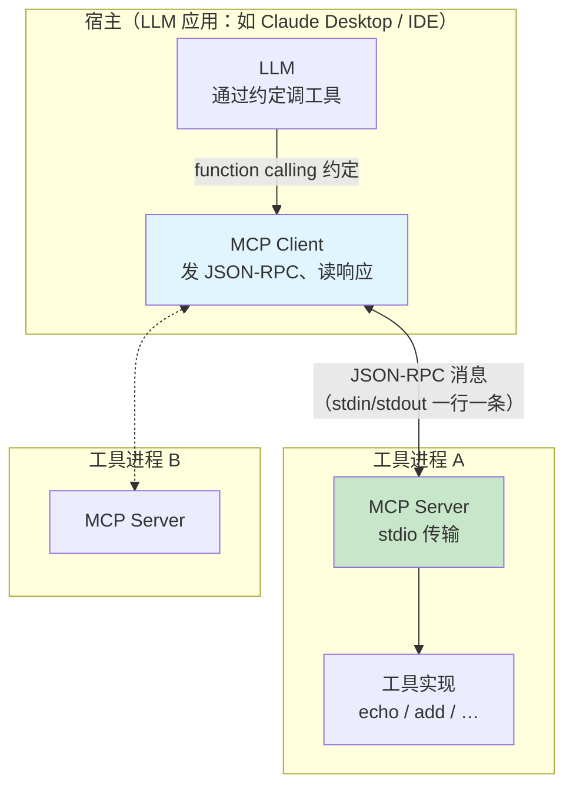
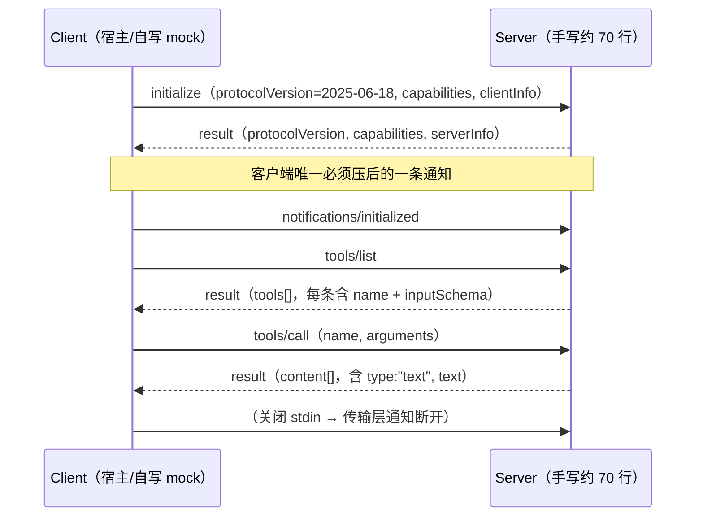

# 05 手写 MCP Server：stdio + 三跳握手

| 元信息 | 内容 |
|------|------|
| 所属模块 | 05-手写 MCP Server（协议层） |
| 篇目 | 05-1 手写 MCP Server（stdio + 三跳握手） |
| 预计时间 | 4-5 天 |
| 前置 | 04-1（手写 ReAct 循环与工具系统）；已完成 01-04 |
| 面试可答一句话摘要 | MCP = 在 JSON-RPC 2.0 之上定义的一套「宿主-客户端-服务器」工具发现与调用协议，核心就三跳：`initialize` 协商版本与能力 → `notifications/initialized` 报告就绪 → `tools/list` / `tools/call` 收发工具；stdio 传输时**一行一条 JSON、stdout 只准协议消息** |

> 本篇把「工具暴露成服务」这回事彻底拆开：用约 70 行零依赖 TS 实现一个 stdio 传输的 MCP Server（initialize → tools/list → tools/call 三跳握手），再用约 94 行自写 mock client（`Bun.spawn` 管道）真正连上去、把**真实握手消息**跑出来贴进文档。源码靶子：[`@modelcontextprotocol/sdk`](https://github.com/modelcontextprotocol/typescript-sdk)（读源码对照，测试侧才允许装官方 SDK）；协议依据：[MCP 规范 2025-06-18](https://modelcontextprotocol.io/specification/2025-06-18)。前置：04-1 你已经手写过 ReAct 循环，知道「宿主循环里函数调用」是什么质感——本篇把同样的工具搬到标准 C/S 协议上。所有输出均标记「实测」（本机已跑通，Bun 1.1.38 / TS strict）。

> ⚠️ **版本说明（2026-08 更新）**：本篇手写并实测的是 **2025-06-18** 版规范的经典三跳握手（2025-11-25 版握手流程与此一致）。2026-07-28 版规范已正式发布，协议核心改为**无状态架构**：`initialize` / `notifications/initialized` 握手与协议级会话被移除，改为每个请求自带的 `_meta` 里携带协议版本、客户端身份与能力，并新增可选的 `server/discover` 发现调用。本篇**刻意保留经典握手**教学，理由有三：① 存量 SDK 与大量线上服务仍运行旧协议，迁移是渐进式的；② 手写一遍有状态握手，才能在对比新协议时真正看懂「状态被移去了哪里」；③ 这是面试加分点——能讲清「协议从有状态演进到无状态」的完整脉络。学习时先按本篇把经典流程写通，再对照文末的 [2026-07-28 规范](https://modelcontextprotocol.io/specification/2026-07-28) 看差异。

## 学习目标

- 能默写一条 MCP 生命周期完整时序：`initialize`（协议版本 + capabilities + clientInfo）→ `notifications/initialized` → `tools/list` → `tools/call`，说清每一步谁发谁收、字段是什么
- 不看资料手写一个可被客户端连上的 stdio server 骨架（读 stdin 一行 JSON、回 stdout 一行 JSON，日志只进 stderr）
- 能对照[规范](https://modelcontextprotocol.io/specification)讲清手写版**省掉了官方 SDK 替你做的什么**（版本/能力协商、错误码语义、分页、HTTP/SSE 传输、会话管理等）
- 用「单进程内函数调用 vs 标准 C/S 工具协议」一句话回答「MCP 和 function calling 什么关系」

---

## 1. 全景：MCP 站在 Agent 架构的哪一层

MCP（Model Context Protocol）的核心主张是**工具不该和宿主进程绑死**。上一册的 ReAct 里，工具就是宿主进程里的一个 JS 函数，模型通过 function calling 约定直接调；MCP 把工具升级成**独立进程/服务**，通过标准化协议暴露给宿主，让宿主在运行时动态发现：



**对照 04 的手写 ReAct**：ReAct 是「谁调模型、模型调谁」的**进程内循环**；MCP 把这层循环里的「工具」抽象成可被外部进程提供的标准服务。就像「一个函数」vs「一套可发现的工具服务」。

---

## 2. 核心概念：JSON-RPC、生命周期三跳、stdio 传输

### 2.1 JSON-RPC 2.0：MCP 的载体格式

MCP **必须**使用 JSON-RPC 2.0（见规范 *Base Protocol*）。它只定义三种消息形态，MCP 全部复用：

| 形态 | 判定字段 | 作用 | 谁发 |
|------|---------|------|------|
| Request | 有 `id` + 有 `method` | 期望拿到响应 | 单方向主动方 |
| Notification | **无 `id`** + 有 `method` | 单向，**不期待响应** | 单方向主动方 |
| Response | 有 `id` +（`result` *或* `error`） | 回应对应 `id` 的请求 | 被请求方 |

一条标准的 MCP 请求（源自规范 *Lifecycle / Initialization*，字段 `clientInfo` 是宿主实现信息）：

```json
{ "jsonrpc": "2.0", "id": 1, "method": "initialize",
  "params": { "protocolVersion": "2025-06-18",
              "capabilities": { "roots": { "listChanged": true } },
              "clientInfo": { "name": "ExampleClient", "title": "Example Client", "version": "1.0.0" } } }
```

> 💡 `jsonrpc:"2.0"` 是固定字面量（协议版本号，不是随便写）；`id` 由调用方自增分配，服务器原样回填——这是把「异步的、多行的数据流」一对一配对的唯一依据。

### 2.2 生命周期三跳：初始化 → 就绪 → 操作

用**自写 mock client 到服务器**的视角，完整握手是（对比规范截图后的梳理，方法名均已用 [spec](https://modelcontextprotocol.io/specification/2025-06-18) 核对）：



| 跳 | 方向 | 方法 | 关键字段 | 说明 |
|----|------|------|---------|------|
| 1a | C→S | `initialize` | `protocolVersion` / `capabilities` / `clientInfo` | 客户端**必须先发**这条，协商协议版本与能力 |
| 1b | S→C | （同 id 的 response） | `protocolVersion` / `capabilities` / `serverInfo` | 服务器回己方能力；版本不支持则回另一个它支持的版本 |
| 2 | C→S | `notifications/initialized` | （无参数） | 通知服务器：我初始化完毕、可开始正常操作。**通知无 `id`，不期待响应** |
| 3a | C→S | `tools/list` | 可选 `cursor`（分页） | 发现服务器暴露了哪些工具 |
| 3b | S→C | （response） | `result.tools[]`（`name` + `description` + `inputSchema`） | 工具目录；`inputSchema` 是 JSON Schema |
| 4a | C→S | `tools/call` | `name` + `arguments` | 调用某个工具 |
| 4b | S→C | （response） | `result.content[]`（`{type:"text", text}`）+ `result.isError` | 工具执行结果；非零用 `isError:true` 表达 |

> ⚠️ 顺序约束（简称「三跳握手」）：`initialize` 必须是客户端第一条；客户端在收到 `initialize` 响应前**不应**发其它请求（规范 *SHOULD NOT*）；服务器在收到 `notifications/initialized` 前只允许发 ping/logging。我手写时只 assert 了「非 initialize 请求一律拒绝」这个方向，能力协商那种就省了——这正是 §5 对照表里要承认的差距。

### 2.3 stdio transport：一行一条 JSON、stdout 只准协议消息

标准传输中最简单的是 **stdio**（规范 *Transports / stdio），规则可以压成三条：

1. **客户端把 server 当子进程拉起来**；服务器从 `stdin` 读、往 `stdout` 写。
2. **消息按 `\n` 分隔，一条一行，消息内不允许出现换行**（`JSON.stringify` 本来就是单行，天然满足）。
3. **`stdout` 只能输出合法的 MCP 消息；日志一律走 `stderr`**。规范的措辞是 *The server MUST NOT write anything to its stdout that is not a valid MCP message.*

> 💡 第 3 条是新手最容易翻车的点：`console.log` 默认写 `stdout`，随手一行日志就能把客户端的分行解析搞崩。本篇实现统一用 `console.error` 打日志。

---

## 3. 手写实现：约 70 行零依赖 stdio server + 逐段解读

### 3.1 server.ts（自写，零第三方依赖，约 70 行）

```ts
#!/usr/bin/env bun
// handcrafted-mcp-server.ts —— 零依赖 stdio MCP Server（约 70 行）
import { stdin, stdout } from "node:process"
import readline from "node:readline"

function log(...a: unknown[]) {
  console.error("[server]", ...a) // 日志只进 stderr，stdout 只允许协议消息
}

const tools = [
  { name: "echo", description: "把传入的 text 原样返回",
    inputSchema: {
      type: "object",
      properties: { text: { type: "string", description: "要回显的文本" } },
      required: ["text"] } },
  { name: "add", description: "两数相加",
    inputSchema: {
      type: "object",
      properties: { a: { type: "number" }, b: { type: "number" } },
      required: ["a", "b"] } },
]

function send(msg: unknown) { stdout.write(JSON.stringify(msg) + "\n") }   // 一行一条 JSON-RPC
function reply(id: unknown, result: unknown) { send({ jsonrpc: "2.0", id, result }) }
function fail(id: unknown, code: number, message: string) { send({ jsonrpc: "2.0", id, error: { code, message } }) }

function handle(msg: Record<string, unknown>) {
  const { method, id, params = {} } = msg as {
    method: string; id?: unknown; params: Record<string, never>
  }
  switch (method) {
    case "initialize": {                                  // 1a/1b：协议版本 + 能力 + 实现信息协商
      log("收到 initialize，协商: %j", params)
      reply(id, {
        protocolVersion: "2025-06-18",
        capabilities: { tools: {} },
        serverInfo: { name: "handcrafted-mcp", version: "0.1.0" },
      })
      break
    }
    case "notifications/initialized":                     // 2：通知，无 id，隐含不回复
      log("客户端初始化完成")
      break
    case "tools/list":                                    // 3a/3b：返回工具目录
      reply(id, { tools })
      break
    case "tools/call": {                                  // 4a/4b：按 name 分派并执行
      const p = params as { name: string; arguments: Record<string, unknown> }
      const tool = tools.find((t) => t.name === p.name)
      if (!tool) return fail(id, -32602, `Unknown tool: ${p.name}`)
      let text = ""
      if (p.name === "echo") text = String(p.arguments.text)
      if (p.name === "add") text = String(Number(p.arguments.a) + Number(p.arguments.b))
      reply(id, { content: [{ type: "text", text }] })
      break
    }
    default:
      fail(id, -32601, `Method not found: ${method}`)
  }
}

const rl = readline.createInterface({ input: stdin })
rl.on("line", (line) => {
  log("收到原始行: %s", line)
  let msg: Record<string, unknown>
  try { msg = JSON.parse(line) } catch { return log("非法 JSON，忽略: %s", line) }
  handle(msg)
})
stdout.on("error", (e) => (e.code === "EPIPE" ? process.exit(0) : undefined))
rl.on("close", () => process.exit(0))
log("MCP server 已就绪，等待客户端…")
```

**逐段解读**

1. **工具注册表（9-20 行）**：一组 `{ name, description, inputSchema }`。`inputSchema` 是 JSON Schema——官方 Client 会用它给「模型该填什么参数」做提示，也会校验 `arguments`。手写版只当普通 JS 对象存着，校验那层省了。
2. **`send/reply/fail`（22-24 行）**：把回复序列化成**单行 JSON** 写 `stdout`；`\n` 结尾充当帧分隔符。`reply` 走 `result`、`fail` 走 `error`，盒子上对应 2.1 的三形态。
3. **`handle` 分派（26-59 行）**：按 `method` 字符串分发。`initialize` 回 `protocolVersion/ capabilities/ serverInfo`；`notifications/initialized` **不 reply**（通知没有 `id`，最忌画蛇添足）；`tools/list` 直接把注册表整个回出去；`tools/call` 查表、执行、拼 `content: [{type:"text", text}]`。未知方法回 `-32601 Method not found`，未知工具回 `-32602 Invalid params`——这是 JSON-RPC 的错误码，手写只抄了这两个。
4. **stdin 循环（61-67 行）**：`readline` 天然按行切，正好实现「一行一条 JSON」。`JSON.parse` 失败就当坏帧忽略；`log(...)` 全走 `console.error`，保住「stdout 只准协议消息」这条铁律。
5. **收尾（68-70 行）**：客户端关 stdin 或断管道（`EPIPE`）时优雅退出，不残留。

### 3.2 mock-client.ts（自写客户端，`Bun.spawn` 管道，约 94 行）

要验证三跳握手，最硬核的做法是不用任何 SDK，直接 `Bun.spawn` 把 server 当子进程拉起来、自己读行长按行解析——这一步走通，协议就真懂了。

```ts
#!/usr/bin/env bun
// mock-client.ts —— 自写 MCP client：Bun.spawn 管道，三跳握手 + 调用 add
const server = Bun.spawn({ cmd: ["bun", "server.ts"], stdin: "pipe", stdout: "pipe", stderr: "pipe" })

let buf = ""
const waiters: ((l: string) => void)[] = []
;(async () => {                                    // 后台消费 stdout，按行推给等待者
  const reader = (server.stdout as unknown as ReadableStream<Uint8Array>).getReader()
  const dec = new TextDecoder()
  for (;;) {
    const { value, done } = await reader.read()
    if (done) break
    buf += dec.decode(value, { stream: true })
    let i: number
    while ((i = buf.indexOf("\n")) >= 0) {
      const line = buf.slice(0, i).trim()
      buf = buf.slice(i + 1)
      if (line && waiters.length) waiters.shift()!(line)
      else if (line) console.log("【未配对的服务器消息】", line)
    }
  }
})()
;(async () => {                                    // 转发 server 的 stderr 日志，方便看握手过程
  const reader = (server.stderr as unknown as ReadableStream<Uint8Array>).getReader()
  const dec = new TextDecoder()
  for (;;) { const { value, done } = await reader.read(); if (done) break; process.stderr.write(dec.decode(value)) }
})()

function nextLine(timeout = 4000): Promise<string> { return new Promise((res, rej) => {
  waiters.push((l) => (l === "\0" ? rej(new Error("closed")) : res(l)))
  setTimeout(() => rej(new Error("timeout")), timeout)
}) }
function send(obj: unknown) { server.stdin!.write(JSON.stringify(obj) + "\n") }
let nextId = 1
async function call(method: string, params?: unknown): Promise<unknown> {
  const id = nextId++
  send({ jsonrpc: "2.0", id, method, ...(params !== undefined ? { params } : {}) })
  return JSON.parse(await nextLine())
}

async function main() {
  // ① initialize（版本 / 能力 / 实现信息协商）
  const init = await call("initialize", { protocolVersion: "2025-06-18", capabilities: {},
    clientInfo: { name: "mock-client", version: "0.0.1" } })
  console.log("== ① initialize 回复 =="); console.log(JSON.stringify(init, null, 2))
  send({ jsonrpc: "2.0", method: "notifications/initialized" })   // 通知就绪
  // ② tools/list
  const list = await call("tools/list")
  console.log("== ② tools/list 回复 =="); console.log(JSON.stringify(list, null, 2))
  // ③ tools/call -> add
  const done = await call("tools/call", { name: "add", arguments: { a: 20, b: 22 } })
  console.log("== ③ tools/call 回复 =="); console.log(JSON.stringify(done, null, 2))
  server.stdin!.end()            // 关 stdin → server 正常退出（传输层断开）
  await server.exited
  console.log("== 客户端结束，服务器已退出 ==")
  process.exit(0)
}
main().catch((e) => { console.error(e); process.exit(1) })
```

要点：`Bun.spawn` 把 server 的 stdout/stderr 接成 Web `ReadableStream`，两个后台循环持续消费；`call()` 每次发送带自增 `id`、随即 push 一个等待者拿下一行——这本质就是「周期请求/响应」的同步化封装，跟官方 SDK 里 `request()` 干的事一致，只是简到只剩握手必需的三种方法。

> 跑法（Bun 内置 runner，零配置）：在 server.ts 与 mock-client.ts 同目录下执行 `bun mock-client.ts`。第一次跑时若报「Method not found: undefined」，多半是 `call()` 里忘塞 `method` 字段（我实测踩过，见 §6）。

---

## 4. 实测：三跳握手的真实消息（Bun 已跑通）

在本机（Bun 1.1.38 / macOS arm64）于 `/tmp/handcrafted-check-05` 执行 `bun mock-client.ts`，输出如下，**全程无任何 MCP SDK，自写 server + 自写 client 闭环**：

```text
[server] MCP server 已就绪，等待客户端…
== ① initialize 回复 ==
{
  "jsonrpc": "2.0",
  "id": 1,
  "result": {
    "protocolVersion": "2025-06-18",
    "capabilities": { "tools": {} },
    "serverInfo": { "name": "handcrafted-mcp", "version": "0.1.0" }
  }
}
[server] 收到原始行: {"jsonrpc":"2.0","id":1,"method":"initialize","params":{"protocolVersion":"2025-06-18","capabilities":{},"clientInfo":{"name":"mock-client","version":"0.0.1"}}}
[server] 收到 initialize，协商: %j { protocolVersion: "2025-06-18", capabilities: {}, clientInfo: { name: "mock-client", version: "0.0.1" } }
[server] 收到原始行: {"jsonrpc":"2.0","method":"notifications/initialized"}
[server] 客户端初始化完成
[server] 收到原始行: {"jsonrpc":"2.0","id":2,"method":"tools/list"}
== ② tools/list 回复 ==
{
  "jsonrpc": "2.0",
  "id": 2,
  "result": { "tools": [
    { "name": "echo", "description": "把传入的 text 原样返回",
      "inputSchema": { "type": "object", "properties": { "text": { "type": "string", "description": "要回显的文本" } }, "required": ["text"] } },
    { "name": "add", "description": "两数相加",
      "inputSchema": { "type": "object", "properties": { "a": { "type": "number" }, "b": { "type": "number" } }, "required": ["a", "b"] } }
  ] }
}
[server] 收到原始行: {"jsonrpc":"2.0","id":3,"method":"tools/call","params":{"name":"add","arguments":{"a":20,"b":22}}}
== ③ tools/call 回复 ==
{
  "jsonrpc": "2.0",
  "id": 3,
  "result": { "content": [ { "type": "text", "text": "42" } ] }
}
== 客户端结束，服务器已退出 ==
```

对号入座：

- ①②③ 三条 `result`（含 `"id": 1/2/3`）就是**真实握手消息**，字段与规范给出的结构逐一对上：`protocolVersion:"2025-06-18"`、`tools/call` 的 `content[0].type:"text"`。
- `[server] 收到 initialize，协商: …` 行说明**只被收到初始化通知前也拿得到原始行日志**——因为日志走 `stderr`，stdout 里没有混进任何非协议内容，client 才能干净地把每一行解析成一条 JSON。
- 服务器侧全程只回复、不主动发消息；客户端关 `stdin` 后 server 走 `rl.on("close") → process.exit(0)` 正常退出。

> 一份可选加分项：装官方 `mcp` CLI 或 `@modelcontextprotocol/sdk` 的 Client 连同一个 server.ts（对照侧允许官方 SDK 当 devDependency），验证官方 Client 也能握手、能调 `echo`——这一步放 §7 练习。

---

## 5. 对照表：手写 vs @modelcontextprotocol/sdk（省掉了什么）

| 维度 | 手写版（本篇 ≈70 行） | `@modelcontextprotocol/sdk` | 省掉 / 框架替你做了什么 |
|------|---------------------|----------------------------|------------------------|
| 版本协商 | 只回死版本 `2025-06-18`，不支持就忽略 | 声明支持的版本列表，双向取交集、返回服务器最新支持版本 | **版本协商**：客户端若收到不支持的版本应断开（规范 *SHOULD disconnect*） |
| 能力协商 | `capabilities: { tools: {} }` 一把梭 | 解析 `initialize` 的 `capabilities`，据此开关 features、报「所需能力不足」 | **能力协商**：roots/sampling/prompts/resources/completions 等子能力 |
| 错误码 | 只抄 `-32601`/`-32602` | 完整 JSON-RPC 错误码表 + MCP 自定义码 + 结构化 `data` | **错误码语义**：范围、业务映射、可读错误对象 |
| 传输 | 仅 stdio | stdio *和* Streamable HTTP / SSE（POST+GET、SSE、断线恢复、会话管理） | **HTTP 系列传输**：跨网络、多连接、`MCP-Protocol-Version` 头 |
| 工具 | 就一个数组 + 手工 find | `Server.registerTool`、schema 推导、入参校验、分页 | **入参校验、`tools/list` 分页（cursor）、schema 工具链** |
| 架构 | `readline` + switch | 请求/响应调度器、请求队列、超时、取消、进度通知、日志 | **并发与协议机制**：平铺、排队、超时、取消 |
| 类型 | 手写 `as` 裸类型 | 全量 TS schema 类型（与规范同源，RPC Zod 校验） | **协议类型系统** |

> 一句话：手写版是「能跑的最小闭合子集」，SDK 是把规范里**每一处 SHOULD/MUST** 都兑现了的工程实现。手写一遍的意义不在于"够用"，而在于**知道框架那几百行到底在填补哪些我最初没意识到的洞**——尤其「版本/能力协商 + 错误码 + HTTP 传输」这三块，是手写时最容易忽略、面试最常被问的。

---

## 6. 踩坑记录

1. **`call()` 忘塞 `method` → 服务器回 `-32601 Method not found: undefined`**。自写 client 时我把 `{ jsonrpc, id, params }` 拼完就发，导致服务器 `method === undefined` 直接落进 `default`。教训：request 的**必备字段**就是 `jsonrpc / id / method`，`params` 才是可选的。
2. **`console.log` 污染 stdout → 客户端解析崩**。若把 `log` 改成 `console.log`，"已就绪" 这类日志就被当 JSON-RPC 解析。这也是规范 "MUST NOT 往 stdout 写非协议内容" 的现实出处。
3. **通知没有 `id`，别 reply**。`notifications/initialized` 若误回 response，客户端会收到一条没人认领、`id` 又对不上的消息——违反了「response 必须对应一个 request」的常识。
4. **`Bun.file(...).stream()` 起手式踩坑**。spawn 出来的 stdout 本来就是 `ReadableStream`，直接 `.getReader()` 即可；我最初 `Bun.file(server.stdout).stream()` 报 `ERR_INVALID_ARG_TYPE`，因为那是给「文件路径」用的。
5. **`EPIPE` 兜底**：server 写 stdout 时若客户端已经跑了（管道断开），要把这个当成正常停机，而不是崩溃。

---

## 7. 练习：让握手多走一步（约 40 分钟）

**要求**：在 §3 的 `server.ts` + `mock-client.ts` 基础上做三件事，逐条记录输出：

1. **加一个返回非文本 / 报错的工具**：给 `add` 加一个 `subtract`；再做一个当 `arguments.a` 不是数字时返回 `isError: true` 的工具，看 client 侧如何区分「协议错误」与「工具执行错误」。
2. **换 transport 心智验证（桌面演示即可）**：临时把 server 的日志改回 `console.log`，跑一次 `bun mock-client.ts`，观察「未配对的服务器消息」出现了什么——亲自体会「stdout 必须纯净」。
3. **版本协商对话（可选加分）**：client 的 `initialize` 传一个过时版本（如 `"1.0.0"`），观察 server 是否应该回复 `-32602 Unsupported protocol version`（对照规范 *Version Negotiation*），并把它实现出来。

**提示**：`isError` 是 `tools/call` 的 `result` 字段，与 JSON-RPC 的 `error`（`-32xxx` 那几个）是**两层错误**——前者是"工具运行不幸失败"，后者是"协议调用本身非法"；对照 §5 对照表里 SDK 的错误码语义做。练习 3 里 `initialize` 的协议错误为了不卡死流程，server 可以先 `fail` 再继续读下一行。

**预期效果**：①能讲清「协议错误 vs 工具执行错误」两层；②能把「`-32601`/`-32602` 之外的错误码」从「我不知道」变成「我知道 SDK 为啥要那套表」；③为下一节 05-2 可选篇（用官方 Client 接同一 server）留好成文依据。

---

## 8. 对比板块：手写 stdio server vs SDK vs 基线 function calling

| 维度 | 手写 stdio server（本技术） | `@modelcontextprotocol/sdk`（框架版） | 基线：直接 function calling（无协议层，04 的 re-act.ts） |
|------|---------------------------|--------------------------------------|----------------------------------------------|
| 模型↔工具耦合 | 解耦：工具是独立进程/服务 | 解耦，且带完整类型与机制 | 强耦合：工具就是宿主进程里的函数 |
| 工具发现 | 需显式走 `tools/list` | 内置注册 + 枚举 + 分页 | 静态 import，无运行时发现 |
| 传输 | 仅 stdio（本地进程） | stdio + HTTP/SSE（可跨网络） | 进程内直接调用，无传输层 |
| 版本/能力协商 | 跳过（写死） | 完整协商 | 无（不适用） |
| 上手成本 / 得 | 100 行看清协议本质 | 数行起服务但协议是黑盒 | 最少，但只在本进程生效 |
| 面试落点 | 讲清三跳 + 每字段含义 | 讲清协议机制与取舍 | 讲清函数调用约定 |

> 选型结论：**本地脚本之间互通用 stdio 手写够了；要跨机器/多方接入、要生产级健壮性，用官方 SDK；若你只在自己代码里调自己函数，完全不值得上 MCP**。能给面试官的分层是：**先默写三跳时序（能画出 mermaid）→ 再报一遍 SDK 省掉的三大块（版本/能力协商、错误码、传输）→ 最后落一句「MCP 是 function calling 的进程外协议化」**。

---

## 9. 面试问答

> **问：MCP 和 function calling 是什么关系？**
>
> **答：** function calling 是单进程内「模型 ↔ 宿主」之间的调用约定——模型按 schema 生成参数、宿主执行、结果回填上下文。MCP 把它**进程外化**：工具由一个独立进程提供服务，宿主通过标准 C/S 协议（JSON-RPC）动态发现并调用。一个函数 vs 一套可发现的工具服务：MCP 让工具不再绑死宿主，而是像可插拔服务一样被任何支持协议的应用接入。

> **问：stdio 和 SSE/HTTP 两种 transport 差别在哪？**
>
> **答：** stdio 是「客户端把 server 当子进程、用 stdin/stdout 传单行 JSON」——简单、零网络开销、只能本地，是规范建议实现者优先支持的形态。HTTP（Streamable HTTP / 旧 SSE）给**跨网络、多连接、断线重连**用：每次请求一个 HTTP POST、可返回 SSE 流、带 `MCP-Protocol-Version` 头与会话管理。选哪个取决于 server 是不是与应用同机部署。

> **问：`tools/list` 和 `tools/call` 各返回什么？（协议细节）**
>
> **答：** `tools/list` 返回 `result.tools[]`，每条含 `name`、`description`、`inputSchema`（JSON Schema，供模型理解该填什么）。`tools/call` 传 `name` + `arguments`，返回 `result.content[]`（最常用 `{ type:"text", text }`）+ 可选 `isError`；错误分两层——协议层走 JSON-RPC `error`（`-32xxx`），工具运行失败走 `result.isError`。

> **追问（陷阱）：`notifications/initialized` 为什么不能用 `tools/list` 提前发？**
>
> **答：** 规范要求客户端在收到 `initialize` 响应前**只**发 `initialize`（其余 *SHOULD NOT*），服务器在收到 `initialized` 通知前也只能发 ping/logging——整个生命周期是**线性推进**的。提前发 `tools/list` 违反时序约定，规范没承诺服务器一定能在未初始化状态下正确处理。手写实现里仅按「未 initialize 一律拒绝」做了弱校验，正式 SDK 会完整锁状态机。

---

## 参考链接

- [MCP 规范（protocol spec）](https://modelcontextprotocol.io/specification) —— 权威定义：Base Protocol（JSON-RPC）、Lifecycle（三跳握手与 `2025-06-18` 版本）、Server Features / Tools（`tools/list`、`tools/call` 与 `content`、`isError`）、Transports（stdio 与 Streamable HTTP）。本篇已用 2025-06-18 版本核对方法名与字段
- [MCP 规范 2026-07-28（无状态版，当前正式版）](https://modelcontextprotocol.io/specification/2026-07-28) —— 移除 `initialize` 握手与会话、请求自带 `_meta` 声明版本/身份/能力、新增 `server/discover`。阅读时对照本篇的经典握手看「状态被移去了哪里」
- [@modelcontextprotocol/typescript-sdk](https://github.com/modelcontextprotocol/typescript-sdk) —— 源码靶子：`Server`/`StdioServerTransport` 与请求调度器（对照/测试侧允许官方 SDK 作 devDependency）
- 仓库对照靶子：`agent/agent-fullstack/projects/01-weather-agent/src/agent/re-act/re-act.ts`（进程内工具调用循环，04-1 已读）；手写 ReAct 循环见本册 `04-手写ReAct-Agent`（前置篇）
- [JSON-RPC 2.0 规范](https://www.jsonrpc.org/specification) —— request / notification / response 三形态与错误码
- 原理册 04-2 / 04-3：Embedding 与检索失败模式（拼 context 前的语言基础，间接前置）

---

**下一篇**：[01-单头注意力与 KV-Cache](../06-手写注意力与KV-Cache/01-单头注意力与KV-Cache.md)——工具协议看完了，去看模型的"心脏"：把 transform 里最费算力、又最值得缓存的自注意力拆开，用固定小权重手写 prefill + decode，比较 KV Cache 前后的矩阵乘法量与实测耗时。