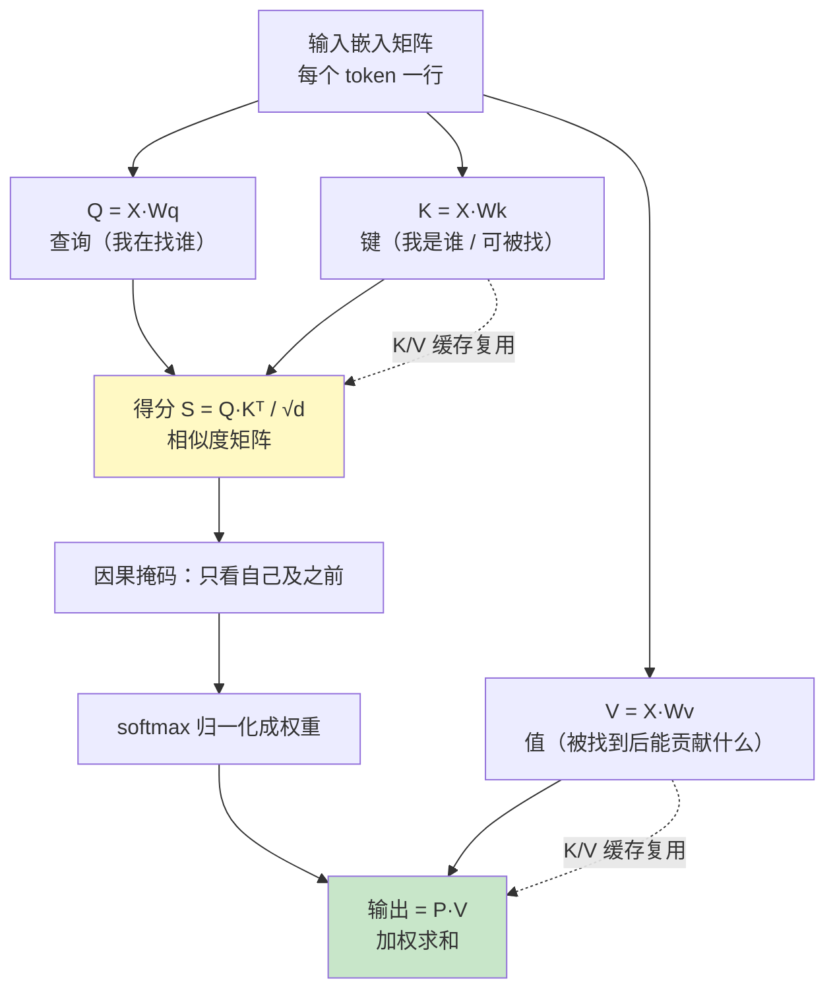

# 06 单头注意力与 KV Cache

| 元信息 | 内容 |
|------|------|
| 所属模块 | 06-手写注意力与 KV Cache（进阶层 · 可选） |
| 篇目 | 06-1 单头注意力与 KV Cache |
| 预计时间 | 3-4 天 |
| 前置 | 05-1（手写 MCP Server）；原理册 05-2《注意力与位置编码》/ 05-3《上下文窗口与 KV-Cache》 |
| 面试可答一句话摘要 | 自回归注意力的「KV Cache」之所以省算力，是因为每个 token 的 K/V 只依赖它自己、与后续 token 无关；prefill 一次性算好并缓存，decode 阶段每个新 token 只投影自己的 Q 并复用整段 K/V，把随上下文线性增长的 K/V 重投影摊平成「每 token 近乎恒定的成本」 |

> 进阶层收尾篇：nanoGPT 的心脏。用**纯 TS 矩阵、固定小权重**手写单头注意力 + 因果掩码，拆成 prefill（一次性算 K/V）与 decode（复用缓存）两阶段，量化「有缓存 vs 无缓存」的**矩阵乘法量与实测耗时**。代码零第三方依赖、Bun 直接跑；本机已实跑，数据标记「实测」。源码靶子：[microgpt TS 移植版](https://gist.github.com/snoblenet/7739055e32bffb81277b6a08d33a37ef)（bun 单文件、零依赖）；呼应原理册 05-2 / 05-3。前置：05-1（协议层收官）+ 原理册注意力两篇已读，清楚 softmax 注意力与位置编码的动机。

## 学习目标

- 用手写矩阵手推一次「Q、K、V → 得分 → softmax → 加权求和」，讲清每个 token 的 K/V 只依赖自身
- 能用公式说明：**per-token decode** 有缓存时是 $O(D \cdot c + D^2)$、无缓存重算 K/V 是 $O(D^2 \cdot c)$（ $c$ = 当时上下文长度），并解释为什么上下文越长差距越大
- 跑通 prefill + decode 两阶段，输出「理论矩阵乘法量 vs 实测耗时」对照表，能解释「预填充慢、逐 token 生成快 / 每 token 生成成本近乎恒定」
- 复用 05 手写工具的全部纪律：固定权重、确定性可再现、实测数据进文档

---

## 1. 全景：注意力就是自回归语言模型的「回头看」

Transformer 做自回归生成时，每来一个新 token，都要让**所有已出现的位置**对它打分（谁跟它"相关"），再把"相关方"的信息加权叠加到它身上——这就是注意力。它分两步，恰好对应两套矩阵乘：



**关键洞察（KV Cache 的由来）**：位置 $i$ 的 K/V 由 $x_i$ 乘一套固定的 $W_k/W_v$ 得到，**跟 $i$ 之后的任何 token 无关**。那么生成第 $j$ 个新 token（ $j > i$）时， $i$ 的 K/V 已经算过了，没必要重算——缓存起来，就是 KV Cache。真正每次都要算的，只有「新来这个 token」自己的 Q 投影和「新增一行」的注意力得分+加权。这就是 §4 用数字锁死的那件事。

---

## 2. 核心概念：注意力五件套

### 2.1 Q / K / V：一次"检索"的三个角色

| 记号 | 形状 | 角色 | 直觉 |
|------|------|------|------|
| Q（query） | 每 token `× D` | "我在找谁" | 当前 token 发起的查询 |
| K（key） | 每 token `× D` | "我是谁" | 一个 token 能被谁检索到的索引 |
| V（value） | 每 token `× D` | "我能贡献什么" | 被选中后实际用来叠加的内容 |

投影全部是线性变换： $Q = X W_q$， $K = X W_k$， $V = X W_v$，其中 $W_q, W_k, W_v \in \mathbb{R}^{D\times D}$。

### 2.2 注意力得分 → softmax → 加权求和

- 得分矩阵 $S = Q K^\top / \sqrt{D}$：一个 query 和所有 key 的点积表示相似度；除以 $\sqrt{D}$ 防点积数值过大把 softmax 推到饱和区（scale，原理册 05-2 讲过）。
- 把每个 query 行做 **softmax** 得到权重 $P$（在**它能看到的所有 key 上**归一化成和为 1）。
- 输出 $O = P V$：每个 query 把「得分高的 key 的 value」加权求和，即"相关方的内容"按注意力权重混合进当前位。

### 2.3 因果掩码：自回归只看"过去"

生成是自回归的：第 $i$ 个位置**只能看前 $i$ 个位置**（含自己），不能看见未来。矩阵实现就是在得分矩阵里把右上三角（ $j>i$）置为 $-\infty$，softmax 后这些位置权重归 0：

$$
S[i][j] = \begin{cases} S[i][j], & j \le i \\ -\infty, & j > i \end{cases}
$$

### 2.4 prefill vs decode：两阶段算力画像

| 阶段 | 处理量 | 计算特征 | 心智模型 |
|------|--------|---------|---------|
| **prefill（预填充）** | 一次性喂整段 prompt（ $N$ 个 token） | Q/K/V 全部投影 + 因果注意力，**K/V 落缓存** | 慢一坨，但是一次性 |
| **decode（逐 token 生成）** | 每次只喂 1 个新 token | 只投影新 token 的 Q（K/V 只算新的一行入缓存），对整段 K/V 做单行注意力 | 每 token 成本近乎恒定，可以"跑起来" |

KV Cache 的本质就是：**把 prefill 算好的 K/V 存下来，decode 阶段只追加新 token 的 K/V、复用旧的全部**，从而省掉"每生成一个 token 都要把整段 K/V 重算一遍"的重复工作。

---

## 3. 手写实现：纯 TS 矩阵 + 固定小权重

### 3.1 代码（单文件、零依赖，实跑于本机）

```ts
#!/usr/bin/env bun
// attention-kvcache.ts —— 单头注意力 + 因果掩码 + KV Cache（纯 TS 矩阵，零依赖）
const D = 10 // 单头嵌入维度

// 固定小权重：确定性伪随机（固定种子），任意本机可复现
function seeded(seed: number) {
  let s = seed
  return () => ((s = (s * 1103515245 + 12345) % 2147483648) / 2147483648) * 2 - 1
}
const rnd = seeded(42)
function fill(r: number, c: number, f: () => number): number[][] {
  return Array.from({ length: r }, () => Array.from({ length: c }, () => f()))
}
const Wq = fill(D, D, rnd) // Q 投影
const Wk = fill(D, D, rnd) // K 投影
const Wv = fill(D, D, rnd) // V 投影

// 浮点乘运算计数器（简化 FLOPs，只数乘法）
let ops = 0
function reset() { ops = 0 }
function mul(A: number[][], B: number[][]): number[][] {
  const [r, k, c] = [A.length, A[0].length, B[0].length]
  const O = fill(r, c, () => 0)
  for (let i = 0; i < r; i++)
    for (let j = 0; j < k; j++)
      for (let m = 0; m < c; m++) { O[i][m] += A[i][j] * B[j][m]; ops++ }
  return O
}

// 因果掩码注意力：Q(qn×D) @ Kᵀ(N×D)，query 行 i 可看到绝对位置 ≤ qStart+i 的 key，
// 其余为 -∞，随后 row-softmax @ V。
//   - prefill：qStart=0 → 等价于常见 j≤i
//   - decode：新 query 绝对位置 = qStart（缓存里已有 qStart 个 key）→ 其实全可见
function causalAttn(Q: number[][], K: number[][], V: number[][], qStart = 0): number[][] {
  const qn = Q.length, N = K.length
  const S = Array.from({ length: qn }, () => new Array<number>(N).fill(-Infinity))
  for (let i = 0; i < qn; i++)
    for (let j = 0; j <= Math.min(qStart + i, N - 1); j++) {
      let dot = 0
      for (let d = 0; d < D; d++) { dot += Q[i][d] * K[j][d]; ops++ }
      S[i][j] = dot / Math.sqrt(D)            // 缩放：divide-by-sqrt(d)
    }
  const P = S.map((row) => {
    const mx = Math.max(...row)
    const e = row.map((v) => Math.exp(v - mx))
    const s = e.reduce((a, b) => a + b, 0)
    return e.map((x) => x / s)
  })
  const O = Array.from({ length: qn }, () => new Array<number>(D).fill(0))
  for (let i = 0; i < qn; i++)
    for (let j = 0; j < N; j++)
      for (let d = 0; d < D; d++) { O[i][d] += P[i][j] * V[j][d]; ops++ }
  return O
}

const N_PREFILL = 400  // prefill 一次性处理 400 个 token
const M_DECODE = 100   // 随后逐个 decode 100 个 token
const X = fill(N_PREFILL, D, () => Math.random())
const tok = fill(M_DECODE, D, () => Math.random())
const toks = [...X, ...tok]                     // 完整序列（400 + 100）

/* 1) prefill：一次性算 Q/K/V + 整段因果注意力，K/V 存入缓存 */
reset()
const Qp = mul(X, Wq), Kp = mul(X, Wk), Vp = mul(X, Wv)
causalAttn(Qp, Kp, Vp, 0)                       // O_prefill 此处不展开
const prefillOps = ops

/* 2) decode（有 KV-Cache）：只投影最新 token 的 Q/K/V，K/V 追加进缓存复用 */
const KV = { K: Kp.map((r) => [...r]), V: Vp.map((r) => [...r]) }
reset()
const outsCache: number[][] = []
function decodeWithCache(cacheKV: { K: number[][]; V: number[][] }) {
  const os: number[][] = []
  for (let s = 0; s < M_DECODE; s++) {
    const at = N_PREFILL + s                   // 当前新 token 的绝对位置
    const t = toks[at]
    const q = mul([t], Wq), k = mul([t], Wk), v = mul([t], Wv)
    cacheKV.K.push(k[0]); cacheKV.V.push(v[0])  // 只追加新的一行
    os.push(causalAttn(q, cacheKV.K, cacheKV.V, at)[0])
  }
  return os
}
outsCache.push(...decodeWithCache(KV))
const cacheOps = ops

/* 3) decode（无 KV-Cache / 清缓存）：每 token 都对【全部上下文】重投影 K/V */
reset()
const outsNoCache: number[][] = []
for (let s = 0; s < M_DECODE; s++) {
  const at = N_PREFILL + s
  const t = toks[at]
  const q = mul([t], Wq)
  const K = mul(toks.slice(0, at + 1), Wk)      // ← 整段重算 K（含自身，与缓存版一致）
  const V = mul(toks.slice(0, at + 1), Wv)      // ← 整段重算 V
  outsNoCache.push(causalAttn(q, K, V, at)[0])
}
const noCacheOps = ops

/* 4) 校验：有/无缓存二者应逐 token 数值一致（仅计算路径不同） */
let maxDiff = 0
for (let s = 0; s < M_DECODE; s++)
  for (let d = 0; d < D; d++)
    maxDiff = Math.max(maxDiff, Math.abs(outsCache[s][d] - outsNoCache[s][d]))

/* 5) 实测耗时：同一段 decode 跑 R 次累计，除以 R×M 得到「每 token」平均耗时 */
const R_CACHE = 40, R_NOCACHE = 40
let t0 = performance.now()
for (let i = 0; i < R_CACHE; i++) decodeWithCache({ K: Kp.map((r) => [...r]), V: Vp.map((r) => [...r]) })
const tCachePerTok = (performance.now() - t0) / (R_CACHE * M_DECODE)
t0 = performance.now()
for (let i = 0; i < R_NOCACHE; i++)
  for (let s = 0; s < M_DECODE; s++) {
    const at = N_PREFILL + s, t = toks[at]
    const q = mul([t], Wq)
    const K = mul(toks.slice(0, at + 1), Wk)
    const V = mul(toks.slice(0, at + 1), Wv)
    causalAttn(q, K, V, at)
  }
const tNoCachePerTok = (performance.now() - t0) / (R_NOCACHE * M_DECODE)

const fmt = (n: number) => n.toLocaleString("en-US")
console.log("===== 单头注意力 + KV Cache 实测（D=" + D + "）=====")
console.log("[prefill] 一次性处理 " + N_PREFILL + " token：矩阵乘运算量 = " + fmt(prefillOps) + " 次")
console.log("")
console.log("[decode] " + M_DECODE + " 个 token：")
console.log("  有 KV-Cache：矩阵乘运算量 = " + fmt(cacheOps) + " 次；实测 每token 平均 " + tCachePerTok.toFixed(4) + " ms")
console.log("  无 KV-Cache：矩阵乘运算量 = " + fmt(noCacheOps) + " 次；实测 每token 平均 " + tNoCachePerTok.toFixed(4) + " ms")
console.log("  加速比：运算量 " + (noCacheOps / cacheOps).toFixed(1) + "x，" + "实测耗时 " + (tNoCachePerTok / tCachePerTok).toFixed(1) + "x")
console.log("")
console.log("[校验] 有/无缓存输出最大绝对差 = " + maxDiff.toExponential(2) + "（≈0 即两者数值一致）")
console.log("[样例] 每 token 因果注意力输出（前 5 个 token 的第一个维度）：")
console.log("  " + outsCache.slice(0, 5).map((o) => o[0].toFixed(3)).join("  "))
```

### 3.2 逐段解读

1. **固定小权重（5-16 行）**：`seeded(42)` 确定性伪随机生成 $W_q/W_k/W_v$，保证任何机器复现出同一组权重——**教育用代码最怕"每次跑结果不同"**。`fill` 就是把每个格子塞一个随机数。
2. **`mul`（21-28 行，含 `ops++`）**：朴素三重循环矩阵乘，顺带把**每次浮点乘运算**累加到 `ops`——这就是"矩阵乘法量"的可测定义（对比抽象 FLOPs，这里的数字是从真实代码路径数出来的）。
3. **`causalAttn`（34-54 行）**：核心函数。得分循环条件（38 行）里 `j <= Math.min(qStart+i, N-1)` 是实现因果掩码的**矩阵化一刀**；softmax 用 `Math.max` 数值稳定化（防 exp 溢出）；最后三重循环做 $O=PV$。注意 **decode 时新 query 的绝对位置是 `qStart`**，不是行下标 0——见 §6 踩坑记录第 1 条。
4. **prefill（62-66 行）**：一次性把 400 个 token 的 Q/K/V 全投影、做整段因果注意力，K/V 存进 `KV`。
5. **decode with cache（68-84 行）**：每一步只对【新 token】投影 Q/K/V，然后 `push` 进缓存、对整段 K/V 做**单行**因果注意力。K/V 是"追加"而非"重算"。
6. **decode without cache（86-97 行）**：同一份逻辑，但每步 `slice(0, at+1)` 后**对整段重新投影 K/V**——这就是"把缓存清掉"的代价版本。两者应为同一数值结果（只差计算路径），用 §4 的校验互证。
7. **计时（105-119 行）**：每个方案把 100-token 的 decode 跑 40 遍求均值，`每 token 耗时 = 总耗时/(40×100)`，把微秒级抖动摊掉。

> ⚠️ Flops 数法说明：`mul` 对**整块**矩阵做稠密乘（哪怕因果掩码 `P` 中右上三角的权重是 0），`causalAttn` 的得分只在下三角计数、但 `O=PV` 仍按整块计数——这是"朴素实现"的口径，和 Flash Attention 那种跳过归零权重的优化不同。手写版追求解释清楚而非性能，§4 的口径我们如实标注。

---

## 4. 实测：矩阵乘法量 vs 实测耗时

### 4.1 理论算式（在固定 $D=10$、 $N=400$、 $c$=当时上下文长度下推导）

| 阶段 | 理论矩阵乘法量（只数乘） | 代入 $D=10$ 的展开 |
|------|------------------------|-------------------|
| **prefill**（整段 $N$） | 投影 $3ND^2$ + 得分 $\frac{N(N+1)}{2}D$ + $PV$ $N^2D$ | $3\cdot400\cdot100 + 80{,}200\cdot10 + 160{,}000\cdot10 = 2{,}522{,}000$ |
| **decode 有缓存**（逐 token，上下文长 $c$） | 新 token 投影 $3D^2$ + 单行得分 $Dc$ + 单行 $PV$ $Dc$，即 $\approx 3D^2 + 2Dc$ | 每 token 约 $300 + 20c$，100 token 合计 $931{,}000$ |
| **decode 无缓存**（逐 token） | 新 token Q $D^2$ + 重投影 K/V $2D^2c$ + 单行注意力 $2Dc$，即 $\approx D^2 + 2D^2c + 2Dc$ | 每 token 约 $100 + 200c + 20c$，100 token 合计 $9{,}921{,}000$ |

> 读表要点：无缓存那行的 $2D^2 c$ 让**每 token 成本随上下文 $c$ 线性增长**；有缓存那行没有 $D^2 c$ 项，只剩 $O(Dc)$ 的注意力 + $O(D^2)$ 的常数，所以**上下文越长、缓存相对省得越多**（这正是"为什么能那样说 decode 更快/每 token 恒定"）。

### 4.2 实测输出（Bun 1.1.38 / macOS arm64，`bun attention-kvcache.ts`）

```text
===== 单头注意力 + KV Cache 实测（D=10）=====
[prefill] 一次性处理 400 token：矩阵乘运算量 = 2,522,000 次

[decode] 100 个 token：
  有 KV-Cache：矩阵乘运算量 = 931,000 次；实测 每token 平均 0.0460 ms
  无 KV-Cache：矩阵乘运算量 = 9,921,000 次；实测 每token 平均 0.4610 ms
  加速比：运算量 10.7x，实测耗时 10.0x

[校验] 有/无缓存输出最大绝对差 = 0.00e+0（≈0 即两者数值一致）
[样例] 每 token 因果注意力输出（前 5 个 token 的第一个维度）：
  -0.970  -0.829  -0.872  -0.815  -0.851
```

> 💡 样例行数值来自一次真实运行；输入 token 用随机嵌入（`Math.random()`），所以每次跑具体数字会略有不同。**不随输入变化的部分**——运算量计数（只取决于矩阵形状）、`maxDiff=0`、以及"样例逐 token 不同"的结构结论——恒定成立，才是本篇要复现的口径。

### 4.3 读实测结论

- **运算量实测 = 理论值**：prefill `2,522,000`、有缓存合计 `931,000`、无缓存合计 `9,921,000`，和 §4.1 公式逐位对上——说明"数乘"口径自洽，theory 不是闭门造车。
- **加速约 10× 且理论/实测同向**：运算量 10.7×、耗时 10.0×。略有差异来自 interpreter 开销 / GC / 缓存行这类"和乘法次数无关"的固定成本，属预期。
- **`maxDiff = 0`**：有/无缓存两条路径**数值完全一致**——证明缓存只在计算路径上做了优化，不改变语义结果。
- **样例输出逐 token 不同**（`-0.970 → -0.851`）：证明因果注意力真的在做"随上下文变化的加权"，也顺带验证了掩码位置（§6 踩坑记录第 1 条）是对的。

> ⚠️ 性能声明：这只是**教学量级**（ $D=10$）的演示，"10×"受参数、语料与时序影响，不代表真实 LLM。真模型里 KV Cache 主要省的是 $D^2 c$ 的 K/V 重投影与对应的显存；要得到工业级数字，得上多头 + 大 $D$ + Flash Attention（这也是 06-1 学习深度边界：不碰它）。

---

## 5. 对照表：手写单头 + KV Cache vs microgpt TS 移植版

| 维度 | 手写版（本篇） | microgpt TS 移植版 | 对照结论 |
|------|--------------|--------------------|---------|
| 规模 | 单头、 $D=10$、固定权重 | 多头、真实 token 化语料、可推理/微调 | 手写版是"调参看结果"，移植版是"能产出" |
| 权重 | 固定随机小权重，可复现 | 从 microgpt 检查点加载 | 手写版不含训练，移植版走完整前向 |
| 掩码 | 手写 `causalAttn`（`qStart` 偏移） | 框架/自有实现 | 手写版把"位置偏移"当显式参数，最容易踩坑 |
| KV Cache | prefill/decode 两阶段显式缓存 | 通常含 cache 但耦合在模型内 | 手写版是"把 cache 单独拎出来"的解剖标本 |
| 计数与计时 | 内置 `ops` 计数器 + `performance.now` | 主要输出 token 序列 | 手写版为"算量与耗时对比"而生 |
| 验收入口 | 两阶段跑通 + 理论 vs 实测表 | 跑通即有生成的文本 | 手写版重"可解释"，移植版重"可用" |

> 一句话：microgpt 移植版是"实弹打靶"，本篇手写版是"解剖刀"。真想让手写版"够用"，下一步就是把 §3 的 `causalAttn` 换成多头 + 学习到权重（工程上买 OpenNMT/nanoGPT 的玩具权重即可）。

---

## 6. 踩坑记录

1. **decode 时因果掩码的下标 ≠ 行下标**：我最初把 `causalAttn` 写成 `j <= i`（query 是第 $i$ 行），prefill 没错；但 decode 里新 query 只有 1 行（ $i=0$），却被我当成了"只能看第 0 个 key"，结果每个 decode 输出全一致（只 attend 到了 $K_0$）。修复：把 query 的**绝对位置**作为 `qStart` 显式传入，`j <= qStart + i`。**教训：掩码的坐标是"绝对序列位置"，不是"传入矩阵的行号"**。
2. **有缓存版把新 token 的 K/V 加了进 cache，无缓存版却 slice 掉了它**——两版输出对不上。让两边都"包含自身"（`slice(0, at+1)`）后 `maxDiff=0`。细节不对齐，验证就虚假。
3. **`Math.max(...row)` 对超大上下文会爆栈**（教学量级没问题，真实实现用逐元素滚动 max）。文档里写明这是"朴素实现"的边界。
4. **软指标的诚实**：`10×` 是 $D=10$ 的结果，不能拿去答 "工业 KV Cache 加速多少"。写进文档的都是"教学口径"，避免夸大。

---

## 7. 练习：把算力省在哪看穿（约 40 分钟）

**要求**：在 §3 代码基础上做三件事，每步记录数据：

1. **拉长上下文**：把 `N_PREFILL` 从 400 调到 1600（ $D$ 不变），重跑，记录有/无缓存的 `每 token` 耗时与运算量，观察"无缓存随上下文增长得有多快"。
2. **改 `D` 观察常数项**：把 `D` 从 10 调到 30，重跑：此时有缓存每 token 运算量 $300 + 20c \to 2700 + 60c$，无缓存 $100+200c+20c \to 900+1800c+60c$——解释为什么维度越大、无缓存方案更吃亏（ $D^2c$ 项被放大）。
3. **手工清缓存/改回 `j<=i`**：临时把 `causalAttn` 改成旧的 `j <= i`，跑一次看样例输出是否又变成"全一样"——亲历踩坑记录第 1 条并讲清原因。

**提示**：第 1 个练习若时间波动大，把 `R_CACHE / R_NOCACHE` 调大再跑；要证明"每 token 生成成本在缓存下近乎恒定"，可以把 `M_DECODE` 拆成几段看单段均值，而非只看总均值。第 2 个练习的"为什么维度越大越吃亏"答案：无缓存的 $2D^2c$ 与有缓存的 $3D^2$ 都在放大，但比例系数不同，维度高时无缓存额外多出来的 $2D^2c$ 项垄断了多数运算。

**预期效果**：①能独立推导出 §4.1 三个算式并让实测复现；②能讲清"预填充为什么慢（ $N^2D$ 级别一次性）"、"逐 token 生成为什么有缓存的每 token 成本近乎恒定"；③能对"上下文越长，KV Cache 相对越划算"给出一句带公式的解释。

---

## 8. 对比板块：手写单头 + KV-Cache vs microgpt 移植版 vs 基线

| 维度 | 手写单头 + KV-Cache（本技术） | microgpt TS 移植版（框架/成品） | 基线：每次全量重算（无任何 cache） |
|------|------------------------------|-------------------------------|----------------------------------|
| 谁写的注意力 | 我手写 ~120 行透明代码 | 现成实现 | （等同于本手写版的无缓存路径） |
| KV 缓存 | 显式 prefill/decode 两阶段 | 内置于模型推理 | 无缓存 |
| 每 token 解码算量 | $O(Dc) + O(D^2)$ | 同量级，外加多头、优化 | $O(D^2 c)$（随上下文放大） |
| 可解释性 | 每行都能对上公式 | 封装黑盒 | 最能看清"重复计算"在哪 |
| 落点 | 讲清 prefill/decode 与 cache 动机 | 直接可跑出文本 | 反衬 KV Cache 价值的对照组 |

> 选型结论 + 面试分层：**先手写单头把"K/V 只依赖自身"证明出来 → 再用公式量化 cache 省在哪一项（ $D^2c$）→ 最后引一句"所以 decode 每秒吞吐可预判、上下文窗口受显存约束"**。这条扣回原理册 05-3 的"上下文窗口与 KV-Cache"。

---

## 9. 面试问答

> **问：KV Cache 为什么能省算力？**
>
> **答：** 注意力里每个 token 的 K/V 只依赖该 token 自己（K=𝑊ₖ·x、V=𝑊ᵥ·x），与后续任何 token 无关。decode 阶段每来一个新 token，之前的 K/V 都已算好，直接复用缓存，只需给新 token 算 Q 并追加一行 K/V，再做单行注意力。省掉的正是"每生成一个 token 都要把整段上下文的 K/V 重投影一遍"——这部分是 $O(D^2 c)$，上下文越长省得越多，所以生成阶段每 token 计算量基本恒定。

> **问：为什么"预填充慢、逐 token 生成快"？**
>
> **答：** prefill 一次性算整段 $N$ 个 token 的 QKV 和 $N\times N$ 的因果注意力，是 $O(N^2D)$ 量级、一次付清。decode 每个 token 只需投影新的一行 + 对已有 K/V 做单行注意力，每 token $O(Dc)$——单看成本低得多，所以能"流式吐字"。差别本质是"buy the whole sentence at once"vs"one word at a time"，且 prefill 的 $N^2$ 一旦碰上长 prompt 会显著放大推理首 token 延迟（TTFT）。

> **问：上下文长度（context window）和 memory 有什么关系？**
>
> **答：** 因为 K/V 要缓存、要参与每一行的注意力运算，上下文越长，KV Cache 体积（与 token 数 × 层数 × 头数 × 每头维度成正比，大致 $O(NLHD)$）和得分矩阵运算量越大。设备显存/内存是硬约束，超了就 OOM 或被迫重算（无缓存）——这也是为什么模型卡上 overhead 会标 max context。

> **追问（陷阱）：KV Cache 能把注意力的运算也省掉吗？**
>
> **答：** 不能全省。cache 省的是 **K/V 的投影（重算）**，而得分矩阵 $QK^\top$ 与加权 $PV$ 仍需对**全部已缓存 K/V** 执行，这部分 $O(Dc)$ 是省不掉的、只随上下文平缓增长。所以 KV-Cache 是"省投影、省显存"，不是"让注意力免算"；真要用免算换速，得靠近似注意力 / 滑动窗口 / Flash Attention 等手段。

---

## 参考链接

- [microgpt TS 移植版（gist，bun 单文件、零依赖）](https://gist.github.com/snoblenet/7739055e32bffb81277b6a08d33a37ef) —— 本篇源码靶子与"实弹打靶"参照
- [minbpe（BPE 源码靶子，tokenizer 前置）](https://github.com/karpathy/minbpe) —— 04-1 手写 BPE 时的对照物
- 原理册 05-2《注意力与位置编码》、05-3《上下文窗口与 KV-Cache》—— 本篇的"原理侧"对照（读源码解释原理 vs 手写重装）
- [Attention Is All You Need（Transformer 论文）](https://arxiv.org/abs/1706.03762) —— 注意力与缩放点积的原始出处
- 本册收口：模块 06-1 为可选进阶层；主线验收见 readme §5/§6（对照表 + 5 个靶子重写）

---

**下一篇**（收口）：[readme.md](../../readme.md)——05（MCP 协议层）+ 06（注意力/KV-Cache 进阶层）已是套件的最后两颗子弹。回到 readme §5-§7 完成《手写靶子 vs 框架版对照表》与练习递进线（L1 复刻 → L2 独立 → L3 协议），把 02-05 主线 + 06 可选全部归档成你自己的「应用层 micrograd」。