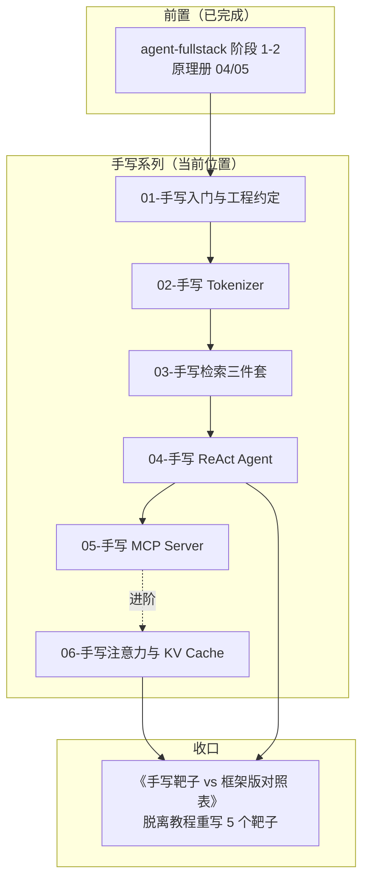

# 手写 AI 最小实现系列 — AI 应用层的源码靶子

> 原理册（machine-learning）用 micrograd / minbpe / nanoGPT 当靶子，本册给**应用层**配一套对应的「手写靶子」：用最小编码量把 ReAct、RAG、Tokenizer、MCP、KV Cache 这些黑盒拆开重装一遍。全程 TS 主场、Bun 运行、**零第三方 AI 依赖**（工具函数可自写）。

---

## 1. 定位

| 项目 | 内容 |
|------|------|
| 目标读者 | 前端 Leader / 全栈工程师 / Agent 开发工程师（CS 专业，阶段 1 已完成，原理册已上手） |
| 前置要求 | agent-fullstack 阶段 1-2 完成；machine-learning 04/05 至少读完（Tokenizer / 注意力章节）；已读过 01-weather-agent、04-kb-agent 源码 |
| 学习目标 | 面试能答 + 评审能讲：手写过的东西，框架 API 再也不是黑盒；能向框架作者/同事讲清每个机制在做什么 |
| 一句话 | 应用层的 micrograd——每个模块一个「<100 行 TS」靶子，脱离教程重写即合格 |

## 2. 边界声明

| 维度 | ✅ 这是 | ❌ 这不是 |
|------|---------|----------|
| 学习导向 | 拆黑盒 → 重装 → 与框架版对照 | 重新发明框架 |
| 代码定位 | 每篇 ≤100 行、单文件、零依赖、可 `bun test` | 生产级实现 |
| 性能目标 | 正确性优先，N 于小数据集跑通 | 分布式/高并发/工程化 |
| 交付物 | 手写版 vs 框架版**对照表**（行为/边界/性能差异） | 可直接上生产的库 |
| 与现有项目 | 对齐仓库内已有手写实现（re-act.ts、hybrid.ts），先改后写 | 从零凭空造轮子 |
| 卡壳策略 | 2 天搞不懂就对照框架源码（官方实现即参考答案） | 死磕一行实现细节 |

**一句话总结**：用 100 行把应用层的机制拆开、重写、对照，让「用了什么框架」变成「我知道它在干什么」。

## 3. 学习原则（四条铁律）

| # | 原则 | 说明 |
|---|------|------|
| 1 | 每篇一个机制，产出对照表 | 写完一定要和框架版对照：行为差异、边界差异、性能差异，落成表格 |
| 2 | 零依赖自写 | 工具函数自己写（json parse 除外）；写完才允许对照官方 SDK 源码 |
| 3 | 复用仓库靶子 | 先读已有手写实现（weather-agent 的 re-act.ts、kb-agent 的 RRF），在它基础上演进，不重复造 |
| 4 | 单文件可测 | 每篇一个 `.ts` + 一个 `.test.ts`，`bun test` 绿了才算过 |

> 🚧 红线：手写不是目的，**对照 + 讲清取舍**才是。写到一半发现框架做了你没想过的事，记下来——那才是收获。

## 4. 学习路径图

## 5. 模块规划总览

| 序号 | 模块 | 层 | 一句话定位 | 源码靶子 | 验收产出 | 前置 |
|------|------|----|-----------|---------|---------|------|
| 01 | 手写入门与工程约定 | 认知层 | 约定靶子长什么样、怎么对照框架、验收标准 | — | 一台 `bun test` 环境 + 靶子模板 | agent-fullstack 1-2 |
| 02 | 手写 Tokenizer | 领域层 | 字符级 → BPE，<100 行让「分词」变透明 | minbpe / tiktoken（读 TS 生态对照） | 自写 BPE 编码与解码通过用例 | 01 |
| 03 | 手写检索三件套 | 检索层 | BM25 / 余弦 top-k / RRF 融合，对接 04-kb-agent | 04-kb-agent 的 `hybrid.ts`（已有实现） | 三件套各 ≤100 行，RRF 输出对齐 kb-agent | 01 |
| 04 | 手写 ReAct Agent | Agent 层 | JSON 工具调用循环 + 结构化输出约束 | 01-weather-agent 的 `re-act.ts`（已有实现） | 带 2 个工具的可运行循环，对照 createAgent | 03 |
| 05 | 手写 MCP Server | 协议层 | 标准 C/S：initialize → tools/list → tools/call | `@modelcontextprotocol/sdk` 源码 | 自写 stdio server 被官方 Client 连上 | 04 |
| 06 | 手写注意力与 KV Cache | 进阶层（可选） | 单头注意力 + KV cache 加速，读懂 nanoGPT 心脏 | microgpt TS 移植版 | 手写 prefill + decode，对比两阶段耗时 | 04、原理册 05-2/05-3 |

## 6. 模块详解

> 两级结构：模块为契约单元；「篇目拆分」为写作单元，每篇落盘 `doc/NN-模块名/01-xxx.md`，与原理册/agent-fullstack 惯例对齐。

### 01-手写入门与工程约定（认知层）

| 要素 | 内容 |
|------|------|
| 一句话定位 | 回答「手写系列是什么、怎么写、怎么算过关」，建立《对照表》模板 |
| 预计时间 | 1-2 天 |
| 核心知识点 | 靶子三要素（最小案例 / 参照实现 / 对照表）；零依赖纪律；`bun test` 环境（bun + vitest）；对照表维度（行为 / 边界 / 性能 / API 差异） |
| 源码靶子 | 仓库内 01-weather-agent / 04-kb-agent 的目录结构 |
| 篇目拆分 | 01-1 手写入门与《对照表》模板 |
| 验收产出 | 一份空《对照表》模板 + 可跑的 `bun test` 骨架 |

### 02-手写 Tokenizer（领域层）

| 要素 | 内容 |
|------|------|
| 一句话定位 | 字符级 → BPE 全流程 ≤100 行，让「Machines don't read, tokenizers do」变直觉 |
| 预计时间 | 3-4 天 |
| 核心知识点 | 字符级编码与 Unicode 处理；BPE 训练（pair 统计、merge 规则）；编码/解码循环；特殊 token 与 vocab 边界；与 minbpe / tiktoken 的对照点（word piece vs BPE、正则预分词） |
| 源码靶子 | minbpe / tiktoken（对照输出而非抄写）；原理册 04-1 已读 |
| 最小案例 | 中文/英文混合小语料训练 200 步，输出 vocab + encode/decode 往返一致 |
| 篇目拆分 | 02-1 字符级到 BPE（训练 + 编解码） |
| 面试问答 | ①BPE 怎么解决 OOV；②为什么 token 切分影响成本与幻觉 |
| 验收产出 | `bun test` 通过：往返一致 + 与参考 tokenizer 在样例上 token 序列相似 |

### 03-手写检索三件套（检索层）

| 要素 | 内容 |
|------|------|
| 一句话定位 | BM25 + 余弦 top-k + RRF，三件各 ≤100 行，与 04-kb-agent 的检索链路对齐 |
| 预计时间 | 4-5 天 |
| 核心知识点 | 倒排索引与 BM25 公式（IDF 直觉）；TF/余弦相似度与归一化；暴力 top-k 与（可选）简单 ANN 直觉；RRF 融合（`score = Σ 1/(k+rank)`）；与 kb-agent 的 dense+keyword 双通道结构对照 |
| 源码靶子 | 04-kb-agent `src/service/retrieval/hybrid.ts`（已有 RRF 实现，先读后写） |
| 最小案例 | 100 条假文档库上跑 3 条查询，输出 dense / keyword / RRF 融合三个列表 |
| 篇目拆分 | 03-1 BM25 与语义检索（词法通道）；03-2 向量通道与 RRF 融合 |
| 面试问答 | ①为什么混合检索比单一通道稳；②RRF 为什么不用分数而用排名 |
| 验收产出 | 三件套可测；RRF 融合结果与 kb-agent 在相同语料上一致（或记录差异原因） |

### 04-手写 ReAct Agent（Agent 层）

| 要素 | 内容 |
|------|------|
| 一句话定位 | 用「LLM 输出 JSON 工具调用」实现一个 ReAct 循环，看清 Agent 框架替你做了什么 |
| 预计时间 | 4-5 天 |
| 核心知识点 | 工具 schema 与注册表；prompt → JSON 输出 → 解析 → 工具执行 → 结果回填的循环；max_iterations 与终止条件；结构化输出约束（JSON 校验 + 重试 1 次）与「只输出合法 JSON」任务（呼应原理册 05-1）；与 LangChain `createAgent` 的行为对照（工具调用协议、错误处理） |
| 源码靶子 | 01-weather-agent `src/agent/re-act/re-act.ts`（已有实现，先读后写） |
| 最小案例 | 1 个查询工具 + 1 个计算工具，跑通 3 轮以内的多步任务 |
| 篇目拆分 | 04-1 手写 ReAct 循环与工具系统；04-2 结构化输出约束与对照（可选） |
| 面试问答 | ①function calling 到底是什么机制；②为什么工具结果要回填到上下文 |
| 验收产出 | 可运行循环 + 与 createAgent 跑同一任务的行为/输出对照表 |

### 05-手写 MCP Server（协议层）

| 要素 | 内容 |
|------|------|
| 一句话定位 | 手写一个 stdio MCP Server：initialize → tools/list → tools/call 三跳握手，协议透明 |
| 预计时间 | 4-5 天 |
| 核心知识点 | JSON-RPC 2.0 消息格式；MCP 生命周期（initialize / initialized / tools.list / tools.call）；stdio transport（stdin 读、stdout 写，协议约定）；工具参数 schema（对齐 MCP 官方 types）；与 `@modelcontextprotocol/sdk` 的对照（你省掉了什么） |
| 源码靶子 | `@modelcontextprotocol/sdk`（读 TypeScript 源码对照） |
| 最小案例 | `bun run server.ts` 起服务，被官方 `mcp` CLI 或 Client SDK 连接并调用一个工具 |
| 篇目拆分 | 05-1 手写 MCP Server（stdio + 三跳握手）；05-2 tools 实现与 Client 接入（可选） |
| 面试问答 | ①MCP 和 function calling 的关系；②stdio vs SSE transport 差别 |
| 验收产出 | 官方 Client 能握手 + 调用工具；写出「手写 vs SDK」对照表 |

### 06-手写注意力与 KV Cache（进阶层 · 可选）

| 要素 | 内容 |
|------|------|
| 一句话定位 | 单头注意力 + KV cache 加速的 <100 行实现，读懂 nanoGPT 心脏（呼应原理册 05-2/05-3） |
| 预计时间 | 3-4 天 |
| 核心知识点 | QKV 投影直觉、softmax 注意力、因果掩码（矩阵实现）；缓存 K/V 使 decode 复用 prefill 结果；两阶段耗时对比（prefill vs decode）；与微模型模型权重人工设定、跑通前向 |
| 源码靶子 | microgpt TS 移植版（bun 单文件、零依赖）；原理册 05-2/05-3 |
| 最小案例 | 固定小权重单头 attention，加 KV cache 前后 decode 每个新 token 的矩阵乘法量做对比 |
| 面试问答 | ①KV Cache 为什么能省算力；②上下文长度与 memory 的关系 |
| 验收产出 | prefill/decode 两阶段跑通 + 理论计算量 vs 实测对比表 |

## 7. 练习递进线

| 层级 | 覆盖模块 | 能力 | 样例 |
|------|---------|------|------|
| L1 复刻 | 02-03 | 照源码靶子写通 | BPE 往返一致、RRF 输出对齐 kb-agent |
| L2 独立 | 04 | 不看靶子从接口定义写起 | 手写 ReAct 循环 |
| L3 协议 | 05-06 | 写可与外部系统互操作的实现 | 官方 Client 连上你的 MCP Server |

## 8. 面试覆盖图

| 高频面试点 | 覆盖模块 |
|-----------|---------|
| BPE 怎么解决 OOV、token 成本 | 02 |
| RAG 为什么用混合检索、RRF 原理 | 03 |
| function calling 机制、工具循环 | 04 |
| MCP 协议与 function calling 关系 | 05 |
| KV Cache 原理（呼应原理册） | 06 |

## 9. 学习深度边界

| 学到什么程度 | 不学什么 |
|-------------|---------|
| BPE 训练/编码解码全流程 | tiktoken 的正则预分词细节、字节级 BPE 全量实现 |
| BM25 / 余弦 / RRF 各 ≤100 行 | ANN 索引（HNSW/IVF）工程实现 |
| ReAct 循环 + JSON 约束重试 | 复杂 agent 状态机、并发工具执行、schedule 编排 |
| MCP 协议三跳 + stdio transport | SSE/HTTP transport 全实现、能力协商扩展点 |
| 单头注意力 + KV cache 前向 | 多头/Flash Attention、训练、反向传播 |
| 与框架版对照写差异 | 给框架写 PR、复刻框架全部功能 |

## 10. 预估周期（每天 1-2 小时）

| 模块 | 预估 |
|------|------|
| 01-手写入门与工程约定 | 1-2 天 |
| 02-手写 Tokenizer | 3-4 天 |
| 03-手写检索三件套 | 4-5 天 |
| 04-手写 ReAct Agent | 4-5 天 |
| 05-手写 MCP Server | 4-5 天 |
| 06-手写注意力与 KV Cache（可选） | 3-4 天 |

主线合计约 4-5 周，加 06 约 5-6 周。

## 11. 参考链接（一级来源）

- [minbpe（BPE 实现）](https://github.com/karpathy/minbpe)
- [tiktoken（OpenAI 官方）](https://github.com/openai/tiktoken)
- [microgpt TS 移植版（bun 单文件、零依赖）](https://gist.github.com/snoblenet/7739055e32bffb81277b6a08d33a37ef)
- [@modelcontextprotocol/sdk（MCP 官方 TS SDK）](https://github.com/modelcontextprotocol/typescript-sdk)
- [MCP 规范（protocol spec）](https://modelcontextprotocol.io/specification)
- 仓库内已读靶子：`agent/agent-fullstack/projects/01-weather-agent/src/agent/re-act/re-act.ts`、`agent/agent-fullstack/projects/04-kb-agent`（检索 / 混合检索 / RRF）

## 12. 与本库其他册子的关系

| 维度 | 原理册（machine-learning） | 本册（handcrafted） | 应用册（agent-fullstack） |
|------|--------------------------|--------------------|---------------------------|
| 目标 | 懂原理、能解释 | 手写过、能重装 | 会落地、能做产品 |
| 靶子 | micrograd / minbpe / nanoGPT | 应用层机制的手写实现 | 完整可运行项目 |
| 输出 | 原理理解 | 对照表 + 可跑单文件 | 可上线的应用 |
| 关系 | **前置** | **当前位置** | 阶段 1-2 已完成，后续阶段推进 |

> 学完的形态：面试问 Agent 原理能讲、评审能讲清取舍、遇到框架 bug 敢读源码。手写，是唯一能把「会用」变成「懂」的路径。