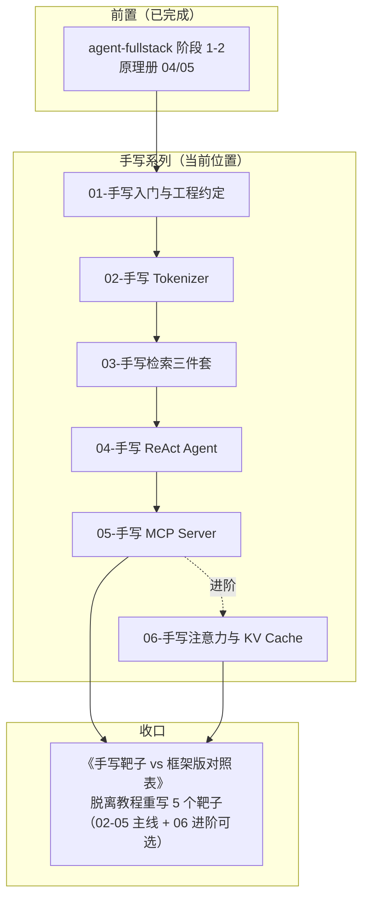

# 手写 AI 最小实现系列 — AI 应用层的源码靶子

> 原理册（machine-learning）用 micrograd / minbpe / nanoGPT 当靶子，本册给**应用层**配一套对应的「手写靶子」：用最小编码量把 ReAct、RAG、Tokenizer、MCP、KV Cache 这些黑盒拆开重装一遍。全程 TS 主场、Bun 运行、**实现零第三方 AI 依赖**（工具函数可自写，`JSON.parse` 除外；对照与测试侧允许官方 SDK 作 devDependency，见 §2 边界声明）。

---

## 1. 定位

| 项目 | 内容 |
|------|------|
| 目标读者 | 前端 Leader / 全栈工程师 / Agent 开发工程师（CS 专业，阶段 1 已完成，原理册已上手） |
| 前置要求 | agent-fullstack 阶段 1-2 完成；machine-learning 04/05 至少读完（Tokenizer / 注意力章节）；已读过 01-weather-agent 源码、04-kb-agent 设计文档（README §6.2 / todo Phase 3.2） |
| 学习目标 | 面试能答 + 评审能讲：手写过的东西，框架 API 再也不是黑盒；能向框架作者/同事讲清每个机制在做什么 |
| 一句话 | 应用层的 micrograd——每个模块一个「<100 行 TS」靶子，脱离教程重写即合格 |

## 2. 边界声明

| 维度 | ✅ 这是 | ❌ 这不是 |
|------|---------|----------|
| 学习导向 | 拆黑盒 → 重装 → 与框架版对照 | 重新发明框架 |
| 代码定位 | 每篇 ≤100 行、单文件、零依赖、可 `bun test` | 生产级实现 |
| 性能目标 | 正确性优先，示例均在小数据集跑通 | 分布式/高并发/工程化 |
| 依赖边界 | **实现侧零第三方 AI 依赖**（工具函数自写，`JSON.parse` 等语言内置除外） | 实现侧引入官方 SDK |
| 对照边界 | **对照/测试侧允许**官方 SDK 作 devDependency（MCP Client、tiktoken、langchain 等），仅用于对照与验收 | 对照成果混入手写实现 |
| 交付物 | 手写版 vs 框架版**对照表**（行为/边界/性能差异） | 可直接上生产的库 |
| 与现有项目 | 对齐仓库内已有实现（01-weather-agent 的 `re-act.ts`）与设计约定（04-kb-agent README 的 RRF 设计：`rrf_k=60`）；先改后写 | 从零凭空造轮子 |
| 卡壳策略 | 2 天搞不懂就对照框架源码（官方实现即参考答案） | 死磕一行实现细节 |

**一句话总结**：用 100 行把应用层的机制拆开、重写、对照，让「用了什么框架」变成「我知道它在干什么」。

## 3. 学习原则（四条铁律）

| # | 原则 | 说明 |
|---|------|------|
| 1 | 每篇一个机制，产出对照表 | 写完一定要和框架版对照：行为差异、边界差异、性能差异，落成表格 |
| 2 | 零依赖自写 | 工具函数自己写（`JSON.parse` 除外）；写完才允许对照官方 SDK 源码；对照/测试侧的 devDependency 不算破戒（见 §2） |
| 3 | 复用仓库靶子 | 先读已有实现/设计：weather-agent 的 `re-act.ts`、kb-agent README 的 RRF 设计，在它基础上演进，不重复造 |
| 4 | 单文件可测 | 每篇内嵌一个 `.ts` + 一个 `.test.ts` 的完整代码，`bun test` 绿了才算过 |

> 🚧 红线：手写不是目的，**对照 + 讲清取舍**才是。写到一半发现框架做了你没想过的事，记下来——那才是收获。

## 4. 学习路径图

## 5. 模块规划总览

| 序号 | 模块 | 层 | 一句话定位 | 源码靶子 | 验收产出 | 前置 |
|------|------|----|-----------|---------|---------|------|
| 01 | 手写入门与工程约定 | 认知层 | 约定靶子长什么样、怎么对照框架、验收标准 | — | 一套 `bun test` 工程骨架 + 空《对照表》模板 | agent-fullstack 1-2 |
| 02 | 手写 Tokenizer | 领域层 | 字符级 → BPE，<100 行让「分词」变透明 | minbpe / tiktoken（读 TS 生态对照） | 自写 BPE 编码与解码通过用例 | 01 |
| 03 | 手写检索三件套 | 检索层 | BM25 / 余弦 top-k / RRF 融合，对接 04-kb-agent 检索设计 | 04-kb-agent README §6.2 / todo 3.2（RRF 设计，实现未落地，以设计约定为准） | 三件套各 ≤100 行，RRF 输出对齐 `rrf_k=60` 约定 | 01 |
| 04 | 手写 ReAct Agent | Agent 层 | JSON 工具调用循环 + 结构化输出约束 | 01-weather-agent 的 `re-act.ts`（已有实现） | 带 2 个工具的可运行循环，对照 createAgent | 03 |
| 05 | 手写 MCP Server | 协议层 | 标准 C/S：initialize → tools/list → tools/call | `@modelcontextprotocol/sdk` 源码 | 自写 stdio server 被官方 Client 连上 | 04 |
| 06 | 手写注意力与 KV Cache | 进阶层（可选） | 单头注意力 + KV cache 加速，读懂 nanoGPT 心脏 | microgpt TS 移植版 | 手写 prefill + decode，对比两阶段耗时 | 04-05、原理册 05-2/05-3 |

## 6. 模块详解

> 两级结构：模块为契约单元（含练习 / 面试 / 验收）；「篇目拆分」为写作单元，每篇落盘 `doc/NN-模块名/01-xxx.md`（如 `doc/02-手写Tokenizer/01-字符级到BPE.md`），与原理册/agent-fullstack 惯例对齐。**代码直接内嵌于文档**（零依赖、`bun` 可跑），模块 01 的验收同步落盘工程骨架 `code/`（package.json + tsconfig），此后每篇的 `.ts` / `.test.ts` 按 `code/NN-篇目/` 归位，`bun test` 绿了才算过。前置列中的 `M-P` 指「第 M 模块第 P 篇」。

### 01-手写入门与工程约定（认知层）

| 要素 | 内容 |
|------|------|
| 一句话定位 | 回答「手写系列是什么、怎么写、怎么算过关」，建立《对照表》模板与 runnable 骨架 |
| 预计时间 | 1-2 天 |
| 核心知识点 | 靶子三要素（最小案例 / 参照实现 / 对照表）；零依赖纪律与依赖边界（实现 vs 对照/测试）；`bun test` 环境（bun 内置 runner + strict TS）；对照表维度（行为 / 边界 / 性能 / API 差异） |
| 源码靶子 | 01-weather-agent `src/agent/re-act/`、04-kb-agent README 的目录结构与设计 |
| 最小案例 | 一个空测试跑绿 + 一页空《对照表》模板 |
| 练习 | 要求：按本篇清单搭好 `bun test` 骨架，跑通一个真实断言；并用「手写 vs 框架版」两栏把《对照表》模板建好。提示：表头先预填「行为 / 边界 / 性能 / API」四维，案例先用 §2 的 BPE 往返当首行实测数据。预期：骨架绿 + 模板可直接被模块 02 复用 |
| 面试问答 | ①手写系列和直接读框架源码有什么不同。示范：问：手写一遍和读框架源码有什么区别？答：读源码是被动跟随作者的取舍，手写是先定接口再实现、最后和官方对照——你写出来的行为和官方不一致的地方，才是最大的学习点 |
| 对比板块 | 本册（手写 + 对照）vs 原理册（读源码 + 解释原理）vs agent-fullstack（直接用框架）的角色分工 |
| 参考链接 | — |
| 验收产出 | 一套可跑 `bun test` 的骨架 + 一份可用一整册的空《对照表》模板 |

**篇目拆分**

| 篇 | 篇名 | 一句话定位 | 前置 | 靶子 |
|----|------|-----------|------|------|
| 01-1 | 手写入门与《对照表》模板 | 回答「是什么、怎么写、怎么算过关」；搭环境 + 建模板 | 无 | 01-weather-agent `re-act.ts`（走读） |

### 02-手写 Tokenizer（领域层）

| 要素 | 内容 |
|------|------|
| 一句话定位 | 字符级 → BPE 全流程 ≤100 行，让「Machines don't read, tokenizers do」变直觉 |
| 预计时间 | 3-4 天 |
| 核心知识点 | 字符级编码与 Unicode 处理（中文 3 字节）；BPE 训练（pair 统计、merge 规则、嵌套合并）；编码/解码循环（编解码对称 = 可逆）；special token 与 vocab 边界；与 minbpe / tiktoken 的对照点（word piece vs BPE、正则预分词） |
| 源码靶子 | minbpe / tiktoken（对照输出而非抄写）；原理册 04-1 已读 |
| 最小案例 | 中文/英文混合小语料训练 200 步，输出 vocab + encode/decode 往返一致 |
| 练习 | 要求：在 §3 的 TS 版 BPE 上做三组对照：①换语料（中英混合 200 步观察合并顺序）；②改词表大小对比 encode 的 token 数（切细 vs 切粗）；③用训练时没见过的文本 encode/decode 验证可逆不抛错。提示：中文 UTF-8 是 3 字节，前几轮大概率合并高频词/字；decode 必须按 merge 表反向还原，不能按字符猜。预期：往返一致 + 能用「字节兜底 + 频率驱动」讲清 BPE 无 OOV |
| 面试问答 | ①BPE 怎么解决 OOV；②为什么 token 切分影响成本与幻觉。示范：问：BPE 怎么消除 OOV？答：词表以 256 个 UTF-8 字节打底，任何文本都能拆成字节所以永远有 id；高频相邻子串被逐轮合并成整 token，低频词碎片化——OOV 从「无解」变成「可量化的碎片化」 |
| 对比板块 | 本技术：手写 BPE vs 参照实现 minbpe（Python）/ tiktoken（官方）vs 基线：字符级与词级切分（行为/成本差异） |
| 参考链接 | [minbpe](https://github.com/karpathy/minbpe) / [tiktoken](https://github.com/openai/tiktoken)；原理册 04-1《分词与 BPE》 |
| 验收产出 | `bun test` 通过：往返一致 + 与参考 tokenizer 在样例上 token 序列相似 |

**篇目拆分**

| 篇 | 篇名 | 一句话定位 | 前置 | 靶子 |
|----|------|-----------|------|------|
| 02-1 | 字符级到 BPE（训练 + 编解码） | 全流程：UTF-8 字节 → pair 统计 → merge → encode/decode 对称 | 01-1 | minbpe / tiktoken |

### 03-手写检索三件套（检索层）

| 要素 | 内容 |
|------|------|
| 一句话定位 | BM25 + 余弦 top-k + RRF，三件各 ≤100 行，与 04-kb-agent 的检索链路设计对齐 |
| 预计时间 | 4-5 天 |
| 核心知识点 | 倒排索引与 BM25 公式（IDF 直觉、k1/b 超参）；cosine 相似度与归一化；暴力 top-k；RRF 融合（`score = Σ 1/(k+rank)`，对齐 kb-agent 的 `rrf_k=60`）；与 kb-agent dense+keyword 双通道设计（README §6.2）对照 |
| 源码靶子 | 04-kb-agent README §6.2 / todo Phase 3.2（RRF 设计：两通道 top-10、`rrf_k=60`、top-5；实现未落地，以设计约定 + 公式为准） |
| 最小案例 | 100 条假文档库上跑 3 条查询，输出 dense / keyword / RRF 融合三个列表 |
| 练习 | 要求：①BM25 至少对 1 条结果手算核对分数；②同一查询跑 dense / keyword / RRF 三条通道输出对照表；③改 `rrf_k`（60 → 10 / 100）观察排序变化并解释。提示：dense 通道用假 embedding（词袋 → 归一化向量）即可，链路重点在融合逻辑；RRF 不用分数用排名，改 k 影响的是「第几名开始权重衰减」。预期：能解释为什么混合检索比单一通道稳、RRF 为什么用排名不用分数 |
| 面试问答 | ①为什么混合检索比单一通道稳；②RRF 为什么不用分数而用排名。示范：问：混合检索为什么稳？答：dense 管「换说法也能命中」的语义近似，keyword 管「API 名/参数名精确命中」；单一通道在自己不擅长的场景失效。RRF 用排名第几个融合（`Σ1/(k+rank)`），规避两路分数量纲不可比的问题 |
| 对比板块 | 本技术：手写三件套 vs 04-kb-agent 设计（PG FTS + Qdrant dense + RRF）vs 基线：纯 dense / 纯 keyword（各自失败模式） |
| 参考链接 | 04-kb-agent README §6.2（混合检索与 RRF）；原理册 04-2/04-3（Embedding 与检索失败模式） |
| 验收产出 | 三件套可测；RRF 融合结果与 kb-agent 设计约定（`rrf_k=60`）一致（或记录差异原因） |

**篇目拆分**

| 篇 | 篇名 | 一句话定位 | 前置 | 靶子 |
|----|------|-----------|------|------|
| 03-1 | BM25 与词法检索 | 倒排索引 + BM25 打分 ≤100 行，理解「字面命中」通道 | 01-1 | kb-agent 设计文档 |
| 03-2 | 向量通道与 RRF 融合 | 余弦 top-k（假 embedding）+ RRF 融合，对齐 `rrf_k=60` | 03-1 | kb-agent 设计文档 |

### 04-手写 ReAct Agent（Agent 层）

| 要素 | 内容 |
|------|------|
| 一句话定位 | 用「LLM 输出 JSON 工具调用」实现一个 ReAct 循环，看清 Agent 框架替你做了什么 |
| 预计时间 | 4-5 天 |
| 核心知识点 | 工具 schema 与注册表；prompt → JSON 输出 → 解析 → 工具执行 → 结果回填的循环；max_iterations 与终止条件；结构化输出约束（JSON 校验 + 重试 1 次）；将 LLM 抽象为可注入函数（测试用 mock 预置 JSON）；与 LangChain `createAgent` 的行为对照（工具调用协议、错误处理，对照侧允许 langchain devDependency） |
| 源码靶子 | 01-weather-agent `src/agent/re-act/re-act.ts`（已有实现，先读后写） |
| 最小案例 | 1 个查询工具 + 1 个计算工具，跑通 3 轮以内的多步任务 |
| 练习 | 要求：带 2 个工具跑通一个 3 轮内多步任务；故意让 mock LLM 输出一次非法 JSON，验证「校验 + 重试 1 次」后恢复而不是崩溃。提示：把 LLM 调用收口成 `llm(messages)` 接口，测试才能注入 mock；重试次数计数要防死循环。预期：循环可跑 + 非法 JSON 不崩 + 能讲清工具结果为什么要回填上下文 |
| 面试问答 | ①function calling 到底是什么机制；②为什么工具结果要回填到上下文。示范：问：function calling 是什么？答：本质是「LLM 按约定 schema 输出 JSON 工具调用」+ 宿主循环（解析、执行、回填、再让模型生成）；框架替你做了 schema 注入、消息编排、错误重试与循环控制，手写一遍就知道每层发生了什么 |
| 对比板块 | 本技术：手写 ReAct 循环 vs 01-weather-agent `re-act.ts` vs LangChain `createAgent`（行为/错误处理/多轮协议差异） |
| 参考链接 | [ReAct 论文](https://arxiv.org/abs/2210.03629)；01-weather-agent `re-act.ts`；agent-fullstack doc 02-01《LangChain.js架构概览》（createAgent） |
| 验收产出 | 可运行循环 + 与 createAgent 跑同一任务的行为/输出对照表 |

**篇目拆分**

| 篇 | 篇名 | 一句话定位 | 前置 | 靶子 |
|----|------|-----------|------|------|
| 04-1 | 手写 ReAct 循环与工具系统 | 循环 + 工具注册表 + max_iterations 收口 | 03-2 | 01-weather-agent `re-act.ts` |
| 04-2 | 结构化输出约束与对照（可选） | JSON 校验 + 重试 1 次，与 createAgent 的行为对照 | 04-1 | langchain（对照侧） |

### 05-手写 MCP Server（协议层）

| 要素 | 内容 |
|------|------|
| 一句话定位 | 手写一个 stdio MCP Server：initialize → tools/list → tools/call 三跳握手，协议透明 |
| 预计时间 | 4-5 天 |
| 核心知识点 | JSON-RPC 2.0 消息格式；MCP 生命周期（initialize / initialized / notifications / tools.list / tools.call）；stdio transport（stdin 读一行 JSON、stdout 写一行 JSON，只有协议消息）；工具参数 schema（对齐 MCP 官方 types）；与 `@modelcontextprotocol/sdk` 的对照（你省掉了什么：版本协商、能力协商、错误码、SSE/HTTP 等） |
| 源码靶子 | `@modelcontextprotocol/sdk`（读 TypeScript 源码对照；测试侧允许装官方 SDK 与 `mcp` CLI 作 Client） |
| 最小案例 | `bun run server.ts` 起服务，先被**自写 mock client** 握手（验证协议），再被官方 `mcp` CLI 或 Client SDK 连接并调用一个工具 |
| 练习 | 要求：①自写 20 行 mock client 完成 initialize → tools/list → tools/call 三跳，打印收到的 JSON-RPC 消息；②装官方 `mcp` CLI 或 Client SDK 连同一个 server 验证互通。提示：stdio 行协议 = 每行一条 JSON-RPC；stdout 只允许协议消息，日志要写 stderr。预期：官方 Client 能握手 + 调用工具 + 「手写 vs SDK」对照表成文 |
| 面试问答 | ①MCP 和 function calling 的关系；②stdio vs SSE transport 差别。示范：问：MCP 和 function calling 什么关系？答：function calling 是单进程内「模型 ↔ 宿主」的调用约定；MCP 把工具暴露成标准 C/S 协议（JSON-RPC），让宿主与外部工具服务解耦、动态发现工具——一个函数 vs 一套可发现的工具服务 |
| 对比板块 | 本技术：手写 stdio server vs `@modelcontextprotocol/sdk`（省掉了什么、行为差异）vs 基线：直接 function calling（无协议层） |
| 参考链接 | [MCP 规范](https://modelcontextprotocol.io/specification)；[@modelcontextprotocol/typescript-sdk](https://github.com/modelcontextprotocol/typescript-sdk) |
| 验收产出 | 官方 Client 能握手 + 调用工具；写出「手写 vs SDK」对照表 |

**篇目拆分**

| 篇 | 篇名 | 一句话定位 | 前置 | 靶子 |
|----|------|-----------|------|------|
| 05-1 | 手写 MCP Server（stdio + 三跳握手） | JSON-RPC 格式 + 生命周期 + stdio transport | 04-1 | `@modelcontextprotocol/sdk` |
| 05-2 | tools 实现与 Client 接入（可选） | 工具 schema 对齐官方 types；自写 mock client + 官方 Client 双验证 | 05-1 | 同上 |

### 06-手写注意力与 KV Cache（进阶层 · 可选）

| 要素 | 内容 |
|------|------|
| 一句话定位 | 单头注意力 + KV cache 加速的 <100 行实现，读懂 nanoGPT 心脏（呼应原理册 05-2/05-3） |
| 预计时间 | 3-4 天 |
| 核心知识点 | QKV 投影直觉、softmax 注意力、因果掩码（矩阵实现）；缓存 K/V 使 decode 复用 prefill 结果；prefill vs decode 两阶段的矩阵乘法量对比（理论 vs 实测）；固定小权重人工设定、跑通前向 |
| 源码靶子 | microgpt TS 移植版（bun 单文件、零依赖）；原理册 05-2/05-3 |
| 最小案例 | 固定小权重单头 attention，加 KV cache 前后对比 decode 每个新 token 的矩阵乘法量 |
| 练习 | 要求：固定小权重跑 prefill + 每次 decode，统计并记录「理论矩阵乘法量 vs 实测耗时」对照表；轮流把 K/V 缓存清掉对比耗时。提示：decode 阶段 Q 投影仍要全量算，KV cache 省的是 K/V 的重复计算——上下文越长省得越多。预期：能解释「为什么预填充慢、生成快」与「上下文越长 decode 越快」 |
| 面试问答 | ①KV Cache 为什么能省算力；②上下文长度与 memory 的关系。示范：问：KV Cache 为什么省算力？答：注意力里每个 token 的 K/V 只依赖该 token 自己、与后续 token 无关，decode 可直接复用 prefill 算好的 K/V，省掉重复的矩阵乘法；上下文越长、复用的 K/V 越多，所以生成阶段每 token 计算量基本恒定 |
| 对比板块 | 本技术：手写单头 + KV cache vs microgpt TS 移植版 vs 原理册 05-3 的推理成本分析（行为/计算量对照） |
| 参考链接 | [microgpt TS 移植版（bun 单文件、零依赖）](https://gist.github.com/snoblenet/7739055e32bffb81277b6a08d33a37ef)；原理册 05-2《注意力与位置编码》/ 05-3《上下文窗口与 KV-Cache》 |
| 验收产出 | prefill/decode 两阶段跑通 + 理论计算量 vs 实测对比表 |

**篇目拆分**

| 篇 | 篇名 | 一句话定位 | 前置 | 靶子 |
|----|------|-----------|------|------|
| 06-1 | 单头注意力与 KV Cache | prefill + decode 两阶段实现，KV cache 前后计算量对比 | 05-1、原理册 05-2/05-3 | microgpt TS 移植版 |

## 7. 练习递进线

| 层级 | 覆盖模块 | 能力 | 样例 |
|------|---------|------|------|
| L1 复刻 | 02-03 | 照公式/设计文档写通 | BPE 往返一致、RRF 输出对齐 `rrf_k=60` |
| L2 独立 | 04 | 不看靶子从接口定义写起 | 手写 ReAct 循环（含非法 JSON 重试） |
| L3 协议 | 05-06 | 写可与外部系统互操作的实现 | 官方 Client 连上你的 MCP Server |

## 8. 面试覆盖图

| 高频面试点 | 覆盖模块 |
|-----------|---------|
| BPE 怎么解决 OOV、token 成本 | 02 |
| RAG 为什么用混合检索、RRF 原理 | 03 |
| function calling 机制、工具循环 | 04 |
| MCP 协议与 function calling 关系 | 05 |
| KV Cache 原理（呼应原理册） | 06 |

> 写作期规范：各模块「面试问答」的内容在正式文档中统一用 `> **问：**` / `> **答：**` 模板展开（本大纲已在各模块附 1 条示范，其余按同风格补全）；每个模块文末须含「练习（要求/提示/预期）」与「对比板块」两节。

## 9. 学习深度边界

| 学到什么程度 | 不学什么 |
|-------------|---------|
| BPE 训练/编码解码全流程 | tiktoken 的正则预分词细节、字节级 BPE 全量实现 |
| BM25 / 余弦 / RRF 各 ≤100 行 | ANN 索引（HNSW/IVF）工程实现 |
| ReAct 循环 + JSON 约束重试 | 复杂 agent 状态机、并发工具执行、schedule 编排 |
| MCP 协议三跳 + stdio transport | SSE/HTTP transport 全实现、能力协商扩展点 |
| 单头注意力 + KV cache 前向 | 多头/Flash Attention、训练、反向传播 |
| 与框架版对照写差异 | 给框架写 PR、复刻框架全部功能 |

## 10. 预估周期（每天 1-2 小时）

| 模块 | 预估 |
|------|------|
| 01-手写入门与工程约定 | 1-2 天 |
| 02-手写 Tokenizer | 3-4 天 |
| 03-手写检索三件套 | 4-5 天 |
| 04-手写 ReAct Agent | 4-5 天 |
| 05-手写 MCP Server | 4-5 天 |
| 06-手写注意力与 KV Cache（可选） | 3-4 天 |

主线合计约 4-5 周，加 06 约 5-6 周。

## 11. 参考链接（一级来源）

- [minbpe（BPE 实现）](https://github.com/karpathy/minbpe)
- [tiktoken（OpenAI 官方）](https://github.com/openai/tiktoken)
- [microgpt TS 移植版（bun 单文件、零依赖）](https://gist.github.com/snoblenet/7739055e32bffb81277b6a08d33a37ef)
- [@modelcontextprotocol/sdk（MCP 官方 TS SDK）](https://github.com/modelcontextprotocol/typescript-sdk)
- [MCP 规范（protocol spec）](https://modelcontextprotocol.io/specification)
- [ReAct 论文（Reasoning and Acting with LLMs）](https://arxiv.org/abs/2210.03629)
- 仓库内已读靶子：`agent/agent-fullstack/projects/01-weather-agent/src/agent/re-act/re-act.ts`（已有实现）；`agent/agent-fullstack/projects/04-kb-agent` README §6.2 / todo Phase 3.2（RRF 检索设计，实现未落地，对照以设计约定为准）

## 12. 与本库其他册子的关系

| 维度 | 原理册（machine-learning） | 本册（handcrafted） | 应用册（agent-fullstack） |
|------|--------------------------|--------------------|---------------------------|
| 目标 | 懂原理、能解释 | 手写过、能重装 | 会落地、能做产品 |
| 靶子 | micrograd / minbpe / nanoGPT | 应用层机制的手写实现 | 完整可运行项目 |
| 输出 | 原理理解 | 对照表 + 可跑单文件 | 可上线的应用 |
| 关系 | **前置** | **当前位置** | 阶段 1-2 已完成，后续阶段推进 |

> 学完的形态：面试问 Agent 原理能讲、评审能讲清取舍、遇到框架 bug 敢读源码。手写，是唯一能把「会用」变成「懂」的路径。