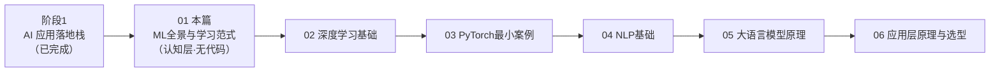
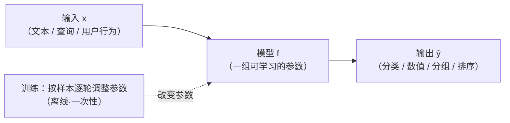
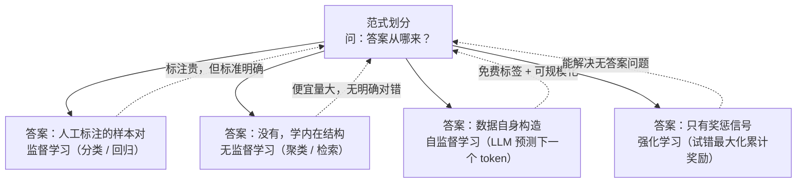
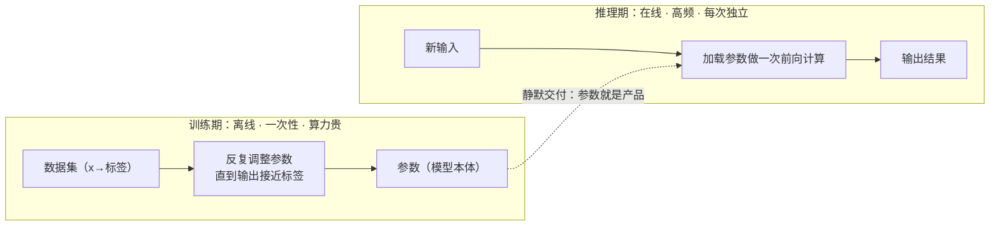

# 01-ML 全景与学习范式

| 元信息 | 内容 |
|------|------|
| 所属模块 | 01-ML全景概览（认知层 · 无代码） |
| 篇目 | 01-1 ML 全景与学习范式（本模块唯一一篇） |
| 预计时间 | 30-60 分钟；连同练习与沉淀共 3-4 天 |
| 前置 | 无（阶段 1「AI 应用落地栈」已完成） |
| 面试可答一句话摘要 | 监督学习用人工标注的答案学映射；无监督学习无答案、学数据里的结构；自监督学习的答案从数据自身构造（LLM 预测下一个 token 就是自监督） |

> **一句话定位**：用一次专注会话建立 ML 全景图，让后续每个模块都能「对号入座」。
> **验收产出**：5 分钟内不用术语，给非技术同事讲清「ML 在学什么、和你的 Agent 有什么关系」。
> **红线**：本模块是认知层，**不写代码**——所有概念用 Mermaid 图表达。

---

## 导读：本篇在整条路线中的位置

你阶段 1 已经搭过 RAG / Agent / LangChain——那是在「消费」AI。本篇开始进入「为什么有效」的一侧，它只负责种一棵全景树：后续的 02 深度学习基础、04 NLP 基础、05 大语言模型原理，都是往这棵树的枝干上挂细节。

本篇五个部分环环相扣：先给「机器学习在学什么」的一句结论（§1），再划分三种学习范式（§2），然后把四类任务落到「模型到底在学什么」（§3），接着讲透训练 vs 推理这条工程分水岭（§4），最后把范式映射回你熟悉的 Agent 工程结构做三角对比（§5），练习与面试问答收尾。

---

## 1. 一句话结论：ML 在学「输入 → 输出」的映射

**机器学习做的事只有一件：从样本中学出一个「输入 → 输出」的映射，并能泛化到没见过的新输入。**

- **映射**：模型就等价于一个函数 $f$，输入是文本 / 图像 / 用户行为等特征，输出是分类标签、数值、分组或排序结果。
- **学习（训练）**：模型是一堆参数，学习 = 根据大量样本反复调整参数，让它的输出越来越接近「期望输出」。
- **泛化**：最终评价不是背下训练样本，而是对没见过的输入也能给出合理输出——这是「学明白了」和「死记硬背」的分界线。

用 Agent 工程师的话说：你阶段 1 调的每一个模型服务（意图分类、Embedding 相似度、LLM 生成），消费的都是别人训练好的 $f$。至于这组参数是怎么调出来的——你会在 02 读懂「训练三件套」、05 读懂 LLM 本身的训练，本篇只建立这张总图。

> 💡 先记住一个判定句式，贯穿全篇：**问「答案从哪来」，就能给任何学习任务分类。**

**为什么不直接手写规则，而要「学习」？** 手写规则在「面熟的模式」上有效——关键词命中、精确匹配、固定格式。但真实输入的组合空间是爆炸的：拼写变体、同义表达、未见语境，每补一类就得加一条规则，规则之间还会互相打架；而「学习」的本质是用样本自动逼近那条边界，对没见过的模式也能给出合理推断。这不是玄学，是「枚举 vs 泛化」的成本结构差异——记住这一点，§5 的三角对比（范式 vs 规则基线）你会立刻看懂。

---

## 2. 三大学习范式（+ 强化学习的一句对比）

范式的划分标准只有一个：**训练数据的「答案」从哪来**。据此分成三类：

### 2.1 监督学习（Supervised Learning）：答案由人工给出

- 训练样本是人工标注的（输入 → 标签）对：邮件文本 → 是否垃圾；意图文本 → 工具名；图片 → 猫/狗。
- 模型要学的是「输入 → 标签」的映射，期望它对**没见过的新输入**也能给对标签。
- 典型任务：分类（标签是离散类别）、回归（输出是连续数值）。
- 成本瓶颈：**标签是人/业务方提供的**，标注贵、更新慢、领域一换要重新标注。这也是数据飞轮的起点。

### 2.2 无监督学习（Unsupervised Learning）：没有答案，学结构

- 训练数据**没有标签**，模型要自己发现数据里的内在结构——通常是「谁和谁相似」。
- 典型任务：聚类（把样本分成若干组）、（向量检索等）度量学习。
- 因为不依赖人工标注，无监督数据通常「量很大、很便宜」；代价是没有明确的标准答案可对照。

### 2.3 自监督学习（Self-Supervised Learning）：答案从数据自身构造

- 介于两者之间：不用人工标注，却像监督学习一样有明确的（输入 → 标签）对——**标签由算法从数据自身切出来**。
- 最典型的例子就是 LLM 的预训练目标：**给定前文，预测下一个 token**。训练集是一堆无标注文本，每个样本的「标签」（下一个 token）就地取材，一分钱标注费都不用花。
- 这就是「为什么 LLM 是自监督的」——2018 年 GPT-1 论文确立的配方：先用语言建模目标在无标注语料上预训练，再按任务微调就能迁移到下游任务（[《Improving Language Understanding by Generative Pre-Training》OpenAI 官方 PDF](https://cdn.openai.com/research-covers/language-unsupervised/language_understanding_paper.pdf)）。

### 2.4 强化学习（Reinforcement Learning）：没有答案，只有奖惩信号

只在本篇给一句定位（完整机制不属于本路线范围，相关深度边界见大纲 §9）：监督/自监督都有「标准答案」，强化学习**没有答案，只有试错**——智能体做动作、环境回一个奖励信号，目标是把累计奖励最大化。它能解决「答案无法标注」的序贯决策问题，也是 LLM 后期对齐（如 RLHF）用到的技术，但不改变「LLM 主体预训练 = 自监督」的事实。

| 范式 | 答案来源 | 在学什么 | 典型任务 | 代价 |
|------|---------|---------|---------|------|
| 监督学习 | 人工标注 | 输入 → 标签的映射 | 分类、回归 | 标注贵、更新慢 |
| 无监督学习 | 无（学结构） | 数据内在结构 | 聚类、检索相似度 | 无标准可对照 |
| 自监督学习 | 数据自身构造 | 通用表示（如语言规律） | LLM 预训练、Embedding | 算力贵（数据量大） |
| 强化学习（对比） | 环境奖惩信号 | 最优行为策略 | 对话对齐（RLHF）、游戏 | 采样成本高 |

---

## 3. 四类任务本质：模型到底在学什么

四种任务名经常出现在简历和文章里，本质只有两种「学习对象」：**学一条边界/曲线**（监督侧），或**学一套相似度**（无监督侧）。

### 3.1 分类（Classification）：学一条决策边界

- 输出是**离散的有限类别**（垃圾/正常、意图 A/B/C）。
- 模型学的是在特征空间里画出若干条边界，把不同类别的样本分开；新样本落在哪一侧就归哪类。
- 关键限制：**类别集合必须是训练时定死的**——想加一个意图，就得补这个类别的标注重新训练。

### 3.2 回归（Regression）：学一条连续曲线

- 输出是**连续数值**（价格、时长、评分），模型学的是「特征 → 数值」的连续映射趋势。
- 和分类是姊妹对：分类离散、回归连续，共同构成经典监督任务的两大支柱（scikit-learn 官方把分类与回归并列为监督学习的两类核心任务，见[官方用户指南 · Supervised learning](https://scikit-learn.org/stable/supervised_learning.html)）。

### 3.3 聚类（Clustering）：学「谁和谁是一伙的」

- 输出是**分组**，但分组边界不被任何人定义——模型依据「相似的就近归堆」自己发现结构（[官方用户指南 · 聚类](https://scikit-learn.org/stable/modules/clustering.html)）。
- 与分类的本质区别：分类的类别集合是提前给定的，聚类的「类别」由数据自己长出来，因此常用于**冷启动划分**（用户分群、文档归类、异常发现）。

### 3.4 检索（Retrieval）：学「哪条最像查询」——度量学习

- 输出是**一个相似度排序**：给定查询，把候选集合按「与查询的相似度」从高到低排出来。
- 模型学的是一个**距离/相似度函数**（度量学习），而不是类别边界。你说不出「这个查询属于哪一类」，但能说「它和哪条文档最像」。
- 你阶段 1 的 RAG 召回就是这件事：Embedding 模型的训练目标就是让「语义相近的文本对」在向量空间里距离更近、不相关的更远（以检索场景的 [BGE-M3 模型卡](https://huggingface.co/BAAI/bge-m3)为例，其训练方式即以对比学习构造相似度，04 模块会展开）。

**⚠️ 面试高频辨析：为什么 RAG 检索是「度量学习」，而不是「分类」？** 因为检索没有固定的类别集合——查询空间是开放的，任何输入都能成为查询；分类则要求类别边界在训练期定死。检索学的是「相似度排序」这种开放映射，分类学的是「划到某类」这种封闭映射。

**检索 vs 聚类：同为「无监督 + 相似度」，别混为一谈。** 聚类学的是**全局分组结构**——把所有候选样本互相之间「谁和谁近」算出来，就地划堆，没有「查询」这个概念；检索学的是**查询驱动的相对排序**——给定任意查询，对候选集合按相似度排序，候选集合本身可以随时换。直观说：聚类的输出是「固定的几堆」；检索的输出是「永远跟着查询变的一张榜单」。对应到 Agent 场景：知识库「自动归类」（离线把文档分堆）是聚类，RAG 的「query 召回 top-k」（在线按查询排序）是检索——一个用在沉淀期，一个用在请求期。

| 任务 | 输出类型 | 学什么 | 所属范式 | Agent 工程对应物 |
|------|---------|--------|---------|-----------------|
| 分类 | 离散类别 | 决策边界 | 监督 | 意图识别、路由决策 |
| 回归 | 连续数值 | 连续曲线 | 监督 | 成本预估、排序打分（粗粒度） |
| 聚类 | 分组 | 相似度分组 | 无监督 | 用户分群、知识库文档归类 |
| 检索 | 相似度排序 | 度量（相似度函数） | 无监督（度量学习） | RAG 召回、向量相似查询 |

---

## 4. 训练 vs 推理：工程视角的分水岭

**训练（Training）= 调整参数，让映射变准；推理（Inference）= 固定参数，对输入做一次计算得到输出。** 二者在成本结构、部署形态、频率上都完全不同，是 AI 工程里最该先分清的一条线。

四条工程含义，直接对应你熟悉的决策：

1. **训练产物是一组参数，交付 = 参数转移**。训练完成后的模型就是一个参数文件；产品里反复用的只是推理侧。这就是为什么「买了 API 就是买了推理服务」——供应商承担了预训练的巨额成本，按次收费的商业模式建立在「训练一次性、推理高频」的成本结构上。

2. **推理是无状态的、可并发的**。同一次推理只依赖输入和固定参数，不依赖其他请求——天然可水平扩展、可缓存、可批处理；任何「把状态塞进推理」的设计（如把对话记忆写进权重）都是在违背这条直觉。

3. **知识更新走哪条路，先分清训练侧还是推理侧**。知识变了，要么动训练侧（重训/微调：贵、慢、一次性），要么不动训练侧（在推理侧注入：RAG 检索就是典型的「不重新训练、用检索给模型补充上下文」）。你阶段 1 选 RAG 而不是微调，本质就是在做这条取舍——完整边界与选型在 06 模块展开。

4. **诊断 AI 现象先归边**。模型「答不对」先问：是训练侧的问题（数据/标签/能力缺失），还是推理侧的问题（上下文不够/采样参数/检索没召回）？归错边，优化就南辕北辙。这是后续所有模块反复使用的第一诊断动作。

把这条分水岭收成一张对照表，值得背下来：

| 维度 | 训练 | 推理 |
|------|------|------|
| 发生频率 | 一次性 / 低频（每次重训才发生） | 每次请求一次 |
| 成本量级 | 高（算力 × 时长） | 低（单次前向计算） |
| 运行环境 | 离线批处理（数据中心） | 在线服务（低延迟 SLA） |
| 参数状态 | 流动（每步更新） | 冻结（只读） |
| 产物 | 一组参数（模型本体） | 一个输出结果 |
| 知识更新方式 | 重训 / 微调 | 换模型版本 / 推理侧注入（RAG 检索） |

---

## 5. 三角对比：ML 范式 vs Agent 工程结构 vs 硬编码基线

三种范式的标准实现（本技术）、你在阶段 1 已经用起来的 Agent 侧现成结构（同类方案）、以及它们的传统对手——手写规则（基线），按四个维度对比：

| 维度 | 范式方法（训练出的映射） | Agent 工程对应物（同类） | 手写规则（基线） |
|------|------------------------|------------------------|-----------------|
| 以分类为例 | 训练一个分类器，学「意图→工具」边界 | 用 LLM（prompt+工具定义）做路由决策 | `if/else` + 关键词正则穷举 |
| 以检索为例 | 训练 Embedding 模型学相似度 | 直接用现成 Embedding API + 向量库做召回 | 字符串包含 / 词典匹配 |
| 构造成本 | 高（数据+算力），但一次构造长期复用 | 低（调 API），已由他人承担训练 | 极低（写代码即得），但有专门团队维护成本 |
| 泛化能力 | 强（对未见输入有效） | 强 + 可即时改 prompt 调行为 | 弱（未见模式即失效，规则爆炸） |
| 可控性 | 黑盒，难解释难调试 | 黑盒，但 prompt 可读可改 | 白盒，行为完全确定 |
| 何时选它 | 数据充足、要长期稳定能力 | 冷启动、快速上线、能力靠他人训练沉淀 | 场景极窄、要求绝对可控、量小 |

结论一句话：**范式方法买「泛化」，规则基线买「可控」，Agent 现成结构（LLM/Embedding API）买「别人已经替你训练好」**。三者在真实系统里长期共存——你阶段 1 的 Agent 就是「规则做边界、LLM 做路由、Embedding 做召回」的混血。

---

## 练习：给三种范式各找一个 AI 应用对应物

> 大纲契约练习（01 模块），本模块唯一练习，完成后即达成模块验收产出。

**要求**：给监督 / 无监督 / 自监督各找 1 个你真实见过的 AI 应用对应物，写下一个真实例子（不是名词列举，而是「这个产品里的哪一环在学什么」），并各自用一句话说明「它到底在学哪个映射」。

**提示**：从「它要学什么」倒推，搭三个现成例子验证你的判定——

- 工具选择（Agent 路由）：学「输入 → 用哪个工具」→ 监督（答案由设计者定义的工具集给出）。
- 用户分组（行为分析）：学「谁和谁相似」→ 无监督（没有标准分组答案，簇由数据长出来）。
- LLM 预训练：学「下一个 token 是什么」→ 自监督（标签 = 文本里本来就有的下一个 token，无需人工标注）。

**预期效果**：能当众讲出「为什么 RAG 检索属于度量学习（学相似度），而不是分类」——检索的类别集合是开放的、学的是距离排序而非决策边界；并且能复述本章 §4「训练 vs 推理」的思路，指出练习里这些对应物此刻都以「推理服务」的形态在线上运行。

**自查（对标模块验收产出）**：找一位非技术同事，用 5 分钟、全程不出现「监督 / 自监督 / 向量 / 度量」等术语，讲清「AI 在从样本里学输入到输出的规律、你的 Agent 在替用户把任务拆给这些 AI」。卡壳的地方回到 §3 与 §4 复读。

---

## 面试问答

### 面试题 1：监督、自监督、强化学习，一句话区别？

> **问：** 监督学习、自监督学习、强化学习有什么本质区别？
>
> **答：** 区别在「答案/标准从哪来」。监督学习的标签是人工标注的（输入→标签）样本；自监督学习的标签从数据自身构造，比如预测下一个 token，无需人工标注；强化学习没有标准答案，只有环境给的奖惩信号，靠试错最大化累计奖励。
>
> **追问：** 那 ChatGPT 的 RLHF 用了强化学习，为什么还常说 LLM 是自监督的？
>
> **追答：** 因为「预训练」主体是自监督的——海量文本上做下一 token 预测，标签全部就地取材；RLHF 是训练完成后叠加的一层对齐微调（用人类偏好信号做奖励），它不改变「LLM 的能力主体来自自监督预训练」这一事实。这里只需记住分层即可（机理细节超出本路线深度边界）。

### 面试题 2：为什么说 LLM 是自监督的？

> **问：** 为什么都说 LLM 是自监督训练出来的？监督点在哪里？
>
> **答：** 自监督的定义是「标签由数据自身构造」。LLM 预训练的训练目标就是「给定前文，预测下一个 token」：每个训练样本的输入是「一段文本的前缀」，标签是「紧跟其后的下一个 token」——这个标签直接由原始文本切分而来，全程不需要任何人标注语义，所以是自监督。互联网级海量文本就等价于免费的海量标签，这让预训练可以做得非常大，这也是 GPT 系列从论文时代就确立的配方（[《Improving Language Understanding by Generative Pre-Training》OpenAI 官方 PDF](https://cdn.openai.com/research-covers/language-unsupervised/language_understanding_paper.pdf)）。
>
> **追问：** 监督学习和自监督学习的边界会不会模糊？LLM 后训练阶段（如 SFT）也用到了人工标注数据啊。
>
> **追答：** 判定标准是「训练目标本身是否需要人工标注答案」。SFT/RLHF 属于后训练阶段，分别用的确是人类标注的指令数据和偏好信号；但决定 LLM 核心能力的「预训练」阶段不依赖任何人工标注——它只做下一 token 预测，标签天然来自数据。所以「LLM 是自监督的」指的是其预训练主体，后训练是叠加在上的额外工序，两者不矛盾。

---

## 参考链接（一级来源）

- [Improving Language Understanding by Generative Pre-Training（GPT-1，OpenAI 官方论文 PDF）](https://cdn.openai.com/research-covers/language-unsupervised/language_understanding_paper.pdf) ——「LLM 预训练 = 自监督语言建模」的原始出处
- [scikit-learn 官方用户指南 · Supervised learning](https://scikit-learn.org/stable/supervised_learning.html) —— 分类/回归作为经典监督任务的官方定义
- [scikit-learn 官方用户指南 · Unsupervised learning（含聚类）](https://scikit-learn.org/stable/unsupervised_learning.html) —— 聚类作为经典无监督任务的官方定义（[聚类章节直达](https://scikit-learn.org/stable/modules/clustering.html)）
- [BGE-M3 模型卡（Hugging Face）](https://huggingface.co/BAAI/bge-m3) —— 检索场景 Embedding 的相似度学习目标实例（本模块大纲 §11 链接，04 模块会深读）
- 本模块为无代码模块（大纲约定源码靶子为「—」）；后续模块将登场的源码靶子 [nanoGPT](https://github.com/karpathy/nanoGPT) / [microgpt](https://gist.github.com/karpathy/8627fe009c40f57531cb18360106ce95) / [tiktoken](https://github.com/openai/tiktoken) 等清单见模块大纲 §11

> 全篇概念（范式划分、四类任务、训练/推理二分）属于机器学习通用体系知识；凡涉及「版本 / 关键信息断言」处均已挂官方或一级来源，其余类比性表述为通用教学概念，不另设出处。

---

**下一篇**：[02-1 神经网络与前向传播](../02-深度学习基础/01-神经网络与前向传播.md)——把「模型 = 输入 → 输出映射」落地成「神经元 + 层 + 前向传播」，看懂第一张网络数据流图。