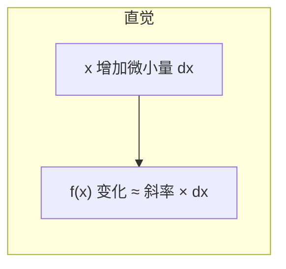
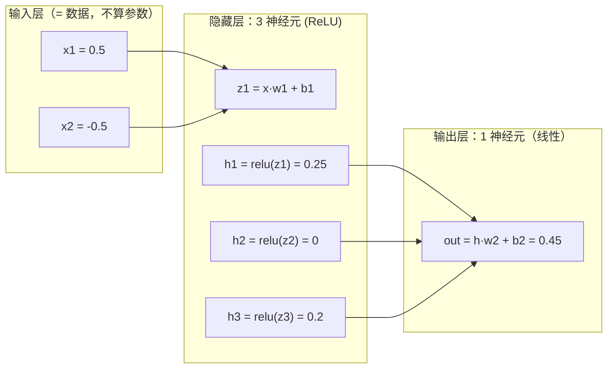

# 01 神经网络与前向传播

| 元信息 | 内容 |
|------|------|
| 所属模块 | 02-深度学习基础（核心层） |
| 篇目 | 02-1 神经网络与前向传播 |
| 预计时间 | 45-60 分钟 |
| 前置 | 01-1（ML 全景与学习范式） |
| 面试可答一句话摘要 | 一句话讲清「神经网络是什么 + 前向传播在干什么 + 损失函数在干什么」 |

> 本篇是 DL 地基篇：神经元 / 层 / 前向传播 / 损失函数直觉 + 三件数学弹药（够用即止），最后手算一遍 `y = x·w + b`。配套：[02-2 训练三件套](02-训练三件套-反向传播-梯度下降-过拟合.md) 讲「怎么学」，[02-3 架构演进](03-架构演进-CNN-RNN-Transformer.md) 讲「换什么结构」。

## 学习目标

- 能画出 2 层网络的前向数据流图，指出每个张量在哪一步产生、用来做什么
- 能用 10 行 NumPy 手算一次 `y = x·w + b` 前向，独立复现本文案例
- 能解释「为什么必须非线性激活」与「损失函数在训练中扮演什么角色」

---

## 1. 神经网络在解决什么问题

一句话结论：**神经网络 = 一层套一层的「参数化函数」，前向传播 = 把输入逐层变换成输出，训练 = 调参数让输出逼近目标。**

作为全栈工程师，最有效的锚点是把网络当「可微的查询管道」看待：


它和 `input -> middleware -> handler` 的管道唯一的本质差别是：**每一层的变换不是人写的，而是 n 个数字（参数）确定的，数字靠训练自动调。** 层数、每层宽度、激活函数这些「人定的数字」叫超参数，先不展开。

三个必须能把话说透的判断（本篇末尾面试问答都会回到它们）：

| 判断 | 直觉 |
|------|------|
| 网络能表达什么边界 | 取决于层数与非线性；层叠得越深，能表达的映射越复杂 |
| 网络怎么被调好 | 靠损失函数打分 + 梯度下降调参（02-2 篇） |
| 为什么 LLM 也是它 | GPT 就是「词向量 → 几十个 Transformer 层 → 下一个词的概率分布」，同一套前向逻辑 |

---

## 2. 神经元与层

### 2.1 神经元：一个「加权和 + 偏置 + 激活」

单个神经元的全部计算就一行：

$$z = \text{sum}(x \odot w) + b = \sum_i x_i \cdot w_i + b$$

其中 $x$ 是输入向量、$w$ 是权重向量、$b$ 是偏置（标量）。然后过一个**激活函数** $\sigma$（常见 ReLU）：$y = \sigma(z)$。

直觉翻译：

- $w$ 决定「每个输入分量有多受信任」—— 权重为负 = 该分量的存在反而抑制这个神经元
- $b$ 是「触发门槛」：神经元内在的静息偏置，改的是激活的敏感位置
- 激活函数是「开关」：ReLU 把负数一刀切 0，让神经元可以选择「这件事轮不到我发言」

> 💡 想成 event handler 就通了：`w` 是各参数的 handler 权重，`b` 是 else 分支，激活函数是 `if` 判断——只不过这一切都是实数、可微、可被梯度修改。

### 2.2 层：一批并联的神经元

一层 = 对**同一个输入向量**跑 k 个并联神经元，输出一个 k 维向量。写成矩阵就是（全部样本一起算时）：

$$H = \sigma(X \cdot W + b)$$

- $X$：样本矩阵（每行一个样本）
- $W$：权重矩阵（列数 = 本层神经元数）
- $b$：偏置向量（每神经元一个）
- $H$：本层输出，也是下一层的输入

通常说「2 层网络」指：1 个隐藏层 + 1 个输出层（输入层不算层，它只是数据）。`MLP(2, [16, 1])` 里的 `[16, 1]` 就是这个含义的层定义（02-2 会实际用到）。

### 2.3 网络 = 层的函数复合

第 $l$ 层接收第 $l-1$ 层的输出，全程就是若干个「线性变换 + 非线性」串起来。**前向传播 = 从输入到输出逐层执行这个复合函数的过程**。每个中间张量（每层的 $H$）都保留下来——02-2 你会看到它们正是反向传播要复用的产物。

---

## 3. 数学弹药：够用即止的三件套

DL 的数学门槛被严重高估了。搞清楚下面三个直觉，后面所有公式都能翻译成人话。**本模块不推公式、不做数学证明（见大纲 §9 深度边界）**，以下全部是「能让你听懂别人在说什么」的程度。

### 3.1 导数 = 斜率

$f$ 在 $x$ 处的导数，就是「输入在 $x$ 附近动一点点，输出跟着动多少」的放大倍数（切线的斜率）。



对训练的意义只有一句：**导数告诉我们「往哪个方向拧参数，损失下降最快」**。符号为正 → 增大 $x$ 会让输出增大；为负 → 相反。梯度下降就是反复用这个符号决定拧的方向。

### 3.2 链式法则 = 复合函数逐段拆解

若 $y = f(g(x))$，则「$x$ 对 $y$ 的影响」=「$x$ 对 $g$ 的影响 × $g$ 对 $y$ 的影响」（逐段斜率的乘积）。不背公式，记住一个生产场景：

> 管道 `input -> A -> B -> loss`：调整 input 对大 A 输出的影响，等于 A 段斜率 × B 段斜率。**反向传播就是在复用这个直觉，从后往前把每段斜率乘一遍**（02-2 篇细讲）。

### 3.3 向量逐元素运算（含广播）

神经网络的每一层对向量/矩阵做的是**逐元素运算**（乘、加、取 max 等），张量形状不同时按「广播」规则自动对齐扩展。你需要有的唯一直觉是：

```python
import numpy as np
x = np.array([1.0, 2.0, 3.0])
w = np.array([0.5, -1.0, 2.0])
z = x @ w        # 点积：逐元素乘后求和 = 1·0.5 + 2·(-1) + 3·2 = 4.5
print(z)         # 4.5
```

`np.maximum(0, z)`、`x @ W + b` 这类写法就是全部常用的向量操作；深层网络没有新东西，只是把它们堆了 N 遍。**看到矩阵乘法就想到「一批神经元对一批样本并行打分」，看到逐元素 op 就想到「对每个神经元单独施力」。**

---

## 4. 前向传播手算最小案例

### 4.1 单神经元：$y = x \cdot w + b$

取 $x = [0.5, -0.5]$，$w = [1.0, -1.0]$，$b = 0.2$：

$$z = 0.5 \times 1.0 + (-0.5) \times (-1.0) + 0.2 = 0.5 + 0.5 + 0.2 = 1.2$$

ReLU 后 $y = \max(0, 1.2) = 1.2$。建议先拿笔算一遍再跑代码对照，保证后面所有概念挂在「我亲手算过」上。

### 4.2 完整可运行的 2-3-1 网络前向

> 依赖：`pip install numpy`（唯一依赖，Python ≥ 3.8）。可直接保存为 `forward.py` 运行。

```python
import numpy as np

# 输入向量：1 个样本，2 个特征
x = np.array([0.5, -0.5])

# 单神经元手算对照：z = 0.5*1.0 + (-0.5)*(-1.0) + 0.2 = 1.2
w = np.array([1.0, -1.0])
b = 0.2
z = x @ w + b
y = max(0.0, z)                      # ReLU 激活
print(f"单神经元: z = {z:.2f}, y = {y:.2f}")   # 输出: z = 1.20, y = 1.20

# ---- 2-3-1 网络：输入 2 维 -> 隐藏层 3 神经元(ReLU) -> 输出层 1 神经元(线性) ----
# W1 形状 (2, 3)：3 个隐藏神经元各自对 2 个输入分量的权重
W1 = np.array([[0.5, -0.5, 0.3],
               [0.2, 0.8, -0.1]])
b1 = np.array([0.1, -0.2, 0.0])      # 3 个隐藏神经元的偏置
W2 = np.array([[1.0, 0.5, -0.5]])    # 形状 (1, 3)：输出神经元对 3 个隐藏激活的权重
b2 = 0.3

h = np.maximum(0, x @ W1 + b1)       # 隐藏层：线性加权和 + ReLU（逐元素）
out = h @ W2.T + b2                  # 输出层：线性（分类通常到此为止，再接损失）
print("隐藏层 h =", h)                # [0.25 0.   0.2 ]
print("输出 out =", out)              # [0.45]
```

手算核对第一步（其余同理）：$h_1 = \text{relu}(0.5 \times 0.5 + (-0.5) \times 0.2 + 0.1) = \text{relu}(0.15 + 0.1) = 0.25$。

### 4.3 前向数据流图（验收产出标准格式）



> 每个箭头上的变换都一样：乘权重、加偏置、过激活。**模块 02 的验收标准**：不看资料画出这张图，并指出每个张量在哪一步产生、下一步送去哪。

---

## 5. 非线性激活：为什么必须有

结论先行：**没有非线性的多层网络，等价于单层线性模型，白叠。**

直觉论证（一步到位）：线性变换叠线性变换还是线性——$W_2(W_1 x + b_1) + b_2 = (W_2 W_1) x + (W_2 b_1 + b_2)$，两个矩阵相乘还是矩阵。所以 100 层线性层 = 1 层，表达能力零增长。

加上 ReLU 这样的非线性后，每一层都能「弯折」决策边界，2 层网络就能表达任意「多边形区域」。最经典的证据就是 **XOR（异或）**：四个角点需要「对角同色」的边界，单层（线性）无论如何组合权重都画不出一条直线把 (0,0)、(1,1) 与 (0,1)、(1,0) 分开；而 2 层 + ReLU 可以。02-2 的练习会让你亲手验证「单层必失败、双层必收敛」。

---

## 6. 损失函数：给错误定价

### 6.1 它在做什么

前向传播结束后，模型吐出一个预测（一个数或一组分数）。**损失函数负责回答「这个预测错得有多离谱」**，输出一个标量（Error）。训练的全部目标 = 把这个标量压到最小。

三个最常用的损失，各一句话直觉：

| 损失 | 适用任务 | 直觉 |
|------|---------|------|
| MSE（均方误差） | 回归 | 预测值与真实值的平均平方距离（大错重罚） |
| Hinge（合页/最大间隔） | 二分类 | 分类正确且足够自信 → 0 损失；错误或不够自信 → 按距离线性惩罚（02-2 用它） |
| Cross-Entropy（交叉熵） | 多分类 | 对「正确类概率太小」这件事取负对数：概率越低罚越狠 |

> 💡 工程直觉：损失函数 = 你给模型的「考核标准」。选错损失 = 考核标准错，模型会很有「成就感」地学会考试作弊——例如回归任务错用分类损失，模型永远给不出连续值。

### 6.2 一个关键澄清（面试陷阱）

**损失不参与前向计算。** 前向只依赖输入和参数；损失是在前向的终点对输出打的分。不少面试者会在这句上翻车：「损失函数是模型第一层用来做特征提取的吗？」——不是。它是独立在输出端的「裁判」，只出现在训练阶段；**推理时根本没有损失函数**（没有标签可对照）。

---

## 7. 练习：手算 + 跑通最小前向（约 30 分钟）

**要求**：不查任何教程，完成三件事——

1. 用笔纸计算：$x = [0.5, 0.5]$，$w = [1.0, -1.0]$，$b = -0.1$ 的单神经元输出（先算 $z$ 再过 ReLU），并用上面代码验证
2. 把 4.2 的代码改成输入 $x = [-1.0, 2.0]$，重新手算隐藏层 3 个值并核对程序输出
3. 口头回答：为什么任意多层线性层叠不出非线性边界？（30 秒内给结论）

**提示**：

- 逐元素算：$z_1 = 0.5 \times 1.0 + 0.5 \times (-1.0) + (-0.1) = 0.5 - 0.5 - 0.1 = -0.1$，ReLU 后为 0
- 改输入后权重不变，先算 $x \cdot W_1$ 的三个分量再加 $b_1$，逐核对别跳步
- 第三问的关键词是「矩阵乘法闭合性」：$W_2 W_1$ 还是矩阵

**预期效果**：纸上计算与程序输出一致（手算环节 0 误差）；能在 1 分钟内画出 2-3-1 前向数据流图并说出每个张量的形状与去向；第三问能给出「线性复合仍是线性，所以需要非线性如 ReLU」这一句结论。

---

## 8. 对比板块：神经网络 vs 传统机器学习 vs 手工规则

| 维度 | 神经网络（本技术） | 传统 ML（特征工程 + SVM/逻辑回归） | 手工规则（基线/原生） |
|------|-------------------|----------------------------------|----------------------|
| 特征从哪来 | 自动从数据学（端到端） | 人肉设计 + 专家经验 | 人肉硬编码 |
| 上限 | 层数/数据够时很高，可表达非线性 | 受限于特征质量，线性或浅非线性 | 极低，只能覆盖枚举到的 case |
| 可解释性 | 差（黑盒） | 中（特征含义可读） | 好（每条规则可读可审计） |
| 数据需求 | 大（靠数据喂出特征） | 中 | 小 |
| 计算成本 | 训练很贵、推理便宜 | 训练便宜 | 几乎为零 |
| 场景 | 图像 / 语言 / 高维非结构化数据 | 结构化表格、特征明确的场景 | 稳定小域的规则系统（正则、告警） |

> 选型结论：能写死规则的场景不碰 ML；特征能被人讲清楚且数据量小的场景先试传统 ML；数据量大、特征说不清（图像、文本、语音）才是神经网络的战场。对 Agent 工程师最相关的判断是：**Embedding/意图识别/内容理解这类「特征说不清」的能力，一律归神经网络管；工具调用、流程编排这类「规则说得清」的能力，继续用代码写。**

---

## 9. 面试问答

> **问：为什么神经网络一定要有非线性激活函数？**
>
> **答：** 线性变换叠线性变换还是线性变换（两个矩阵相乘仍是矩阵），所以全线性网络等价于单层线性模型，层数白叠。非线性（如 ReLU 的截断）让每一层都能弯折决策边界，层叠起来才能表达 XOR 这类非线性可分的问题。这也是「层数=表达能力」的前提：只有非线性层多起来，深度才有意义。
>
> **追问：那为什么不干脆全用很强的非线性？**
>
> **答：** 激活还要**可微**（梯度下降要靠导数）；同时要**简单**。ReLU 成为默认的原因就是便宜（一次比较）且梯度恒为 1 或 0，计算和数值上都干净。sigmoid 这类两端饱和的激活在很深网络里会让梯度信号变小，实际已被 ReLU 系取代（梯度消失的直觉层面，数学证明不展开）。

> **问：损失函数在训练里起什么作用？推理时还需要它吗？**
>
> **答：** 损失函数是「裁判」，给预测结果打分（错得越离谱分越高）。它的值只被反向传播用来计算梯度、指导参数更新。它完全不参与前向计算，推理时也没有标签可以打分，所以**推理链路里没有损失函数**——这正是分不清「训练/推理」的人最容易踩的陷阱。
>
> **追问：回归和分类在损失选择上怎么区分？**
>
> **答：** 预测连续数值（如价格、温度）用 MSE 这类回归损失；预测离散类别（如情感、意图）用合页/交叉熵这类分类损失。拍脑袋选错损失，模型要么输出永远不连续，要么永远不敢自信，都属于「考核标准定错了」的工程事故。

---

## 参考链接

- [NumPy 官方文档](https://numpy.org/doc/stable/) —— 向量 / 广播语法的一级参考（本文 §3.3 的官方出处）
- [Deep Feedforward Networks（花书第 6 章）](https://www.deeplearningbook.org/contents/mlp.html) —— 神经元 / 前向传播 / 损失函数的经典教材参考
- [micrograd（karpathy）](https://github.com/karpathy/micrograd) —— 02-2 的源码靶子，可先预览

---

**下一篇**：[02-2 训练三件套：反向传播 / 梯度下降 / 过拟合](02-训练三件套-反向传播-梯度下降-过拟合.md)——拿到 micrograd 这把钥匙，亲手把 02-1 的网络训练起来。