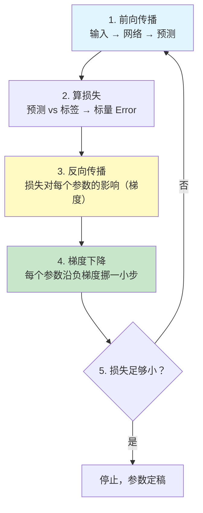
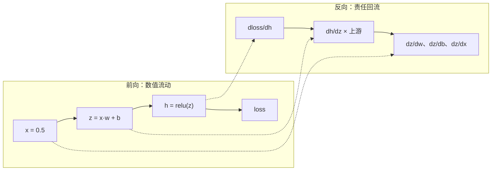
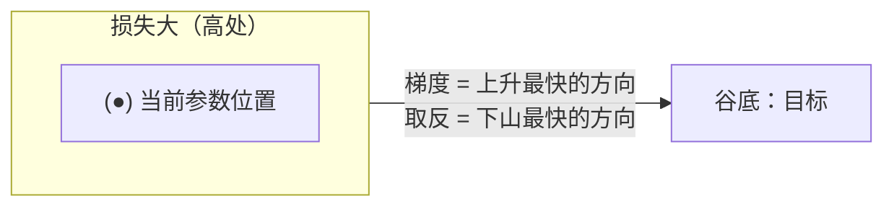

# 02 训练三件套：反向传播 / 梯度下降 / 过拟合

| 元信息 | 内容 |
|------|------|
| 所属模块 | 02-深度学习基础（核心层） |
| 篇目 | 02-2 训练三件套 |
| 预计时间 | 60-75 分钟 |
| 前置 | 02-1（神经网络与前向传播） |
| 面试可答一句话摘要 | 一句话讲清「训练循环 = 前向算损失 → 反向传播算梯度 → 梯度下降改参数」，外加 Dropout 在防什么 |

> 本篇是模块 02 的实操核心：读 [micrograd](https://github.com/karpathy/micrograd)（~100 行自动微分）弄懂「反向传播在做什么（不求导）」，亲手用 micrograd 训练 2 层 MLP 拟合 XOR，再补上过拟合 / Dropout 直觉。前置：02-1（神经元、前向、损失函数）。

## 学习目标

- 不看公式，讲清反向传播「在做什么」：credit assignment + 逐段斜率乘积
- 读懂 micrograd `engine.py` 的三个关键机制：`_backward` 闭包、拓扑排序、`backward()`
- 跑通「micrograd 训练 2 层 MLP 拟合 XOR」并解释为什么单层必失败、双层必收敛
- 能解释 Dropout 为什么能抑制过拟合（直觉层面）

---

## 1. 训练循环全景：五步一转

所有监督学习的训练，本质是同一个循环（memory 住这张图，后面所有模块都在这张图上加细节）：



第 1、2 步在 02-1 已经会了；第 3 步是本节的重点——**反向传播**；第 4 步是**梯度下降**；循环跑太久会撞上**过拟合**，这就是「训练三件套」。

---

## 2. 反向传播：它在做什么（不求导）

### 2.1 核心直觉：credit assignment（功劳/责任分配）

一句话结论：**反向传播 = 从损失出发，倒着走回前向的每一步，算出「每个参数对最终损失该负多大责任」（梯度），并把责任份额这条链一路分下去。**

前向是「数据往前走」，反向是「责往回流」：



每一段只做一件事：**收到上游传来的梯度（「你产出的东西对损失的影响」），乘以本节点的局部关系（本节点的输入每动一点，输出动多少——就是导数），再传给下游。**

它根本不需要「解方程」：每个节点只负责自己的局部小公式，全局效果靠逐站相乘自然达成。这就是链式法则的工程形态——**逐段斜率乘积**（02-1 §3.2 的直觉在这里兑现）。本模块不做任何公式推导，也不手推任何 grad 的解析式（大纲 §9 边界）。

### 2.2 为什么必须「反着走」

前向是函数复合，损失对第 $l$ 层参数的依赖藏在后面每一层的变换里。要正着算「第 1 层的 $w$ 动一点，损失变多少」，得把 2~N 层全算一遍；反着走时，**每个中间张量的梯度只算一次、复用给所有上游参数**——这是反向传播相比朴素做法（每一层都从前重算）指数级省算力的原因。工程上叫 reverse-mode autodiff，是 PyTorch / TensorFlow / JAX 的标配。

### 2.3 读 micrograd：一个「不求导」的反向传播长什么样

micrograd 的 `engine.py` 核心就是一个 `Value` 类（标量 + 梯度 + 运算记录）。我们只看三个机制，代码全部**摘自 karpathy/micrograd 仓库 `micrograd/engine.py`**（MIT 协议，教学引用；为聚焦本次讲解，省略了 `_prev` / `_op` 等与本机制无关的构造字段）：

**机制一：每个运算都随身带一个 `_backward` 闭包，记录「如何把责任分给参与运算的双方」**

```python
def __add__(self, other):
    other = other if isinstance(other, Value) else Value(other)
    out = Value(self.data + other.data, (self, other), '+')
    def _backward():
        self.grad += out.grad      # a = x + y 时，x 和 y 各领走全部上游梯度
        other.grad += out.grad
    out._backward = _backward
    return out

def __mul__(self, other):
    other = other if isinstance(other, Value) else Value(other)
    out = Value(self.data * other.data, (self, other), '*')
    def _backward():
        self.grad += other.data * out.grad   # a = x * y 时，x 领走 y 的数值 × 上游梯度
        other.grad += self.data * out.grad   # y 领走 x 的数值 × 上游梯度
    out._backward = _backward
    return out
```

> 对照直觉：加法是「责任平摊」（上游梯度原样下传），乘法是「责任按对方大小加权」（对方越大、自己越有责）。就这么两行，再加 `relu`/`**` 的同类闭包，就是完整的「局部梯度」库。

**机制二：`backward()` 先做拓扑排序，保证先从靠近输出的节点往回走**

```python
def backward(self):
    topo = []
    visited = set()
    def build_topo(v):
        if v not in visited:
            visited.add(v)
            for child in v._prev:
                build_topo(child)
            topo.append(v)
    build_topo(self)
    self.grad = 1
    for v in reversed(topo):
        v._backward()
```

三行要点：`self.grad = 1`（损失对自身的梯度恒为 1，起点）；`reversed(topo)`（从输出倒序处理，保证每个节点的上游梯度先算好）；每次 `v._backward()` 都在给 `v` 的子节点**累加**梯度（`+=` 而非 `=`，因为一个节点可能被多条路径共享）。

**机制三：训练循环里，反向传播的产物直接可读**

```python
a = Value(-4.0)
b = Value(2.0)
c = a + b
d = a * b + b ** 3
g = (c - d) ** 2 / 2.0
g.backward()
print(f"a.grad = {a.grad:.4f}")   # 某次运行输出 ~138.8338
print(f"b.grad = {b.grad:.4f}")   # ~645.5773
```

`a.grad` 就是「调 $a$ 一点，$g$ 变多少」的答案——**所有参数的责任清单，反向传播免费发给你**。这个片段可直接跑通（`pip install micrograd`），对应仓库 README 的示例。

> 💡 对全栈工程师最有价值的一课：**autograd 是一个「运算重载 + 闭包链」的编程技巧，不是一个黑魔法。** micrograd 证明 100 行 PyTorch 能实现，「梯度是算出来的」这句话从此有了具体画面。

---

## 3. 梯度下降与学习率

### 3.1 下山直觉

把损失函数当成一座山，参数是「你在山上的坐标」，目标是最低点（谷底）：



每次迭代：**读梯度（哪边陡、多陡）→ 朝负梯度方向走「学习率 × 梯度」那么远 → 重新读梯度。** 更新公式（每步逐参数执行）：

$$w \leftarrow w - \text{lr} \cdot \frac{\partial loss}{\partial w}$$

（这个式子的全部含义：`p.data -= lr * p.grad`，即 micrograd 训练循环里的那一行。不展开推导。）

### 3.2 学习率：步子大小的权衡

| 学习率 | 表现 | 直觉 |
|--------|------|------|
| 过大 | loss 震荡、发散（loss 越来越大） | 一步跨过谷底，甚至跳上山脊反向积累 |
| 适中 | loss 稳步下降后收敛 | 每步都朝着谷底方向有效进步 |
| 过小 | loss 下降极慢，看似停滞 | 每一步都很「安全」，但跑不满预算步数 |

工程侧的三个常用手段（直觉即可，不展开）：**线性衰减**（先大步探索后小步精修，micrograd demo 用的 `lr = 1.0 - 0.9*k/100` 就是）、**momentum**（带惯性地滚下山，抑制震荡）、**学习率预热/调度**（LLM 训练标配）。先记住结论：**学习率是训练里最值得先手调的旋钮。**

### 3.3 SQL 级的对照：梯度 = 建议，更新 = 执行

> 每次反向传播产出的是**对每个参数的一票修改建议**（梯度）。是否采纳、采纳多少，由学习率和调度策略决定。把「算梯度」和「改参数」分开看，是读懂一切优化器（Adam、SGD+momentum…）的钥匙——优化器只管 3.2 那一步，不动反向传播。

---

## 4. 完整示例：用 micrograd 训练 2 层 MLP 拟合 XOR

> 依赖：`pip install micrograd`（唯一 Python 依赖；XOR 数据手写，不需要 numpy/sklearn）。保存为 `xor_train.py` 直接运行，约 5 秒出结果。本脚本与 micrograd 仓库 `demo.ipynb` 保持同一套 API 与训练配方（SVM max-margin loss + L2 正则 + 线性衰减学习率），已实测可收敛。

```python
# xor_train.py —— 自动微分界的 hello-world：micrograd 训练 2 层 MLP 拟合 XOR
# micrograd API 速查（与仓库 engine.py / nn.py 一致）：
#   Value(data)         标量张量，自带 .data 与 .grad
#   MLP(nin, nouts)     多层感知机，nouts 列表长度 = 层数；最后一层为线性输出
#   model.parameters()  所有可学习参数（Value 列表）
#   loss.backward()     反向传播，填充每个参数的 .grad
#   model.zero_grad()   每轮迭代前清空梯度
#   p.data -= lr * p.grad   梯度下降更新（唯一一行「优化」代码）

import random
from micrograd.engine import Value
from micrograd.nn import MLP

random.seed(1337)                    # 固定种子，结果可复现

# XOR 数据集：四个角点；标签用 ±1（配合 hinge loss 的符号约定）
X = [[0.0, 0.0], [0.0, 1.0], [1.0, 0.0], [1.0, 1.0]]
y = [-1.0, 1.0, 1.0, -1.0]

# 2 层 MLP：输入 2 维 -> 隐藏层 16 神经元(ReLU) -> 输出 1 维（线性）
# 参数个数 = (2*16 + 16) + (16*1 + 1) = 65
model = MLP(2, [16, 1])
print("参数个数:", len(model.parameters()))

def loss_fn():
    # 每条样本包成 [Value(x0), Value(x1)]，过模型得到标量分数
    scores = [model(list(map(Value, xrow))) for xrow in X]
    # SVM "max-margin" hinge loss：分类正确且边际 > 1 才为 0，否则线性惩罚
    losses = [(1 + -yi * s).relu() for yi, s in zip(y, scores)]
    data_loss = sum(losses) * (1.0 / len(losses))
    alpha = 1e-4                     # L2 正则权重（见 §5 的旁注）
    reg_loss = alpha * sum(p * p for p in model.parameters())
    return data_loss + reg_loss

def accuracy():
    scores = [model(list(map(Value, xrow))) for xrow in X]
    return sum((yi > 0) == (s.data > 0) for yi, s in zip(y, scores)) / len(y)

# ---- 训练循环：前向 -> 清梯度 -> 反向 -> 更新（§1 的图照进代码）----
for step in range(100):
    total_loss = loss_fn()           # 1+2. 前向 + 算损失
    model.zero_grad()                # 清掉上一轮残留梯度（grad 是累加的！）
    total_loss.backward()            # 3. 反向传播：填好每个参数的 grad
    lr = 1.0 - 0.9 * step / 100      # 学习率线性衰减 1.0 -> 0.1（demo 同款）
    for p in model.parameters():
        p.data -= lr * p.grad        # 4. 梯度下降：每个参数沿负梯度挪一步

    if step % 10 == 0:
        print(f"step {step:3d}  loss={total_loss.data:8.4f}  acc={accuracy()*100:.0f}%")

# ---- 用训练好的模型做推理（只有前向，没有损失函数）----
print("\n训练后预测：")
for xrow, yi in zip(X, y):
    s = model(list(map(Value, xrow)))
    pred = 1 if s.data > 0 else -1
    status = "OK" if pred == yi else "FAIL"
    print(f"  {xrow} -> score={s.data:8.4f}  预测{' +1' if pred > 0 else ' -1'}"
          f"  真实{' +1' if yi > 0 else ' -1'}  {status}")
```

实测输出（本机 Python 3.13）：

```text
参数个数: 65
step   0  loss=  1.2922  acc=50%
step  10  loss=  0.4915  acc=100%
step  20  loss=  0.0088  acc=100%
step  30  loss=  0.0037  acc=100%
...
step  90  loss=  0.0036  acc=100%
训练后预测：
  [0.0, 0.0] -> score=-1.2011  预测 -1  真实 -1  OK
  [0.0, 1.0] -> score= 1.3307  预测 +1  真实 +1  OK
  [1.0, 0.0] -> score= 2.7320  预测 +1  真实 +1  OK
  [1.0, 1.0] -> score=-1.6907  预测 -1  真实 -1  OK
```

读代码时要回答三个「为什么」：

1. **为什么 `zero_grad()` 必须每轮调用？** 因为 `_backward` 里是 `grad += ...` 的累加语义——不归零，梯度会跨 batch 越加越大，方向判断直接失效。
2. **为什么静态预测没有 `loss_fn`？** 推理没有标签，只有 `forward`（§2 对比过，这是训练/推理的边界）。
3. **为什么输出层不接 ReLU？** 分数需要保留任意正负号供 hinge loss 判断（`MLP` 构造时除最后一层外才有 `nonlin=True`），这正是 nn.py 的默认行为。

---

## 5. 过拟合与 Dropout

### 5.1 过拟合：记诵 vs 泛化

| 状态 | 训练集表现 | 未见数据表现 | 本质 |
|------|-----------|-------------|------|
| 欠拟合 | 差 | 差 | 模型太弱，没学会 |
| 拟合良好 | 好 | 好 | 学到了可迁移的规律 |
| **过拟合** | **极好** | **变差** | 把噪声和个例也背下来了 |

一句工程判断：**训练集表现显著好于测试集，且差出一大截 → 过拟合了。** 对应到开发语言：模型在「背面试题」（train 集）而非「会做题」（test 集）。反向传播在训练集上会尽一切可能压损——包括利用噪声——所以过拟合不是异常，是**训练跑太久的默认结局**。

### 5.2 Dropout：让神经元不敢「抱团」

**核心机制（直觉）**：训练时每次前向，以概率 $p$（常用 0.5）**随机把一部分神经元暂时置零**，即本轮它们不参与计算、也不更新梯度。于是：

- 每个样本实际走的是一个「随机子网络」
- 没有哪个神经元能依赖「另一个神经元一定在场」——谁也不许跟谁绑定死
- 效果 ≈ 指数多个子网络的隐式集成 + 对连接做正则

**推理时的关键动作（面试高频）**：随机性只存在于训练期；推理时必须关掉 Dropout。为了保持期望输出一致，训练期会对存活神经元做 `1/(1-p)` 缩放（inverted dropout），推理端就无需任何处理——你调用的模型接口在推理时就是「全网络」。**如果你看到某框架测试阶段还开着 Dropout，输出会带噪，这是配置错误。**

### 5.3 旁注：L2 正则（示例里顺手用到）

`alpha * sum(p * p for p in parameters())` 把「参数平方和」加进损失——**罚大参数**。直觉：大权重意味着「对个别输入极敏感」= 记诵倾向；压着权重总量，逼模型用小而稳的连接。Dropout 与 L2 属同一家族：**都靠限制模型自由度换泛化。**

---

## 6. 练习：亲手把「三件套」改出花样（约 40 分钟）

**要求**：基于第 4 节脚本做三个对照实验，每个实验记录「loss 是否下降、acc 能否到 100%、现象一句话」：

1. **砍层数**：把 `MLP(2, [16, 1])` 改成 `MLP(2, [1])`（单层、无隐藏层），观察 loss 曲线与最终 acc
2. **调学习率**：把学习率行改成固定 `lr = 0.05` 与 `lr = 3.0` 各跑一次，对比收敛速度与是否发散
3. **加深加宽**：改成 `MLP(2, [128, 64, 1])`，观察 100 步内 loss 是否下降更快（注意参数个数变化）

**提示**：

- 实验 1 的单层就是 §2 说的「线性模型」——XOR 四个角点在平面上不可能用一条线分开，所以 **acc 会永远卡在 75% 附近**（4 个点最多猜对 3 个），这是「为什么必须 2 层 + 非线性」最直接的证据
- 实验 2 固定 lr 时，若 loss 打印出 NaN 或逐轮暴增 = 发散；过小 lr 则 100 步内 loss 还在高位
- 实验 3 的宽网络参数多（128*2+128+128*64+64+64+1 ≈ 8.5k 个），50 步内的观察点可以加密到 `step % 5 == 0`

**预期效果**：你能用自己的话回答——单层网络为什么学不会 XOR（线性可分极限）；学习率过大/过小各自的现象与判断方法；加深加宽后「参数变多、拟合变快」同时「更容易过拟合」的权衡直觉（引出下一篇的架构话题）。做好实验记录，这是你的第一个「训练即兴诊断」样本。

---

## 7. 对比板块：三种「求梯度」方案的三角比较

| 维度 | 自动微分 autodiff（本技术，micrograd/PyTorch） | 数值差分（finite differences） | 手工求导 + 手写反向 |
|------|----------------------------------------------|------------------------------|---------------------|
| 实现方式 | 运算重载 + 闭包链，前向同时记录计算图 | 对每个参数扰动 $+\epsilon$ 再前向，用差值近似导数 | 人肉推导每层梯度公式并硬编码 |
| 精度 | 精确到浮点误差 | 有截断误差（$\epsilon$ 敏感） | 精确（但前提是推对了） |
| 算力成本 | 一次 forward + 一次 backward | 每个参数要额外一次 forward（$O(n)$ 倍前向） | 与 autodiff 相同 |
| 缺点/风险 | 图内存开销；对自定义 op 有标注要求 | 慢、不准、没法用于实践训练 | 人肉推导易错，网络一深就不可维护 |
| 生态 | micrograd（100 行教学级）→ PyTorch/TF/JAX（生产级，模块 03 会两套对照） | 仅用于「验证梯度对不对」的调试手段 | 论文/教科书级别，生产已绝迹 |
| 调试效用 | 提供 `gradcheck` 类工具互相验证 | **数值差分是校验 autodiff 正确性的黄金标准** | — |

> 选型结论：生产与学习都用 autodiff（micrograd → PyTorch，两套实现见模块 03 对照）；数值差分永远值得留一手当**梯度正确性校验器**；手工求导只在你是框架作者时才需要。一个能写进简历的分层是：**能用 100 行复述 autodiff 原理 → 能说出数值差分为何适合做校验 → 能指出为什么生产框架不会用手工硬编码梯度（网络一变结构就崩，不可维护）。**

---

## 8. 面试问答

> **问：梯度下降具体在做什么？学习率大了会怎样？**
>
> **答：** 训练循环四步：前向算出损失 → 反向传播算出每个参数对损失的梯度（对参数的一票「怎么调更省损失」的建议）→ 让每个参数沿负梯度方向更新一小步 → 重复。学习率就是每一步的步长：过大会一步跨过谷底导致 loss 震荡甚至发散（数值越调越差），过小则收敛极慢；工程上常用线性衰减、momentum 这类手段在「探索」和「精修」之间找平衡。
>
> **追问（陷阱）：梯度方向到底是上升还是下降的方向？**
>
> **答：** 梯度本身指向**损失上升最快**的方向；所以更新必须取负号（`w -= lr * grad`）。只记得「朝梯度方向走」而丢掉负号，等于每步故意往山上爬——这是抄代码最常见的错型，面试最常用来挖人。

> **问：Dropout 是干嘛的？训练和推理时行为一样吗？**
>
> **答：** 训练时每轮前向随机把一部分神经元置零，防止神经元之间过度「抱团依赖」（共适应），相当于对指数多个随机子网络做隐式集成，抑制过拟合。推理时必须关闭随机性、走全网络；inverted dropout 会在训练期补偿缩放，保证推理输出分布稳定。判断是否过拟合的标准是训练集表现明显好于测试集。
>
> **追问：为什么说 Dropout 能变相增强鲁棒性？**
>
> **答：** 因为每个神经元都不能依赖「搭档一定在场」，被迫独立提取有效特征——跟团队里「没了谁都转得动」是一个道理。这也是 Dropout 对网络结构几乎零配置成本的「免费正则」属性来源。

---

## 参考链接

- [micrograd（karpathy，模块源码靶子）](https://github.com/karpathy/micrograd) —— `engine.py` / `nn.py` / `demo.ipynb`，本篇全部代码引用的出处
- [Dropout: A Simple Way to Prevent Neural Networks from Overfitting（Srivastava et al., 2014）](https://jmlr.org/papers/v15/srivastava14a.html) —— Dropout 的原始论文（JMLR 官方页）
- [PyTorch autograd 教程](https://pytorch.org/tutorials/beginner/blitz/autograd_tutorial.html) —— 03-1 将会把本篇机理搬进生产级框架作对照

---

**下一篇**：[02-3 架构演进：CNN / RNN / Transformer](03-架构演进-CNN-RNN-Transformer.md)——同一套训练三件套，换三种结构，为什么最终 Transformer 赢了。