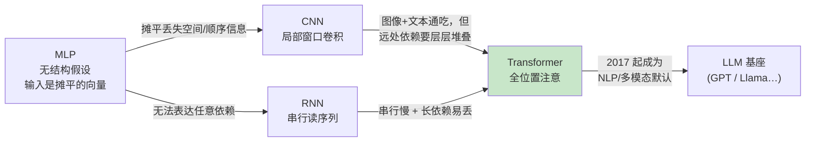
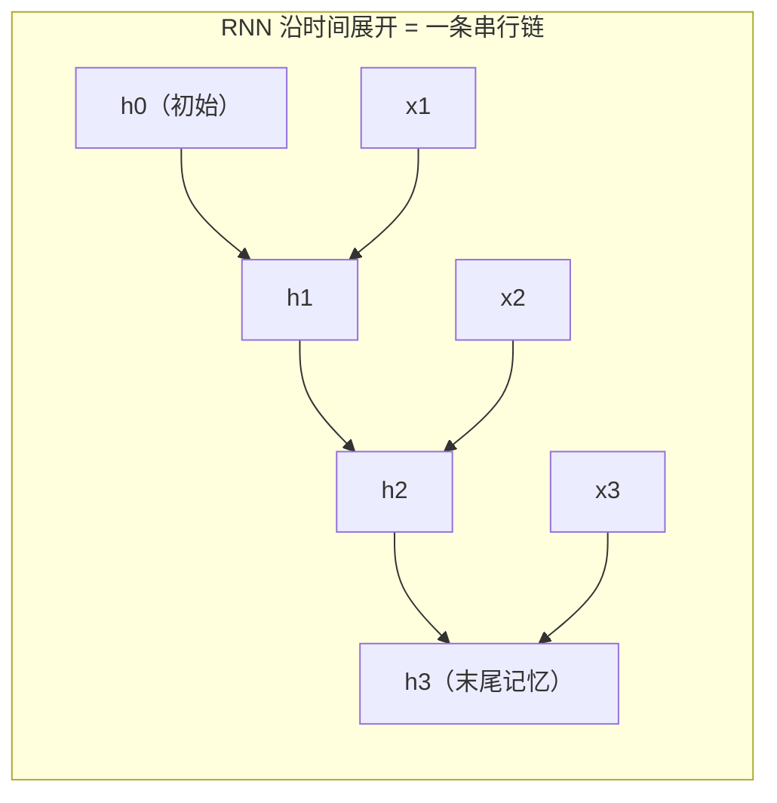
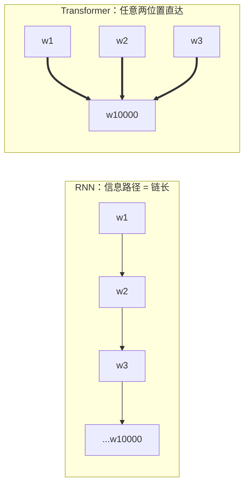

# 03 架构演进：CNN / RNN / Transformer

| 元信息 | 内容 |
|------|------|
| 所属模块 | 02-深度学习基础（核心层） |
| 篇目 | 02-3 架构演进：CNN / RNN / Transformer |
| 预计时间 | 50-60 分钟 |
| 前置 | 02-1、02-2（训练三件套） |
| 面试可答一句话摘要 | 三个架构各解决什么问题 + 一句话讲清「Transformer 为什么取代 RNN（并行 + 长依赖）」 |

> 本篇是模块 02 的收口篇：把 CNN / RNN / Transformer 放在同一张能力表里对比——各自的结构假设、适用场景、致命局限，最后落到面试必考句：「Transformer 凭什么赢」。前置：02-1、02-2（训练三件套）；下一篇进入模块 03（PyTorch 最小案例）。

## 学习目标

- 能给三个架构各配一句话定位：CNN=局部窗口卷积、RNN=串行压缩记忆、Transformer=全位置注意力
- 能讲清 RNN 的两宗罪（串行不可并行、长距离信息要一站站传）与 Transformer 的解法
- 拿到具体业务场景能给出架构选型结论并说清理由（练习验收）

---

## 1. 先记住结论：三张名片

| 架构 | 一句话定位 | 结构假设（它赌了什么） | 天生场景 |
|------|-----------|----------------------|---------|
| CNN | 局部窗口 + 权重共享，滑过输入 | 「相邻位置才有用，远处靠层层堆」 | 图像、语音频谱、局部模式明显的输入 |
| RNN | 按时间步串行读入，隐状态当记忆 | 「顺序重要，记忆靠一个状态变量接力传递」 | 短序列、流式输入（早期 NLP） |
| Transformer | 任意两个位置直接相互注意力 | 「顺序只是附加信息，任意位置都可能相关」 | 文本、多模态、长序列（当前默认选择） |

一张图看演进动机（每个箭头都对应「上一代的核心毛病」）：

---

## 2. CNN：局部窗口卷积

### 2.1 它在干什么

一个卷积核（比如 3×3 的权重小矩阵）**在输入上滑动**，每个位置算一次「局部点积」，产出特征图；多层堆叠后，浅层看到边缘、深层看到部件。两个设计牌：

- **局部感受野**：每个输出只看输入的一小块邻居（赌「近处相关」）
- **权重共享**：同一个核滑遍全图（赌「同一模式在哪里出现都一样」，即平移不变性）

### 2.2 适用场景与局限

| 面 | 结论 |
|----|------|
| 强项 | 图像分类/检测/分割；任何「局部模式 + 位置无关」的信号（语音帧、光谱、二维网格） |
| 局限 1 | 远距离依赖要靠「层层堆叠感受野」逼近 → 两层之间隔得越远，信息绕的路径越长 |
| 局限 2 | 对顺序信息不敏感：把图像像素重排，只要局部模式还在，输出不变（对文本这是缺点——词序是语义的一部分） |
| 局限 3 | 输入需规整（定长网格）；文本是变长序列，硬塞进 CNN 很别扭 |

> 💡 工程锚点：CNN 是「特征提取器中的局部模式匹配器」。RAG 里检索侧不会用 CNN；但你在 05 以后看 Mamba/混合架构里的「卷积分支」时，会反复遇到这个局部窗口思路。

---

## 3. RNN：串行读序列的压缩机

### 3.1 它在干什么

按时间步依次读入 $x_1, x_2, \dots$，每一步用一个**隐状态 $h_t$** 汇总「到目前为止看到的一切」，公式直觉：$h_t = f(h_{t-1}, x_t)$。文本来了是一个词一个词吞下去，吞完最后一个词，$h$ 里装着「全句的压缩记忆」，拿去接分类层或继续生成下一个词。

链式结构是它的立身之本，也是它的两宗罪。

### 3.2 局限一：无法并行

第 $t$ 步必须等第 $t-1$ 步算完（$h_t$ 依赖 $h_{t-1}$）。训练时 GPU 的核心优势——大规模并行——在 RNN 上基本废掉：**序列长度就是最小串行深度**。1 万 token 的句子，至少串行跑 1 万步；训练慢、长文本几乎不可行。

### 3.3 局限二：长距离依赖要一站站传，信息会「磨损」

第 1 个位置的信号要影响第 10000 个位置，得沿链穿过 9999 次「非线性压缩」。每过一站，信号都要被非线性激活「门」过滤一遍——直觉上就像口耳相传的消息，**传得越远越失真**。梯度信号同理：反向传播逆着链走 9999 站，逐段相乘后数值要么爆掉（梯度爆炸）、要么趋近 0（梯度消失）——深层网络与长序列共有的毛病（数学证明见模块边界，此处只要直觉：**乘得太多，要么膨胀要么湮灭**）。LSTM/GRU 加了「门控」让信号能走捷径，缓解但没根除——瓶颈在「串行链」本身。

### 3.4 适用场景

短序列、强顺序约束、交互式/流式场景（实时语音、逐 token 自回归——但生成时代已被 Transformer 的 KV Cache 接管，见 05 篇）。**一句话：RNN 是「顺序敏感 + 长度短」时代的方案。**

### 3.5 顺带认识两位「改进版」（点到为止）

- **LSTM/GRU（门控）**：加了一组门（遗忘/输入/输出门），让信息能沿时间步走「捷径」直达，缓解长依赖磨损。但串行链的结构没变——**它只是「更好的 RNN」，不是「RNN 的终结者」**，并行之痛照旧。
- **双向 RNN**：从左到右、从右到左各一条链，结果拼接——补上「只能看到过去」的短板，代价是两套参数、内存翻倍。

这两者在面试里一句话点到即可；它们共同说明了同一件事：**RNN 家族所有改良都在给「串行链」打补丁，而 Transformer 是换赛道。**

---

## 4. Transformer：注意力打通任意两位置

### 4.1 它在干什么（直觉层）

对每个 token，**直接对序列里所有其他 token 算一个相关度（注意力权重），再把「所有 token 的表示按相关度加权求和」作为自己的新表示**。于是第 1 个 token 和第 10000 个 token 之间，信息路径长度 = 1 次注意力计算——**远程依赖变成「直达」，不再需要一站站传**。

### 4.2 两个关键事实

- **位置信息是「附加」的**：注意力本身不关心顺序（它对输入打乱无感），所以要额外加**位置编码**（给每个 token 打个位置烙印）。这正好和 CNN 反过来：CNN 默认有局部性但没顺序敏感性，Transformer 默认全相关但顺序要补。
- **成本是 O(n²)**：每个 token 要跟自己以外所有 token 算相关度 → n 个 token 共 n² 次两两交互。**长文本的「贵」就贵在这里**（这也是 05 篇 KV Cache、Mamba 等一切「长上下文优化」的出发点）。

### 4.3 两个必知细节：多头注意力与位置编码（直觉层）

- **多头注意力**：把每个 token 的表示拆成多组（头），每组独立算一遍注意力再拼回——相当于多个「观点」并行开会：有的头盯语法关系、有的头盯指代远近、有的头盯位置模式。直觉先记住这一句，机理结合 nanoGPT 源码在 05-2 细读。
- **位置编码（PosEnc）**：给每个 token 叠加一个「位置烙印」向量（固定三角函数公式或可学习参数），把「谁在第几号位」写进表示。现代 LLM 主流是相对/旋转位置编码（RoPE）——它只依赖「两个 token 之间隔了几位」而非绝对坐标，外推到未见长度更稳（05-2 预告）。

### 4.4 并行性为何天然成立

Transformer 的每一层里，**所有 token 的注意力可以同时算**（彼此输入不依赖「前一个 token 的输出」——注意力是对上一层的整体输出做的）。所以 GPU 能以序列长度为单位并行，这是与 RNN「串行链」最致命的分水岭。

---

## 5. 为什么 Transformer 取代了 RNN（面试核心句）

**两条原因，缺一不可：**

1. **并行**：训练时整条序列同步算，GPU 利用率从「按时间步串行」变成「按层并行」→ 训练速度快出数量级
2. **长依赖直达**：任意两位置的路径长度为 1，远程信息不再逐站磨损 → 长文本质量断崖式提升（也顺带缓解了梯度逐段相乘的消失问题，直觉层面）

> 一句话版本：**RNN 的串行链同时杀死了「快」和「远」；Transformer 用「全位置注意力」一次解决两件事——能并行所以快，路径短所以远。** 「Attention Is All You Need」（2017）之后，NLP 基线全部迁移，LLM 全家族（GPT/Claude/Llama/Qwen…）都是 Transformer 系；CNN 在图像侧仍是主力（vision Transformer 是搅局者，05 会点到）。

补充一个容易忽略的事实：**CNN 也输给了 Transformer（语言侧）**。CNN 的局部窗口假设对「词与词可以隔得很远相关」的文本是结构性误配——它和 RNN 是「各有各的短板」，Transformer 是「通吃」的通用结构。

### 5.1 为什么说 Transformer 是「通用结构」

三件事它都能干，而 CNN/RNN 各有盲区：

| 能力 | CNN | RNN | Transformer |
|------|-----|-----|------------|
| 局部模式（图像/相邻词的近景依赖） | 天生强项 | 弱 | **能学**（注意力可退化为局部窗口） |
| 顺序信息（词序/时序） | 弱（需额外处理） | 天生强项 | **能补**（位置编码） |
| 远程依赖（跨段/全书） | 弱 | 弱 | **天生强项** |

从「赌结构」到「不赌、把结构选择权交给数据」——CNN/RNN 的强先验在数据海量时会变成天花板，而 Transformer 用多一点点训练成本换来了「什么都能学」。这就是 2020 年代「一切皆 token」（像素切成 patch、音频帧当 token、图结构拼成序列）设计哲学的根基。

---

## 6. 三层选型决策（给全栈工程师的速查）

| 业务信号 | 首选 | 备选/替代 | 一句话理由 |
|---------|------|----------|-----------|
| 图像/视频/语音频谱，局部模式强 | CNN（或 CNN 起的混合） | ViT 等 vision transformer | 局部先验免费送，小数据更稳 |
| 短序列、流式、强顺序约束 | Transformer（小） | RNN/LSTM（遗留系统） | 哪怕短序列，训练并行性依然是硬优势 |
| 长文本/代码/多模态/生成 | Transformer（LLM 基座） | Mamba/混合架构（05 延伸） | 并行 + 长依赖，无对手 |
| 调用 LLM 做产品（你的主场） | API 或开源 LLM | 本地小模型 | 选型在「模型 + 上下文长度」，不在自训架构 |

> 落回 Agent 工程师日常：**你几乎永远不需要自己选 CNN/RNN/Transformer 来训练**（模块边界），但你需要能解释「为什么 Embedding 模型 / LLM 都长在 Transformer 上」「为什么上下文越长越贵」——这两个解释的根都在这篇。

### 6.1 三个常见误区（面试送分/送命点）

| 误区 | 真相 |
|------|------|
| 「RNN 被淘汰只是因为算得慢」 | 只对一半：无法并行（慢）只是其一，长依赖逐站磨损（信号失真 + 梯度消失）是其二——两个原因合起来才解释得通「为什么是 Transformer」 |
| 「Transformer 没有顺序概念，所以不适合文本」 | 错：注意力对输入打乱确实无感，但位置编码把顺序**显式喂给模型**——顺序没丢，只是从「结构默认」变成「显式附加」 |
| 「CNN 只能处理图像」 | 错：CNN 是局部窗口卷积，文本 n-gram、语音帧都能用；只是它的「局部假设」在跨段长依赖场景下是结构性劣势 |

---

## 7. 练习：架构诊断（L2 · 约 35 分钟）

**要求**：给下面三个业务场景各写出「首选架构 + 一句话理由 + 一个隐患」；然后口头复述「RNN 的两宗罪 → Transformer 的两个解法」，各 30 秒内讲完：

1. 电商评论的情感分类（单条 200 字内订单评论）
2. 证券机构对「过去 10 年财报文本」的持久关系抽取（需要跨段落关联）
3. 在低端边缘设备上做垃圾分类（图片，算力紧缺）

**提示**：

- 场景 1 是不是「文本就选 Transformer」？考虑成本——单条短文本的分类，监督信号在句子内部，也可退化为词袋 + 传统 ML；写出你的取舍
- 场景 2 的敏感词是「跨段落」：这直接命中 RNN「长依赖一站站传」的死穴，也命中 Transformer O(n²) 的成本账（10 年文本怎么切窗 / chunking 是另一层话题，04 篇细讲）
- 场景 3 的关键词是「边缘设备 + 图」：算力墙 + 局部模式 → 传统 CNN 的天然主场；对比如果换成云端大图，结论可能就不同
- 复述题对着镜子讲，卡壳处就是你还没想透的点

**预期效果**：能对任意场景在 30 秒内给出「选什么、为什么不选另外两个」的结论；能把「并行 + 长依赖」这两个词讲成一段有因果链的话（串行→慢；逐站传→失真→所以改全连接注意力），而不是背口号。

---

## 8. 对比板块：CNN vs RNN vs Transformer 适用场景三角

| 维度 | CNN（本技术之一） | RNN / LSTM（同类方案） | Transformer（本系列主线方案） |
|------|------------------|----------------------|------------------------------|
| 结构假设 | 局部窗口 + 权重共享 | 串行顺序 + 隐状态记忆 | 任意两位置可直接交互 |
| 顺序敏感性 | 弱（需额外处理） | 强（天然按序） | 中（靠位置编码补） |
| 并行性 | 好（各窗口独立滑） | **差（串行链）** | **好（层内全并行）** |
| 长依赖 | 差（需层层堆感受野） | 差（逐站传播磨损） | **好（路径长 1）** |
| 计算成本 | 轻（线性扫一遍） | 线性但串行慢 | **O(n²)**（长输入贵） |
| 数据饥渴度 | 中 | 中 | 高（先验少，靠数据与规模） |
| 语言任务 | 边缘（局部 n-gram 感） | 已被替代（历史方案） | 默认基座（GPT/Llama/Qwen…） |
| 图像任务 | 默认主力 | — | ViT 搅局，混合方案并存 |
| 你的日常接触面 | 图像 Embedding 的底层（04 相关） | 几乎为零（遗留系统） | **一切 LLM / Embedding 的底座** |

> 最后选型一句话：**图像看 CNN（或混合），文本/多模态看 Transformer，RNN 看历史系统维护成本；所有「为什么这么选」的答案，都归结到「并行性 + 信息路径长度 + 计算成本」这三个变量。**

### 8.1 附：180 秒面试讲稿模板（照此结构练，卡壳处即盲区）

1. 0-20 秒：三个架构各一句话定位（CNN=局部窗口卷积；RNN=串行压缩记忆；Transformer=全位置注意力）
2. 20-70 秒：RNN 两宗罪——串行链（GPU 只能等，训练慢）＋ 信息逐站传递（长依赖磨损、梯度逐段相乘消失）
3. 70-120 秒：Transformer 两解法——层内全并行 ＋ 任意两位置路径长度为 1（代价：O(n²)，长上下文贵）
4. 120-180 秒：落到选型——图像用 CNN/混合、长文本用 Transformer、RNN 只出现在遗留系统；结尾抛「并行 + 长依赖」两个关键词等追问

---

## 9. 面试问答

> **问：为什么 RNN 不适合长文本，而 Transformer 可以？**
>
> **答：** 两条。第一，RNN 是严格串行的——第 t 步依赖第 t-1 步的隐状态，序列越长训练越慢，GPU 的并行能力被「链」结构卡死；Transformer 每层所有 token 同时计算，天然并行。第二，RNN 的长期依赖要沿时间链一站站传递，每过一步都经过非线性压缩，离得越远信息越容易磨损（反向梯度逐段相乘也同理）；Transformer 的注意力让任意两位置的交互路径长度是 1，远程信息直达。串行杀速度、逐站传播杀距离，Transformer 一次解决两个问题。
>
> **追问（陷阱）：那 Transformer 就没有代价吗？**
>
> **答：** 有，计算是 O(n²)——每个 token 要跟所有 token 算相关度。长度翻倍，注意力成本翻四倍，这就是长上下文「贵」的根源，也是 KV Cache、Mamba 这类优化的动机（05 篇展开）。选择永远是「并行+远程能力」换「长度的二次方成本」。

> **问：深层网络为什么难训练？这和 RNN 的长依赖是同一个问题吗？**
>
> **答：** 是同一类问题，病根都在「路径上的梯度要逐段相乘」。层数加深（或 RNN 时间步加长）时，反向传播沿路径逐段乘导数，数值要么趋向 0（梯度消失，靠前的层几乎收不到更新信号、学不动）要么爆炸（训练发散）。缓解思路都是「给信号开捷径」：残差连接（ResNet）、LSTM/GRU 门控、Transformer 的残差 + LayerNorm，以及更稳的归一化与初始化。注意这里只谈直觉——精确的数学分析不在本模块深度边界内。
>
> **追问：为什么 ResNet 加一条「抄近路」就能训练很深？**
>
> **答：** 残差连接让梯度可以绕过若干层直接回流，路径长度变短，至少保证「深层的梯度不因中间层而湮灭」；这也正是 Transformer 每个子层都带残差的同一设计哲学。

---

## 参考链接

- [Attention Is All You Need（arXiv 1706.03762）](https://arxiv.org/abs/1706.03762) —— Transformer 原始论文（本篇核心结论与「2017」时间线断言的出处）
- [Mamba: Linear-Time Sequence Modeling with Selective State Spaces（arXiv 2312.00752）](https://arxiv.org/abs/2312.00752) —— 架构演进续章（05 篇）的延伸阅读
- 其余一级来源见模块大纲 §11 参考链接

---

**模块 02 到此收口**：前向（02-1）→ 训练（02-2）→ 架构（02-3），你已经具备「看懂一张网络数据流图 + 亲手训练最小网络 + 解释架构取舍」三件套。下一篇进入模块 03：PyTorch 最小案例（工具层），把 micrograd 的直觉搬进生产级框架。