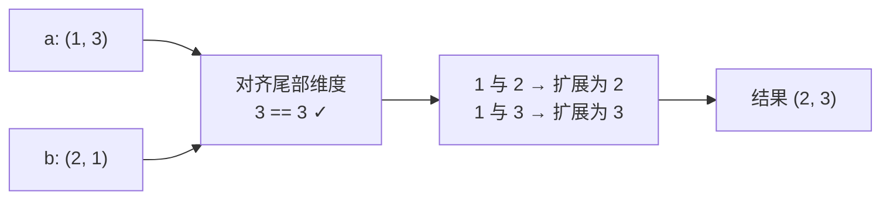
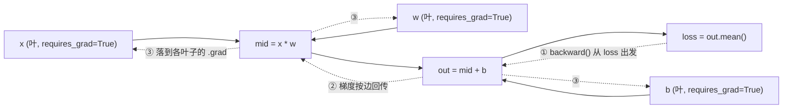

# 03-1 张量与自动微分

| 元信息 | 内容 |
|------|------|
| 所属模块 | 03-PyTorch最小案例（工具层） |
| 篇目 | 03-1 张量与自动微分 |
| 预计时间 | 45-60 分钟 |
| 前置 | 02-2（训练三件套）、02-3 |
| 面试可答一句话摘要 | 张量 = 数组 + 形状 + 自动微分钩子；`backward()` 沿计算图反向传播梯度；PyTorch autograd 与 micrograd 是同一机理（计算图 + 链式法则）的两套实现——一个工程级、一个教学级 |

> 工具层的核心能力：用最短代码验证「梯度在怎么流动」。先把 PyTorch 当计算器玩出感觉，机理（Embedding 为什么有效、相似度怎么服务检索）留到 04。

## 学习目标

- 一句话定义张量，知道它和 JS 数组的本质区别
- 掌握广播的「末尾对齐」规则，能手算任意两个形状能否广播
- 会用 `backward()` 与 `torch.autograd.grad` 求梯度，知道梯度累积与清零
- 能对照 02-2 读过的 micrograd，讲清 autograd 的机理（拓扑序 + 链式法则），给面试加分

---

## 0. 为什么这一篇必须切 Python

大纲原则 2：**能留在 TS 就不切 Python**。但「验证自动微分」这件事恰好是例外——自动微分要求语言能对「数」重载运算符并捕获运算轨迹，JS 的 `+` 无法重载到自定义对象上（`valueOf` 只能返回原始值），所以 TS 生态没有通用的张量自动微分库；transformers.js 定位是「已训练模型的推理」，不构建可训练计算图。因此 03-1 用 Python + PyTorch，03-2 再回到 TS 主场讨论边界。

> 💡 学习姿态：这一篇只回答「梯度怎么算出来」，不回答「神经网络为什么有效」（02 已答）与「Embedding 怎么学出来的」（04 再答）。

## 1. Tensor：最低限度的三个事实

### 1.1 张量是什么

**一句话结论：张量 = 带形状（shape）、统一元素类型（dtype）的 N 维数组 + 可选的求导能力（requires_grad）**。

| 对象 | 形状感知 | 统一 dtype | 广播 | 自动求导 | 加速 |
|------|:--:|:--:|:--:|:--:|:--:|
| JS `Array<number>` | ❌ | ❌ | 手写 | ❌ | ❌ |
| NumPy `ndarray` | ✅ | ✅ | ✅ | ❌ | 部分（BLAS） |
| `torch.Tensor` | ✅ | ✅ | ✅ | ✅ | GPU/CUDA |

展开说三点：

- **形状**：`shape` 是一个元组，如 `(2, 3)` 表示 2 行 3 列。「维数」「轴」「形状」是同一件事的三个说法。
- **dtype**：整型（`torch.long/int64`）与浮点（`torch.float32`）是两类；Embedding 查表只收整型 id，梯度只存在于浮点张量。
- **求导开关**：`requires_grad=True` 的张量会进入计算图——它参与的每一个运算都会被记录，供反向传播使用。

### 1.2 创建张量速查

```python
import torch

torch.tensor([1, 2, 3])          # 从数据直接构造，自动推断 dtype
torch.zeros(2, 3)                 # 全 0，常作初始化的模板
torch.randn(2, 3)                 # 标准正态随机，装模型的初始权重
torch.arange(4.0)                 # [0., 1., 2., 3.]，等差序列
torch.linspace(-1, 1, 20)         # 闭区间 20 个等距点，造模拟数据常用
x = torch.tensor(1.0, requires_grad=True)   # 标量张量 + 打开求导
```

### 1.3 索引、切片与视图

```python
import torch

x = torch.arange(12.0).reshape(3, 4)
print(x.shape)              # torch.Size([3, 4])
print(x[0])                 # 第 0 行 → shape [4]
print(x[:, 1])              # 第 1 列 → shape [3]
print(x.reshape(2, 6))      # 改形状，返回视图（共享底层数据）
```

⚠️ `reshape`/`view` 返回**视图**：改视图会改原张量。要独立副本用 `.clone()`。训练时代码里最常见的坑是把「改数据」和「改视图」混在一起，记住一句：**需要独立拷贝时显式 `.clone()`**。

## 2. 广播（Broadcasting）：NumPy / PyTorch 通用的形状补位规则

### 2.1 规则（与 NumPy 完全一致）

两个张量从**最末尾的维度开始逐维对齐**：

1. 维度相等 → 直接用；
2. 某个维度为 1 或缺失 → 沿该维「复制扩展」到对方长度；
3. 其余情况（都不为 1 且不相等）→ 报错，不能广播。



### 2.2 三个例子（完整可运行）

```python
import torch

# 例 1：标量广播 —— 给每个元素加常数
a = torch.arange(4.0)               # (4,)
b = a + 1.0                         # 1.0 是标量，对 (4,) 每个位置广播
print(b)                            # tensor([1., 2., 3., 4.])

# 例 2：行 + 列 → 网格（RAG 的相似度矩阵就是这种形状）
row = torch.tensor([[1.0, 2.0, 3.0]])   # (1, 3)
col = torch.tensor([[10.0], [20.0]])    # (2, 1)
grid = row + col                        # 广播为 (2, 3)
print(grid)
# tensor([[11., 12., 13.],
#         [21., 22., 23.]])

# 例 3：一维 + 二维 —— (3,) 补成 (1, 3) 再与 (2, 3) 相加
x = torch.zeros(2, 3)                   # (2, 3)
print(x + torch.tensor([1.0, 2.0, 3.0]))  # 每行都加 [1,2,3]
```

### 2.3 不可广播时

```python
import torch

# 尾部对齐：3 vs 2，都不为 1 → RuntimeError，照抄即错（请勿运行）
# torch.tensor([[1., 2., 3.]]) + torch.tensor([1., 2.])
```

广播是写 RAG 代码时最容易产生「莫名形状报错」的源头，遇到 shape mismatch 先画一条尾部对齐线，一眼就能看出谁缺了维度。

> 💡 心智模型：广播 = 编译器替你写 `for` 循环，还不会犯「数组长度写错」的错。TS 里没有广播，手写 `a.map((v, i) => v * b[i % b.length])` 这种取模补位满天飞，正是广播要消灭的 bug 形态。

## 3. 自动微分 autograd

### 3.1 核心概念：计算图

PyTorch 的自动微分机理与 micrograd（02-2 已读）完全同构：

1. **前向**：运算像搭积木一样连成一张有向无环图（DAG），每个节点记下「由谁运算而来」；
2. **反向**：从输出出发，按图的拓扑序倒序，用链式法则把梯度一路传回叶子节点。



### 3.2 requires_grad：叶子的开关

只有 `requires_grad=True` 的**叶子张量**（自己创建的，不是运算产生的）才有 `.grad`。中间节点只有梯度流的义务，不保存梯度。

### 3.3 backward()：算梯度并累积到 .grad（完整可运行）

```python
import torch

# 基本：y = x², x = 2 → dy/dx = 2x = 4
x = torch.tensor(2.0, requires_grad=True)
y = x ** 2
y.backward()
print(x.grad)               # tensor(4.)

# 复合：y = w * x + b 对三个参数分别求导（链式法则的最终形态）
x = torch.tensor(1.0, requires_grad=True)
w = torch.tensor(2.0, requires_grad=True)
b = torch.tensor(3.0, requires_grad=True)
y = w * x + b               # 5
y.backward()
print(x.grad, w.grad, b.grad)   # tensor(2.) tensor(1.) tensor(1.)
# 手算核对：dy/dx = w = 2；dy/dw = x = 1；dy/db = 1
```

⚠️ **backward 是「累积」不是「覆盖」**：连续两次 `backward()` 不清零，`.grad` 会叠加（等效于把两份梯度求和）。训练循环因此有铁律：**更新完参数立刻清梯度**（见 3.5 的 `zero_()`）。

### 3.4 autograd.grad：只要梯度、不落 .grad（完整可运行）

```python
import torch
from torch.autograd import grad

x = torch.tensor(3.0, requires_grad=True)
y = x ** 3                          # 27
g = grad(y, x)                      # 直接返回 dy/dx = 3x² = 27
print(g)                            # (tensor(27.),)
print(x.grad)                       # None —— 注意：不影响叶子
```

| 对比项 | `tensor.backward()` | `torch.autograd.grad` |
|------|------|------|
| 梯度去向 | 累积到叶子的 `.grad` | 作为返回值直接给出 |
| 典型用途 | 训练循环（配合优化器更新参数） | 调试 / 分析某个梯度的值 |
| 多输出 | 非标量需传 `gradient` 参数 | 天然支持多个 `inputs` |

> 两个都记住：训练用 `backward()`，查梯度数值用 `autograd.grad()`。官方参考：[Autograd 教程](https://pytorch.org/tutorials/beginner/blitz/autograd_tutorial.html) / [`Tensor.backward`](https://pytorch.org/docs/stable/generated/torch.Tensor.backward.html) / [`torch.autograd.grad`](https://pytorch.org/docs/stable/generated/torch.autograd.grad.html)。

### 3.5 让梯度不进入计算图：torch.no_grad()

参数更新 `w -= lr * w.grad` 本身也是一个运算；如果它也被记录进计算图，梯度会「对梯度求导」，图越来越大。铁律：**更新参数必须包在 `with torch.no_grad():` 里**。`detach()` 是同一件事的单张量版（拿一个「断了勾」的副本）。

## 4. micrograd vs PyTorch autograd：同一机理的两套实现

02-2 已逐行读过 micrograd。它的全部秘密只有两个数据结构：`_prev`（图的前驱）+ `_backward`（局部导数闭包），加上一个拓扑排序的 `backward()`。下面是等价于官方源码的完整可运行核心（约 30 行）：

```python
class Value:
    """只保留加减乘与 ReLU 的最小编程自动微分（与 micrograd 官方等价的复述）"""
    def __init__(self, data, _children=(), _op=''):
        self.data = data
        self.grad = 0
        self._backward = lambda: None      # 默认空操作（叶子）
        self._prev = set(_children)        # 计算图的前驱节点
        self._op = _op                     # 产生本节点的算子（调试用）

    def __add__(self, other):
        other = other if isinstance(other, Value) else Value(other)
        out = Value(self.data + other.data, (self, other), '+')
        def _backward():                   # dz/dself = 1, dz/dother = 1
            self.grad += out.grad
            other.grad += out.grad
        out._backward = _backward
        return out

    def __mul__(self, other):
        other = other if isinstance(other, Value) else Value(other)
        out = Value(self.data * other.data, (self, other), '*')
        def _backward():                   # dz/dself = other, dz/dother = self
            self.grad += other.data * out.grad
            other.grad += self.data * out.grad
        out._backward = _backward
        return out

    def relu(self):
        out = Value(0 if self.data < 0 else self.data, (self,), 'ReLU')
        def _backward():                   # 正区间导数为 1，负区间为 0
            self.grad += (out.data > 0) * out.grad
        out._backward = _backward
        return out

    def backward(self):
        # 拓扑排序：保证每个节点的 _backward 只在其全部前驱之后执行
        topo, visited = [], set()
        def build(v):
            if v not in visited:
                visited.add(v)
                for child in v._prev:
                    build(child)
                topo.append(v)
        build(self)
        self.grad = 1                      # 输出对自身的导数为 1
        for v in reversed(topo):
            v._backward()


# 使用：z = x * y + 2 → dz/dx = y = 3, dz/dy = x = 2
x = Value(2.0)
y = Value(3.0)
z = x * y + 2
z.backward()
print(z.data, x.grad, y.grad)   # 8.0 3.0 2.0 —— 与第 3.3 节的 PyTorch 输出完全同构
```

对照结论（面试直接可用）：

| 维度 | micrograd（02-2 已读） | PyTorch autograd（本篇） |
|------|----------------------|--------------------------|
| 数据单位 | 标量 `Value` | 张量 `Tensor`（含向量 / 矩阵 / 批量） |
| 局部导数 | 每个算子手写 `_backward` 闭包 | 引擎内置数百个算子的反向规则（C++ 实现） |
| 计算图 | 纯 Python 对象 + `_prev` 集合 | C++ 引擎 + `grad_fn`，Python 侧只暴露接口 |
| 求导方式 | 拓扑排序后逐个执行 `_backward` | 同一「拓扑序 + 链式法则」，但按张量导数（雅可比）传播 |
| 梯度累积 | `+=` 累积到 `Value.grad` | `+=` 累积到 `Tensor.grad`（同样需要清零） |
| 规模 | 教学，~100 行 | 工程级，GPU 加速、算子覆盖全 |

**一句话总结**：PyTorch autograd = 把 micrograd 的标量 `_backward` 替换成张量级、算子全覆盖、C++ 加速的实现；机理一字不差。源码靶子在这里完成了它的使命——同一个「反向传播」，你见过最短与最全的两套实现。

> 深度边界（大纲 §9）：本模块到「能读懂两套实现、知道梯度怎么流」为止。手写深度学习框架不在范围内。

## 5. 完整案例：autograd 训练一个线性回归（10 行核心）

用最小闭环验证「张量 + 计算图 + 梯度下降」三件套：

```python
import torch

torch.manual_seed(0)

# 模拟数据：真值 y = 2x + 1，20 个采样点
x = torch.linspace(-1, 1, 20)
y = 2.0 * x + 1.0

# 要学习的参数（叶子，requires_grad=True）
w = torch.tensor(0.0, requires_grad=True)
b = torch.tensor(0.0, requires_grad=True)

# 训练 100 步：前向 → backward → 更新参数（no_grad）→ 清梯度
for step in range(100):
    pred = w * x + b                      # 前向：广播 + 线性
    loss = ((pred - y) ** 2).mean()       # 损失：均方误差
    loss.backward()                       # 反向：梯度入 w.grad / b.grad

    with torch.no_grad():                 # 更新不进计算图
        w -= 0.1 * w.grad
        b -= 0.1 * b.grad
        w.grad.zero_()                    # 清零，避免累积
        b.grad.zero_()

    if step in (0, 50, 99):
        print(f"step {step:3d}  loss={loss.item():.4f}  w={w.item():.4f}  b={b.item():.4f}")

# 示例输出（torch 2.13 CPU 实测；数值随 torch 版本略有浮动，但趋势确定）：
# step   0  loss=2.4737  w=0.1474  b=0.2000   ← 打印发生在第一次参数更新之后
# step  50  loss=0.0007  w=1.9597  b=1.0000
# step  99  loss=0.0000  w=1.9991  b=1.0000
```

这就是「训练」的全部骨架：**前向算出损失 → backward 让梯度流到参数 → no_grad 里沿负梯度迈一步 → 清梯度，循环**。后续所有模型（包括 05 的 nanoGPT）的 `loss.backward()` + `optimizer.step()` 都是这个模式的封装。

## 6. 实践练习

### 练习 1：用手算对照验证 autograd

**要求**：写一小段 PyTorch，用 `backward()` 求 $z = x^2 + 3xy + y^2$ 在 (x=1, y=2) 处对 x、y 的梯度，并与手算的偏导公式对照。

**提示**：手算 $\partial z/\partial x = 2x + 3y$，代入 (1, 2) 得 8；$\partial z/\partial y = 3x + 2y$ 得 7。代码里记得 x、y 都要 `requires_grad=True`，且 `z.backward()` 前 z 必须是标量——用 `z.sum()`（本例天然是标量）。
先只求一个点；再换一个点，确认梯度随位置变化（这正是「梯度是函数不是常数」的直觉）。

**预期效果**：`x.grad` 与手算一致（8.0），`y.grad` 与手算一致（7.0）；能对同事讲清「autograd 的输出永远可以用手算/符号求导交叉验证」。

### 练习 2：把 micrograd 换成 PyTorch 重跑同一个式子

**要求**：把第 4 节 micrograd 的示例（z = x * y + 2）改用 PyTorch 实现，并打印三者的梯度，输出应数值一致。

**提示**：PyTorch 版把 `Value(2.0)` 换成 `torch.tensor(2.0, requires_grad=True)`，`z.backward()` 后分别打印 `x.grad` / `y.grad`。注意 Python 的 `*` 与 `+` 在两种实现下都触发了对应的 `__mul__` / `__add__`——这是「机理相同」最直观的旁证。

**预期效果**：两个实现输出完全一致（`x.grad=3.0, y.grad=2.0`），能现场画出小小的计算图并指出 forward/backward 两条路径。

---

## 7. 对比板块：PyTorch autograd vs micrograd vs 手写梯度（基线）

| 维度 | PyTorch autograd | micrograd | 手写梯度（NumPy 基线） |
|------|------------------|-----------|------------------------|
| 代码量 | 依赖库（内置全算子） | ~100 行 | 每个公式手写一份 |
| 支持算子 | 数百个（张量级） | 加减乘除 / ReLU（标量） | 视你写了几个 |
| 改写公式成本 | 零（自动记录） | 每加一个算子写一个 `_backward` | 改公式 = 重推导数 + 重写代码 |
| 易错点 | 梯度累积忘清零 | 同左 | 导数公式写错（最常见、最难查） |
| 适用 | 生产与实验默认选它 | 教学 / 玩具 | 永远不建议（错误率高） |

> 选型结论：手写梯度是「先证明你有这个能力」的基线；micrograd 是「看机理」的放大镜；PyTorch 是「动手验证一切 DL 想法」的默认工具。三者的演进关系本身就是一条面试可讲的选型故事。

---

## 8. 面试问答

> **问：张量和普通数组（比如 JS 的 number 数组）有什么区别？**
>
> **答：** 三点。一是**形状与 dtype**：张量是带 shape 元组、统一元素类型的 N 维数组，运算自动对齐形状（广播），而 JS 数组需要手写循环且没有类型约束；二是**计算加速**：张量运算可跑在 GPU 上；三是**自动微分**：`requires_grad=True` 的张量参与运算时会被记录进计算图，`backward()` 能自动算出它对损失的梯度。前两点是工程便利，第三点是深度学习的基石。

> **问：backward() 和 torch.autograd.grad 有什么区别？什么时候用哪个？**
>
> **答：** `backward()` 把梯度**累积**到叶子张量的 `.grad` 属性上，是训练循环的主角（之后优化器读 `.grad` 更新参数）；`autograd.grad` 直接把梯度作为返回值给出、不写 `.grad`，用于调试或单独分析某个中间量的梯度。还有一个细节：`backward` 在非标量输出上必须显式传 `gradient` 参数（指定「输出」相对「谁」求导的权重）。默认两者算完都会释放计算图，需要二次反向时传 `retain_graph=True`。

> **问：为什么深度学习框架都强调「梯度要先清零」？**
>
> **答：** 因为框架的梯度是**累积**语义（`grad += 新梯度`），设计目的是一次图传播服务多个输出。训练循环里若不清零，上一次 step 的梯度会叠加进本次更新，等效于随机放大学习率，收敛会乱。所以标准循环是：`loss.backward()` → 更新参数 → `optimizer.zero_grad()`（或 `grad = None`），三步缺一不可。

---

## 参考链接

- [PyTorch autograd 官方教程](https://pytorch.org/tutorials/beginner/blitz/autograd_tutorial.html)（一级来源，与本文 3.x 节对照阅读）
- [torch.Tensor.backward 官方文档](https://pytorch.org/docs/stable/generated/torch.Tensor.backward.html)
- [torch.autograd.grad 官方文档](https://pytorch.org/docs/stable/generated/torch.autograd.grad.html)
- [PyTorch 广播语义（官方）](https://pytorch.org/docs/stable/notes/broadcasting.html)
- [micrograd 源码靶子（karpathy）](https://github.com/karpathy/micrograd)