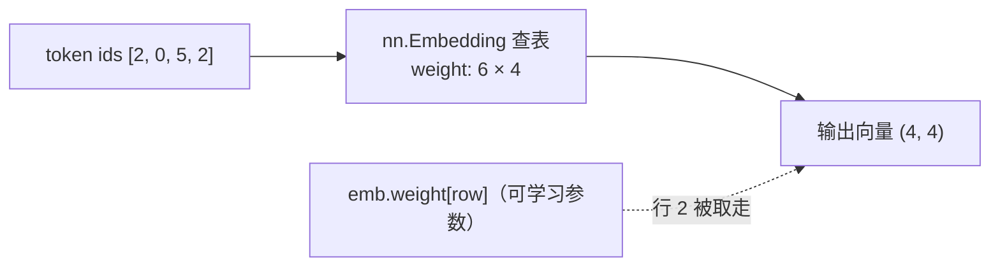
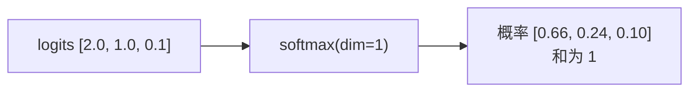
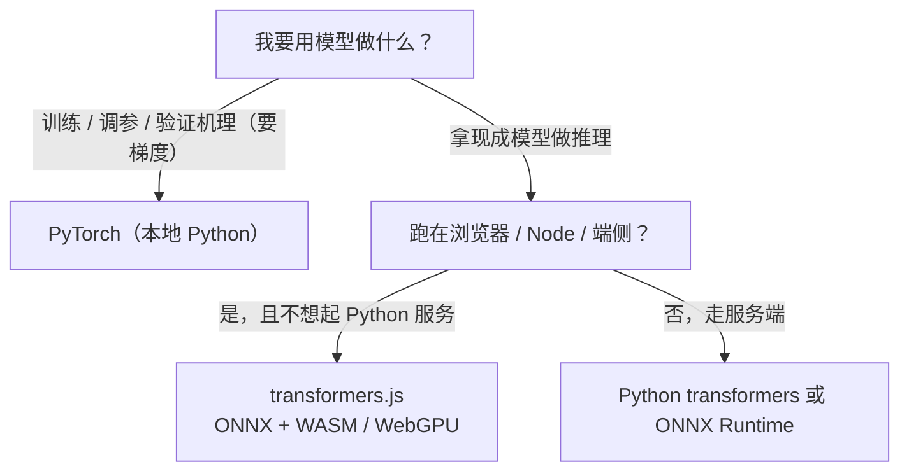

# 03-2 三个最小案例与 TS 边界

| 元信息 | 内容 |
|------|------|
| 所属模块 | 03-PyTorch最小案例（工具层） |
| 篇目 | 03-2 三个最小案例与 TS 边界 |
| 预计时间 | 45-60 分钟 |
| 前置 | 03-1（张量与自动微分） |
| 面试可答一句话摘要 | Embedding 层是一张可学习查表（id → 向量）；softmax 把评分变成和为 1 的概率分布；cosine 度量方向相似、对向量长度不敏感；本地实验 / 训练用 PyTorch，已训练模型的浏览器 / Node 推理用 transformers.js |

> 工具层的验收标准：3 个「10 行案例」脱离教程能重写，并讲得清「每个算子在 RAG/Agent 里干什么」。机理（Embedding 怎么学出来、相似度为什么有效）一律留到 04。

## 学习目标

- 三个 10 行案例各自独立重写：Embedding 查表、softmax 归一化、cosine 相似度
- 每个案例都能回答「这对我的 RAG / Agent 有什么用」
- 能给出 PyTorch vs transformers.js 的选型结论（三条判断依据，不背文档）

---

## 0. 三个案例的共同套路

每个案例都按同一套路呈现：**机理一句话 → 10 行代码跑通 → 输出长什么样 → 落回你的应用场景**。不要在案例阶段深挖公式，那是 04 的事。

## 1. 案例一：nn.Embedding 查表（10 行）

**机理一句话**：Embedding 层 = 一张可学习的大表（形状 `词表大小 × 向量维度`）；输入整数 token id，输出对应那一行向量。它「查表」而非「计算」，所以这是模型里最便宜的操作之一。

```python
import torch
import torch.nn as nn

# 词汇表 6 个词，每个词一个 4 维向量 → 表形状 (6, 4)
emb = nn.Embedding(num_embeddings=6, embedding_dim=4)

# 一句话的 token id 序列 → 逐 id 查表
ids = torch.tensor([2, 0, 5, 2], dtype=torch.long)
vectors = emb(ids)                              # (4 个 token) → (4, 4)

print(vectors.shape)                            # torch.Size([4, 4])
print(torch.equal(vectors[0], emb.weight[2]))   # True：查表 = 取 weight 第 2 行
```



输出里最后一行是关键：`emb.weight` 就是那张表本身，查表就是取行。训练时反向往这张表回传梯度，让「上下文相似的 token 向量靠近」——这是训练目标，机理 04 讲。

**对 RAG / Agent 有什么用**：RAG 检索链路中的向量索引、Agent 工具描述的「token 化」都需要先经查表拿到向量；Embedding 层的存在意味着「id → 向量」是模型自己学出来的，不是人写的规则。

> 💡 两个常用参数顺带记住：`padding_idx`（指定 id 不参与梯度，固定为 0 向量）与 `nn.Embedding.from_pretrained(权重)`（用现成向量初始化再做查表）。官方文档：[nn.Embedding](https://pytorch.org/docs/stable/generated/torch.nn.Embedding.html)。

## 2. 案例二：softmax 归一化（10 行）

**机理一句话**：softmax 把任意一组实数评分（logits）变成一组**和为 1 的非负概率**，同时保持原来的大小排序，并放大「差距大」的项。

```python
import torch

# 两行 logits：一行代表一个候选集
logits = torch.tensor([[2.0, 1.0, 0.1],
                       [1.0, 3.0, 2.0]])

probs = torch.softmax(logits, dim=1)            # 沿第 1 维（每一行）归一化
print(probs)
# tensor([[0.6590, 0.2424, 0.0986],
#         [0.0900, 0.6652, 0.2447]])
print(probs.sum(dim=1))                         # tensor([1.0000, 1.0000])
```



验证方法（手算一遍就有直觉）：$\text{softmax}(x)_i = \frac{e^{x_i}}{\sum_j e^{x_j}}$，第一行 $e^2 / (e^2 + e^1 + e^{0.1}) \approx 7.39 / 11.21 \approx 0.66$。`torch.softmax` 内部已做「减最大值偏移」，数值稳定，不需要自己写 `exp(x)/sum(exp(x))`。

**对 RAG / Agent 有什么用**：二选一的场景（LLM 输出分类、打分排序、采样）都需要把「谁更可能是答案」变成「可比较的概率」。05 讲 temperature 采样时，你会看到 LLM 输出就是这么来的：先 softmax 成分布，再按概率采样。

## 3. 案例三：cosine 相似度（10 行）

**机理一句话**：cosine 衡量两个向量「方向有多像」，只看夹角、不看长度。$\cos(\theta) = \frac{a \cdot b}{\|a\| \cdot \|b\|}$，取值 [-1, 1]，1 表示方向完全一致。

```python
import torch
import torch.nn.functional as F

q = torch.tensor([1.0, 0.0, 1.0])               # 查询向量（比如用户问题）
docs = torch.tensor([[1.0, 1.0, 0.0],           # 候选文档 1
                     [1.0, 1.0, 1.0]])          # 候选文档 2

scores = F.cosine_similarity(q.expand(2, 3), docs, dim=1)  # 逐行算相似度
print(scores)                                   # tensor([0.5000, 0.8165])

# 3 行手工版（面试常考，背下来）：点积 / (模长之积)
def cos(a: torch.Tensor, b: torch.Tensor) -> torch.Tensor:
    return (a @ b) / (a.norm() * b.norm())

print(cos(q, docs[1]))                          # tensor(0.8165)
```

手算验证：q 与文档 2 点积 = 1·1 + 0·1 + 1·1 = 2；模长 $|q| = \sqrt{2}$、$|d_2| = \sqrt{3}$；$2 / (\sqrt{2}\sqrt{3}) \approx 0.8165$。

**对 RAG / Agent 有什么用**：RAG 的「查询 → top-k 文档」就是 query 向量与每个 chunk 向量算 cosine 再排序——这是检索链路的心脏。为什么选 cosine 而不是欧氏距离？因为文本向量经常被归一化，且我们关心「语义方向」而不是「向量长度」（长度受句子长短、写法影响，与语义无关）；这条结论在练习里你会亲手验证，04-2 再展开。

> 💡 批量形状提醒：`F.cosine_similarity(x1, x2, dim=1)` 要求 x1、x2 前 N-1 维可广播，输出在该 dim 上被 squeeze。想一次对 K 个文档打分，把 docs 堆成 `(K, D)`、query 用 `expand` 复制成 `(K, D)` 即可，官方文档：[F.cosine_similarity](https://pytorch.org/docs/stable/generated/torch.nn.functional.cosine_similarity.html)。

## 4. 串起来：10 行迷你检索

三个算子分开看是玩具，合起来就是 RAG 检索的最小骨架。下面这段完全可运行——查表 → 朴素的 mean pooling → 全量 cosine 打分 → top-k，就是向量检索的全部：

```python
import torch
import torch.nn as nn
import torch.nn.functional as F

torch.manual_seed(0)

# 语料：5 句「句子」，每句是 4 个 token id（0 留作 padding）
vocab, dim = 8, 4
emb = nn.Embedding(vocab, dim)
sentences = torch.tensor([
    [1, 2, 3, 0],   # 句 0 —— 查询句
    [2, 1, 3, 0],   # 句 1
    [4, 5, 0, 0],   # 句 2
    [6, 5, 4, 0],   # 句 3
    [1, 2, 7, 0],   # 句 4 —— 与句 0 共享 token 1、2
])

vecs = emb(sentences)                # ① 查表： (5, 4, 4)
doc_vecs = vecs.mean(dim=1)          # ② 平均成句向量： (5, 4)
q = doc_vecs[0:1]                    # 查询句的向量： (1, 4)
scores = F.cosine_similarity(q.expand(5, 4), doc_vecs, dim=1)  # ③ 逐句打分
print(scores)                        # tensor([1.0000, 1.0000, -0.1395, -0.2562, 0.9201])
top2 = torch.topk(scores, 2)
print(top2.indices)                  # tensor([0, 1])
```

真实输出（torch 2.13 实测）里有三个值得记下的点：

1. **`scores[0] == 1.0`**：向量与自己 cosine 必为 1，这是检验「打分代码写对没有」的免费测试；
2. **`scores[1] == 1.0` 是个陷阱**：句 1（[2,1,3,0]）与句 0（[1,2,3,0]）是同一批 token 的**排列组合**，而 mean pooling 是对所有 token 向量求平均——平均与顺序无关，两句话的句向量因此完全相同。朴素平均抹掉了位置信息，这是它最大的硬伤，也是 04-05 里「注意力（可学习的加权平均）」登场的动机；
3. **句 4 得 0.92、句 2/3 得负分**：与查询共享 token 越多越接近，毫无关联的句子分数趋近于 0 甚至为负——检索按分数排序就能取出「语义相近」的候选。

数组读数：top-2 = [句 0 自身, 句 1 排列组合] ≈ 并列第一，句 4 第三。到此，「为什么检索能命中相似内容」已被压缩到 10 行之内；04 会把每句换成真实 BPE 分词与预训练向量，并把 mean pooling 升级成带学习的聚合，原理不变。

> 💡 这段代码同时是 03-2 验收的缩影：Embedding 查表会用 → softmax/cosine 会用 → 组合成检索雏形 → 机理细节留给 04。全部脱离教程重写一遍，本模块就算过。

## 5. TS 边界：何时 PyTorch、何时 transformers.js

三个案例跑通后，回到大纲原则 2 的落点：**推理留在 TS 主场，训练与机理验证才切 Python**。

### 5.1 两句话定位

- **PyTorch**：本地「最小实验」与「训练」工具——你要梯度、要改模型、要验证机理时用它。
- **transformers.js**：把**现成的、已训练好的**模型在浏览器 / Node 里跑推理——不需要 Python 服务端，模型以 ONNX 格式加载，用 WASM（默认 q8 量化）或 WebGPU 执行。[transformers.js 官方文档](https://huggingface.co/docs/transformers.js) 明确其与 Python transformers 保持 API 同级（同一批模型、同样的 `pipeline`）。

### 5.2 判断依据（三条）

| 判断问题 | 答案 → 工具 |
|---------|------------|
| 我要不要梯度 / 改模型 / 做训练？ | 要 → **PyTorch**（transformers.js 不提供训练） |
| 模型是不是已经训练好的？ | 是 → 看下一条 |
| 跑在哪里？要不要免后端？ | 浏览器 / Node / 端侧 → **transformers.js**；重型 GPU 服务端 → Python transformers 或 ONNX Runtime |



### 5.3 完整可运行示例：transformers.js 跑句子相似度

和 5.2 的选型逻辑对照：模型现成（all-MiniLM-L6-v2）、跑在 Node、不需要梯度——三个条件全中，TS 主场解决（这一步就是阶段 1 里 LangChain 向量化的底层等价物）：

```bash
bun add @huggingface/transformers
```

```ts
import { pipeline, type Tensor } from '@huggingface/transformers'

// 首次运行会下载 ONNX 权重（约 25MB），之后走本地缓存
const extractor = await pipeline('feature-extraction', 'Xenova/all-MiniLM-L6-v2')

// 每句 → mean pooling → 1 个 384 维句向量（pooling 是官方 pipeline 参数）
const va = (await extractor('猫和狗打架', { pooling: 'mean' })) as Tensor
const vb = (await extractor('猫咪大战狗狗', { pooling: 'mean' })) as Tensor

const toArr = (t: Tensor) => Array.from(t.data as Float32Array) // data 即权重数组
const dot = (x: number[], y: number[]) => x.reduce((s, v, i) => s + v * y[i]!, 0)
const norm = (v: number[]) => Math.sqrt(v.reduce((s, x) => s + x * x, 0))
const cos = (x: number[], y: number[]) => dot(x, y) / (norm(x) * norm(y))

console.log(cos(toArr(va), toArr(vb))) // 越接近 1 语义越近；All-MiniLM-L6-v2 对中文同义句对一般落在 0.7-0.9，首次运行时请记录实际分数
```

等价结构写在脚下：PyTorch 版是「加载权重 → token id → 查表 → pooling → cosine」，transformers.js 版把前三步封装进了 `pipeline`，你只需要给两个句子。**这正是「一个概念回答三个问题」在工程侧的答案：机理用 Python 验证过，落地上 TS。**

## 6. 工具层到此为止，机理留给 04

按大纲：03 模块的定位是「**工具层先玩出感觉，机理留到 04 讲**」。此刻你应该能：

- 不查资料重写上面三个案例（API 速查表允许）；
- 讲出每个算子在 RAG 链路里的位置（查表 → 向量 / softmax → 概率 / cosine → 打分）；
- 面对「这个推理要不要 Python」能 10 秒内给出选型。

**还不需要回答**（留到 04）：BPE 怎么把句子切成 id、Embedding 的训练目标细节、稠密 vs 稀疏向量、为什么 cosine 在混合检索里更稳。03 到 04 的递进是「工具 → 机理」，不是「会 → 不会」。

## 7. 实践练习

### 练习 1：cosine vs 欧氏距离，亲手找到分叉点

**要求**：用 torch 3 行实现 cosine；拿同一对文本向量分别算 cosine 与欧氏距离，观察两者排序是否一致，并解释差异。

**提示**：核心只有 4 行，起点如下（自行补全句子向量即可运行，属于练习提示，请勿当作完整代码）：

```python
import torch

def cos(a: torch.Tensor, b: torch.Tensor):
    return (a @ b) / (a.norm() * b.norm())     # 点积 / 模长之积
# 欧氏距离对照：(a - b).norm()
```

三条实验路径，按顺序做：
1. **同一长度**：构造 A = [1, 0, 0]、B = [0, 1, 0] 与 A′ = [1, 0.1, 0]、B′ = [0.1, 1, 0]，两种度量的相对大小一致（距离显示为「方向」）；
2. **换长度**：把 B 整体乘以 10（长度变长、方向不变），欧氏距离显著变大，cosine 几乎不变——排序在此刻分叉；
3. **落到场景**：对照解释「为什么文本检索普遍选 cosine」。

**预期效果**：能回答「为什么文本检索常选 cosine（对向量长度不敏感）」；能举出反例——当向量长度本身携带信息（如「较长文本往往更详尽」）且你希望保留该信息时，欧氏距离才有存在意义。

### 练习 2：把案例三改成「一批候选」打分

**要求**：把案例三扩展成「1 个 query 对 10 个候选文档一次打分并取 top-3」；再把它改写为 TypeScript 版本（手写 cosine，接受 `number[][]` 或 Float32Array）。

**提示**：PyTorch 侧用 `torch.stack` 或 `expand` 把 query 复制成 `(10, D)` 再调 `F.cosine_similarity(..., dim=1)`；TS 侧先确认 `Float32Array` 与 `number[]` 的索引差异再动手。top-3 用 `torch.topk`。

**预期效果**：PyTorch 版与 TS 版输出同样的 top-3 顺序——直接回答「为什么工具层学完，落地还是 TS」（03-2 的验收表述）。

---

## 8. 对比板块：PyTorch vs transformers.js vs 手写 JS（基线）

| 维度 | PyTorch（本地实验） | transformers.js（浏览器 / Node 推理） | 手写 JS（基线） |
|------|--------------------|--------------------------------------|----------------|
| 定位 | 训练 / 调参 / 机理验证 | 现成模型推理 | 十行级教学 / 无依赖兜底 |
| 是否有梯度 | ✅ 完整 autograd | ❌（ONNX 推理图） | ❌ |
| 宿主 | Python 进程 | 浏览器 WASM/WebGPU、Node | 任意 JS 环境 |
| 模型来源 | 自己训练或加载 `.pt` | Hugging Face Hub 的 ONNX 权重（Optimum 转换） | 无（自己写公式） |
| 部署成本 | 需 Python 运行时（重） | 零后端、静态可分桶（轻） | 零依赖（最轻） |
| 一句话选型 | 要动模型 → 它 | 只跑现成模型 → 它 | 演示公式原理时才写 |

> 共性结论：三者不是替代关系而是「同一套数学，三种距离」——手写 JS 证明你会公式，PyTorch 证明你能改模型，transformers.js 证明你能把模型送进产品。RAG 工程师的日常是第一条链路的 PyTorch 实验 + 最后落地走 transformers.js（或远程 embedding API）。

---

## 9. 面试问答

> **问：Embedding 层训练出来的是什么？**
>
> **答：** 一张可学习的查表（每个 token 一行向量）。初始化是随机的，训练目标让「上下文相似的 token 向量相近」——loss 反向传播只更新被用到的行。推理时按 token id 查出对应向量，查表本身没有计算。与之配套的常识：Embedding 层参数量 = 词表大小 × 维度，是非 Transformer 层之外最大的参数来源之一；`padding_idx` 指定的 id 不参与梯度更新。

> **问：为什么打分（logits）之后要过 softmax？**
>
> **答：** 三个原因。一是**归一化成概率**：任何一组实数分数都能变成和为 1、非负的分布，方便比较、设阈值、做采样；二是**可导**：softmax 处处可导，梯度能顺利回传（而 argmax 不可导，没法训练）；三是**拉开差距**：指数运算放大了高分与低分的差异，让「次优选项」清晰可见。temperature 也是作用在这一步（对 logits 缩放再 softmax），这是 05 讲采样时的连接点。

> **问：什么时候用 PyTorch，什么时候用 transformers.js？**
>
> **答：** 先问三件事。**要梯度吗**——训练 / 调参 / 验证机理必须 PyTorch，transformers.js 只做推理；**模型现成吗**——现成预训练的才谈得上 transformers.js，否则得先在 PyTorch 侧得到权重；**跑在哪**——浏览器 / Node / 不想起 Python 服务就 transformers.js（ONNX + WASM/WebGPU），重型服务端推理可选 Python transformers 或 ONNX Runtime。核心判断就一条：**能不能留在 TS 主场（大纲原则 2），取决于你需不需要动模型本身。**

---

## 参考链接

- [PyTorch nn.Embedding 官方文档](https://pytorch.org/docs/stable/generated/torch.nn.Embedding.html)
- [torch.softmax 官方文档](https://pytorch.org/docs/stable/generated/torch.softmax.html)
- [torch.nn.functional.cosine_similarity 官方文档](https://pytorch.org/docs/stable/generated/torch.nn.functional.cosine_similarity.html)
- [transformers.js 官方文档](https://huggingface.co/docs/transformers.js)（推理端选型的二级来源按官方为准）
- [PyTorch autograd 官方教程](https://pytorch.org/tutorials/beginner/blitz/autograd_tutorial.html)（03-1 同源，供原理回查）