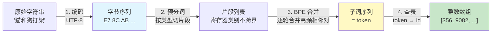

# 01 分词与 BPE：从文本到 token id

| 元信息 | 内容 |
|------|------|
| 所属模块 | 04-NLP基础（领域层） |
| 篇目 | 04-1 分词与 BPE |
| 预计时间 | 45-60 分钟 |
| 前置 | 03-2（三个最小案例与 TS 边界） |
| 面试可答一句话摘要 | 一句话讲清 Tokenizer 的完整管线——「预分词 → 逐轮合并最高频相邻子串（BPE）→ 查表得 id」，以及为什么 BPE 让任意 UTF-8 文本都能有 id（无 OOV） |

> 本篇是 04 模块「文本如何被机器理解」的第一环：**Tokenization**。以 [minbpe](https://github.com/karpathy/minbpe)（karpathy 的 BPE 最小实现）为源码靶子，对照 [tiktoken](https://github.com/openai/tiktoken)（OpenAI 官方），逐段读核心循环，弄懂「文本 → 字节 → 子词 → token id」的整条流水线，并回答面试高频问题：**BPE 怎么消灭 OOV**。前置：03-2（Embedding 查表、softmax、cosine 三个最小案例已跑通）。

## 学习目标

- 画得出「字符串 → UTF-8 字节 → BPE 合并 → token id」四层映射，讲清每层存在的理由
- 不看任何资料，手写 `get_stats + merge` 主循环，跑通「aaabdaaabac + 3 次合并 = XdXac」
- 能解释正则预分词（RegexTokenizer）与 special token（`allowed_special`）各自防什么
- 用「字节兜底」一句话回答「为什么 BPE 无 OOV」，并指出残留的「OOV 感」来自哪里

---

## 1. 全景：文本到 token id 的四层映射

LLM 的输入不是字符串，是**整数数组**。字符串到 id 之间隔着四层，每层解决一个问题：



| 层 | 输入 → 输出 | 解决什么问题 | 谁在做 |
|----|------------|--------------|--------|
| 1. 字节编码 | 字符串 → UTF-8 字节 | 让任意语言（含表情）都能进系统 | `"猫".encode("utf-8")` → `b'\xe7\x8c\xab'` |
| 2. 预分词 | 字节 → 片段 | 禁止「跨类型」合并（字母/数字/标点各归各） | 正则（GPT-2 起沿用至今） |
| 3. BPE 合并 | 片段 → 子词 | 把高频相邻子串「焊」成一个 token，压缩序列 | 统计相邻对频率 + 合并（本篇主题） |
| 4. 查表 | 子词 → id | 变成模型吃得到的整数 | tokenizer 的 vocab（字符串 → id 映射） |

> 💡 记住 1 和 4 是**纯映射**（无学习），2 和 3 才是 tokenizer 的「参数」：**预分词正则 + 合并规则表（merges）**，它们决定了一个模型「怎么切文本」。

---

## 2. 三种切分粒度：词 / 字符 / 子词

为什么不用最直观的「按词切」？三个选项各踩一个坑：

| 方案 | 做法 | 致命伤 | 例子（"cat 和 cats"） |
|------|------|--------|----------------------|
| 词切分（word-level） | 空格外加字典查词 | **OOV 爆炸**：生词、拼写变体、网络新词全是未知 token | "cats" 不在字典 → `<unk>`，语义信息直接丢失 |
| 字符切分（character-level） | 每个字符一个 token | **序列太长**：一篇文档的 token 数放大 4-10 倍，训练/推理成本线性上升 | 一个英文句子被拆成十几个字符 |
| **子词切分（subword）** | 高频组合合并成 token，低频词碎片化，高频词一个整 token | 无致命伤，只有参数（词表大小、语料） | "cats" = "cat" + "s"；"cat" 本身是整 token |

子词切分拿到了「词的容量」和「字符的弹性」的双份好处：

- **高频组合**（" the"、"ing"、常用中文词）被合并成整 token → 序列短、训练快
- **低频/生词**被拆成已知子串 → 永远有 id，无 OOV
- 中文里等价于「词 vs 字」之争的工程化解：**让数据自己决定切多粗**

BPE、WordPiece、Unigram 是三种主流的子词算法（对比见 §8），GPT 系用 BPE。

---

## 3. BPE 步进直觉：逐轮合并最高频相邻对

### 3.1 算法只有两步循环

BPE（Byte Pair Encoding）在 NLP 中的用法，核心就一个动作：**统计当前序列里所有相邻对的频率，把最高频的那一对合并成一个新 token，重复 N 次**（$N \approx$ 词表大小 $- 256$）。频率越高 → 越早被合并 → 越像一个「词」。

看这个几乎照搬 minbpe 微型演示（可独立跑通）：

```python
# mini_bpe.py —— 完整的 BPE 核心循环：不需要任何第三方库，python3 mini_bpe.py 直接跑

def get_stats(ids):
    """统计相邻对的频率。ids: 整数列表"""
    counts = {}
    for pair in zip(ids, ids[1:]):
        counts[pair] = counts.get(pair, 0) + 1
    return counts

def merge(ids, pair, idx):
    """把序列中所有 'pair' 相邻对替换成新 token 的 id 'idx'（原地重建）"""
    newids, i = [], 0
    while i < len(ids):
        if i < len(ids) - 1 and ids[i] == pair[0] and ids[i + 1] == pair[1]:
            newids.append(idx)
            i += 2
        else:
            newids.append(ids[i])
            i += 1
    return newids

text = "aaabdaaabac"
ids = [ord(c) for c in text]          # 字符 -> ASCII 码（本演示省去 UTF-8 字节层）
print("初始 ids:", ids)
for step in range(3):                 # 只做 3 次合并
    stats = get_stats(ids)
    pair = max(stats, key=stats.get)  # 最高频相邻对
    idx = 256 + step                  # 新 token 的 id 从 256 起顺延（给 256 个字节留位）
    print(f"第{step+1}轮: 最高频 pair={pair}（频次 {stats[pair]}）-> 新 token id={idx}")
    ids = merge(ids, pair, idx)
```

实测输出（本机 Python 3.13 —— 与 minbpe README 的结果完全一致）：

```text
初始 ids: [97, 97, 97, 98, 100, 97, 97, 97, 98, 97, 99]
第1轮: 最高频 pair=(97, 97)（频次 4）-> 新 token id=256
第2轮: 最高频 pair=(256, 97)（频次 2）-> 新 token id=257
第3轮: 最高频 pair=(257, 98)（频次 2）-> 新 token id=258
最终: [258, 100, 258, 97, 99]  即 "XdXac"（X = 257+98 的复合）
```

### 3.2 逐轮解读：注意「合并是嵌套的」

- 第 1 轮：`(a,a)` 出现 4 次最多 → 合并为 256，序列从 11 个字符缩到 9 个 id
- 第 2 轮：**新 token 256 也参与统计**（`(256, a)` 出现 2 次）→ 257 = `a a a` 的复合
- 第 3 轮：257 又和 `b` 合并 → 258 = `aaa b`，最终 `XdXac`——这正好是 Wikipedia 对 BPE 的经典例释（$X = YZ$、$Y = ab$、$Z = aa$ 的字节版）

三个「为什么」是第一层验收：

1. **为什么从 256 开始给新 id？** 0-255 预留给所有单字节，保证「任何字节序列都能被表示」——这是 §6 无 OOV 的根基
2. **为什么合并要嵌套？** 子词是递归结构，`a a a b` 先合成 `aaa` 再合成 `aaab`，一个 token 对应多层合并历史
3. **为什么只看相邻对？** 语言是流式的，跨位置的关系由后续的 Transformer 处理，tokenizer 只负责「就近焊合」

---

## 4. 读 minbpe / tiktoken：预分词、主循环与 special token

minbpe 仓库（`minbpe/` 目录）只有 4 个文件，target 就两个类：`BasicTokenizer`（纯 BPE）与 `RegexTokenizer`（先正则预分词再 BPE）。

### 4.1 BasicTokenizer.train()：核心循环教学引用

```python
# 摘自 karpathy/minbpe 仓库 minbpe/basic.py 的 train()（MIT，教学引用，省略统计进度打印等细节）
def train(self, text, vocab_size, verbose=False):
    num_merges = vocab_size - 256          # 256 个字节起步，其余名额全给合并
    ids = list(text.encode("utf-8"))       # 第 1 层：字符串 -> UTF-8 字节
    merges = {}
    for i in range(num_merges):            # 第 2-3 层：循环合并
        stats = get_stats(ids)
        pair = max(stats, key=stats.get)   # 最高频相邻对
        idx = 256 + i
        ids = merge(ids, pair, idx)
        merges[pair] = idx                 # 记录规则：pair -> 新 id
    self.merges = merges
```

这就是 §3 演示的完整形态，没有任何魔法。**encode 是正向查规则（参考 merges 从字节依次合并），decode 是反向替换（新 id → 原始对）**，两者的对称性就是 tokenizer 可逆的保证。

实际用起来（minbpe README 同款，`pip install minbpe` 后可直接跑）：

```python
from minbpe import BasicTokenizer

tok = BasicTokenizer()
tok.train("在中文语料上训练，" * 500 + "aaabdaaabac", vocab_size=309)  # 256 字节 + 53 次合并
encoded = tok.encode("你好，世界")
print(encoded)
print(tok.decode(encoded))   # 还原原文
tok.save("mytok")            # 落盘 mytok.model（加载用）+ mytok.vocab（人看）
```

### 4.2 预分词：为什么 GPT-2 之后都要先切一刀

纯字节 BPE 有个尴尬：**合并会跨「类型」乱焊**——标点、数字、字母混成一个 token。GPT-2 引入正则预分词，先按类别把文本切成片段，**合并只在片段内部发生**。tiktoken 的 gpt2 / cl100k 模式就是这个设计，`\p{L}` 指字母类：

```python
# 教学简化版：只演示「类别切片」的思想；tiktoken 的完整 pattern 更长更刁钻
# 注意：标准库 re 不支持 \p{L}，需安装 regex 库（pip install regex）
import regex as re

GPT2_SPLIT_SIMPLIFIED = re.compile(r" ?\p{L}+| ?\p{N}+| ?[^\s\p{L}\p{N}]+|\s+")
text = "hello123!!!? (안녕하세요!) 😉"
print(GPT2_SPLIT_SIMPLIFIED.findall(text))
# ['hello', '123', '!!!?', ' (', '안녕하세요', '!)', ' 😉']（7 段：' (' 里前导空格并入标点段，' 😉' 同理）
```

切完片段后，**每个片段内部独立做 BPE**。效果：数字串、标点、emoji、字母词互不干扰，词汇表更「干净」，压缩率更高。GPT-2 / GPT-3 / GPT-4 沿用的都是这条路。

### 4.3 special token：必须显式白名单

`<|endoftext|>` 这类 special token 是**模型协议的一部分**（分隔符、填充、工具调用标记），不能由语料统计出来，只能人工登记：

```python
# minbpe README 同款：词表 32768 时，第一个 special token 的 id 必须是 32768（紧随最后一个 merge）
tok.register_special_tokens({"<|endoftext|>": 32768})
tok.encode("<|endoftext|>hello", allowed_special="all")   # 显式声明：允许解析 special token
tok.encode("<|endoftext|>hello", allowed_special="none")  # 默认：当成普通文本切分
```

> ⚠️ 默认 `allowed_special="none"` 是刻意的**安全设计**：如果 encode 默认解析一切特殊标记，攻击者就能用用户输入注入协议 token（prompt injection 的一种载体）。所以「用户输入永不自动开 special」。

### 4.4 tiktoken：工业界词汇表的直接观测

tiktoken 是 OpenAI 官方 tokenizer（Rust 核心 + Python/JS 绑定），直接查它的词汇表（本地实测数据）：

```python
import tiktoken
enc = tiktoken.get_encoding("cl100k_base")     # GPT-4 / GPT-3.5-turbo 用的编码
print(enc.n_vocab)                             # 实测 100277（约 10 万个 id）
print(enc.eot_token)                           # 100257：<|endoftext|> 的 id
print(enc.encode("hello123!!!? (안녕하세요!) 😉"))
# 实测 [15339, 4513, 12340, 30, 320, 31495, 230, 75265, 243, 92245, 16715, 57037]
```

| 编码 | 词汇表大小（实测） | 用途 |
|------|------------------|------|
| `gpt2` | 50,257 | GPT-2：256 字节 + 50,000 次合并 + 1 个 `<\|endoftext\|>` |
| `cl100k_base` | 100,277 | GPT-3.5 / GPT-4 |
| `o200k_base` | 200,019 | GPT-4o 系列 |

TS 生态线：Node 里可用 `@dqbd/tiktoken`（WASM 版，API 与 Python 对齐），或 `gpt-tokenizer` / `js-tiktoken` 等社区实现；日常「数 token」够用，但与官方实现存在少量版本差异。

```js
// npm i @dqbd/tiktoken（社区 WASM 移植，API 与 Python 版对齐）
import { get_encoding } from '@dqbd/tiktoken'
const enc = get_encoding('cl100k_base')
const ids = Array.from(enc.encode('Node 里数 token 数'))
enc.free() // 释放 WASM 内存
```

---

## 5. 字节级细节：中文 3 字节、空格 trick 与训练语料

三个高频追问的硬核细节：

1. **中文不是「字」而是「字节对」**：`"猫".encode("utf-8")` 是 3 个字节（`E7 8C AB`）。训练语料足够时，常用汉字会被合并成 1 个 token；冷僻字或新造词则落在字节层碎片——这就是「中文 token 昂贵」的根源（同样语义，中文的 token 数往往多于英文）

2. **`_` 空格 trick（GPT-2 起）**：词表里单词前带前导空格（如 `" cat"`），让「cat 在句首」与「cat 在句中」是两个 token 的不同表示——保住了「词内是否出现在词首/词中」的信息，decode 时不丢空格

3. **词表 = 语料统计的快照**：合并顺序完全由训练语料决定。语料里高频的组合早合并（多 1 个 token），低频词被碎片化。**这意味着 tokenizer 和语料是绑定的**——你的 RAG 文档领域和模型预训练语料差得越远，碎片化越严重、token 越多（这部分效果会在 04-3 的检索失败模式里归因）

---

## 6. OOV：BPE 为什么「无 OOV」，残留的 OOV 感来自哪

### 6.1 为什么无 OOV：字节层是闭合的

词切分字典是**有限集合**，遇到没见过的词就 `<unk>`。而 BPE 的基石是：**任何 UTF-8 字符串都能拆成 0-255 的字节，而 256 个字节永远是 token**。所以不存在「编码不了」的输入，只有「切得粗还是碎」的区别——这是子词方案相对词方案的结构性优势，也是面试里「BPE 怎么解决 OOV」的标准答法。

### 6.2 残留的「OOV 感」：三种真实的失败

字节兜底解决的是「能不能编码」，不等于「切得好」：

| 场景 | 现象 | 根因 |
|------|------|------|
| 领域增强分词（联想词碎片化） | 冷门 AI 术语被拆成 5-6 个碎片 token | 训练语料里该词低频，没被合并 |
| special token 缺失 | 模型协议要求 `<\|tool_call\|>` 但词表没登记 | 忘了 `register_special_tokens` |
| 语言/脚本不平衡 | 小语种、罕见表情的 token 数爆表 | 语料分布倾斜，合并名额被高频语言抢走 |

> 💡 工程结论：BPE 之后残留的「OOV 感」实质是**「碎片化 over-segmentation」**——可见、可修（换更匹配语料的 tokenizer / 补 special / 用更长的最大序列），不再是无解的 `<unk>`。

---

## 7. 练习：把 BPE 改出花样（约 35 分钟）

**要求**：在 §3 的 `mini_bpe.py` 基础上做三个对照实验，记录每组输出：

1. **换语料**：把训练文本换成 `"猫和狗打架 猫咪大战狗狗 狗和猫关系好"`（中文字符是 3 字节，先观察 3 轮合并合并出什么），再换成 20 轮看高频中文词是否先被合并
2. **切细 vs 切粗**：对同一段话分别训练 `vocab_size=270` 与 `vocab_size=400` 的 `BasicTokenizer`，对比 encode 出的 token 数（越小的词表 = 越碎）
3. **未见文本攻击**：用训练好的 tokenizer encode 一句训练时**完全没出现**的中文（如「量子计算领域的新突破」），确认不抛错——然后 decode 回去，验证可逆

**提示**：实验 1 中「猫」的 UTF-8 是 `E7 8C AB`，前几轮合并大概率发生在「的」「和」这类高频字/词上——观察合并顺序就能理解「常用词先成型」；实验 3 如果 decode 出来不是原句，检查是不是 `chr()` 处理 3 字节时把中间字节当成了可打印字符——这正是「decode 必须按 token 表走、不能按字符猜」的教训。

**预期效果**：①能用「字节兜底 + 频率驱动」两句话讲清 BPE 的无 OOV 原理；②能解释「中文 token 为什么贵」与「领域语料不匹配导致碎片化」；③为自己的 RAG 项目判断「模型 tokenizer 是否和语料匹配」建立了方法感（为 04-3 铺垫）。

---

## 8. 对比板块：四种切分方案的三角对比

| 维度 | BPE（本技术，GPT 系） | WordPiece（BERT 系） | Unigram（SentencePiece/Llama） | 词切分（基线） |
|------|----------------------|--------------------|-------------------------------|---------------|
| 合并/构建规则 | 统计相邻频率，合并最高频对 | 类似 BPE，但选「使语言模型似然增量最大」的对 | 从一个超大全词汇表出发，逐轮**删掉**对似然贡献最小的 token | 静态字典 + 分词器 |
| 词法组成 | 子词（子串） | 子词（带 `##` 前缀标记） | 子词/整词混合 | 整词 |
| OOV 行为 | 字节兜底，任意输入可编码 | 罕见情况仍可 `<unk>`（需额外处理） | 可回退到字节/子串 | `<unk>` 频繁 |
| 代表模型 | GPT-2 / GPT-3 / GPT-4 | BERT / DistilBERT | Llama（S+LLaMA 用 BPE 的 SentencePiece）/ T5 | 老式 N-gram IR |
| 中文观感 | UTF-8 字节碎片 → 常用字合并 | 基于字的 BPE 变体 | 可通过「字符/词」模式灵活切换 | 依赖外部分词质量 |

> 选型结论：**看模型卡选 tokenizer，别自己造**。绝大多数工程场景只需要「用官方 tokenizer 数 token」（省钱、对 embedding/上下文预算负责）；只有当你的语料领域极偏（代码、医学、小语种）时，才值得讨论自训 tokenizer。能给面试官的分层是：**先讲清 BPE 的合并循环（能手写）→ 再讲预分词与 special token 的设计动机 → 最后落一句「subword 方案的结构性优势是字节兜底无 OOV」**。

---

## 9. 面试问答

> **问：BPE 是怎么解决 OOV（未登录词）问题的？**
>
> **答：** 两层机制。第一层，BPE 的词表以 256 个 UTF-8 字节打底，任何文本（含生词、表情、小语种）都能被拆成字节，所以不存在「编码不了」的输入，只有「切得粗/碎」的区别。第二层，高频相邻子串被逐轮合并成完整 token，训练里见过的常见词（包括常见中文词）能整词命中；真正低频的词才被碎片化为多个子词 token。结论：OOV 从「无解」变成「碎片化」，碎片化是可以量化和缓解的。

> **问：为什么 GPT 用的是子词（BPE）而不是「词」或「字符」？**
>
> **答：** 词级词表会把生词丢成 `<unk>`，且词表巨大；字符级不会丢词但序列长度放大数倍，训练和推理成本线性上涨。子词是折中：高频组合合并成整 token（序列短、训练快），低频词拆成已知子串（永不 OOV）。本质上是用「数据驱动的切分粒度」替代「人工定的词边界」。

> **追问（陷阱）：special token（如 `<|endoftext|>`）为什么默认不解析？**
>
> **答：** 因为 special token 是模型协议的一部分，如果 encode 默认解析一切特殊标记，攻击者可以用用户输入注入协议 token（prompt injection 载体）。所以 tiktoken / minbpe 都要求显式声明 `allowed_special="all"` 或白名单，默认按普通文本切分——这是刻意的安全设计，不是功能缺失。

---

## 参考链接

- [minbpe（karpathy，模块源码靶子）](https://github.com/karpathy/minbpe) —— `minbpe/basic.py`（纯 BPE 主循环）、`minbpe/regex.py`（预分词与 special token）、`minbpe/gpt4.py`（复刻 GPT-4 分词）；README 的 quick start 即本篇多个示例出处
- [tiktoken（OpenAI 官方 tokenizer）](https://github.com/openai/tiktoken) —— `gpt2` / `cl100k_base` / `o200k_base` 三个编码的权威实现；本篇词汇表数字为本机实测
- [Language Models are Unsupervised Multitask Learners（GPT-2 论文）](https://d4mucfpksywv.cloudfront.net/better-language-models/language_models_are_unsupervised_multitask_learners.pdf) —— 正则预分词 + BPE 的 GPT 化出处
- [Neural Machine Translation of Rare Words with Subword Units（Sennrich et al., 2015）](https://arxiv.org/abs/1508.07909) —— BPE 用于 NLP 的原始引用（minbpe README 亦引此）
- [tiktoken ✕ BPE 教学视频（karpathy，授课录像）](https://www.youtube.com/watch?v=zduSFxRajkE) —— minbpe 配套 lecture，与本文 §3-§4 同源

---

**下一篇**：[02-Embedding 与相似度](02-Embedding与相似度.md)——token 有了 id，怎么变成「懂语义」的向量？词/句/文档 Embedding、稠密 vs 稀疏 vs 混合、cosine vs 欧氏，一条线打通「文本如何被机器理解」的第二环。