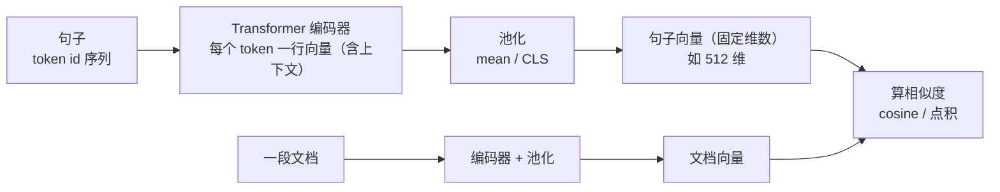

# 02 Embedding 与相似度：词 / 句 / 文档向量

| 元信息 | 内容 |
|------|------|
| 所属模块 | 04-NLP基础（领域层） |
| 篇目 | 04-2 Embedding 与相似度 |
| 预计时间 | 45-60 分钟 |
| 前置 | 04-1（分词与 BPE） |
| 面试可答一句话摘要 | 一句话讲清「语义匹配为什么有效 = 对比学习把『相似语义』压到相近向量」，外加 cosine 为什么比欧氏更适合文本、稠密/稀疏/混合三种向量的取舍 |

> 本篇是 04 模块第二环：token 有了 id，**怎么变成「懂语义」的向量**。讲清词/句/文档 Embedding 三层粒度、稠密 vs 稀疏 vs 混合向量的本质差异、cosine 与欧氏距离为何排序不同，并以 [BGE-M3](https://huggingface.co/BAAI/bge-m3) 模型卡为延伸靶子看「混合向量」。前置：04-1（token id）+ 03-2（Embedding 查表、cosine 最小案例）。**深度边界（大纲 §9）：不学 Word2Vec 数学推导、不学 ANN 底层优化**——本篇只到「相似度计算原理与混合检索动机」为止。

## 学习目标

- 讲清词/句/文档三级 Embedding 分别怎么来、各自解决什么问题
- 手写 cosine 与欧氏距离，用反例说明「为什么向量库默认给你 cosine 排序」
- 对照 BGE-M3 模型卡，说出 dense / sparse / multi-vector 三个输出的定位与混合评分公式
- 用「对比学习（拉近正例、推远负例）」一句话解释语义匹配为什么有效，并指出它的两个已知局限
- 看懂 Matryoshka（可裁剪维度）概念并说出它解决什么成本问题

---

## 1. 从 token id 到向量：三层粒度的 Embedding

04-1 的终点是整数数组；本篇的起点是**查表**：每个 token id 对应深度学习矩阵里的一行（`nn.Embedding`，03-2 已跑通），`embedding[id]` 就是该 token 的向量。单个 token 向量只有词义，要做检索还得把整个句子/段落压成一个向量。按粒度分三层：

| 粒度 | 向量怎么来 | 一句话定位 | 例子 |
|------|-----------|-----------|------|
| 词向量 | `nn.Embedding` 查表（word2vec 是它的历史前身：让「上下文相似的词」向量相近；数学推导不学） | 单 token 的静态语义 | "猫" ≈ "猫咪" 的方向 |
| 句向量 | 整句过编码器后做 **pooling**（mean pooling / CLS）或模型直接输出句子级向量（BGE 系） | 「一句话」压成一个点 | "猫和狗打架" 的点 |
| **文档向量** | 长文本同样一场池化（超长文本要注意信息稀释，见 §5） | 「一段/一篇」压成一个点 | RAG 里的 chunk 向量 |

关键结论：**词向量是查出来的，句/文档向量是「池化」出来的**——pooling 把变长的 token 序列变成长度固定的向量（如 512/1024 维），向量库才能统一建索引、统一算距离。RAG 里你存的是**文档向量**，query 侧做的是**句向量**，两者必须在**同一个向量空间**（同一模型）才有可比性——混用两个模型是 04-3 的经典事故。



---

## 2. 语义匹配为什么有效：对比学习一句话

「猫和狗打架」和「猫咪大战狗狗」**零字面重叠**，为什么检索系统能把前者命中后者？答案不在向量本身，在**训练目标**：

> **对比学习：训练时构造（query 句，相关段落）正例对与（query 句，噪声段落）负例对，让编码器把正例对分的向量拉近、负例对推远。学完后，「语义相近」在向量空间里就近似等于「距离近」——相似度打分器由此成立。**

三个要点：

1. **相似性由数据定义**：正例来自真实标注/挖掘（如：同一个问题下的相关段落、同一文档的相邻句），模型学的是「什么算相关」的统计规律，而不是字符匹配
2. **为什么能跨词面**：神经网络把 token 变成「上下文感知」的向量（"猫咪"和"猫"在语料里的上下文高度重合 → 向量方向接近），相似性从「字符层面」上升到「语境层面」
3. **为什么这里不展开数学**：对比学习的损失函数（InfoNCE 一族）与温度等细节，留给训练侧；应用工程师只需吃透两点——**训练目标决定向量空间的「语义地图」，所以你选的 embedding 模型直接决定检索上限。**

两个已知局限（面试进阶，也是 04-3 失败模式的根源之一）：

- **信息瓶颈**：整句压成一个点，长文本的局部细节会被均值稀释（一个 800 token 的 chunk 和它 20 个 token 的核心句，向量可能差很远）
- **「相似」≠「方向匹配」**：query 想要的是「答案在哪个文档里」，embedding 学到的是「哪段文字在语境上像我」——两者在问句场景常分叉（细节见 04-3 §5「相关性 gap」）

---

## 3. 三种向量形态：稠密 / 稀疏 / 混合，以 BGE-M3 模型卡为靶

### 3.1 三种形态的本质

| 形态 | 长什么样 | 像什么 | 强项 | 弱项 |
|------|---------|--------|------|------|
| **稠密（dense）** | 固定长度实向量（768/1024 维），每个维度是浮点数 | 「语义压缩袋」 | 语义匹配、跨语言、同义词 | 专有名词/精确 ID 难命中，不可解释 |
| **稀疏（sparse / 词项加权）** | 维度 = 词表大小（约 25 万），大部分为 0，非零处是权重 | 「可学习版 BM25」 | 精确词命中、产品码/函数名、可解释 | 不懂同义改写，单纯词汇匹配 |
| **多向量（multi-vector / ColBERT 式）** | 每个 token 一个向量（late interaction） | 「细粒度逐 token 对比」 | 长文档细节匹配、精确度 | 存储爆炸（每文档 N 个向量），只适合做 rerank |

BM25 是稀疏检索的经典基线（词频 × 逆文档频率，纯统计学）；现代稀疏向量（如 BGE-M3 的 sparse 输出、SPLADE）**由模型学出来的 term 权重**，更准但仍不解决同义改写。**混合 = 同时跑稠密和稀疏，再把两路排名融合**——互救短板，这是 2026 年主流检索栈的标配（对应大纲 06 的「混合检索」）。

### 3.2 读 BGE-M3 模型卡：一个模型、三种输出

关键规格（来自 [BGE-M3](https://huggingface.co/BAAI/bge-m3) 模型卡 / 论文 arXiv 2402.03216，2024-01 发布，智源）：

| 输出 | 维度/形态 | 评分方式 | 定位 |
|------|----------|---------|------|
| Dense | 1024 维（[CLS] 归一化） | 与 passage 向量点积/欧氏 | 语义匹配主力 |
| Sparse | 词表大小（250,002）加权向量 | 共现词权重乘积求和 | 精确词/专名兜底 |
| Multi-vector | 每 token 1024 维 | late interaction（逐 token 最相似求平均） | 长文档精排 |

其他要点：**最大输入 8192 token**（多粒度：短句到长文档）；**100+ 语言**；**query/文档都不需要加指令前缀**（与 BGE v1.5 相反，少一个集成坑）；推理时三个输出一次前向全部拿到。混合排序的官方定义：

$$s_{\text{rank}} = w_1 \cdot s_{\text{dense}} + w_2 \cdot s_{\text{lex}} + w_3 \cdot s_{\text{mul}}$$

（$w_1, w_2, w_3$ 按场景调；工程常规是 dense + sparse 先召回，multi-vector 只用来对 top-k 精排——因为多向量太贵，详见 04-3 的环节归因。）

### 3.3 看代码：一个模型拿三种向量

```python
# pip install FlagEmbedding accelerate；首次运行自动下载 BGE-M3（约 2.3GB）
# 教学演示：同一批句子，一次前向拿到三种表示
from FlagEmbedding import BGEM3FlagModel

model = BGEM3FlagModel("BAAI/bge-m3", use_fp16=True)
out = model.encode(
    ["猫和狗打架", "猫咪大战狗狗"],
    return_dense=True, return_sparse=True, return_colbert_vecs=True,
)
print(out["dense_vecs"].shape)          # (2, 1024) 稠密向量
print(out["lexical_weights"])           # [{token: 权重}, ...] 稀疏 term 权重
print(out["colbert_vecs"].shape)        # (2, seq_len, 1024) 每 token 一个向量
```

---

## 4. cosine vs 欧氏距离：为什么文本检索默认 cosine

### 4.1 两个公式

$$\cos(\mathbf{a}, \mathbf{b}) = \frac{\mathbf{a} \cdot \mathbf{b}}{\|\mathbf{a}\| \, \|\mathbf{b}\|} = \frac{\sum_i a_i b_i}{\sqrt{\sum_i a_i^2}\sqrt{\sum_i b_i^2}}$$

$$\|\mathbf{a} - \mathbf{b}\|_2 = \sqrt{\sum_i (a_i - b_i)^2}$$

村里的大白话：**cosine 比「方向」（夹角），欧氏比「直线距离」（方向 + 长度）**。

### 4.2 决定性差异：对「向量长度」的敏感度

Embedding 向量长度 = 句子「信息量/能量」的粗糙代理——同样语义，**措辞越啰嗦、长度越长，向量模长越大**。这会破坏欧氏距离：同义句「猫狗打架」与「猫和狗正在激烈地打成一团」方向几乎一致（夹角小），但长度差一大截，**欧氏距离被长度差主导，cosine 完全免疫**——只比较方向，长度是分母上的归一化因子。

三行代码验证（numpy，可独立跑通）：

```python
# python3 cosine_vs_euclid.py（唯一依赖 numpy）
import numpy as np

def cosine(u, v):
    return float(np.dot(u, v) / (np.linalg.norm(u) * np.linalg.norm(v)))

a = np.array([1.0, 2.0, 3.0])
b = np.array([2.0, 4.0, 6.0])      # 与 a 同方向，长度 2 倍（模拟"同义但啰嗦"）
c = np.array([3.0, 1.0, 2.0])      # 长度同为 sqrt(14)，方向不同

print(cosine(a, b), cosine(a, c))  # 1.0 vs 0.7857...（同向 > 换向）
print(np.linalg.norm(a - b), np.linalg.norm(a - c))
# 3.7417 vs 2.4495（啰嗦版距离 > 语义更远的），欧氏排序翻车
```

### 4.3 什么时候可以视作等价

两个向量都 **L2 归一化成单位向量**后：$\|a\|=\|b\|=1$ 时 $\cos(a,b) = a \cdot b$，且排序等价（欧氏平方 $= 2 - 2\cos$，单调）。所以：**embedding 模型输出已归一化（BGE 系默认）时，向量库里的「点积」和「cosine」是同一件事**；没有归一化时，三个姿势（cosine / 点积 / 欧氏）排名会分叉——这是 04-3 度量子环节的一个事故源。

> ✅ 工程默认：文本检索用 **cosine（或归一化后的点积）**；只有向量已归一化且你清楚二者等价时，才用点积省一次归一化。**别拿原始向量的欧氏距离当默认**。

### 4.4 三个姿势怎么选（工程版速查）

| 场景 | 选择 | 理由 |
|------|------|------|
| 向量已 L2 归一化（BGE/sentence-transformers 默认之一） | cosine = 点积，用哪个都行 | 归一化后 $\cos(a,b)=a\cdot b$，点积更省一次除法 |
| 未归一化、没把握 | **cosine** | 免疫长度差带来的排序错乱（§4.2 反例） |
| 想故意利用「长度」当信号 | 欧氏（文本场景几乎没有） | 长度 ≈ 啰嗦度/信息量，但通常不是你要的信号 |

> ⚠️ 最稳的工程姿势：**在写入向量库前统一归一化，检索用 cosine（或点积），并在 post-filter 阶段复算一遍 cosine 做阈值判断**——把「度量选择」变成一个配置项而不是事故源（这个事故在 04-3 环 4 还会遇到）。

---

## 5. 最小案例：5 行代码，「猫和狗打架」vs「猫咪大战狗狗」

```python
# pip install sentence-transformers numpy；首次运行下载 bge-small-zh-v1.5（约 130MB）
from sentence_transformers import SentenceTransformer
import numpy as np

model = SentenceTransformer("BAAI/bge-small-zh-v1.5")   # 512 维中文句向量，v1.5 可不用指令
a = model.encode("猫和狗打架", normalize_embeddings=True)
b = model.encode("猫咪大战狗狗", normalize_embeddings=True)
print(np.dot(a, b))   # 归一化后点积 == cosine；零字面重叠，相似度通常落在 0.6~0.9（与模型版本/池化方式有关）
```

两个容易翻车的集成细节（面试爱问）：

1. **要不要指令前缀**：BGE v1.5 系检索建议 query 侧加「为这个句子生成表示以用于检索相关文章：」，passage 侧不加；**BGE-M3 则两边都不加**。文档编码和查询编码必须遵守同一套约定，否则是系统性偏差（04-3 归因清单里单列了一条）
2. **normalize 与否**：`normalize_embeddings=True` 让余弦退化成点积。你自己算 cosine 时用 `cosine_similarity` 或手写都行，别把未归一化向量当点积用

---

## 6. Matryoshka：能「砍维度」的向量

**概念**：普通 embedding 的向量是「整根棍子」，从 1024 维截到 128 维语义就崩了。Matryoshka（俄罗斯套娃）训练让**向量前 $k$ 维（$k$ 任意）单独构成一个好用的子向量**——截断只是「精度换成本」，不掉底裤。

**为什么能砍**：训练时同时用 1024/512/256/... 多个维度的头部做相似度监督，迫使「每个前缀」都独立携带语义。推理时按预算直接取前 $k$ 维，无需重新编码。

**用途（正对你的 RAG 账单）**：维度直接决定存储与内存——百万 chunk、1024 维 float32 ≈ 4GB，砍到 256 维省 75%；大模型响应延迟与 embedding 维度正相关。代表：OpenAI `text-embedding-3-small`（默认 1536 维，可截到 512/256）、Gemini Embedding（支持 MRL）。**代价是维度越低，区分度越差（召回略降）——这是 06-3 选型时的一个成本-质量旋钮。**

```python
# Matryoshka 的使用方式：多数支持库是"推理时直接截断"，不需要重新训练
import numpy as np

emb = model.encode("猫和狗打架", normalize_embeddings=True)  # 512 维
print(emb[:256].shape)          # 截断到 256 维，语义仍可用（MRL 模型）
```

---

## 7. 练习：两个模型对照测「敏感度」（约 40 分钟）

**要求**：固定同一批句子与同一个度量（cosine），用 **两个不同 Embedding 模型**各算一遍，输出对照表：

- 模型 A：`BAAI/bge-small-zh-v1.5`（中文专用，33M）
- 模型 B：`BAAI/bge-m3`（多语言，568M，需 FlagEmbedding + 显存/CPU 耐心）或任意第二个中文模型
- 句子对至少 3 组同义 + 3 组反义（反义例如「猫和狗关系很好」vs「猫和狗势不两立」）
- 计算并比较两模型的**区分度 = 同义对均分 − 反义对均分**

**提示**：①区分度是「模型对中文语义多敏感」的粗糙代理，数值越大越能拉开同义/反义；②BGE v1.5 的 query 要加指令前缀、BGE-M3 不加，两边的编码约定保持一致再比，否则比的不是模型是「错误前缀」；③若两模型分数都高到 0.9+，说明句对太简单，换更微妙的对子（「退款政策」vs「退货流程」）再测。

**预期效果**：能指出哪个模型对中文语义更敏感并**有数据支撑**地猜原因（训练语料规模 / 多语言目标 / 模型容量）；能把「模型-度量-编码约定」三个变量分开，理解对照实验必须三取其一变——这正是 04-3「归因清单」的实验心理学基础。

---

## 8. 对比板块：稠密 / 稀疏（BM25）/ 混合（BGE-M3）三角对比

| 维度 | 稠密向量（BGE 系 / Qwen3） | 稀疏向量（BM25 → 模型稀疏） | 混合（BGE-M3 式） |
|------|---------------------------|----------------------------|-------------------|
| 匹配原理 | 向量空间语义相似 | 词项共现（统计或学习权重） | 两路/三路融合（线性加权或 RRF） |
| 同义改写 | ✅（"猫咪"→"猫"） | ❌（词面不一致即漏） | ✅ 同义由稠密兜底 |
| 精确专名（产品码、函数名） | ❌ 经常漏 | ✅ 天然命中 | ✅ 专名由稀疏兜底 |
| 可解释性 | 低（黑盒点） | 高（能看到命中词项） | 中（可以拆到每路看贡献） |
| 实现成本 | 一个 embedding 模型 | BM25 零成本；模型稀疏多一个输出头 | 多模型/多索引/多一次融合 |
| 典型使用 | RAG 主力（对 90% 语义型 query 够用） | 古老的基线；现代用于辅助召回 | 2026 生产栈标配（召回 + 精排两阶段） |

> 选型结论：**起步用稠密（一个模型、零融合成本）；当 bad case 里出现「专名/精确词漏召回」或「同义改写误召回」时，再上稀疏路做混合（对应 06-1 的混合检索）**。能给面试官的分层：先说三种形态的「像什么」（稠密=语义袋、稀疏=可学习 BM25、多向量=逐 token 精排）→ 再说两者为何互救（互补失败模式）→ 最后落到成本（多一路索引多一份钱，先有 bad case 再上）。

---

## 9. 面试问答

> **问：为什么文本检索常用 cosine 相似度而不是欧氏距离？**
>
> **答：** 因为 embedding 向量的模长近似代表句子的「信息量/长度」，同义但啰嗦的句子方向一致、长度差很大，欧氏距离会被长度差主导导致排序错误；cosine 只比较方向的夹角，长度在归一化分母中被消掉，与「语义相似」的概念对齐。当向量已 L2 归一化成单位向量时，cosine 等于点积、排序与欧氏等价；未归一化时三者排序会分叉。

> **问：为什么说「语义匹配有效」是训练目标决定的？一句话怎么讲？**
>
> **答：** embedding 模型是用对比学习训练的——训练时把（查询，相关段落）正例对拉近、（查询，噪声段落）负例对推远，学完后「语义相近 = 向量距离近」成了编码器的性质。所以换模型 = 换一张「语义地图」，RAG 检索质量的上限在选 embed 模型那一刻就被定住了。两个已知局限：整句压成一点的信息瓶颈，和「语境相似 ≠ 任务相关性」的 gap。

> **追问（陷阱）：稠密向量这么好，为什么还要混合检索？**
>
> **答：** 稠密向量对「同义改写」强、对「精确词项」弱——产品码、函数名、专有名词这类必须原文命中的查询，稠密经常漏。稀疏向量（BM25 或模型稀疏输出）恰好擅长精确词共现，但不懂同义。混合把两路排名融合（加权或 RRF），是用「双路互救」换召回上限，代价是多一套索引与一次融合逻辑。

---

## 参考链接

- [BGE-M3 模型卡（智源，本篇混合向量靶子）](https://huggingface.co/BAAI/bge-m3) —— dense 1024 / sparse 25 万维 / multi-vector 三输出与 8192 token 规格的权威来源
- [M3-Embedding 论文（arXiv 2402.03216）](https://arxiv.org/abs/2402.03216) —— 自知识蒸馏、三功能联合训练与多粒度设计
- [MTEB 榜单（官方评测，分数逐月更新）](https://huggingface.co/spaces/mteb/leaderboard) —— 选 embed 模型的量化依据（选型决策到 06-3 展开）
- [FlagEmbedding（BGE 官方代码库）](https://github.com/FlagOpen/FlagEmbedding) —— `BGEM3FlagModel` 用法与更多 BGE 系模型
- [sentence-transformers（句向量生态库）](https://www.sbert.net/) —— 最小案例使用的官方封装；BGE 中文模型 README 亦以它为推荐用法
- [OpenAI Embeddings 文档](https://platform.openai.com/docs/guides/embeddings) —— Matryoshka 维度截断（text-embedding-3 系列）的官方说明

---

**下一篇**：[03-检索失败模式](03-检索失败模式.md)——向量有了、距离会算了，为什么检索还是不准？把「查询 → top-k 检索」链路每一环的失败原因与归因方法一网打尽，为 06 的「检索质量四件套」铺路。