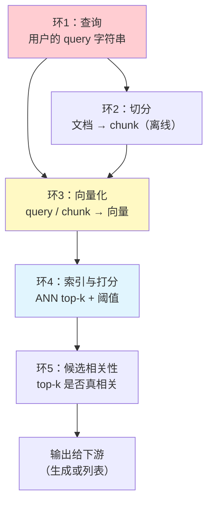
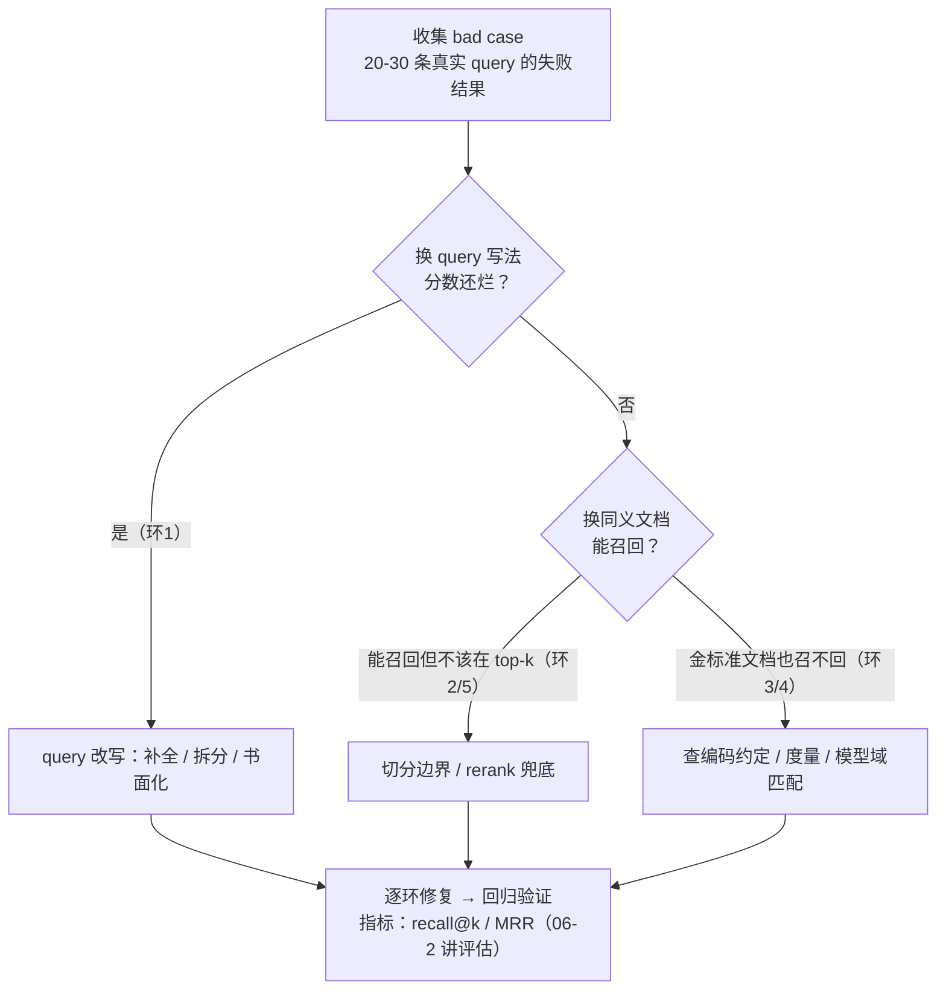

# 03 检索失败模式：「查询 → top-k」链路逐环归因

| 元信息 | 内容 |
|------|------|
| 所属模块 | 04-NLP基础（领域层） |
| 篇目 | 04-3 检索失败模式 |
| 预计时间 | 45-60 分钟 |
| 前置 | 04-2（Embedding 与相似度） |
| 面试可答一句话摘要 | 一句话讲清 RAG 检索不准的归因框架——「把『查询 → top-k』链路拆成 5 个环节，bad case 先定位环节再谈优化」，并列出每环的典型失败模式与对应手段 |

> 本篇是 04 模块的验收篇：把前面「分词 → Embedding → 相似度」的知识收口为**全链路失败模式与归因清单**——这是大纲 06-1「检索质量四件套」的前置（本章只做归因，优化手段到 06-1 展开落地）。与 05 大语言模型原理无依赖，可放在 05 之前或之后读。**验收标准：能独立列出「查询 → top-k 检索」链路每一环的失败模式与对应优化手段，并给任意 bad case 完成一次归因。**

## 学习目标

- 画出检索链路 5 环数据流，指出每环各自「能坏在哪」
- 拿到一个 bad case，用「症状 → 环节定位 → 隔离验证」三步完成归因
- 说出 chunking / query 改写 / 混合检索 / rerank 四件套各自治哪一类失败（细节在 06-1）
- 面试能答「RAG 检索不准一般出在哪些环节」（3 类原因 + 定位方法）

---

## 1. 链路全景：每一环都可能坏

一次 RAG 检索 = 5 个环节顺序执行，**任一环坏，top-k 就坏**。先记链路：

注意 chunk 是**离线**准备的（文档入库时就切好了），query 是**在线**的——所以「换一套 chunk 参数」要重灌索引，成本最高；「query 改写」是零成本可试的路。记忆锚点：**归因时先分「文档侧」（环 2 的参数）与「查询侧」（环 1、3 的处理），再往中间环节挖。**

---

## 2. 环 1：查询侧失败——输入就带着病

| 失败模式 | 现象 | 根因 |
|---------|------|------|
| 短查询歧义 | 一个词能匹配整个知识库 | query 只有 2-3 个字，与任何 chunk 的向量都「不远不近」 |
| 措辞鸿沟 | 口语 query vs 书面语文档 | 「聊天室里说『咋退钱』，文档里写『退款政策』」：零字面重叠，稠密向量也只在训练语料见过此类对应时才救得回来 |
| 复合意图 | 「A 和 B 都支持吗」被当作单意图检索 | query 含多个子问题，向量把它压成**一个点**（04-2 的信息瓶颈），哪边都匹配不精 |
| 上下文缺失 | 「它多久到」的「它」成了空气 | 对话场景没把上文折叠进 query |
| 热词污染 | 「帮我找一下 2024 年 AI 的 10 大趋势」被「10」带偏 | 高频词/数字在向量里占比过大 |

**对应的优化方向（落点在 06-1 的 query 改写）**：补全上下文（把对话历史折叠进 query）、子问题拆分、口语转书面、扩写/改写后再检索。**失败特征**：同一 query 换多种写法分数剧烈抖动——先怀疑环 1。

**环 1 三连问**（每问成本为零）：①同义改写后分数还烂吗？②query 里捆了几个意图（拆开能分别命中吗）？③对话场景的上文喂进去了吗？任一答案是「是 / 值得试」就先修环 1——纯推理侧改动，不改索引不动数据。

---

## 3. 环 2：切分侧失败——documents 入库时就埋的雷

chunk 是检索的最小单元，**它的边界就是语义的边界**，两种典型坏法：

| 失败模式 | 现象 | 根因 |
|---------|------|------|
| 粒度太粗（chunk 太长） | 检索命中「提到了关键词的一整节」，但答案只在那节里 300 字 | 长 chunk 向量被均值池化稀释（04-2 的信息瓶颈）；top 结果「巨而不准」 |
| 粒度太细（chunk 太碎） | 答案被拦腰截断在两个相邻 chunk 里，哪个都不完整 | 固定字符数硬切，把一句话/一个列表从中间切断 |
| 边界信息丢失 | 「上文说过这个 API…」的指代悬空 | 独立 chunk 无上下文，代词/省略式表达失效 |
| 混合内容 | chunk 里塞了表格 + 代码 + 正文 | 一张向量要代表三种内容，哪个都代表不精 |

**对应的优化方向（落点在 06-1 的 chunking）**：按语义单元切（标题/段落/句子边界优先）、重叠滑动窗口、结构化文档按块类型分索引。**失败特征**：离线重切 + 重灌索引后全体 bad case 一起变化——若只变一部分，说明切分只是部分根因。

**chunk 自测三问**：①把命中 chunk 人为改短/改长，结果变好吗？②答案是否恰好被边界切在相邻两个 chunk 里？③同一份信息在索引里被重复切了几份？这三问都答不上来之前，别急着加大词表或换模型——切分是文档侧最便宜的杠杆。

---

## 4. 环 3：向量化侧失败——embedding 模型在拖后腿

| 失败模式 | 现象 | 根因 |
|---------|------|------|
| 模型-语料域错配 | 在法律库上用通用英文模型 | 通用模型在领域术语上的语义地图是「空的」；即使 MTEB 榜单领先也与你的语料域无关，榜单测的是通用域 |
| 语言错配 | 中文 query 打英文嵌模 | 跨语言嵌入只在多语言模型里成立（BGE-M3 可、单语模型不可） |
| 编码约定不一致 | query 加了指令、passage 没加（或 BGE-M3 乱加） | 04-2 提醒过的系统性偏差：两边空间已经不是同一个空间 |
| 长文稀释 | chunk 800 token 直接喂 | 超过模型见过的典型长度，池化把关键句淹没（BGE 系常见截断 512） |
| 两种模型混用 | 入库用 A 模型、查询用 B 模型 | 向量空间不同，相似度无意义（本模块最经典的集成 bug） |

**对应优化方向**：换域匹配模型、统一编码约定、长文预处理（摘要/分块/权重段落）——以及 06-1 的「混合检索」兜底。**失败特征（快速自测）**：拿 20 条已知相关对（q, d）分别用两个模型算同义对相似度（04-2 练习的「区分度」），区分度低 = 模型问题，高 = 问题在别处。

**embedding 侧独门自测**：把 query 与「金标准文档」的相似度和 query 与「top-1 命中 chunk」的相似度拉出来对比——若金标准分高但没进 top-k，问题不在模型（去查环 4/2）；若金标准分本身就低，这个模型就没把这种 query-文档对应关系学进去（换模型/混合检索），别再对着索引调参。

---

## 5. 环 4：索引与度量子侧失败——相似度算对了，顺序错了

| 失败模式 | 现象 | 根因 |
|---------|------|------|
| 度量与归一化错位 | 向量库默认点积/欧氏，模型输出未归一化 | 04-2 讲过：未归一化时三者**排序分叉**，按坐标值硬搜必然错序 |
| ANN 近似丢失 | top-k 偶尔缺明显相关项 | 近似最近邻是「近似」：recall 有上限，是 ANN 的固有误差（HNSW/IVF 底层优化不展开，大纲 §9 边界） |
| k 太小 | 真正相关的排在 k+1 | 问句类 query 相关候选本来就稀疏，k=3 常常不够 |
| 阈值缺失/不当 | 无阈值时检索「最不相关的相关项」 | 语义检索默认「必有 top-k」；库里没有真答案时要能判断「空」 |
| 重复/陈旧 chunk | 同一段内容被多个 chunk 重复命中，或旧版本文档还在索引里 | 去重与增量更新缺失——索引侧工程债 |

**对应优化方向**：显式统一「编码约定 + 度量 + 归一化」三件套（这是 0 成本修复）；放宽 k 再 rerank；设最小相似度门槛；索引去重/版本化。

---

## 6. 环 5：候选相关性 gap——招回来了，但不「对题」

前面四环全对，top-k 依然错位——因为 **embedding「语境相似」≠ 任务「相关」**（04-2 遗留的局限在这里爆发）：

| 失败模式 | 现象 | 根因 |
|---------|------|------|
| 高频词污染 | 提到「AI 发展趋势」的综述文排在「2024 AI 趋势」的问题前 | 语义地图上两者确实近——泛化越强，越分不清你要的是「趋势」还是「综述」 |
| 粒度错配 | query 想要 1 句话答案，命中的是「整节背景介绍」 | 相关 ≠ 精确；top-k 是「节级」，答案在「句级」 |
| 逻辑/否定混淆 | 「不支持的功能」被当「支持的功能」召回 | 句向量/池化阶段否定信息被稀释（信息瓶颈恶果） |
| 时间/条件错配 | 查「2023 年的政策」，召回「2024 年修订版」 | 语义模型对「版本、年份、条件」这类精确约束天然弱势 |

**对应优化方向**：这是 **rerank（重排）** 的主战场——用一个更大/交叉编码器对 top-k（放宽到 20-50）做二次精排（细化在 06-1）；混合检索的稀疏路也能救「版本号、年份」这类精确约束。

### 6.1 实战复盘：一个 bad case 的完整归因

案例：知识库三件经典坏例之一——query「猫咪疫苗价格」，top-3 全是「宠物医院就诊指南」这类综述，没有一条包含价格（下表分数/排位为演示示意，真实系统请以自测为准）。

| 步骤 | 动作 | 观察 | 结论 |
|------|------|------|------|
| 1. 换写法排除环 1 | 「猫打疫苗多少钱」「猫咪疫苗接种费用」再查 | top-3 仍是同一批综述 chunk | 不是 query 措辞问题 |
| 2. 金标准探针 | 人工找 1 篇含价格表的文章，直接算它和 query 的 cosine | 分数 0.82，却不进 top-3（排第 9） | 相似度本身不低 → 模型与度量（环 3/4）初步排除 |
| 3. 反向检查 chunk | 看金标准文章是怎么被切的 | 1500 字「就诊指南」整段切，价格表句子被均值池化稀释 | 锁定环 2（粒度太粗）为主要嫌疑 |
| 4. 交叉验证环 5 | 数每个 top chunk 里「价格/费用」出现几次 | 综述 chunk 相关词频低，但和「猫咪」「疫苗」整体语境近 | 相关性 gap（环 5）是伴生问题 |
| 5. 出手段 | 先零成本：k 放宽到 20 + rerank 精排 | top-3 显著改善 | 若价格类 query 仍不稳，再上语义切分（表格单独成块，06-1） |

复盘要点：①先排除「换写法」这类零成本变量，再动金标准探针；②**金标准探针把「向量化/度量问题」与「chunking/相关性问题」切开**——分数高但排位低，矛盾不在模型而在排序前的加工；③手段按成本递进，不急着重灌索引。

---

## 7. 归因清单：症状 → 环节 → 隔离验证

定位原则：**一次只变一个变量**（04-2 练习的对照精神放大版）。归因路线图：

| 症状（bad case 长什么样） | 优先怀疑环节 | 隔离验证动作 |
|--------------------------|-------------|-------------|
| 换 query 说法，召回剧烈变化 | 环 1 查询侧 | 手动改写 query 重测；写成「问题-意图」两列对比 |
| 命中 chunk「提到但不准」 | 环 2 切分 / 环 5 相关 | 看命中 chunk 长度与答案位置；把 chunk 换小/换大重测 |
| 人类明显相关的文档召不回来 | 环 3 向量化 / 环 4 度量 | 金标准文档直接测相似度分数；核对模型/前缀/度量 |
| 相似度排序看着合理但结果没用 | 环 5 相关性 gap | 上 rerank 对比 top-k 前后变化 |
| 结果稳定但整体平庸 | 环 4 索引（k/阈值/去重） | 调 k、加阈值、查索引更新 |

> 💡 两个省时间的经验：**① 把「金标准文档」先人工找出来**（相关文档人工标注），再倒推它为什么没进 top-k——比对着分数猜快得多；② bad case 没有跨环节归因前**不要上重资产手段**（换模型、重灌索引），先用零成本的手段（query 改写、调 k、加阈值、rerank）试出环节。

**怎样算「定位到了」**：改动后 bad case 变得可解释，并且**再换一批同类 query 复测得到一致结论**，才算归因完成——单条 query 的偶然修复可能是过拟合了这条 case。建议顺手把每次归因写成「环节 × 证据 × 手段」三列笔记，攒够 10 条后你会看到自己的知识库反复倒在同一类失败上，那是 06-1 四件套的优先级清单。

---

## 8. 优化手段与失败环节的对应表（06-1 的提前量）

| 手段（06-1 展开） | 治哪类失败 | 成本 | 见效速度 |
|------------------|-----------|------|---------|
| query 改写（补全/拆分/书面化） | 环 1 全部 | 低（纯推理） | 立刻 |
| chunking 调参（粒度/重叠/语义边界） | 环 2、部分环 5 | 高（重灌索引） | 重灌后 |
| 混合检索（dense+sparse 融合） | 环 3 专名/精确词、环 5 版本/年份 | 中（双索引 + 融合） | 中 |
| rerank（交叉编码器精排） | 环 5 为主，兜底环 4 的 k 放宽 | 中（多一次推理） | 快 |

记忆锚点：**环 1 靠改写、环 2 靠切分、环 3 靠模型/混合、环 4 靠参数、环 5 靠 rerank**——这就是 06「检索质量四件套」的失败模式侧推导，到时只需学具体做法。

### 8.1 先度量再归因：失败的三副面孔

归因之前先给失败**分个类**，否则「排名低」和「没结果」会被当成同一件事。检索侧的不准只有三种形态：

| 形态 | 定义 | 最常见环节 | 一句话直觉 | 对应指标（06-2 展开） |
|------|------|-----------|-----------|----------------------|
| 漏召（召回不足） | 该进 top-k 的没进 | 环 3/4（模型域错配、度量、ANN、k 太小） | 「金标准文档根本不在候选里」 | recall@k |
| 误召（排序错误） | 进了但相关性差 | 环 5（语境相似 ≠ 相关） | 「相关的也在，但被噪声压下去了」 | precision@k / MRR / NDCG |
| 空结果（系统故障） | 一条都不像（全员低于阈值） | 环 4（阈值、索引未更新、量纲错） | 「库里没有对应物，或索引是旧的」 | 空结果率 |

为什么必须分形态：三者的修复动作完全不同——**漏召优先「扩召回」**（放宽 k、换模型、混合检索、query 改写），**误召优先「提精度」**（rerank、阈值、切分细化），**空结果优先「查系统」**（索引版本、量纲归一化、阈值口径）。只记一句「检索不准 = 调参」，容易对着错误的方向调半天。

搭配使用：对同一批 20-30 条真实 query 先跑出 top-k，人工标好金标准，把每条结果按三维形态打标——**形态分布直接告诉你优先动哪一环**（漏召多 → 先查环 3/4；误召多 → 先上 rerank；空结果多 → 先查系统），这正是 06-2「定指标 → 采样 bad case → 定位环节」的输入端。

---

## 9. 练习：给 5 个 bad case 归因（约 35 分钟）

**要求**：给下面 5 个真实体感的 bad case 各填一张「环节 → 证据 → 手段」卡片（参照 §7 表格）：①查「猫咪疫苗价格」返回「宠物医院就诊指南」整篇；②查「2023 年订单退款政策」召回的是 2024 版条款的文档；③查内部系统名「TMS-42」毫无结果；④问「前端项目怎么初始化」，返回的 chunk 是 2000 字项目背景综述；⑤同一 query 半夜跑分数正常、白天跑 top-k 经常缺一项——查日志发现该文档当天被重新入库。

**提示**：①②是 04-2 讲过的两种典型失效（信息瓶颈 / 精确约束），③先怀疑环 3 稀疏路缺失，④先怀疑环 2 粒度，⑤是环 4 的索引更新问题——**先写「证据」再写「环节」**，证据不足就补隔离实验（如③先直接算 TMS-42 与所有 chunk 的最大相似度，看是不是模型压根没见过这个词）。

**预期效果**：能对任意 bad case 走通「症状 → 定位 → 手段」三步，并说出每个手段的落点环节与成本——这正是 06-1 审计式学习（检索质量四件套）和 06-2 评估（recall@k/MRR）的输入端。

---

## 10. 对比板块：三种归因方式的三角对比

| 维度 | 推理式（凭经验猜环节） | 隔离式（逐环替换变量） | 数据式（评估指标定位） |
|------|----------------------|----------------------|----------------------|
| 做法 | 看 bad case 直觉下判断 | 一次变一个变量（改写/换模型/调 k…）看召回变化 | 跑 recall@k、MRR 等指标，分环节打分 |
| 速度 | 秒级，适合第一反应 | 分钟-小时级，适合绝杀 | 需先搭评测集（20-30 条 query + 金标准），小时-天级 |
| 可靠性 | 低：易被「症状像」骗 | 高：变量隔离，因果清晰 | 高：可量化、可回归，但依赖标注质量 |
| 代价 | 零 | 低-中（重灌索引算高的） | 构建评测集的成本（06-2 讲流程） |
| 适用 | 上线前快速筛查 | 单 case 深挖 | 系统级优化与回归监控 |

> 选型结论：**日常用隔离式（最划算），项目级优化上数据式（可量化才可回归），推理式只当第一反应、不当作结论。** 能写进简历的分层：拿到坏检索结果不慌 → 先问「哪一环能独立验证」 → 用最小对照实验（04-2 的对照精神）锁定环节 → 再选手段；**永远先零成本手段，再重资产手段。**

---

## 11. 面试问答

> **问：RAG 检索不准一般出在哪些环节？**
>
> **答：** 把「查询 → top-k 检索」拆成 5 环：①查询侧（query 太短/口语化/复合意图）；②切分侧（chunk 粒度不当，语义被截断或混入噪声）；③向量化侧（embedding 模型与语料域不匹配、语言错配、query/passage 编码约定不一致、长文稀释）；④索引度量子（未归一化时 cosine/点积/欧氏排序分叉、ANN 近似误差、k 太小或无阈值）；⑤候选相关性（embedding「语境相似」≠「任务相关」，高频词污染、粒度错配、否定/条件约束被稀释）。定位靠隔离实验：一次只变一个变量，先零成本（改写 query、调 k、加阈值、rerank），再重资产（换模型、重切 chunk）。

> **问：怎么判断问题出在 Embedding 模型而不是 chunking？**
>
> **答：** 拿人工标注的「金标准文档」直接测相似度：如果 query 与金标准文档的向量相似度本身就很低，问题在向量化侧（模型域不匹配/编码约定/度量），跟 chunking 无关；如果相似度不低但没进 top-k，再去看是 k/阈值/ANN 丢了它，还是 chunk 边界把它切碎导致向量被稀释。**先人工出金标准，再用它当探针，比猜环节快。**

> **追问（陷阱）：top-k 结果看起来「相似」但没用，是哪里坏了？**
>
> **答：** 这多半是环 5 的相关性 gap——embedding 衡量「语境相似」，任务要的是「相关/可作答」，「泛泛提到 vs 精确命中」在向量空间里差距很小（信息瓶颈把细节抹平了）。手段：rerank 精排（回答环 5）+ 放宽 k 由精排兜底（兜环 4）；如果坏法集中在「版本、年份、否定」这类精确约束，还要补混合检索的稀疏路。

---

## 参考链接

- [MTEB 榜单（Embedding 评测，官方为准、分数逐月更新）](https://huggingface.co/spaces/mteb/leaderboard) —— 模型域错配的量化证据来源：榜单分数与你的语料域无关，务必自建评测集（06-2）
- [BGE-M3 模型卡（智源，混合向量）](https://huggingface.co/BAAI/bge-m3) —— 环 3/环 5 里「精确词/版本号召回」的稀疏路与多向量 rerank 参考
- [Qwen3-Embedding 官方博客](https://qwenlm.github.io/blog/qwen3-embedding/) —— 长文档/多粒度增强代表性方案，环 3「长文稀释」的一个现实解法方向
- [FlagEmbedding（BGE 官方代码库）](https://github.com/FlagOpen/FlagEmbedding) —— reranker（bge-reranker 系列）与混合检索的官方实现参照

---

**下一篇**：[06-1 检索质量四件套](../../06-应用层原理与选型/01-检索质量四件套.md)——本篇的归因清单将在那里落地为 chunking / query 改写 / 混合检索 / rerank 的具体做法（此前可先读 05 大语言模型原理补主线，本片与 05 无依赖）。