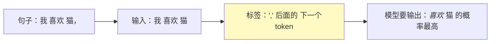
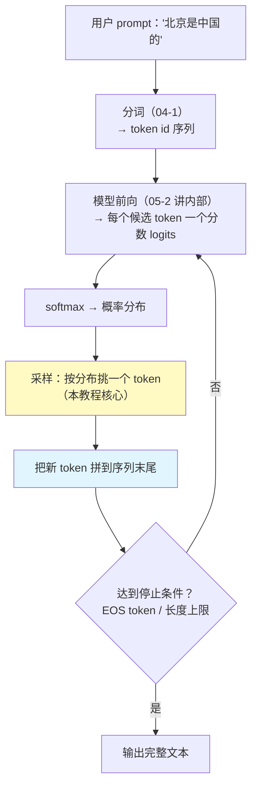

# 01 Next-Token 与采样

| 元信息 | 内容 |
|------|------|
| 所属模块 | 05-大语言模型原理（核心层） |
| 篇目 | 05-1 Next-Token 与采样 |
| 预计时间 | 50-60 分钟 |
| 前置 | 04-2（Embedding 与相似度） |
| 面试可答一句话摘要 | 一句话讲清「训练目标 = 预测下一个 token；幻觉 = 采样落进了分布里『合理但错误』的区域；temperature / top-p 是把分布重缩放的旋钮」 |

> 本篇是模块 05 的开篇，回答三个问题：LLM 是怎么训练出来的、生成时每个字是怎么蹦出来的、为什么它爱一本正经地胡说。全程只有一条主线——**概率分布**。前置 04-2（分词、Embedding、相似度已在 04 学完）；下一篇 05-2 进入注意力机制。

## 学习目标

- 讲清 next-token 训练目标，以及「预测下一个字符为什么能学出知识」
- 画出一条 prompt → token 的完整生成链路（第 2 节那张图）
- 亲手跑一遍最小采样演示，用实测数据解释 temperature / top-p 到底改了分布的什么
- 用概率分布的语言解释幻觉成因与 4 类缓解手段
- 复现「只输出合法 JSON」：区分「模型学到的分布」与「约束采样保证的语法」

---

## 1. 训练目标：下一 token 预测

一句话结论：**LLM 在训练阶段只学一件事——给定前面的文本，预测下一个 token 是什么；预测得越准，参数越好。**

把「预测下一个词」当成题目、文本自身当答案，标签就没有任何人工成本：**自监督**（01 模块的术语在这里兑现）。训练样本直接从语料里切：



看到「香蕉」时模型学「前面的词往往是黄色、甜的、猴子爱吃」——词与词的共现规律，就是世界知识在语言里的投影。**预测下一个词 = 压缩人类说过的话 = 间接学会了话里的世界模型**。这就是「预训练（pre-training）」的全部含义。

对应到损失函数，就是一句话：**交叉熵 = 让模型给正确 token 的概率尽量接近 1**（02 模块的反向传播自动完成这项工作，本篇不重复）。

> 🚧 深度边界（大纲 §9）：本篇只讲「训练目标是什么、为什么有效」，不碰 RLHF / PPO 细节。

---

## 2. 推理：一次生成的全过程

训练只是把「下一个 token 的分布」压进参数。推理时做的是同一件事，只是换了个叫法：



关键认知：**每一步只看「当前已生成的全部 token」来预测下一个**——模型看不到未来的字，也不能回头改（自回归 autoregressive）。

---

## 3. logits / softmax / temperature / top-p：分布的三级控制

### 3.1 从分数到概率

模型最后一层输出的是**每个候选 token 一个分数（logits）**，分数越高 = 模型越倾向选它。这些原始分数不是概率，需要用 softmax 摊平成总和为 1 的分布（04-2 的 softmax 在这里用到）：

$$P(\text{token}_i) = \frac{\exp(\text{logit}_i / T)}{\sum_j \exp(\text{logit}_j / T)}$$

其中 $T$ 就是 **temperature**，这个公式已经是完整版（$T=1$ 时就是普通 softmax）。

### 3.2 temperature：锐化 / 平滑旋钮

- $T \to 0$：分布被锐化成「几乎只选最高分 token」→ 确定性输出
- $T = 1$：原样分布
- $T > 1$：分布被抹平，低分 token 也有机会被选中 → 输出更「发散」

### 3.3 top-p：砍掉长尾

top-p（nucleus sampling）：只保留「累计概率前 $p$」的 token，其余概率清零后重新归一化。它管的是**候选范围**，temperature 管的是**分布形状**，两者正交，可以组合。

### 3.4 最小演示（已实测）

以下脚本用纯标准库实现了与真实 LLM 解码完全相同的采样逻辑：**softmax → temperature 缩放 →（可选 top-p 截断）→ 按分布随机采样**。保存为 `sampling_demo.py` 直接运行（Python 3.8+）：

```python
# sampling_demo.py —— 采样引擎 + temperature/top-p 统计（纯标准库）
import math
import random

random.seed(42)

def softmax(logits, temperature=1.0):
    """logits（分数）-> 概率分布；temperature 是分布锐化/平滑的旋钮"""
    scaled = [l / temperature for l in logits]
    m = max(scaled)
    exps = [math.exp(v - m) for v in scaled]
    total = sum(exps)
    return [e / total for e in exps]

def sample(probs, top_p=None):
    """按概率分布采样一个下标；可先做 top-p 截断再归一化"""
    if top_p is not None and top_p < 1.0:
        order = sorted(range(len(probs)), key=lambda i: probs[i], reverse=True)
        keep, cum = [], 0.0
        for i in order:
            keep.append(i)
            cum += probs[i]
            if cum >= top_p:
                break
        probs = [p if i in keep else 0.0 for i, p in enumerate(probs)]
        total = sum(probs)
        probs = [p / total for p in probs]
    r = random.random()
    for i, p in enumerate(probs):
        r -= p
        if r <= 0:
            return i
    return len(probs) - 1

# 一组玩具 logits（模拟「模型觉得下一个词应该是谁」），词表 5 个候选
VOCAB = ["但", "而且", "狗", "云", "量子"]
LOGITS = [3.0, 2.0, 1.0, 0.0, -1.0]

print("=== temperature 与 top-p 对采样分布的影响（各采样 5000 次）===")
for t in (0.3, 1.0, 2.0):
    probs = softmax(LOGITS, temperature=t)
    freq = [0] * len(VOCAB)
    for _ in range(5000):
        freq[sample(probs)] += 1
    dist = "  ".join(f"{VOCAB[i]}:{freq[i]/5000*100:5.1f}%" for i in range(len(VOCAB)))
    print(f"temperature={t:<4} 模型分布={[round(p, 3) for p in probs]}")
    print(f'{"":12}实采频率  {dist}')

probs1 = softmax(LOGITS)
freq = [0] * len(VOCAB)
for _ in range(5000):
    freq[sample(probs1, top_p=0.5)] += 1
print("temperature=1, top_p=0.5（从累计概率前 50% 的 token 里采样，重归一化）")
print(f'{"":12}实采频率  ' + "  ".join(f"{VOCAB[i]}:{freq[i]/5000*100:5.1f}%" for i in range(len(VOCAB))))
```

实测输出（本机 Python 3.13，已运行验证）：

```text
=== temperature 与 top-p 对采样分布的影响（各采样 5000 次）===
temperature=0.3  模型分布=[0.964, 0.034, 0.001, 0.0, 0.0]
            实采频率  但: 96.2%  而且:  3.6%  狗:  0.2%  云:  0.0%  量子:  0.0%
temperature=1.0  模型分布=[0.636, 0.234, 0.086, 0.032, 0.012]
            实采频率  但: 63.1%  而且: 24.2%  狗:  8.2%  云:  3.4%  量子:  1.2%
temperature=2.0  模型分布=[0.429, 0.26, 0.158, 0.096, 0.058]
            实采频率  但: 43.1%  而且: 25.2%  狗: 16.2%  云:  9.4%  量子:  6.0%
temperature=1, top_p=0.5（从累计概率前 50% 的 token 里采样，重归一化）
            实采频率  但:100.0%  而且:  0.0%  狗:  0.0%  云:  0.0%  量子:  0.0%
```

三个直接可用的结论：

1. **temperature 不改变「排名」，只改变「差距」**：0.3 时第一名的 96% 把其他人压死（接近 greedy）；2.0 时第一名的 43% vs 最后一名的 6%，尾巴被「抬」起来了。
2. **低概率 token 在低温下几乎不可能被采到**——这就是温度和幻觉关系的直接证据（下一节）。
3. **top-p 的一刀切副作用**：当第一名概率已超 $p$ 时（0.636 > 0.5），top-p 会把其他 token 全部砍掉，输出反而变成 100% 确定性——**top-p 并不必然增加多样性**。

---

## 4. 幻觉：概率分布采样角度的必然性

### 4.1 定义与机制

幻觉 = **模型生成的内容在概率分布上「合理」但事实上错误**。

从分布看，原因清晰可见：

- 知识被有损地压进参数：模型记得「大概」，记不得「精确」（04-2 的「语义 vs 事实」在这里兑现）——少见事实在分布里只有很小的概率峰
- 模型**没有任何事实核对机制**：它不查库、不校验、不算数，只按分布一路采下去
- 采样天然有随机性：低概率峰也会偶尔被命中，尤其是 temperature 开高时（3.4 的实测数据：$T=2$ 时「量子」都有 6% 的命中率）

一句话：**训练让模型学会了「像人话的东西」，没学会「真实的东西」。幻觉是抽样必然的副作用，不是 bug。**

### 4.2 四个缓解手段（每个先记一句话，后续模块展开）

| 手段 | 一句话机理 | 在哪儿学 |
|------|-----------|---------|
| 降低 temperature / top-p | 缩小采样落点，让输出偏向分布的顶部 | 本篇 §3 |
| RAG 兜底 | 用检索把事实塞进上下文，模型从「背」变「抄」 | 06 模块 |
| 结构化输出约束 | 把采样空间锁在合法域内（JSON 等），消灭结构性错误 | 本篇 §5 预告、05-4 详述 |
| 置信度自检 | 让模型自称「不确定」或二次校验 | 06 模块 |

> ⚠️ 注意：**temperature=0 也不保证无幻觉**——分布最顶端的位置可能本来就是错的（少见事实概率低但仍在，且训练数据本身有噪音）。降温度只能减少「发散式幻觉」，治不了「自信式幻觉」。

---

## 5. 「只输出合法 JSON」：模型学分布，约束管语法

### 5.1 任务设定

给模型一个字符集任务：**只输出合法 JSON**。大纲练习要求用 nanoGPT 学这个任务；这里我们用一个更小的玩具模型先把机制看清楚——字符级 bigram 模型，在 5 篇合法 JSON 上训练。

问题来了：**JSON 是全局约束（括号必须配对、键值必须成对），而 next-token 是局部决策（只看上一个字符）。** bigram 模型能学会「{ 后面大概率是 "」这种局部统计，但学不会「最外层的 } 在哪里闭合」这种全局结构。结果就是：

### 5.2 最小演示（已实测）

把 Part B 脚本并入上面的 `sampling_demo.py` 即可跑通。核心是两种生成方式的对比：**自由采样**（只依赖模型分布）vs **约束采样**（每步把语法不允许的字符 logit 屏蔽成 $-\infty$）：

```python
# ===== Part B：字符级 bigram 玩具模型学「只输出合法 JSON」 =====
from collections import defaultdict

# 训练语料：一小批合法 JSON（刻意保持小结构：键值对少、嵌套浅）
JSON_DOCS = [
    '{"name":"guanaco","tag":"mammal"}',
    '{"name":"coyote","tag":"canine"}',
    '{"list":["1","2"],"ok":"true"}',
    '[{"a":"1"},{"a":"2"}]',
    '{"a":{"b":"1"}}',
]

# 字符级 bigram 计数：P(下一个字符 | 当前字符)，next-token 训练的最小雏形
counts = defaultdict(lambda: defaultdict(int))
for doc in JSON_DOCS:
    for a, b in zip(doc, doc[1:]):
        counts[a][b] += 1

ALL_CHARS = sorted({c for doc in JSON_DOCS for c in doc})
CHAR_IDX = {c: i for i, c in enumerate(ALL_CHARS)}

def next_logits(ch):
    """玩具模型的 logits = log(计数+平滑)；没见过的转移也给小概率 -> 模型会犯错"""
    return [math.log(counts[ch].get(c, 0) + 0.02) for c in ALL_CHARS]

def generate_free(max_len=60):
    """自由采样：只依赖模型分布，无任何语法约束"""
    out = [random.choice(JSON_DOCS)[0]]
    for _ in range(max_len - 1):
        probs = softmax(next_logits(out[-1]))
        out.append(ALL_CHARS[sample(probs)])
    return "".join(out)

# 字符串内容刻意收窄为 4 个典型字母数字（演示性简化，让样本能在预算内闭合）
CONTENT = ["a", "n", "1", "2"]
MAX_DEPTH = 3  # 限制嵌套深度，保证样本在预算内闭合

def generate_constrained(max_len=200):
    """约束采样：每步把「当前语法状态不允许」的字符 logit 屏蔽成 -inf
    简化 JSON 语法：值仅允许 字符串/对象/数组（演示刻意不引入数值/布尔/空）"""

    def valid_next(stack, phase, in_str):
        if in_str:
            return CONTENT + ['"']              # 字符串内容 + 闭合引号
        if not stack:
            return ["{", "["]                   # 顶层只允许对象/数组
        can_nest = len(stack) < MAX_DEPTH       # 深度余量
        if phase == "KEY":                      # 刚遇到 { / [ / , ，等键或收尾
            if stack[-1][1] == "{":
                return ['"', "}"]
            return (['"', "{", "["] if can_nest else ['"']) + ["]"]
        if phase == "COLON":
            return [":"]
        if phase == "VALUE":                    # 冒号后等值
            return ['"', "{", "["] if can_nest else ['"']
        return [",", "}"] if stack[-1][1] == "{" else [",", "]"]  # 等逗号/收尾

    def advance(ch, stack, phase, in_str):
        if in_str:
            if ch == '"':
                kind, _ = stack.pop()
                return stack, ("COLON" if kind == "k" else "AFTER"), False
            return stack, phase, True
        if ch == "{":
            stack.append(("o", "{")); return stack, "KEY", False
        if ch == "[":
            stack.append(("a", "[")); return stack, "KEY", False
        if ch == '"':
            is_key = phase == "KEY" and stack[-1][1] == "{"
            stack.append(("k" if is_key else "v", '"'))
            return stack, phase, True
        if ch == ":":
            return stack, "VALUE", False
        if ch == ",":
            return stack, "KEY", False
        stack.pop()                              # '}' 或 ']'
        return stack, "AFTER", False

    out = []
    stack, phase, in_str = [], "KEY", False
    for _ in range(max_len):
        if not stack and not in_str and out:     # 根级已闭合，生成完成
            break
        allowed = ["{", "["] if not out else valid_next(stack, phase, in_str)
        base = next_logits(out[-1]) if out else [0.0] * len(ALL_CHARS)
        masked = [-math.inf if c not in allowed else base[CHAR_IDX[c]] for c in ALL_CHARS]
        if all(v == -math.inf for v in masked):
            break
        ch = ALL_CHARS[sample(softmax(masked, temperature=0.8))]
        out.append(ch)
        stack, phase, in_str = advance(ch, stack, phase, in_str)
    return "".join(out)

# ===== 验证：200 个样本分别用两种方式生成，json.loads 判定合法性 =====
import json
ok_free = ok_con = 0
N = 200
for _ in range(N):
    s = generate_free()
    try:
        json.loads(s); ok_free += 1
    except Exception:
        pass
for _ in range(N):
    s = generate_constrained()
    try:
        json.loads(s); ok_con += 1
    except Exception:
        pass
print(f"自由采样合法 JSON 比例: {ok_free}/{N}")
print(f"约束采样合法 JSON 比例: {ok_con}/{N}")
print("\n自由采样示例：")
for _ in range(3):
    print(" ", generate_free(40))
print("\n约束采样示例：")
for _ in range(3):
    print(" ", generate_constrained())
```

实测输出（本机 Python 3.13，已运行验证）：

```text
自由采样合法 JSON 比例: 0/200
约束采样合法 JSON 比例: 200/200

自由采样示例：
  {"1",{"t":"},cane"ta}[":":"1"te"},"1g","
  {"1"canacamacanague":[{"1:"}lne":l"1"}]k
  {"aline"ba","lite"tacanistamame"ta"lini]
约束采样示例：
  {"1":"2"}
  [{"2":"na"},"1","2"]
  {"1":"2"}
```

两个数字讲完整个小节：**自由采样 0/200 —— 只学分布的模型会幻觉出「形似 JSON 的乱码」；约束采样 200/200 —— 把采样空间锁进语法状态机后，结构错误归零。**

> 💡 实战含义：生产环境里「让 LLM 输出合法 JSON / 调用工具」靠的就是这个机理——推理框架（如 outlines、Guidance、各大厂商的结构化输出模式）在解码时维护 JSON Schema 状态机，每步屏蔽非法 token。**模型负责内容，状态机负责语法。** 详细机理在 05-4 §5，这里先记住结论。

---

## 6. 练习：把温度和 JSON 任务改出花样（约 40 分钟）

**要求**：

1. 跑通第 3 节采样演示，再补一组 `temperature=0.1` 与 `temperature=5.0` 的统计，记录「概率分布形态」与「实采频率」各一行结论
2. 把第 5 节演示的 `temperature=0.8` 改为 `0.3` 与 `2.0` 各生成 50 个约束样本，观察两个指标：合法 JSON 比例是否仍为 100%、字符串内容是否变「长/乱」
3. （进阶）把第 5 节演示的约束状态机去掉顶层限制，允许以字符串作为顶层值，观察 json.loads 是否依然 100% 通过，解释为什么

**提示**：

- 实验 1 里 $T=0.1$ 时应几乎 100% 命中「但」（对照实测表去解释）；$T=5.0$ 时五个 token 频率应逼近均匀——这是「高温 = 抛硬币」的直观画面
- 实验 2 是「温度影响内容质量、不影响语法合法性」的直接证据：约束采样锁死了语法域，temperature 只在域内起作用——这正好解释为什么「结构化输出 + 低温度」是生产组合拳
- 实验 3 若失败，想想 `"abc"` 这种顶层字符串在状态机里结束后根栈为空、`not in_str` 为真——我们的循环判断把「根级闭合」理解成了「必须从 { [ 开始」

**预期效果**：你能用一句话自答——「temperature 对幻觉的影响路径 = 抬高低概率 token 的命中率；top-p 对幻觉的影响路径 = 决定哪些低概率 token 还留在候选池里；这俩都改不了『分布顶端本身就是错的』这一幻觉根因，所以 RAG / 约束采样才是工程上的硬缓解」。

---

## 7. 对比板块：四种解码策略的「采样空间」对比

| 维度 | greedy（贪心） | temperature（温度） | top-p（核采样） | 约束采样（constrained decoding） |
|------|--------------|--------------------|----------------|--------------------------------|
| 实现 | 每步取最大概率 token | logits 除以 $T$ 再 softmax | 截断累计概率前 $p$ 的 token 后归一化 | 把语法不允许的 token logit 置 $-\infty$ |
| 多样性 | 无（完全确定） | 随 $T$ 增大而增大 | 随 $p$ 减小而减小 | 域内多样、域外为零 |
| 幻觉倾向 | 低（但顶部可能错） | $T$ 越高越易发散式幻觉 | $p$ 越小越接近 greedy | 结构性错误归零，事实性错误仍在 |
| 失效场景 | 复读、套话 | 高温下跑题 | 单项概率超标时退化成 greedy | 需要外部状态机，拖慢解码 |
| 工程用途 | 可复现结果的评测 | 创作/客服温度调节 | API 默认常用（如 `top_p=0.9` 类默认值） | JSON / 工具调用 / 代码生成 |

> 记忆锚点：**greedy 和 top-p 管「候选池」，temperature 管「池内概率分配」，约束采样管「池子本身长什么样」。** 三个旋钮可以在一次解码里全用上——真实系统就是这么组合的。

---

## 8. 面试问答

> **问：LLM 为什么会幻觉？怎么缓解？**
>
> **答：** LLM 只学了「下一个 token 的概率分布」，没有事实核对机制；生成时从分布里采样，一旦落到「合理但错误」的区域（少见事实、低概率路径、训练数据的噪声）就产生幻觉。缓解四件套：RAG 兜底（把事实塞进上下文）、降低 temperature / 收紧 top-p（缩小采样落点）、结构化输出约束（把采样空间锁进合法域）、置信度自检（让模型区分「知道」与「不确定」）。
>
> **追问（陷阱）：把 temperature 设成 0，是不是就不幻觉了？**
>
> **答：** 不是。temperature=0 只是每步取分布最顶端的 token，消除的是「发散式幻觉」；如果分布顶端本身就是错误的（少见事实概率被压得很低但仍在、训练数据本身有错），它依然会自信地胡说——这叫「自信式幻觉」。所以温度只能当旋钮，不能当安全网。

> **问：temperature 和 top-p 有什么区别？能一起用吗？**
>
> **答：** temperature 通过重缩放 logits 改变分布的形状（锐化或抹平），影响的是概率的相对差距；top-p 是直接砍掉累计概率之外的 token 再归一化，影响的是候选集合的大小。两者正交，可以叠加：很多 API 同时暴露两个参数，推荐先调一个、不要同时激进。
>
> **追问：top-p=0.5 会不会反而更确定？**
>
> **答：** 会。如果第一名概率已经超过 0.5（比如 0.64），top-p 截断后候选只剩它一个，概率归一化后 100% 选中——实测演示里 `top_p=0.5` 时「但」的命中率从 63% 直接变 100%。这说明 top-p 的作用是「砍掉低于阈值的尾巴」，而不是「强制多样性」。

> **问：为什么「让模型只输出合法 JSON」不能靠 prompt 保证？**
>
> **答：** prompt 只能把「输出合法 JSON」变成一个高概率偏好，而 next-token 是逐字局部决策，括号配对是全局约束——任何概率尾部都可能在某个 token 位置破环语法（实测：自由采样 200 次里合法 JSON 为 0 次）。工程上靠约束采样：解码时用 JSON 语法状态机把非法 token 的 logit 屏蔽掉，让样本空间里根本不存在非法路径，结构错误才归零。

---

## 参考链接

- [microgpt（karpathy，纯 Python 零依赖 200 行全链路：分词 → 自动微分 → GPT → 训练 → 推理）](https://gist.github.com/karpathy/8627fe009c40f57531cb18360106ce95) —— 模块 05 主靶子；[官方 TS 移植版（bun 单文件、零依赖，可在 TS 主场读）](https://gist.github.com/snoblenet/7739055e32bffb81277b6a08d33a37ef)
- [nanoGPT（karpathy，~300 行 GPT 复现）](https://github.com/karpathy/nanoGPT) —— 「只输出合法 JSON」练习的靶子
- [transformers.js（浏览器 / Node 推理）](https://huggingface.co/docs/transformers.js) —— 想在本地抽样小模型时用
- [Attention Is All You Need（Transformer 原始论文）](https://arxiv.org/abs/1706.03762) —— 05-2 开始读

---

**下一篇**：[02 注意力与位置编码](02-注意力与位置编码.md) —— 模型内部到底怎么算「下一个 token 的概率」：QKV、缩放点积、因果掩码，逐段读 microgpt 源码。